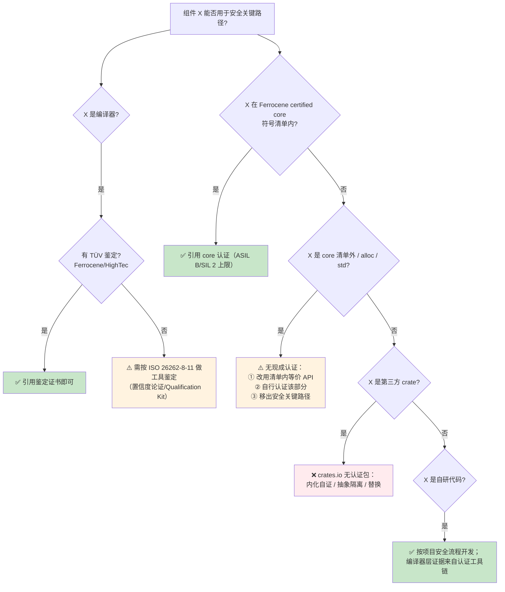
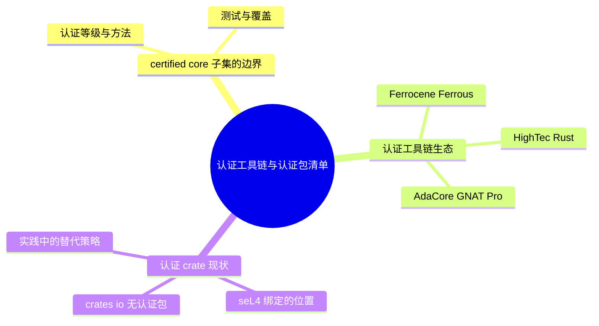

# 认证工具链与认证包清单

> **EN**: Certified Toolchains and Certified Package Inventory
> **Summary**: Inventory of safety-certified Rust toolchains (Ferrocene, HighTec, AdaCore GNAT Pro for Rust), the boundary of Ferrocene's certified core subset, the current status of certified crates (none on crates.io), and a decision tree for the certified vs. non-certified boundary in safety-critical projects.
> **Rust 版本**: 1.97.0+ (Edition 2024)
> **受众**: [专家]
> **内容分级**: [专家级]
> **Bloom 层级**: L4-L6
> **权威来源**: 本文件为 `concept/` 中**认证工具链生态与认证包清单**的权威页；Ferrocene 产品本身的深度说明见 [Ferrocene：已交付的 Rust 安全关键认证工具链](../../07_future/02_preview_features/12_ferrocene_preview.md)。
> **A/S/P 标记**: **S** — Structure
> **双维定位**: P×Eva — 认证边界评估与供应链选型
> **前置概念**: [Ferrocene](../../07_future/02_preview_features/12_ferrocene_preview.md) · [验证工具链](01_verification_toolchain.md) · [航空航天认证与形式化方法](03_aerospace_certification_formal_methods.md) · [Unsafe Rust](../../03_advanced/02_unsafe/01_unsafe.md)
> **后置概念**: [安全关键 Rust 专题索引](../../06_ecosystem/11_domain_applications/21_safety_critical_topic_index.md) · [cargo vet 与供应链审计](../../06_ecosystem/07_security_and_cryptography/03_cargo_vet_supply_chain.md)
>
> **来源**: [Ferrocene Core Library Certification](https://public-docs.ferrocene.dev/main/certification/core/index.html)（2026-07-12 curl 实测） · [Ferrocene Qualification Report](https://public-docs.ferrocene.dev/main/qualification/report/index.html) · [HighTec 新闻稿（TÜV NORD ASIL D，2025-07-10）](https://www.presseagentur.com/hightec/detail.php?pr_id=7417&lang=en) · [AdaCore GNAT Pro for Rust](https://www.adacore.com/gnatpro-rust) · [Safety-Critical Rust Consortium](https://rustfoundation.org/safety-critical-rust-consortium/)
> **国际权威来源（2026-07-13 补录）**: **P0** [Ferrocene Language Specification](https://spec.ferrocene.dev/)（curl 200 实测 2026-07-13） · **P1** [Ho & Protzenko — Aeneas: Rust Verification by Functional Translation（ICFP 2022, arXiv:2206.07185）](https://arxiv.org/abs/2206.07185)（认证/验证工具链的学术基础，curl 200 实测）

---

## 📑 目录

- [认证工具链与认证包清单](#认证工具链与认证包清单)
  - [📑 目录](#-目录)
  - [一、概念框架：鉴定、认证与 SEooC](#一概念框架鉴定认证与-seooc)
  - [二、certified core 子集的边界](#二certified-core-子集的边界)
    - [2.1 认证等级与方法](#21-认证等级与方法)
    - [2.2 符号级清单与未认证代码](#22-符号级清单与未认证代码)
    - [2.3 测试与覆盖](#23-测试与覆盖)
  - [三、认证工具链生态](#三认证工具链生态)
    - [3.1 Ferrocene（Ferrous Systems）](#31-ferroceneferrous-systems)
    - [3.2 HighTec Rust Development Platform（AURIX）](#32-hightec-rust-development-platformaurix)
    - [3.3 AdaCore GNAT Pro for Rust](#33-adacore-gnat-pro-for-rust)
    - [3.4 三者对比](#34-三者对比)
  - [四、认证 crate 现状](#四认证-crate-现状)
    - [4.1 crates.io：无认证包](#41-cratesio无认证包)
    - [4.2 seL4 绑定的位置](#42-sel4-绑定的位置)
    - [4.3 实践中的替代策略](#43-实践中的替代策略)
  - [五、认证 vs 非认证边界决策树](#五认证-vs-非认证边界决策树)
  - [六、权威来源索引](#六权威来源索引)
  - [相关概念](#相关概念)
  - [⚠️ 反例与陷阱](#️-反例与陷阱)
    - [反例：forbid 策略下的 `unsafe` 块（rustc 1.97.0 实测）](#反例forbid-策略下的-unsafe-块rustc-1970-实测)
    - [✅ 修正：安全 API 或显式缩小策略范围](#-修正安全-api-或显式缩小策略范围)

---

## 一、概念框架：鉴定、认证与 SEooC

安全关键语境下三个常被混用的术语：

| 术语 | 对象 | 含义 | Rust 实例 |
|:---|:---|:---|:---|
| **Qualification（工具鉴定）** | 开发工具（编译器等） | 证明工具引入缺陷的风险已受控；按 ISO 26262-8-11 的 TCL/TD 分级 | Ferrocene / HighTec 对 rustc 的 TÜV 鉴定 |
| **Certification（产品认证）** | 交付软件（库、组件） | 软件本身按安全标准开发并通过评估 | Ferrocene certified core 子集 |
| **SEooC（Safety Element out of Context）** | 脱离具体系统上下文开发的软件元素 | 假设一组安全需求，供系统集成者裁剪引用 | certified core 正是 SEooC |

> **关键洞察**：编译器鉴定不等于库认证，库认证不等于应用认证。三层证据各自独立，项目安全案例必须逐层引用。

---

## 二、certified core 子集的边界

Ferrocene 是当前唯一公开**符号级认证清单**的 Rust 库认证案例，其边界划分方式具有行业参考价值（以下均来自 Core Library Certification 文档，2026-07-12 实测）。

### 2.1 认证等级与方法

| 标准 | 等级 | 评估方法 |
|:---|:---|:---|
| IEC 61508:2010 | SIL 2 | Route 3S（非合规开发评估，§7.4.2.12） |
| ISO 26262:2018 | ASIL B | SEooC 软件产品开发，按 -2/-6/-8 裁剪 |

认证版本与上游 rustc 绑定：开发分支当前 certified core 版本为 **1.98.0**；Ferrocene 26.02.0 发布版的 core 子集对应 rustc 1.92（见 [Ferrocene 页](../../07_future/02_preview_features/12_ferrocene_preview.md) §2.2）。

### 2.2 符号级清单与未认证代码

- 认证**不覆盖整个 core 库**，而是其中明确列出的子集——目的是控制认证工作量。子集定义在 Safety Manual 中，完整符号清单公开在 Safety Report。
- 清单粒度为**单个符号**（如 `<&T as core::fmt::Debug>::fmt`、`core::unicode::unicode_data::white_space::lookup`）：开发分支（core 1.98.0）当前列出 **8,866 个认证符号**（2026-07-12 对公开文档实测计数）。
- 子集内所有公开函数都被视为"软件安全函数"，统一认证到最高声明等级，不做独立性论证。
- **未认证与未使用代码**有专章管理：coretests 中未认证函数的测试仍会执行（防止回归），但这些函数不带认证证据。

### 2.3 测试与覆盖

- 主要测试套件为上游 **coretests**，pass/fail 准则由其定义。
- 代码覆盖率仅在 `x86_64-unknown-linux-gnu` 一个平台测量——理由是认证子集只含平台无关代码，覆盖率用于衡量测试套件质量，正确性则由全部合格目标上的测试运行保证。
- `*-ferrocene-*` target 提供**认证的最小 panic 实现**，使裸机目标的 panic 路径也落在认证边界内。

---

## 三、认证工具链生态

本节盘点三条认证工具链路线：3.1–3.3 分别介绍 Ferrocene、HighTec 与 AdaCore，3.4 给出三者在认证范围与目标平台上的对比。

### 3.1 Ferrocene（Ferrous Systems）

- TÜV SÜD 鉴定编译器：ISO 26262 ASIL D、IEC 61508 SIL 3、IEC 62304 Class C；certified core 子集 ASIL B / SIL 2。
- 开源 + 商业订阅；季度发行；当前 26.02.0（基于 rustc 1.92）。
- 深度说明见 [Ferrocene 权威页](../../07_future/02_preview_features/12_ferrocene_preview.md)。

### 3.2 HighTec Rust Development Platform（AURIX）

- **定位**：面向 Infineon AURIX TC3x/TC4x 微控制器的 Rust 开发平台；HighTec 是**首个为 AURIX 提供 ISO 26262 认证 Rust 编译器**的厂商（2024-05 随英飞凌 AURIX Rust 生态发布）。
- **认证**：Rust 编译器 ISO 26262 ASIL D 认证；其 TriCore C/C++ 编译器 9.1.2 于 2025-07-10 获 **TÜV NORD** ASIL D 认证——C/C++ 与 Rust 共用 LLVM 后端、链接器与构建基础设施，支持混合语言（hybrid）开发：把网络安全关键模块用 Rust 重写、其余保留 C/C++，无需拆分工具链或重复鉴定。
- **配套**：预配置 `cargo build` 系统、AURIX I/O 库与驱动、Rust 运行时、C/C++ 混合集成示例；与安全认证 RTOS **PXROS-HR**（ISO 26262 ASIL D / IEC 61508 SIL 3 认证）集成；英飞凌 TC37x PAC、Bluewind 驱动、Lauterbach/PLS 调试工具链。
- **来源**：HighTec 新闻稿 2025-07-10（TÜV NORD 认证）、英飞凌新闻稿 2024-05-08（AURIX Rust 生态），均 2026-07-12 检索核实。

### 3.3 AdaCore GNAT Pro for Rust

- AdaCore 的商业 Rust 工具链产品（GNAT Pro 家族，与 Ada/SPARK、C/C++ 并列），面向航空、汽车、国防、医疗、轨交等 AdaCore 传统受监管行业（adacore.com/gnatpro-rust，2026-07-12 curl 实测可达）。
- 公开页面未声明 TÜV 鉴定等级；其价值主张是 AdaCore 在受监管行业的长期支持（LTS）、服务与流程合规经验。需要鉴定证据的项目应向厂商索取 Qualification Kit。
- AdaCore 同时是 SCRC 创始成员，参与编码指南与工具子委员会。

### 3.4 三者对比

| 维度 | Ferrocene | HighTec Rust | AdaCore GNAT Pro for Rust |
|:---|:---|:---|:---|
| 鉴定/认证机构 | TÜV SÜD | TÜV NORD（C/C++ 侧；Rust 编译器 ISO 26262 ASIL D） | 未公开声明 |
| 编译器等级 | ISO 26262 ASIL D / IEC 61508 SIL 3 / IEC 62304 Class C | ISO 26262 ASIL D（AURIX） | — |
| 库认证 | core 子集 ASIL B / SIL 2（符号级清单） | 未公开 | 未公开 |
| 目标平台 | Armv8-A/Armv7E-M/Armv7-R；Linux/QNX/裸机 | AURIX TC3x/TC4x（TriCore） | 未公开 |
| 上游对应 | rustc 1.92（26.02.0） | 未公开 | 未公开 |
| 差异化 | 唯一公开全套证据文档；开源 | AURIX 专用、C/Rust 统一 LLVM 工具链、PXROS-HR | 受监管行业 LTS 与服务 |
| SCRC 成员 | ✅（Ferrous Systems 创始成员） | ✅（创始成员） | ✅（创始成员） |

> 表中"未公开"指截至 2026-07-12 公开渠道未见相应声明，不代表不存在；采购时应以厂商 Qualification Kit 为准。

---

## 四、认证 crate 现状

本节考察认证 crate 侧的现状：4.1 说明 crates.io 尚无认证包，4.2 定位 seL4 绑定的位置，4.3 给出实践中的替代策略。

### 4.1 crates.io：无认证包

截至 2026-07-12，**crates.io 上没有任何 crate 获得 ISO 26262 / IEC 61508 / DO-178C 认证**。原因结构性：

- 认证按"版本冻结 + 完整证据包"收费，与 crates.io 的快速迭代模式冲突；
- 单个 crate 的认证费用（估数十万欧元量级）远超大多数开源维护者的承担能力；
- 安全案例需要的是"需求—实现—测试"追溯链，而多数 crate 没有需求文档。

因此认证边界目前止步于**编译器 + core 子集**；`alloc`、`std` 与全部第三方 crate 均在边界外。

### 4.2 seL4 绑定的位置

seL4 微内核本身有 Isabelle/HOL 形式化证明（功能正确性、安全属性），其 Rust 绑定（rust-sel4 生态）让 Rust 成为 seL4 用户态的一等语言。但注意层次：

- seL4 的证明覆盖**内核二进制**，不覆盖 Rust 绑定层；
- rust-sel4 绑定 crate **未获**功能安全标准认证；
- 组合使用时，安全案例可引用 seL4 的形式化证明，但绑定层与 Rust 工具链仍需按项目标准另行论证（可叠加 Ferrocene 解决编译器层）。

### 4.3 实践中的替代策略

| 策略 | 说明 | 适用 |
|:---|:---|:---|
| **QM 阶段先用后清** | 原型期自由使用 crates.io，进入 ASIL 阶段前替换/内化 | Vision Doc 访谈中的汽车 OEM 模式 |
| **抽象隔离层** | 第三方 crate 包在可替换接口后，安全路径不直接依赖 | ASIL B+ 的依赖管控 |
| **内部化（fork + 自证）** | 把依赖 vendored 进仓库，自行执行需求追溯与测试 | 小规模关键依赖 |
| **供应链审计** | `cargo vet` 共享审计 + `cargo audit` 漏洞跟踪（非功能安全认证，但提供安全审查证据） | 见 [cargo vet 页](../../06_ecosystem/07_security_and_cryptography/03_cargo_vet_supply_chain.md) |

---

## 五、认证 vs 非认证边界决策树



> **边界要点**：「用了认证编译器」只解决工具层；「用了 certified core」只解决清单内 API；真正的系统级 ASIL/SIL 认证永远发生在**项目集成层**——认证工具链提供的是可引用的底层证据，不是系统合格证。

---

## 六、权威来源索引

| 来源 | 可信度 | 说明 |
|:---|:---:|:---|
| [Ferrocene Core Library Certification](https://public-docs.ferrocene.dev/main/certification/core/index.html) | ✅ 一级 | core 子集认证范围、方法、符号清单（2026-07-12 实测） |
| [Ferrocene Qualification Report](https://public-docs.ferrocene.dev/main/qualification/report/index.html) | ✅ 一级 | 编译器鉴定证据、平台矩阵 |
| [HighTec 新闻稿 2025-07-10](https://www.presseagentur.com/hightec/detail.php?pr_id=7417&lang=en) | ✅ 一级 | TÜV NORD ASIL D 认证、C/Rust 统一工具链、PXROS-HR |
| [英飞凌 AURIX Rust 生态新闻稿 2024-05-08](https://www.infineon.com/cms/cn/about-infineon/press/market-news/2024/INFATV202404-089.html) | ✅ 一级 | 首个 AURIX ISO 26262 ASIL D Rust 编译器 |
| [AdaCore GNAT Pro for Rust](https://www.adacore.com/gnatpro-rust) | ✅ 一级 | 商业 Rust 工具链产品页 |
| [Safety-Critical Rust Consortium](https://rustfoundation.org/safety-critical-rust-consortium/) | ✅ 一级 | 行业治理与编码指南 |
| [Rust Blog — What does it take to ship Rust in safety-critical?](https://blog.rust-lang.org/) | ✅ 一级 | Vision Doc 落地张力分析 |

---

## 相关概念

- [Ferrocene：已交付的 Rust 安全关键认证工具链](../../07_future/02_preview_features/12_ferrocene_preview.md) — Ferrocene 产品深度页
- [AUTOSAR 与 Rust](../../06_ecosystem/11_domain_applications/22_autosar_and_rust.md) — 汽车软件标准中的 Rust 路径
- [验证工具链](01_verification_toolchain.md) — 验证工具全景
- [航空航天认证与形式化方法](03_aerospace_certification_formal_methods.md) — DO-178C/DO-333 映射
- [安全关键 Rust 专题索引](../../06_ecosystem/11_domain_applications/21_safety_critical_topic_index.md) — content/ 工程套件入口
- [cargo vet 与供应链审计](../../06_ecosystem/07_security_and_cryptography/03_cargo_vet_supply_chain.md) — 非认证场景的依赖审查机制

## ⚠️ 反例与陷阱

本节以 `#![forbid(unsafe_code)]` 策略为反例，展示认证子集如何用编译器属性强制安全边界。

### 反例：forbid 策略下的 `unsafe` 块（rustc 1.97.0 实测）

```rust,compile_fail
#![forbid(unsafe_code)]
fn main() {
    let x = 1;
    let p = &x as *const i32;
    unsafe { println!("{}", *p); } // ❌ crate 级策略禁止 unsafe
}
```

**错误**：`error: usage of an unsafe block`——认证工程用 `#![forbid(unsafe_code)]` 把安全子集变成编译期硬约束。

### ✅ 修正：安全 API 或显式缩小策略范围

```rust
#![forbid(unsafe_code)]
fn main() {
    let x = 1;
    let r = &x; // 安全引用即可
    println!("{}", r);
}
```

---

## 🧭 思维导图（Mindmap）



> **认知功能**: 本 mindmap 从本页「认证工具链与认证包清单」的章节结构提炼，一级分支对应核心主题，叶子节点为关键子概念，可作为本页的快速导航与复习索引。
