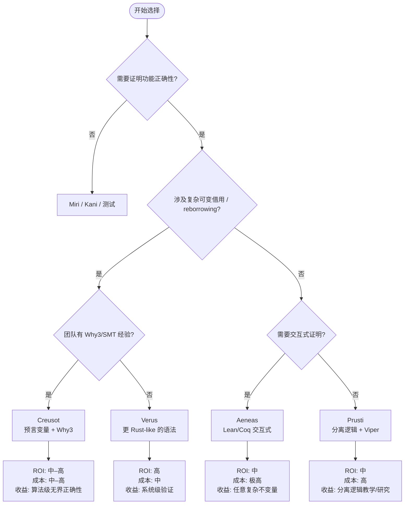
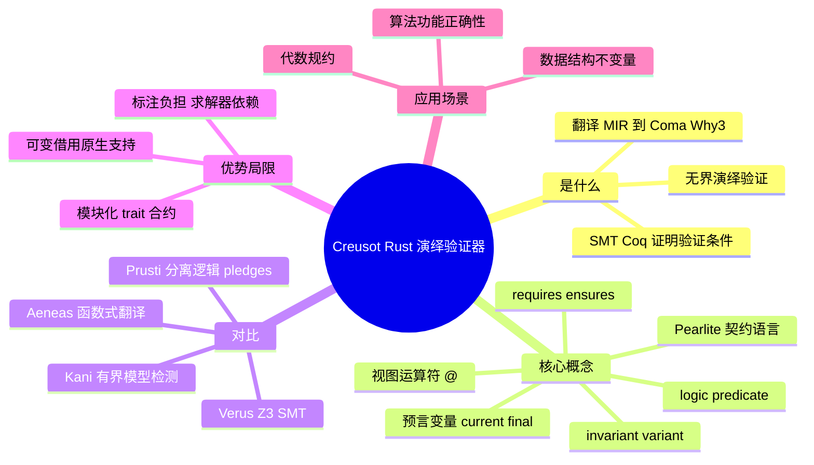

> **内容分级**: [专家级]
>
> **本节关键术语**: Creusot · Why3 · Coma · Pearlite · 演绎验证（Deductive Verification） · 预言变量（Prophecy Variables） · 视图运算符（View Operator） · 函数契约（Function Contracts） · 循环不变量（Loop Invariants） — [完整对照表](../../00_meta/01_terminology/01_terminology_glossary.md)

# Creusot：基于 Why3 的 Rust 演绎验证器

> **EN**: Creusot: Rust Deductive Verifier on Why3
> **Summary**: Creusot is an INRIA-developed deductive verifier for Rust that translates MIR to the Coma/Why3 intermediate language and discharges verification conditions via SMT solvers, using prophecy variables to model mutable borrows.
> **Rust 版本**: 1.97.0+ (Edition 2024)
> **受众**: [研究者]
> **Bloom 层级**: L4-L5
> **权威来源**: 本文件为 `concept/` 权威页。
> **A/S/P 标记**: **P** — Professional / Expert
> **双维定位**: T×Fml — 工具链与形式化验证
> **定位**:
> 将 Creusot 从学术研究工具还原为算法与数据结构功能正确性验证的可选工具，理解其与 Kani/Verus/Prusti/Aeneas 的边界。
> 学习本页前应先掌握 L3 [Unsafe Rust](../../03_advanced/02_unsafe/01_unsafe.md) 与 L4 [Ownership Formalization](../01_ownership_logic/02_ownership_formal.md) 的基础。
> **前置概念**:
> [Verification Toolchain](01_verification_toolchain.md) ·
> [现代验证工具生态](04_modern_verification_tools.md) ·
> [Ownership](../../01_foundation/01_ownership_borrow_lifetime/01_ownership.md) ·
> [Borrowing](../../01_foundation/01_ownership_borrow_lifetime/02_borrowing.md) ·
> [Unsafe Rust](../../03_advanced/02_unsafe/01_unsafe.md)
> **后置概念**: [Kani](09_kani.md) · [Miri](08_miri.md) · [AutoVerus](07_autoverus.md)

---

> **来源**:
> [Creusot 官方文档](https://creusot.rs/) · [Creusot Project Site](https://creusot-rs.github.io/) ·
> [Creusot GitHub](https://github.com/creusot-rs/creusot) · [Creusot User Guide](https://guide.creusot.rs/) ·
> [Why3 Platform](http://why3.lri.fr/) ·
> [Denis et al., ICFEM 2022 — Creusot: A Foundry for the Deductive Verification of Rust Programs](https://doi.org/10.1007/978-3-031-17244-1_9) ·
> [Denis & Jourdan, PLDI 2023 — COMeT](https://pldi23.sigplan.org/details/pldi-2023-pldi/64/Flux-Liquid-Types-for-Rust) ·
> [Matsushita et al. — RustHorn (PLDI 2020)](https://doi.org/10.1145/3385412.3386022) ·
> [Rust Reference](https://doc.rust-lang.org/reference/introduction.html)

---

## 📑 目录

- [Creusot：基于 Why3 的 Rust 演绎验证器](#creusot基于-why3-的-rust-演绎验证器)
  - [📑 目录](#-目录)
  - [一、Creusot 是什么](#一creusot-是什么)
    - [1.1 工作流程：从 Rust MIR 到 Coma/Why3](#11-工作流程从-rust-mir-到-comawhy3)
    - [1.2 与 Kani、Verus、Prusti、Aeneas 的定位差异](#12-与-kaniverusprustiaeneas-的定位差异)
  - [二、安装与基本用法](#二安装与基本用法)
    - [安装](#安装)
    - [验证命令](#验证命令)
  - [三、核心概念](#三核心概念)
    - [3.1 Pearlite：Rust 风格的契约语言](#31-pearliterust-风格的契约语言)
    - [3.2 视图运算符 `@`](#32-视图运算符-)
    - [3.3 预言变量：`*x` 当前值与 `^x` 最终值](#33-预言变量x-当前值与-x-最终值)
    - [3.4 函数契约：`#[requires]` / `#[ensures]`](#34-函数契约requires--ensures)
    - [3.5 循环不变量：`#[invariant]`](#35-循环不变量invariant)
    - [3.6 终止性：`#[variant]` 与 `#[check(terminates)]`](#36-终止性variant-与-checkterminates)
    - [3.7 逻辑函数与谓词：`#[logic]` / `#[predicate]`](#37-逻辑函数与谓词logic--predicate)
    - [3.8 Ghost 所有权与 unsafe 代码验证](#38-ghost-所有权与-unsafe-代码验证)
  - [四、可运行示例](#四可运行示例)
    - [示例 1：无溢出加法](#示例-1无溢出加法)
    - [示例 2：可变借用的预言](#示例-2可变借用的预言)
    - [示例 3：带终止性的三角数求和](#示例-3带终止性的三角数求和)
  - [五、Prusti vs Aeneas vs Creusot](#五prusti-vs-aeneas-vs-creusot)
  - [六、优势与局限](#六优势与局限)
  - [七、选型决策](#七选型决策)
  - [八、权威来源索引](#八权威来源索引)
  - [相关工具交叉索引](#相关工具交叉索引)
  - [嵌入式测验（Embedded Quiz）](#嵌入式测验embedded-quiz)
    - [测验 1：Creusot 的核心验证范式是什么？（理解层）](#测验-1creusot-的核心验证范式是什么理解层)
    - [测验 2：`^x` 在 Creusot 中表示什么？（理解层）](#测验-2x-在-creusot-中表示什么理解层)
    - [测验 3：何时优先选择 Creusot 而非 Kani？（评价层）](#测验-3何时优先选择-creusot-而非-kani评价层)
  - [⚠️ 反例与陷阱](#️-反例与陷阱)
    - [反例：未限制前置条件导致溢出验证失败](#反例未限制前置条件导致溢出验证失败)
    - [✅ 修正：显式 `requires` 边界](#-修正显式-requires-边界)
  - [🧭 思维导图（Mindmap）](#-思维导图mindmap)

---

## 一、Creusot 是什么

**Creusot** 是 INRIA 开发并开源的 **Rust 演绎验证器（deductive verifier）**。
它将 Rust 程序的 MIR（中级中间表示）翻译为 **Coma**（Why3 平台的中间验证语言），再借助 Why3 生成验证条件（Verification Conditions, VC），最终由 SMT 求解器（Alt-Ergo、Z3、CVC4 等）或 Coq 交互式证明器自动/半自动地 discharge 这些条件。
(Source: [Creusot 官方文档](https://creusot.rs/))

> **关键洞察**: Creusot 不是测试框架，也不是模型检查器，而是**契约驱动的演绎验证器**。
> 它回答的问题是："对于所有满足前置条件的输入，该函数是否永远不会 panic、溢出、违反断言，并且满足后置条件？"
>
> 与 Kani 的有界模型检测不同，Creusot 的结论是**无界的**——只要循环不变量、终止度量与函数契约成立，结论对所有输入和路径有效。

### 1.1 工作流程：从 Rust MIR 到 Coma/Why3

```text
Rust 源码 + Pearlite 契约
        ↓
   rustc MIR
        ↓
   Creusot 前端
        ↓
   Coma（Continuation-Oriented Metalanguage for Asserting）
        ↓
   Why3 平台
        ↓
   验证条件（VC）
        ↓
   SMT 求解器（Alt-Ergo / Z3 / CVC4）或 Coq
        ↓
   证明成功 / 反例 / 待人工介入
```

**Coma 中间语言**是 Creusot 2023 年后引入的核心创新（替代早期 Goto 风格翻译），其贡献包括：

1. **模块化验证**：每个函数独立生成一个 Why3 module，调用者无需内联被调用函数；
2. **Trait 合约传播**：`#[requires]`/`#[ensures]` 可附加到 trait 定义，自动约束所有实现；
3. **可变借用精确建模**：通过预言变量（prophecy variables）将 `&mut T` 编码为"当前值 + 最终值"对，避免完整分离逻辑的繁重推理。 (Source: [Denis & Jourdan, PLDI 2023](https://pldi23.sigplan.org/details/pldi-2023-pldi/64/Flux-Liquid-Types-for-Rust))

### 1.2 与 Kani、Verus、Prusti、Aeneas 的定位差异

| 工具 | 方法 | 覆盖范围 | 主要优势 | 主要局限 |
|:---|:---|:---|:---|:---|
| **Creusot** | 演绎验证（Why3/Coma） | 无界 | 可变借用预言建模、代数推理强、trait 合约模块化 | 标注负担中高、Why3 求解器调参、并发支持有限 |
| **Kani** | 有界模型检测（CBMC） | 有界 | 易上手、自动化 harness、找反例强 | 有界、循环需展开或合约、不支持 async |
| **Verus** | 演绎验证（Z3 SMT） | 无界 | Rust-like spec 语法、并发/线性幽灵类型 | 学习曲线陡峭、对复杂 trait bound 支持受限 |
| **Prusti** | 分离逻辑（Viper） | 无界 | 分离逻辑推理自然、堆内存建模成熟 | 标注负担高、reborrowing 与闭包支持有限 |
| **Aeneas** | 函数式翻译（Lean/Coq/F*） | 无界 | 可处理复杂算法与数据结构不变量 | 手动交互式证明、证明负担极高 |

> **选择建议**:
>
> - 需要验证 **算法功能正确性**（排序、搜索、图算法） → Creusot；
> - 需要验证 **unsafe 低层指针操作** → Verus（线性幽灵）或 Miri（动态）+ Creusot（ghost ownership 新功能）；
> - 需要 **快速找反例** 或 **安全关键组件** → Kani；
> - 需要 **教学/研究/复杂不变量** → Aeneas。
>
> (Source: [Surveying the Rust Verification Landscape](https://arxiv.org/abs/2410.01981))

---

## 二、安装与基本用法

### 安装

Creusot 依赖 Rust 工具链与 OCaml/Why3 生态，推荐通过 `opam` 安装：

```bash
# 1. 安装 opam（OCaml 包管理器）并初始化
#    参见 https://opam.ocaml.org/doc/Install.html

# 2. 克隆 Creusot
git clone https://github.com/creusot-rs/creusot
cd creusot

# 3. 运行安装脚本（安装 Why3、Alt-Ergo 等依赖并构建 Creusot）
./INSTALL

# 4. 验证安装
cargo creusot --help
```

### 验证命令

```bash
# 在当前 crate 上运行 Creusot（生成 Coma 并调用 Why3）
cargo creusot

# 仅生成 Coma 文件，不调用求解器（用于语法/契约检查）
cargo creusot --only=coma

# 启动 Why3 IDE 检查未证明目标
cargo creusot -i

# 创建新项目（自动生成 Cargo.toml 与 why3find.json）
cargo creusot new my-verified-crate
```

> **注意**: Creusot 宏与 `creusot_std::prelude::*` 只在验证模式下解析；普通 `cargo build/test` 会擦除（erase）所有契约，不影响运行时行为。

---

## 三、核心概念

### 3.1 Pearlite：Rust 风格的契约语言

**Pearlite** 是 Creusot 的规范语言，语法接近 Rust 的纯函数子集，但增加了：

- 量词 `forall` / `exists`
- 逻辑相等 `equals`
- 当前/最终借用运算符 `*` / `^`
- 视图运算符 `@`

Pearlite 表达式中**不能创建可变绑定**，也不能进行借用（borrowing）——它只描述逻辑性质，不操作运行时资源。

### 3.2 视图运算符 `@`

`x@` 将 Rust 运行时值映射到逻辑世界的数学对象：

- `i64` → `Int`（无界整数）
- `u32` → `Int`
- `Vec<T>` → `Seq<T@>`（数学序列）
- `&[T]` → `Seq<T@>`

> **关键洞察**: `@` 消解了机器整数溢出与数学推理之间的矛盾。在契约中写 `x@ + 1` 总是合法的，因为 `Int` 无界；而 `x + 1` 在 Rust 中可能溢出。

### 3.3 预言变量：`*x` 当前值与 `^x` 最终值

Creusot 对可变借用 `&mut T` 的核心建模来自 **RustHorn**：每个借用被表示为一个二元组 `{ current: T; final: T }`。

- `*x`：借用的**当前值**（current value），即解引用；
- `^x`：借用的**最终值**（final / prophetic value），即借用结束时被借出方将拥有的值。

当借用结束时，预言被"解决"（resolve），最终值与借用实际持有的值统一。这一机制避免了传统分离逻辑中对堆权限的显式推理。

```rust,ignore
// 选择两个可变借用之一返回
// ^y == *y 表示：未被选中的借用最终值与其初始值相同
#[ensures(
    if b { result == x && ^y == *y }
    else { result == y && ^x == *x }
)]
pub fn choose<'a, T>(b: bool, x: &'a mut T, y: &'a mut T) -> &'a mut T {
    if b { x } else { y }
}
```

> (Source: [Creusot 官方文档](https://creusot.rs/))

### 3.4 函数契约：`#[requires]` / `#[ensures]`

与 Prusti、Verus 类似，Creusot 通过前置/后置条件描述函数行为：

```rust,ignore
use creusot_contracts::*;

#[requires(vec@.len() < usize::MAX@)]
#[ensures(result@ == vec@.len())]
pub fn vec_len<T>(vec: &Vec<T>) -> usize {
    vec.len()
}
```

- `#[requires(...)]`：调用者必须满足的前置条件；
- `#[ensures(...)]`：函数返回时必须满足的后置条件，可用 `result` 指代返回值。

### 3.5 循环不变量：`#[invariant]`

Creusot 无法自动推断循环不变量，需显式标注：

```rust,ignore
#[requires(n@ * (n@ + 1) / 2 <= u64::MAX@)]
#[ensures(result@ == n@ * (n@ + 1) / 2)]
pub fn sum_up_to(n: u64) -> u64 {
    let mut sum = 0;
    let mut i = 0;
    #[invariant(i@ <= n@)]
    #[invariant(sum@ == i@ * (i@ + 1) / 2)]
    while i < n {
        i += 1;
        sum += i;
    }
    sum
}
```

> **设计要点**: 循环不变量必须同时满足：
>
> 1. **初始化**：进入循环前成立；
> 2. **保持**：每次迭代后仍成立；
> 3. **充分**：与循环退出条件结合后能推出后置条件。

### 3.6 终止性：`#[variant]` 与 `#[check(terminates)]`

Creusot 可证明递归函数与循环的终止性：

```rust,ignore
#[check(terminates)]
#[requires(n@ * (n@ + 1) / 2 <= u32::MAX@)]
#[ensures(result@ == n@ * (n@ + 1) / 2)]
pub fn sum_first_n(n: u32) -> u32 {
    let mut sum = 0;
    let mut i = 0;
    #[variant(n@ - i@)]      // 每次迭代严格递减的非负量
    #[invariant(sum@ == i@ * (i@ + 1) / 2)]
    #[invariant(i@ <= n@)]
    while i < n {
        i += 1;
        sum += i;
    }
    sum
}
```

### 3.7 逻辑函数与谓词：`#[logic]` / `#[predicate]`

```rust,ignore
// 逻辑函数：在契约中可用，运行时被擦除
#[logic(open)]
pub fn is_sorted(s: Seq<u64>) -> bool {
    pearlite! {
        forall<i: Int, j: Int>
            0 <= i && i < j && j < s.len()
            ==> s[i] <= s[j]
    }
}

#[ensures(is_sorted((^s)@))]
#[ensures((^s)@.permutation_of((*s)@))]
pub fn sort(s: &mut [u64]) {
    // ...
}
```

### 3.8 Ghost 所有权与 unsafe 代码验证

早期 Creusot 主要针对 safe Rust；近期通过**线性 ghost 类型**（linear ghost types）扩展了对 `unsafe`、原始指针、内部可变性的支持。其思路与 Verus 的 `Tracked<T>` 类似：在证明中携带不可运行的权限信息，运行时完全擦除。

```rust,ignore
// 链表节点的 ghost 权限示例（简化）
pub struct List<T> {
    first: *const Link<T>,
    last: *const Link<T>,
    seq: Ghost<Seq<Box<Perm<*const Link<T>>>>>, // 仅用于验证
}
```

> (Source: [verify-rust-std Creusot issue](https://github.com/model-checking/verify-rust-std/issues/493))

---

## 四、可运行示例

以下示例使用实际 Creusot 语法，但因项目未安装 Creusot/Why3，代码块标记为 `ignore`，普通 `cargo build` 不会编译它们。

### 示例 1：无溢出加法

```rust,ignore
use creusot_contracts::*;

#[requires(x@ < i64::MAX@)]
#[ensures(result@ == x@ + 1)]
pub fn add_one(x: i64) -> i64 {
    x + 1
}
```

**验证目标**：在前置条件成立时，`x + 1` 不会溢出，且结果等于数学上的 `x + 1`。

### 示例 2：可变借用的预言

```rust,ignore
use creusot_contracts::*;

// 将 x 增加 n，保持 y 不变
#[requires(n@ >= 0)]
#[ensures(^x == *x + n@)]
#[ensures(^y == *y)]
pub fn increment_by(x: &mut i64, y: &mut i64, n: i64) {
    *x += n;
}
```

**关键理解**：`^x == *x + n@` 预言了借用 `x` 在函数结束时的最终值，而 `^y == *y` 保证了未修改的借用 `y` 保持不变。

### 示例 3：带终止性的三角数求和

```rust,ignore
use creusot_contracts::*;

#[check(terminates)]
#[requires(n@ * (n@ + 1) / 2 <= u64::MAX@)]
#[ensures(result@ == n@ * (n@ + 1) / 2)]
pub fn sum_up_to(n: u64) -> u64 {
    let mut sum = 0;
    let mut i = 0;
    #[variant(n@ - i@)]
    #[invariant(i@ <= n@)]
    #[invariant(sum@ == i@ * (i@ + 1) / 2)]
    while i < n {
        i += 1;
        sum += i;
    }
    sum
}
```

---

## 五、Prusti vs Aeneas vs Creusot

三者都是 Rust 的演绎/半自动验证工具，但理论基础与适用场景差异显著：

| 维度 | Prusti | Aeneas | Creusot |
|:---|:---|:---|:---|
| **形式化基础** | 分离逻辑（Viper IL） | 函数式翻译 + 交互式证明 | 最弱前置条件 + Why3/Coma |
| **可变借用建模** | Pledges（承诺） | 线性状态传递 | **Prophecies（预言变量）** |
| **自动化程度** | 半自动（SMT） | 手动（Coq/Lean） | 半自动（SMT/Coq） |
| **Reborrowing / 循环借用** | 支持有限 | 较灵活 | **原生支持** |
| **Trait/泛型验证** | 有限 | 支持 | **Coma 模块化 + trait 合约** |
| **证明负担** | 高 | 极高 | 中高 |
| **最佳场景** | 教学、分离逻辑研究 | 复杂数据结构完全形式化 | 算法功能正确性、代数规约 |

> **关键洞察**: Prusti 用 **pledges** 描述可变借用的未来义务，Creusot 用 **prophecies** 描述可变借用的最终值，Aeneas 则将 `&mut T` 完全翻译为 `T → T` 的纯函数。三种方法在理论上等价，但工程实现与可用性子集差异显著。 (Source: [Surveying the Rust Verification Landscape](https://arxiv.org/abs/2410.01981))

---

## 六、优势与局限

| 优势 | 说明 |
|:---|:---|
| **可变借用原生支持** | 预言变量编码使 `&mut T`、reborrowing、嵌套引用无需显式分离逻辑 |
| **模块化验证** | Coma 保证每个函数独立验证，泛型与 trait 合约自动传播 |
| **Why3 生态成熟** | 可直接利用 Why3 的 SMT/Coq 后端、IDE、证明策略库 |
| **终止性证明** | 原生支持 variant 与 `#[check(terminates)]` |
| **学术验证案例** | CreuSAT（已验证 SAT 求解器）、Sprout（SMT 求解器）等 |

| 局限 | 说明 |
|:---|:---|
| **标注负担** | 每个循环、递归函数、复杂函数都需要手动契约 |
| **求解器依赖** | 复杂量化、非线性算术、除法可能让 SMT 超时，需 Why3 IDE 人工介入 |
| **并发支持有限** | 主要针对顺序 Rust；并发/异步支持仍处于研究阶段 |
| **标准库覆盖** | 部分 `std` API 的规范仍在完善，未覆盖的 API 需用户手写 stub |
| **安装复杂** | 依赖 Rust + OCaml/opam + Why3 + 求解器，环境配置门槛高于 Kani |
| **unsafe 支持较新** | 线性 ghost 类型对 `unsafe` 的支持仍在快速演进，文档与示例有限 |

---

## 七、选型决策



> **使用建议**: Creusot 最适合 **safe Rust 算法与数据结构** 的功能正确性验证，尤其是涉及可变借用、trait 合约、代数规约的场景。若团队无形式化背景，建议先从 Kani 入门，再评估是否需要 Creusot 的无界保证。

---

## 八、权威来源索引

| 来源 | 可信度 | 说明 |
|:---|:---:|:---|
| [Creusot 官方文档](https://creusot.rs/) | ✅ 一级 | 功能、安装、示例、项目链接 |
| [Creusot User Guide](https://guide.creusot.rs/) | ✅ 一级 | 从零开始的教程、Pearlite 语法、Why3 IDE |
| [Creusot GitHub](https://github.com/creusot-rs/creusot) | ✅ 一级 | 源码、Release Notes、CHANGELOG、ARCHITECTURE.md |
| [Why3 Platform](http://why3.lri.fr/) | ✅ 二级 | 后端证明平台、SMT/Coq 接口 |
| [Denis et al., ICFEM 2022](https://doi.org/10.1007/978-3-031-17244-1_9) | ✅ 一级 | Creusot 原始论文，预言变量编码 |
| [Denis & Jourdan, PLDI 2023](https://pldi23.sigplan.org/details/pldi-2023-pldi/64/Flux-Liquid-Types-for-Rust) | ✅ 一级 | Coma 中间语言与模块化验证 |
| [Matsushita et al., RustHorn (PLDI 2020)](https://doi.org/10.1145/3385412.3386022) | ✅ 一级 | 预言变量编码 Rust 借用的理论基础 |
| [Surveying the Rust Verification Landscape](https://arxiv.org/abs/2410.01981) | ✅ 二级 | Prusti/Creusot/Aeneas 对比综述 |
| [Rust Verification Tools 综述](https://alastairreid.github.io/rust-verification-tools/) | ✅ 二级 | 工业界 Rust 验证工具全景 |

## 相关工具交叉索引

| 工具 / 概念 | 定位 | 权威来源 |
|:---|:---|:---|
| [Kani](09_kani.md) | Rust 有界模型检查器，与 Creusot 的演绎验证形成"有界反例 + 无界证明"互补 | [Kani 官方文档](https://model-checking.github.io/kani/) |
| [Miri](08_miri.md) | Rust MIR 解释器，动态检测 UB，可补 Creusot 对 unsafe 运行时行为的理解 | [Miri GitHub](https://github.com/rust-lang/miri) |
| [AutoVerus](07_autoverus.md) | LLM 辅助 Verus 证明生成，与 Creusot 同属演绎验证阵营但后端不同 | [Verus GitHub](https://github.com/verus-lang/verus) |
| [Verification Toolchain](01_verification_toolchain.md) | 工具链全景与 ROI 分析框架 | 项目内权威页 |
| [现代验证工具生态](04_modern_verification_tools.md) | 2025-2026 验证工具状态速查 | 项目内权威页 |

---

> **权威来源**: [Creusot 官方文档](https://creusot.rs/) · [Creusot User Guide](https://guide.creusot.rs/) · [Creusot GitHub](https://github.com/creusot-rs/creusot) · [Why3 Platform](http://why3.lri.fr/)
> **文档版本**: 1.0
> **最后更新**: 2026-07-28
> **权威来源对齐变更日志**: 2026-07-28 创建，对齐 Creusot 0.2+/Rust 1.97.0，整合 ICFEM 2022 / PLDI 2023 / RustHorn 理论与 Creusot 官方文档 [P1-1 新增概念页]

**状态**: ✅ 权威来源对齐完成

---

## 嵌入式测验（Embedded Quiz）

### 测验 1：Creusot 的核心验证范式是什么？（理解层）

**题目**: Creusot 属于以下哪类验证方法？

- A. 动态解释执行
- B. 有界模型检测
- C. 演绎验证

<details>
<summary>✅ 答案与解析</summary>

**C. 演绎验证**。Creusot 将 Rust + Pearlite 契约翻译为 Why3/Coma，生成验证条件后由 SMT/Coq 证明，属于契约驱动的演绎验证（deductive verification），而非 Miri 的动态解释或 Kani 的有界模型检测。
</details>

---

### 测验 2：`^x` 在 Creusot 中表示什么？（理解层）

**题目**: 在 Creusot 的 Pearlite 规范中，对于 `x: &mut T`，`^x` 的含义是？

- A. `x` 的当前值
- B. `x` 的最终值（借用结束时的预言值）
- C. `x` 的内存地址

<details>
<summary>✅ 答案与解析</summary>

**B. `x` 的最终值（借用结束时的预言值）**。`*x` 表示当前值，`^x` 表示最终值；预言变量机制使 Creusot 能够用纯函数式方式建模可变借用。
</details>

---

### 测验 3：何时优先选择 Creusot 而非 Kani？（评价层）

**题目**: 你的团队需要验证一个排序算法：输入切片总是被排序且输出是输入的排列。哪种工具更合适？

- A. Kani（有界模型检测）
- B. Creusot（演绎验证）
- C. Miri（动态 UB 检测）

<details>
<summary>✅ 答案与解析</summary>

**B. Creusot**。排序算法的功能正确性（有序性 + 排列保持）是典型的无界代数规约问题，适合 Creusot 的循环不变量、预言变量与 Why3 代数推理。Kani 可验证有界实例但难以给出无界功能正确性保证，Miri 只检测 UB 不验证逻辑正确性。
</details>

---

## ⚠️ 反例与陷阱

本节展示一个常见错误：在契约中忽略前置条件，导致验证器无法证明无溢出。

### 反例：未限制前置条件导致溢出验证失败

```rust,ignore
use creusot_contracts::*;

// ❌ 验证失败：未限制 x，x + 1 可能溢出
#[ensures(result@ == x@ + 1)]
pub fn add_one_unsafe_spec(x: i64) -> i64 {
    x + 1
}
```

**错误**：`result@ == x@ + 1` 在数学世界恒真，但 Rust 的 `x + 1` 在 `x == i64::MAX` 时会溢出。Creusot 会生成溢出检查的目标，由于前置条件未排除该输入，验证失败。

### ✅ 修正：显式 `requires` 边界

```rust,ignore
use creusot_contracts::*;

#[requires(x@ < i64::MAX@)]
#[ensures(result@ == x@ + 1)]
pub fn add_one_safe_spec(x: i64) -> i64 {
    x + 1
}
```

> **关键教训**: `@` 切换到数学整数世界，但 Rust 代码仍在机器整数世界执行。验证器会同时检查：1) 后置条件在逻辑世界成立；2) 中间计算在机器世界不溢出。二者缺一不可。

---

## 🧭 思维导图（Mindmap）



> **认知功能**: 本 mindmap 从本页「Creusot Rust 演绎验证器」的章节结构提炼，一级分支对应核心主题，叶子节点为关键子概念，可作为本页的快速导航与复习索引。
