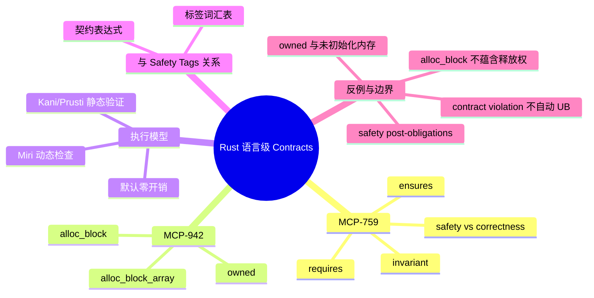

# Rust 语言级契约：前置条件、后置条件与所有权断言

> **EN**: Rust Language Contracts: Preconditions, Postconditions, and Ownership Assertions
> **Summary**: Language-level `#[rustc_contracts::requires]`, `#[rustc_contracts::ensures]`, and `#[rustc_contracts::invariant]` for expressing safety and correctness contracts, including separation-logic ownership primitives `owned`/`alloc_block`.
> **Rust 版本**: 1.97.0+ (Edition 2024)；`feature(contracts)` 与 `owned`/`alloc_block` 为 Nightly 实验性
> **Bloom 层级**: L4（形式化方法/验证工具生态），部分 L3 工程视角
> **权威来源**: 本文件为 `concept/` 权威页。
> **前置概念**: [Unsafe Rust](../../03_advanced/02_unsafe/01_unsafe.md) · [形式化 Unsafe 契约](../01_ownership_logic/07_unsafe_contracts_formal.md) · [Kani](09_kani.md)
> **后置概念**: [Safety Tags 预览](../../07_future/02_preview_features/03_safety_tags_preview.md) · [跨语言契约对比](../../05_comparative/04_verification_and_contracts/00_verification_and_contracts_overview.md)

---

Rust 的 `unsafe` 函数把**保证安全前提的义务**交给调用者与实现者，但直到今天这些义务通常只能写在 `/// # Safety` 文档注释里。语言级 **Contracts**（契约）提案旨在把这类文本契约提升为编译器可识别、工具可消费的属性语法，并在需要时提供零开销的运行时检查与静态验证入口。

本页聚焦 **Rust 语言级 Contracts 特性**（MCP-759 / rust-lang/rust #128044）及其配套所有权断言原语（MCP-942），不重复 [形式化 unsafe 契约](../01_ownership_logic/07_unsafe_contracts_formal.md) 中的 RustBelt/Iris/Tree Borrows 语义，也不覆盖 [算法不变量](../08_algorithm_semantics/04_unsafe_algorithm_invariants.md) 中的通用 Hoare 逻辑。

> **来源**: [MCP-759 — Contracts](https://github.com/rust-lang/compiler-team/issues/759) · [rust-lang/rust #128044](https://github.com/rust-lang/rust/issues/128044) · [std-contracts 2025h1 Project Goal](https://rust-lang.github.io/rust-project-goals/2025h1/std-contracts.html) · [MCP-942 — primitive ownership assertions](https://github.com/rust-lang/compiler-team/issues/942)

---

## 一、语言级 Contracts 要解决什么问题

当前 `unsafe fn` 的契约是**纯文本**的：

```rust
/// # Safety
/// - `ptr` must be valid for reads of `count` bytes.
/// - `ptr` must be properly aligned.
pub unsafe fn read_bytes(ptr: *const u8, count: usize) -> Vec<u8> {
    // ...
    Vec::new()
}
```

文本契约的问题：

1. 编译器不检查，因此不能阻止调用者忘记阅读 `# Safety`；
2. 静态验证器（Kani/Prusti）与动态检查器（Miri）必须各自从注释中重新抽取语义；
3. AI 生成代码无法直接消费自然语言约束。

语言级 Contracts 把同样的信息写成属性，使契约成为 Rust AST 的一部分：

```rust,ignore
#![feature(contracts)]

#[rustc_contracts::requires(for safety: !ptr.is_null())]
#[rustc_contracts::requires(for safety: count <= isize::MAX as usize)]
#[rustc_contracts::ensures(|ret: &Vec<u8>| ret.len() == count)]
pub unsafe fn read_bytes(ptr: *const u8, count: usize) -> Vec<u8> {
    // ...
    Vec::new()
}
```

> **判定依据**: MCP-759 将 Contracts 定位为“实验性属性与语言内建原语”，目标是为 unsafe 代码提供**可执行、可验证、无运行时开销**的契约；std-contracts 2025h1 项目目标则尝试在标准库中 instrument 安全契约，以支持 `verify-rust-std` fork。
> [来源: [MCP-759](https://github.com/rust-lang/compiler-team/issues/759) · [std-contracts goal](https://rust-lang.github.io/rust-project-goals/2025h1/std-contracts.html)]

---

## 二、MCP-759 的语法与语义

### 2.1 `requires` / `ensures` / `invariant`

| 属性 | 含义 | 义务归属 |
| :--- | :--- | :--- |
| `#[rustc_contracts::requires(for safety: P)]` | 调用者必须证明 `P` 在调用前成立 | 调用者 |
| `#[rustc_contracts::requires(for correctness: P)]` | 调用者必须保证 `P`，违反可能产生逻辑错误但非 UB | 调用者 |
| `#[rustc_contracts::ensures(Q)]` | 实现者保证 `Q` 在返回时成立 | 实现者 |
| `#[rustc_contracts::invariant(for safety: I)]` | 数据结构的类型/结构不变量 | 实现者 |

`safety` 与 `correctness` 的区分是 Rust Contracts 的关键设计：

- **safety contract** 违反意味着**未定义行为（UB）**；
- **correctness contract** 违反只意味着程序行为偏离规范，不自动产生 UB。

> **来源**: [MCP-759 — safety vs correctness contracts](https://github.com/rust-lang/compiler-team/issues/759)

### 2.2 `old(...)` 与闭包形式后置条件

后置条件常常需要引用返回值或旧值：

```rust,ignore
#![feature(contracts)]

#[rustc_contracts::ensures(|ret: &i32| *ret == old(*x + 1))]
pub fn increment(x: &mut i32) {
    *x += 1;
}
```

`old(e)` 捕获函数入口时 `e` 的值；闭包参数通常为返回值绑定。这些语法细节在实现中仍处于 nightly 演进阶段。

### 2.3 Stable 编译器会拒绝这些属性

在 stable 1.97 上，任何 `rustc_contracts::` 属性都会因为找不到 crate 而编译失败：

```rust,compile_fail
#[rustc_contracts::requires(for safety: !ptr.is_null())]
pub unsafe fn deref(ptr: *const i32) -> i32 {
    unsafe { *ptr }
}
```

> **修正**: 当前等效实践仍然是结构化 `/// # Safety` 注释 + Miri/Kani 验证。待 `feature(contracts)` 稳定后再迁移属性语法。

---

## 三、所有权断言原语：`owned` / `alloc_block`（MCP-942）

MCP-942 提出一组**原始所有权断言**（primitive ownership assertions），把分离逻辑中的 points-to 与 memory-block 断言引入 Rust 表达式层，使契约可以谈论裸指针背后的内存。

### 3.1 `owned<T>(ptr)`

`owned::<T>(ptr)` 断言 `ptr` 独占指向一块已初始化、类型为 `T` 的内存，并返回一个 `ManuallyDrop<T>` 视图：

```rust,ignore
#![feature(contracts)]

use std::mem::MaybeUninit;

#[rustc_contracts::requires(for safety: owned::<MaybeUninit<T>>(dst))]
pub unsafe fn write<T>(dst: *mut T, src: T) {
    std::ptr::write(dst, src);
}
```

形式化映射：分离逻辑的 `p ↦ v`（points-to）。

> **来源**: [MCP-942 — `owned`](https://github.com/rust-lang/compiler-team/issues/942) · [Fulminate: Testing CN Separation-Logic Specifications in C (POPL 2025)](https://doi.org/10.1145/3704886)

### 3.2 `alloc_block` 家族

| 断言 | 含义 |
| :--- | :--- |
| `alloc_block::<T>(ptr)` | `ptr` 指向由 Rust 全局分配器分配的、大小为 `size_of::<T>()` 的内存块，**不一定已初始化** |
| `alloc_block_array::<T>(ptr, count)` | 大小为 `count * size_of::<T>()` 的数组块 |
| `alloc_block_layout(ptr, layout)` | 由给定 `Layout` 描述的块 |

```rust,ignore
#![feature(contracts)]

#[rustc_contracts::requires(for safety: alloc_block::<u8>(ptr))]
#[rustc_contracts::ensures(|_| owned::<u8>(ptr))]
pub unsafe fn init_byte(ptr: *mut u8, value: u8) {
    std::ptr::write(ptr, value);
}
```

> **关键区别**: `alloc_block` 只保证内存来自 Rust 分配器且范围合法，**不保证已初始化**；`owned` 保证已初始化与独占访问。

### 3.3 与现有形式化工具的映射

| Rust 断言 | 分离逻辑 | Miri | Kani | VeriFast / RefinedRust / Gillian |
| :--- | :--- | :--- | :--- | :--- |
| `owned::<T>(p)` | `p ↦ _` | 所有权检查 | `can_dereference` | points-to |
| `alloc_block::<T>(p)` | `block(p, size_of::<T>())` | 分配器元数据 | 可达性 | block/bytes |
| `alloc_block_array::<T>(p, n)` | `block(p, n * size_of::<T>())` | 同上 | 同上 | 同上 |

> **来源**: [MCP-942 — tool mapping](https://github.com/rust-lang/compiler-team/issues/942) · [Miri Book](https://github.com/rust-lang/miri) · [Kani paper (arXiv:2607.01504)](https://arxiv.org/abs/2607.01504)

---

## 四、执行模型：动态、静态与零开销

### 4.1 编译器视角

在 nightly 实现中，Contracts 默认**无运行时开销**：属性被编译器作为元数据保留，供 Miri、Kani、Prusti 等工具消费。只有在显式启用运行时检查时，才会生成断言代码。

```rust,ignore
#![feature(contracts)]

#[rustc_contracts::requires(for correctness: x > 0)]
pub fn sqrt_positive(x: f64) -> f64 {
    x.sqrt()
}

fn main() {
    // 默认：不生成运行时检查
    sqrt_positive(4.0);
}
```

### 4.2 Miri 所有权检查

MCP-942 的设计目标之一是让 Miri 在开启所有权 checker 时，用 `owned`/`alloc_block` 断言加速或跳过已证明的契约。

```rust,ignore
// MIRIFLAGS=-Zmiri-ownership-checker 等实验开关
// 概念代码；需要 nightly Miri
#[rustc_contracts::requires(for safety: owned::<i32>(ptr))]
unsafe fn use_ptr(ptr: *const i32) -> i32 {
    *ptr
}
```

### 4.3 工具级契约与语言级契约的关系

- **Kani**: `#[kani::requires]` / `#[kani::ensures]` 已经是工具级契约；语言级 Contracts 稳定后，Kani 可直接消费 `#[rustc_contracts::requires]` 而无需额外属性。
- **Prusti / Creusot / Verus**: 各自使用 `#[requires]` / `#[ensures]` 方言；语言级 Contracts 提供了官方语法锚点，可减少方言碎片化。

> **来源**: [Kani 文档](https://model-checking.github.io/kani/) · [Prusti User Guide](https://viperproject.github.io/prusti-dev/user-guide/) · [Creusot](https://creusot.rs/) · [Verus OSDI 2023 paper](https://www.microsoft.com/en-us/research/publication/verus-verifying-rust-programs-using-linear-ghost-types/)

---

## 五、与 Safety Tags 的区别和协同

| 维度 | Safety Tags (RFC #3842) | Language-level Contracts (MCP-759) |
| :--- | :--- | :--- |
| 定位 | **标签词汇表**：把 unsafe 前提分类为机器可读标签 | **契约语言**：可执行/可验证的前后置条件 |
| 语法 | `#[safety::tag(...)]` / `#[safety::requires(...)]` | `#[rustc_contracts::requires/ensures/invariant]` |
| 验证 | 声明式，依赖工具解释 | 表达式级，可直接由编译器/验证器求解 |
| 运行时成本 | 零 | 默认零，可 opt-in 运行时检查 |
| 成熟度 | RFC #3842 讨论中 | MCP-759 + tracking issue #128044， nightly 实验 |

关键结论：**Safety Tags 是“说什么安全属性”，Contracts 是“形式化地表达和验证该属性”**。两者互补：Safety Tags 提供标准化词汇，Contracts 提供可执行语义。详见 [Safety Tags 预览](../../07_future/02_preview_features/03_safety_tags_preview.md)。

> **来源**: [RFC #3842 Safety Tags](https://github.com/rust-lang/rfcs/pull/3842)

---

## 六、⚠️ 反例与边界

### 6.1 反例：Contract 违反 ≠ UB（按当前设计）

Rust Contracts 当前设计把**契约违反**与**语言级 UB** 分开：违反 `requires` 不会自动触发 UB，而是产生一个可控的 contract-violation 行为（类似 C++ `observe` 模式）。这与 `unsafe` 前置条件违反直接导致 UB 不同。

```rust,ignore
#![feature(contracts)]

#[rustc_contracts::requires(for correctness: x > 0)]
fn positive_only(x: i32) -> i32 {
    x
}

fn main() {
    // 违反 correctness 契约，但当前设计下不自动 UB
    positive_only(-1);
}
```

> **边界**: `for safety:` 契约违反是否也应保持“非 UB”仍在设计讨论中；MCP-759 强调不能破坏现有 unsafe 代码的 soundness 假设。

### 6.2 反例：`owned` 读取未初始化内存仍 UB

`owned::<T>(p)` 要求 `p` 指向**已初始化**的 `T`。如果误用 `owned::<T>` 描述 `MaybeUninit<T>` 或未初始化块，读取仍是 UB：

```rust,ignore
#![feature(contracts)]
use std::mem::MaybeUninit;

#[rustc_contracts::requires(for safety: owned::<i32>(ptr))]
unsafe fn read_i32(ptr: *const i32) -> i32 {
    *ptr
}

fn main() {
    let x = MaybeUninit::<i32>::uninit();
    let ptr = x.as_ptr();
    // 错误：ptr 未初始化，不能用 owned::<i32>
    unsafe { read_i32(ptr); }
}
```

> **修正**: 对未初始化内存使用 `alloc_block::<MaybeUninit<T>>(ptr)`，写入后再转为 `owned::<T>(ptr)`。

### 6.3 反例：`alloc_block` 不能单独用于 `free`

`alloc_block` 只说明内存来自 Rust 分配器，不说明调用者拥有释放权。以下观念是错误的：

```rust,ignore
#![feature(contracts)]

#[rustc_contracts::requires(for safety: alloc_block::<u8>(ptr))]
unsafe fn wrong_free(ptr: *mut u8) {
    // ❌ 错误：alloc_block 不蕴含释放权；可能 ptr 来自 Box/Vec 内部
    std::alloc::dealloc(ptr, std::alloc::Layout::new::<u8>());
}
```

> **修正**: 释放权应由 `owned` 或具体类型（`Box`、`Vec`）的所有权语义决定，不能从 `alloc_block` 推导。

### 6.4 边界：Safety Post-obligations 难以表达

某些 unsafe 函数把**安全义务推迟到返回值生命周期结束**，例如 `str::as_bytes_mut` 要求调用者在可变引用存活期间不破坏 UTF-8：

```rust
fn broken_utf8() {
    let mut s = String::from("hello");
    let bytes: &mut [u8] = unsafe { s.as_bytes_mut() };
    bytes[0] = 0x80; // 破坏 UTF-8，但编译器不会立即报错
    // 此时 s 的 safety invariant 已被破坏
}
```

当前 Contracts 提案难以表达“调用者必须在 `&mut` 生命周期内维持某不变量”这类 **safety post-obligation**，是语言设计的开放问题。

> **来源**: [MCP-759 — safety post-obligations](https://github.com/rust-lang/compiler-team/issues/759) · [Rust Reference — Behavior Considered Undefined](https://doc.rust-lang.org/reference/behavior-considered-undefined.html)

---

## 七、来源与延伸阅读

| 来源 | 可信度 | 说明 |
| :--- | :---: | :--- |
| [MCP-759 — Contracts](https://github.com/rust-lang/compiler-team/issues/759) | ✅ 一级 | Rust 官方 Contracts MCP |
| [rust-lang/rust #128044](https://github.com/rust-lang/rust/issues/128044) | ✅ 一级 | `feature(contracts)` tracking issue |
| [std-contracts 2025h1 Project Goal](https://rust-lang.github.io/rust-project-goals/2025h1/std-contracts.html) | ✅ 一级 | 标准库契约 instrument 计划 |
| [MCP-942 — ownership assertions](https://github.com/rust-lang/compiler-team/issues/942) | ✅ 一级 | `owned`/`alloc_block` 设计 |
| [RFC #3842 — Safety Tags](https://github.com/rust-lang/rfcs/pull/3842) | ✅ 一级 | 结构化安全标签 |
| [Fulminate (POPL 2025)](https://doi.org/10.1145/3704886) | ✅ 一级 | 可执行分离逻辑规格的理论基础 |
| [Verifying the Rust Standard Library (VSTTE 2024)](https://arxiv.org/abs/2606.17374) | ✅ 一级 | verify-rust-std 工程路径 |
| [Kani 文档](https://model-checking.github.io/kani/) · [arXiv:2607.01504](https://arxiv.org/abs/2607.01504) | ✅ 一级 | Rust 模型检查器 |
| [Prusti](https://www.pm.inf.ethz.ch/research/prusti.html) / [User Guide](https://viperproject.github.io/prusti-dev/user-guide/) | ✅ 一级 | 演绎验证器 |
| [Creusot](https://creusot.rs/) | ✅ 一级 | Why3 后端验证器 |
| [Verus OSDI 2023](https://www.microsoft.com/en-us/research/publication/verus-verifying-rust-programs-using-linear-ghost-types/) | ✅ 一级 | 线性幽灵类型验证 |
| [C++26 Contracts P2900/P3846](https://www.open-std.org/jtc1/sc22/wg21/docs/papers/2025/p3846r0.pdf) | ✅ 一级 | 跨语言对比 |
| [Ada/SPARK Contracts](https://learn.adacore.com/courses/intro-to-spark/index.html) | ✅ 一级 | 形式化契约先驱 |
| [Rustonomicon — What unsafe does](https://doc.rust-lang.org/nomicon/what-unsafe-does.html) | ✅ 一级 | safety invariant 与 validity invariant |

---

## 相关概念

- [形式化 Unsafe 契约](../01_ownership_logic/07_unsafe_contracts_formal.md) — RustBelt/Iris/Tree Borrows 视角
- [Kani](09_kani.md) — Rust 有界模型检查器
- [Safety Tags 预览](../../07_future/02_preview_features/03_safety_tags_preview.md) — 结构化安全标签
- [跨语言契约对比](../../05_comparative/04_verification_and_contracts/01_contracts_comparison.md) — Rust / C++26 / SPARK / 工具对比
- [Miri](08_miri.md) — 动态 UB 检测

---

## 🧭 思维导图（Mindmap）



---

## 国际权威来源（P2 补充）

- [Verus verifier (GitHub)](https://github.com/verus-lang/verus)
- [Creusot verifier (GitHub)](https://github.com/creusot-rs/creusot)
