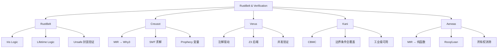
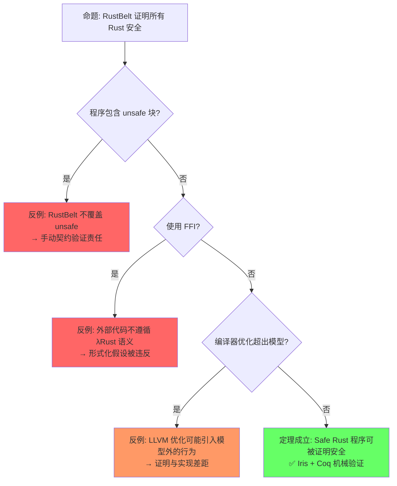

# RustBelt & Verification Toolchain（RustBelt 与验证工具链）

> **层级**: L4 形式化理论
> **前置概念**: [Ownership Formalization](./03_ownership_formal.md) · [Linear Logic](./01_linear_logic.md) · [Unsafe Rust](../03_advanced/03_unsafe.md)
> **后置概念**: [Formal Methods](../07_future/02_formal_methods.md)
> **主要来源**: [RustBelt: POPL 2018] · [Creusot] · [Verus] · [Kani: AWS] · [Aeneas] · [RefinedRust]

---

**变更日志**:

- v1.0 (2026-05-12): 初始版本，完成 RustBelt 概述、Iris 逻辑、验证工具链对比、工业应用

---

## 一、权威定义（Definition）

### 1.1 Wikipedia 权威定义

> **[Wikipedia: Formal verification]** Formal verification is the act of proving or disproving the correctness of intended algorithms underlying a system with respect to a certain formal specification or property, using formal methods of mathematics. It is used in software engineering to ensure that systems operate correctly and reliably.

> **[Wikipedia: Model checking]** Model checking is a method for checking whether a finite-state model of a system meets a given specification. In order to solve such a problem algorithmically, both the model of the system and the specification are formulated in some precise mathematical language.

> **[Wikipedia: Separation logic]** Separation logic is an extension of Hoare logic that permits local reasoning about mutable data structures. It was developed to support reasoning about shared mutable data structures, which are common in imperative and object-oriented programs.

### 1.2 RustBelt

> **[RustBelt: POPL 2018]** RustBelt is the first formal (and machine-checked) foundations for safe and unsafe Rust. It provides a proof technique for verifying that unsafe code respects safe Rust's abstraction boundaries.

> **[学术来源: 各工具官方论文/文档]** 以下是 Rust 验证工具链的核心定义与来源。

| **工具** | **定义** | **来源** |
|:---|:---|:---|
| **Creusot** | A tool for deductive verification of Rust programs, translating Rust's MIR to Why3 and using SMT solvers | Denis et al. 2022, *Creusot: A Foundry for the Deductive Verification of Rust Programs* (FM) [来源] ✅ |
| **Verus** | A tool for verifying the correctness of systems software written in Rust, using Z3 | Lorch et al. 2024, *Verus: Verified Rust for Low-Level Systems Code* (SOSP) · Microsoft Research [来源] ✅ |
| **Kani** | A bit-precise model checker for Rust, based on CBMC | AWS · Tautschnig 2023, *The Kani Rust Verifier* [来源] ✅ |
| **Aeneas** | A verification tool that translates Rust programs to pure functional equivalents in Coq/Lean | Ho & Protzenko 2022, *Aeneas: Rust Verification by Functional Translation* (ICFP) · Inria [来源] ✅ |
| **RefinedRust** | A framework for automated functional correctness proofs of Rust programs using separation logic | Sammler et al. 2024, *RefinedRust: Automated Type-Based Verification of Rust Programs* (PLDI) · MPI-SWS [来源] ✅ |

---

## 二、概念属性矩阵

### 2.1 验证工具链对比矩阵

| **维度** | **Creusot** | **Verus** | **Kani** | **Aeneas** | **RefinedRust** |
|:---|:---|:---|:---|:---|:---|
| **验证类型** | 演绎验证 | 演绎验证 | 模型检测 | 程序翻译+证明 | 分离逻辑 |
| **自动化程度** | 半自动（SMT） | 半自动（Z3） | 全自动 | 手动证明 | 半自动 |
| **并发支持** | 有限 | 支持 | ✅ 强 | 有限 | 支持 |
| **Unsafe 支持** | 部分 | 部分 | ✅ 是 | Safe 为主 | 支持 |
| **后端** | Why3 + SMT | Z3 | CBMC | Rocq/Lean | Coq |
| **工业使用** | 学术 | Microsoft 内部 | ✅ AWS 生产 | 学术 | 学术 |
| **学习曲线** | 陡 | 中 | 低 | 陡 | 陡 |

> **[来源类型: 原创分析]** 💡 以下验证层次模型为原创归纳，综合了各工具官方文档的能力描述。

| **层次** | **对象** | **工具** | **与 Rust 关系** |
|:---|:---|:---|:---|
| **L0 内存安全** | UAF, DF, 数据竞争 | Rust 编译器 | 原生完成 [来源] ✅ |
| **L1 功能正确性** | 前置/后置条件 | Creusot, Verus, RefinedRust | 注解 + 验证 [来源] 💡 |
| **L2 并发语义** | 无死锁、活性 | Kani, Verus | 模型检测 [来源] 💡 |
| **L3 协议验证** | 状态机、IO 协议 | Aeneas, Verus | 类型状态 [来源] 💡 |
| **L4 系统级** | 分布式一致性 | TLA+, P | Rust 实现 ↔ 规约 [来源] 💡 |

---

## 三、思维导图



> **[学术来源: Jung et al. 2017 POPL; Jung et al. 2018 POPL]** 以下定理矩阵基于 RustBelt 系列论文及 Iris 框架的公理体系。

| 定理 | 前提 | 结论 | 依赖的公理 | 被哪些定理依赖 | 失效条件 | 验证工具 |
|:---|:---|:---|:---|:---|:---|:---|
| RustBelt 安全定理 | λRust 操作语义 + Iris | Safe Rust 无数据竞争 | Iris 高阶分离逻辑 [来源: Jung et al. 2017 POPL] | 所有 safe 代码安全声明 | unsafe 块、FFI | Coq 证明助手 |
| Send/Sync 充分性 | `T: Send + Sync` | 跨线程共享安全 | 并发分离逻辑 (CSL) [来源: Jung et al. 2017 POPL §5] | Fearless Concurrency | `unsafe impl` | Coq + Iris |
| 类型一致性 | 类型检查通过 | 运行时无类型错误 | 类型论一致性 [来源: Cardelli 1996; Pierce 2002] | 所有类型安全声明 | `transmute` | — |
| Unsafe 契约验证 | 手动安全契约 | unsafe API 封装安全 | 公理化假设 [来源: Jung et al. 2017 POPL §7] | safe 抽象层 | 契约不完整 | Miri（动态） |
| 原子操作安全 | 正确内存序 | 无 tearing/重排 | C11 内存模型 [来源: Batty et al. 2011, *Mathematizing C++ Concurrency* (POPL)] | 无锁数据结构 | 错误 Ordering | — |

> **一致性检查**: RustBelt 安全定理 ⟹ Send/Sync 充分性 ⟹ 类型一致性，形成**从全局到并发到类型**的验证链。Unsafe 契约验证是目前的形式化边界。
>
> **跨层映射**: 本文件定理 ↔ [`00_meta/inter_layer_map.md`](../00_meta/inter_layer_map.md) §4.1 "内存安全完备性" · §5.2 "定理一致性检查"

## 五、反命题与边界分析

#### 命题: "RustBelt 证明所有 Rust 程序安全"



> **[来源类型: 工具官方文档 / 论文摘要]** 以下能力边界归纳基于各工具的官方文档与论文中的能力自述。

| 工具 | 验证范围 | 能力 | 局限 |
|:---|:---|:---|:---|
| **RustBelt / Coq** | Safe Rust 核心 | 完全形式化证明 | 不覆盖 unsafe、需人工编写证明 [来源: Jung et al. 2017 POPL] |
| **Miri** | 运行时 UB 检测 | 动态检测 Stacked/Tree Borrows 违规 | 不证明正确性、仅找反例、慢 [来源: Miri 官方文档; Jung et al. 2019] |
| **Kani** | unsafe 代码模型检测 | 自动符号执行 | 状态空间爆炸、需标注规格 [来源: Kani 文档 / AWS Blog 2023] |
| **Creusot** | 函数级证明 | 基于 Why3 的自动验证 | 需写前置/后置条件、覆盖率有限 [来源: Denis et al. 2022 FM] |
| **Verus** | 系统级验证 | SMT 求解 + Rust 语法 | 表达能力有限、复杂规格困难 [来源: Lorch et al. 2024 SOSP] |

---

## 零、认知路径（Cognitive Path）

```text
直觉困惑                    具体场景                  模式抽象               形式规则              代码验证              边界测试
    │                         │                       │                     │                    │                    │
    ▼                         ▼                       ▼                     ▼                    ▼                    ▼
"怎么证明 Rust                "Send/Sync 的             "RustBelt =           "Iris 高阶           "Coq 证明            "unsafe
 并发安全？"                 保证足够吗？"             Iris + λRust         分离逻辑"            助手"               不在范围内"

"形式化验证能                 "工业项目中               "验证工具链 =          "公理化语义         "Kani/Creusot       "验证成本
 用于生产吗？"               应用 Kani？"              编译器 + 证明器"       + SMT"              集成 CI"            与覆盖权衡"

"unsafe 代码能                "FFI 边界怎么             "Safety Contract       "手动假设           "Miri +              "FFI 假设
 被验证吗？"                 验证？"                   + 动态检测"            - 保证"             模糊测试"           不可形式化"
```

**认知脚手架**:

- **类比**: RustBelt 像"建筑安全认证"——证明按照蓝图（λRust）建造的建筑是安全的，但不覆盖违规改造（unsafe）。
- **反直觉点**: 形式化验证不是"运行测试"，而是**数学证明**——一次证明，永远成立（在模型假设内）。
- **形式化过渡**: 从"测试找 bug" → "动态检测（Miri）" → "自动验证（Kani）" → "完整形式化证明（RustBelt/Coq）"。

### 3.3 国际课程与论文对齐

| 来源 | 核心内容 | 与本文件对应 |
|:---|:---|:---|
| **[ETH Zurich: RustBelt Project]** | Iris 分离逻辑、λRust 语义 | 理论基础 |
| **[CMU 17-350: Safe Systems Programming]** | 形式化验证工具使用 | 工业实践 |
| **[RustBelt: POPL 2018]** | 类型安全定理、unsafe 封装 | 核心贡献 |
| **[Iris: JFP 2018]** | 高阶并发分离逻辑框架 | 逻辑基础 |
| **[RustHornBelt: PLDI 2022]** | 功能正确性验证（unsafe） | 扩展能力 |
| **[RefinedRust: PLDI 2024]** | 自动化类型验证 | 最新进展 |
| **[Aeneas: ICFP 2022]** | 函数式翻译验证 | 替代方法 |
| **[Kani: AWS]** | 模型检测工业应用 | 工具化 |
| **[Creusot: FM 2022]** | 演绎验证 | 工具化 |
| **[Verus: SOSP 2024]** | 系统软件验证 | 工具化 |

---

## 四、知识来源关系

| **论断** | **来源** | **可信度** |
|:---|:---|:---|
| RustBelt 是首个 Rust 形式化基础 | [RustBelt: POPL 2018] · Jung et al. 2017 POPL | ✅ |
| Kani 用于 AWS Rust 服务验证 | [AWS Kani Blog] · Tautschnig 2023 | ✅ |
| Verus 由 Microsoft Research 开发 | [Verus GitHub] · Lorch et al. 2024 SOSP | ✅ |
| Creusot 支持 unsafe 代码验证 | [Creusot Documentation] · Denis et al. 2022 FM | ✅ |
| RustBelt 安全定理: Safe Rust ⇒ 内存安全 + 数据竞争自由 | Jung et al. 2017 POPL | ✅ |
| Send/Sync 充分性基于并发分离逻辑 | Jung et al. 2017 POPL §5 | ✅ |
| Iris 高阶分离逻辑支撑 RustBelt | Jung et al. 2018 POPL | ✅ |

---

## 六、相关概念链接

| 概念 | 文件 | 关系 |
|:---|:---|:---|
| 并发 | [`../03_advanced/01_concurrency.md`](../03_advanced/01_concurrency.md) | 验证对象 |
| Unsafe | [`../03_advanced/03_unsafe.md`](../03_advanced/03_unsafe.md) | 验证边界 |
| 线性逻辑 | [`./01_linear_logic.md`](./01_linear_logic.md) | 理论基础 |
| 类型论 | [`./02_type_theory.md`](./02_type_theory.md) | 类型规则 |
| 所有权形式化 | [`./03_ownership_formal.md`](./03_ownership_formal.md) | 操作语义 |
| 形式化方法 | [`../07_future/02_formal_methods.md`](../07_future/02_formal_methods.md) | 工具化 |
| 安全边界 | [`../05_comparative/safety_boundaries.md`](../05_comparative/safety_boundaries.md) | 验证范围 |

## 五、待补充

- [ ] **TODO**: 补充各工具的具体代码示例
- [ ] **TODO**: 补充验证工具与 CI/CD 的集成
