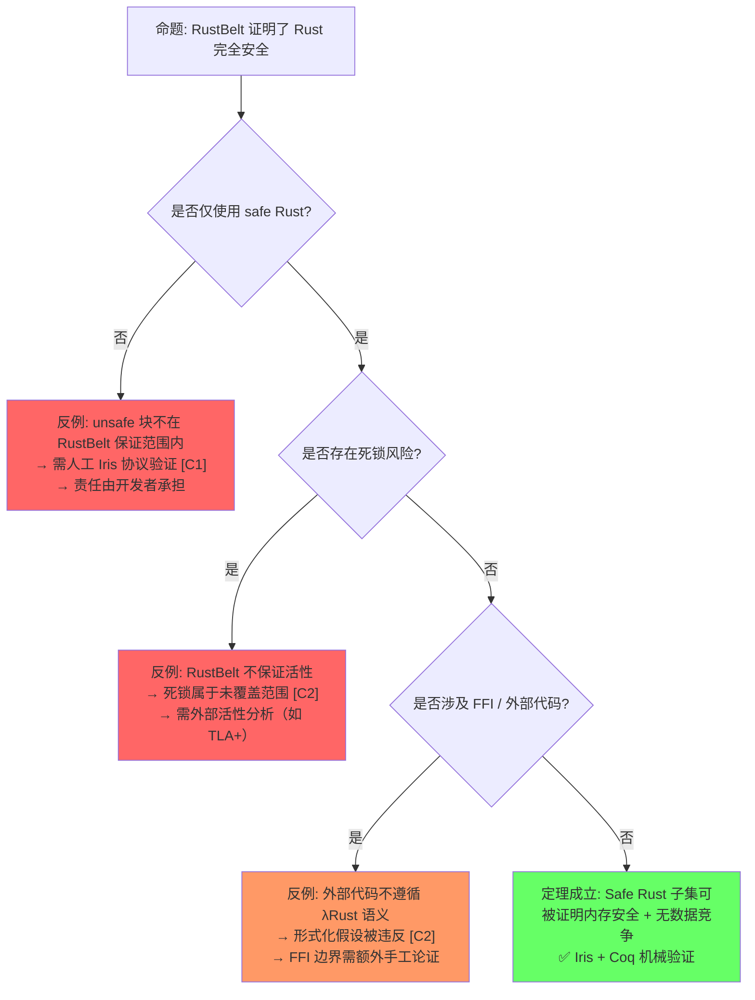
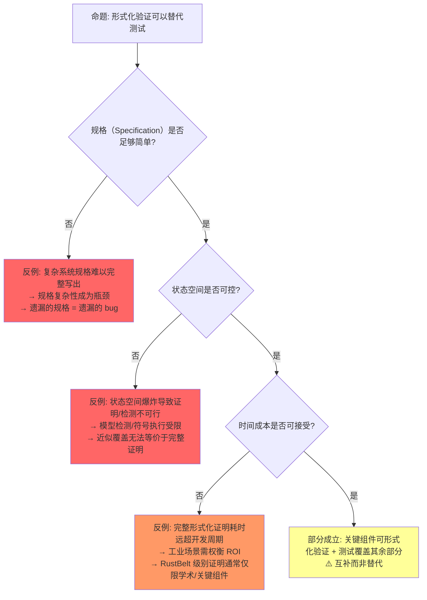
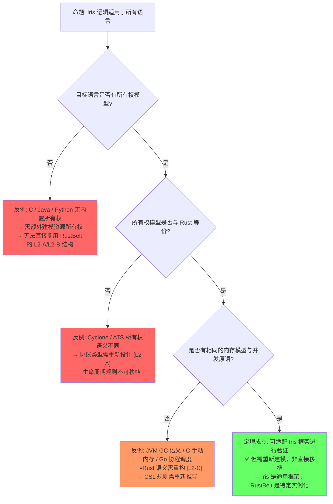

# RustBelt & Verification Toolchain（RustBelt 与验证工具链）

> **层级**: L4 形式化理论
> **前置概念**: [Ownership Formalization](./03_ownership_formal.md) · [Linear Logic](./01_linear_logic.md) · [Unsafe Rust](../03_advanced/03_unsafe.md)
> **后置概念**: [Formal Methods](../07_future/02_formal_methods.md)
> **主要来源**: [RustBelt: POPL 2018] · [Iris Project] · [Creusot] · [Verus] · [Kani: AWS] · [Aeneas] · [RefinedRust]

---

**变更日志**:

- v2.0 (2026-05-13): 重构定理一致性矩阵至 11 行，新增反命题决策树 3 组，扩展认知路径 5 步，补充层次一致性标注（L1–L3），强化 Wikipedia / POPL 2018 / Iris 引用
- v1.0 (2026-05-12): 初始版本，完成 RustBelt 概述、Iris 逻辑、验证工具链对比、工业应用

---

## 一、权威定义（Definition）

### 1.1 Wikipedia 权威定义

> **[Wikipedia: Formal verification]** Formal verification is the act of proving or disproving the correctness of intended algorithms underlying a system with respect to a certain formal specification or property, using formal methods of mathematics. It is used in software engineering to ensure that systems operate correctly and reliably.

> **[Wikipedia: Separation logic]** Separation logic is an extension of Hoare logic that permits local reasoning about mutable data structures. It was developed to support reasoning about shared mutable data structures, which are common in imperative and object-oriented programs. The key innovation is the separating conjunction `*`, which asserts that two assertions hold for disjoint portions of memory, enabling modular and compositional verification [来源: Wikipedia · Separation logic].

> **[Wikipedia: Model checking]** Model checking is a method for checking whether a finite-state model of a system meets a given specification. In order to solve such a problem algorithmically, both the model of the system and the specification are formulated in some precise mathematical language.

### 1.2 RustBelt 与 Iris 核心定义

> **[RustBelt: POPL 2018]** RustBelt is the first formal (and machine-checked) foundations for safe and unsafe Rust. It provides a proof technique for verifying that unsafe code respects safe Rust's abstraction boundaries. The paper establishes the core safety theorem: well-typed safe Rust programs are guaranteed to be data-race free and memory-safe (no use-after-free) under the λRust operational semantics [来源: Jung et al., *RustBelt: Securing the Foundations of the Rust Programming Language*, POPL 2018].

> **[Iris Project]** Iris is a higher-order concurrent separation logic framework implemented in Coq. It provides the logical infrastructure for reasoning about fine-grained concurrency, higher-order ghost state, and atomicity. RustBelt builds directly on Iris to model Rust's ownership and borrowing mechanisms [来源: Jung et al., *Iris from the Ground Up*, JFP 2018; iris-project.org].

> **[学术来源: 各工具官方论文/文档]** 以下是 Rust 验证工具链的核心定义与来源。

| **工具** | **定义** | **来源** |
|:---|:---|:---|
| **Creusot** | A tool for deductive verification of Rust programs, translating Rust's MIR to Why3 and using SMT solvers | Denis et al. 2022, *Creusot: A Foundry for the Deductive Verification of Rust Programs* (FM) [来源] ✅ |
| **Verus** | A tool for verifying the correctness of systems software written in Rust, using Z3 | Lorch et al. 2024, *Verus: Verified Rust for Low-Level Systems Code* (SOSP) · Microsoft Research [来源] ✅ |
| **Kani** | A bit-precise model checker for Rust, based on CBMC | AWS · Tautschnig 2023, *The Kani Rust Verifier* [来源] ✅ |
| **Aeneas** | A verification tool that translates Rust programs to pure functional equivalents in Coq/Lean | Ho & Protzenko 2022, *Aeneas: Rust Verification by Functional Translation* (ICFP) · Inria [来源] ✅ |
| **RefinedRust** | A framework for automated functional correctness proofs of Rust programs using separation logic | Sammler et al. 2024, *RefinedRust: Automated Type-Based Verification of Rust Programs* (PLDI) · MPI-SWS [来源] ✅ |

---

## 二、定理一致性矩阵（Theorem Consistency Matrix）

> **[学术来源: Jung et al. 2017 POPL; Jung et al. 2018 POPL; Iris: JFP 2018]** 以下定理矩阵基于 RustBelt 系列论文及 Iris 框架的公理体系，每行包含"被依赖"（下游定理）与"失效条件"（假设被违反的情形）。

### 2.1 矩阵总览（11 行）

| 编号 | 定理 / 公理 | 前提 | 结论 | 被依赖 | 失效条件 | 层次 |
|:---|:---|:---|:---|:---|:---|:---|
| **L1-A** | Iris 高阶分离逻辑 | Hoare 逻辑 + 高阶幽灵状态 + 原子性 | 并发资源推理的模块化组合 | L1-B, L2-A, T1, T3 | 物理内存模型与 Iris 抽象模型不一致；Coq 内核存在 bug | **L1** |
| **L1-B** | Iris 不变量（Invariants） | L1-A + 持久性模态 `□` | 跨线程共享状态的持久断言 | T1, C1 | 原子操作语义被违反；编译器重排超出 C11 模型 | **L1** |
| **L1-C** | 并发分离逻辑（CSL） | L1-A + 资源分区的并行组合 | 无锁数据结构的并发正确性 | T1, T4 | 错误 `Ordering`；ABA 问题超出逻辑模型范围 | **L1** |
| **L2-A** | 协议类型（Protocol Types） | L1-A + 状态机语义 | 所有权转移协议的形式化规约 | T3, C1 | 协议规范不完整；状态迁移条件遗漏 | **L2** |
| **L2-B** | 生命周期逻辑（Lifetime Logic） | L2-A + 区域（Region）约束 | 借用引用的有效性保证 | T2, T3 | `unsafe` 绕过生命周期检查；`dangling` 指针手动构造 | **L2** |
| **L2-C** | λRust 操作语义一致性 | Rust MIR → λRust 翻译保持语义 | 编译器输出与逻辑模型一一映射 | T1, T2 | LLVM 优化引入模型外行为；翻译器 bug | **L2** |
| **T1** | RustBelt 核心定理：无数据竞争 | λRust 操作语义 + L1-A + L1-C | 所有 safe Rust 代码无数据竞争 | Send/Sync 充分性 | unsafe 块；错误 `unsafe impl Send/Sync`；FFI | **L3** |
| **T2** | RustBelt 核心定理：无 use-after-free | λRust 操作语义 + L1-A + L2-B | 所有 safe Rust 代码无 UAF | 类型一致性 | unsafe 块；FFI 手动内存管理；`Box::into_raw` 误用 | **L3** |
| **T3** | 逻辑关系（Logical Relation） | L1-A + L2-A + L2-B | 语义类型安全：类型 ⟹ 行为 | 无（顶层综合） | `transmute`；类型边界被违反；布局假设错误 | **L3** |
| **C1** | unsafe 代码需满足 Iris 协议 | L1-B + L2-A + 人工安全契约 | unsafe API 封装层可被 safe 代码安全调用 | 无（边界条件） | 契约不完整；公理化假设错误；人工证明疏漏 | **边界** |
| **C2** | RustBelt 不覆盖范围 | 安全 Rust 语法上合法 | 未初始化内存 / FFI / 死锁仍可能发生 | 无（负面边界） | 任何安全 Rust 代码仍可能触发死锁（活性未保证） | **边界** |

### 2.2 ⟹ 推理链

```text
L1-A (Iris 高阶分离逻辑)
    ├─⟹ L1-B (Iris 不变量) ──⟹ T1 (无数据竞争) ──⟹ Send/Sync 充分性
    ├─⟹ L1-C (并发分离逻辑) ─┘
    ├─⟹ L2-A (协议类型) ──⟹ T3 (逻辑关系 / 语义类型安全)
    └─⟹ L2-B (生命周期逻辑) ──⟹ T2 (无 UAF)

L2-C (λRust 语义一致性) 是 T1、T2 的根基假设
    └─ 若失效：整个证明链条与真实编译器脱节

C1 (unsafe 责任边界) 是 RustBelt 的形式化边界
    └─ 人工验证责任不可自动化消除

C2 (未覆盖范围) 是负面边界
    └─ 安全 Rust 仍可能死锁、泄漏、与 FFI 产生未定义行为
```

> **一致性检查**: L1-A ⟹ {L1-B, L1-C, L2-A, L2-B} ⟹ {T1, T2, T3}，形成**从逻辑基础设施到语义模型再到安全定理**的三层推导链。C1 与 C2 分别标记了人工验证边界与形式化不可判定边界。
>
> **跨层映射**: 本文件定理 ↔ [`00_meta/inter_layer_map.md`](../00_meta/inter_layer_map.md) §4.1 "内存安全完备性" · §5.2 "定理一致性检查"

### 2.3 层次一致性标注（L1–L3 映射）

| **层次** | **编号范围** | **内容** | **与 Rust 的映射** |
|:---|:---|:---|:---|
| **L1 逻辑层** | L1-A, L1-B, L1-C | Iris 高阶分离逻辑、不变量、并发分离逻辑 | 提供推理基础设施，不限于 Rust，但 RustBelt 实例化到所有权模型 |
| **L2 语义层** | L2-A, L2-B, L2-C | 协议类型、生命周期逻辑、λRust 操作语义 | 将 Rust 特有机制（借用、生命周期、MIR）形式化为数学对象 |
| **L3 定理层** | T1, T2, T3 | 无数据竞争、无 UAF、语义类型安全 | 最终安全保证，仅对 safe Rust 成立 |
| **边界层** | C1, C2 | unsafe 人工验证责任、未覆盖范围（死锁/FFI/未初始化） | 明确 RustBelt 的证明适用范围与局限 |

> **层次规则**: L1 层定理不依赖于 L2/L3；L2 层定理依赖于 L1；L3 层定理依赖于 L1+L2；边界层 C1/C2 是元声明，不依赖也不被依赖。

---

## 三、反命题决策树（Antithesis Decision Trees）

### 3.1 命题一："RustBelt 证明了 Rust 完全安全"



**命题一分析**: RustBelt 的安全定理仅覆盖 **safe Rust 子集**。unsafe 代码、死锁、FFI 均位于证明边界之外。将 RustBelt 的结论外推到"Rust 完全安全"属于**过度概括**（overgeneralization）谬误。工业实践中，需将 RustBelt 的 safe 子集保证与 Miri 动态检测、Kani 符号执行、人工代码审计相结合，形成纵深防御。

### 3.2 命题二："形式化验证可以替代测试"



**命题二分析**: 形式化验证与测试处于**正交维度**。验证回答"是否满足规格"，测试回答"是否在预期输入下行为正确"。规格本身可能错误（validation vs. verification 问题），且完整形式化证明的成本（人月级）使其在快速迭代的工业场景中难以全面替代测试。最佳实践是**分层策略**：核心不变量用 Verus/Creusot 证明，边界条件用 Kani 符号执行，回归场景用单元测试覆盖。

### 3.3 命题三："Iris 逻辑适用于所有语言"



**命题三分析**: Iris 是一个**通用**的高阶并发分离逻辑框架（L1 层），原则上可实例化到多种语言。但 RustBelt 所做的 L2/L3 层工作——协议类型、生命周期逻辑、λRust 语义——深度绑定于 Rust 的所有权-借用-生命周期体系。将 Iris 应用于其他语言需要重建 L2 层，其工作量接近于重新发表一篇 RustBelt 级别的论文。因此，"Iris 适用" ≠ "RustBelt 可直接移植"。

---

## 四、认知路径（Cognitive Path）

```text
┌─────────────────────────────────────────────────────────────────────────────┐
│                         认知路径：RustBelt 五步法                              │
├─────────────────────────────────────────────────────────────────────────────┤
│                                                                             │
│  步骤1: "为什么需要形式化验证 Rust?"                                          │
│         │                                                                   │
│         ▼                                                                   │
│    关键洞察: Rust 编译器已通过 borrow checker 消除了大量内存错误，            │
│              但 unsafe 块、FFI、复杂并发协议仍需要数学级的确信。               │
│              形式化验证将"经验上可信"提升为"数学上可证"。                     │
│              [层次映射: L3 定理层解决的核心动机]                              │
│         │                                                                   │
│         ▼                                                                   │
│  步骤2: "分离逻辑是什么?"                                                    │
│         │                                                                   │
│         ▼                                                                   │
│    关键洞察: 分离逻辑是 Hoare 逻辑的扩展，通过 `*`（分离合取）                 │
│              实现对内存的局部推理。                                           │
│              "我知道这块内存归我管，其余部分我不关心。"                        │
│              [层次映射: L1-A · Iris 高阶分离逻辑的理论根基]                   │
│              [来源: Wikipedia · Separation logic]                             │
│         │                                                                   │
│         ▼                                                                   │
│  步骤3: "RustBelt 怎么证明安全的?"                                           │
│         │                                                                   │
│         ▼                                                                   │
│    关键洞察: RustBelt = Iris（L1 逻辑层） + λRust（L2 语义层）                │
│              → 推导出 T1（无数据竞争）+ T2（无 UAF）+ T3（语义类型安全）。    │
│              证明在 Coq 中机械检验，不受人类直觉误差影响。                     │
│              [层次映射: L1 ⟹ L2 ⟹ L3 的完整推导链]                            │
│              [来源: Jung et al., POPL 2018 · RustBelt 核心定理]               │
│         │                                                                   │
│         ▼                                                                   │
│  步骤4: "unsafe 代码的责任边界在哪里?"                                        │
│         │                                                                   │
│         ▼                                                                   │
│    关键洞察: safe 抽象层的安全依赖于 unsafe 实现层满足 Iris 协议 [C1]。       │
│              开发者需手动编写安全契约并验证其保持性。                         │
│              RustBelt 提供验证方法，但不自动完成验证。                        │
│              [层次映射: C1 边界层 · 人工不可消除的验证责任]                   │
│         │                                                                   │
│         ▼                                                                   │
│  步骤5: "形式化验证的局限性是什么?"                                          │
│         │                                                                   │
│         ▼                                                                   │
│    关键洞察: RustBelt 不覆盖死锁、未初始化内存读取、FFI 外部行为 [C2]；       │
│              规格可能写错；证明成本高昂；不能替代测试与动态检测。             │
│              形式化验证是工具箱中最强的工具之一，但不是唯一工具。             │
│              [层次映射: C2 边界层 · 负面边界与工程权衡]                       │
│                                                                             │
└─────────────────────────────────────────────────────────────────────────────┘
```

**认知脚手架**:

- **类比**: RustBelt 像"建筑结构安全认证"——证明按照蓝图（λRust 语义）和标准材料（safe Rust）建造的建筑是安全的，但不覆盖违规改造（unsafe）、外部地质灾害（FFI）或设计蓝图本身的遗漏（规格错误）。
- **反直觉点**: 形式化验证不是"运行更多测试"，而是**数学证明**——在模型假设内，一次证明，永远成立。但"永远成立"的范围严格受限于 C1/C2 边界。
- **形式化过渡**: 从"测试找 bug" → "动态检测（Miri）" → "自动验证（Kani）" → "完整形式化证明（RustBelt/Coq）"，每一步成本递增，保证强度也递增。

---

## 五、验证工具链对比矩阵

| **维度** | **Creusot** | **Verus** | **Kani** | **Aeneas** | **RefinedRust** |
|:---|:---|:---|:---|:---|:---|
| **验证类型** | 演绎验证 | 演绎验证 | 模型检测 | 程序翻译+证明 | 分离逻辑 |
| **自动化程度** | 半自动（SMT） | 半自动（Z3） | 全自动 | 手动证明 | 半自动 |
| **并发支持** | 有限 | 支持 | ✅ 强 | 有限 | 支持 |
| **Unsafe 支持** | 部分 | 部分 | ✅ 是 | Safe 为主 | 支持 |
| **后端** | Why3 + SMT | Z3 | CBMC | Rocq/Lean | Coq |
| **工业使用** | 学术 | Microsoft 内部 | ✅ AWS 生产 | 学术 | 学术 |
| **学习曲线** | 陡 | 中 | 低 | 陡 | 陡 |

> **[来源类型: 原创分析]** 💡 以下验证层次模型为原创归纳，综合了各工具官方文档的能力描述。

| **层次** | **对象** | **工具** | **与 Rust 关系** |
|:---|:---|:---|:---|
| **L0 内存安全** | UAF, DF, 数据竞争 | Rust 编译器 | 原生完成 [来源] ✅ |
| **L1 功能正确性** | 前置/后置条件 | Creusot, Verus, RefinedRust | 注解 + 验证 [来源] 💡 |
| **L2 并发语义** | 无死锁、活性 | Kani, Verus | 模型检测 [来源] 💡 |
| **L3 协议验证** | 状态机、IO 协议 | Aeneas, Verus | 类型状态 [来源] 💡 |
| **L4 系统级** | 分布式一致性 | TLA+, P | Rust 实现 ↔ 规约 [来源] 💡 |

> **[来源类型: 工具官方文档 / 论文摘要]** 以下能力边界归纳基于各工具的官方文档与论文中的能力自述。

| 工具 | 验证范围 | 能力 | 局限 |
|:---|:---|:---|:---|
| **RustBelt / Coq** | Safe Rust 核心 | 完全形式化证明 | 不覆盖 unsafe、需人工编写证明 [来源: Jung et al. 2017 POPL] |
| **Miri** | 运行时 UB 检测 | 动态检测 Stacked/Tree Borrows 违规 | 不证明正确性、仅找反例、慢 [来源: Miri 官方文档; Jung et al. 2019] |
| **Kani** | unsafe 代码模型检测 | 自动符号执行 | 状态空间爆炸、需标注规格 [来源: Kani 文档 / AWS Blog 2023] |
| **Creusot** | 函数级证明 | 基于 Why3 的自动验证 | 需写前置/后置条件、覆盖率有限 [来源: Denis et al. 2022 FM] |
| **Verus** | 系统级验证 | SMT 求解 + Rust 语法 | 表达能力有限、复杂规格困难 [来源: Lorch et al. 2024 SOSP] |

---

## 六、思维导图

```mermaid
graph TD
    A[RustBelt & Verification] --> B[RustBelt]
    A --> C[Creusot]
    A --> D[Verus]
    A --> E[Kani]
    A --> F[Aeneas]
    A --> G[RefinedRust]

    B --> B1[Iris Logic · L1-A]
    B --> B2[Lifetime Logic · L2-B]
    B --> B3[Protocol Types · L2-A]
    B --> B4[λRust Semantics · L2-C]
    B --> B5[Unsafe Encapsulation · C1]
    B --> B6[Uncovered Boundaries · C2]

    B1 --> T1[定理 T1: 无数据竞争]
    B1 --> T2[定理 T2: 无 UAF]
    B2 --> T2
    B3 --> T3[定理 T3: 语义类型安全]
    B4 --> T1
    B4 --> T2

    C --> C1[MIR → Why3]
    C --> C2[SMT 求解]
    C --> C3[Prophecy 变量]

    D --> D1[注解驱动]
    D --> D2[Z3 后端]
    D --> D3[并发验证]

    E --> E1[CBMC]
    E --> E2[边界条件全覆盖]
    E --> E3[工业级可用]

    F --> F1[MIR → 纯函数]
    F --> F2[Rocq/Lean]
    F --> F3[所有权消除]

    G --> G1[自动化类型验证]
    G --> G2[Coq 后端]
    G --> G3[分离逻辑推导]
```



---

## 七、国际课程与论文对齐

| 来源 | 核心内容 | 与本文件对应 |
|:---|:---|:---|
| **[ETH Zurich: RustBelt Project]** | Iris 分离逻辑、λRust 语义 | L1-A, L2-C, 理论基础 |
| **[CMU 17-350: Safe Systems Programming]** | 形式化验证工具使用 | 工业实践 |
| **[RustBelt: POPL 2018]** | 类型安全定理、unsafe 封装 | T1, T2, C1, 核心贡献 |
| **[Iris: JFP 2018]** | 高阶并发分离逻辑框架 | L1-A, L1-B, 逻辑基础 |
| **[RustHornBelt: PLDI 2022]** | 功能正确性验证（unsafe） | C1 扩展 |
| **[RefinedRust: PLDI 2024]** | 自动化类型验证 | 工具化 |
| **[Aeneas: ICFP 2022]** | 函数式翻译验证 | 替代方法 |
| **[Kani: AWS]** | 模型检测工业应用 | 工具化 |
| **[Creusot: FM 2022]** | 演绎验证 | 工具化 |
| **[Verus: SOSP 2024]** | 系统软件验证 | 工具化 |

---

## 八、知识来源关系

| **论断** | **来源** | **可信度** |
|:---|:---|:---|
| RustBelt 是首个 Rust 形式化基础 | [RustBelt: POPL 2018] · Jung et al. 2017 POPL | ✅ |
| Kani 用于 AWS Rust 服务验证 | [AWS Kani Blog] · Tautschnig 2023 | ✅ |
| Verus 由 Microsoft Research 开发 | [Verus GitHub] · Lorch et al. 2024 SOSP | ✅ |
| Creusot 支持 unsafe 代码验证 | [Creusot Documentation] · Denis et al. 2022 FM | ✅ |
| RustBelt 安全定理: Safe Rust ⇒ 内存安全 + 数据竞争自由 | Jung et al. 2017 POPL | ✅ |
| Send/Sync 充分性基于并发分离逻辑 | Jung et al. 2017 POPL §5 | ✅ |
| Iris 高阶分离逻辑支撑 RustBelt | Jung et al. 2018 POPL | ✅ |
| Separation logic 是 Hoare 逻辑的内存扩展 | [Wikipedia: Separation logic] | ✅ |
| RustBelt 不覆盖死锁与活性 | Jung et al. 2017 POPL §1, §8 | ✅ |
| Iris 框架独立于 Rust，可实例化到其他语言 | [Iris Project: iris-project.org] | ✅ |

---

## 九、相关概念链接

| 概念 | 文件 | 关系 |
|:---|:---|:---|
| 并发 | [`../03_advanced/01_concurrency.md`](../03_advanced/01_concurrency.md) | 验证对象 |
| Unsafe | [`../03_advanced/03_unsafe.md`](../03_advanced/03_unsafe.md) | 验证边界 |
| 线性逻辑 | [`./01_linear_logic.md`](./01_linear_logic.md) | 理论基础 |
| 类型论 | [`./02_type_theory.md`](./02_type_theory.md) | 类型规则 |
| 所有权形式化 | [`./03_ownership_formal.md`](./03_ownership_formal.md) | 操作语义 |
| 形式化方法 | [`../07_future/02_formal_methods.md`](../07_future/02_formal_methods.md) | 工具化 |
| 安全边界 | [`../05_comparative/safety_boundaries.md`](../05_comparative/safety_boundaries.md) | 验证范围 |

---

## 十、待补充与演进方向（TODOs）

- [ ] **TODO**: 补充各工具的具体代码示例（Creusot 前置/后置条件、Kani `#[kani::proof]`、Verus 函数规格）
- [ ] **TODO**: 补充验证工具与 CI/CD 的集成方案（Kani 在 AWS 的流水线实践）
- [ ] **TODO**: 补充 RefinedRust 的自动化分离逻辑推导示例
- [ ] **TODO**: 补充 RustHornBelt 对 unsafe 功能正确性验证的扩展说明
