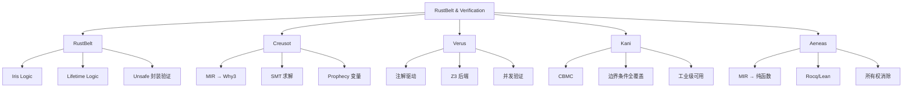

# RustBelt & Verification Toolchain（RustBelt 与验证工具链）

> **层级**: L4 形式化理论
> **前置概念**: [Ownership Formalization](./03_ownership_formal.md) · [Linear Logic](./01_linear_logic.md) · [Unsafe Rust](../03_advanced/03_unsafe.md)
> **后置概念**: [Formal Methods](../07_future/02_formal_methods.md)
> **主要来源**: [RustBelt: POPL 2018] · [Creusot] · [Verus] · [Kani: AWS] · [Aeneas] · [RefinedRust]

---

**变更日志**:

- v1.0 (2026-05-12): 初始版本，完成 RustBelt 概述、Iris 逻辑、验证工具链对比、工业应用

---

## 一、权威定义（Definition）

### 1.1 RustBelt

> **[RustBelt: POPL 2018]** RustBelt is the first formal (and machine-checked) foundations for safe and unsafe Rust. It provides a proof technique for verifying that unsafe code respects safe Rust's abstraction boundaries.

### 1.2 验证工具链

| **工具** | **定义** | **来源** |
|:---|:---|:---|
| **Creusot** | A tool for deductive verification of Rust programs, translating Rust's MIR to Why3 and using SMT solvers | Xavier Denis, et al. |
| **Verus** | A tool for verifying the correctness of systems software written in Rust, using Z3 | Microsoft Research |
| **Kani** | A bit-precise model checker for Rust, based on CBMC | AWS |
| **Aeneas** | A verification tool that translates Rust programs to pure functional equivalents in Coq/Lean | Inria |
| **RefinedRust** | A framework for automated functional correctness proofs of Rust programs using separation logic | MPI-SWS |

---

## 二、概念属性矩阵

### 2.1 验证工具链对比矩阵

| **维度** | **Creusot** | **Verus** | **Kani** | **Aeneas** | **RefinedRust** |
|:---|:---|:---|:---|:---|:---|
| **验证类型** | 演绎验证 | 演绎验证 | 模型检测 | 程序翻译+证明 | 分离逻辑 |
| **自动化程度** | 半自动（SMT） | 半自动（Z3） | 全自动 | 手动证明 | 半自动 |
| **并发支持** | 有限 | 支持 | ✅ 强 | 有限 | 支持 |
| **Unsafe 支持** | 部分 | 部分 | ✅ 是 | Safe 为主 | 支持 |
| **后端** | Why3 + SMT | Z3 | CBMC | Rocq/Lean | Coq |
| **工业使用** | 学术 | Microsoft 内部 | ✅ AWS 生产 | 学术 | 学术 |
| **学习曲线** | 陡 | 中 | 低 | 陡 | 陡 |

### 2.2 验证层次矩阵

| **层次** | **对象** | **工具** | **与 Rust 关系** |
|:---|:---|:---|:---|
| **L0 内存安全** | UAF, DF, 数据竞争 | Rust 编译器 | 原生完成 |
| **L1 功能正确性** | 前置/后置条件 | Creusot, Verus, RefinedRust | 注解 + 验证 |
| **L2 并发语义** | 无死锁、活性 | Kani, Verus | 模型检测 |
| **L3 协议验证** | 状态机、IO 协议 | Aeneas, Verus | 类型状态 |
| **L4 系统级** | 分布式一致性 | TLA+, P | Rust 实现 ↔ 规约 |

---

## 三、思维导图

---

## 四、知识来源关系

| **论断** | **来源** | **可信度** |
|:---|:---|:---|
| RustBelt 是首个 Rust 形式化基础 | [RustBelt: POPL 2018] | ✅ |
| Kani 用于 AWS Rust 服务验证 | [AWS Kani Blog] | ✅ |
| Verus 由 Microsoft Research 开发 | [Verus GitHub] | ✅ |
| Creusot 支持 unsafe 代码验证 | [Creusot Documentation] | ✅ |

---

## 五、待补充

- [ ] **TODO**: 补充各工具的具体代码示例
- [ ] **TODO**: 补充验证工具与 CI/CD 的集成
