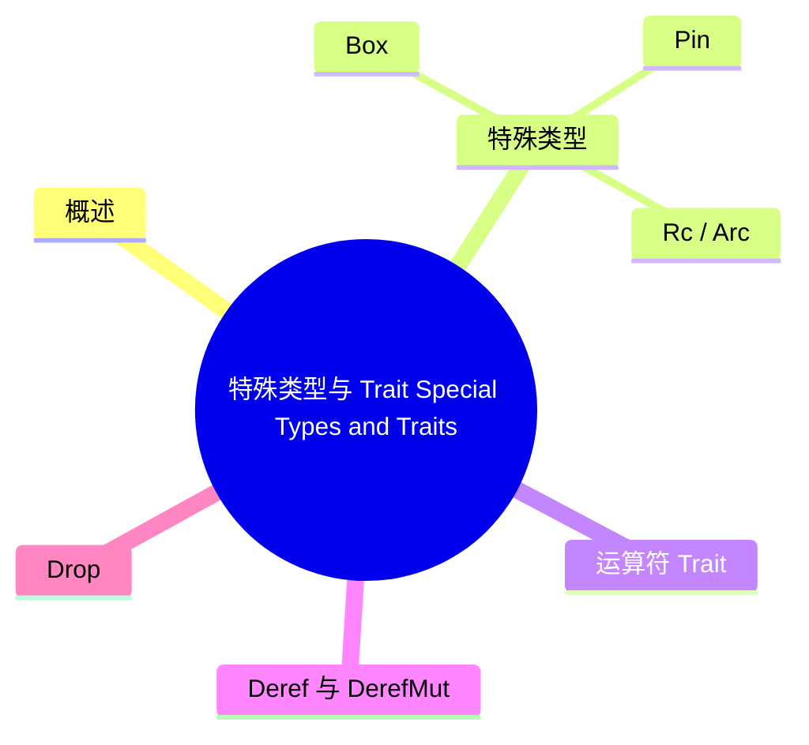

# 特殊类型与 Trait（Special Types and Traits）

> **EN**: Special Types and Traits
> **Summary**: Rust 编译器特殊识别的标准库类型与 trait：Box、Rc、Arc、Pin、UnsafeCell、PhantomData、运算符 trait、Deref、Drop、Copy、Clone、Send、Sync、自动 trait、Sized。
> **Rust 版本**: 1.97.0+ (Edition 2024)
>
> **受众**: [研究者]
> **内容分级**: [研究级]
> **Bloom 层级**: L2-L4
> **权威来源**: 本文件为 `concept/` 权威页。
> **定位声明**: 本页为 Rust Reference 对应章节的**规范摘译与注解**（规范条文摘译 + 示例 + 交叉引用），非形式化推导或机器验证证明；形式化理论内容见 [rustc 中的 Trait Solver](03_trait_solver_in_rustc.md)、[类型论基础](../00_type_theory/01_type_theory.md)。依据 [A/S/P 标记规范](../../00_meta/03_audit/02_asp_marking_guide.md) §3.4，L4 形式化层同时容纳 S（Specification）规范分析类内容，故本页保留于 L4，Bloom 层级维持与内容相符的标注（理解/分析层的规范内容）。
> **A/S/P 标记**: **S** — Specification
> **双维定位**: S×Ana — 规范分析
> **前置依赖**: [Type System](../../01_foundation/02_type_system/01_type_system.md) · [Traits](../../02_intermediate/00_traits/01_traits.md) · [Generics](../../02_intermediate/01_generics/01_generics.md)
> **后置概念**: [Unsafe Rust](../../03_advanced/02_unsafe/01_unsafe.md) · [Pin and Unpin](../../03_advanced/01_async/08_pin_unpin.md) · [Concurrency](../../03_advanced/00_concurrency/01_concurrency.md)
> **定理链**: Special Type → Compiler Support → Safety Guarantee
> **主要来源**: [Rust Reference — Special Types and Traits](https://doc.rust-lang.org/reference/special-types-and-traits.html) · [Jung et al. — RustBelt: Securing the Foundations of Rust](https://plv.mpi-sws.org/rustbelt/popl18/) · [O'Hearn — Separation Logic and Shared Mutable Data](https://doi.org/10.1017/S0960129501001003) · [Brown University — Interactive Rust Book](https://rust-book.cs.brown.edu/) · [TRPL](https://doc.rust-lang.org/book/title-page.html) · [Itanium C++ ABI](https://itanium-cxx-abi.github.io/cxx-abi/abi.html)
>
> **来源**: [Rust Reference — Special Types and Traits](https://doc.rust-lang.org/reference/special-types-and-traits.html)

---

## 一、概述

Rust 编译器对一些标准库类型和 trait 具有特殊认知。这些类型和 trait 的行为无法仅通过普通用户代码实现，或者编译器需要它们来生成正确的代码。本章概括这些特殊类型与 trait 的核心语义。

---

## 二、特殊类型

本节聚焦「特殊类型」，覆盖`Box<T>`、`Rc<T>` / `Arc<T>`、`Pin<P>`、`UnsafeCell<T>`等方面。论述顺序由定义到边界：先明确「特殊类型」在「特殊类型与 Trait（Special Types and Traits）」中的确切含义与适用范围，再给出可核验的例证或数据，最后标注它与相邻主题的分界线。读完后应能用一句话复述「特殊类型」的判定标准，并指出它在全页论证链中的位置。

### `Box<T>`

- `Box<T>` 的解引用（Reference） `*` 产生一个可从中 move 的 place，这是语言内置行为。
- 方法可以接受 `Box<Self>` 作为 receiver。
- 可以在定义 `T` 的同一 crate 中为 `Box<T>` 实现 trait，这不受普通泛型（Generics）的孤儿规则（Orphan Rule）限制。

### `Rc<T>` / `Arc<T>`

- 方法可以接受 `Rc<Self>` / `Arc<Self>` 作为 receiver。
- `Arc<T>` 用于跨线程共享引用（Reference）计数所有权（Ownership）。

### `Pin<P>`

- 方法可以接受 `Pin<P>` 作为 receiver。
- `Pin` 用于保证指向的值在内存中不会被移动，是自引用（Reference）结构的关键抽象。

参见 [Pin and Unpin](../../03_advanced/01_async/08_pin_unpin.md)。

### `UnsafeCell<T>`

- 用于实现**内部可变性（interior mutability）**。
- 阻止编译器对内部可变类型执行不正确的优化。
- 保证带有内部可变性的 `static` 不会被放入只读内存。

参见 [Interior Mutability](../../02_intermediate/02_memory_management/02_interior_mutability.md)。

### `PhantomData<T>`

- 零大小、最小对齐的类型。
- 被编译器视为拥有一个 `T`，用于影响方差、drop check 和自动 trait 推导。
- 常用于封装外部资源时标记所有权（Ownership）或生命周期（Lifetimes）。

---

## 三、运算符 Trait

`std::ops` 和 `std::cmp` 中的 trait 用于重载运算符、索引表达式和调用表达式：

- 算术：`Add`、`Sub`、`Mul`、`Div`、`Rem`
- 位运算：`BitAnd`、`BitOr`、`BitXor`、`Shl`、`Shr`
- 一元：`Neg`、`Not`
- 索引：`Index`、`IndexMut`
- 函数调用：`Fn`、`FnMut`、`FnOnce`
- 比较：`PartialEq`、`Eq`、`PartialOrd`、`Ord`

---

## 四、`Deref` 与 `DerefMut`

- 重载一元解引用（Reference） `*`。
- 参与方法解析和自动解引用（Reference）强制（deref coercion）。

---

## 五、`Drop`

- 提供析构函数，当值被销毁时执行。
- 实现 `Drop` 的类型不能实现 `Copy`。

---

## 六、`Copy` 与 `Clone`

本节从编译器内部视角解剖 `Copy` 与 `Clone` 这对最易混淆的标记：

- **语义分界**：`Copy` = 按位复制即有效（无所有权语义影响，复制后两者独立可用）；`Clone` = 显式深拷贝操作（`clone()` 是普通的函数调用）；`Copy: Clone` 是强制子 trait 关系（可复制必可克隆）；
- **编译器实现**：`Copy` 是 auto trait + 语言项（`#[lang = "copy"]`）——编译器按结构自动推导（所有字段 `Copy` 且未实现 `Drop`）；`Drop` 与 `Copy` 互斥是硬规则（E0184）：「drop 副作用」与「静默复制」语义冲突；
- **move 与 copy 的分流**：类型检查阶段标记表达式为 move 或 copy——copy 类型使用后原位置仍有效，这是借用检查中「E0382（move 后使用）」是否触发的判据；
- **常见误区**：`Clone` 不隐含 `Copy`（`String::clone` 堆分配 vs 按位复制）；derive(Clone) 对泛型字段加 `T: Clone` 约束（derive 的保守性）。

### `Copy`

- 实现 `Copy` 的值在赋值时按位复制，而不是 move。
- 要求类型不实现 `Drop`，且所有字段都实现 `Copy`。
- 编译器为以下类型自动实现 `Copy`：
  - `Copy` 类型的元组
  - 函数指针
  - 函数项类型
  - 不捕获或只捕获 `Copy` 值的闭包（Closures）

### `Clone`

- `Copy` 的 supertrait。
- 编译器自动为内置 `Copy` 类型、`Clone` 类型的元组、以及只捕获 `Clone` 值（或不捕获）的闭包（Closures）实现。

---

## 七、`Send` 与 `Sync`

本节从编译器视角解剖并发标记 trait `Send` 与 `Sync`：

- **定义**：`Send` = 值可安全跨线程**转移**（`T: Send` ⟹ 可在另一线程 drop）；`Sync` = 值可安全跨线程**共享引用**（`T: Sync` ⟺ `&T: Send`）——两定义的正交性：`Rc<T>` 既不 Send 也不 Sync，`Mutex<T>` 若 `T: Send` 则 `Sync`；
- **auto trait 机制**：编译器按结构自动推导（所有字段 Send ⟹ 结构 Send）——`unsafe impl` 用于「结构规则不足表达安全性」的类型（`Mutex`/`Arc`）；错误的 `unsafe impl Send/Sync` 是数据竞争的唯一类型系统入口（健全性责任转移点）；
- **负实现**：`impl !Send for Rc<T>`（不稳定特性下的机制，稳定版用 `PhantomData<*const T>` 技巧）——`*const T`/`MutexGuard` 的「不可 Send」通过字段类型传递；
- **检查位置**：`thread::spawn`/`tokio::spawn` 的 `F: Send + 'static` 约束——编译错误 E0277 的并发实例即此约束的违反报告。

### `Send`

- 表示类型的值可以安全地从一个线程发送到另一个线程。

### `Sync`

- 表示类型的值可以安全地在多个线程之间共享（通过 `&T`）。
- 所有用于不可变 `static` 的类型必须实现 `Sync`。

参见 [Send/Sync](../../03_advanced/00_concurrency/03_concurrency_patterns.md) 与 [Atomics and Memory Ordering](../../03_advanced/00_concurrency/05_atomics_and_memory_ordering.md)。

---

## 八、自动 Trait（Auto Traits）

`Send`、`Sync`、`Unpin`、`UnwindSafe`、`RefUnwindSafe` 是**自动 trait**。自动 trait 的特殊性质：

- 若没有为某类型显式实现或负实现，编译器会自动实现。
- 自动实现规则：
  - `&T`、`&mut T`、`*const T`、`*mut T`、`[T; n]`、`[T]` 在 `T` 满足条件时实现。
  - 函数项类型和函数指针自动实现。
  - 结构体（Struct）、枚举（Enum）、联合体、元组在所有字段实现时实现。
  - 闭包（Closures）在所有捕获类型实现时实现。
- 标准库中可能存在负实现，例如 `*mut T` 不是 `Send`。
- 自动 trait 可以作为 trait object 的额外 bound，例如 `Box<dyn Debug + Send + UnwindSafe>`。

---

## 九、`Sized`

- 表示类型在编译期大小已知，即不是动态大小类型（DST）。
- 类型参数默认 `Sized`（trait 中的 `Self` 除外），关联类型也默认 `Sized`。
- 使用 `?Sized` 可以放宽这一隐含 bound。

---

## 十、`Termination`

- 表示 `main` 函数和测试函数可接受的返回类型。
- 例如 `()`、`Result<T, E>` 等都实现 `Termination`。

---

## 十一、相关概念

| 概念 | 关系 |
|:---|:---|
| [Type System](../../01_foundation/02_type_system/01_type_system.md) | 特殊类型与 trait 是类型系统的核心组成 |
| [Traits](../../02_intermediate/00_traits/01_traits.md) | 运算符 trait、自动 trait 是 trait 系统的特殊应用 |
| [Pin and Unpin](../../03_advanced/01_async/08_pin_unpin.md) | `Pin` 是特殊类型之一 |
| [Interior Mutability](../../02_intermediate/02_memory_management/02_interior_mutability.md) | `UnsafeCell` 是内部可变性的基础 |
| [Concurrency](../../03_advanced/00_concurrency/01_concurrency.md) | `Send`/`Sync` 是并发安全（Concurrency Safety）的基石 |

---

> **权威来源**: [Rust Reference — Special Types and Traits](https://doc.rust-lang.org/reference/special-types-and-traits.html) · [Jung et al. — RustBelt: Securing the Foundations of Rust](https://plv.mpi-sws.org/rustbelt/popl18/) · [O'Hearn — Separation Logic and Shared Mutable Data](https://doi.org/10.1017/S0960129501001003) · [Brown University — Interactive Rust Book](https://rust-book.cs.brown.edu/) · [TRPL](https://doc.rust-lang.org/book/title-page.html) · [Rust Reference](https://doc.rust-lang.org/reference/introduction.html) · [rustc Dev Guide](https://rustc-dev-guide.rust-lang.org/)
> **权威来源对齐变更日志**: 2026-07-10 补全权威来源标注（Rust Reference、TRPL、Rustonomicon、RFCs、学术论文） [Authority Source Sprint Batch L4](../../00_meta/02_sources/05_international_authority_index.md)

**文档版本**: 1.0
**最后更新**: 2026-07-10
**状态**: ✅ 权威来源对齐完成 (Batch L4)

---

## 国际权威参考 / International Authority References（P1 学术 · P2 生态）

> 依据 `AGENTS.md` §2「对齐网络国际化权威内容」补充：仅追加已验证可达的权威链接，不改动正文事实。

- **P2 生态/社区**: [AeneasVerif/aeneas](https://github.com/AeneasVerif/aeneas) · [model-checking/kani — 模型检查器](https://github.com/model-checking/kani)

---

## ⚠️ 反例与陷阱：裸指针不实现 Send/Sync（auto trait）

**反例**（rustc 1.97 实测编译失败：E0277）：

```rust,compile_fail
struct RawBox { p: *mut u8 }
fn require_send<T: Send>(_: T) {}
fn main() {
    require_send(RawBox { p: std::ptr::null_mut() });
}
```

`Send`/`Sync` 是 auto trait，编译器自动实现时保守地将裸指针排除在外；这是特殊 trait 一章「auto trait 的负向推理」的直接体现。

**修正**：

```rust
struct RawBox { p: *mut u8 }
unsafe impl Send for RawBox {}
fn require_send<T: Send>(_: T) {}
fn main() {
    require_send(RawBox { p: std::ptr::null_mut() });
}
```

## 🧭 思维导图（Mindmap）



> **认知功能**: 本 mindmap 从本页章节结构提炼，一级分支对应核心主题，叶子节点为关键子概念，可作为本页的快速导航与复习索引。
