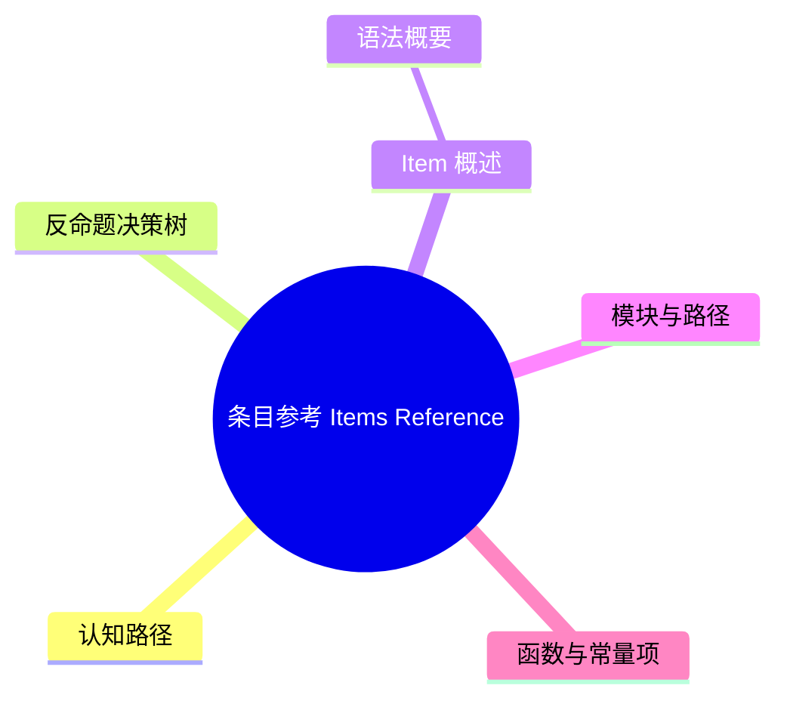

# 条目参考（Items Reference）

> **EN**: Items Reference
> **Summary**: Rust 语言中所有 item 种类的规范定义：模块（Module）、extern crate、use 声明、函数、类型别名、结构体（Struct）、枚举（Enum）、联合体、常量、静态项、trait、实现、外部块、泛型（Generics）参数与关联项。 Normative definitions of all Rust item kinds: modules, extern crate, use declarations, functions, type aliases, structs, enums, unions, constants, statics, traits, implementations, extern blocks, generic parameters, and associated items.
> **Rust 版本**: 1.97.0+ (Edition 2024)
>
> **受众**: [研究者]
> **内容分级**: [研究者级]
> **Bloom 层级**: L2-L4
> **权威来源**: 本文件为 `concept/` 权威页。
> **定位声明**: 本页为 Rust Reference 对应章节的**规范摘译与注解**（规范条文摘译 + 示例 + 交叉引用），非形式化推导或机器验证证明；形式化理论内容见 [Rustc 名称解析与 HIR](04_name_resolution_and_hir.md)。依据 [A/S/P 标记规范](../../00_meta/03_audit/02_asp_marking_guide.md) §3.4，L4 形式化层同时容纳 S（Specification）规范分析类内容，故本页保留于 L4，Bloom 层级维持与内容相符的标注（理解/分析层的规范内容）。
> **A/S/P 标记**: **S** — Specification
> **双维定位**: S×Ana — 规范分析
> **前置依赖**: [Crates and Source Files](../../01_foundation/07_modules_and_items/11_crates_and_source_files.md) · [Modules and Paths](../../01_foundation/07_modules_and_items/01_modules_and_paths.md) · [Visibility and Privacy](../../03_advanced/06_low_level_patterns/10_visibility_and_privacy.md)
> **后置概念**: [Attributes](12_attributes.md) · [Generics](../../02_intermediate/01_generics/01_generics.md) · [Traits](../../02_intermediate/00_traits/01_traits.md)
> **定理链**: Crate → Module → Item → Declaration
>
> **来源**: [Rust Reference — Items](https://doc.rust-lang.org/reference/items.html) · [Aho, Sethi & Ullman — Compilers: Principles, Techniques, and Tools](https://en.wikipedia.org/wiki/Compilers:_Principles,_Techniques,_and_Tools) · [Pierce — Types and Programming Languages](https://www.cis.upenn.edu/~bcpierce/tapl/)

---

## 认知路径

1. **问题识别**: 为什么条目参考在 Rust 中值得关注？crate 的静态结构、可见性边界和泛型（Generics）实例化都以 item 为单位。
2. **概念建立**: 掌握各类 item 的语法、语义和相互关系。
3. **机制推理**: 通过 ⟹ 定理链将 crate、模块（Module）、item 和声明串联起来。
4. **迁移应用**: 将条目参考与前置/后置概念链接，形成跨层知识网络。

---

## 反命题决策树

> **反命题 2**: "忽略条目参考的细节也能写出正确代码" ⟹ 不成立。item 可见性、泛型（Generics）参数和 trait 实现规则错误会直接导致编译失败。

> **反命题 3**: "其他语言对条目参考的处理方式可以直接迁移到 Rust" ⟹ 不成立。Rust 的 trait、impl、泛型参数和生命周期（Lifetimes）参数构成独特的 item 体系。

## 一、Item 概述

**Item（条目）** 是 Rust 模块（Module）中的声明单元，构成 crate 的静态结构。每个 item 都有名称、可见性和作用域。

主要 item 类别：

| Item | 声明关键字 | 说明 |
|:---|:---|:---|
| 模块 | `mod` | 命名空间容器 |
| Extern crate | `extern crate` | 引入外部 crate（2018 edition 后多数场景隐式） |
| Use 声明 | `use` | 名称重绑定与重导出 |
| 函数 | `fn` | 可调用代码单元 |
| 类型别名 | `type` | 现有类型的同义名 |
| 结构体（Struct） | `struct` | 命名字段复合类型 |
| 枚举（Enum） | `enum` | 带变体的代数数据类型 |
| 联合体 | `union` | 类似 C union 的内存共享类型 |
| 常量 | `const` | 编译期常量 |
| 静态项 | `static` | 全局生命周期（Lifetimes）变量 |
| Trait | `trait` | 抽象接口 |
| 实现 | `impl` | trait 实现或固有实现 |
| 外部块 | `extern` | FFI 声明块 |
| 泛型参数 | `<T>` | 类型/生命周期（Lifetimes）/const 参数 |
| 关联项 | `type` / `const` / `fn` | trait/impl 内部的从属 item |

### 语法概要

```bnf
Item       ::= OuterAttribute* VisItem | MacroItem
VisItem    ::= Visibility? (Module | ExternCrate | UseDeclaration
              | Function | TypeAlias | Struct | Enum | Union
              | ConstantItem | StaticItem | Trait | Implementation
              | ExternBlock)
Visibility ::= "pub" | "pub(crate)" | "pub(super)" | "pub(in SimplePath)"
```

## 二、模块与路径

模块（Module）通过 `mod name { ... }` 声明，可嵌套。`pub use` 可重导出外部名称，改变名称在模块树中的可见路径。

```rust
mod outer {
    pub mod inner {
        pub fn helper() {}
    }
    pub use inner::helper as public_helper;
}
```

## 三、函数与常量项

函数 item 可包含泛型参数、where 子句和 const 泛型：

```rust
fn max<T: Ord>(a: T, b: T) -> T {
    if a > b { a } else { b }
}

const THRESHOLD: u32 = 100;
static COUNTER: std::sync::Mutex<u32> = std::sync::Mutex::new(0);
```

## 四、类型定义项

| Item | 示例 | 说明 |
|:---|:---|:---|
| 结构体（Struct） | `struct Point { x: i32, y: i32 }` | 命名字段类型 |
| 元组结构体 | `struct Meters(u32);` | 单字段 newtype |
| 单元结构体 | `struct Flag;` | 无字段 |
| 枚举（Enum） | `enum Option<T> { Some(T), None }` | 带变体 |
| 联合体 | `union Value { i: i32, f: f32 }` | 内存共享，unsafe 访问 |
| 类型别名 | `type MyResult<T> = Result<T, Error>;` | 同义名 |

## 五、Trait 与实现

```rust,ignore
trait Drawable {
    fn draw(&self);
    fn bounds(&self) -> Bounds;
}

impl Drawable for Circle {
    fn draw(&self) { /* ... */ }
    fn bounds(&self) -> Bounds { /* ... */ }
}
```

实现分为两类：

- **Inherent impl**: `impl Type { ... }`，定义类型的固有方法。
- **Trait impl**: `impl Trait for Type { ... }`，实现外部 trait。

## 六、泛型参数与关联项

```rust
trait Container<T> {
    type Item;           // 关联类型
    const MAX: usize;    // 关联常量
    fn get(&self) -> Option<&Self::Item>; // 关联函数
}
```

## 七、外部块（Extern Blocks）

```rust
# use std::os::raw::c_int;
unsafe extern "C" {
    fn c_function(x: i32) -> i32;
    static C_GLOBAL: c_int;
}
```

外部块声明 FFI 边界，其内部函数和静态项默认为 `unsafe`。

```rust
mod inner {
    pub fn helper() {}
}

pub use inner::helper;
```

## 三、泛型参数

泛型参数分为三类：

| 参数 | 示例 | 约束位置 |
|:---|:---|:---|
| 类型参数 | `T` | `T: Trait` |
| 生命周期参数 | `'a` | `'a: 'b` |
| const 泛型 | `const N: usize` | 类型签名中 |

```rust
struct Matrix<T, const N: usize> {
    data: [[T; N]; N],
}

fn max<T: Ord>(a: T, b: T) -> T {
    if a > b { a } else { b }
}
```

## 四、关联项

Trait 和 impl 块内部可声明：

- **关联类型** `type Output;`
- **关联常量** `const MAX: usize;`
- **关联函数** `fn method();`

关联项通过 `T::Assoc` 或 `<T as Trait>::Assoc` 访问。

```rust
trait Add<Rhs = Self> {
    type Output;
    fn add(self, rhs: Rhs) -> Self::Output;
}
```

## 五、外部块与 ABI

```rust
unsafe extern "C" {
    fn c_function(x: i32) -> i32;
    static errno: i32;
}
```

外部块声明由其他语言或外部 crate 提供的符号，调用处必须在 `unsafe` 块中。

## 六、与属性的关系

几乎所有 item 都可接受属性，如 `#[derive(...)]`、`#[repr(...)]`、`#[cfg(...)]`。详见 [Attributes](12_attributes.md)。

## 七、Item 与 Unsafe 的交互

部分 item 天然与 `unsafe` 相关：

| Item 类型 | Unsafe 方面 |
|:---|:---|
| `extern` 块 | 声明外部函数，调用需 `unsafe` |
| `union` | 字段访问需 `unsafe` |
| `static mut` | 读写需 `unsafe` |
| `unsafe trait` | 实现需 `unsafe impl` |
| `unsafe fn` | 调用需 `unsafe` 块 |

详见 [Unsafe Rust](../../03_advanced/02_unsafe/01_unsafe.md)。

## 八、相关概念

| 概念 | 关系 |
|:---|:---|
| [Names and Resolution](06_names_and_resolution.md) | item 是声明和名称解析的核心对象 |
| [Attributes](12_attributes.md) | 属性修饰 item 行为 |
| [Generics Compiler Behavior](15_generics_compiler_behavior.md) | 泛型 item 的单态化（Monomorphization）行为 |
| [Trait Solver](03_trait_solver_in_rustc.md) | trait/impl item 的解析 |
| [Unsafe Rust](../../03_advanced/02_unsafe/01_unsafe.md) | 特定 item 需要 unsafe 上下文 |

## 过渡段

> **过渡**: 从 item 的种类枚举过渡到模块与可见性，可以理解 crate 静态结构的组织方式。
>
> **过渡**: 从泛型参数与关联项过渡到 trait 与实现，可以建立“抽象定义 + 具体实现”的 item 组合模型。
>
> **过渡**: 从 item 参考过渡到属性与宏（Macro）系统，可以理解编译期元编程如何扩展和修饰 item 语义。
>
---

> **权威来源**: [Rust Reference — Items](https://doc.rust-lang.org/reference/items.html) · [Aho, Sethi & Ullman — Compilers: Principles, Techniques, and Tools](https://en.wikipedia.org/wiki/Compilers:_Principles,_Techniques,_and_Tools) · [Pierce — Types and Programming Languages](https://www.cis.upenn.edu/~bcpierce/tapl/) · [Rust Reference — Modules](https://doc.rust-lang.org/reference/items/modules.html) · [Rust Reference — Generics](https://doc.rust-lang.org/reference/items/generics.html) · [Rust Reference](https://doc.rust-lang.org/reference/introduction.html) · [rustc Dev Guide](https://rustc-dev-guide.rust-lang.org/) · [Rust Project Goals](https://rust-lang.github.io/rust-project-goals/)
> **权威来源对齐变更日志**: 2026-07-10 补全权威来源标注（Rust Reference、TRPL、Rustonomicon、RFCs、学术论文） [Authority Source Sprint Batch L4](../../00_meta/02_sources/05_international_authority_index.md)

**文档版本**: 1.0
**最后更新**: 2026-07-10
**状态**: ✅ 权威来源对齐完成 (Batch L4)

---

## 国际权威参考 / International Authority References（P1 学术 · P2 生态）

> 依据 `AGENTS.md` §2「对齐网络国际化权威内容」补充：仅追加已验证可达的权威链接，不改动正文事实。

- **P1 学术/形式化**: [Aeneas: Rust Verification by Functional Translation (arXiv:2206.07185)](https://arxiv.org/abs/2206.07185) · [RustHorn: CHC-based Verification for Rust Programs (ESOP 2020, Springer LNCS)](https://link.springer.com/chapter/10.1007/978-3-030-44914-8_18)
- **P2 生态/社区**: [AeneasVerif/aeneas](https://github.com/AeneasVerif/aeneas) · [model-checking/kani — 模型检查器](https://github.com/model-checking/kani)

## 🧭 思维导图（Mindmap）



> **认知功能**: 本 mindmap 从本页章节结构提炼，一级分支对应核心主题，叶子节点为关键子概念，可作为本页的快速导航与复习索引。
---

## ⚠️ 反例与陷阱

> 陷阱：模块内的 item 默认私有，跨模块引用（Reference）会失败。
> 下面代码在 rustc 1.97 --edition 2024 下触发 `E0603`。

```rust,compile_fail,E0603
mod inner {
    fn secret() -> i32 { 42 }
}

fn main() {
    let _ = inner::secret();
}
```

**修正对照**：

```rust
mod inner {
    pub fn secret() -> i32 { 42 }
}

fn main() {
    let _ = inner::secret();
}
```
