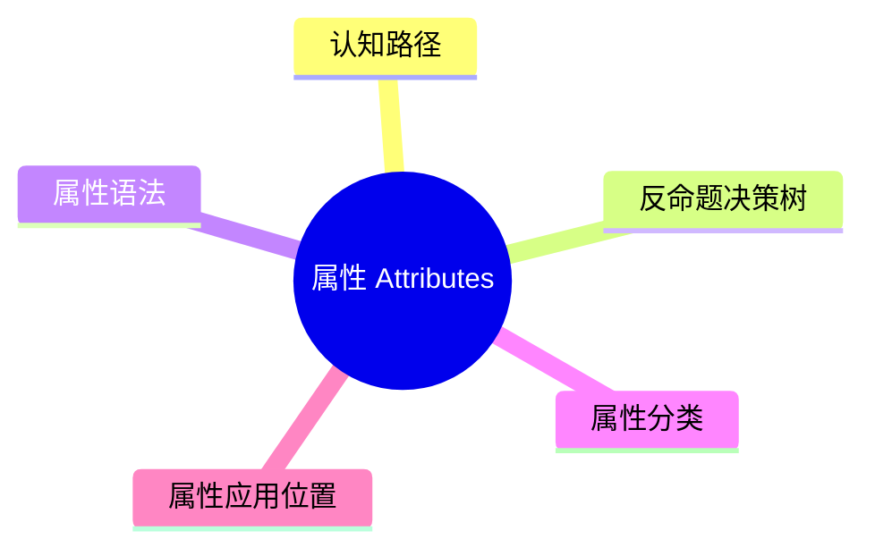

# 属性（Attributes）

> **EN**: Attributes
> **Summary**: Rust 属性系统：内置属性分类（测试、derive、诊断、代码生成、限制、类型系统（Type System）、调试器）及其在 item、表达式、语句上的应用规则。 Rust attribute system: built-in attribute categories and application rules on items, expressions, and statements.
> **Rust 版本**: 1.97.0+ (Edition 2024)
>
> **受众**: [研究者]
> **内容分级**: [研究级]
> **Bloom 层级**: L2-L3
> **权威来源**: 本文件为 `concept/` 权威页。
> **定位声明**: 本页为 Rust Reference 对应章节的**规范摘译与注解**（规范条文摘译 + 示例 + 交叉引用），非形式化推导或机器验证证明；形式化理论内容见 [MIR、Codegen 与 LLVM IR 入门](02_mir_codegen_llvm_primer.md)。依据 [A/S/P 标记规范](../../00_meta/03_audit/02_asp_marking_guide.md) §3.4，L4 形式化层同时容纳 S（Specification）规范分析类内容，故本页保留于 L4，Bloom 层级维持与内容相符的标注（理解/分析层的规范内容）。
> **A/S/P 标记**: **S** — Specification
> **双维定位**: S×App — 规范应用
> **前置依赖**: [Items Reference](11_items_reference.md) · [Macros](../../03_advanced/03_proc_macros/01_macros.md)
> **后置概念**: [Conditional Compilation](../../03_advanced/03_proc_macros/11_conditional_compilation.md) · [Derive Traits](../../02_intermediate/00_traits/06_derive_traits.md)
> **定理链**: Attribute → Metadata → Compiler Behavior
>
> **来源**: [Rust Reference — Attributes](https://doc.rust-lang.org/reference/attributes.html) · [Aho, Sethi & Ullman — Compilers: Principles, Techniques, and Tools](https://en.wikipedia.org/wiki/Compilers:_Principles,_Techniques,_and_Tools) · [Pierce — Types and Programming Languages](https://www.cis.upenn.edu/~bcpierce/tapl/)

---

## 认知路径

1. **问题识别**: 为什么属性在 Rust 中值得关注？属性是编译期元编程的核心机制，控制代码生成、条件编译、lint 级别和测试标记。
2. **概念建立**: 掌握属性的语法、分类和应用规则。
3. **机制推理**: 通过 ⟹ 定理链将属性元数据与编译器行为串联起来。
4. **迁移应用**: 将属性与前置/后置概念链接，形成跨层知识网络。

---

## 反命题决策树

> **反命题 2**: "忽略属性的细节也能写出正确代码" ⟹ 不成立。`#[repr(C)]`、`#[must_use]`、`#[non_exhaustive]` 等属性直接影响类型布局和接口语义。
> **反命题 3**: "其他语言对属性的处理方式可以直接迁移到 Rust" ⟹ 不成立。Rust 属性在词法阶段即被解析并影响宏（Macro）展开和类型检查，与 C# 注解或 Java 注解的运行时（Runtime）反射模型不同。

## 一、属性语法

属性以 `#[...]`（外层属性）或 `#![...]`（内层属性）形式出现：

- 外层属性作用于其后的 item。
- 内层属性作用于包含它的 item 或 crate。

```bnf
Attribute      ::= "#" "[" Attr "]"
InnerAttribute ::= "#!" "[" Attr "]"
Attr           ::= Path ("=" Literal | "(" TokenTree* ")")?
```

```rust
#![allow(dead_code)] // 内层：作用于当前模块/crate

#[derive(Debug)]     // 外层：作用于结构体
struct Point { x: i32, y: i32 }
```

## 二、属性分类

| 类别 | 主要属性 | 作用 |
|:---|:---|:---|
| 测试 | `#[test]`, `#[bench]`, `#[should_panic]` | 标记测试函数 |
| Derive | `#[derive(Trait)]` | 自动生成 trait 实现 |
| 诊断 | `#[allow]`, `#[warn]`, `#[deny]`, `#[forbid]`, `#[deprecated]` | 控制 lint 与弃用 |
| 代码生成 | `#[inline]`, `#[cold]`, `#[no_mangle]`, `#[repr(...)]` | 影响代码生成 |
| 限制 | `#[allow(...)]`、特性门（feature gate，每日构建版） | 能力开关 |
| 类型系统（Type System） | `#[non_exhaustive]`, `#[must_use]` | 影响类型/接口语义 |
| 调试器 | `#[debugger_visualizer]` | 调试器可视化 |
| 运行时（Runtime） | `#[global_allocator]`, `#[windows_subsystem]` | 运行时行为 |

## 三、属性应用位置

| 位置 | 示例 | 说明 |
|:---|:---|:---|
| Crate | 特性门属性（`#![...]` 内层形式） | 内层属性，作用于整个 crate |
| Module | `#![allow(...)]` | 作用于当前模块 |
| 函数 | `#[test]` | 作用于单个函数 |
| 结构体（Struct）/枚举（Enum） | `#[derive(Debug)]` | 作用于类型定义 |
| 字段 | `#[serde(rename = "...")]` | 作用于结构体（Struct）字段 |
| 表达式/语句 | 部分属性允许 | 如 `#[allow(unreachable_code)]` |

## 四、常用内置属性速查

| 属性 | 类别 | 作用 |
|:---|:---|:---|
| `#[derive(Trait)]` | 派生 | 自动生成 trait 实现 |
| `#[inline]` | 代码生成 | 建议内联 |
| `#[repr(C)]` | 代码生成 | C 兼容布局 |
| `#[must_use]` | 类型系统 | 忽略返回值时警告 |
| `#[non_exhaustive]` | 类型系统 | 禁止外部 crate 穷尽匹配 |
| `#[deprecated]` | 诊断 | 标记弃用 API |
| `#[cfg(...)]` | 条件编译 | 按条件包含代码 |
| `#[path = "..."]` | 模块（Module） | 指定模块文件路径 |
| `#[no_mangle]` | 代码生成 | 禁用符号名修饰 |
| `#[global_allocator]` | 运行时 | 指定全局分配器 |

## 五、条件编译属性

`#[cfg(...)]` 与 `cfg_attr(...)` 在编译期决定是否包含代码或属性。

```rust
#[cfg(target_os = "linux")]
fn linux_only() {}

#[cfg_attr(feature = "serde", derive(serde::Serialize))]
struct Data;
```

| 谓词 | 说明 |
|:---|:---|
| `cfg(target_os = "...")` | 目标操作系统 |
| `cfg(target_arch = "...")` | 目标架构 |
| `cfg(feature = "...")` | Cargo feature |
| `cfg(test)` | 测试模式 |
| `cfg(debug_assertions)` | debug 构建 |

详见 [Conditional Compilation](../../03_advanced/03_proc_macros/11_conditional_compilation.md)。

## 四、文档注释

文档注释 `///` 与 `//!` 本质上是 `#[doc = "..."]` 属性的语法糖。

```rust
/// A point in 2D space.
struct Point;
```

等价于：

```rust
#[doc = " A point in 2D space."]
struct Point;
```

## 五、与宏的关系

过程宏（procedural macro）和声明宏（Declarative Macro）（`macro_rules!`）都可生成属性。属性宏在宏展开阶段执行，可读取或替换被装饰的 item。

```rust,ignore
#[my_attribute_macro]
fn decorated() {}
```

属性宏（Macro）接收整个 item 的 token tree，可以：

- 保留原 item 不变。
- 生成额外的 item。
- 完全替换原 item。

## 六、Unsafe 相关属性

| 属性 | 作用 | 示例 |
|:---|:---|:---|
| `#[no_mangle]` | 禁止符号名修饰，用于 FFI | `#[no_mangle] pub extern "C" fn foo() {}` |
| `#[export_name = "..."]` | 显式指定导出符号名 | `#[export_name = "bar"] fn foo() {}` |
| `#[link(name = "...")]` | 链接外部库 | `#[link(name = "openssl")]` |

这些属性经常与 [Unsafe Rust](../../03_advanced/02_unsafe/01_unsafe.md) 和 FFI 代码配合使用。

### Feature 元数据（RFC 3416）

> **来源**: [RFC 3416 — Feature metadata](https://rust-lang.github.io/rfcs/3416-feature-metadata.html)

RFC 3416 为 `#![feature(...)]` 属性引入**结构化元数据**要求：nightly 特性门需携带可机器读取的说明信息（如关联 tracking issue、责任团队），使编译器与工具链能对特性使用进行审计与统计。这是 T-compiler 内部治理 RFC，对终端用户语法无直接影响，但决定了 `--check-cfg` 类工具与不稳定特性报告的元数据基础（参见 [Compiler Infrastructure](../../06_ecosystem/00_toolchain/05_compiler_infrastructure.md) 与 [rustc 编译器诊断与 UI Tests](../../06_ecosystem/00_toolchain/11_compiler_diagnostics_and_ui_tests.md)）。

## 七、相关概念

| 概念 | 关系 |
|:---|:---|
| [Items Reference](11_items_reference.md) | 属性修饰 item |
| [Macros](../../03_advanced/03_proc_macros/01_macros.md) | 属性宏在宏展开阶段执行 |
| [Conditional Compilation](../../03_advanced/03_proc_macros/11_conditional_compilation.md) | `#[cfg]` 控制条件编译 |
| [Generics Compiler Behavior](15_generics_compiler_behavior.md) | `#[inline]` 影响单态化（Monomorphization）代码生成 |
| [Unsafe Rust](../../03_advanced/02_unsafe/01_unsafe.md) | `#[no_mangle]`、`#[link]` 用于 unsafe/FFI 场景 |

---

> **权威来源**: [Rust Reference — Attributes](https://doc.rust-lang.org/reference/attributes.html) · [Aho, Sethi & Ullman — Compilers: Principles, Techniques, and Tools](https://en.wikipedia.org/wiki/Compilers:_Principles,_Techniques,_and_Tools) · [Pierce — Types and Programming Languages](https://www.cis.upenn.edu/~bcpierce/tapl/) · [Rust Reference — Conditional Compilation](https://doc.rust-lang.org/reference/conditional-compilation.html) · [Rust Reference — Derive](https://doc.rust-lang.org/reference/attributes/derive.html) · [Rust Reference](https://doc.rust-lang.org/reference/introduction.html) · [rustc Dev Guide](https://rustc-dev-guide.rust-lang.org/) · [Rust Project Goals](https://rust-lang.github.io/rust-project-goals/)
> **权威来源对齐变更日志**: 2026-07-10 补全权威来源标注（Rust Reference、TRPL、Rustonomicon、RFCs、学术论文） [Authority Source Sprint Batch L4](../../00_meta/02_sources/05_international_authority_index.md)

**文档版本**: 1.0
**最后更新**: 2026-07-10
**状态**: ✅ 权威来源对齐完成 (Batch L4)

---

## 国际权威参考 / International Authority References（P1 学术 · P2 生态）

> 依据 `AGENTS.md` §2「对齐网络国际化权威内容」补充：仅追加已验证可达的权威链接，不改动正文事实。

- **P1 学术/形式化**: [RustHorn: CHC-based Verification for Rust Programs (ESOP 2020, Springer LNCS)](https://link.springer.com/chapter/10.1007/978-3-030-44914-8_18) · [Oxide: The Essence of Rust (arXiv:1903.00982)](https://arxiv.org/abs/1903.00982)
- **P2 生态/社区**: [docs.rs/syn — 生态权威 API 文档](https://docs.rs/syn) · [docs.rs/quote — 生态权威 API 文档](https://docs.rs/quote)

## 🧭 思维导图（Mindmap）



> **认知功能**: 本 mindmap 从本页章节结构提炼，一级分支对应核心主题，叶子节点为关键子概念，可作为本页的快速导航与复习索引。
---

## ⚠️ 反例与陷阱

> 陷阱：`#[derive]` 只能用于 struct、enum、union，贴到函数等不支持 derive 的 item 上会产生错误。
> 下面代码在 rustc 1.97 --edition 2024 下触发 `E0774`。

```rust,compile_fail,E0774
#[derive(Debug)]
fn foo() {}

fn main() {}
```

**修正对照**：

```rust
#[derive(Debug)]
struct Point(i32, i32);

fn main() {
    let p = Point(1, 2);
    println!("{:?}", p);
}
```
