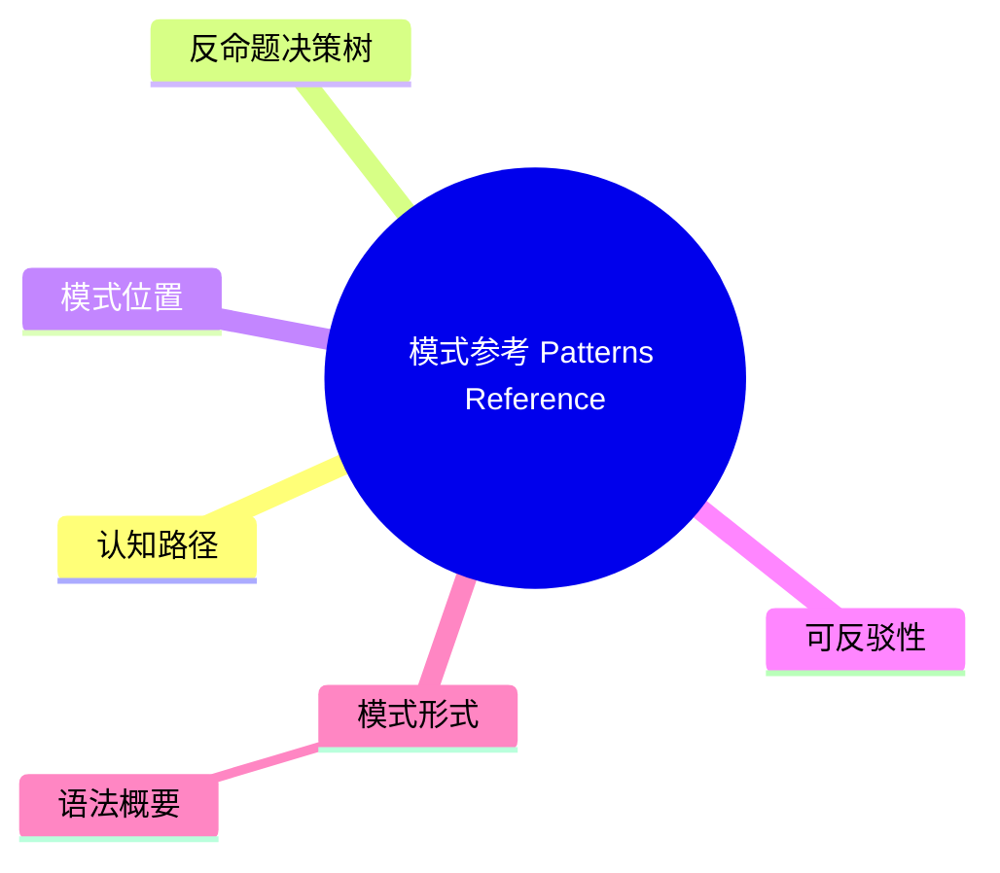

# 模式参考（Patterns Reference）

> **EN**: Patterns Reference
> **Summary**: Rust 模式系统的规范：模式位置、可反驳/不可反驳模式、各种模式形式（字面量、标识符、通配符、范围、引用（Reference）、结构体（Struct）、元组、数组、or、guard 等）及其绑定规则。 Normative description of Rust patterns: pattern positions, refutable/irrefutable patterns, all pattern forms, and binding rules.
> **Rust 版本**: 1.97.0+ (Edition 2024)
>
> **受众**: [研究者]
> **内容分级**: [研究级]
> **Bloom 层级**: L2-L4
> **权威来源**: 本文件为 `concept/` 权威页。
> **定位声明**: 本页为 Rust Reference 对应章节的**规范摘译与注解**（规范条文摘译 + 示例 + 交叉引用），非形式化推导或机器验证证明；形式化理论内容见 [类型检查与推断](../00_type_theory/07_type_checking_and_inference.md)。依据 [A/S/P 标记规范](../../00_meta/03_audit/02_asp_marking_guide.md) §3.4，L4 形式化层同时容纳 S（Specification）规范分析类内容，故本页保留于 L4，Bloom 层级维持与内容相符的标注（理解/分析层的规范内容）。
> **A/S/P 标记**: **S** — Specification
> **双维定位**: S×Ana — 规范分析
> **前置依赖**: [Patterns](../../01_foundation/04_control_flow/02_patterns.md) · [Statements and Expressions Reference](13_statements_and_expressions_reference.md) · [Variables](../../03_advanced/06_low_level_patterns/09_variables.md)
> **后置概念**: [Destructors](09_destructors.md) · [Match Expressions](13_statements_and_expressions_reference.md)
> **定理链**: Value → Pattern Match → Binding → Destructuring
>
> **来源**: [Rust Reference — Patterns](https://doc.rust-lang.org/reference/patterns.html) · [Aho, Sethi & Ullman — Compilers: Principles, Techniques, and Tools](https://en.wikipedia.org/wiki/Compilers:_Principles,_Techniques,_and_Tools) · [Pierce — Types and Programming Languages](https://www.cis.upenn.edu/~bcpierce/tapl/)

---

## 认知路径

1. **问题识别**: 为什么模式参考在 Rust 中值得关注？模式匹配（Pattern Matching）是 Rust 控制流和数据解构的核心，穷尽性检查保障了安全性。
2. **概念建立**: 掌握模式位置、可反驳性、各种模式形式和绑定规则。
3. **机制推理**: 通过 ⟹ 定理链将值、模式匹配（Pattern Matching）、绑定和解构串联起来。
4. **迁移应用**: 将模式参考与前置/后置概念链接，形成跨层知识网络。

---

## 反命题决策树

> **反命题 2**: "忽略模式参考的细节也能写出正确代码" ⟹ 不成立。不可反驳模式误用、绑定模式错误和穷尽性检查失败都会导致编译错误。
> **反命题 3**: "其他语言对模式参考的处理方式可以直接迁移到 Rust" ⟹ 不成立。Rust 的所有权（Ownership）移动、引用（Reference）模式和 `@` 绑定具有语言特有语义。

## 一、模式位置

Rust 模式出现在以下上下文：

| 位置 | 示例 |
|:---|:---|
| `let` 语句 | `let Some(x) = opt;` |
| 函数参数 | `fn foo((a, b): (i32, i32)) {}` |
| `match` 分支 | `match x { 1 => ..., _ => ... }` |
| `if let` / `while let` | `if let Ok(v) = res { ... }` |
| `for` 循环 | `for (k, v) in map { ... }` |

## 二、可反驳性

| 模式类型 | 说明 | 示例 |
|:---|:---|:---|
| 不可反驳（irrefutable） | 任何值都匹配 | `x`, `(a, b)`, `Some(x)`（当类型仅含此变体） |
| 可反驳（refutable） | 某些值不匹配 | `Some(x)`, `1..=10`, `Ok(v)` |

`let` 与函数参数要求不可反驳模式（除非使用 `@` 等允许可反驳的扩展上下文）。

```rust,ignore
let x = 5;              // 不可反驳
let Some(y) = opt;      // 错误：let 要求不可反驳模式
if let Some(y) = opt {  // OK：if let 允许可反驳模式
    // ...
}
```

## 三、模式形式

| 模式 | 说明 | 示例 |
|:---|:---|:---|
| 通配符 | 匹配任意值，不绑定 | `_` |
| 标识符 | 绑定整个值 | `x` |
| 字面量 | 匹配具体常量 | `42`, `"x"` |
| 范围 | 匹配区间内的值 | `1..=10` |
| 引用 | 匹配引用 | `&x`, `&mut y` |
| 结构体（Struct） | 按字段解构 | `Point { x, y }` |
| 元组 | 按位置解构 | `(a, b, c)` |
| 数组/切片（Slice） | 匹配数组或可变长度切片 | `[a, b, ..]` |
| 枚举（Enum）变体 | 匹配枚举 | `Some(x)`, `None` |
| `@` 绑定 | 同时匹配并绑定 | `e @ 1..=10` |
| `\|` 或模式 | 多个模式之一 | `1 \| 2 \| 3` |
| `..` / `..=` | 忽略剩余字段或范围边界 | `Point { x, .. }` |
| Guard | 匹配后附加条件 | `x if x > 0 => ...` |

### 语法概要

```bnf
Pattern          ::= PatternWithoutRange | RangePattern
PatternNoTopAlt  ::= OrPattern | PatternWithoutRange
OrPattern        ::= PatternWithoutRange ("|" PatternWithoutRange)*
PatternWithoutRange ::= LiteralPattern | IdentifierPattern
                     | WildcardPattern | RestPattern
                     | ReferencePattern | StructPattern
                     | TupleStructPattern | TuplePattern
                     | GroupedPattern | SlicePattern
                     | PathPattern | MacroInvocation
```

## 四、绑定模式

默认绑定为 `move`；使用 `ref` 和 `ref mut` 可改为按引用绑定：

```rust
let mut x = &mut 5;
match x {
    ref mut n => **n += 1,
}
```

> 在 2024 Edition 之前，`ref`/`ref mut` 在 `match` 中常见；现代 Rust 更推荐通过类型系统（Type System）显式使用 `&` / `&mut` 模式。

```rust
// 推荐写法
let mut x = 5;
match &mut x {
    n => *n += 1,
}
```

## 五、穷尽性检查

`match` 要求模式覆盖被匹配类型的所有可能值。编译器使用模式穷尽性算法确保无遗漏。

```rust
enum Color { Red, Green, Blue }

fn get_rgb(c: Color) -> u32 {
    match c {
        Color::Red => 0xFF0000,
        Color::Green => 0x00FF00,
        Color::Blue => 0x0000FF,
    } // OK：穷尽
}
```

## 六、模式与 Unsafe 的交互

某些模式涉及 unsafe 语义：

- 读取 `union` 字段需要 unsafe 上下文，尽管模式本身可能看起来是 safe 的。
- 通过裸指针解引用后的值进行模式匹配（Pattern Matching）需要在 unsafe 块内完成。

详见 [Unsafe Rust](../../03_advanced/02_unsafe/01_unsafe.md)。

## 七、相关概念

| 概念 | 关系 |
|:---|:---|
| [Statements and Expressions Reference](13_statements_and_expressions_reference.md) | `match`、`if let` 等表达式使用模式 |
| [Destructors](09_destructors.md) | 模式解构涉及所有权（Ownership）转移和析构 |
| [Names and Resolution](06_names_and_resolution.md) | 模式中的标识符是新的绑定 |
| [Unsafe Rust](../../03_advanced/02_unsafe/01_unsafe.md) | union 和裸指针解引用需要 unsafe |

---

> **权威来源**: [Rust Reference — Patterns](https://doc.rust-lang.org/reference/patterns.html) · [Aho, Sethi & Ullman — Compilers: Principles, Techniques, and Tools](https://en.wikipedia.org/wiki/Compilers:_Principles,_Techniques,_and_Tools) · [Pierce — Types and Programming Languages](https://www.cis.upenn.edu/~bcpierce/tapl/) · [Rust Reference — Match Expressions](https://doc.rust-lang.org/reference/expressions/match-expr.html) · [Rust Reference — Let Statements](https://doc.rust-lang.org/reference/statements.html#let-statements) · [Rust Reference](https://doc.rust-lang.org/reference/introduction.html) · [rustc Dev Guide](https://rustc-dev-guide.rust-lang.org/) · [Rust Project Goals](https://rust-lang.github.io/rust-project-goals/)
> **权威来源对齐变更日志**: 2026-07-10 补全权威来源标注（Rust Reference、TRPL、Rustonomicon、RFCs、学术论文） [Authority Source Sprint Batch L4](../../00_meta/02_sources/05_international_authority_index.md)

**文档版本**: 1.0
**最后更新**: 2026-07-10
**状态**: ✅ 权威来源对齐完成 (Batch L4)

---

## ⚠️ 反例与陷阱

**反例：在 `let` 中使用可反驳模式** —— `let` 要求不可反驳（irrefutable）模式。

```rust,compile_fail
// rustc 1.97.0 实测：error[E0005]: refutable pattern in local binding
fn main() {
    let Some(x) = Option::<i32>::None;
    println!("{x}");
}
```

**修正对照**：用 `let...else` 或 `if let` 处理反驳分支。

```rust
fn main() {
    let Some(x) = Option::<i32>::Some(1) else { return };
    println!("{x}");
}
```

**陷阱要点**：模式按反驳性二分——`let`/函数参数/`for` 只接受不可反驳模式；`match` 臂、`if let`、`let...else` 接受可反驳模式。`E0005` 是这条语法范畴边界的编译期执法。

---

## 国际权威参考 / International Authority References（P1 学术 · P2 生态）

> 依据 `AGENTS.md` §2「对齐网络国际化权威内容」补充：仅追加已验证可达的权威链接，不改动正文事实。

- **P1 学术/形式化**: [Aeneas: Rust Verification by Functional Translation (arXiv:2206.07185)](https://arxiv.org/abs/2206.07185) · [RustHorn: CHC-based Verification for Rust Programs (ESOP 2020, Springer LNCS)](https://link.springer.com/chapter/10.1007/978-3-030-44914-8_18)
- **P2 生态/社区**: [model-checking/verify-rust-std](https://github.com/model-checking/verify-rust-std) · [verus-lang/verus — SMT 验证器](https://github.com/verus-lang/verus)

## 🧭 思维导图（Mindmap）



> **认知功能**: 本 mindmap 从本页章节结构提炼，一级分支对应核心主题，叶子节点为关键子概念，可作为本页的快速导航与复习索引。
