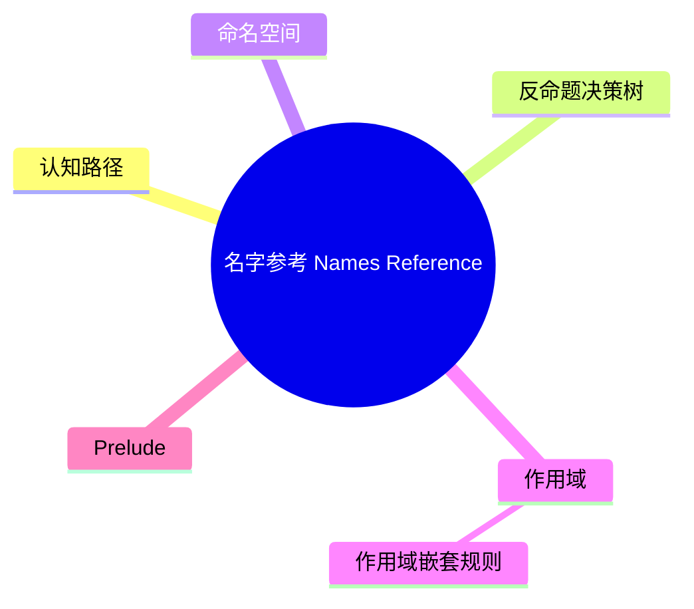

# 名字参考（Names Reference）

> **EN**: Names Reference
> **Summary**: Rust 名字系统的规范：命名空间、作用域、prelude、路径、名字解析规则，以及可见性如何与命名空间交互。 Normative description of Rust names: namespaces, scopes, prelude, paths, resolution rules, and visibility interaction.
> **Rust 版本**: 1.97.0+ (Edition 2024)
>
> **受众**: [研究者]
> **内容分级**: [研究级]
> **Bloom 层级**: L2-L4
> **权威来源**: 本文件为 `concept/` 权威页。
> **定位声明**: 本页为 Rust Reference 对应章节的**规范摘译与注解**（规范条文摘译 + 示例 + 交叉引用），非形式化推导或机器验证证明；形式化理论内容见 [Rustc 名称解析与 HIR](04_name_resolution_and_hir.md)。依据 [A/S/P 标记规范](../../00_meta/03_audit/02_asp_marking_guide.md) §3.4，L4 形式化层同时容纳 S（Specification）规范分析类内容，故本页保留于 L4，Bloom 层级维持与内容相符的标注（理解/分析层的规范内容）。
> **A/S/P 标记**: **S** — Specification
> **双维定位**: S×Ana — 规范分析
> **前置依赖**: [Modules and Paths](../../01_foundation/07_modules_and_items/01_modules_and_paths.md) · [Names and Resolution](06_names_and_resolution.md) · [Visibility and Privacy](../../03_advanced/06_low_level_patterns/10_visibility_and_privacy.md)
> **后置概念**: [Items Reference](11_items_reference.md) · [Patterns Reference](14_patterns_reference.md)
> **定理链**: Source File → Module Tree → Namespace → Scope → Name Resolution
>
> **来源**: [Rust Reference — Names](https://doc.rust-lang.org/reference/names.html) · [rustc-dev-guide — Name Resolution](https://rustc-dev-guide.rust-lang.org/name-resolution.html) · [Aho, Sethi & Ullman — Compilers: Principles, Techniques, and Tools](https://en.wikipedia.org/wiki/Compilers:_Principles,_Techniques,_and_Tools) · [Pierce — Types and Programming Languages](https://www.cis.upenn.edu/~bcpierce/tapl/)

---

## 认知路径

1. **问题识别**: 为什么名字参考在 Rust 中值得关注？同名冲突、路径解析、prelude 行为和可见性边界都依赖名字系统的精确规则。
2. **概念建立**: 掌握命名空间、作用域、prelude、路径和名字解析的核心定义。
3. **机制推理**: 通过 ⟹ 定理链将源文件、模块（Module）树、命名空间、作用域和名字解析串联起来。
4. **迁移应用**: 将名字参考与前置/后置概念链接，形成跨层知识网络。

---

## 反命题决策树

> **反命题 2**: "忽略名字参考的细节也能写出正确代码" ⟹ 不成立。命名空间隔离错误、`use` 冲突和可见性违规是常见的编译错误来源。
> **反命题 3**: "其他语言对名字参考的处理方式可以直接迁移到 Rust" ⟹ 不成立。Rust 的四层命名空间、`Self`/`self`/`super` 路径和 crate 相对路径具有独特性。

## 一、命名空间

Rust 将名字分为多个命名空间：

| 命名空间 | 包含 | 示例 |
|:---|:---|:---|
| 类型命名空间 | `struct`, `enum`, `union`, `trait`, `type`, `mod` | `struct Foo; fn Foo() {}` 可共存 |
| 值命名空间 | `fn`, `const`, `static`, 绑定，关联函数 | 同一作用域不可重复 |
| 宏（Macro）命名空间 | `macro_rules!`, 过程宏（Procedural Macro） | 通过 `name!()` 调用 |
| 生命周期（Lifetimes）命名空间 | 生命周期参数 `'a` | 独立解析 |

同一作用域内，不同类型空间的名字可以同名；同一空间内不可重复。

## 二、作用域

作用域决定名字在何处可见：

| 作用域类型 | 说明 |
|:---|:---|
| 模块（Module）作用域 | 整个模块可见 |
| 块作用域 | 仅在 `{}` 内可见 |
| 函数参数作用域 | 函数体可见 |
| 模式作用域 | `match` 分支或 `let` 绑定后可见 |
| 实现作用域 | `impl` 块内可见 |

### 作用域嵌套规则

```rust
fn outer() {
    let x = 1;          // 外层作用域
    {
        let x = 2;      // 内层遮蔽外层
        println!("{}", x); // 2
    }
    println!("{}", x);  // 1
}
```

## 三、Prelude

Prelude 是自动导入的名字集合：

- `std::prelude::rust_2024`
- 包含 `Option`, `Result`, `Vec`, `String`, `Drop`, `Copy` 等核心 trait 和类型。

| Edition | Prelude 模块（Module） |
|:---|:---|
| 2015 | `std::prelude::v1` |
| 2018 | `std::prelude::v1` |
| 2021 | `std::prelude::rust_2021` |
| 2024 | `std::prelude::rust_2024` |

详见 [Preludes](../../01_foundation/07_modules_and_items/10_preludes.md)。

## 四、路径

路径用于定位名字：

| 路径形式 | 示例 | 说明 |
|:---|:---|:---|
| 相对路径 | `foo::bar` | 从当前模块开始 |
| 绝对路径 | `::crate::foo::bar` | 从 crate 根开始 |
| 自我路径 | `self::foo`, `super::bar` | 当前模块 / 父模块 |
| `Self` 路径 | `Self::Assoc` | 当前实现类型 |
| `crate` 路径 | `crate::foo` | 2018+ edition 的 crate 根 |

### 路径语法

```bnf
Path          ::= PathExprSegment ("::" PathExprSegment)*
PathExprSegment ::= PathIdentSegment ("::" GenericArgs)?
PathIdentSegment ::= Identifier | "super" | "self" | "Self" | "crate" | "$crate"
```

## 五、名字解析过程

1. 根据路径前缀确定搜索起点。
2. 在对应命名空间中逐级查找。
3. 应用可见性规则过滤私有项。
4. 处理 `use` 重导出和 `pub use` 的别名。

### 版本差异

| Edition | `use foo::bar` 起点 | `extern crate` 行为 |
|:---|:---|:---|
| 2015 | 当前模块 | 通常需要显式声明 |
| 2018 | 当前模块或外部 crate | 隐式，但可用显式别名 |
| 2021 | 同 2018 | 同 2018 |
| 2024 | 同 2018，部分路径解析更严格 | 同 2018 |

## 六、与可见性的交互

可见性规则决定名字是否能被特定路径访问。公共项（`pub`）可被外部访问；私有项默认仅对当前模块及子模块可见。

```rust
mod inner {
    pub fn public() {}
    fn private() {}     // 默认私有
}

fn main() {
    inner::public();    // OK
    // inner::private(); // 错误：私有
}
```

## 七、相关概念

| 概念 | 关系 |
|:---|:---|
| [Names and Resolution](06_names_and_resolution.md) | 本页是 Names 的规范参考视图 |
| [Items Reference](11_items_reference.md) | item 是名字声明的主要载体 |
| [Patterns Reference](14_patterns_reference.md) | 模式引入新的名字绑定 |
| [Preludes](../../01_foundation/07_modules_and_items/10_preludes.md) | prelude 是隐式名字注入机制 |
| [Unsafe Rust](../../03_advanced/02_unsafe/01_unsafe.md) | `unsafe` 符号和 FFI 名字有特殊规则 |

---

> **权威来源**: [Rust Reference — Names](https://doc.rust-lang.org/reference/names.html) · [Aho, Sethi & Ullman — Compilers: Principles, Techniques, and Tools](https://en.wikipedia.org/wiki/Compilers:_Principles,_Techniques,_and_Tools) · [Pierce — Types and Programming Languages](https://www.cis.upenn.edu/~bcpierce/tapl/) · [Rust Reference — Namespaces and Scopes](https://doc.rust-lang.org/reference/names/namespaces.html) · [Rust Reference — Paths](https://doc.rust-lang.org/reference/paths.html) · [Rust Reference](https://doc.rust-lang.org/reference/introduction.html) · [rustc Dev Guide](https://rustc-dev-guide.rust-lang.org/) · [Rust Project Goals](https://rust-lang.github.io/rust-project-goals/)
> **权威来源对齐变更日志**: 2026-07-10 补全权威来源标注（Rust Reference、TRPL、Rustonomicon、RFCs、学术论文） [Authority Source Sprint Batch L4](../../00_meta/02_sources/05_international_authority_index.md)

**文档版本**: 1.0
**最后更新**: 2026-07-10
**状态**: ✅ 权威来源对齐完成 (Batch L4)

---

## ⚠️ 反例与陷阱

**反例：同一命名空间重复定义** —— 名称的唯一性约束在解析阶段执法。

```rust,compile_fail
// rustc 1.97.0 实测：error[E0428]: the name `dup` is defined multiple times
fn dup() {}
fn dup() {}
fn main() { dup(); }
```

**修正对照**：重命名，或改用泛型（Generics）/trait 分发表达「同名多态」。

```rust
fn dup() {}
fn dup2() {}
fn main() { dup(); dup2(); }
```

**陷阱要点**：值命名空间内函数不可重载——Rust 没有 C++ 式 overload；「同名不同签名」必须用 trait 方法、泛型或不同名表达。宏（Macro）展开产生的重复定义同样触发 `E0428`。

---

## 国际权威参考 / International Authority References（P1 学术 · P2 生态）

> 依据 `AGENTS.md` §2「对齐网络国际化权威内容」补充：仅追加已验证可达的权威链接，不改动正文事实。

- **P1 学术/形式化**: [RustHorn: CHC-based Verification for Rust Programs (ESOP 2020, Springer LNCS)](https://link.springer.com/chapter/10.1007/978-3-030-44914-8_18) · [Oxide: The Essence of Rust (arXiv:1903.00982)](https://arxiv.org/abs/1903.00982)
- **P2 生态/社区**: [verus-lang/verus — SMT 验证器](https://github.com/verus-lang/verus) · [creusot-rs/creusot — Rust 演绎验证](https://github.com/creusot-rs/creusot)

## 🧭 思维导图（Mindmap）



> **认知功能**: 本 mindmap 从本页章节结构提炼，一级分支对应核心主题，叶子节点为关键子概念，可作为本页的快速导航与复习索引。
