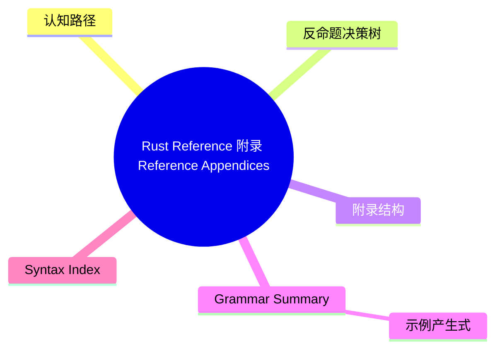

# Rust Reference 附录（Reference Appendices）

> **EN**: Reference Appendices
> **Summary**: Rust Reference 附录概览：语法摘要、语法索引、宏 follow-set 歧义规范、语言影响、测试摘要与术语表。 Overview of Rust Reference appendices: grammar summary, syntax index, macro follow-set ambiguity, language influences, test summary, and glossary.
> **Rust 版本**: 1.97.0+ (Edition 2024)
>
> **受众**: [研究者]
> **内容分级**: [研究者级]
> **Bloom 层级**: L2-L4
> **权威来源**: 本文件为 `concept/` 权威页。
> **定位声明**: 本页为 Rust Reference 对应章节的**规范摘译与注解**（规范条文摘译 + 示例 + 交叉引用），非形式化推导或机器验证证明；形式化理论内容见 [Notation](../06_notation/01_notation.md)。依据 [A/S/P 标记规范](../../00_meta/03_audit/02_asp_marking_guide.md) §3.4，L4 形式化层同时容纳 S（Specification）规范分析类内容，故本页保留于 L4，Bloom 层级维持与内容相符的标注（理解/分析层的规范内容）。
> **A/S/P 标记**: **S** — Specification
> **双维定位**: S×Ref — 规范参考
> **前置依赖**: [Notation](../06_notation/01_notation.md) · [Lexical Structure](10_lexical_structure.md) · [Items Reference](11_items_reference.md)
> **后置概念**: [Statements and Expressions Reference](13_statements_and_expressions_reference.md) · [Patterns Reference](14_patterns_reference.md)
> **定理链**: Grammar → Lexicon → Syntax Index → Test Summary
>
> **来源**: [Rust Reference — Appendices](https://doc.rust-lang.org/reference/appendices.html) · [Aho, Sethi & Ullman — Compilers: Principles, Techniques, and Tools](https://en.wikipedia.org/wiki/Compilers:_Principles,_Techniques,_and_Tools) · [Pierce — Types and Programming Languages](https://www.cis.upenn.edu/~bcpierce/tapl/)

---

> **跨层回溯**: [宏系统](../../03_advanced/03_proc_macros/01_macros.md) · [过程宏（Procedural Macro）](../../03_advanced/03_proc_macros/02_proc_macro.md)

---

## 认知路径

1. **问题识别**: 为什么 Rust Reference 附录值得关注？附录汇总了完整文法、语法索引和宏（Macro）歧义规则，是阅读规范时的快速参考。
2. **概念建立**: 掌握附录结构、语法摘要、语法索引和术语表的内容。
3. **机制推理**: 通过 ⟹ 定理链将文法、词法、语法索引和测试摘要串联起来。

---

## 反命题决策树

> **反命题 3**: "其他语言对参考附录的处理方式可以直接迁移到 Rust" ⟹ 不成立。Rust Reference 附录的组织方式、测试映射和术语定义具有语言特异性。

## 一、附录结构

Rust Reference 包含以下附录：

| 附录 | 主题 | 用途 |
|:---|:---|:---|
| A | Grammar Summary | 完整文法产生式汇总 |
| B | Syntax Index | 按关键字/符号索引语法规则 |
| C | Macro Follow-Set Ambiguity | `macro_rules!` follow-set 歧义判定 |
| D | Influences | Rust 设计的语言和理论影响 |
| E | Glossary | 术语表 |
| F | Test Summary | Reference 规则与 rustc 测试的映射 |

## 二、Grammar Summary

Grammar Summary 汇总 Rust 完整文法，包括：

- Lexical 产生式（token 定义）
- 语句和表达式产生式
- 类型、模式、item 产生式
- 属性与 macro 产生式

阅读时应结合 [Notation](../06_notation/01_notation.md) 理解产生式符号。

### 示例产生式

```bnf
BlockExpression ::= "{" Statement* Expression? "}"
Statement       ::= LetStatement | ItemStatement | ExpressionStatement
LetStatement    ::= "let" Pattern (":" Type)? ("=" Expression)? ";"
```

## 三、Syntax Index

Syntax Index 按关键字和标点符号列出相关语法规则，便于快速查找：

| 符号/关键字 | 相关规则 |
|:---|:---|
| `fn` | 函数定义、函数指针类型 |
| `impl` | 实现、inherent impl、trait impl |
| `->` | 返回类型、函数类型 |
| `?` | try 运算符、宏（Macro）重复计数器 |
| `unsafe` | `unsafe` 块、函数、trait、impl |
| `async` | async 块、async 闭包（Closures） |
| `match` | match 表达式 |

## 四、Macro Follow-Set Ambiguity

该附录形式化定义 `macro_rules!` 重复模式后接 token 是否会产生解析歧义，决定宏定义是否合法。

核心规则：若某 token 可能作为多个重复模式的 follow，则产生歧义。

```rust
macro_rules! ambiguous {
    ($($e:expr),* $(,)?) => {}; // OK：尾随逗号处理
}
```

### Follow-Set 规则概要

| 片段分类器 | Follow-Set 示例 |
|:---|:---|
| `expr` | `=>`, `,`, `;` 等 |
| `stmt` | `=>`, `,`, `;` 等 |
| `ty` | `=>`, `,`, `=`, `>`, `;` 等 |
| `pat` | `=>`, `,`, `=`, `\|`, `if`, `in` 等 |

## 五、Influences

Rust 受到多种语言影响：

| 语言/理论 | 影响领域 |
|:---|:---|
| C/C++ | 零成本抽象（Zero-Cost Abstraction）、内存布局、FFI |
| ML/OCaml | 类型推断（Type Inference）、代数数据类型、模式匹配（Pattern Matching） |
| Haskell | Type classes → traits、类型系统（Type System） |
| Cyclone | 区域类型、借用（Borrowing）概念 |
| Linear Logic | 所有权（Ownership）与资源管理 |
| Newsqueak/Alef/Limbo | 通道与并发模型 |

## 六、Glossary

术语表定义 Rust Reference 中使用的核心术语：

| 术语 | 定义 |
|:---|:---|
| item | crate 中的声明单元 |
| place expression | 表示内存位置的表达式 |
| value expression | 产生值的表达式 |
| const context | 要求常量表达式的上下文 |
| dangling pointer | 指向已释放内存的指针 |
| unsized type | 编译期大小未知的类型，如 `dyn Trait` |

## 七、测试摘要

Rust Reference 附录的 Test Summary 将规范规则映射到 rustc 测试文件，帮助实现者和研究者验证规范与编译器行为的一致性（Coherence）。

| 规范区域 | 典型测试目录 |
|:---|:---|
| 词法结构 | `src/test/ui/lexer/` |
| 名称解析 | `src/test/ui/resolve/` |
| 类型检查 | `src/test/ui/typeck/` |
| borrowck | `src/test/ui/borrowck/` |
| unsafe | `src/test/ui/unsafe/` |

## 八、相关概念

| 概念 | 关系 |
|:---|:---|
| [Lexical Structure](10_lexical_structure.md) | Grammar Summary 的词法基础 |
| [Items Reference](11_items_reference.md) | item 产生式是文法核心 |
| [Statements and Expressions Reference](13_statements_and_expressions_reference.md) | 表达式产生式构成文法主体 |
| [Patterns Reference](14_patterns_reference.md) | 模式产生式是文法重要部分 |
| [Macros](../../03_advanced/03_proc_macros/01_macros.md) | Follow-Set 规则用于宏定义 |
| [Unsafe Rust](../../03_advanced/02_unsafe/01_unsafe.md) | unsafe 相关产生式在文法中特殊处理 |

---

> **权威来源**: [Rust Reference — Appendices](https://doc.rust-lang.org/reference/appendices.html) · [Aho, Sethi & Ullman — Compilers: Principles, Techniques, and Tools](https://en.wikipedia.org/wiki/Compilers:_Principles,_Techniques,_and_Tools) · [Pierce — Types and Programming Languages](https://www.cis.upenn.edu/~bcpierce/tapl/) · [Rust Reference — Grammar Summary](https://doc.rust-lang.org/reference/grammar.html) · [Rust Reference — Macro Follow-Set Ambiguity](https://doc.rust-lang.org/reference/macros-by-example.html#follow-set-ambiguity-restrictions) · [Rust Reference](https://doc.rust-lang.org/reference/introduction.html) · [rustc Dev Guide](https://rustc-dev-guide.rust-lang.org/) · [Rust Project Goals](https://rust-lang.github.io/rust-project-goals/)
> **权威来源对齐变更日志**: 2026-07-10 补全权威来源标注（Rust Reference、TRPL、Rustonomicon、RFCs、学术论文） [Authority Source Sprint Batch L4](../../00_meta/02_sources/05_international_authority_index.md)

**文档版本**: 1.0
**最后更新**: 2026-07-10
**状态**: ✅ 权威来源对齐完成 (Batch L4)

---

## 国际权威参考 / International Authority References（P1 学术 · P2 生态）

> 依据 `AGENTS.md` §2「对齐网络国际化权威内容」补充：仅追加已验证可达的权威链接，不改动正文事实。

- **P1 学术/形式化**: [Aeneas: Rust Verification by Functional Translation (arXiv:2206.07185)](https://arxiv.org/abs/2206.07185) · [RustHorn: CHC-based Verification for Rust Programs (ESOP 2020, Springer LNCS)](https://link.springer.com/chapter/10.1007/978-3-030-44914-8_18)
- **P2 生态/社区**: [creusot-rs/creusot — Rust 演绎验证](https://github.com/creusot-rs/creusot) · [formal-land/coq-of-rust](https://github.com/formal-land/coq-of-rust)

## 🧭 思维导图（Mindmap）



> **认知功能**: 本 mindmap 从本页章节结构提炼，一级分支对应核心主题，叶子节点为关键子概念，可作为本页的快速导航与复习索引。
---

## ⚠️ 反例与陷阱

> 陷阱：Rust 的 `const` 与 `static` item 必须显式写出类型，不能指望用 `_` 占位符推断。
> 下面代码在 rustc 1.97 --edition 2024 下触发 `E0121`。

```rust,compile_fail,E0121
const VALUE: _ = 42;

fn main() {}
```

**修正对照**：

```rust
const VALUE: i32 = 42;

fn main() {
    assert_eq!(VALUE, 42);
}
```
