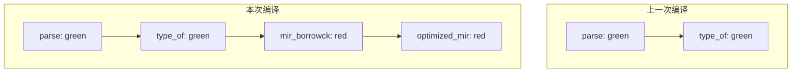
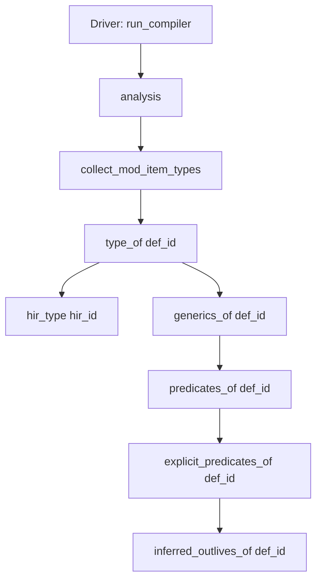

> **内容分级**: [综述级]
> **本节关键术语**: Query System · `TyCtxt` · Dep Graph · Red-Green Algorithm · Incremental Compilation · Salsa · `rustc_middle` — [完整对照表](../../00_meta/01_terminology/terminology_glossary.md)
>
# Rustc 查询系统与增量编译

> **EN**: The Rustc Query System and Incremental Compilation
> **Summary**: Explains how `rustc` uses a demand-driven query system (`TyCtxt`), dependency graphs, and the red-green algorithm to enable fine-grained incremental compilation.
> **受众**: [专家 / 研究者]
> **Bloom 层级**: L2-L4
> **权威来源**: 本文件为 `concept/` 权威页。
> **A/S/P 标记**: **F** — Formal / Infrastructure
> **双维定位**: F×Inf — 编译器基础设施与形式化方法
> **定位**: 将 `rustc` 从“顺序 pass 流水线”还原为“按需查询 + 缓存”的真实架构，理解增量编译的底层机制。
> **前置概念**: [Type System](../../01_foundation/02_type_system/04_type_system.md) · [Type Inference](../00_type_theory/08_type_inference.md) · [NLL and Polonius](../../03_advanced/02_unsafe/08_nll_and_polonius.md)
> **后置概念**: [Compiler Internals](../../06_ecosystem/00_toolchain/45_compiler_internals.md) · [Compiler Infrastructure](../../06_ecosystem/00_toolchain/47_compiler_infrastructure.md)
>
> **来源**: [Rust Reference](https://doc.rust-lang.org/reference/introduction.html) · [RustBelt](https://plv.mpi-sws.org/rustbelt/) · [Brown University — Interactive Rust Book](https://rust-book.cs.brown.edu/) · [TRPL](https://doc.rust-lang.org/book/title-page.html) · [Itanium C++ ABI](https://itanium-cxx-abi.github.io/cxx-abi/abi.html)
---

> **来源**: [Rustc Dev Guide — Queries](https://rustc-dev-guide.rust-lang.org/query.html) ·
> [Rustc Dev Guide — Incremental Compilation](https://rustc-dev-guide.rust-lang.org/queries/incremental-compilation.html) ·
> [Rustc Dev Guide — Overview](https://rustc-dev-guide.rust-lang.org/overview.html) ·
> [Salsa](https://salsa-rs.github.io/salsa/)

---
## 📑 目录

- [Rustc 查询系统与增量编译](#rustc-查询系统与增量编译)
  - [📑 目录](#-目录)
  - [一、为什么需要查询系统](#一为什么需要查询系统)
  - [二、查询系统的核心抽象](#二查询系统的核心抽象)
    - [2.1 `TyCtxt`](#21-tyctxt)
    - [2.2 查询的三种形态](#22-查询的三种形态)
  - [三、依赖图与 Red-Green 算法](#三依赖图与-red-green-算法)
    - [3.1 Dep Graph（依赖图）](#31-dep-graph依赖图)
    - [3.2 Red-Green 算法](#32-red-green-算法)
    - [3.3 哈希与序列化](#33-哈希与序列化)
  - [四、增量编译实战](#四增量编译实战)
    - [4.1 开启与观察](#41-开启与观察)
    - [4.2 典型输出解读](#42-典型输出解读)
      - [冷编译（无缓存）](#冷编译无缓存)
      - [无修改再次编译](#无修改再次编译)
      - [修改 `greet::hello` 后](#修改-greethello-后)
    - [4.3 增量编译不生效的常见原因](#43-增量编译不生效的常见原因)
    - [4.4 动手实验：修改-对比](#44-动手实验修改-对比)
    - [4.5 动手实验：实现最小查询系统](#45-动手实验实现最小查询系统)
    - [4.6 动手实验：调用 rustc 内部查询 type\_of 与 predicates\_of](#46-动手实验调用-rustc-内部查询-type_of-与-predicates_of)
      - [查询调用链示例](#查询调用链示例)
      - [伪代码：在 `rustc_driver` 回调中调用查询](#伪代码在-rustc_driver-回调中调用查询)
      - [对应 rustc 源码位置](#对应-rustc-源码位置)
  - [五、局限与边界](#五局限与边界)
  - [六、与 Salsa 的关系](#六与-salsa-的关系)
  - [嵌入式测验](#嵌入式测验)
    - [测验 1：`rustc` 的查询系统主要解决什么问题？](#测验-1rustc-的查询系统主要解决什么问题)
    - [测验 2：什么是 Red-Green 算法中的 "Green" 节点？](#测验-2什么是-red-green-算法中的-green-节点)
    - [测验 3：增量编译的粒度是“文件”还是“查询结果”？](#测验-3增量编译的粒度是文件还是查询结果)
    - [测验 4：为什么 borrow checker 目前会全量执行？](#测验-4为什么-borrow-checker-目前会全量执行)
  - [权威来源索引](#权威来源索引)

---

## 一、为什么需要查询系统

传统编译器通常按**顺序 pass** 组织：词法分析 → 语法分析 → 类型检查 → 优化 → 代码生成。每次修改源码后，整个流水线几乎要重新运行。

`rustc` 采用了不同的设计：它把编译过程拆分为大量**查询（query）**。每个查询回答一个具体的问题，例如：

- `type_of(def_id)`：某个定义的类型是什么？
- `mir_borrowck(def_id)`：某个函数的借用（Borrowing）检查结果是什么？
- `optimized_mir(def_id)`：某个函数优化后的 MIR 是什么？
- `collect_and_partition_mono_items(crate)`：整个 crate 需要为哪些单态化（Monomorphization）项生成代码？

> **关键洞察**: 查询系统是 `rustc` 实现**增量编译**的基础设施。通过记录查询之间的依赖关系，`rustc` 可以判断“上次编译后，哪些结果仍然有效”。
>
> [Rustc Dev Guide — Queries](https://rustc-dev-guide.rust-lang.org/query.html)

---

## 二、查询系统的核心抽象

### 2.1 `TyCtxt`

`TyCtxt<'tcx>` 是 `rustc` 中几乎所有编译器状态的**入口**。它持有：

- 当前 crate 的 HIR/MIR 数据；
- 类型上下文（`Ty<'tcx>`、生命周期（Lifetimes）、trait 约束）；
- 查询缓存；
- interning 池（保证相同类型/表达式只存一份内存）。

```text
TyCtxt<'tcx>
├── HIR Map
├── Type Interner
├── Query Engine
│   ├── On-Disk Cache (incremental)
│   └── In-Memory Cache
└── Dep Graph
```

> **定理**: 在 `rustc` 内部，几乎所有编译信息都可以通过 `tcx.query_name(key)` 获取。
> **证明**: `TyCtxt` 为每个查询生成了对应的方法，编译器代码通过 `tcx.typeck(def_id)`、`tcx.optimized_mir(def_id)` 等方式按需调用。

### 2.2 查询的三种形态

| 形态 | 说明 | 示例 |
|:---|:---|:---|
| **纯查询** | 只读、无副作用、结果可缓存 | `type_of`、`generics_of` |
| **修改器查询** | 会产生副作用（如写入文件、报错） | `mir_borrowck`（会 emit borrow-check 错误） |
| **非查询代码** | 不属于查询系统，通常跑在整个 crate 上 | codegen 后端调用、链接 |

> **注意**: 即使 `mir_borrowck` 会报错，它仍然是查询，因为错误本身也是结果的一部分。但某些查询为了保证所有函数的错误都被报告，会在 codegen 之前被强制预先执行。
>
> [Rustc Dev Guide — Queries](https://rustc-dev-guide.rust-lang.org/query.html)

---

## 三、依赖图与 Red-Green 算法

### 3.1 Dep Graph（依赖图）

每次查询执行时，`rustc` 会记录：

- 当前查询节点（`DepNode`）；
- 它读取了哪些其他查询节点（边）。

这些节点和边构成一张有向无环图，即 **Dep Graph**。它被序列化到 `target/<crate>/incremental/` 目录下。


### 3.2 Red-Green 算法

增量编译的核心算法：

1. **Green（绿色）**: 如果某个 `DepNode` 的输入（依赖）与上次完全相同，则它的输出也一定相同，可以直接复用上次结果。
2. **Red（红色）**: 如果输入发生变化，或者该节点本身依赖了红色节点，则需要重新计算。



> **关键洞察**: Red-Green 不是“按文件”增量，而是**按查询结果**增量。即使一个文件被修改，只要它不影响某个查询的输入，该查询的结果仍可复用。
>
> [Rustc Dev Guide — Incremental Compilation](https://rustc-dev-guide.rust-lang.org/queries/incremental-compilation.html)

### 3.3 哈希与序列化

- 每个查询结果必须能被**哈希**（Fingerprint）。
- 结果可以被序列化到磁盘（`rustc` 使用自定义二进制格式）。
- 下次编译时，`rustc` 先比较输入 fingerprint，再决定复用或重算。

---

## 四、增量编译实战

本节所有命令均可在项目内最小示例 [`examples/incremental_practice/`](../../../examples/incremental_practice) 上复现。该示例包含三个 intentionally 独立的模块（Module） `math`、`greet`、`analyze`，用来观察“修改一个函数时，dep-graph 中哪些节点会变 dirty”。

### 4.1 开启与观察

```bash
# 默认情况下 Cargo 会启用增量编译
CARGO_INCREMENTAL=1 cargo build

# 查看 rustc 内部增量统计（verbose，需要 nightly）
RUSTFLAGS="-Z incremental-info" cargo +nightly build
```

在 `examples/incremental_practice/` 目录下执行：

```bash
cd examples/incremental_practice

# 冷编译：建立 dep-graph 与磁盘缓存
CARGO_INCREMENTAL=1 RUSTFLAGS="-Z incremental-info" cargo +nightly build

# 无修改再次编译：应几乎没有 dirty 节点
CARGO_INCREMENTAL=1 RUSTFLAGS="-Z incremental-info" cargo +nightly build

# 修改 greet 模块后编译：仅影响依赖该模块的节点
# Linux/macOS
sed -i 's/Hello, {name}!/Hi, {name}!/' src/lib.rs
# Windows (PowerShell)
# (Get-Content src/lib.rs) -replace 'Hello, {name}!','Hi, {name}!' | Set-Content src/lib.rs
CARGO_INCREMENTAL=1 RUSTFLAGS="-Z incremental-info" cargo +nightly build
```

> **提示**: `-Z incremental-info` 在不同 nightly 版本中的输出格式会变化：旧版显示 `reusing X out of Y modules` 汇总行，新版（1.98+）改为 `DepGraph Statistics` 与 `session directory: N files hard-linked`。二者语义相同——都说明“多少中间产物被复用”。

### 4.2 典型输出解读

#### 冷编译（无缓存）

```text
   Compiling incremental_practice v0.1.0 (...)
incremental: DepGraph Statistics
  Total Node Count: 6939
  Total Edge Count: 25072
...
    Finished `dev` profile [unoptimized + debuginfo] target(s) in 1.23s
```

- 没有 `session directory` 复用行，说明这是首次建立缓存。
- `Total Node Count` / `Total Edge Count` 给出本次编译 dep-graph 的规模。

#### 无修改再次编译

```text
    Finished `dev` profile [unoptimized + debuginfo] target(s) in 0.00s
```

- 没有 `Compiling` 行，耗时骤降至毫秒级，说明 dep-graph 中所有节点都是 green，全部复用。

#### 修改 `greet::hello` 后

```text
   Compiling incremental_practice v0.1.0 (...)
incremental: session directory: 29 files hard-linked
incremental: DepGraph Statistics
  Total Node Count: 6969
  Total Edge Count: 25132
...
    Finished `dev` profile [unoptimized + debuginfo] target(s) in 0.42s
```

- `session directory: 29 files hard-linked` 表示大量中间产物从上次缓存硬链接复用；
- `Total Node Count` 微增（新增/修改的 HIR/MIR 节点），但整体编译时间远低于冷编译；
- 如果只修改 `greet` 而 `math` 不变，`math` 模块（Module）相关的查询节点仍保持 green。

旧版 nightly 可能输出类似：

```text
incremental: reusing 28 out of 30 modules
incremental: 1245 nodes in dep-graph; 23 marked dirty
incremental: process 23 dirty nodes
```

- **reusing modules**: 多少 codegen unit 未改变；
- **dirty nodes**: 需要重新计算的 `DepNode` 数量；
- 脏节点越少，增量编译越快。

### 4.3 增量编译不生效的常见原因

| 原因 | 说明 |
|:---|:---|
| 修改了 crate root 的 `#![feature]` | 影响整个 crate 的 feature gate 查询 |
| 修改了泛型（Generics）/宏（Macro） | 单态化（Monomorphization）集合可能大幅变化 |
| 修改了 `Cargo.toml` | resolver/workspace 变化导致全量重编 |
| 使用了 `RUSTFLAGS` 变化 | 编译配置变化会破坏缓存 |
| 缓存损坏 | 可执行 `cargo clean` 后重试 |

### 4.4 动手实验：修改-对比

在 `examples/incremental_practice/` 中完成下表实验，验证 Red-Green 算法的实际行为：

| 实验 | 修改位置 | 预期 dirty 范围 | 预期耗时 |
|:---|:---|:---|:---|
| A | 不修改 | 无 | ~0.00s |
| B | `math::add` 实现 | `math` 及 `analyze` | 短 |
| C | `greet::hello` 字符串 | `greet` 及 `analyze` | 短 |
| D | `analyze::report` 输出格式 | 仅 `analyze` | 最短 |

思考题：

1. 为什么修改 `math::add` 会影响 `analyze::report`，但修改 `greet::hello` 不会影响 `math::add`？
2. 如果给 `math::add` 添加 `#[inline(always)]`，dep-graph 会发生什么变化？
3. 什么情况下 `cargo build` 会“看起来”没有增量效果？（提示：检查 `CARGO_INCREMENTAL` 与 `RUSTFLAGS`）

---

### 4.5 动手实验：实现最小查询系统

下面用一个自包含的 Rust 程序模拟 `rustc` 查询系统的核心机制：

1. 每个查询有唯一 ID；
2. 查询执行前检查缓存；
3. 查询之间记录依赖；
4. 输入变化后，只使依赖该输入的查询失效。

```rust
use std::collections::{HashMap, HashSet};

/// 模拟查询系统的最小实现
struct QuerySystem {
    /// 输入表：模拟源码/HIR 等外部输入
    inputs: HashMap<&'static str, i64>,
    /// 缓存：查询名 -> 结果
    cache: HashMap<&'static str, i64>,
    /// 依赖图：查询名 -> 它依赖的查询/输入集合
    deps: HashMap<&'static str, HashSet<&'static str>>,
    /// 当前正在收集的依赖集合
    current_deps: Vec<&'static str>,
}

impl QuerySystem {
    fn new() -> Self {
        Self {
            inputs: HashMap::new(),
            cache: HashMap::new(),
            deps: HashMap::new(),
            current_deps: Vec::new(),
        }
    }

    fn set_input(&mut self, name: &'static str, value: i64) {
        self.inputs.insert(name, value);
        // 输入变化：使所有依赖该输入的缓存失效
        self.invalidate(name);
    }

    fn invalidate(&mut self, changed: &'static str) {
        let mut to_remove: Vec<&'static str> = Vec::new();
        for (query, deps) in &self.deps {
            if deps.contains(changed) {
                to_remove.push(query);
            }
        }
        for q in to_remove {
            self.cache.remove(q);
            // 递归向上失效：该查询结果变化会影响它的依赖方
            self.invalidate(q);
        }
    }

    fn query<F>(&mut self, name: &'static str, f: F) -> i64
    where
        F: FnOnce(&mut Self) -> i64,
    {
        if let Some(&value) = self.cache.get(name) {
            return value;
        }

        // 开始收集本次查询的依赖
        let dep_start = self.current_deps.len();
        let value = f(self);
        let deps: HashSet<_> = self.current_deps.drain(dep_start..).collect();
        self.deps.insert(name, deps);
        self.cache.insert(name, value);
        value
    }

    fn read_input(&mut self, name: &'static str) -> i64 {
        self.current_deps.push(name);
        *self.inputs.get(name).unwrap_or(&0)
    }
}

fn main() {
    let mut qs = QuerySystem::new();
    qs.set_input("a", 2);
    qs.set_input("b", 3);

    // 查询 `sum` 依赖 `a` 和 `b`
    let sum = qs.query("sum", |qs| qs.read_input("a") + qs.read_input("b"));
    println!("sum = {}", sum); // 5

    // 再次查询命中缓存，不重新执行
    let sum = qs.query("sum", |_qs| panic!("不应重新执行"));
    println!("cached sum = {}", sum); // 5

    // 修改输入 `a`：使 `sum` 缓存失效
    qs.set_input("a", 10);
    let sum = qs.query("sum", |qs| qs.read_input("a") + qs.read_input("b"));
    println!("new sum = {}", sum); // 13
}
```

**实验目标**：

1. 运行程序，观察缓存命中与失效的打印顺序。
2. 在 `sum` 查询上再叠加一个 `double` 查询，验证输入变化后 `double` 也会间接失效。
3. 思考：如果 `invalidate` 不做递归向上失效，会出现什么 bug？

> **与 rustc 的对应关系**：
>
> - `inputs` 表 ≈ HIR / 源码；
> - `query` 方法 ≈ `TyCtxt` 的查询入口；
> - `current_deps` ≈ 当前查询栈；
> - `deps` + `invalidate` ≈ `rustc` 的 Dep Graph + Red-Green 算法的最简版本。

---

### 4.6 动手实验：调用 rustc 内部查询 type_of 与 predicates_of

前面的实验从外部观察增量编译效果。如果想深入 `rustc` 内部，可以直接调用 `TyCtxt` 提供的查询接口。由于这些 API 属于 nightly 内部实现，下面给出**伪代码 + 源码参考**，帮助你在阅读或修改 `rustc` 时定位真实调用点。

#### 查询调用链示例

当 `rustc` 分析一个函数或类型项时，会按需触发如下查询链：



> **关键洞察**: `type_of` 与 `predicates_of` 不是普通函数，而是**查询**。它们会被缓存、追踪依赖，并参与 Red-Green 增量判定。

#### 伪代码：在 `rustc_driver` 回调中调用查询

```rust,ignore
// 伪代码：在 rustc 内部（nightly + #![feature(rustc_private)]）调用查询。
// 这段代码不能直接用 stable cargo 编译，仅供理解调用方式。
use rustc_middle::ty::{Ty, TyCtxt, GenericPredicates};
use rustc_span::def_id::DefId;

fn inspect_item(tcx: TyCtxt<'_>, def_id: DefId) {
    // 查询该项的类型（对函数是签名，对静态项是声明类型等）
    let ty: Ty<'_> = tcx.type_of(def_id).instantiate_identity();
    println!("type_of({:?}) = {:?}", def_id, ty);

    // 查询该项的 where-clause / 谓词集合
    let predicates: GenericPredicates<'_> = tcx.predicates_of(def_id);
    println!("predicates_of({:?}) = {:?}", def_id, predicates.predicates);
}
```

#### 对应 rustc 源码位置

| 查询 | 定义位置 | 实现位置 |
|:---|:---|:---|
| `type_of` | `compiler/rustc_middle/src/query/mod.rs` | `compiler/rustc_hir_analysis/src/collect/type_of.rs` |
| `predicates_of` | `compiler/rustc_middle/src/query/mod.rs` | `compiler/rustc_hir_analysis/src/collect/predicates_of.rs` |
| `generics_of` | `compiler/rustc_middle/src/query/mod.rs` | `compiler/rustc_hir_analysis/src/collect/generics_of.rs` |
| 驱动入口 | — | `compiler/rustc_interface/src/queries.rs` |

> **注意**: 查询签名在不同 nightly 版本中会有微调（例如 `instantiate_identity` 的引入），阅读时请以上游 master 为准。

**实验目标**：

1. 在本地克隆 `rust-lang/rust`，按 [Rustc Dev Guide — Building](https://rustc-dev-guide.rust-lang.org/overview.html) 编译 stage1 编译器。
2. 在 `compiler/rustc_hir_analysis/src/collect/type_of.rs` 的 `type_of` 实现中插入 `tracing` 日志，观察它何时被触发。
3. 对比 `tcx.type_of(def_id)` 与直接读取 HIR 类型节点的区别：前者会走查询缓存，后者不会。

---

## 五、局限与边界

1. **并非所有查询都磁盘缓存**：某些查询（如部分 lint）为了正确性每次都会执行。
2. **borrow checker 目前会全量跑**：`mir_borrowck` 查询在 codegen 前会被强制触发所有函数，以便报告所有错误。
3. **跨 crate 增量有限**：crate 边界是增量编译的天然边界；依赖 crate 改变通常会导致下游重编。
4. **缓存占用空间**：`target/` 下的增量缓存可能很大，CI 中常关闭增量编译以节省空间。

```rust,ignore
// 示例：在 CI 中关闭增量编译
std::env::set_var("CARGO_INCREMENTAL", "0");
```

---

## 六、与 Salsa 的关系

`rustc` 的查询系统与 [Salsa](https://salsa-rs.github.io/salsa/) 库共享相同的设计思想：

- 函数式、无副作用的查询；
- 依赖追踪；
- 增量重算。

Salsa 本身是从 `rustc` 查询系统中提取出来的通用框架，被 `rust-analyzer` 等工具使用。

| 维度 | `rustc` Query System | Salsa |
|:---|:---|:---|
| 用途 | 编译器内部 | 通用 IDE/分析工具 |
| 持久化 | 磁盘缓存 + 内存缓存 |  mainly 内存 |
| 稳定性 | nightly 内部 API | 稳定库 |

---

## 嵌入式测验

### 测验 1：`rustc` 的查询系统主要解决什么问题？

<details>
<summary>✅ 答案与解析</summary>

主要解决增量编译问题。通过把编译过程拆分为可缓存、可追踪依赖的查询，`rustc` 可以在源码修改后只重算受影响的部分，而不是重新跑整个编译流水线。

</details>

---

### 测验 2：什么是 Red-Green 算法中的 "Green" 节点？

<details>
<summary>✅ 答案与解析</summary>

"Green" 节点表示其输入与上次编译完全相同，因此输出可以直接复用，无需重新计算。

</details>

---

### 测验 3：增量编译的粒度是“文件”还是“查询结果”？

<details>
<summary>✅ 答案与解析</summary>

粒度是**查询结果**。即使一个文件被修改，只要不影响某个查询的输入，该查询仍可复用上次结果。

</details>

---

### 测验 4：为什么 borrow checker 目前会全量执行？

<details>
<summary>✅ 答案与解析</summary>

为了确保所有函数（包括不可达函数）的借用（Borrowing）检查错误都能被报告，`mir_borrowck` 查询在 codegen 前会被强制触发所有函数，而不是按需 lazy 执行。

</details>

---

## 权威来源索引

| 来源 | 可信度 | 说明 |
|:---|:---:|:---|
| [Rustc Dev Guide — Queries](https://rustc-dev-guide.rust-lang.org/query.html) | ✅ 一级 | 查询系统官方文档 |
| [Rustc Dev Guide — Incremental Compilation](https://rustc-dev-guide.rust-lang.org/queries/incremental-compilation.html) | ✅ 一级 | 增量编译官方文档 |
| [Rustc Dev Guide — Overview](https://rustc-dev-guide.rust-lang.org/overview.html) | ✅ 一级 | 编译流程总览 |
| [Salsa Book](https://salsa-rs.github.io/salsa/) | ✅ 一级 | 查询系统通用框架 |

---

> **权威来源**: [Rustc Dev Guide](https://rustc-dev-guide.rust-lang.org/) · [The Rust Reference](https://doc.rust-lang.org/reference/introduction.html) · [Rust Standard Library](https://doc.rust-lang.org/std/index.html)
> **权威来源对齐变更日志**: 2026-06-21 创建，对齐 Rust 1.97.0 编译器架构；2026-06-26 新增 `examples/incremental_practice/` 可运行增量编译实验 [P2 Deep Content Sprint](../../00_meta/02_sources/international_authority_index.md)；2026-07-09 新增 4.6 节 `type_of` / `predicates_of` 查询调用链实践 [P2-Q3 2026]
> [Authority Source Sprint Batch L4](../../00_meta/02_sources/international_authority_index.md)

**文档版本**: 1.3
**Rust 版本**: 1.97.0+ / nightly 1.99 (Edition 2024)
**最后更新**: 2026-07-09
**状态**: ✅ 权威来源对齐完成 (Batch L4)

---

## 国际权威参考 / International Authority References（P1 学术 · P2 生态）

> 依据 `AGENTS.md` §2「对齐网络国际化权威内容」补充：仅追加已验证可达的权威链接，不改动正文事实。

- **P2 生态/社区**: [AeneasVerif/aeneas](https://github.com/AeneasVerif/aeneas) · [model-checking/kani — 模型检查器](https://github.com/model-checking/kani)
