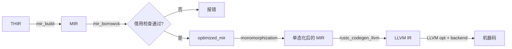

> **内容分级**: [综述级]
> **本节关键术语**: MIR · HIR · THIR · LLVM IR · Codegen · Monomorphization · `rustc_codegen_ssa` · `rustc_codegen_llvm` · Basic Block · Place · Rvalue — [完整对照表](../../00_meta/01_terminology/terminology_glossary.md)
>
# MIR、Codegen 与 LLVM IR 入门

> **EN**: MIR, Codegen, and LLVM IR Primer
> **Summary**: Introduces Rust's Mid-level IR (MIR), the MIR → codegen → LLVM IR pipeline, and how to inspect MIR and LLVM IR using rustc.
> **受众**: [专家 / 研究者]
> **Bloom 层级**: 理解 → 分析
> **A/S/P 标记**: **F** — Formal
> **双维定位**: F×Inf — 编译器中间表示与代码生成
> **定位**: 把 rustc 后端入口讲清楚：MIR 是什么、它如何被逐步 lower 为 LLVM IR、以及开发者如何利用 `rustc` 命令直接观察这些中间产物。
> **前置概念**: [Rustc Query System](19_rustc_query_system.md) · [Type System](../../01_foundation/02_type_system/04_type_system.md) · [Unsafe Rust](../../03_advanced/02_unsafe/03_unsafe.md)
> **后置概念**: [LLVM Backend and Code Generation](../../06_ecosystem/00_toolchain/67_llvm_backend_and_codegen.md) · [Compiler Infrastructure](../../06_ecosystem/00_toolchain/47_compiler_infrastructure.md)

---

> **来源**: [Rustc Dev Guide — The MIR](https://rustc-dev-guide.rust-lang.org/mir/index.html) ·
> [Rustc Dev Guide — MIR Optimizations](https://rustc-dev-guide.rust-lang.org/mir/optimizations.html) ·
> [Rustc Dev Guide — Lowering MIR](https://rustc-dev-guide.rust-lang.org/backend/lowering-mir.html) ·
> [Rustc Dev Guide — Code Generation](https://rustc-dev-guide.rust-lang.org/backend/codegen.html) ·
> [Rustc Dev Guide — Debugging LLVM](https://rustc-dev-guide.rust-lang.org/backend/debugging.html) ·
> [LLVM Documentation — LLVM IR](https://llvm.org/docs/LangRef.html)

---

## 认知路径

> **认知路径**: 本节从 "rustc 后端到底做了什么" 这一核心问题出发，依次建立 MIR 的直观理解、中间表示 lowering 的流程与工程观察方法之间的联系。

1. **问题识别**: 为什么 Rust 需要 MIR 这一层中间表示？它与 HIR、LLVM IR 有什么本质区别？
2. **概念建立**: 掌握 MIR 的核心定义、基本块（Basic Block）结构、Place/Rvalue/Terminator 三要素。
3. **机制推理**: 通过 ⟹ 定理链将 MIR 构建、借用（Borrowing）检查、优化、单态化（Monomorphization）与 LLVM IR 生成串联起来。
4. **边界辨析**: 借助反命题/反例理解 MIR/codegen 的适用边界与常见观察误区。
5. **迁移应用**: 将 MIR 与相邻概念链接，形成从 L1 到 L7 的纵向知识网络。

---

> **过渡**: 从 MIR、Codegen 与 LLVM IR 入门的直观描述转向其形式化定义，需要先把 "中间表示" 这个模糊直觉转化为可验证的术语与数据流图。

> **过渡**: 在建立 MIR → codegen → LLVM IR 的核心命题之后，下一步是审视这些命题在边界条件下的稳定性——这正是反命题与反例的价值所在。

> **过渡**: 最后，将 MIR、Codegen 与 LLVM IR 入门与相邻概念连接，形成从 L1 到 L7 的纵向认知路径，避免孤立记忆。

---

> **定理 1** [Tier 2]: MIR 显式表达控制流图与所有权（Ownership）转移 ⟹ 借用检查、drop 展开与常量求值可以在统一的图上进行。
>
> **定理 2** [Tier 2]: MIR 经过借用检查与优化后再 lower 到 codegen ⟹ 后端无需重新理解 Rust 的高层语法与所有权规则。
>
> **定理 3** [Tier 2]: `rustc --emit=mir` 与 `rustc --emit=llvm-ir` 输出的是同一编译过程的不同切片（Slice） ⟹ 开发者可以通过对比二者定位优化与代码生成问题。
>
> **定理 4** [Tier 3]: 单态化（Monomorphization）在 MIR 层完成泛型（Generics）实例化 ⟹ 每个泛型函数会生成独立的 MIR body，再独立 lower 到 LLVM IR。

---

## 反命题决策树

> **反命题 1**: "MIR 与 LLVM IR 只是同一表示的不同名字" ⟹ 不成立。MIR 仍保留 Rust 语义（如 `Drop`、`move`、`&mut`），而 LLVM IR 是接近机器的 SSA 形式。

> **反命题 2**: "所有 Rust 代码都能被 `rustc --emit=mir` 完整观察" ⟹ 不成立。宏（Macro）展开、名字解析与部分类型检查错误发生在 MIR 生成之前；`--emit=mir` 要求源码至少通过 HIR/THIR lowering。

> **反命题 3**: "LLVM IR 输出可以直接当作可移植的 Rust 后端代码使用" ⟹ 不成立。`rustc --emit=llvm-ir` 生成的 IR 依赖 rustc 生成的内部符号、target spec 与 runtime，跨版本通常不兼容。

## 📑 目录

- [MIR、Codegen 与 LLVM IR 入门](#mircodegen-与-llvm-ir-入门)
  - [认知路径](#认知路径)
  - [反命题决策树](#反命题决策树)
  - [📑 目录](#-目录)
  - [一、什么是 MIR](#一什么是-mir)
  - [二、MIR → Codegen → LLVM IR 流水线](#二mir--codegen--llvm-ir-流水线)
    - [2.1 关键查询节点](#21-关键查询节点)
  - [三、如何查看 MIR：`rustc --emit=mir`](#三如何查看-mirrustc---emitmir)
  - [四、如何查看 LLVM IR：`rustc --emit=llvm-ir`](#四如何查看-llvm-irrustc---emitllvm-ir)
  - [五、最小 annotated 示例](#五最小-annotated-示例)
    - [Rust 源码](#rust-源码)
    - [MIR 片段（简化）](#mir-片段简化)
    - [LLVM IR 片段（简化）](#llvm-ir-片段简化)
  - [六、逆向推理链（Backward Reasoning）](#六逆向推理链backward-reasoning)
  - [嵌入式测验](#嵌入式测验)
    - [测验 1：MIR 与 LLVM IR 的主要区别是什么？](#测验-1mir-与-llvm-ir-的主要区别是什么)
    - [测验 2：`--emit=mir` 输出的是优化前还是优化后的 MIR？](#测验-2--emitmir-输出的是优化前还是优化后的-mir)
    - [测验 3：单态化发生在流水线的哪一步？](#测验-3单态化发生在流水线的哪一步)
    - [测验 4：为什么 LLVM IR 不适合作为长期稳定的后端接口？](#测验-4为什么-llvm-ir-不适合作为长期稳定的后端接口)
  - [权威来源索引](#权威来源索引)

---

## 一、什么是 MIR

**MIR（Mid-level Intermediate Representation）** 是 `rustc` 在 HIR/THIR 之后、代码生成之前使用的中间表示。它的核心设计目标是：

1. **显式控制流**：每个函数体被表示为一个有向图，节点是基本块（Basic Block），边是 terminator（跳转、返回、unwind 等）。
2. **显式数据流**：每个基本块内部是一系列赋值语句，左值称为 **Place**，右值称为 **Rvalue**。
3. **显式所有权**：`move`、`copy`、`&mut`、`Drop` 等语义在 MIR 中都有明确标记，便于借用检查器与 drop 展开器操作。

```text
函数体（Function Body）
├── 局部变量表（Local declarations）
│   ├── _0: 返回值
│   ├── _1: 第一个参数
│   └── ...
└── 基本块集合（Basic Blocks）
    ├── bb0
    │   ├── Statement: _2 = move _1
    │   └── Terminator: goto bb1
    ├── bb1
    │   ├── Statement: _0 = _2
    │   └── Terminator: return
    └── ...
```

> **关键洞察**: HIR 还保留 Rust 源代码的语法结构；MIR 已经把语法结构扁平化为控制流图，但**仍然保留 Rust 语义**（如 `Copy` vs `move`、`Drop`、`Unwind`）。LLVM IR 则进一步把这些语义翻译成低层 SSA 与平台相关指令。
>
> [Rustc Dev Guide — The MIR](https://rustc-dev-guide.rust-lang.org/mir/index.html)(<https://rustc-dev-guide.rust-lang.org/mir/index.html>)

---

## 二、MIR → Codegen → LLVM IR 流水线

`rustc` 的后端流水线可以概括为：

```text
源代码
  → AST / HIR / THIR
  → MIR 构建（mir_build）
  → 借用检查（mir_borrowck）
  → MIR 优化（optimized_mir）
  → 单态化（Monomorphization）
  → Codegen（rustc_codegen_ssa / rustc_codegen_llvm）
  → LLVM IR
  → LLVM 优化与机器码生成
  → 目标文件 / 链接 → 可执行文件
```



### 2.1 关键查询节点

| 查询 | 作用 | 说明 |
|:---|:---|:---|
| `mir_built(def_id)` | 从 THIR 构建初始 MIR | 尚未经过借用检查 |
| `mir_borrowck(def_id)` | 执行借用检查 | 报错也作为查询结果的一部分 |
| `optimized_mir(def_id)` | 返回优化后的 MIR | 后端 lowering 的输入 |
| `collect_and_partition_mono_items(crate)` | 收集需要单态化的项 | 决定生成哪些 LLVM 函数 |

> **定理**: 每个泛型函数在 `optimized_mir` 阶段仍是泛型的；真正的单态化发生在 codegen 阶段，由 `Instance::mono` 等机制驱动。
>
> [Rustc Dev Guide — Monomorphization](https://rustc-dev-guide.rust-lang.org/backend/monomorph.html)(<https://rustc-dev-guide.rust-lang.org/backend/monomorph.html>)

---

## 三、如何查看 MIR：`rustc --emit=mir`

`rustc` 支持直接输出 MIR 文本：

```bash
# 基础用法：输出 .mir 文件到当前目录
rustc --emit=mir example.rs

# 通常需要开启优化等级以观察优化后的 MIR
rustc -O --emit=mir example.rs

# 使用 nightly 可输出更详细的 borrowck / drop elaboration 信息
rustc +nightly -Zmir-opt-level=3 --emit=mir example.rs
```

输出文件名为 `example.mir`，内容大致如下：

```text
fn example::add(_1: i32, _2: i32) -> i32 {
    debug x => _1;
    debug y => _2;
    let mut _0: i32;

    bb0: {
        _0 = Add(_1, _2);
        return;
    }
}
```

> **注意**: `--emit=mir` 默认输出的是**优化前** MIR；若要查看优化后 MIR，需要结合 `-O` 或 `-Zmir-opt-level=N`。
>
> [Rustc Dev Guide — Debugging MIR](https://rustc-dev-guide.rust-lang.org/mir/debugging.html)(<https://rustc-dev-guide.rust-lang.org/mir/debugging.html>)

---

## 四、如何查看 LLVM IR：`rustc --emit=llvm-ir`

类似地，`rustc` 可以输出 LLVM IR：

```bash
# 输出 .ll 文件
rustc --emit=llvm-ir example.rs

# 带优化等级
rustc -O --emit=llvm-ir example.rs

# 使用 cargo 输出当前包的 LLVM IR
cargo rustc -- --emit=llvm-ir
```

LLVM IR 是 SSA 形式，更接近机器指令。例如 `i32` 加法在 LLVM IR 中表现为：

```llvm
%sum = add i32 %x, %y
```

> **关键洞察**: MIR 中的 `Add` 算子在 LLVM IR 中可能对应 `add`、`fadd`、向量加法或调用内建函数，具体取决于类型与目标平台。Codegen 层负责把 Rust 类型映射到 LLVM 类型。
>
> [Rustc Dev Guide — Code Generation](https://rustc-dev-guide.rust-lang.org/backend/codegen.html)(<https://rustc-dev-guide.rust-lang.org/backend/codegen.html>)

---

## 五、最小 annotated 示例

下面给出一个完整的最小示例，展示同一段 Rust 代码在 MIR 与 LLVM IR 中的形态差异。

### Rust 源码

```rust
// example.rs
pub fn max(a: i32, b: i32) -> i32 {
    if a > b { a } else { b }
}

fn main() {
    let _ = max(3, 5);
}
```

### MIR 片段（简化）

```text
fn max(_1: i32, _2: i32) -> i32 {
    debug a => _1;
    debug b => _2;
    let mut _0: i32;
    let mut _3: bool;

    bb0: {
        _3 = Gt(_1, _2);
        switchInt(move _3) -> [false: bb2, otherwise: bb1];
    }

    bb1: {
        _0 = _1;
        goto -> bb3;
    }

    bb2: {
        _0 = _2;
        goto -> bb3;
    }

    bb3: {
        return;
    }
}
```

### LLVM IR 片段（简化）

```llvm
define i32 @example::max(i32 %a, i32 %b) {
start:
  %cmp = icmp sgt i32 %a, %b
  %retval = select i1 %cmp, i32 %a, i32 %b
  ret i32 %retval
}
```

> **对比说明**:
>
> - MIR 保留 `switchInt`、`Gt`、`return` 等高级控制流与比较语义；
> - LLVM IR 已降维为 `icmp` + `select`，更接近目标机器指令；
> - 在开启优化后，LLVM 后端可能将 `select` 进一步化为条件移动或分支指令。

---

## 六、逆向推理链（Backward Reasoning）

> **逆向 1**: 如果某段 Rust 代码的 MIR 看起来正确，但生成的 LLVM IR 行为异常 ⟸ 应优先检查 `rustc_codegen_llvm` 的类型 lowering 与目标平台相关规则，而不是回到 HIR 层重新分析语法。
>
> **逆向 2**: 如果 `--emit=mir` 输出的函数体没有预期的优化（如常量折叠、内联） ⟸ 应检查是否使用了 `-O` / `-C opt-level=3` 以及 `-Zmir-opt-level`，因为默认 `--emit=mir` 输出的是较早阶段的 MIR。
>
> **逆向 3**: 如果 LLVM IR 中某个泛型函数出现多次实例 ⟸ 这是单态化的正常结果；若要减少代码体积，应考虑使用 `dyn Trait`、枚举（Enum）或 `#[inline(never)]` 策略，而不是试图阻止单态化发生。

---

## 嵌入式测验

### 测验 1：MIR 与 LLVM IR 的主要区别是什么？

<details>
<summary>✅ 答案与解析</summary>

MIR 仍保留 Rust 高层语义（如 `move`、`Drop`、借用检查标记、基本块 terminator），是控制流图形式；LLVM IR 是接近机器的 SSA 形式，使用 `icmp`、`select`、`load`、`store` 等低层指令。

</details>

---

### 测验 2：`--emit=mir` 输出的是优化前还是优化后的 MIR？

<details>
<summary>✅ 答案与解析</summary>

默认输出的是较早阶段、未经优化的 MIR。要查看优化后 MIR，需要加 `-O` 或 `-Zmir-opt-level=N`。

</details>

---

### 测验 3：单态化发生在流水线的哪一步？

<details>
<summary>✅ 答案与解析</summary>

单态化发生在 MIR 优化之后、codegen 之前。`optimized_mir` 仍是泛型函数体；codegen 阶段根据实际使用的类型参数生成具体的 MIR 实例并 lower 到 LLVM IR。

</details>

---

### 测验 4：为什么 LLVM IR 不适合作为长期稳定的后端接口？

<details>
<summary>✅ 答案与解析</summary>

因为 `rustc` 生成的 LLVM IR 包含大量内部符号、target-specific 属性与 rustc 版本相关的 name mangling；不同 Rust 版本的输出不保证兼容。需要稳定接口应使用 Stable MIR 或 C ABI。

</details>

---

## 权威来源索引

| 来源 | 可信度 | 说明 |
|:---|:---:|:---|
| [Rustc Dev Guide — The MIR](https://rustc-dev-guide.rust-lang.org/mir/index.html) | ✅ 一级 | MIR 官方文档 |
| [Rustc Dev Guide — MIR Optimizations](https://rustc-dev-guide.rust-lang.org/mir/optimizations.html) | ✅ 一级 | MIR 优化官方文档 |
| [Rustc Dev Guide — Lowering MIR](https://rustc-dev-guide.rust-lang.org/backend/lowering-mir.html) | ✅ 一级 | MIR  lowering 到 codegen 官方文档 |
| [Rustc Dev Guide — Code Generation](https://rustc-dev-guide.rust-lang.org/backend/codegen.html) | ✅ 一级 | Codegen 官方文档 |
| [LLVM Documentation — LLVM IR](https://llvm.org/docs/LangRef.html) | ✅ 一级 | LLVM IR 语言参考 |

---

> **权威来源**: [Rustc Dev Guide](https://rustc-dev-guide.rust-lang.org/) · [The Rust Reference](https://doc.rust-lang.org/reference/introduction.html) · [LLVM Documentation](https://llvm.org/docs/)
> **权威来源对齐变更日志**: 2026-07-09 创建，对齐 Rust 1.96.1+ MIR/codegen 文档

**文档版本**: 1.0
**对应 Rust 版本**: 1.96.1+ (Edition 2024)
**最后更新**: 2026-07-09
**状态**: ✅ 已对齐 Rust 1.96.1+ MIR/codegen 文档
