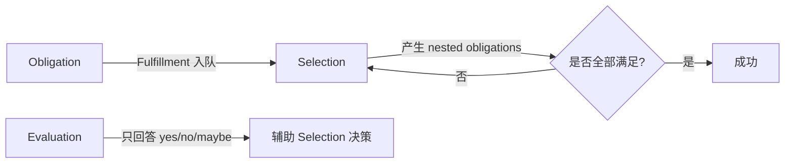

> **内容分级**: [综述级]
> **本节关键术语**: Trait Solver · Selection · Fulfillment · Evaluation · Obligation · Candidate · Winnowing · Coinduction · Next-Gen Solver — [完整对照表](../../00_meta/01_terminology/terminology_glossary.md)
>
# rustc 中的 Trait Solver

> **EN**: The Trait Solver in rustc
> **Summary**: Explains how rustc resolves trait obligations through selection, fulfillment, and evaluation; covers the current solver, the next-generation solver, and coinduction.
> **受众**: [专家 / 研究者]
> **Bloom 层级**: L2-L4
> **权威来源**: 本文件为 `concept/` 权威页。
> **A/S/P 标记**: **F** — Formal
> **双维定位**: F×Type — 类型系统（Type System）与形式化方法
> **定位**: 把“这个类型是否实现了某 trait”这一核心问题，还原为候选装配、筛选、确认与约束求解的完整算法。
> **前置概念**: [Type System](../../01_foundation/02_type_system/04_type_system.md) · [Traits](../../02_intermediate/00_traits/01_traits.md) · [Type Inference](../00_type_theory/08_type_inference.md) · [Name Resolution and HIR](35_name_resolution_and_hir.md) · [Unsafe Rust](../../03_advanced/02_unsafe/03_unsafe.md)
> **后置概念**: [Rustc Query System](19_rustc_query_system.md) · [Ownership Formal](../01_ownership_logic/03_ownership_formal.md)

---

> **来源**: [Rustc Dev Guide — Trait Solving](https://rustc-dev-guide.rust-lang.org/traits/resolution.html) · · [Pierce — Types and Programming Languages](https://www.cis.upenn.edu/~bcpierce/tapl/) · [Hindley — The Principal Type-Scheme of an Object in Combinatory Logic](https://doi.org/10.2307/2270762) · [Jung et al. — RustBelt: Securing the Foundations of Rust](https://plv.mpi-sws.org/rustbelt/popl18/) · [TRPL](https://doc.rust-lang.org/book/title-page.html) · [Itanium C++ ABI](https://itanium-cxx-abi.github.io/cxx-abi/abi.html)
> [Rustc Dev Guide — Next-gen trait solving](https://rustc-dev-guide.rust-lang.org/solve/the-solver.html) ·
> [Rustc Dev Guide — Trait Specialization](https://rustc-dev-guide.rust-lang.org/traits/specialization.html) ·
> [Rust Reference — Traits](https://doc.rust-lang.org/reference/items/traits.html)

---
## 📑 目录

- [rustc 中的 Trait Solver](#rustc-中的-trait-solver)
  - [📑 目录](#-目录)
  - [一、问题定义：Obligation](#一问题定义obligation)
  - [二、三大核心操作](#二三大核心操作)
  - [三、Selection：候选装配与筛选](#三selection候选装配与筛选)
    - [3.1 Candidate Assembly（候选装配）](#31-candidate-assembly候选装配)
    - [3.2 Winnowing（筛选）](#32-winnowing筛选)
    - [3.3 Confirmation（确认）](#33-confirmation确认)
  - [四、Fulfillment：约束求解工作队列](#四fulfillment约束求解工作队列)
  - [五、Evaluation：不约束推断变量的判断](#五evaluation不约束推断变量的判断)
  - [六、旧 Solver 与新 Solver（Next-Gen）的对比](#六旧-solver-与新-solvernext-gen的对比)
    - [6.1 架构差异](#61-架构差异)
    - [6.2 行为差异示例：关联类型与高阶生命周期](#62-行为差异示例关联类型与高阶生命周期)
    - [6.3 嵌套目标与 Fixpoint：推断变量的传播](#63-嵌套目标与-fixpoint推断变量的传播)
    - [6.4 可复现的对比实验：高阶生命周期与关联类型归一化](#64-可复现的对比实验高阶生命周期与关联类型归一化)
  - [七、Coinduction 与递归 Trait](#七coinduction-与递归-trait)
  - [八、逆向推理链（Backward Reasoning）](#八逆向推理链backward-reasoning)
  - [嵌入式测验](#嵌入式测验)
    - [测验 1：什么是 obligation？](#测验-1什么是-obligation)
    - [测验 2：Selection 和 Evaluation 的主要区别是什么？](#测验-2selection-和-evaluation-的主要区别是什么)
    - [测验 3：Winnowing 解决什么问题？](#测验-3winnowing-解决什么问题)
    - [测验 4：新一代 trait solver 与旧 solver 相比，主要优势是什么？](#测验-4新一代-trait-solver-与旧-solver-相比主要优势是什么)
  - [权威来源索引](#权威来源索引)

---

## 一、问题定义：Obligation

Trait 求解的核心问题是：给定一个 **trait reference**（如 `i32: Clone`），判断它是否成立。`rustc` 把这样的待证目标称为 **obligation**（义务/约束）。

```rust,ignore
fn clone_slice<T: Clone>(x: &[T]) -> Vec<T> { ... }

let v = clone_slice(&[1, 2, 3]);
// 这里需要证明 obligation: i32 : Clone
```

在泛型（Generics）函数体内部，`T: Clone` 也是一个 obligation，但它不能被具体实现，而是由调用者保证。

> **关键洞察**: Trait 求解 = 为每个 obligation 找到一个“证据”：一个 impl、一个 where-clause、或一个内建规则。
>
> [Rustc Dev Guide — Trait resolution (old-style)](https://rustc-dev-guide.rust-lang.org/traits/resolution.html)

---

## 二、三大核心操作

| 操作 | 作用 | 是否约束推断变量 |
|:---|:---|:---:|
| **Selection** | 决定如何满足一个 obligation（选哪个 impl / where-clause） | 是 |
| **Fulfillment** | 维护待处理 obligation 的工作队列，驱动 selection 直到全部满足 | 是 |
| **Evaluation** | 判断 obligation 是否成立，不修改推断变量 | 否 |



---

## 三、Selection：候选装配与筛选

### 3.1 Candidate Assembly（候选装配）

对于一个 obligation `T: Trait`，编译器收集所有可能适用的候选：

- `impl` 块；
- where-clause（如 `T: Trait` 参数约束）；
- 内建规则（如 `Sized`、`Copy`、`Unsize`）。

### 3.2 Winnowing（筛选）

如果多个候选都可能在语法上匹配，需要进一步筛选：

```rust,ignore
trait Get { fn get(&self) -> Self; }

impl<T: Copy> Get for T { ... }
impl<T: Get> Get for Box<T> { ... }

let x = Box::new(1_u16).get();
```

- 第一个候选要求 `Box<u16>: Copy` → 不成立；
- 第二个候选要求 `u16: Get` → 递归成立；
- 筛选后唯一剩下第二个候选。

### 3.3 Confirmation（确认）

确认阶段把 impl 的输出类型参数与 obligation 统一。如果统一失败（如下面例子），则报错：

```rust,ignore
trait Convert<Target> { fn convert(&self) -> Target; }
impl Convert<usize> for isize { ... }

let y: char = x.convert(); // ❌ confirmation 失败：impl 要求 Target=usize，但这里期望 char
```

---

## 四、Fulfillment：约束求解工作队列

Fulfillment 是一个工作队列算法：

1. 把初始 obligation 放入队列；
2. 取出队首 obligation，调用 selection；
3. 如果 selection 成功，把产生的 nested obligations 加入队列；
4. 重复直到队列为空；
5. 若过程中出现无法解决的 obligation，则报错。

```rust,ignore
fn foo<T: Clone + Debug>(x: T) {
    let _ = x.clone(); // obligation: T: Clone
    println!("{:?}", x); // obligation: T: Debug
}
```

这两个 obligation 都由调用者通过 where-clause 提供。

> **定理**: Fulfillment 结束时，所有类型检查阶段的 trait obligation 都必须被证明可解。
>
> [Rustc Dev Guide — Trait resolution — Overview](https://rustc-dev-guide.rust-lang.org/traits/resolution.html)

---

## 五、Evaluation：不约束推断变量的判断

Evaluation 只回答“这个 obligation 是否可能成立”，不会修改推断变量。它用于：

- Winnowing 阶段判断某个候选是否可被排除；
- 避免 selection 过早锁定推断变量。

返回值通常是：

- `Yes`：一定成立；
- `No`：一定不成立；
- `Maybe`：包含未推断变量，暂时无法确定。

---

## 六、旧 Solver 与新 Solver（Next-Gen）的对比

旧 solver 通常被称为 **legacy** 或 **基于 flate 实现** 的 solver，其历史可以追溯到 `rustc` 早期把 `selection`、`fulfillment`、`evaluation` 作为三个独立阶段实现的时期。新 solver（next-gen，内部也称 "new trait solver"）从 Chalk 与 rust-analyzer 的实践中演化而来，目标是用统一的 canonical query + proof tree 重新表述 trait 求解，并减少 corner case。

> **定理 4** [Tier 2]: 旧 solver 将 evaluation 与 fulfillment 分离 ⟹ 候选选择阶段无法直接缓存推断约束，导致同一份约束可能被重复求值。
>
> **定理 5** [Tier 2]: 新 solver 引入 canonicalization 与 `AliasRelate` 目标 ⟹ 可以延迟处理含绑定变量的关联类型等价，提升对高阶边界的支持。
>
> **定理 6** [Tier 3]: 新 solver 与 rust-analyzer 共享核心逻辑 ⟹ 编辑器中的类型推断（Type Inference）与编译器趋于一致，降低 IDE 与 rustc 行为漂移的风险。

### 6.1 架构差异

| 维度 | 旧 Solver（Legacy / Flate-Based） | 新 Solver（Next-Gen） |
|:---|:---|:---|
| 核心机制 | `selection` / `fulfillment` / `evaluation` 三阶段分离 | 统一的 canonical query + proof tree |
| Canonicalization | trait 系统内部不做 canonicalization；候选选择需先丢弃约束，选中后再重新求值 | 每个候选 eager canonicalization；可合并候选响应并缓存推断约束 |
| Evaluation vs Fulfillment | evaluation 缓存但不应用推断约束；fulfillment 应用约束但不缓存 | 二者合并：通过 canonical response 同时携带约束与结果 |
| 递归 / Coinduction | 对循环目标需要特殊处理，容易 overflow 或误判 | 原生支持 coinduction，递归 trait 更自然 |
| Alias 类型处理 | 结构性地展开 alias；遇到绑定变量时无法正确归一化 | 发出 `AliasRelate` 目标，延迟等价判断直到可归一化 |
| 嵌套目标 | evaluation 立即处理；fulfillment 返回给调用者后续处理 | 统一 eagerly 处理，并迭代到 fixpoint |
| 缓存 | 仅 evaluation 可缓存 | 更积极的缓存策略，约束也可复用 |
| 共享 | 难与 rust-analyzer 共享 | 核心逻辑已与 rust-analyzer 共享 |
| 状态 | 当前默认 | nightly 可选，逐步稳定中 |

> **关键洞察**: 新 solver 不是简单优化，而是把 "候选选择" 与 "约束应用" 从两个独立系统合并为一个基于 canonical query 的系统，从而消除旧实现中 evaluation 与 fulfillment 行为不一致导致的 corner case。
>
> [Rustc Dev Guide — Significant changes and quirks](https://rustc-dev-guide.rust-lang.org/solve/significant-changes.html)

### 6.2 行为差异示例：关联类型与高阶生命周期

下面的代码展示了旧 solver 与新 solver 在**延迟 alias 等价**上的差异。该模式使用高阶生命周期（higher-ranked lifetime）与关联类型，旧 solver 会因为过早将 alias 结构展开而得到错误推断；新 solver 则生成 `AliasRelate` 目标，将判断延迟到参数环境足以归一化关联类型。

```rust,ignore
pub trait WithAssoc<'a> {
    type Output;
}

pub trait UseIt<T> {}

// 证明该 impl 时，需要推断 `for<'a> <T as WithAssoc<'a>>::Output` 的具体类型。
// 旧 solver：在 `Output` 含绑定变量时，结构展开会失败或产生不一致推断（#102048）。
// 新 solver：生成 AliasRelate 目标，延迟到可归一化时再求解。
impl<T> UseIt<for<'a> fn(<T as WithAssoc<'a>>::Output)> for T
where
    T: for<'a> WithAssoc<'a>,
{}
```

> **注意**: 该模式仅在 nightly 新 solver 下行为有显著差异；稳定版默认仍为旧 solver。historically 可通过 `-Ztrait-solver=next` 尝试；当前 nightly 已改为 `-Znext-solver=globally`（coherence 模式为 `-Znext-solver=coherence`）。
>
> [Rustc Dev Guide — Deferred alias equality](https://rustc-dev-guide.rust-lang.org/solve/significant-changes.html#deferred-alias-equality)

### 6.3 嵌套目标与 Fixpoint：推断变量的传播

新 solver 的另一项改进是**统一 eagerly 处理嵌套目标**并迭代到 fixpoint。旧 solver 在 evaluation 与 fulfillment 中对嵌套目标的处理不一致：evaluation 会立即处理嵌套目标，而 fulfillment 只是把它们返回给调用者后续处理。新 solver 则会在同一个 evaluation 循环中不断更新推断变量，直到所有约束同时满足。

```rust,ignore
//  nightly 新 solver
#![feature(trait_solver_next)]

use std::fmt::Debug;

trait ConstrainToU8<X> {}
impl ConstrainToU8<u8> for () {}

// 需要同时满足 X: Debug 与 (): ConstrainToU8<X>。
// 旧 solver 某些复杂上下文中，可能因嵌套目标顺序而需要显式标注 X=u8；
// 新 solver 通过 fixpoint 迭代，可从 (): ConstrainToU8<X> 反推 X=u8，
// 再验证 u8: Debug。
fn demo<X>() where X: Debug, (): ConstrainToU8<X> {}

fn main() {
    demo::<_>();
}
```

> **关键洞察**: Fixpoint 迭代削弱了嵌套目标的求值顺序对结果的影响，使得多个相互依赖的约束可以被同时满足，而不是被处理顺序偶然决定。
>
> [Rustc Dev Guide — Nested goals are evaluated until reaching a fixpoint](https://rustc-dev-guide.rust-lang.org/solve/significant-changes.html#nested-goals-are-evaluated-until-reaching-a-fixpoint)

> **状态（截至 Rust 1.99 nightly）**: 新 solver 仍在迭代，尚未成为默认。historical flag 为 `-Ztrait-solver=next`；当前 nightly 使用 `-Znext-solver=globally`。
>
> [Rustc Dev Guide — Next-gen trait solving](https://rustc-dev-guide.rust-lang.org/solve/trait-solving.html)

---

### 6.4 可复现的对比实验：高阶生命周期与关联类型归一化

下面给出一个可在 nightly 直接复现的最小示例。它在**旧 solver 下编译失败**，在**新 solver 下编译通过**，差异来源于新 solver 对“绑定变量内部的关联类型投影”采用延迟归一化（`AliasRelate`）。

```rust,ignore
pub trait WithAssoc<'a> {
    type Output;
}

pub trait UseIt<T> {}

impl<T> UseIt<for<'a> fn(<T as WithAssoc<'a>>::Output)> for T
where
    T: for<'a> WithAssoc<'a>,
{}

struct Foo;
impl<'a> WithAssoc<'a> for Foo {
    type Output = &'a ();
}

fn need<T>(t: T)
where
    T: for<'a> WithAssoc<'a>,
    T: UseIt<for<'a> fn(<T as WithAssoc<'a>>::Output)>,
{}

fn main() {
    need(Foo);
}
```

在 nightly 上分别执行：

```bash
# 旧 solver（默认）
rustc +nightly --edition 2024 -Znext-solver=no trait_solver_cmp.rs

# 新 solver（全局启用）
rustc +nightly --edition 2024 -Znext-solver=globally trait_solver_cmp.rs
```

> **历史 flag 名称**: 在 1.96/1.97 nightly 中该 flag 为 `-Ztrait-solver=next`；当前 nightly 已改为 `-Znext-solver=globally`，coherence 模式为 `-Znext-solver=coherence`。

**预期结果**：

| Solver | 结果 |
|:---|:---|
| 旧 solver | error[E0277]: the trait bound `Foo: UseIt<for<'a> fn(&'a ())>` is not satisfied |
| 新 solver | 编译通过（仅可能有 unused variable 警告） |

旧 solver 会过早尝试在 `for<'a>` binder 内部把 `<T as WithAssoc<'a>>::Output` 结构展开，无法识别它归一化为 `&'a ()`；新 solver 生成 `AliasRelate` 目标，将等价判断延迟到参数环境足以归一化关联类型时再求解。

---

## 七、Coinduction 与递归 Trait

Coinduction（余归纳）允许 solver 在证明循环目标时假设目标已经成立，只要最终能构造出一致解。这对递归 trait 非常有用：

```rust,ignore
// 递归 trait：一个列表的所有元素都满足 P
trait All<P> {
    fn check(&self);
}

impl<P> All<P> for () {}
impl<P, H, T> All<P> for (H, T)
where
    H: P,
    T: All<P>,
{}
```

新 solver 使用 coinduction 来处理这类递归约束，避免无限展开。

> [Rustc Dev Guide — Coinduction](https://rustc-dev-guide.rust-lang.org/solve/coinduction.html)

---

## 八、逆向推理链（Backward Reasoning）

> **逆向 1**: 如果某段代码在 `-Znext-solver=globally`（historical flag: `-Ztrait-solver=next`）下编译通过，而在默认 solver 下失败 ⟸ 很可能是因为新 solver 的 canonicalization、延迟 alias 等价或 fixpoint 求值改变了该模式的可满足性，需要检查是否涉及高阶边界、关联类型或递归 trait。
>
> **逆向 2**: 如果 rust-analyzer 与 `rustc` 对同一个 trait bound 给出不同推断 ⟸ 需要检查是否触及新/旧 solver 的差异区域（如别名类型 inside binders、嵌套目标顺序），因为 rust-analyzer 已逐步复用新 solver 核心逻辑。
>
> **逆向 3**: 如果 trait 求解出现无法解释的 overflow 或 ambiguity ⟸ 可尝试用 `-Znext-solver=globally`（historical flag: `-Ztrait-solver=next`）复现，并对比 proof tree 输出（`-Znext-solver=globally` + `-Zprint-implicit-call-graph` 等 nightly 调试选项）来定位是候选合并问题还是循环目标处理问题。

---

## 嵌入式测验

### 测验 1：什么是 obligation？

<details>
<summary>✅ 答案与解析</summary>

Obligation 是需要被证明的 trait reference，例如 `i32: Clone` 或 `T: Debug`。Trait solver 的任务就是为每个 obligation 找到证据（impl、where-clause 或内建规则）。

</details>

---

### 测验 2：Selection 和 Evaluation 的主要区别是什么？

<details>
<summary>✅ 答案与解析</summary>

- Selection 会选择具体候选并可能约束推断变量；
- Evaluation 只回答 obligation 是否成立，不修改推断变量，常用于筛选候选。

</details>

---

### 测验 3：Winnowing 解决什么问题？

<details>
<summary>✅ 答案与解析</summary>

当多个 impl/候选在语法上都能匹配时，winnowing 利用 where-clause 等条件排除不可能成立的候选，直到只剩一个或为零/多个并报错。

</details>

---

### 测验 4：新一代 trait solver 与旧 solver 相比，主要优势是什么？

<details>
<summary>✅ 答案与解析</summary>

统一了 selection/fulfillment/evaluation，使用 proof tree 和更积极的缓存，天然支持 coinduction，并且核心逻辑已与 rust-analyzer 共享。

</details>

---

## 权威来源索引

| 来源 | 可信度 | 说明 |
|:---|:---:|:---|
| [Rustc Dev Guide — Trait resolution](https://rustc-dev-guide.rust-lang.org/traits/resolution.html) | ✅ 一级 | 旧 solver 官方文档 |
| [Rustc Dev Guide — Next-gen trait solving](https://rustc-dev-guide.rust-lang.org/solve/the-solver.html) | ✅ 一级 | 新 solver 官方文档 |
| [Rustc Dev Guide — Coinduction](https://rustc-dev-guide.rust-lang.org/solve/coinduction.html) | ✅ 一级 | Coinduction 官方文档 |
| [Rust Reference — Traits](https://doc.rust-lang.org/reference/items/traits.html) | ✅ 一级 | 语言层面 trait 规则 |

---

> **权威来源**: [Rustc Dev Guide](https://rustc-dev-guide.rust-lang.org/) · [The Rust Reference](https://doc.rust-lang.org/reference/introduction.html) · [Rust Standard Library](https://doc.rust-lang.org/std/index.html) · [Pierce — Types and Programming Languages](https://www.cis.upenn.edu/~bcpierce/tapl/)
> **权威来源对齐变更日志**: 2026-06-21 创建，对齐 Rust 1.97.0 trait solver 文档；2026-07-09 新增 6.4 节旧/新 solver 可复现对比实验并更新 nightly flag 名称 [P2-Q3 2026]
> [Authority Source Sprint Batch L4](../../00_meta/02_sources/international_authority_index.md)

**文档版本**: 1.1
**Rust 版本**: 1.97.0+ / nightly 1.99 (Edition 2024)
**最后更新**: 2026-07-09
**状态**: ✅ 权威来源对齐完成 (Batch L4)

---

## 国际权威参考 / International Authority References（P1 学术 · P2 生态）

> 依据 `AGENTS.md` §2「对齐网络国际化权威内容」补充：仅追加已验证可达的权威链接，不改动正文事实。

- **P2 生态/社区**: [formal-land/coq-of-rust](https://github.com/formal-land/coq-of-rust) · [AeneasVerif/aeneas](https://github.com/AeneasVerif/aeneas)
