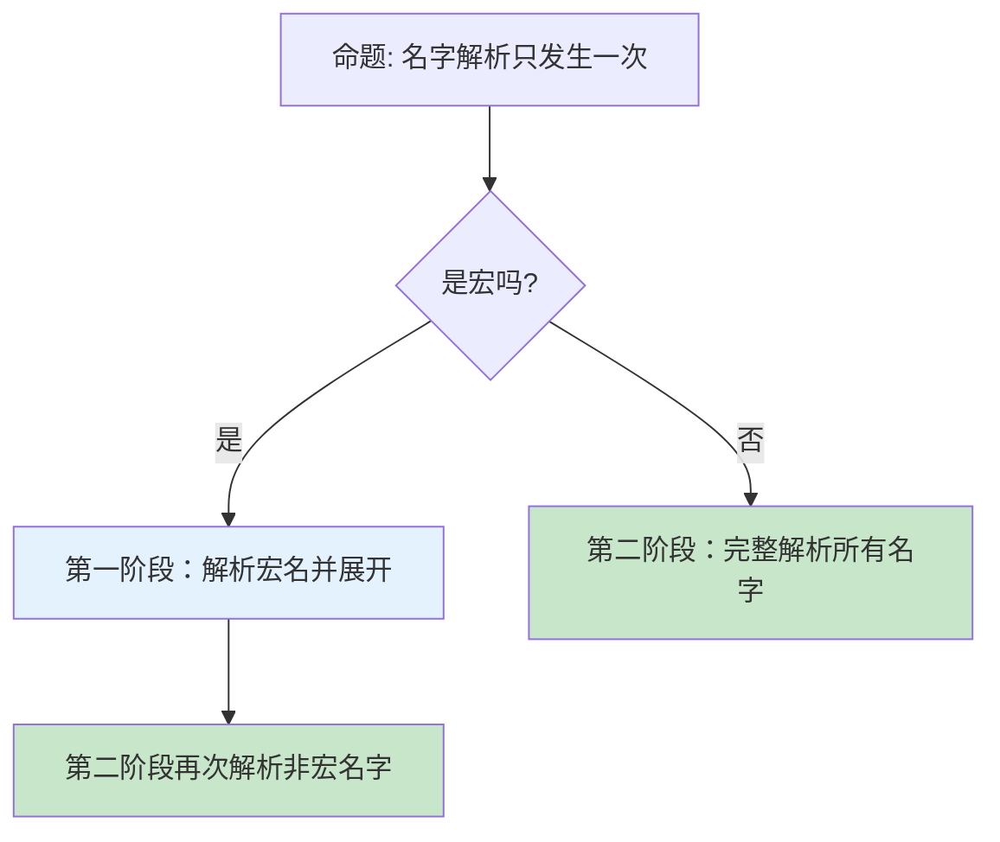

> **内容分级**: [综述级]
> **本节关键术语**: Name Resolution · AST · HIR · THIR · Namespace · Rib · `DefId` · `HirId` · `rustc_resolve` — [完整对照表](../../00_meta/01_terminology/terminology_glossary.md)
>
# Rustc 名称解析与 HIR

> **EN**: Name Resolution and HIR in rustc
> **Summary**: Explains rustc's two-phase name resolution, namespaces and ribs, AST-to-HIR lowering, and the key identifiers (`DefId`, `HirId`, `BodyId`) used in the HIR.
> **受众**: [专家 / 研究者]
> **Bloom 层级**: 理解 → 分析
> **A/S/P 标记**: **F** — Formal
> **双维定位**: F×Inf — 编译器前端基础设施
> **定位**: 把“名字怎么找到定义”和“源码如何变成编译器友好的 HIR”这两个前端核心步骤讲清楚，为理解类型检查、借用（Borrowing）检查打下基础。
> **前置概念**: [Type System](../../01_foundation/02_type_system/04_type_system.md) · [Macros](../../03_advanced/03_proc_macros/04_macros.md)
> **后置概念**: [Rustc Query System](19_rustc_query_system.md) · [Type Inference](../00_type_theory/08_type_inference.md) · [Trait Solver in rustc](26_trait_solver_in_rustc.md)

---

> **来源**: [Rustc Dev Guide — Name Resolution](https://rustc-dev-guide.rust-lang.org/name-resolution.html) · · [Aho, Sethi & Ullman — Compilers: Principles, Techniques, and Tools](https://en.wikipedia.org/wiki/Compilers:_Principles,_Techniques,_and_Tools) · [Pierce — Types and Programming Languages](https://www.cis.upenn.edu/~bcpierce/tapl/) · [Jung et al. — RustBelt: Securing the Foundations of Rust](https://plv.mpi-sws.org/rustbelt/popl18/) · [TRPL](https://doc.rust-lang.org/book/title-page.html) · [Itanium C++ ABI](https://itanium-cxx-abi.github.io/cxx-abi/abi.html)
> [Rustc Dev Guide — The HIR](https://rustc-dev-guide.rust-lang.org/hir.html) ·
> [Rustc Dev Guide — Lowering AST to HIR](https://rustc-dev-guide.rust-lang.org/hir/lowering.html) ·
> [Rust Reference — Names](https://doc.rust-lang.org/reference/names.html)

---

## 认知路径

> **认知路径**: 本节从 "Rustc 名称解析与 HIR" 的核心问题出发，依次建立直观理解、形式化模型与工程实践之间的联系。

1. **问题识别**: 为什么 Rustc 名称解析与 HIR 在 Rust 中值得关注？它与日常编程中的哪些痛点相关？
2. **概念建立**: 掌握 Rustc 名称解析与 HIR 的核心定义、关键术语与类型系统（Type System）/运行时（Runtime）边界。
3. **机制推理**: 通过 ⟹ 定理链将语法规则、编译期检查与运行时（Runtime）语义串联起来。
4. **边界辨析**: 借助反命题/反例理解常见错误与Rustc 名称解析与 HIR的适用边界。
5. **迁移应用**: 将 Rustc 名称解析与 HIR 与前置/后置概念链接，形成跨层知识网络。

---

> **过渡**: 从 Rustc 名称解析与 HIR 的直观描述转向其形式化定义，需要先把日常经验中的模糊直觉转化为可验证的术语。

> **过渡**: 在建立 Rustc 名称解析与 HIR 的核心命题之后，下一步是审视这些命题在边界条件下的稳定性——这正是反命题与反例的价值所在。

> **过渡**: 最后，将 Rustc 名称解析与 HIR 与相邻概念连接，形成从 L1 到 L7 的纵向认知路径，避免孤立记忆。

---

> **定理 1** [Tier 2]: Rustc 名称解析与 HIR 的核心约束 ⟹ 编译器可以在编译期排除一整类运行时（Runtime）错误。
>
> **定理 2** [Tier 2]: 正确理解 Rustc 名称解析与 HIR 的语义 ⟹ 开发者能够写出既安全又零成本抽象（Zero-Cost Abstraction）的代码。
>
> **定理 3** [Tier 3]: 将 Rustc 名称解析与 HIR 与 Rust 的所有权（Ownership）/生命周期（Lifetimes）模型结合 ⟹ 可以在更大系统中进行可扩展的推理。

## 📑 目录

- [Rustc 名称解析与 HIR](#rustc-名称解析与-hir)
  - [认知路径](#认知路径)
  - [📑 目录](#-目录)
  - [一、编译器前端概览](#一编译器前端概览)
  - [二、两阶段名称解析](#二两阶段名称解析)
    - [2.1 第一阶段：宏展开期间的早期解析](#21-第一阶段宏展开期间的早期解析)
    - [2.2 第二阶段：完整解析（`rustc_resolve::late`）](#22-第二阶段完整解析rustc_resolvelate)
  - [三、命名空间与作用域 Rib](#三命名空间与作用域-rib)
    - [3.1 命名空间（Namespaces）](#31-命名空间namespaces)
    - [3.2 Rib（作用域抽象）](#32-rib作用域抽象)
  - [四、AST → HIR Lowering](#四ast--hir-lowering)
    - [4.1 典型解糖](#41-典型解糖)
    - [4.2 生命周期省略](#42-生命周期省略)
  - [五、HIR 中的关键标识符](#五hir-中的关键标识符)
  - [六、如何观察 HIR](#六如何观察-hir)
  - [七、反命题与边界](#七反命题与边界)
    - [7.1 反命题树](#71-反命题树)
    - [7.2 边界极限](#72-边界极限)
  - [嵌入式测验](#嵌入式测验)
    - [测验 1：`rustc` 的名称解析分为几个阶段？为什么需要分阶段？](#测验-1rustc-的名称解析分为几个阶段为什么需要分阶段)
    - [测验 2：类型名和变量名可以同名吗？为什么？](#测验-2类型名和变量名可以同名吗为什么)
    - [测验 3：HIR 和 AST 的主要区别是什么？](#测验-3hir-和-ast-的主要区别是什么)
    - [测验 4：`DefId` 和 `HirId` 分别适合引用什么粒度的实体？](#测验-4defid-和-hirid-分别适合引用什么粒度的实体)
  - [权威来源索引](#权威来源索引)

---

## 一、编译器前端概览

`rustc` 前端把源码逐步转换为更适合分析的中间表示（IR）：

```text
源代码
  → Token stream（词法分析）
  → AST（语法分析 + 宏展开）
  → Name Resolution（名称解析）
  → HIR（High-level IR，高层中间表示）
  → THIR（Typed HIR，带类型 HIR）
  → MIR（Mid-level IR，中层中间表示）
```

> **关键洞察**: AST 接近源码；HIR 已做部分解糖（如 `for` 循环变成 `loop`），但仍保留模块（Module）/函数/impl 等结构；MIR 则是控制流图，供借用（Borrowing）检查和优化使用。
>
> [Rustc Dev Guide — The HIR](https://rustc-dev-guide.rust-lang.org/hir.html)

---

## 二、两阶段名称解析

名称解析不是一次性完成的，而是分为两个阶段：

### 2.1 第一阶段：宏展开期间的早期解析

- 解析 `use` 导入和宏（Macro）名字；
- 目的：知道要展开哪些宏（Macro）；
- 宏（Macro）展开与名称解析通过 `ResolverAstLoweringExt` trait 互相通信。

### 2.2 第二阶段：完整解析（`rustc_resolve::late`）

- 输入：宏展开后的完整 AST；
- 输出：每个名字到其定义位置的链接；
- 如果解析失败，生成错误（如 `cannot find ... in this scope`）和修复建议。

```rust,ignore
// 示例：下面这行在第二阶段被解析
let v: Vec<i32> = Vec::new();
//     ^^^        ^^^
//     类型名      值/函数名
```

> **定理**: 在第二阶段，每个名字只需要尝试解析一次，因为 AST 已经完整，不会再新增名字。
> **证明**: 宏展开已完成，源码结构冻结，`rustc_resolve::late` 可以安全地自顶向下遍历。
>
> [Rustc Dev Guide — Name Resolution](https://rustc-dev-guide.rust-lang.org/name-resolution.html)

---

## 三、命名空间与作用域 Rib

### 3.1 命名空间（Namespaces）

Rust 中不同类型的名字可以同名，因为它们处于不同命名空间：

| 命名空间 | 包含 | 示例 |
|:---|:---|:---|
| **Type** | 类型、trait、结构体（Struct）、枚举（Enum）、union | `struct Foo; trait Foo {}` 可共存 |
| **Value** | 变量、函数、常量、结构体（Struct）字段 | `let foo = 1; fn foo() {}` 可共存 |
| **Macro** | 宏、派生宏 | `macro_rules! foo` |
| **Lifetime** | 生命周期（Lifetimes）参数 | `'a` |

```rust
#![allow(dead_code)]
type x = u32; // 类型命名空间
let x: x = 1; // 值 x 与类型 x 不冲突
```

### 3.2 Rib（作用域抽象）

`rustc_resolve` 用 **Rib** 表示一个作用域。每当可见名字集合可能变化时，就压入一个新的 Rib：

- 进入块 `{ ... }`；
- 进入函数/模块（Module）；
- 引入 `let` 绑定（可能 shadow 外部同名绑定）；
- 宏展开边界（处理宏卫生）。

查找名字时，从内层 Rib 向外层 Rib 遍历，找到最近的、未被 shadow 的定义。

```rust
fn outer() {
    let x = 1;          // Rib A
    {
        let x = "two";  // Rib B，shadow A 中的 x
        println!("{}", x); // 解析为 Rib B 中的 x
    }
}
```

> **注意**: 嵌套函数（非闭包（Closures））比较特殊——内层函数不能访问外层函数的局部变量和参数，即使按普通作用域规则应该可见。
>
> [Rustc Dev Guide — Name Resolution — Scopes and ribs](https://rustc-dev-guide.rust-lang.org/name-resolution.html)

---

## 四、AST → HIR Lowering

Lowering 把 AST 转换为 HIR，主要做两件事：

1. **解糖（desugaring）**: 把语法糖展开成更基础的形式；
2. **显式化（making implicit explicit）**: 把省略的生命周期（Lifetimes）、隐式解引用（Reference）等显式表示。

### 4.1 典型解糖

| 语法 | HIR 表示 |
|:---|:---|
| `for x in iter { ... }` | `loop { match iter.next() { ... } }` |
| `?` 错误传播 | `match expr { Ok(v) => v, Err(e) => return Err(e.into()) }` |
| `async fn` / `async {}` | 状态机生成（generator/coroutine） |
| `impl Trait` | 具体类型或泛型（Generics）参数 |

### 4.2 生命周期省略

```rust
fn foo(x: &i32) -> &i32 { x }
```

在 HIR 中，生命周期省略（Lifetime Elision）所省略的生命周期（Lifetimes）会被显式补充：

```rust,ignore
fn foo<'a>(x: &'a i32) -> &'a i32 { x }
```

---

## 五、HIR 中的关键标识符

HIR 使用多种 ID 来表示不同粒度的实体：

| ID | 含义 | 稳定性 | 用途 |
|:---|:---|:---|:---|
| `DefId` | 跨 crate 定义标识 | 包含 `CrateNum` + `DefIndex` | 引用（Reference）外部 crate 的项 |
| `LocalDefId` | 当前 crate 的定义标识 | 不含 `CrateNum` | 引用（Reference）本地项，类型系统（Type System）更安全 |
| `HirId` | HIR 节点标识 | `owner` + `local_id` | 可指向表达式等细粒度节点 |
| `BodyId` | HIR Body 标识 | 包裹 `HirId` | 指向函数/闭包（Closures）/常量的可执行体 |

> **关键洞察**: HIR 把“项的内容”放在 `items`、`bodies` 等 map 中，父节点只保存 ID。这样：
>
> - 遍历 crate 无需递归整棵树；
> - 增量编译可以精确追踪“访问了哪个项”。
>
> [Rustc Dev Guide — The HIR — Out-of-band storage](https://rustc-dev-guide.rust-lang.org/hir.html)

---

## 六、如何观察 HIR

可以通过 `rustc` 的 `-Z unpretty` 选项查看中间表示：

```bash
# 查看类 Rust 语法的 HIR
cargo rustc -- -Z unpretty=hir

# 查看 HIR 树结构（更详细）
cargo rustc -- -Z unpretty=hir-tree
```

> ⚠️ 这些选项需要 nightly 工具链。

---

## 七、反命题与边界

### 7.1 反命题树



### 7.2 边界极限

- **Items 可以前向引用**: 模块（Module）级 item 即使在使用之后才定义也能被解析，因此每个块需要先扫描 item 再解析体。
- **Imports 需要固定点迭代**: 循环/嵌套 `use` 可能相互依赖，解析器需要迭代到不动点。
- **Speculative crate loading**: 为了给出“你可能想导入…”建议，`rustc` 会尝试加载尚未显式引用的 crate；这类加载失败不会报错。

---

## 嵌入式测验

### 测验 1：`rustc` 的名称解析分为几个阶段？为什么需要分阶段？

<details>
<summary>✅ 答案与解析</summary>

两个阶段。第一阶段在宏展开期间解析导入和宏名，以决定展开哪些宏；第二阶段在完整 AST 生成后解析所有名字。分阶段是因为宏展开会引入新名字，必须先知道宏是谁才能继续。

</details>

---

### 测验 2：类型名和变量名可以同名吗？为什么？

<details>
<summary>✅ 答案与解析</summary>

可以。它们处于不同的命名空间（Type namespace vs Value namespace），解析器会分开处理。

</details>

---

### 测验 3：HIR 和 AST 的主要区别是什么？

<details>
<summary>✅ 答案与解析</summary>

HIR 更接近编译器分析的需要：做了部分解糖（如 `for` 循环变 `loop`），显式化了省略的生命周期，并且把项的内容放到 map 中以支持增量编译。

</details>

---

### 测验 4：`DefId` 和 `HirId` 分别适合引用什么粒度的实体？

<details>
<summary>✅ 答案与解析</summary>

- `DefId` 用于引用定义级项（函数、类型、模块（Module）等），可跨 crate；
- `HirId` 用于引用 HIR 中的任意节点，包括表达式，但只限于当前 crate。

</details>

---

## 权威来源索引

| 来源 | 可信度 | 说明 |
|:---|:---:|:---|
| [Rustc Dev Guide — Name Resolution](https://rustc-dev-guide.rust-lang.org/name-resolution.html) | ✅ 一级 | 名称解析官方文档 |
| [Rustc Dev Guide — The HIR](https://rustc-dev-guide.rust-lang.org/hir.html) | ✅ 一级 | HIR 官方文档 |
| [Rustc Dev Guide — Lowering AST to HIR](https://rustc-dev-guide.rust-lang.org/hir/lowering.html) | ✅ 一级 | AST→HIR lowering |
| [Rust Reference — Names](https://doc.rust-lang.org/reference/names.html) | ✅ 一级 | 语言层面名字规则 |

---

> **权威来源**: [Rustc Dev Guide](https://rustc-dev-guide.rust-lang.org/) · [The Rust Reference](https://doc.rust-lang.org/reference/introduction.html) · [Rust Standard Library](https://doc.rust-lang.org/std/index.html) · [Pierce — Types and Programming Languages](https://www.cis.upenn.edu/~bcpierce/tapl/)
> **权威来源对齐变更日志**: 2026-06-21 创建，对齐 Rust 1.96.1 编译器前端
> [Authority Source Sprint Batch L4](../../00_meta/02_sources/international_authority_index.md)

**文档版本**: 1.0
**对应 Rust 版本**: 1.97.0+ (Edition 2024)
**最后更新**: 2026-06-21
**状态**: ✅ 权威来源对齐完成 (Batch L4)
