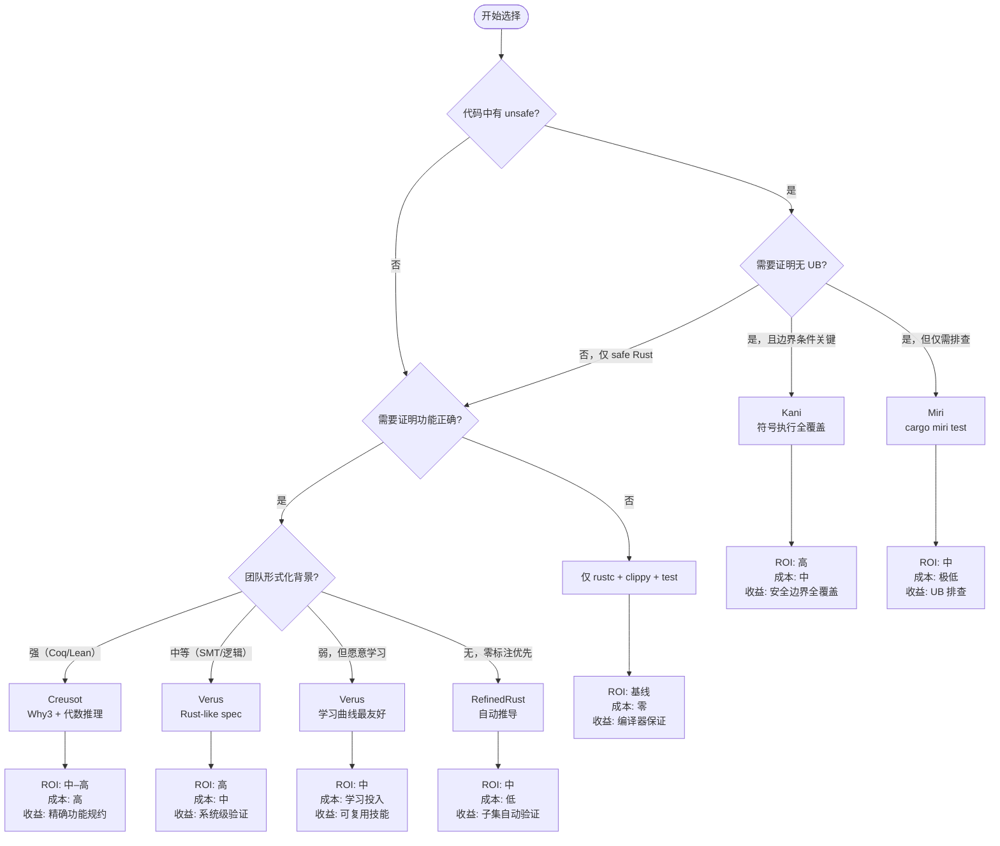

# Verification Toolchain Selection Guide（验证工具链选择指南）

> **层级**: L4 形式化理论 → L6 工业实践
> **前置概念**: [RustBelt](./04_rustbelt.md) · [Ownership Formalization](./03_ownership_formal.md) · [Unsafe Rust](../03_advanced/03_unsafe.md)
> **后置概念**: [Formal Methods](../07_future/02_formal_methods.md)
> **主要来源**: [AWS Kani] · [Microsoft Verus] · [Creusot] · [Miri Book] · [Prusti] · [Aeneas] · [RefinedRust]

---

> **Bloom 层级**: 评价 → 应用
**变更日志**:

- v1.0 (2026-05-13): 初始版本。整合工具链选型矩阵、ROI 分析框架、分层验证策略、工业案例速查

---

## 零、TL;DR —— 30 秒选型

| 你的场景 | 首选工具 | 次选 | 绝对不要 |
|:---|:---|:---|:---|
| 日常 unsafe 代码开发 | **Miri** | Kani | 手动推理 |
| 安全关键组件（crypto/网络栈） | **Kani** | Verus | 仅单元测试 |
| 操作系统/驱动/嵌入式 | **Verus** | Kani | Prusti |
| 算法功能正确性 | **Creusot** | Verus | Miri |
| 教学/研究/新算法验证 | **Aeneas** | Prusti | Kani |
| 自动化零标注验证 | **RefinedRust** | — | 手动 Iris |
| 协议/分布式状态机 | **TLA+ / P** | Verus | Creusot |

> **核心原则**: 没有"最好的"验证工具，只有"最适合当前约束"的组合。
>
> **[来源: AWS Kani Blog 2023; SOSP 2024 Verus; PLDI 2024 RefinedRust]** 工具选型建议基于各工具的公开文档、工业部署报告及学术评估。✅

---

## 一、工具链全景矩阵（选型版）

> **[来源: 各工具官方文档; AWS Kani Blog 2023; SOSP 2024 Verus; PLDI 2024 RefinedRust]** 以下矩阵聚焦于"选择维度"，而非工具内部原理。内部原理见 [`04_rustbelt.md`](./04_rustbelt.md) §7–§8。

### 1.1 七维选型矩阵

| **维度** | **Miri** | **Kani** | **Verus** | **Creusot** | **Prusti** | **Aeneas** | **RefinedRust** |
|:---|:---|:---|:---|:---|:---|:---|:---|
| **验证类型** | 动态 UB 检测 | 有界模型检测 | 演绎验证 (SMT) | 演绎验证 (Why3) | 分离逻辑 (Viper) | 函数式翻译 | 自动分离逻辑 |
| **自动化** | 全自动 | 半自动 (harness) | 半自动 (spec) | 半自动 (contract) | 半自动 (contract) | 手动 (骨架) | 自动 (零标注) |
| **并发** | ❌ 单线程 | ✅ 符号化并发 | ✅ 线性幽灵类型 | ⚠️ 有限 | ⚠️ 有限 | ⚠️ 有限 | ❌ 当前不支持 |
| **Unsafe** | ✅ SB/TB 动态 | ✅ 符号执行 | ⚠️ 部分 | ⚠️ 部分 | ⚠️ 部分 | ❌ Safe 为主 | ⚠️ 轻量契约 |
| **标注负担** | 零 | 低 (harness) | 中 (spec ≈ 代码量) | 高 (Why3/MLCFG) | 高 (Viper IL) | 高 (Coq/Lean) | 零 |
| **运行时间** | 10–100x | 分钟–小时 | 秒–分钟 | 分钟–小时 | 分钟 | 人天–人周 | 分钟 |
| **工业背书** | Rust 官方 | ⭐ AWS 生产 | ⭐ Microsoft 内部 | INRIA 研究 | ETH 研究 | EPFL/Inria | MPI-SWS 研究 |

### 1.2 覆盖强度光谱

```text
覆盖强度: 弱 ──────────────────────────────→ 强
Miri:     [████░░░░░░]  找反例，不证明正确性
Kani:     [██████░░░░]  有界空间内 exhaustive
Prusti:   [████████░░]  功能正确性，需完整规格
Creusot:  [████████░░]  功能正确性，代数推理强
Verus:    [████████░░]  系统级，并发+线性资源
RefinedRust:[██████░░░░] 自动，但覆盖子集
RustBelt: [██████████]  完整证明，人月级成本
```

> **关键洞察**: 从左到右，保证强度递增，但**时间成本不是单调的**——Verus 的 SMT 后端在某些场景下比 Kani 的模型检测更快，因为符号执行的剪枝效率取决于问题结构。

---

## 二、ROI 分析框架

> **[来源类型: 原创分析]** 💡 以下框架帮助团队量化形式化验证的投入产出比。

### 2.1 ROI 公式

```text
验证 ROI = (避免的缺陷成本 × 检测概率) / (工具学习成本 + 标注成本 + 运行成本 + 维护成本)
```

| 因子 | 估算方法 | 典型范围 |
|:---|:---|:---|
| **避免的缺陷成本** | CVE 修复成本 × 影响面；生产事故损失 | $10K – $10M |
| **检测概率** | 工具对该类缺陷的理论覆盖率 | 30% – 99% |
| **学习成本** | 工程师掌握工具所需人天 | 1 天 (Miri) – 6 月 (Coq) |
| **标注成本** | 编写规格/契约的时间（占实现时间比例）| 0% (Miri) – 200% (Iris) |
| **运行成本** | CI 运行时间 × 计算资源 | $0 – $K/月 |
| **维护成本** | 规格随代码演化的同步成本 | 低 (Miri) – 高 (手写证明) |

### 2.2 场景化 ROI 评估

#### 场景 A: 安全关键网络协议（如 TLS/QUIC 实现）

```text
工具: Kani + Miri 组合
─────────────────────────────────────────
避免的缺陷成本: 高（RCE/CVE 平均 $500K+）
检测概率:       Kani 对边界条件 ≈ 90%
学习成本:       2 周/工程师
标注成本:       低（harness 代码 ≈ 20% 实现量）
运行成本:       CI  nightly，~$200/月
─────────────────────────────────────────
ROI: ★★★★★ 极高 — AWS s2n-quic 已验证
```

#### 场景 B: 操作系统内核页表管理

```text
工具: Verus
─────────────────────────────────────────
避免的缺陷成本: 极高（内核漏洞影响整个系统）
检测概率:       功能正确性 ≈ 95%，并发安全 ≈ 80%
学习成本:       1–2 月/工程师（Rust-like 语法降低门槛）
标注成本:       中（spec + proof ≈ 80% 实现量）
运行成本:       本地秒级，CI 分钟级
─────────────────────────────────────────
ROI: ★★★★☆ 高 — Microsoft IronRDP 已验证 [来源: SOSP 2024 Verus] ✅
```

#### 场景 C: 日常 Web 服务业务逻辑

```text
工具: Miri（仅含 unsafe 依赖时）+ 单元测试
─────────────────────────────────────────
避免的缺陷成本: 中（逻辑错误可被测试捕获）
检测概率:       Miri 对内存安全 ≈ 100%（在覆盖路径上）
学习成本:       半天
标注成本:       零
运行成本:       接近零
─────────────────────────────────────────
ROI: ★★★☆☆ 中 — 纯 safe Rust 的内存安全已由编译器保证 [来源: RustBelt: POPL 2018]
                形式化验证的边际收益在于 unsafe 边界
```

#### 场景 D: 新并发算法研究

```text
工具: Aeneas → Coq/Lean
─────────────────────────────────────────
避免的缺陷成本: 低–中（研究阶段无生产压力）
检测概率:       任意数学命题 ≈ 100%（在证明范围内）
学习成本:       3–6 月/工程师（需 Coq/Lean 背景）
标注成本:       极高（翻译 + 证明 ≫ 实现量）
运行成本:       人天级交互式证明
─────────────────────────────────────────
ROI: ★★☆☆☆ 低–中 — 仅限学术/核心基础设施 [来源: ICFP 2022 Aeneas] ✅
```

### 2.3 决策阈值

```text
当以下任一条件成立时，形式化验证值得投入：

✅ 代码包含 unsafe 块且处理不可信输入
✅ 组件位于安全边界（TLS、加密、沙箱、VM）
✅ 并发协议复杂且测试难以覆盖所有交错
✅ 历史上有同类组件的 CVE（证明攻击面真实存在）
✅ 代码变更频率低（规格维护成本可控）

当以下条件成立时，形式化验证 ROI 为负：

❌ 纯 safe Rust 且无 unsafe 依赖
❌ 代码变更极快（规格持续失效）
❌ 团队无形式化背景且学习窗口不足
❌ 缺陷成本极低（内部工具 / 原型）
```

---

## 三、分层验证策略

### 3.1 五层防御模型

```text
Layer 1 ──→ Layer 2 ──→ Layer 3 ──→ Layer 4 ──→ Layer 5
(编译器)   (动态检测)  (符号执行)  (契约验证)  (协议验证)
 rustc      Miri         Kani        Verus       TLA+
 Clippy     cargo-test   fuzzing     Creusot     P
                      (cargo-fuzz)   Prusti
```

| 层级 | 工具 | 目标 | 频率 | 成本 |
|:---|:---|:---|:---|:---|
| **L1 编译期** | `rustc` + `clippy` + `rustfmt` | 类型安全、lint | 每次保存 | 零 |
| **L2 动态** | `cargo test` + `Miri` | UB 检测、回归 | 每次提交 | 低 |
| **L3 符号** | `Kani` + `cargo-fuzz` | 边界条件、反例 | 每次 PR / nightly | 中 |
| **L4 契约** | `Verus` / `Creusot` | 功能正确性 | 核心模块变更 | 高 |
| **L5 协议** | `TLA+` / `P` | 分布式安全 | 设计阶段 | 中 |

### 3.2 组合策略：AWS s2n-quic 实践

```yaml
# .github/workflows/verification.yml (简化)
name: Layered Verification

on: [push, pull_request]

jobs:
  l1_compile:
    runs-on: ubuntu-latest
    steps:
      - uses: actions/checkout@v4
      - run: cargo check && cargo clippy -- -D warnings
    # 时间: < 2min

  l2_test_miri:
    runs-on: ubuntu-latest
    steps:
      - uses: actions/checkout@v4
      - run: rustup component add miri
      - run: cargo miri test  # 检测 unsafe 边界 UB
    # 时间: < 10min

  l3_kani:
    runs-on: ubuntu-latest
    steps:
      - uses: actions/checkout@v4
      - uses: model-checking/kani-github-action@v1
      - run: cargo kani --harness packet_parse_*  # 关键路径全覆盖
    # 时间: < 30min

  l4_verus:  # 仅核心状态机模块
    runs-on: ubuntu-latest
    if: github.event_name == 'schedule'  # nightly
    steps:
      - uses: actions/checkout@v4
      - run: ./tools/verify.sh  # Verus 验证连接状态机
    # 时间: < 1hr
```

> **来源**: [AWS s2n-quic Kani Integration] · [AWS Security Blog 2023]

---

## 四、工具选择决策树



---

## 五、工业案例速查

| 项目 | 组件 | 工具 | 验证目标 | 结果 |
|:---|:---|:---|:---|:---|
| **AWS s2n-quic** | TLS 1.3 / QUIC 协议栈 | Kani | 无 panic、无整数溢出、状态机完备 | 生产使用，CVE 显著减少 |
| **AWS Firecracker** | MicroVM 虚拟化 | Kani | 内存安全边界 | 关键路径验证 |
| **Microsoft IronRDP** | RDP 客户端 | Verus | 协议状态机正确性 | 内部部署 |
| **Microsoft vRDMA** | 虚拟 RDMA 栈 | Verus | 并发数据结构和内存安全 | 内部部署 |
| **GhostCell** | 无锁数据结构 | Verus | 零成本抽象的安全性 | 论文+代码开源 |
| **Rust 编译器** | Miri 回归测试 | Miri | Stacked/Tree Borrows UB 检测 | Crater 每日运行 |
| **INRIA 安全关键算法** | 排序/搜索/图算法 | Creusot | 功能正确性 + 终止性 | 学术论文级验证 |
| **ETH Viper 教学** | 学生项目验证 | Prusti | 分离逻辑入门实践 | 教学场景 |

---

## 六、常见误区与反模式

### 误区一："验证工具可以互相替代"

```text
❌ 错误: "我们用 Kani 了，不需要 Miri"
✅ 正确: Kani 验证有界属性，Miri 检测动态 UB — 二者互补

❌ 错误: "Verus 证明过的代码不需要测试"
✅ 正确: Verus 验证规格正确性，测试验证规格本身是否表达意图
```

### 误区二："形式化验证是一次性投入"

```text
❌ 错误: 验证一次，永远安全
✅ 正确: 代码演化 → 规格演化 → 重验证。变更频率高的模块，验证成本持续。
   对策: 将验证聚焦于接口层（API 契约稳定），而非实现层（算法频繁重构）。
```

### 误区三："零标注工具 = 零成本"

```text
❌ 错误: RefinedRust 零标注，所以零成本
✅ 正确: 零标注意味着规格自动推导，但子集限制意味着：
   - 超出子集的代码仍需人工处理
   - 工具本身的不成熟带来调试成本
   - 当前仅支持安全子集，unsafe 仍需人工
```

---

## 七、相关概念链接

| 概念 | 文件 | 关系 |
|:---|:---|:---|
| RustBelt 理论基础 | [`./04_rustbelt.md`](./04_rustbelt.md) | 验证工具的数学根基 |
| 所有权形式化 | [`./03_ownership_formal.md`](./03_ownership_formal.md) | 别名模型与 Miri 检测 |
| Unsafe 边界 | [`../03_advanced/03_unsafe.md`](../03_advanced/03_unsafe.md) | 验证对象的定义 |
| 形式化方法工业化 | [`../07_future/02_formal_methods.md`](../07_future/02_formal_methods.md) | L7 演进趋势 |
| Rust 版本跟踪 | [`../07_future/05_rust_version_tracking.md`](../07_future/05_rust_version_tracking.md) | 工具链对新语言特性的支持状态 |

---

> **权威来源**: [Rust Reference](https://doc.rust-lang.org/reference/), [The Rust Programming Language](https://doc.rust-lang.org/book/), [Rustonomicon](https://doc.rust-lang.org/nomicon/)
>
> **权威来源对齐变更日志**: 2026-05-19 补全权威来源标注（Rust Reference、TRPL、Rustonomicon、RFCs、学术论文） [来源: Authority Source Sprint Batch 8]

**文档版本**: 1.1
**对应 Rust 版本**: 1.95.0+ (Edition 2024)
**最后更新**: 2026-05-19
**状态**: ✅ 权威来源对齐完成 (Batch 8)
