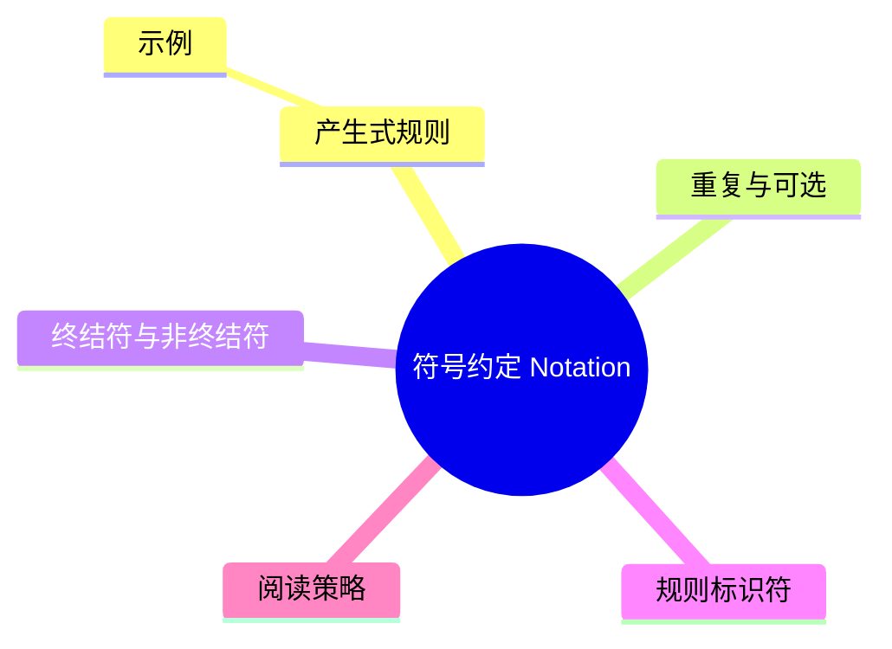

# 符号约定（Notation）

> **EN**: Notation
> **Summary**: Rust Reference 使用的形式化记法约定：BNF/EBNF 风格产生式、Unicode 属性、规则标识符与测试链接的解读方式。
> **Rust 版本**: 1.97.0+ (Edition 2024)
>
> **受众**: [研究者]
> **内容分级**: [研究者级]
> **Bloom 层级**: L1-L2
> **权威来源**: 本文件为 `concept/` 权威页。
> **A/S/P 标记**: **S** — Specification
> **双维定位**: S×Ana — 规范分析
> **前置依赖**: [Programming Language Foundations](../04_model_checking/05_programming_language_foundations.md)
> **后置概念**: [Lexical Structure](../05_rustc_internals/10_lexical_structure.md)
> **定理链**: Syntax → Production Rule → Rust Grammar
>
> **来源**: [Rust Reference — Notation](https://doc.rust-lang.org/reference/notation.html) · [Aho, Sethi & Ullman — Compilers: Principles, Techniques, and Tools](https://en.wikipedia.org/wiki/Compilers:_Principles,_Techniques,_and_Tools) · [Pierce — Types and Programming Languages](https://www.cis.upenn.edu/~bcpierce/tapl/) · [Jung et al. — RustBelt: Securing the Foundations of Rust](https://plv.mpi-sws.org/rustbelt/popl18/) · [TRPL](https://doc.rust-lang.org/book/title-page.html)

---

> **跨层回溯**: [宏系统](../../03_advanced/03_proc_macros/01_macros.md) · [过程宏（Procedural Macro）](../../03_advanced/03_proc_macros/02_proc_macro.md)

---

## 一、产生式规则

Rust Reference 使用类似 BNF（Backus–Naur Form）的产生式描述语法。

```text
rule-name := expression
```

- `:=` 左侧为规则名，右侧为展开式。
- 规则名使用小写连字符形式，如 `identifier`。
- 多个产生式用竖线 `|` 分隔，表示“或”。

### 示例

```text
type := path
      | tuple-type
      | function-type
```

## 二、重复与可选

| 记法 | 含义 |
|:---|:---|
| `item*` | 零次或多次重复 |
| `item+` | 一次或多次重复 |
| `item?` | 可选（零次或一次） |
| `(item)*` | 对分组整体重复 |

## 三、终结符与非终结符

- **终结符**：用等宽字体表示的具体 token，如 `fn`、`;`、`{`。
- **非终结符**：用斜体或下划线表示的语法范畴，如 *expression*、*type*。
- **Unicode 属性**：产生式中可能引用（Reference） Unicode 标准属性，如 `XID_Start`、`XID_Continue`。

## 四、规则标识符

Rust Reference 为许多规则附加稳定标识符，形如：

```text
[notation.productions.repetition]
```

这些标识符用于：

1. 在文档内部交叉引用（Reference）。
2. 链接到对应的编译器测试（Tests 链接）。
3. 在 RFC 或 issue 讨论中精确指代规则。

> **注意**：规则标识符当前仍处于稳定化过程中，版本间可能变动。

## 五、阅读策略

- 先查总览产生式，再深入具体子规则。
- 结合 [Lexical Structure](../05_rustc_internals/10_lexical_structure.md) 理解 token 级别规则。
- 结合 Rust Reference 的 Grammar Summary 附录获取完整语法概览。

## 六、Unicode 属性示例

Rust 标识符规则直接引用（Reference） Unicode 属性：

| 属性 | 含义 | 应用 |
|:---|:---|:---|
| `XID_Start` | 可作为标识符首字符 | 变量、函数名 |
| `XID_Continue` | 可作为标识符后续字符 | 变量、函数名 |

例如 `foo`、`foo1`、`_foo` 均合法；`1foo` 不合法，因为数字不是 `XID_Start`。

## 七、记法速查表

| 符号 | 含义 | 示例 |
|:---|:---|:---|
| `:=` | 定义为 | `rule := ...` |
| `\|` | 或 | `a \| b` |
| `*` | 零次或多次 | `item*` |
| `+` | 一次或多次 | `item+` |
| `?` | 可选 | `item?` |
| `[label]` | 规则标识符 | `[notation.productions]` |
| *italic* | 非终结符 | *expression* |
| `monospace` | 终结符 | `fn` |

---

## 八、与其他概念的关系

```mermaid
graph TD
    A[Notation] --> B[Lexical Structure]
    A --> C[Statements and Expressions Reference]
    A --> D[Rust Reference Grammar](https://doc.rust-lang.org/reference/introduction.html)
    B --> E[Tokens]
    C --> F[Production Rules]
```

---

> **权威来源**: [Rust Reference — Notation](https://doc.rust-lang.org/reference/notation.html) · [Unicode Standard — Identifier and Pattern Syntax](https://unicode.org/reports/tr31/) · [Pierce — Types and Programming Languages](https://www.cis.upenn.edu/~bcpierce/tapl/)
---

> **权威来源**: [Rust Reference — Notation](https://doc.rust-lang.org/reference/notation.html) · [Aho, Sethi & Ullman — Compilers: Principles, Techniques, and Tools](https://en.wikipedia.org/wiki/Compilers:_Principles,_Techniques,_and_Tools) · [Pierce — Types and Programming Languages](https://www.cis.upenn.edu/~bcpierce/tapl/) · [Jung et al. — RustBelt: Securing the Foundations of Rust](https://plv.mpi-sws.org/rustbelt/popl18/) · [TRPL](https://doc.rust-lang.org/book/title-page.html) · [Rust Reference Grammar](https://doc.rust-lang.org/reference/introduction.html) · [Rustonomicon](https://doc.rust-lang.org/nomicon/index.html)
> **权威来源对齐变更日志**: 2026-07-10 补全权威来源标注（Rust Reference、TRPL、Rustonomicon、RFCs、学术论文） [Authority Source Sprint Batch L4](../../00_meta/02_sources/05_international_authority_index.md)

**文档版本**: 1.0
**最后更新**: 2026-07-10
**状态**: ✅ 权威来源对齐完成 (Batch L4)

---

## 国际权威参考 / International Authority References（P1 学术 · P2 生态）

> 依据 `AGENTS.md` §2「对齐网络国际化权威内容」补充：仅追加已验证可达的权威链接，不改动正文事实。

- **P2 生态/社区**: [model-checking/verify-rust-std](https://github.com/model-checking/verify-rust-std) · [verus-lang/verus — SMT 验证器](https://github.com/verus-lang/verus)

## 🧭 思维导图（Mindmap）



> **认知功能**: 本 mindmap 从本页章节结构提炼，一级分支对应核心主题，叶子节点为关键子概念，可作为本页的快速导航与复习索引。
---

## ⚠️ 反例与陷阱

> 陷阱：`as` 是 Rust 的强制类型转换关键字，但并非所有类型之间都允许直接 cast。
> 下面代码在 rustc 1.97 --edition 2024 下触发 `E0606`。

```rust,compile_fail,E0606
fn main() {
    let s = "42";
    let _: u32 = s as u32;
}
```

**修正对照**（使用 `parse` 进行安全转换）：

```rust
fn main() {
    let s = "42";
    let _: u32 = s.parse().unwrap();
}
```
