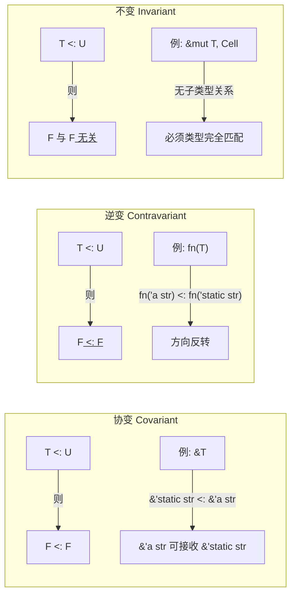
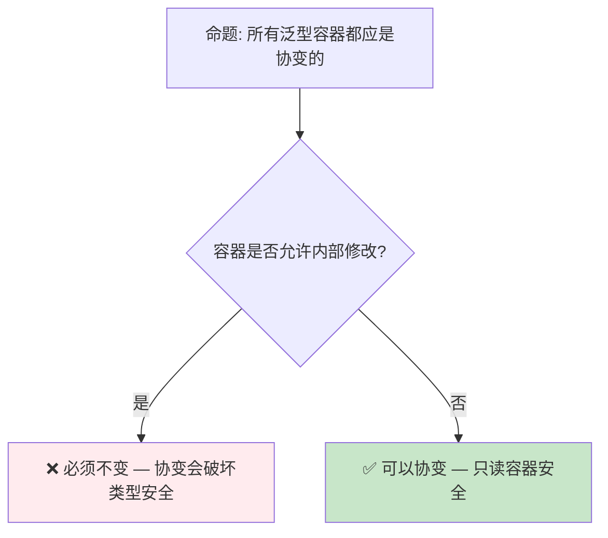

# 子类型与变型：Rust 类型系统中的协变、逆变与不变

> **Bloom 层级**: 分析 → 评价
> **定位**: 深入分析 Rust 类型系统中的**子类型关系**与**变型规则**（Variance），解释为什么 `&'static str` 可以赋给 `&'a str`，但 `&mut &'static str` 不能赋给 `&mut &'a str`。
> **前置概念**: [Type System](../01_foundation/04_type_system.md) · [Lifetimes](../01_foundation/03_lifetimes.md) · [Generics](../02_intermediate/02_generics.md)
> **后置概念**: [Type Theory](./02_type_theory.md) · [RustBelt](./04_rustbelt.md)

---

> **来源**: [Rust Reference — Subtyping](https://doc.rust-lang.org/reference/subtyping.html) ·
> [Rustonomicon — Variance](https://doc.rust-lang.org/nomicon/subtyping.html) ·
> [Wikipedia — Covariance and Contravariance](https://en.wikipedia.org/wiki/Covariance_and_contravariance_(computer_science)) ·
> [TAPL — Types and Programming Languages](https://www.cis.upenn.edu/~bcpierce/tapl/)

## 📑 目录
> [来源: [TRPL](https://doc.rust-lang.org/book/)]

- [子类型与变型：Rust 类型系统中的协变、逆变与不变](#子类型与变型rust-类型系统中的协变逆变与不变)
  - [📑 目录](#-目录)
  - [一、核心概念](#一核心概念)
    - [1.1 子类型关系：'static 是 'a 的子类型](#11-子类型关系static-是-a-的子类型)
    - [1.2 变型三态：协变、逆变、不变](#12-变型三态协变逆变不变)
    - [1.3 Rust 中的变型规则](#13-rust-中的变型规则)
  - [二、技术细节](#二技术细节)
    - [2.1 生命周期位置的变型推导](#21-生命周期位置的变型推导)
    - [2.2 结构体与枚举的变型](#22-结构体与枚举的变型)
    - [2.3 函数指针的变型](#23-函数指针的变型)
  - [三、形式化分析](#三形式化分析)
  - [四、反命题与边界分析](#四反命题与边界分析)
    - [4.1 反命题树](#41-反命题树)
    - [4.2 边界极限](#42-边界极限)
  - [五、常见编译错误解析](#五常见编译错误解析)
  - [六、来源与延伸阅读](#六来源与延伸阅读)
  - [相关概念文件](#相关概念文件)

---

## 一、核心概念
> [来源: [Rust Reference](https://doc.rust-lang.org/reference/)]

### 1.1 子类型关系：'static 是 'a 的子类型

在 Rust 中，子类型关系主要出现在**生命周期**之间：

```text
生命周期子类型:
  'static <: 'a  对于所有 'a

含义:
  - 'static 是 "活得最长" 的生命周期
  - 'a 是某个特定（可能更短）的生命周期
  - 'static 可以安全地用在任何需要 'a 的地方

直观理解:
  "活得长的" 是 "活得短的" 的子类型
  因为：如果一个引用永远有效（'static），它当然在某个时间段内有效（'a）

代码示例:
  let s: &'static str = "hello";  // 字符串字面量: 'static
  let r: &'a str = s;             // ✅ 'static <: 'a
```

> **子类型方向**: Rust 生命周期子类型是**反直觉的**——"长生命周期"是"短生命周期"的子类型。这与面向对象的类继承方向相反（Dog <: Animal，特化的是子类型）。
> [来源: [Rust Reference — Subtyping](https://doc.rust-lang.org/reference/subtyping.html)]

---

### 1.2 变型三态：协变、逆变、不变



> **认知功能**: 此图展示变型三态的**核心定义**——协变保持子类型方向，逆变反转方向，不变消除关系。
> [来源: [TRPL](https://doc.rust-lang.org/book/)]
> **记忆口诀**:
>
> - 协变 = "同向"（子类型方向不变）
> - 逆变 = "反向"（子类型方向反转）
> - 不变 = "无关"（无子类型关系）
> [来源: [Wikipedia — Variance](https://en.wikipedia.org/wiki/Covariance_and_contravariance_(computer_science))]

---

### 1.3 Rust 中的变型规则

```text
Rust 类型的变型规则:

  &T          → 协变 over T
  &mut T      → 不变 over T
  *const T    → 协变 over T
  *mut T      → 不变 over T
  Box<T>      → 协变 over T
  Vec<T>      → 协变 over T
  Cell<T>     → 不变 over T
  RefCell<T>  → 不变 over T
  Mutex<T>    → 不变 over T
  fn(T) -> U  → 逆变 over T, 协变 over U
  UnsafeCell<T> → 不变 over T

  结构体/枚举: 根据字段位置推导
  泛型参数: 默认协变，可通过 PhantomData 控制
```

> **规则洞察**: Rust 的变型规则遵循**安全原则**——任何允许修改内部值的类型（&mut, Cell, Mutex）都是不变的，因为协变/逆变可能导致类型安全的破坏。
> [来源: [Rustonomicon — Variance](https://doc.rust-lang.org/nomicon/subtyping.html)]

---

## 二、技术细节
> [来源: [TRPL](https://doc.rust-lang.org/book/)]

### 2.1 生命周期位置的变型推导

```rust,ignore
// 协变示例: &T
let s: &'static str = "hello";
let r: &'a str = s;  // ✅ &'static str <: &'a str

// 解释:
// &T 对 T 是协变的
// 'static <: 'a
// 因此 &'static str <: &'a str

// 不变示例: &mut T
let mut s: &'static str = "hello";
let r: &mut &'a str = &mut s;  // ❌ 编译错误！

// 解释:
// &mut T 对 T 是不变的
// 即使 'static <: 'a
// &mut &'static str 与 &mut &'a str 无子类型关系
// 原因: 通过 &mut 可以修改指向的值
// 如果允许转换，可能将短生命周期引用写入长生命周期位置
```

> **技术要点**: `&mut T` 的不变性是 Rust **别名规则**（Aliasing Rules）的直接结果。如果 `&mut` 是协变的，可以通过子类型转换创建悬空 `&mut`。
> [来源: [Rustonomicon — Subtyping and Variance](https://doc.rust-lang.org/nomicon/subtyping.html)]

---

### 2.2 结构体与枚举的变型

```rust,ignore
// 结构体的变型由字段推导
struct Wrapper<'a, T> {
    item: &'a T,  // &'a T: 协变 over 'a, 协变 over T
}

// Wrapper<'static, str> <: Wrapper<'a, str>
// 因为所有字段都是协变的

// 反例: 包含 &mut 字段的结构体
struct Mixed<'a, T> {
    ref_item: &'a T,      // 协变 over 'a
    mut_item: &'a mut T,  // 不变 over T
}

// Mixed 对 T 是不变的（因为 mut_item 字段）
// Mixed 对 'a 是协变的（因为两个字段都对 'a 协变）

// 枚举的变型
enum Option<'a, T> {
    Some(&'a T),  // 协变 over 'a, 协变 over T
    None,
}

// Option<'static, str> <: Option<'a, str> ✅
```

> **推导规则**: 结构体/枚举对类型参数 X 的变型是其所有字段对 X 变型的**最小上界**——如果任何字段是不变的，整体就是不变的。
> [来源: [Rust Reference — Variance](https://doc.rust-lang.org/reference/subtyping.html#variance)]

---

### 2.3 函数指针的变型

```rust,ignore
// 函数指针的变型: 逆变 over 参数，协变 over 返回值

// 逆变 over 参数:
// fn(&'a str) 接受任何 &'a str（或更长的子类型）
// 如果 T <: U，则 fn(U) <: fn(T)
// 因为能处理更宽输入的函数能处理更窄输入

fn takes_static(s: &'static str) { }
fn takes_a<'a>(s: &'a str) { }

let f: fn(&'static str) = takes_a;  // ✅ fn(&'a str) <: fn(&'static str)
// takes_a 能接受 &'a str，当然也能接受 &'static str

// 协变 over 返回值:
// fn() -> &'static str 的返回值可以赋给 &'a str
fn returns_static() -> &'static str { "hello" }
let f: fn() -> &'a str = returns_static;  // ✅ &'static str <: &'a str
```

> **函数变型直觉**:
>
> - **参数逆变**: 函数能接受"更多"输入，就能替代"更少"输入的函数
> - **返回值协变**: 函数返回"更具体"的类型，就能替代"更抽象"返回类型的函数
> [来源: [TAPL — Function Types](https://www.cis.upenn.edu/~bcpierce/tapl/)]

---

## 三、形式化分析
> [来源: [Rust Reference](https://doc.rust-lang.org/reference/)]

```text
形式化定义:

  子类型关系 (Subtyping):
    T <: U  表示 T 是 U 的子类型
    含义: 任何需要 U 的上下文都可以用 T 替代

  变型 (Variance):
    给定类型构造子 F<T>:

    协变 (Covariant):     T <: U ⟹ F<T> <: F<U>
    逆变 (Contravariant): T <: U ⟹ F<U> <: F<T>
    不变 (Invariant):     T <: U ⟹ F<T> 与 F<U> 无关

  Rust 子类型关系:
    'a: 'b  （'a 比 'b 活得长）
    等价于: 'b <: 'a  （短生命周期是长生命周期的子类型）

  安全条件:
    变型规则必须保证: 如果 T <: U 且 F<T> <: F<U>（或逆），
    则通过 F 的操作不会破坏类型安全。

    这就是为什么 &mut T 必须是不变的:
    假设 &mut T 对 T 是协变:
    'static <: 'a
    &mut &'static str <: &mut &'a str
    则可以将 &mut &'a str 写入 &'static str 的位置
    然后写入短生命周期引用 → 悬空引用 → 内存不安全
```

> **形式化洞察**: Rust 的变型规则是**类型安全的必要条件**，而非随意选择。每个类型的变型状态都经过严格推导，确保子类型转换不会引入内存不安全。
> [来源: [RustBelt — Logical Relations](https://plv.mpi-sws.org/rustbelt/)]

---

## 四、反命题与边界分析
> [来源: [Rust Reference](https://doc.rust-lang.org/reference/)]

### 4.1 反命题树



> **认知功能**: 此决策树判断是否可以将泛型容器设计为协变。核心判断标准是**内部可修改性**。
> [来源: [TRPL](https://doc.rust-lang.org/book/)]
> **使用建议**: 设计新类型时，如果类型允许内部修改（即使通过安全 API），则对相关类型参数使用不变变型。
> **关键洞察**: `Cell<T>` 和 `&mut T` 都是不变的，不是因为它们有相似的 API，而是因为它们都允许**通过共享访问修改内部值**——这正是变型规则需要阻止的不安全模式。
> [来源: [Rustonomicon — Variance](https://doc.rust-lang.org/nomicon/subtyping.html)]

---

### 4.2 边界极限

```text
边界 1: PhantomData 控制变型
├── 裸指针 *const T 和 *mut T 的变型是编译器固定的
├── 但对于包含裸指针的结构体，可通过 PhantomData 控制变型
├── PhantomData<T>: 协变 over T
├── PhantomData<*mut T>: 不变 over T
└── 例: Unique<T>（Vec 内部使用）通过 PhantomData 控制变型

边界 2: 自动 trait 与变型
├── Send 和 Sync 是自动 trait，不直接涉及变型
├── 但 T: Send 不意味着 Cell<T>: Send
├── 变型和自动 trait 是正交的约束维度

边界 3: GATs 与变型
├── 泛型关联类型（GATs）的变型规则更复杂
├── GAT 的变型取决于其定义中的参数位置
└── 当前 Rust 对 GAT 变型的支持有限制

边界 4: 与类型推断的交互
├── 子类型关系影响类型推断
├── Rust 的类型推断不直接使用子类型约束
├── 而是通过生命周期包含关系（'a: 'b）间接处理
```

> **边界要点**: 变型规则是 Rust 类型系统的**深层机制**——大多数开发者无需显式理解，但遇到生命周期相关编译错误时，变型知识是理解错误原因的关键。
> [来源: [Rust Reference — Variance](https://doc.rust-lang.org/reference/subtyping.html)]

---

## 五、常见编译错误解析
> [来源: [TRPL](https://doc.rust-lang.org/book/)]

```text
错误 1: "lifetime may not live long enough"
  ❌ let mut s: &'static str = "hello";
     let r: &mut &'a str = &mut s;
     // &mut T 对 T 是不变的
     // &'static str 不能转为 &'a str（在 &mut 上下文中）

  ✅ let mut s: &'a str = "hello";
     let r: &mut &'a str = &mut s;

错误 2: "cannot infer an appropriate lifetime"
  ❌ fn foo(x: &mut &'a str, y: &'b str) { *x = y; }
     // 如果 'b <: 'a，赋值应安全
     // 但 &mut 的不变性阻止了子类型推导

  ✅ fn foo<'a>(x: &mut &'a str, y: &'a str) { *x = y; }
     // 统一生命周期参数

错误 3: PhantomData 缺失导致意外变型
  ❌ struct MyPtr<T>(*const T);  // 编译器推断协变
     // 如果 MyPtr 实际有内部可变性，这是错误的

  ✅ struct MyPtr<T>(*const T, PhantomData<Cell<T>>);
     // 显式标记为不变
```

> **错误解析**: 大多数变型相关错误的核心信息是"类型/生命周期不匹配"。理解变型规则可以帮助快速定位：是生命周期问题、还是变型约束问题。
> [来源: [Rust Compiler Error Index](https://doc.rust-lang.org/error_codes/index.html)]

---

## 六、来源与延伸阅读

| 来源 | 可信度 | 说明 |
|:---|:---:|:---|
| [Rust Reference — Subtyping](https://doc.rust-lang.org/reference/subtyping.html) | ✅ 一级 | 官方语言参考 |
| [Rustonomicon — Variance](https://doc.rust-lang.org/nomicon/subtyping.html) | ✅ 一级 | 深入变型分析 |
| [TAPL](https://www.cis.upenn.edu/~bcpierce/tapl/) | ✅ 一级 | 类型理论教材 |
| [Wikipedia — Variance](https://en.wikipedia.org/wiki/Covariance_and_contravariance_(computer_science)) | 🔍 三级 | 变型概念介绍 |
| [RustBelt](https://plv.mpi-sws.org/rustbelt/) | ✅ 一级 | Rust 安全性的形式化证明 |

---

## 相关概念文件
> [来源: [Rust Reference](https://doc.rust-lang.org/reference/)]

- [Type System](../01_foundation/04_type_system.md) — Rust 类型系统
- [Lifetimes](../01_foundation/03_lifetimes.md) — 生命周期与借用
- [Generics](../02_intermediate/02_generics.md) — 泛型与参数多态
- [Type Theory](./02_type_theory.md) — 类型理论基础
- [RustBelt](./04_rustbelt.md) — Rust 安全性的形式化模型

---

> **权威来源**: [Rust Reference](https://doc.rust-lang.org/reference/), [The Rust Programming Language](https://doc.rust-lang.org/book/), [Rustonomicon](https://doc.rust-lang.org/nomicon/)
>
> **权威来源对齐变更日志**: 2026-05-21 创建，对齐 Rust 1.95.0+ (Edition 2024)

**文档版本**: 1.0
**对应 Rust 版本**: 1.95.0+ (Edition 2024)
**最后更新**: 2026-05-21
**状态**: ✅ 概念文件创建完成
