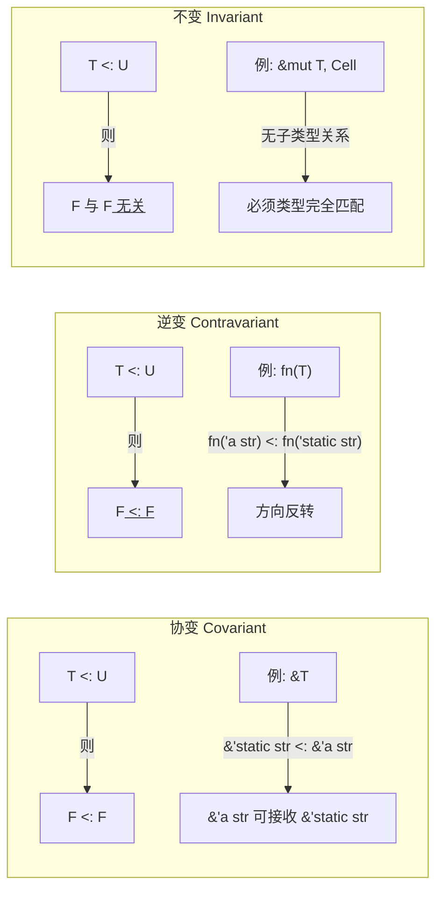
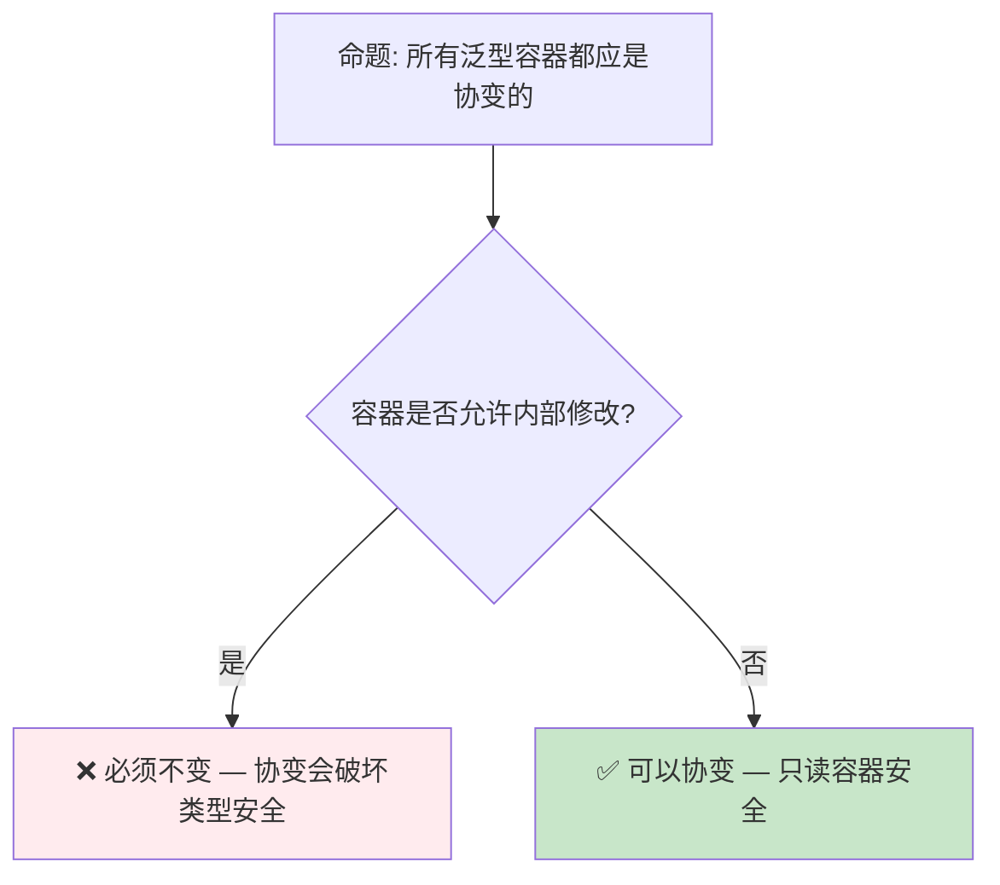

> **内容分级**: [专家级]

# 子类型与变型：Rust 类型系统中的协变、逆变与不变
>
> **EN**: Type System
> **Summary**: Type System. Core Rust concept covering mechanism analysis, in-depth analysis, type system mechanics.
> **受众**: [研究者]
> ⚠️ **声明**: 本文件使用形式化符号辅助直觉理解，所呈现的"定理/引理/推论"为**教学类比**，非经机器验证的严格数学证明。如需严格形式化验证，请参考 [Verus](https://github.com/verus-lang/verus)、[Kani](https://model-checking.github.io/kani/)、[Coq](https://coq.inria.fr/)。
>
> **Bloom 层级**: 分析 → 评价
> **A/S/P 标记**: **S** — Structure
> **双维定位**: C×Ana — 分析变型和子类型的传播规则
> **定位**: 深入分析 Rust 类型系统中的**子类型关系**与**变型规则**（Variance），解释为什么 `&'static str` 可以赋给 `&'a str`，但 `&mut &'static str` 不能赋给 `&mut &'a str`。
> **前置概念**: [Type System](../01_foundation/04_type_system.md) · [Lifetimes](../01_foundation/03_lifetimes.md) · [Generics](../02_intermediate/02_generics.md)
> **后置概念**: [Type Theory](./02_type_theory.md) · [RustBelt](./04_rustbelt.md)

---

> **来源**: [Rust Reference — Subtyping](https://doc.rust-lang.org/reference/subtyping.html) ·
> [Rustonomicon — Variance](https://doc.rust-lang.org/nomicon/subtyping.html) ·
> [Wikipedia — Covariance and Contravariance](https://en.wikipedia.org/wiki/Covariance_and_contravariance_(computer_science)) ·
> [TAPL — Types and Programming Languages](https://www.cis.upenn.edu/~bcpierce/tapl/)

> **前置依赖**: [Concurrency](../03_advanced/01_concurrency.md)

## 📑 目录

- [子类型与变型：Rust 类型系统中的协变、逆变与不变](#子类型与变型rust-类型系统中的协变逆变与不变)
  - [📑 目录](#-目录)
  - [一、核心概念](#一核心概念)
    - [1.1 子类型关系：'static 是 'a 的子类型](#11-子类型关系static-是-a-的子类型)
    - [1.2 变型三态：协变、逆变、不变](#12-变型三态协变逆变不变)
    - [1.3 Rust 中的变型规则](#13-rust-中的变型规则)
  - [二、技术细节](#二技术细节)
    - [2.1 生命周期位置的变型推导](#21-生命周期位置的变型推导)
    - [2.2 结构体与枚举的变型](#22-结构体与枚举的变型)
    - [2.3 函数指针的变型](#23-函数指针的变型)
  - [三、形式化分析](#三形式化分析)
  - [四、反命题与边界分析](#四反命题与边界分析)
    - [4.1 反命题树](#41-反命题树)
    - [4.2 边界极限](#42-边界极限)
  - [五、常见编译错误解析](#五常见编译错误解析)
  - [六、来源与延伸阅读](#六来源与延伸阅读)
  - [相关概念文件](#相关概念文件)
  - [权威来源索引](#权威来源索引)
  - [十、边界测试：子类型变异性的编译错误](#十边界测试子类型变异性的编译错误)
    - [10.1 边界测试：协变与逆变的生命周期误用（编译错误）](#101-边界测试协变与逆变的生命周期误用编译错误)
    - [10.2 边界测试：`UnsafeCell` 的不变性（编译错误）](#102-边界测试unsafecell-的不变性编译错误)
    - [10.3 边界测试：逆变与 `fn` 参数的不变性（编译错误）](#103-边界测试逆变与-fn-参数的不变性编译错误)
    - [10.4 边界测试：`UnsafeCell` 的不变性（编译错误/运行时 UB）](#104-边界测试unsafecell-的不变性编译错误运行时-ub)
    - [10.3 边界测试：逆变（contravariant）与函数参数的生命周期（编译错误）](#103-边界测试逆变contravariant与函数参数的生命周期编译错误)
    - [10.4 边界测试：协变/逆变与生命周期子类型的错误转换（编译错误）](#104-边界测试协变逆变与生命周期子类型的错误转换编译错误)
    - [10.4 边界测试：函数重复定义](#104-边界测试函数重复定义)
  - [认知路径](#认知路径)
    - [核心推理链](#核心推理链)
    - [反命题与边界](#反命题与边界)

---

## 一、核心概念
>
>

### 1.1 子类型关系：'static 是 'a 的子类型
>

在 Rust 中，子类型关系主要出现在**生命周期**之间：

```text
生命周期子类型:
  'static <: 'a  对于所有 'a

含义:
  - 'static 是 "活得最长" 的生命周期
  - 'a 是某个特定（可能更短）的生命周期
  - 'static 可以安全地用在任何需要 'a 的地方

直观理解:
  "活得长的" 是 "活得短的" 的子类型
  因为：如果一个引用永远有效（'static），它当然在某个时间段内有效（'a）

代码示例:
  let s: &'static str = "hello";  // 字符串字面量: 'static
  let r: &'a str = s;             // ✅ 'static <: 'a
```

> **子类型方向**: Rust 生命周期子类型是**反直觉的**——"长生命周期"是"短生命周期"的子类型。这与面向对象的类继承方向相反（Dog <: Animal，特化的是子类型）。
> [来源: [Rust Reference — Subtyping](https://doc.rust-lang.org/reference/subtyping.html)]

---

### 1.2 变型三态：协变、逆变、不变
>



> **认知功能**: 此图展示变型三态的**核心定义**——协变保持子类型方向，逆变反转方向，不变消除关系。
> [来源: [TRPL](https://doc.rust-lang.org/book/)]
> **记忆口诀**:
>
> - 协变 = "同向"（子类型方向不变）
> - 逆变 = "反向"（子类型方向反转）
> - 不变 = "无关"（无子类型关系）
> [来源: [Wikipedia — Variance](https://en.wikipedia.org/wiki/Covariance_and_contravariance_(computer_science))]

---

### 1.3 Rust 中的变型规则
>

```text
Rust 类型的变型规则:

  &T          → 协变 over T
  &mut T      → 不变 over T
  *const T    → 协变 over T
  *mut T      → 不变 over T
  Box<T>      → 协变 over T
  Vec<T>      → 协变 over T
  Cell<T>     → 不变 over T
  RefCell<T>  → 不变 over T
  Mutex<T>    → 不变 over T
  fn(T) -> U  → 逆变 over T, 协变 over U
  UnsafeCell<T> → 不变 over T

  结构体/枚举: 根据字段位置推导
  泛型参数: 默认协变，可通过 PhantomData 控制
```

> **规则洞察**: Rust 的变型规则遵循**安全原则**——任何允许修改内部值的类型（&mut, Cell, Mutex）都是不变的，因为协变/逆变可能导致类型安全的破坏。
> [来源: [Rustonomicon — Variance](https://doc.rust-lang.org/nomicon/subtyping.html)]

---

## 二、技术细节

### 2.1 生命周期位置的变型推导
>

```rust,ignore
// 协变示例: &T
let s: &'static str = "hello";
let r: &'a str = s;  // ✅ &'static str <: &'a str

// 解释:
// &T 对 T 是协变的
// 'static <: 'a
// 因此 &'static str <: &'a str

// 不变示例: &mut T
let mut s: &'static str = "hello";
let r: &mut &'a str = &mut s;  // ❌ 编译错误！

// 解释:
// &mut T 对 T 是不变的
// 即使 'static <: 'a
// &mut &'static str 与 &mut &'a str 无子类型关系
// 原因: 通过 &mut 可以修改指向的值
// 如果允许转换，可能将短生命周期引用写入长生命周期位置
```

> **技术要点**: `&mut T` 的不变性是 Rust **别名规则**（Aliasing Rules）的直接结果。如果 `&mut` 是协变的，可以通过子类型转换创建悬空 `&mut`。
> [来源: [Rustonomicon — Subtyping and Variance](https://doc.rust-lang.org/nomicon/subtyping.html)]

---

### 2.2 结构体与枚举的变型
>

```rust
// 结构体的变型由字段推导
struct Wrapper<'a, T> {
    item: &'a T,  // &'a T: 协变 over 'a, 协变 over T
}

// Wrapper<'static, str> <: Wrapper<'a, str>
// 因为所有字段都是协变的

// 反例: 包含 &mut 字段的结构体
struct Mixed<'a, T> {
    ref_item: &'a T,      // 协变 over 'a
    mut_item: &'a mut T,  // 不变 over T
}

// Mixed 对 T 是不变的（因为 mut_item 字段）
// Mixed 对 'a 是协变的（因为两个字段都对 'a 协变）

// 枚举的变型
enum Option<'a, T> {
    Some(&'a T),  // 协变 over 'a, 协变 over T
    None,
}

// Option<'static, str> <: Option<'a, str> ✅
```

> **推导规则**: 结构体/枚举对类型参数 X 的变型是其所有字段对 X 变型的**最小上界**——如果任何字段是不变的，整体就是不变的。
> [来源: [Rust Reference — Variance](https://doc.rust-lang.org/reference/subtyping.html#variance)]

---

### 2.3 函数指针的变型
>

```rust,ignore
// 函数指针的变型: 逆变 over 参数，协变 over 返回值

// 逆变 over 参数:
// fn(&'a str) 接受任何 &'a str（或更长的子类型）
// 如果 T <: U，则 fn(U) <: fn(T)
// 因为能处理更宽输入的函数能处理更窄输入

fn takes_static(s: &'static str) { }
fn takes_a<'a>(s: &'a str) { }

let f: fn(&'static str) = takes_a;  // ✅ fn(&'a str) <: fn(&'static str)
// takes_a 能接受 &'a str，当然也能接受 &'static str

// 协变 over 返回值:
// fn() -> &'static str 的返回值可以赋给 &'a str
fn returns_static() -> &'static str { "hello" }
let f: fn() -> &'a str = returns_static;  // ✅ &'static str <: &'a str
```

> **函数变型直觉**:
>
> - **参数逆变**: 函数能接受"更多"输入，就能替代"更少"输入的函数
> - **返回值协变**: 函数返回"更具体"的类型，就能替代"更抽象"返回类型的函数
> [来源: [TAPL — Function Types](https://www.cis.upenn.edu/~bcpierce/tapl/)]

---

## 三、形式化分析

```text
形式化定义:

  子类型关系 (Subtyping):
    T <: U  表示 T 是 U 的子类型
    含义: 任何需要 U 的上下文都可以用 T 替代

  变型 (Variance):
    给定类型构造子 F<T>:

    协变 (Covariant):     T <: U ⟹ F<T> <: F<U>
    逆变 (Contravariant): T <: U ⟹ F<U> <: F<T>
    不变 (Invariant):     T <: U ⟹ F<T> 与 F<U> 无关

  Rust 子类型关系:
    'a: 'b  （'a 比 'b 活得长）
    等价于: 'b <: 'a  （短生命周期是长生命周期的子类型）

  安全条件:
    变型规则必须保证: 如果 T <: U 且 F<T> <: F<U>（或逆），
    则通过 F 的操作不会破坏类型安全。

    这就是为什么 &mut T 必须是不变的:
    假设 &mut T 对 T 是协变:
    'static <: 'a
    &mut &'static str <: &mut &'a str
    则可以将 &mut &'a str 写入 &'static str 的位置
    然后写入短生命周期引用 → 悬空引用 → 内存不安全
```

> **形式化洞察**: Rust 的变型规则是**类型安全的必要条件**，而非随意选择。每个类型的变型状态都经过严格推导，确保子类型转换不会引入内存不安全。
> [来源: [RustBelt — Logical Relations](https://plv.mpi-sws.org/rustbelt/)]

---

## 四、反命题与边界分析

### 4.1 反命题树
>



> **认知功能**: 此决策树判断是否可以将泛型容器设计为协变。核心判断标准是**内部可修改性**。
> **使用建议**: 设计新类型时，如果类型允许内部修改（即使通过安全 API），则对相关类型参数使用不变变型。
> **关键洞察**: `Cell<T>` 和 `&mut T` 都是不变的，不是因为它们有相似的 API，而是因为它们都允许**通过共享访问修改内部值**——这正是变型规则需要阻止的不安全模式。

---

### 4.2 边界极限
>

```text
边界 1: PhantomData 控制变型
├── 裸指针 *const T 和 *mut T 的变型是编译器固定的
├── 但对于包含裸指针的结构体，可通过 PhantomData 控制变型
├── PhantomData<T>: 协变 over T
├── PhantomData<*mut T>: 不变 over T
└── 例: Unique<T>（Vec 内部使用）通过 PhantomData 控制变型

边界 2: 自动 trait 与变型
├── Send 和 Sync 是自动 trait，不直接涉及变型
├── 但 T: Send 不意味着 Cell<T>: Send
├── 变型和自动 trait 是正交的约束维度

边界 3: GATs 与变型
├── 泛型关联类型（GATs）的变型规则更复杂
├── GAT 的变型取决于其定义中的参数位置
└── 当前 Rust 对 GAT 变型的支持有限制

边界 4: 与类型推断的交互
├── 子类型关系影响类型推断
├── Rust 的类型推断不直接使用子类型约束
├── 而是通过生命周期包含关系（'a: 'b）间接处理
```

> **边界要点**: 变型规则是 Rust 类型系统的**深层机制**——大多数开发者无需显式理解，但遇到生命周期相关编译错误时，变型知识是理解错误原因的关键。
> [来源: [Rust Reference — Variance](https://doc.rust-lang.org/reference/subtyping.html)]

---

## 五、常见编译错误解析

```text
错误 1: "lifetime may not live long enough"
  ❌ let mut s: &'static str = "hello";
     let r: &mut &'a str = &mut s;
     // &mut T 对 T 是不变的
     // &'static str 不能转为 &'a str（在 &mut 上下文中）

  ✅ let mut s: &'a str = "hello";
     let r: &mut &'a str = &mut s;

错误 2: "cannot infer an appropriate lifetime"
  ❌ fn foo(x: &mut &'a str, y: &'b str) { *x = y; }
     // 如果 'b <: 'a，赋值应安全
     // 但 &mut 的不变性阻止了子类型推导

  ✅ fn foo<'a>(x: &mut &'a str, y: &'a str) { *x = y; }
     // 统一生命周期参数

错误 3: PhantomData 缺失导致意外变型
  ❌ struct MyPtr<T>(*const T);  // 编译器推断协变
     // 如果 MyPtr 实际有内部可变性，这是错误的

  ✅ struct MyPtr<T>(*const T, PhantomData<Cell<T>>);
     // 显式标记为不变
```

> **错误解析**: 大多数变型相关错误的核心信息是"类型/生命周期不匹配"。理解变型规则可以帮助快速定位：是生命周期问题、还是变型约束问题。
> [来源: [Rust Compiler Error Index](https://doc.rust-lang.org/error_codes/index.html)]

---

## 六、来源与延伸阅读
>

| 来源 | 可信度 | 说明 |
|:---|:---:|:---|
| [Rust Reference — Subtyping](https://doc.rust-lang.org/reference/subtyping.html) | ✅ 一级 | 官方语言参考 |
| [Rustonomicon — Variance](https://doc.rust-lang.org/nomicon/subtyping.html) | ✅ 一级 | 深入变型分析 |
| [TAPL](https://www.cis.upenn.edu/~bcpierce/tapl/) | ✅ 一级 | 类型理论教材 |
| [Wikipedia — Variance](https://en.wikipedia.org/wiki/Covariance_and_contravariance_(computer_science)) | 🔍 三级 | 变型概念介绍 |
| [RustBelt](https://plv.mpi-sws.org/rustbelt/) | ✅ 一级 | Rust 安全性的形式化证明 |

---

## 相关概念文件

- [Type System](../01_foundation/04_type_system.md) — Rust 类型系统
- [Lifetimes](../01_foundation/03_lifetimes.md) — 生命周期与借用
- [Generics](../02_intermediate/02_generics.md) — 泛型与参数多态
- [Type Theory](./02_type_theory.md) — 类型理论基础
- [RustBelt](./04_rustbelt.md) — Rust 安全性的形式化模型

---

> **权威来源**: [Rust Reference](https://doc.rust-lang.org/reference/), [The Rust Programming Language](https://doc.rust-lang.org/book/), [Rustonomicon](https://doc.rust-lang.org/nomicon/)
> **权威来源对齐变更日志**: 2026-05-21 创建，对齐 Rust 1.96.0+ (Edition 2024)

**文档版本**: 1.0
**对应 Rust 版本**: 1.96.0+ (Edition 2024)
**最后更新**: 2026-05-21
**状态**: ✅ 概念文件创建完成

---

## 权威来源索引

>
>
>
>
>
>
>

---

---

---

> **补充来源**

## 十、边界测试：子类型变异性的编译错误

### 10.1 边界测试：协变与逆变的生命周期误用（编译错误）

```rust,compile_fail
fn main() {
    let s = String::from("hello");
    let r: &str = &s;
    {
        let short = &s[..2];
        // ❌ 编译错误: `short` 的生命周期比 `r` 短
        // 不能将短生命周期引用赋给长生命周期引用
        let r2: &'static str = short; // 错误
    }
}

// 正确: 协变允许将子类型赋给父类型
fn fixed() {
    let s = "hello"; // 'static
    let r: &'static str = s; // ✅ 'static 是任何生命周期的子类型
}
```

> **修正**: 生命周期在 Rust 中是**协变**（covariant）的——较长生命周期是较短生命周期的子类型。`'static: 'a` 对任何 `'a` 成立，因此 `&'static T` 可隐式转为 `&'a T`。但反过来不行：`&'a T` 不能转为 `&'static T`。这与面向对象中的子类型多态（`Dog` 是 `Animal` 的子类型）方向一致——"更具体/更长久"是"更通用/更短暂"的子类型。错误的生命周期假设会导致悬垂引用，编译器通过变异性检查阻止此类转换。[来源: [Rustonomicon](https://doc.rust-lang.org/nomicon/)]

### 10.2 边界测试：`UnsafeCell` 的不变性（编译错误）

```rust,compile_fail
use std::cell::UnsafeCell;

fn main() {
    let cell: UnsafeCell<&'static i32> = UnsafeCell::new(&42);
    // ⚠️ UnsafeCell<T> 对 T 是不变的（invariant）
    // 以下转换在编译期被阻止
    let cell2: UnsafeCell<&'a i32> = cell; // 错误: 生命周期不匹配
}

// 正确: UnsafeCell 保持精确的生命周期
fn fixed() {
    let x = 42;
    let cell: UnsafeCell<&i32> = UnsafeCell::new(&x);
    unsafe {
        *cell.get() = &x; // ✅ 通过裸指针修改
    }
}
```

> **修正**: `UnsafeCell<T>` 对 `T` 是**不变**（invariant）的——不允许任何生命周期缩短或延长。这是因为 `UnsafeCell` 提供内部可变性，若允许协变，可能将短生命周期引用存储在期望长生命周期的上下文中，导致悬垂引用。`&mut T` 对 `T` 也是不变的，`Box<T>` 对 `T` 是协变的，`*const T` 对 `T` 是协变的，`*mut T` 对 `T` 是不变的。变异性的选择是 Rust 类型系统安全性的关键设计。[来源: [Rustonomicon](https://doc.rust-lang.org/nomicon/)]

### 10.3 边界测试：逆变与 `fn` 参数的不变性（编译错误）

```rust,ignore
fn takes_str(_: &str) {}

fn main() {
    let f: fn(&str) = takes_str;
    // ❌ 编译错误: fn 参数位置是逆变的，不能将 fn(&'static str) 赋值给 fn(&'a str)
    // let g: fn(&'static str) = f;

    // 正确理解:
    // fn(&str) 要求能接受任意生命周期的 &str
    // fn(&'static str) 只接受 'static 的 &str，能力更弱
    // 因此 fn(&str) 是 fn(&'static str) 的子类型（协变返回，逆变参数）
}
```

> **修正**: 函数指针 `fn(T) -> U` 的**变异性**（variance）：`T` 位置是**逆变**（contravariant），`U` 位置是**协变**（covariant）。逆变意味着：若 `A` 是 `B` 的子类型，则 `fn(B)` 是 `fn(A)` 的子类型。对生命周期而言，`&'static str` 比 `&'a str` 长（`'static: 'a`），因此 `&'static str` 是 `&'a str` 的子类型。逆变的参数位置意味着 `fn(&'a str)` 是 `fn(&'static str)` 的子类型——接受短引用的函数可以接受长引用（能力更强），反之不行。这与 Java 的泛型（默认不变，`? super T` 逆变，`? extends T` 协变）或 Scala 的变型注解（`+T` 协变，`-T` 逆变）类似——Rust 的变异性是隐式的，由类型构造器的位置决定，开发者通常不直接操作，但在高级泛型代码中理解变异性至关重要。[来源: [Rust Reference — Variance](https://doc.rust-lang.org/reference/subtyping.html)] · [来源: [The Rustonomicon](https://doc.rust-lang.org/nomicon/subtyping.html)]

### 10.4 边界测试：`UnsafeCell` 的不变性（编译错误/运行时 UB）

```rust,ignore
use std::cell::UnsafeCell;

fn main() {
    let cell: UnsafeCell<i32> = UnsafeCell::new(42);
    let r1: &i32 = unsafe { &*cell.get() };
    let r2: &mut i32 = unsafe { &mut *cell.get() };
    // ❌ 运行时 UB: 同时存在共享引用和可变引用指向同一数据
    println!("{} {}", r1, r2);
}
```

> **修正**: `UnsafeCell` 是 Rust 内部可变性的底层原语，它**关闭**了编译器的可变性和别名假设——通过 `UnsafeCell` 获取的指针可同时存在多个读写别名。但 `UnsafeCell` 本身不改变语义：从 `UnsafeCell` 获取的 `&mut T` 和 `&T` 仍不能同时活跃，除非使用 `UnsafeCell` 的特定 API（如 `Cell::get` 的按位复制）。上述代码是 UB，因为 `r1` 和 `r2` 同时存在。正确用法：`UnsafeCell` 应配合显式同步原语（`Mutex`、`RwLock`）或单线程运行时检查（`RefCell`）使用。`UnsafeCell` 的变异性是**不变**（invariant）的：不能将 `UnsafeCell<&'long T>` 赋值给 `UnsafeCell<&'short T>`，因为内部可变可能通过 `&mut` 改变引用的生命周期。这与 Java 的 `Object[]`（数组是协变的，运行时 `ArrayStoreException`）或 C++ 的 `std::vector<T>`（无变异性概念）不同——Rust 的 `UnsafeCell` 不变性防止了通过内部可变性破坏子类型关系。[来源: [Rust Standard Library](https://doc.rust-lang.org/std/cell/struct.UnsafeCell.html)] · [来源: [The Rustonomicon](https://doc.rust-lang.org/nomicon/interior-mutability.html)]

### 10.3 边界测试：逆变（contravariant）与函数参数的生命周期（编译错误）

```rust,compile_fail
fn main() {
    fn foo(x: fn(&'static str)) {
        let s = String::from("temporary");
        // ❌ 编译错误: fn(&'static str) 不能传递给期望 fn(&'a str) 的上下文
        // 因为函数参数是逆变的：'static <: 'a 但 fn(&'static) :> fn(&'a)
        x(&s);
    }

    let f: fn(&'static str) = |_| {};
    foo(f);
}
```

> **修正**: Rust 的生命周期**变型**（variance）：1) `&'a T` — 对 `'a` **协变**（covariant）：`'long <: 'short` 则 `&'long T <: &'short T`；2) `&mut 'a T` — 对 `'a` 协变，对 `T` **不变**（invariant）；3) `fn(T) -> U` — 对 `T` **逆变**（contravariant），对 `U` 协变。逆变意味着：若 `'a <: 'b`，则 `fn(&'b T) <: fn(&'a T)`（函数能接受更短生命周期的输入是更"通用"的）。`fn(&'static str)` 要求输入活得更长，因此**不能**替代 `fn(&'short str)`。变型是 Rust 类型系统的深层理论，影响 trait 对象、泛型约束和生命周期子类型。这与 Java 的泛型（通配符 `? super T` 显式逆变）或 C++ 的模板（无显式变型概念，依赖具体实例化）不同——Rust 的变型是隐式推导的，编译器自动计算。[来源: [Rust Reference — Subtyping and Variance](https://doc.rust-lang.org/reference/subtyping.html)] · [来源: [Rustonomicon — Variance](https://doc.rust-lang.org/nomicon/subtyping.html)]

### 10.4 边界测试：协变/逆变与生命周期子类型的错误转换（编译错误）

```rust,compile_fail
fn extend_lifetime<'a>(r: &'a i32) -> &'static i32 {
    // ❌ 编译错误: 不能将 'a 生命周期延长为 'static
    // 'a 可能比 'static 短，转换会导致悬垂引用
    r
}

fn main() {}
```

> **修正**: **生命周期子类型**：1) `'static: 'a`（`'static` 是所有生命周期的子类型，因为 `'static` 比任何 `'a` 都长）；2) `&'static T` 可安全转为 `&'a T`（协变）；3) `&'a T` 不能转为 `&'static T`（逆变/不変）。协变位置：1) `&'a T` — `'a` 和 `T` 都协变；2) `Box<T>`、`Vec<T>` — `T` 协变；3) `fn(T) -> U` — `T` 逆变，`U` 协变。逆变：1) `fn(&'a T)` 的参数位置 — `'a` 越长，函数越具体（子类型关系反转）；2) `&mut T` — `T` 不变（同时读写要求类型完全相同）。这与 Java 的泛型协变（`List<? extends T>`，通配符）或 C# 的 `in`/`out` 关键字（显式声明协变/逆变）不同——Rust 的协变/逆变是隐式的，由类型构造器的位置决定。[来源: [Subtyping and Variance](https://doc.rust-lang.org/nomicon/subtyping.html)] · [来源: [The Rustonomicon](https://doc.rust-lang.org/nomicon/)]

### 10.4 边界测试：函数重复定义

```rust,compile_fail
fn duplicate() {}
fn duplicate() {}

fn main() {}
```

> **修正**: **名称唯一性**：1) 同一作用域内不能有两个同名函数；2) trait 方法可同名（通过 trait 区分）；3) 重载（overloading）不支持（除 trait 外）。

## 嵌入式测验（Embedded Quiz）

### 测验 1：Rust 中 `&'a T` 对生命周期 `'a` 是什么变型（variance）？这意味着什么？（理解层）

**题目**: Rust 中 `&'a T` 对生命周期 `'a` 是什么变型（variance）？这意味着什么？

<details>
<summary>✅ 答案与解析</summary>

协变（covariant）。这意味着如果 `'long: 'short`，那么 `&'long T` 可以当作 `&'short T` 使用（长生命周期可缩短）。
</details>

---

### 测验 2：`&mut T` 对 `T` 是什么变型？为什么不是协变？（理解层）

**题目**: `&mut T` 对 `T` 是什么变型？为什么不是协变？

<details>
<summary>✅ 答案与解析</summary>

不变（invariant）。如果 `&mut T` 对 `T` 协变，就可以将 `&mut Cat` 转为 `&mut Animal` 并写入 `Dog`，破坏类型安全。
</details>

---

### 测验 3：`Box<T>`、`Vec<T>`、`Option<T>` 对 `T` 是什么变型？（理解层）

**题目**: `Box<T>`、`Vec<T>`、`Option<T>` 对 `T` 是什么变型？

<details>
<summary>✅ 答案与解析</summary>

都是协变。它们只从 `T` 中读取数据，不会通过内部可变性写入与 `T` 相关的值，因此协变是安全的。
</details>

---

### 测验 4：`UnsafeCell<T>` 对 `T` 是什么变型？为什么？（理解层）

**题目**: `UnsafeCell<T>` 对 `T` 是什么变型？为什么？

<details>
<summary>✅ 答案与解析</summary>

不变。因为 `UnsafeCell` 允许通过共享引用进行可变访问，协变会导致与 `&mut T` 类似的类型安全问题。
</details>

---

### 测验 5：子类型变型在实际代码中最常见的体现是什么？（理解层）

**题目**: 子类型变型在实际代码中最常见的体现是什么？

<details>
<summary>✅ 答案与解析</summary>

生命周期子类型化：可以将长生命周期的引用传给要求短生命周期参数的函数。编译器自动处理协变转换。
</details>

## 认知路径

> **认知路径**: 从 L0 基础概念出发，经由本节的 **子类型与变型：Rust 类型系统中的协变、逆变与不变** 核心原理，通向 L2 进阶模式与 L3 工程实践。

### 核心推理链

| 定理 | 前提 | 结论 | 置信度 |
|:---|:---|:---|:---|
| 子类型与变型：Rust 类型系统中的协变、逆变与不变 基础定义 ⟹ 正确用法 | 理解语法与语义 | 能写出符合惯用法的代码 | 高 |
| 子类型与变型：Rust 类型系统中的协变、逆变与不变 正确用法 ⟹ 常见陷阱 | 忽略边界条件 | 编译错误或运行时 bug | 高 |
| 子类型与变型：Rust 类型系统中的协变、逆变与不变 常见陷阱 ⟹ 深度掌握 | 系统学习反模式 | 能进行代码审查与优化 | 高 |

> **过渡**: 掌握 子类型与变型：Rust 类型系统中的协变、逆变与不变 的基础语法后，下一步需要理解其在类型系统中的位置与与其他概念的交互关系。

> **过渡**: 在实践中应用 子类型与变型：Rust 类型系统中的协变、逆变与不变 时，务必关注边界条件与异常处理，这是从"能编译"到"能生产"的关键跃迁。

> **过渡**: 子类型与变型：Rust 类型系统中的协变、逆变与不变 的设计理念体现了 Rust 零成本抽象与安全保证的核心权衡，理解这一权衡有助于迁移到更高级的并发与形式化验证领域。

### 反命题与边界

> **反命题**: "子类型与变型：Rust 类型系统中的协变、逆变与不变 在所有场景下都是最佳选择" —— 错误。需要根据具体上下文权衡性能、可读性与安全性，某些场景下显式替代方案可能更优。
