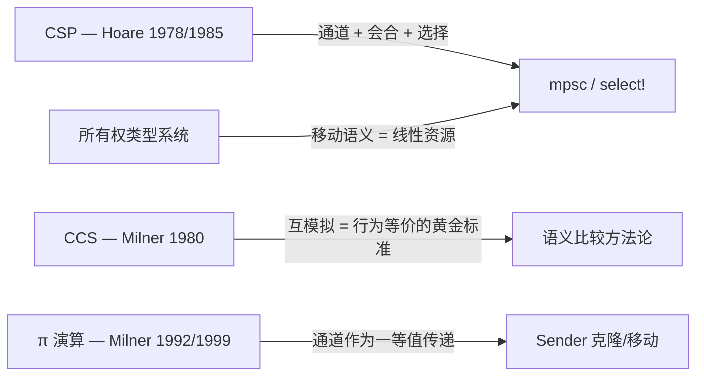
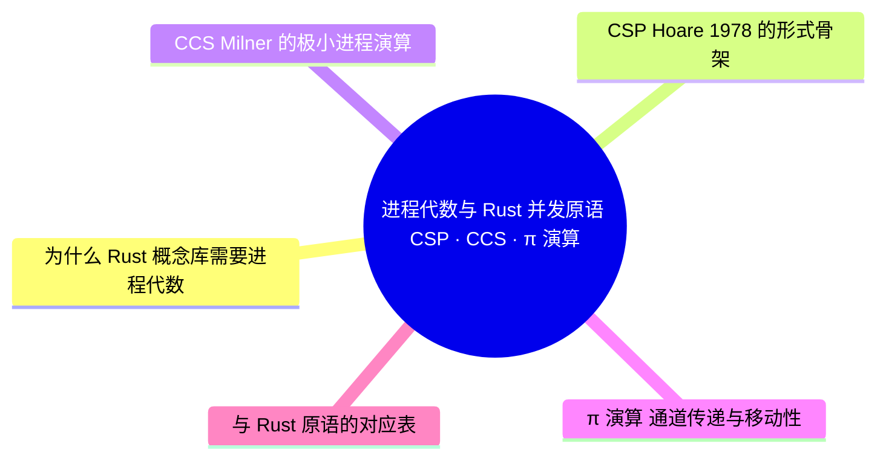

> **本节关键术语**: CSP · CCS · π 演算（π-calculus） · 进程代数（Process Algebra） · 会合（Rendezvous） · 外部选择（External Choice） · 移动性（Mobility） — [完整对照表](../../00_meta/01_terminology/01_terminology_glossary.md)

# 进程代数与 Rust 并发原语：CSP · CCS · π 演算

> **EN**: Process Calculi for Rust: CSP, CCS, and the Pi-Calculus
> **Summary**: Formal skeletons of Hoare's CSP, Milner's CCS and the pi-calculus, and a precise correspondence map to Rust's mpsc channels, select! and thread::spawn — with explicit boundaries on where the correspondence stops short of isomorphism.
> **Rust 版本**: 1.97.0+ (Edition 2024)
> **受众**: [进阶 / 研究者]
> **内容分级**: [专家级]
> **Bloom 层级**: L4-L5
> **权威来源**: 本文件为 `concept/` 权威页：进程代数形式骨架及其与 Rust 原语对应的唯一深度解释。
> **A/S/P 标记**: **S+A** — Structure + Application
> **双维定位**: C×Ana — 分析并发通信的形式根基在 Rust 中的工程投影
> **前置概念**: [L3 并发编程](../../03_advanced/00_concurrency/01_concurrency.md) · [L4 线性逻辑](../01_ownership_logic/01_linear_logic.md) · [L4 Lambda 演算](../00_type_theory/05_lambda_calculus.md)
> **后置概念**: [线性化与一致性（Coherence）谱系](02_linearizability_and_consistency.md) · [Actor 形式语义](03_actor_semantics.md) · [L5 五模型定义矩阵](../../05_comparative/00_paradigms/04_five_models_definition_matrix.md)

---

> **来源**:
> [Hoare, *Communicating Sequential Processes*, CACM 21(8), 1978（DOI；ACM 有反爬，浏览器可访问）](https://doi.org/10.1145/359576.359585) ·
> Hoare, *Communicating Sequential Processes* (Prentice Hall 1985，作者授权电子版 usingcsp.com/cspbook.pdf；2026-07-12 本网络 DNS 未解析，保留备查） ·
> [Milner, *Communicating and Mobile Systems: the π-Calculus*, Cambridge UP 1999（Edinburgh 研究门户）](https://www.research.ed.ac.uk/en/publications/communicating-and-mobile-systems-the-%CF%80-calculus/) ·
> [Milner, *The Polyadic π-Calculus: a Tutorial*, LFCS 1992（Edinburgh LFCS 报告 ECS-LFCS-91-180）](https://www.lfcs.inf.ed.ac.uk/reports/91/ECS-LFCS-91-180/) ·
> [std::sync::mpsc 官方文档](https://doc.rust-lang.org/std/sync/mpsc/) ·
> [crossbeam-channel 文档](https://docs.rs/crossbeam-channel/latest/crossbeam_channel/) ·
> [tokio::select! 教程](https://tokio.rs/tokio/tutorial/select)
>
> ⚠️ **声明**: 本页呈现的是**形式语义骨架与教学级对应**，非经机器验证的同构证明。Rust 标准库从未以任何进程代数为形式语义基础；「对应」一词在本页始终指**结构化类比**，而非双模拟等价。

---

## 📑 目录

- [进程代数与 Rust 并发原语：CSP · CCS · π 演算](#进程代数与-rust-并发原语csp--ccs--π-演算)
  - [📑 目录](#-目录)
  - [一、为什么 Rust 概念库需要进程代数](#一为什么-rust-概念库需要进程代数)
  - [二、CSP：Hoare 1978 的形式骨架](#二csphoare-1978-的形式骨架)
  - [三、CCS：Milner 的极小进程演算](#三ccsmilner-的极小进程演算)
  - [四、π 演算：通道传递与移动性](#四π-演算通道传递与移动性)
  - [五、与 Rust 原语的对应表](#五与-rust-原语的对应表)
  - [六、对应而非同构：四条硬性边界](#六对应而非同构四条硬性边界)
    - [反例：把 CSP 恒等式当成 Rust 法则](#反例把-csp-恒等式当成-rust-法则)
  - [七、工程实例：用 Rust 复述 CSP 组合子](#七工程实例用-rust-复述-csp-组合子)
  - [八、反例与边界](#八反例与边界)
    - [反例：默认 mpsc 不是会合](#反例默认-mpsc-不是会合)
    - [反例：select! 的公平性不是 CSP 选择的对称性](#反例select-的公平性不是-csp-选择的对称性)
  - [九、定理链与相关概念](#九定理链与相关概念)
  - [十、认知路径](#十认知路径)
  - [权威来源索引](#权威来源索引)
  - [🧭 思维导图（Mindmap）](#-思维导图mindmap)

---

## 一、为什么 Rust 概念库需要进程代数

Rust 的并发原语（`thread::spawn`、`mpsc`、`select!`）在文档中都以工程 API 的形式出现，但它们的**设计思想**直接继承自 1970–1990 年代的三个进程代数：



> **过渡**: 理解这三个演算的骨架，就能回答「Rust 的 channel 语义是从哪里来的、又在哪里偏离了理论」这一体系性问题；这正是本页的任务。

进程代数对 Rust 学习者的三个实际价值：

1. **词汇表**：rendezvous、external choice、mobility 等术语精确描述了 `sync_channel`、`select!`、`Sender<T>` 克隆的语义；
2. **比较基准**：当文档说「Rust channel 类似 CSP」时，可以精确追问「类似到什么程度」；
3. **反例雷达**：进程代数中成立的恒等式（如选择的幂等律）在 Rust 中**不成立**的情形，正是工程陷阱的高发区。

---

## 二、CSP：Hoare 1978 的形式骨架

CSP（Communicating Sequential Processes）由 Hoare 于 1978 年提出（论文），1985 年成书。其语法骨架：

```text
进程 P,Q ::= STOP                -- 死锁进程（什么都不做）
           | SKIP                -- 成功终止
           | a -> P              -- 前缀：先发生事件 a，然后行为如 P
           | c!v -> P            -- 输出：在通道 c 上发送值 v
           | c?x -> P(x)         -- 输入：从通道 c 接收值绑定到 x
           | P [] Q              -- 外部选择：环境决定走 P 还是 Q
           | P |~| Q             -- 内部选择：进程内部非确定地选择
           | P || Q              -- 并行组合：共享事件需同步（握手）
           | P \ A               -- 隐藏：把事件集 A 变成内部动作
           | μX. F(X)            -- 递归
```

三条核心语义事实（Hoare 1985, §1–§4）：

1. **同步通信（会合，rendezvous）**：`c!v` 与 `c?x` 必须**同时**就绪才发生；发送方在接收方未就绪时阻塞。CSP 原语层面**没有缓冲区**。
2. **外部选择 `[]`**：`(a -> P) [] (b -> Q)` 表示环境（其他进程）通过先做 `a` 还是先做 `b` 来决定走向；这与「进程自己掷骰子」的内部选择 `|~|` 有本质区别——前者是**可实现的**（`select!`），后者是规约层的非确定性。
3. **并行组合即约束同步**：`P || Q` 中两者字母表内的事件必须握手；「并行」在 CSP 中不是「各跑各的」，而是「在共享事件上强制步调一致」。

> **过渡**: CSP 的通信是「匿名进程 + 命名通道」；Milner 的 CCS 把同一思想压缩到更小的语法核，并贡献了「何时两个进程行为相同」的标准答案。

---

## 三、CCS：Milner 的极小进程演算

CCS（Calculus of Communicating Systems, Milner 1980）的骨架：

```text
P ::= 0                    -- 空进程
    | α.P                  -- 前缀；α ∈ {a, ā, τ}
    | P + Q                -- 选择（求和）
    | P | Q                -- 并行（同名互补动作自动同步）
    | P \ L                -- 限制
    | P[f]                 -- 重标记

其中  a   是输入动作，ā 是对应的输出动作（补动作），
      τ   是不可见内部动作（同步发生后的「消化」步）。
```

CCS 对并发理论的**最大贡献是等价概念**：强互模拟（strong bisimulation）与弱互模拟（observational equivalence，忽略 τ）。「两个系统可互换」从此有了数学定义：

```text
P ~ Q  当且仅当  对 P 能执行的每个动作 α，Q 都能执行 α 并到达
                一个与 P 的后继仍互模拟的状态（反之亦然）。
```

Rust 生态中并没有「Rust 程序的互模拟检验器」，但互模拟是评估一切「X 与 Y 等价」主张（如本库 [L5 执行模型同构性矩阵](../../05_comparative/00_paradigms/02_execution_model_isomorphism.md) 中的「同态/同构/互模拟」三级）的**方法论基准**。

---

## 四、π 演算：通道传递与移动性

π 演算（Milner, Parrow & Walker 1992；专著 Milner 1999）在 CCS 之上只加了**一个**观念，却获得了质的表达力跃迁：**通道名本身可以作为消息在通道上传递**。

```text
P ::= 0 | x(y).P | x̄⟨y⟩.P | P | Q | (νx)P | !P

  x(y).P     -- 在通道 x 上接收一个名字，绑定为 y
  x̄⟨y⟩.P     -- 在通道 x 上发送名字 y
  (νx)P      -- 新建一个私有通道名 x（作用域限定在 P）
  !P         -- 复制：无限多个 P 并行
```

**移动性（mobility）**的含义：系统的**通信拓扑在运行时（Runtime）改变**——A 把私有通道 c 发给 B 之后，B 才获得与 A 私下通信的能力。这使得 π 演算能直接建模「把工作交接给新 actor」「传递 channel 句柄」这类模式。

Rust 中最接近移动性的工程事实：`Sender<T>` 本身是**值**，可以被移动或克隆进其他 channel 的消息里——

```rust
use std::sync::mpsc;

// π 演算的「通道传递」在 Rust 中的影子：
// 把一个通道的发送端作为消息发送给另一个线程
let (main_tx, main_rx) = mpsc::channel::<mpsc::Sender<i32>>();
let (work_tx, work_rx) = mpsc::channel::<i32>();

std::thread::spawn(move || {
    main_tx.send(work_tx).unwrap(); // 通道名作为消息：x̄⟨y⟩
});

let tx = main_rx.recv().unwrap();
tx.send(42).unwrap();               // 接收方获得了新的通信能力
assert_eq!(work_rx.recv().unwrap(), 42);
```

> **过渡**: 三个演算的骨架就绪后，可以给出与 Rust 原语的逐项对应——但对应表的价值一半在「对应」，另一半在「不对应」。

---

## 五、与 Rust 原语的对应表

| 进程代数概念 | Rust 载体 | 对应强度 | 关键偏差 |
|:---|:---|:---:|:---|
| 并行组合 `P ∥ Q` | `thread::spawn` / `tokio::spawn` | 高 | CSP 并行隐含共享事件握手；Rust 线程默认**无共享事件**，同步靠显式原语 |
| 同步通道 `c!v` / `c?x` | `mpsc::sync_channel(0)` | 高 | Rust 默认 `channel()` 是**无界缓冲**，不是会合；需显式 `sync_channel(0)` |
| 外部选择 `P [] Q` | `crossbeam::select!` / `tokio::select!` | 高 | Rust select 混合了「就绪优先级/随机」策略；无 CSP 的对称性保证 |
| 隐藏 `P \ A` / 限制 `(νx)P` | 作用域 + `move` 闭包（Closures） | 中 | Rust 用**词法作用域与所有权（Ownership）**近似 π 演算的名字限制；但 `Sender` 可克隆逃逸 |
| 前缀 `a -> P` | 顺序语句 | 高 | — |
| 递归 `μX.F(X)` / `!P` | `loop` / 循环 spawn | 中 | Rust 无进程常量，递归体现为循环与闭包 |
| 互模拟 `~` | 无 | 无 | Rust 没有程序行为等价的形式定义（见 §6） |
| 值传递（拷贝语义） | **所有权移动** | — | CSP 的值传递是拷贝；Rust 默认 move，对应**线性**通道（见 [L4 线性逻辑](../01_ownership_logic/01_linear_logic.md)） |

两个可直接运行的对应实例：

```rust
use std::sync::mpsc;
use std::thread;

// ① 会合：sync_channel(0) 迫使发送方等待接收方（CSP c!v ≡ c?x 握手）
let (tx, rx) = mpsc::sync_channel::<i32>(0);
thread::spawn(move || {
    tx.send(1).unwrap(); // 阻塞直到 recv 就绪
    println!("握手完成才打印");
});
assert_eq!(rx.recv().unwrap(), 1);
```

```rust,ignore
// ② 外部选择：crossbeam 的 select! ≈ CSP 的 []
use crossbeam_channel::{unbounded, select};

let (tx1, rx1) = unbounded::<i32>();
let (tx2, rx2) = unbounded::<&str>();

select! {
    recv(rx1) -> n => println!("走了 P 分支: {n:?}"),
    recv(rx2) -> s => println!("走了 Q 分支: {s:?}"),
    default => println!("两者均未就绪"),
}
```

---

## 六、对应而非同构：四条硬性边界

本页最重要的结论是**否定性**的：Rust 的并发语义**不是**任何进程代数的实现。四条硬性边界：

1. **无形式等价关系**。进程代数自带互模拟/迹等价；Rust 程序没有可定义互模拟的标注迁移系统（LTS）。「mpsc ≈ CSP 通道」是**设计血统**陈述，不是数学定理。
2. **缓冲与会合**。CSP 原语通道无缓冲；Rust `mpsc::channel()` 是无界缓冲队列（发送永不阻塞，直到内存耗尽）。只有 `sync_channel(0)` 才恢复会合语义——这是「CSP 风格」在 Rust 中**需要主动选择**而非默认的证据。
3. **所有权是类型层现象**。π 演算中名字传递改变的是**运行时的通信拓扑**；Rust 中 `Sender` 移动改变的是**编译期可证明的资源归属**。二者效果相似（都约束了谁能通信），但作用于不同的语义层：一个是动态语义，一个是静态类型。
4. **失败模型**。CSP/CCS/π 演算的经典语义没有「进程 panic」「线程崩溃后 `Receiver` 得到 `Err`」；Rust 的失败（`send` 返回 `SendError`）是**可观测的一等值**，在任何经典演算骨架中都没有对应物。

### 反例：把 CSP 恒等式当成 Rust 法则

CSP 中外部选择幂等：`P [] P = P`。类推到 Rust 是危险的——`select!` 中两个分支**操作同一通道**并不幂等，且分支副作用（如超时分支的 `Drop`）使「选择」在 Rust 中是**有副作用的操作**而非纯规约组合子。

```rust,compile_fail
// 反例：以为 move 之后还能「两边都用」（违反 π 演算名字唯一性的工程回声）
use std::sync::mpsc;
let (tx, _rx) = mpsc::channel::<i32>();
let tx2 = tx;
tx.send(1).unwrap();  // 编译错误：tx 已被移动（E0382）
```

> **过渡**: 边界明确之后，再用 Rust 把 CSP 的三个组合子逐一「复述」为可运行代码，对应关系就落到了实处。

---

## 七、工程实例：用 Rust 复述 CSP 组合子

```rust
use std::sync::mpsc::{self, Sender, Receiver};
use std::thread;

// 并行组合 P ∥ Q：两个独立进程，无共享事件
fn parallel() {
    let a = thread::spawn(|| 1 + 1);
    let b = thread::spawn(|| 2 * 2);
    assert_eq!(a.join().unwrap() + b.join().unwrap(), 6);
}

// 通道通信 c!v ∥ c?x，带所有权移动（线性通道）
fn handshake() {
    let (tx, rx): (Sender<Vec<i32>>, Receiver<Vec<i32>>) = mpsc::channel();
    thread::spawn(move || {
        let data = vec![1, 2, 3];
        tx.send(data).unwrap();
        // data 此后不可用：移动语义 ≈ 线性逻辑中的资源消耗
    });
    assert_eq!(rx.recv().unwrap(), vec![1, 2, 3]);
}

// 管道：P = c?x -> (x+1) -> d!(x) -> P 的 Rust 形态
fn pipeline() {
    let (tx_in, rx_in) = mpsc::channel::<i32>();
    let (tx_out, rx_out) = mpsc::channel::<i32>();
    thread::spawn(move || {
        while let Ok(x) = rx_in.recv() {
            tx_out.send(x + 1).unwrap();
        }
    });
    tx_in.send(41).unwrap();
    assert_eq!(rx_out.recv().unwrap(), 42);
}

fn main() {
    parallel();
    handshake();
    pipeline();
}
```

三个函数分别对应 CSP 的 `∥`、握手通信与递归管道进程；注意所有同步都是**显式**的——这正是 CSP「进程默认独立、通信必须握手」思想在 Rust 中的投影。

---

## 八、反例与边界

本节用两个反例标定过程演算类比 Rust 并发时的边界：默认 mpsc 不是 CSP 会合，`select!` 的公平性也不等同于 CSP 选择算子的对称性。

### 反例：默认 mpsc 不是会合

```rust
use std::sync::mpsc;

let (tx, _rx) = mpsc::channel::<i32>();
for i in 0..1_000_000 {
    tx.send(i).unwrap(); // ✅ 全部成功：无界缓冲，永不阻塞
}
// 若按 CSP 直觉以为「发送即交付」，此处的背压缺失会在生产环境放大为 OOM。
```

修正：需要会合语义时显式使用 `mpsc::sync_channel(0)`；需要背压时使用 `sync_channel(n)`（见 [L3 并发编程 §通道](../../03_advanced/00_concurrency/01_concurrency.md) 与 [L3 谱系页 §4.3 背压](../../03_advanced/00_concurrency/08_parallel_distributed_pattern_spectrum.md)）。

### 反例：select! 的公平性不是 CSP 选择的对称性

CSP 的 `[]` 不承诺任何分支优先级；`tokio::select!` 默认**随机**选择就绪分支，而 `crossbeam::select!` 在 `default` 存在时偏向非阻塞路径。把「理论上的对称选择」当成「实现上的公平调度」会写出饥饿的服务循环。

---

## 九、定理链与相关概念

| 编号 | 命题 | 前提 | 结论 |
|:---|:---|:---|:---|
| T-PC-01 | `sync_channel(0)` 复现会合语义 | 发送与接收的 API 契约 | 发送完成 ⟹ 接收方已取走该值 |
| T-PC-02 | mpsc 移动语义排除 send 后复用 | 所有权唯一性 | `send(v)` 后使用 `v` ⟹ 编译期拒绝（E0382） |
| T-PC-03 | 对应非等价 | Rust 无 LTS/互模拟定义 | 「Rust channel 同构于 CSP」 ⟹ 不可陈述为定理，只能是设计血统陈述 |
| T-PC-04 | 无界缓冲破坏背压 | `channel()` 语义 | 快生产者 ⟹ 内存无界增长风险 |

**相关概念**:

- [L4 线性化与一致性谱系](02_linearizability_and_consistency.md) —— 并发对象正确性的另一套形式化（共享内存语境）
- [L4 Actor 形式语义](03_actor_semantics.md) —— 命名进程 + 邮箱的对偶模型
- [L4 线性逻辑](../01_ownership_logic/01_linear_logic.md) —— 所有权移动的逻辑根基
- [L5 执行模型同构性矩阵](../../05_comparative/00_paradigms/02_execution_model_isomorphism.md) —— 同态/同构/互模拟三级的工程对比（CSP 对比节已摘要化并链接回本页）
- [L5 五模型定义矩阵](../../05_comparative/00_paradigms/04_five_models_definition_matrix.md) —— 五模型一页式导航
- [L3 并行与分布式模式谱系](../../03_advanced/00_concurrency/08_parallel_distributed_pattern_spectrum.md) —— Actor/CSP/背压的工程谱系

---

## 十、认知路径

> **认知路径**: CSP/CCS/π 演算骨架 ⟹ 命名通道与移动性 ⟹ Rust 原语对应表 ⟹ 四条不同构边界 ⟹ 工程复述与反例。

学习顺序建议：先读 [L3 并发编程](../../03_advanced/00_concurrency/01_concurrency.md) 掌握 `mpsc`/`select!` 的工程用法，再回到本页理解其理论血统；随后进入 [Actor 形式语义](03_actor_semantics.md) 看对偶模型，最后在 [L5 五模型定义矩阵](../../05_comparative/00_paradigms/04_five_models_definition_matrix.md) 中把五种执行模型放到同一张地图。

**核心推理链**: 形式骨架 ⟹ 对应表 ⟹ 边界 ⟹ 反例——其中「边界」一节是本页区别于一切「Rust channel 就是 CSP」式科普的关键。

---

## 权威来源索引

- Hoare, C. A. R. *Communicating Sequential Processes*. Communications of the ACM 21(8), 1978, 666–677. [DOI](https://doi.org/10.1145/359576.359585)（ACM 反爬，浏览器可访问）
- Hoare, C. A. R. *Communicating Sequential Processes*. Prentice Hall, 1985（作者授权电子版：usingcsp.com/cspbook.pdf；2026-07-12 本网络 DNS 未解析，保留备查）
- Milner, R. *A Calculus of Communicating Systems*. LNCS 92, Springer, 1980. [DOI](https://doi.org/10.1007/3-540-10235-3) · [Springer](https://link.springer.com/book/10.1007/3-540-10235-3)
- Milner, R., Parrow, J., Walker, D. *A Calculus of Mobile Processes*. Information and Computation 100(1), 1992. [DOI](https://doi.org/10.1016/0890-5401(92)90008-4)
- Milner, R. *The Polyadic π-Calculus: a Tutorial*. LFCS 1992 / ECS-LFCS-91-180. [Edinburgh LFCS 报告页](https://www.lfcs.inf.ed.ac.uk/reports/91/ECS-LFCS-91-180/)
- Milner, R. *Communicating and Mobile Systems: the π-Calculus*. Cambridge University Press, 1999. [Edinburgh 研究门户](https://www.research.ed.ac.uk/en/publications/communicating-and-mobile-systems-the-%CF%80-calculus/)
- [std::sync::mpsc — Rust 标准库文档](https://doc.rust-lang.org/std/sync/mpsc/) · [crossbeam-channel](https://docs.rs/crossbeam-channel/latest/crossbeam_channel/) · [tokio::select!](https://tokio.rs/tokio/tutorial/select)

> **相关文件**: [同层：线性化与一致性](02_linearizability_and_consistency.md) · [同层：Actor 语义](03_actor_semantics.md) · [L5 对比视角](../../05_comparative/00_paradigms/02_execution_model_isomorphism.md) · [L3 工程谱系](../../03_advanced/00_concurrency/08_parallel_distributed_pattern_spectrum.md)
>
> **文档版本**: 1.0 ｜ **最后更新**: 2026-07-12 ｜ **状态**: ✅ W5-1 新建（Rust 1.97 对齐）

## 🧭 思维导图（Mindmap）



> **认知功能**: 本 mindmap 从本页章节结构提炼，一级分支对应核心主题，叶子节点为关键子概念，可作为本页的快速导航与复习索引。
