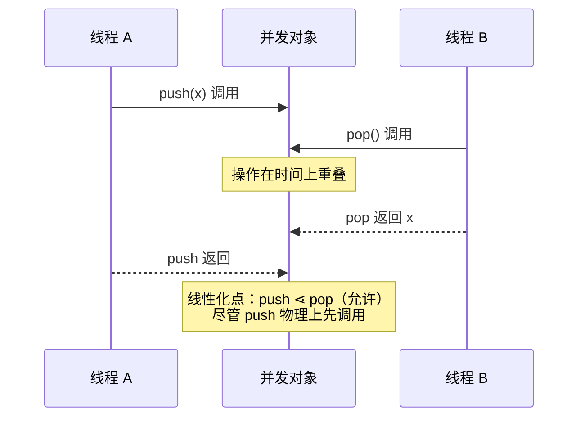
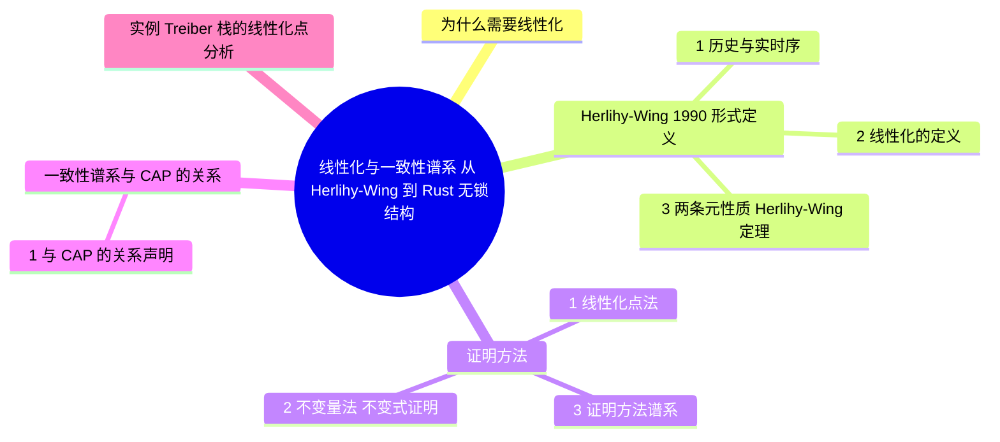

> **本节关键术语**: 线性化（Linearizability） · 历史（History） · 线性化点（Linearization Point） · 顺序一致性（Sequential Consistency） · 因果一致性（Causal Consistency） · 最终一致性（Eventual Consistency） · CAP 定理 — [完整对照表](../../00_meta/01_terminology/01_terminology_glossary.md)

# 线性化与一致性谱系：从 Herlihy-Wing 到 Rust 无锁结构

> **EN**: Linearizability and the Consistency Spectrum
> **Summary**: Herlihy-Wing's formal definition of linearizability (histories, legal sequential reorderings, real-time order preservation), proof techniques (linearization points, invariants), the spectrum from sequential to eventual consistency with its CAP relation, and a linearization-point analysis of a Treiber stack in Rust.
> **Rust 版本**: 1.97.0+ (Edition 2024)
> **受众**: [进阶 / 研究者]
> **内容分级**: [专家级]
> **Bloom 层级**: L4-L5
> **权威来源**: 本文件为 `concept/` 权威页：线性化形式定义与一致性谱系的唯一深度解释；[L3 谱系页](../../03_advanced/00_concurrency/07_parallel_distributed_pattern_spectrum.md) §6.2 仅保留导航式概览并链接回本页。
> **A/S/P 标记**: **S+A** — Structure + Application
> **双维定位**: C×Ana — 分析并发对象正确性条件及其证明方法
> **前置概念**: [L3 并发编程](../../03_advanced/00_concurrency/01_concurrency.md) · [L3 无锁结构谱系](../../03_advanced/00_concurrency/07_parallel_distributed_pattern_spectrum.md) · [L4 Hoare 逻辑](../03_operational_semantics/02_hoare_logic.md)
> **后置概念**: [进程代数与 Rust](01_process_calculi_for_rust.md) · [L6 CRDT 谱系](../../06_ecosystem/06_data_and_distributed/08_crdt_type_zoo.md) · [L6 因果序与向量时钟](../../06_ecosystem/06_data_and_distributed/09_causal_ordering_vector_clocks.md)

---

> **来源**:
> [Herlihy & Wing, *Linearizability: A Correctness Condition for Concurrent Objects*, ACM TOPLAS 12(3), 1990（DOI）](https://doi.org/10.1145/78969.78972) ·
> [Herlihy 作者主页（Brown）](https://www.cs.brown.edu/~mph/) ·
> [Herlihy & Shavit, *The Art of Multiprocessor Programming*, Morgan Kaufmann（出版社页）](https://store.elsevier.com/the-art-of-multiprocessor-programming-revised-reprint/herlihy/978-0-12-415950-1.html) ·
> [Lamport, *How to Make a Multiprocessor Computer...*, IEEE TC 1979（DOI）](https://doi.org/10.1109/TC.1979.1675439) ·
> [Brewer, *CAP Twelve Years Later*, IEEE Computer 2012（DOI）](https://doi.org/10.1109/MC.2012.37)

---

## 📑 目录

- [线性化与一致性谱系：从 Herlihy-Wing 到 Rust 无锁结构](#线性化与一致性谱系从-herlihy-wing-到-rust-无锁结构)
  - [📑 目录](#-目录)
  - [一、为什么需要线性化](#一为什么需要线性化)
  - [二、Herlihy-Wing 1990 形式定义](#二herlihy-wing-1990-形式定义)
    - [2.1 历史与实时序](#21-历史与实时序)
    - [2.2 线性化的定义](#22-线性化的定义)
    - [2.3 两条元性质（Herlihy-Wing 定理）](#23-两条元性质herlihy-wing-定理)
  - [三、证明方法](#三证明方法)
    - [3.1 线性化点法](#31-线性化点法)
    - [3.2 不变量法（不变式证明）](#32-不变量法不变式证明)
    - [3.3 证明方法谱系](#33-证明方法谱系)
  - [四、一致性谱系与 CAP 的关系](#四一致性谱系与-cap-的关系)
    - [4.1 与 CAP 的关系声明](#41-与-cap-的关系声明)
  - [五、实例：Treiber 栈的线性化点分析](#五实例treiber-栈的线性化点分析)
  - [六、反例与边界](#六反例与边界)
    - [反例：check-then-act 不是线性化的](#反例check-then-act-不是线性化的)
    - [反例：把线性化误当成「最快响应」](#反例把线性化误当成最快响应)
    - [边界：ABA 与内存回收](#边界aba-与内存回收)
  - [七、定理链与相关概念](#七定理链与相关概念)
  - [八、认知路径](#八认知路径)
  - [权威来源索引](#权威来源索引)
  - [🧭 思维导图（Mindmap）](#-思维导图mindmap)

---

## 一、为什么需要线性化

并发数据结构（栈、队列、计数器）的操作在时间上**重叠**：线程 A 的 `push` 尚未返回，线程 B 的 `pop` 已经开始。此时「数据结构处于什么状态」不再良定义——除非有一个正确性条件规定**哪些交错是可接受的**。

Herlihy 与 Wing 在 1990 年给出的答案是**线性化（linearizability）**：尽管操作在物理时间上重叠，但每个操作都可以被认为在其调用与返回之间的**某个瞬间点**（线性化点）**原子地生效**；按这些点排序后得到的顺序历史，必须满足该数据结构的顺序规约。



> **过渡**: 直觉就绪后，下一节给出 Herlihy-Wing 定义的完整形式骨架——它是整个无锁编程领域的事实正确性标准。

---

## 二、Herlihy-Wing 1990 形式定义

本节建立线性化的形式定义：2.1 引入历史与实时序，2.2 给出线性化的判定定义，2.3 陈述 Herlihy-Wing 的两条元性质（局部性与非阻塞性）。

### 2.1 历史与实时序

```text
历史 H        ::= 调用/返回事件序列；每个事件形如
                  ⟨A op(args)⟩        -- 线程 A 调用操作 op
                  ⟨A ok(result)⟩      -- 线程 A 的操作返回 result

子历史 H|A    ::= H 中属于线程 A 的事件

complete(H)   ::= 删掉 H 中所有「有调用无返回」的未完成操作

实时序 <_H    ::= 对 H 中两个完整操作 o1, o2：
                  o1 <_H o2  当且仅当  o1 的返回事件在 o2 的调用事件之前
                  （物理时间上严格先后，不重叠）

顺序历史       ::= 每个调用后紧跟其返回（无交错）的历史
合法（legal）  ::= 顺序历史 S 满足对象的顺序规约
                  （如栈：pop 返回最后 push 且未被 pop 的值）
```

### 2.2 线性化的定义

```text
历史 H 是线性化的，当且仅当存在顺序历史 S，使得：

  (L1) S 是 complete(H) 的一个排列（保序重排允许重排重叠操作）；
  (L2) S 是合法的（满足顺序规约）；
  (L3) S 保持实时序：若 o1 <_H o2，则 o1 在 S 中排在 o2 之前。
```

三条性质的语义解读：

- **(L1)** 允许「编造」一个顺序解释，但只能用**实际发生过**的完整操作；
- **(L2)** 编造的顺序必须说得通——结果与某个串行执行一致；
- **(L3)** 这是线性化**强于**顺序一致性的关键：不重叠的操作**不许**重排。直觉是「墙上时钟」必须被尊重。

### 2.3 两条元性质（Herlihy-Wing 定理）

```text
局部性（Locality）:
  H 线性化  ⟺  对每个对象 x，H|x 线性化。
  ⟹ 可以逐对象证明正确性，再组合成系统级结论。

非阻塞性（Non-blocking）:
  对未完成操作，总存在一种完成方式使历史仍线性化。
  ⟹ 线性化是「纯安全性质」，不隐含任何活性（liveness）假设；
    因此它兼容无锁/无等待等任意进度保证。
```

> **过渡**: 定义告诉我们「什么算对」，下一节回答「怎么证明对」——线性化点法是工程上最通行的证明技术。

---

## 三、证明方法

本节介绍两类证明技术：3.1 线性化点法与 3.2 不变量法，3.3 给出证明方法的谱系对比与适用场景。

### 3.1 线性化点法

对对象的每个操作，在其实现代码中指定一个**线性化点**——操作「逻辑上生效」的指令位置，然后证明：

```text
对任意历史 H：
  (a) 每个完整操作的效果，与其在线性化点处原子执行的效果相同；
  (b) 按线性化点的物理顺序排列操作，得到的顺序历史合法；
  (c) 线性化点位于该操作的调用与返回之间 ⟹ 实时序被保持。
```

若 (a)(b)(c) 成立 ⟹ 对象线性化。困难在于有些操作**没有固定线性化点**（线性化点可能位于**其他线程**的代码中，如 `pop` 发现栈空时，其生效点是某次状态的「读取」），此时需要：

### 3.2 不变量法（不变式证明）

1. 定义对象状态的抽象映射 `Abs: 具体状态 → 抽象状态`（如链表节点序列 → 栈的抽象序列）；
2. 证明每个指令步要么不改变 `Abs`，要么把 `Abs` 按顺序规约推进恰好一步；
3. 用可达状态上的不变量（如「head 永远指向链表第一个节点」）约束干扰。

### 3.3 证明方法谱系

| 方法 | 适用 | 代表工具/文献 |
|:---|:---|:---|
| 固定线性化点 | CAS 一次生效的结构（Treiber 栈、Michael-Scott 队列 push） | *Art of Multiprocessor Programming* §3 |
| 帮助机制 + 模拟 | 无固定点的操作（如 `pop` 空栈） | Herlihy-Wing 1990 §4 |
| 前向/后向模拟 | 复杂对象（队列、快照） | Lynch & Vaandrager 模拟方法 |
| 机器验证 | 关键路径库 | Iris/Coq、[Verus](https://github.com/verus-lang/verus)、[Kani](https://model-checking.github.io/kani/) |

---

## 四、一致性谱系与 CAP 的关系

> **分工声明**: 本页是谱系的**形式定义权威页**；[L3 谱系页 §6.2](../../03_advanced/00_concurrency/07_parallel_distributed_pattern_spectrum.md) 保留导航式概览（强度排序图 + Rust 生态映射），不重复本页定义。

```text
一致性强度谱系（从强到弱；⇒ 表示「强于」，即满足前者 ⟹ 满足后者）：

线性化 Linearizability（Herlihy-Wing 1990）
  ⇒ 顺序一致性 Sequential Consistency（Lamport 1979）
      差异：SC 允许重排不重叠操作，只需保持每线程的程序序；
            线性化额外要求保持实时序（L3）。
  ⇒ 因果一致性 Causal Consistency
      只保持「因果相关」操作的顺序（形式化见向量时钟，
      见 [L6 因果序页](../../06_ecosystem/06_data_and_distributed/09_causal_ordering_vector_clocks.md)）；
      并发（无因果）操作的顺序各副本可不一致。
  ⇒ 会话一致性 Session Guarantees
      单客户端视角内读写单调（read-your-writes 等四条）。
  ⇒ 最终一致性 Eventual Consistency
      若无新写入，所有副本最终收敛到同一状态；
      CRDT 是其**可证明收敛**的强化形式（见 [L6 CRDT 谱系](../../06_ecosystem/06_data_and_distributed/08_crdt_type_zoo.md)）。
```

### 4.1 与 CAP 的关系声明

CAP 定理（Brewer 2000 猜想，Gilbert-Lynch 2002 证明）断言：网络分区（P）发生时，系统只能在一致性（C）与可用性（A）中二选一。与谱系的精确关系：

- CAP 中的「C」**就是线性化**（Gilbert-Lynch 原文用 atomic/linearizable 定义）；
- 谱系中**弱于线性化**的模型（因果、最终一致）是「在 P 下保 A」的常见工程折中；
- Brewer 2012 的修正：CAP 不是三选二开关，而是分区期间 C 与 A 的**连续折中空间**——谱系正是这个空间的坐标系。

| 谱系位置 | CAP 定位 | Rust 生态实例 |
|:---|:---|:---|
| 线性化 | CP（分区时牺牲 A） | `Atomic*` + SeqCst（单机）、Raft（多机，[L6 共识](../../06_ecosystem/06_data_and_distributed/06_distributed_consensus.md)） |
| 顺序一致 | CP（更弱的一致性） | `Mutex`/`RwLock` 保护的共享状态 |
| 因果一致 | 折中 | 向量时钟版本化存储 |
| 最终一致 | AP | Gossip、CRDT |

> **过渡**: 抽象定义落地到代码最能检验理解——下一节对 Rust 中最经典的无锁结构做完整的线性化点分析。

---

## 五、实例：Treiber 栈的线性化点分析

Treiber 栈（Treiber 1986）是无锁栈的标准答案；以下实现为教学骨架（省略 ABA 防护，工程版见 `crossbeam-epoch`）：

```rust,ignore
use std::sync::atomic::{AtomicPtr, Ordering};

struct Node<T> { value: T, next: *mut Node<T> }

pub struct Stack<T> { head: AtomicPtr<Node<T>> }

impl<T> Stack<T> {
    pub fn push(&self, value: T) {
        let new = Box::into_raw(Box::new(Node { value, next: std::ptr::null_mut() }));
        loop {
            let head = self.head.load(Ordering::Acquire);
            unsafe { (*new).next = head; }
            // ▼ 线性化点：CAS 成功的瞬间，节点对全系统可见
            if self.head.compare_exchange(head, new, Ordering::Release, Ordering::Relaxed).is_ok() {
                return;
            }
        }
    }

    pub fn pop(&self) -> Option<T> {
        loop {
            let head = self.head.load(Ordering::Acquire);
            if head.is_null() {
                // ▼ 线性化点：读到 null 的瞬间（栈「逻辑上为空」的时刻）
                return None;
            }
            let next = unsafe { (*head).next };
            // ▼ 线性化点：CAS 成功的瞬间
            if self.head.compare_exchange(head, next, Ordering::Release, Ordering::Relaxed).is_ok() {
                return Some(unsafe { Box::from_raw(head).value });
            }
        }
    }
}
```

**线性化点论证（按 §3.1 的 (a)(b)(c)）**：

```text
(a) 效果一致性：
    push 成功 ⟺ 其 CAS 成功；CAS 前后 head 的变化恰好是抽象栈的 push。
    pop 返回 v  ⟺ 其 CAS 成功且摘下了头节点，抽象栈 pop 出 v。
    pop 返回 None ⟺ 读取 head 的瞬间为 null，该时刻抽象栈为空。
(b) 顺序历史合法：
    按各操作 CAS/读取 null 的物理时刻排序；每次 CAS 由原子性保证
    恰好修改 head 一次 ⟹ 抽象栈的演化是合法的栈操作序列。
(c) 实时序保持：
    每个线性化点都位于该操作的调用与返回之间（代码上显然），
    ⟹ 不重叠的操作在顺序历史中保持物理先后。
```

⟹ Treiber 栈（教学骨架）对 push/pop 线性化。

**内存序的角色**：`Acquire` 读保证看到 `Release` CAS 之前初始化的 `Node` 字段（happens-before，见 [L3 并发编程 §3](../../03_advanced/00_concurrency/01_concurrency.md)）；线性化是**对象级**正确性，内存序是保证它的**指令级**机制——两层不可混淆。

---

## 六、反例与边界

本节用反例澄清常见误解（check-then-act 不是线性化的、线性化不等于最快响应），并讨论 ABA 与内存回收的边界。

### 反例：check-then-act 不是线性化的

```rust,ignore
// ❌ 反例：先读后写的「伪原子」操作
fn pop_wrong(&self) -> Option<T> {
    let head = self.head.load(Ordering::Acquire); // 时刻 t1
    if head.is_null() { return None; }
    let next = unsafe { (*head).next };
    self.head.store(next, Ordering::Release);     // 时刻 t2
    // t1 与 t2 之间其他线程可能已 pop 走 head：
    // ① 读到悬垂的 next（UAF）；② 找不到任何时刻可以宣称「操作原子生效」
    Some(unsafe { Box::from_raw(head).value })
}
```

该历史**不可线性化**：存在两个线程并发 `pop_wrong` 返回同一个元素的执行，任何顺序解释都会让栈 pop 出同一个值两次 ⟹ 违反 (L2) 合法性。

### 反例：把线性化误当成「最快响应」

线性化是**安全性质**（历史可解释），不是**活性或性能**保证：一个所有操作都串行排队、慢如蜗牛的实现完全可以是线性化的。性能是独立的工程维度。

### 边界：ABA 与内存回收

教学骨架省略了 ABA 问题（head 被 pop 又 push 回同一地址时 CAS 误判）与安全内存回收（pop 后 `Box::from_raw` 时他线程仍可能持有该指针）。工程实现必须用 `crossbeam-epoch` 的世代回收或 tagged pointer——这属于实现细节，不改变线性化点的位置，但决定代码的**内存安全性**。

---

## 七、定理链与相关概念

| 编号 | 命题 | 前提 | 结论 |
|:---|:---|:---|:---|
| T-LC-01 | 线性化定义 | 存在满足 (L1)(L2)(L3) 的顺序历史 S | 历史 H 线性化 ⟹ 每个操作可视作在调用-返回间某点原子生效 |
| T-LC-02 | 线性化 ⟹ 顺序一致性 | (L3) 保持实时序 ⟹ 保持程序序 | 线性化对象自动满足 Lamport 1979 的 SC |
| T-LC-03 | 局部性 | 逐对象历史投影 | 每个 H\|x 线性化 ⟹ 整体 H 线性化（可组合证明） |
| T-LC-04 | CAP 中的 C = 线性化 | Gilbert-Lynch 2002 的形式化 | 分区下保持线性化 ⟹ 牺牲可用性（CP） |
| T-LC-05 | Treiber 栈线性化 | §5 的 (a)(b)(c) 论证 | push/pop 的 CAS/读 null 点为合法线性化点 ⟹ 实现正确 |

**相关概念**:

- [L4 进程代数与 Rust](01_process_calculi_for_rust.md) —— 消息传递语境的形式骨架（本页是共享内存语境）
- [L4 Actor 形式语义](03_actor_semantics.md) —— 无共享状态语境的正确性条件
- [L3 并行与分布式模式谱系 §6.2](../../03_advanced/00_concurrency/07_parallel_distributed_pattern_spectrum.md) —— 一致性谱系的导航式概览（定义以本页为准）
- [L6 CRDT 谱系](../../06_ecosystem/06_data_and_distributed/08_crdt_type_zoo.md) —— 最终一致性的可证明收敛形式
- [L6 因果序与向量时钟](../../06_ecosystem/06_data_and_distributed/09_causal_ordering_vector_clocks.md) —— 因果一致性的形式化机制
- [L6 分布式共识](../../06_ecosystem/06_data_and_distributed/06_distributed_consensus.md) —— Raft 如何在多机实现线性化语义

---

## 八、认知路径

> **认知路径**: 历史与实时序 ⟹ (L1)(L2)(L3) 三条件 ⟹ 线性化点法 ⟹ 谱系与 CAP ⟹ Treiber 实例 ⟹ 反例。

学习顺序建议：先掌握 [L3 并发编程](../../03_advanced/00_concurrency/01_concurrency.md) 的原子操作与内存序（happens-before 是线性化的基础设施），再读本页定义；§5 的实例建议逐行对照 §3.1 的三条论证；
最后经 [L6 CRDT 谱系](../../06_ecosystem/06_data_and_distributed/08_crdt_type_zoo.md) 看谱系最弱端如何靠数学结构（半格）重新获得可证明的收敛。

**核心推理链**: 顺序规约 ⟹ 线性化定义 ⟹ 线性化点 ⟹ 实现正确性——这条链是工业界审查一切无锁代码的默认推理模板。

---

## 权威来源索引

- Herlihy, M. & Wing, J. *Linearizability: A Correctness Condition for Concurrent Objects*. ACM TOPLAS 12(3), 1990, 463–492. [DOI](https://doi.org/10.1145/78969.78972)（ACM 反爬，浏览器可访问） · [ACM DL](https://dl.acm.org/doi/10.1145/78969.78972) · [作者主页](https://www.cs.brown.edu/~mph/)
- Herlihy, M. & Shavit, N. *The Art of Multiprocessor Programming*, Revised Reprint. Morgan Kaufmann, 2012. [出版社页](https://store.elsevier.com/the-art-of-multiprocessor-programming-revised-reprint/herlihy/978-0-12-415950-1.html)
- Lamport, L. *How to Make a Multiprocessor Computer That Correctly Executes Multiprocess Programs*. IEEE Transactions on Computers, 1979. [DOI](https://doi.org/10.1109/TC.1979.1675439)
- Gilbert, S. & Lynch, N. *Brewer's Conjecture and the Feasibility of Consistent, Available, Partition-Tolerant Web Services*. ACM SIGACT News 33(2), 2002. [DOI](https://doi.org/10.1145/564585.564601)（ACM 反爬） · [作者镜像 PDF（NUS）](https://www.comp.nus.edu.sg/~gilbert/pubs/BrewersConjecture-SigAct.pdf)
- Brewer, E. *CAP Twelve Years Later: How the "Rules" Have Changed*. IEEE Computer 45(2), 2012. [DOI](https://doi.org/10.1109/MC.2012.37)
- Treiber, R. K. *Systems Programming: Coping with Parallelism*. IBM RJ 5118, 1986.
- [std::sync::atomic — Rust 标准库文档](https://doc.rust-lang.org/std/sync/atomic/)（Treiber 实例的 `AtomicPtr`/`Ordering` 契约）

> **相关文件**: [同层：进程代数](01_process_calculi_for_rust.md) · [同层：Actor 语义](03_actor_semantics.md) · [L3 谱系概览](../../03_advanced/00_concurrency/07_parallel_distributed_pattern_spectrum.md) · [L6 CRDT](../../06_ecosystem/06_data_and_distributed/08_crdt_type_zoo.md)
>
> **文档版本**: 1.0 ｜ **最后更新**: 2026-07-12 ｜ **状态**: ✅ W5-2 新建（Rust 1.97 对齐）

## 🧭 思维导图（Mindmap）



> **认知功能**: 本 mindmap 从本页章节结构提炼，一级分支对应核心主题，叶子节点为关键子概念，可作为本页的快速导航与复习索引。
