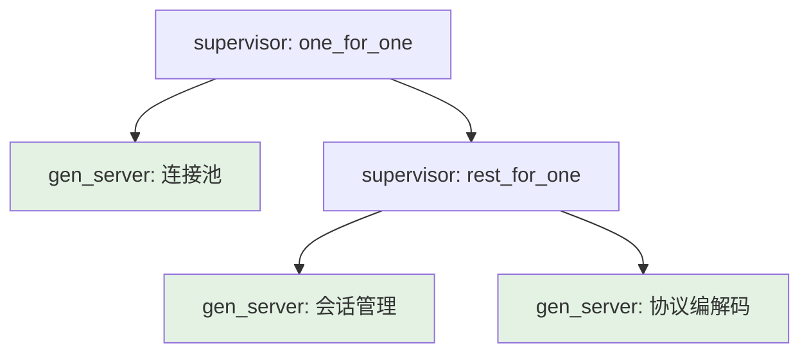
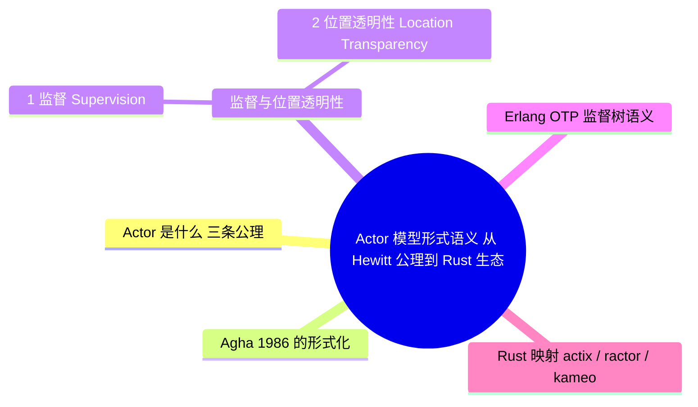

> **本节关键术语**: Actor 模型 · 邮箱（Mailbox） · 行为替换（Become） · 监督树（Supervision Tree） · 位置透明性（Location Transparency） · 任其崩溃（Let It Crash） — [完整对照表](../../00_meta/01_terminology/01_terminology_glossary.md)

# Actor 模型形式语义：从 Hewitt 公理到 Rust 生态

> **EN**: Actor Semantics: From Hewitt's Axioms to the Rust Ecosystem
> **Summary**: The formal semantics of the Actor model (Hewitt 1973, Agha 1986): actors as address + mailbox + behavior, the three axioms (send/create/become), supervision and location transparency, Erlang OTP supervision-tree semantics, the mapping to Rust's actix/ractor/kameo, and the boundary against channel models.
> **Rust 版本**: 1.97.0+ (Edition 2024)
> **受众**: [进阶 / 研究者]
> **内容分级**: [专家级]
> **Bloom 层级**: L4-L5
> **权威来源**: 本文件为 `concept/` 权威页：Actor 模型形式语义及其 Rust 映射的唯一深度解释。
> **A/S/P 标记**: **S+A** — Structure + Application
> **双维定位**: C×Ana — 分析命名进程 + 邮箱模型的形式根基与工程投影
> **前置概念**: [L3 并发编程](../../03_advanced/00_concurrency/01_concurrency.md) · [L4 进程代数与 Rust](01_process_calculi_for_rust.md) · [L3 谱系页 §4.1](../../03_advanced/00_concurrency/07_parallel_distributed_pattern_spectrum.md)
> **后置概念**: [线性化与一致性谱系](02_linearizability_and_consistency.md) · [L6 分布式共识](../../06_ecosystem/06_data_and_distributed/06_distributed_consensus.md) · [L5 五模型定义矩阵](../../05_comparative/00_paradigms/04_five_models_definition_matrix.md)

---

> **来源**:
> [Hewitt, Bishop & Steiger, *A Universal Modular ACTOR Formalism for Artificial Intelligence*, IJCAI 1973](https://www.ijcai.org/Proceedings/73/Papers/027B.pdf) ·
> [Hewitt, *Actor Model of Computation*, arXiv:1008.1459](https://arxiv.org/abs/1008.1459) ·
> Agha, G. *Actors: A Model of Concurrent Computation in Distributed Systems*, MIT Press 1986 ·
> [Erlang/OTP Design Principles — Supervision Trees](https://www.erlang.org/doc/system/design_principles.html#supervision-trees) ·
> [actix Actor 文档](https://actix.rs/docs/actix/actor) ·
> [ractor 文档](https://docs.rs/ractor/latest/ractor/) ·
> [kameo 文档](https://docs.rs/kameo/latest/kameo/)

---

## 📑 目录

- [Actor 模型形式语义：从 Hewitt 公理到 Rust 生态](#actor-模型形式语义从-hewitt-公理到-rust-生态)
  - [📑 目录](#-目录)
  - [一、Actor 是什么：三条公理](#一actor-是什么三条公理)
  - [二、Agha 1986 的形式化](#二agha-1986-的形式化)
  - [三、监督与位置透明性](#三监督与位置透明性)
    - [3.1 监督（Supervision）](#31-监督supervision)
    - [3.2 位置透明性（Location Transparency）](#32-位置透明性location-transparency)
  - [四、Erlang OTP 监督树语义](#四erlang-otp-监督树语义)
  - [五、Rust 映射：actix / ractor / kameo](#五rust-映射actix--ractor--kameo)
  - [六、与 channel 模型的边界](#六与-channel-模型的边界)
  - [七、反例与边界](#七反例与边界)
    - [反例：在 actor 间共享可变状态](#反例在-actor-间共享可变状态)
    - [反例：假设单邮箱跨发送者有序](#反例假设单邮箱跨发送者有序)
    - [边界：监督不能恢复「损坏的不变量」](#边界监督不能恢复损坏的不变量)
  - [八、定理链与相关概念](#八定理链与相关概念)
  - [九、认知路径](#九认知路径)
  - [权威来源索引](#权威来源索引)
  - [🧭 思维导图（Mindmap）](#-思维导图mindmap)

---

## 一、Actor 是什么：三条公理

Actor 模型（Hewitt, Bishop & Steiger, IJCAI 1973）把计算的基本单位定义为 **actor**——一个拥有三要素的自治实体：

```text
actor ::= ⟨地址 a, 邮箱 M, 行为 b⟩

  地址 a   : 全局唯一标识，是其他 actor 向它发消息的唯一途径
  邮箱 M   : 到达消息的（无序）缓冲队列
  行为 b   : 一个函数，处理一条消息并决定下一步行为
```

当 actor 处理一条消息时，它**只能**做三件事（Hewitt 1973 的三条公理）：

```text
公理 1（send）:   向有限个已知地址发送消息——异步、非阻塞、不保证到达时刻
公理 2（create）: 创建有限个新 actor（获得它们的新地址）
公理 3（become）: 指定自己处理下一条消息时的新行为（替换当前行为 b'）
```

三条公理的推论：**actor 之间没有共享状态**。一切信息交换都必须经消息；actor 的内部状态只能被自己读取和修改 ⟹ 数据竞争在模型层面**不可表达**。

> **过渡**: 三条公理给出的是「计算模型」，Agha 在 1986 年的专著中把它收紧为可推理的形式系统——配置、转换与公平性。

---

## 二、Agha 1986 的形式化

Agha, *Actors: A Model of Concurrent Computation in Distributed Systems*（MIT Press 1986）给出的操作语义骨架：

```text
配置 C ::= ⟨α | μ⟩
  α : 地址 → actor 状态（行为 + 局部状态）   -- 全体 actor 的映射
  μ : 多重集（multiset）of ⟨目标地址, 消息⟩    -- 在途消息池

转换规则（每条规则消耗一条在途消息）：

  [receive]  ⟨α[a ↦ (b, s)] | μ ⊎ ⟨a, m⟩⟩
        ──►  ⟨α[a ↦ (b', s')] ∪ 新建 actor | μ ∪ 新消息⟩
             其中 (b', s', 新actor, 新消息) = b(s, m)

关键语义事实：
  ① 消息在途时间任意 ⟹ 模型层面无消息顺序保证（即使同一发送者到同一接收者）
  ② 处理是原子的：一个 actor 一次处理一条消息，处理期间不被打断 ⟹ 邮箱串行化
  ③ 公平性假设：每条已发送的消息最终被处理（活性，而非安全性）
```

两条与工程直接相关的性质：

- **封装性**：`α` 中 actor 状态的任何改变只能由该 actor 自己的行为函数完成 ⟹ 「tell, don't ask」在模型层被强制；
- **地址即能力**：不知道地址就无法发送 ⟹ 地址传递（与 [π 演算的移动性](01_process_calculi_for_rust.md) 同源）是通信拓扑演化的唯一机制。

---

## 三、监督与位置透明性

本节刻画 actor 模型的两个架构支柱：3.1 监督树与错误恢复语义，3.2 位置透明性及其对分布式部署的意义。

### 3.1 监督（Supervision）

Hewitt 模型中 actor 失败没有特殊地位；**监督**是 Erlang（Armstrong 等）对 Actor 模型的工程化扩展：每个 actor 有一个**监督者**，子 actor 崩溃时监督者收到信号并按**重启策略**处置——

```text
重启策略（OTP 标准四选一）：
  one_for_one     : 只重启崩溃的子进程
  one_for_all     : 重启该监督者下全部子进程
  rest_for_one    : 重启崩溃者及启动顺序在其后的子进程
  simple_one_for_one : 同构子进程池，崩溃即补
```

**任其崩溃（let it crash）**哲学：不防御式地处理所有错误路径，而是让错误使 actor 崩溃、由监督者把状态重置到已知良好初值 ⟹ 错误处理代码从指数级的防御分支收敛为一条重启边。

### 3.2 位置透明性（Location Transparency）

地址 `a` 不编码 actor 的物理位置：同一机器、跨进程、跨网络，发送语法相同。这使 Actor 模型成为**分布式系统的天然候选**——但也埋下边界：位置透明是**发送侧**透明，延迟、部分失败、消息丢失在跨网络时全部显形（见 §6 与 [L6 分布式共识](../../06_ecosystem/06_data_and_distributed/06_distributed_consensus.md)）。

> **过渡**: 监督与位置透明性在 Erlang/OTP 中沉淀为业界最成熟的 Actor 工程语义，理解 OTP 等价于理解 Actor 模型的工业形态。

---

## 四、Erlang OTP 监督树语义

OTP 把 actor 组织为**监督树**：叶子是工作进程（gen_server），内部节点是监督者（supervisor）：



语义要点（依据 [OTP Design Principles](https://www.erlang.org/doc/system/design_principles.html#supervision-trees)）：

1. **崩溃隔离**：actor 崩溃不污染任何其他 actor 的状态（无共享内存 ⟹ 无损坏传播通道）；
2. **重启即恢复**：重启把 actor 状态重置为 `init` 的返回值 ⟹ 恢复语义是「回到已知良好状态」，而非「从崩溃点继续」；
3. **升级（escalation）**：监督者自身因重启频率超限而崩溃时，失败向上一级监督者传播 ⟹ 失败处理形成与树结构同构的层次。

**监督树的形式化表述**（教学形式化，把监督看作配置语义之上的第二层转换系统）：

```text
监督树 T ::= leaf(actor a) | node(s, [T₁..Tₙ], strategy, (maxR, window))

[child-crash]  actor a（位于 node(s, children, σ, (maxR, window)) 的某叶子）崩溃：
  ① 按策略 σ 计算需重启集合 R：
     one_for_one     ⟹ R = {a}
     one_for_all     ⟹ R = children 全部
     rest_for_one    ⟹ R = {a} ∪ 启动顺序在 a 之后的兄弟
  ② 若当前 window 内累计重启次数 < maxR：
     对每个 c ∈ R：c.state := init(c.args)  ⟹ 子树回到已知良好状态
     否则 [escalate]：supervisor s 自身崩溃 ⟹ 本规则向其父节点递归应用

推论：崩溃传播被树结构**有界化**——失败只能沿树边向上、
     按策略横向扩散，不会无差别污染无关子树。
```

这解释了 OTP 设计的第一原则：**监督树的形状就是系统的失败传播图**——树设计即容错设计。

---

## 五、Rust 映射：actix / ractor / kameo

Rust 没有语言级 actor；三个主流 crate 在类型系统内重建了 Actor 语义：

| 维度 | actix | ractor | kameo |
|:---|:---|:---|:---|
| 定位 | 成熟、生态最大（actix-web 基础） | Erlang 语义忠实移植 | 轻量、async 原生 |
| 地址 | `Addr<A>` / `Recipient<M>` | `ActorRef<M>` | `ActorRef<A>` |
| 消息 | `Message` trait + `Handler<M>` | 单消息枚举 + `Actor::handle` | `Message<M>` trait |
| 邮箱 | 有界/无界可选 | 有界（背压） | 有界 |
| 监督 | `Supervisor`（one_for_one 风格） | 监督树 + 重启策略（最接近 OTP） | 内建监督 + 链接（linking） |
| 远程 | 无内建 | `ractor_cluster`（分布式） | `kameo_remote` |
| 类型保证 | 消息类型编译期匹配 | 单一消息类型枚举 ⟹ 穷尽匹配 | 消息类型编译期匹配 |

Rust 类型系统给 Actor 模型的两项**增量保证**（Erlang 不具备）：

```rust,ignore
// ① 消息类型错误是编译期错误，而非运行时的 mailbox 错配
impl Handler<Increment> for Counter { /* ... */ }
addr.do_send(Increment);        // ✅ 编译期检查 Counter: Handler<Increment>
// addr.do_send(Decrement);     // ❌ 若未实现 Handler<Decrement>，编译失败

// ② Send 约束：跨 actor 传递的消息必须 Send（默认通道跨线程）
//    ⟹ 消息内容不含 !Send 引用，actor 隔离由类型系统背书
```

> **过渡**: Rust 的三个框架复现了 Actor 的「形状」，但 Rust 同时提供了 channel 模型——两者的边界正是选型时最容易误判的地方。

一个 ractor 风格的教学骨架（概念示意，API 细节以 [docs.rs/ractor](https://docs.rs/ractor/latest/ractor/) 为准）：

```rust,ignore
use ractor::{Actor, ActorProcessingErr, ActorRef};

struct Counter;                        // actor 本体：状态在 State 中
enum CounterMsg {                      // 单消息枚举 ⟹ 穷尽匹配（Erlang 无此保证）
    Increment,
    Get(ActorRef<i64>),                // 把回复地址装进消息 ≈ π 演算的通道传递
}

#[ractor::async_trait]
impl Actor for Counter {
    type Msg = CounterMsg;
    type State = i64;
    type Arguments = ();

    // init：监督重启时状态重置为此处返回值（let it crash 的恢复点）
    async fn pre_start(&self, _: ActorRef<Self::Msg>, _: ())
        -> Result<Self::State, ActorProcessingErr> { Ok(0) }

    // 行为函数 b(s, m)：一次处理一条消息 ⟹ 邮箱串行化由运行时保证
    async fn handle(&self, _: ActorRef<Self::Msg>, msg: Self::Msg, state: &mut Self::State)
        -> Result<(), ActorProcessingErr> {
        match msg {
            CounterMsg::Increment => *state += 1,          // become：状态迁移即行为替换
            CounterMsg::Get(reply) => { reply.send_message(*state)?; } // send 公理
        }
        Ok(())
    }
}
```

三个公理在 Rust 类型中的落点：`pre_start` 对应 `init`（create 由 `Actor::spawn` 完成）、`handle` 对应行为函数 `b`、`send_message` 对应 send 公理——监督则由 `Actor::spawn_linked` 与运行时重启策略提供。

---

## 六、与 channel 模型的边界

| 维度 | Actor（actix/ractor/kameo） | channel（mpsc/crossbeam，形式骨架见 [进程代数页](01_process_calculi_for_rust.md)） |
|:---|:---|:---|
| 寻址 | 命名进程（地址/句柄） | 命名通道，进程匿名 |
| 消息顺序 | **无保证**（模型层）；实现多为单发送者 FIFO，多发送者交错未定 | 每通道严格 FIFO（mpsc 契约） |
| 耦合 | 发送者须持有接收者地址 | 发送者与接收者只共享通道 |
| 失败模型 | 监督/重启（let it crash） | `send`/`recv` 返回 `Err`（对端消失） |
| 背压 | 邮箱有界时阻塞/拒绝 | `sync_channel(n)` 显式背压 |
| 状态 | actor 内部独占状态 | 通道无状态，状态在两端 |

两条最容易踩的边界：

1. **「Actor 邮箱是 FIFO」是错的**。Agha 语义中在途消息是多重集，无顺序；实现层面 actix/ractor 对**同一发送者**通常保持 FIFO，但跨发送者的交错顺序是调度结果。需要顺序时必须用**单 channel**（FIFO 契约）或在消息内携带序号。
2. **「Actor 天然分布式」是有条件的**。位置透明性让发送语法不变，但 Agha 模型的公平性假设（消息最终到达）在跨网络时为假：消息可能丢失、延迟无界 ⟹ 分布式 actor 必须叠加确认/重传/超时协议（见 [L6 分布式共识](../../06_ecosystem/06_data_and_distributed/06_distributed_consensus.md) 与 [L6 因果序与向量时钟](../../06_ecosystem/06_data_and_distributed/09_causal_ordering_vector_clocks.md)）。

---

## 七、反例与边界

本节给出 actor 语义的两个反例（actor 间共享可变状态、单邮箱顺序假设）与监督能力的边界（不能修复损坏的不变量）。

### 反例：在 actor 间共享可变状态

```rust,ignore
// ❌ 反例：用 Arc<Mutex<_>> 把共享状态塞回 Actor 模型
let shared = Arc::new(Mutex::new(HashMap::new()));
// 两个 actor 各自克隆 shared 并直接读写
```

这**合法**（类型系统允许），但**违反模型**：共享锁状态绕开了邮箱串行化，actor 的「无数据竞争 ⟹ 无需推理交错」红利消失，死锁重新成为可能。修正：把状态归属一个 actor，其他 actor 用消息查询/更新。

### 反例：假设单邮箱跨发送者有序

```rust,ignore
// ❌ 反例：A、B 两个 actor 向 C 发送「先初始化再使用」两条消息，
// 依赖到达顺序。调度交错可能让「使用」先被处理。
```

修正：用 request-response（`send` + oneshot）建模因果依赖，或用向量时钟/序号（见 [L6 因果序页](../../06_ecosystem/06_data_and_distributed/09_causal_ordering_vector_clocks.md)）。

### 边界：监督不能恢复「损坏的不变量」

OTP 重启把 actor 状态重置为初值；若崩溃前 actor 已把**不一致的状态通过消息扩散**出去，重启本身无法撤回 ⟹ 监督保证的是进程级恢复，不是系统级一致性（那是 [线性化](02_linearizability_and_consistency.md) 或共识协议的任务）。

---

## 八、定理链与相关概念

| 编号 | 命题 | 前提 | 结论 |
|:---|:---|:---|:---|
| T-AC-01 | 无共享状态 ⟹ 无数据竞争 | 三公理（状态只能被自身行为修改） | Actor 间并发 ⟹ 不存在对同一内存的竞争访问 |
| T-AC-02 | 邮箱串行化 | 一次处理一条消息（Agha 转换规则） | actor 内部状态变迁 ⟹ 等价于某个消息顺序下的串行执行 |
| T-AC-03 | 消息无顺序保证 | 在途消息为多重集 | 依赖跨发送者到达顺序的协议 ⟹ 模型层不正确 |
| T-AC-04 | 监督恢复语义 | 重启 = 重置为 init 状态 | let it crash ⟹ 恢复点 = 已知良好状态，非崩溃点续跑 |
| T-AC-05 | Rust 类型增量 | `Handler<M>` + `Send` 约束 | 消息类型错配与 !Send 消息 ⟹ 编译期拒绝 |

**相关概念**:

- [L4 进程代数与 Rust](01_process_calculi_for_rust.md) —— 匿名进程 + 命名通道的对偶模型
- [L4 线性化与一致性谱系](02_linearizability_and_consistency.md) —— 共享内存对象级正确性（Actor 模型中不需要的对象级条件）
- [L3 谱系页 §4.1 Actor 工程概览](../../03_advanced/00_concurrency/07_parallel_distributed_pattern_spectrum.md) —— 本页是形式语义权威页，L3 页保留工程谱系视角
- [L6 分布式共识](../../06_ecosystem/06_data_and_distributed/06_distributed_consensus.md) —— 跨节点时公平性假设失效后的协议补救
- [L5 五模型定义矩阵](../../05_comparative/00_paradigms/04_five_models_definition_matrix.md) —— Actor 在五模型坐标系中的位置
- [L5 执行模型同构性矩阵 §七](../../05_comparative/00_paradigms/02_execution_model_isomorphism.md) —— Actor vs CSP 的工程对比

---

## 九、认知路径

> **认知路径**: 三要素（地址/邮箱/行为） ⟹ 三公理 ⟹ Agha 配置语义 ⟹ 监督树 ⟹ Rust 三框架映射 ⟹ 与 channel 的边界。

学习顺序建议：先读 [L4 进程代数页](01_process_calculi_for_rust.md) 建立「命名通道 vs 命名进程」的对偶直觉，再读本页；§五的框架对照表应结合 [actix 文档](https://actix.rs/docs/actix/actor) 的最小示例动手验证；最后把 §六的两条边界与 [L3 谱系页 §4](../../03_advanced/00_concurrency/07_parallel_distributed_pattern_spectrum.md) 的工程示例对照阅读。

**核心推理链**: 无共享状态 ⟹ 邮箱串行化 ⟹ 无需锁推理 ⟹ 监督接管失败 ⟹ 系统级容错——这条链解释了 Actor 模型在电信级系统（Erlang 的「九个 9」）中长青的原因。

---

## 权威来源索引

- Hewitt, C., Bishop, P., Steiger, R. *A Universal Modular ACTOR Formalism for Artificial Intelligence*. IJCAI 1973. [PDF（IJCAI 官方）](https://www.ijcai.org/Proceedings/73/Papers/027B.pdf)
- Hewitt, C. *Actor Model of Computation: Scalable Robust Information Systems*. arXiv:1008.1459. [arXiv](https://arxiv.org/abs/1008.1459)
- Agha, G. *Actors: A Model of Concurrent Computation in Distributed Systems*. MIT Press, 1986.
- [Erlang/OTP Design Principles — Supervision Trees](https://www.erlang.org/doc/system/design_principles.html#supervision-trees)
- [actix Actor 文档](https://actix.rs/docs/actix/actor) · [actix 仓库](https://github.com/actix/actix) · [docs.rs/actix](https://docs.rs/actix/latest/actix/)
- [ractor（docs.rs）](https://docs.rs/ractor/latest/ractor/) · [ractor 仓库](https://github.com/slawlor/ractor) · [kameo（docs.rs）](https://docs.rs/kameo/latest/kameo/) · [kameo 仓库](https://github.com/tqwewe/kameo)
- [std::sync::mpsc — Rust 标准库文档](https://doc.rust-lang.org/std/sync/mpsc/)（§六 channel 边界的官方契约）

> **相关文件**: [同层：进程代数](01_process_calculi_for_rust.md) · [同层：线性化](02_linearizability_and_consistency.md) · [L3 工程谱系](../../03_advanced/00_concurrency/07_parallel_distributed_pattern_spectrum.md)
>
> **文档版本**: 1.0 ｜ **最后更新**: 2026-07-12 ｜ **状态**: ✅ W5-3 新建（Rust 1.97 对齐）

## 🧭 思维导图（Mindmap）



> **认知功能**: 本 mindmap 从本页章节结构提炼，一级分支对应核心主题，叶子节点为关键子概念，可作为本页的快速导航与复习索引。
