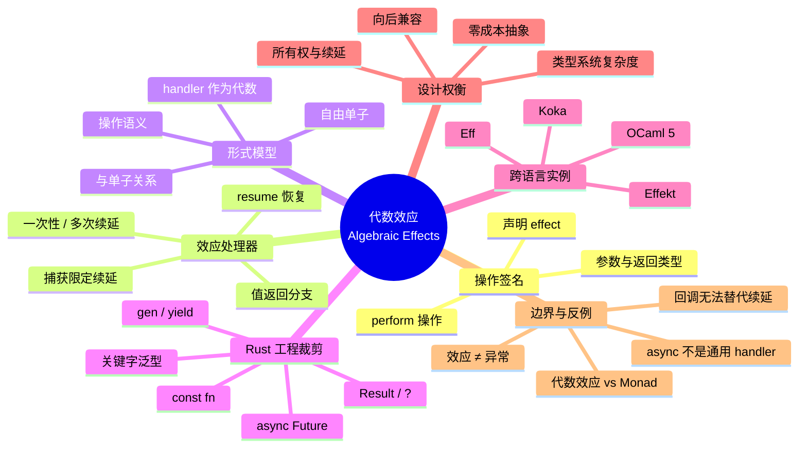

> **本节关键术语**: 代数效应（Algebraic Effects） · 效应操作（Effect Operation） · 效应处理器（Effect Handler） · 续延（Continuation） · 限定控制（Delimited Control） · 自由单子（Free Monad） · 关键字泛型（Keyword Generics） — [完整对照表](../../00_meta/01_terminology/01_terminology_glossary.md)

# 代数效应与效应处理器：从自由单子到 Rust 的关键字效果

> **EN**: Algebraic Effects and Effect Handlers: From Free Monads to Rust Keyword Effects
> **Summary**: A formal deep-dive into algebraic effects (operations, handlers, continuations, delimited control), comparing Rust's keyword-based effect system with full handlers in OCaml 5, Koka, and Eff, and explaining why Rust stops short of general effect handlers.
> **Rust 版本**: 1.97.0+ (Edition 2024)
> **受众**: [专家]
> **内容分级**: [参考级]
> **Bloom 层级**: L4
> **权威来源**: 本文件为 `concept/` 权威页。
> **A/S/P 标记**: **S+A** — Structure + Application
> **双维定位**: C×Ana — 分析代数效应的理论结构与 Rust 的工程裁剪
> **前置概念**: [进程代数与 Rust 并发原语](./01_process_calculi_for_rust.md) · [Actor 模型形式语义](./03_actor_semantics.md) · [类型论基础](../00_type_theory/01_type_theory.md) · [范畴论与 Rust](../00_type_theory/04_category_theory.md)
> **后置概念**: [Effects System 预览](../../07_future/02_preview_features/01_effects_system.md) · [Async/Await](../../03_advanced/01_async/01_async.md) · [副作用与纯度](../../01_foundation/00_start/04_effects_and_purity.md)

---

> **来源**:
> [Plotkin & Pretnar 2009 — Handlers of Algebraic Effects](https://doi.org/10.1007/978-3-642-00590-9_7) ·
> [Plotkin & Power 2002 — Notions of Computation Determine Monads](https://doi.org/10.1007/3-540-45931-6_24) ·
> [Koka Language](https://koka-lang.github.io/) ·
> [Eff Language](https://www.eff-lang.org/) ·
> [Effekt Language](https://effekt-lang.org/) ·
> [OCaml 5 Manual — Effect Handlers](https://ocaml.org/manual/5.3/effects.html) ·
> [Rust Keyword Generics Initiative](https://github.com/rust-lang/keyword-generics-initiative) ·
> [Rust Project Goals 2025H1 — const traits](https://rust-lang.github.io/rust-project-goals/2025h1/const-trait.html) ·
> [Leijen 2014 — Koka: Programming with Row Polymorphic Effect Types](https://doi.org/10.1145/263344.263363) ·
> [Leijen 2017 — Structured Asynchrony with Algebraic Effects](https://doi.org/10.1145/3009837.3009897) ·
> [Pretnar 2015 — An Introduction to Algebraic Effects and Handlers](https://www.eff-lang.org/handlers-tutorial.pdf)
>
> ⚠️ **声明**: 本页呈现的是**形式语义骨架与教学级代码**，用于建立直觉而非机器验证的等价证明。Rust 目前没有原生的用户定义代数效应处理器；文中涉及 Rust 统一 effect 关键字的语法均为 **探索性/不稳定提案**，不代表已稳定的语言特性。

---

## 📑 目录

- [代数效应与效应处理器：从自由单子到 Rust 的关键字效果](#代数效应与效应处理器从自由单子到-rust-的关键字效果)
  - [📑 目录](#-目录)
  - [一、核心概念](#一核心概念)
    - [1.1 什么是代数效应](#11-什么是代数效应)
    - [1.2 效应操作：计算的「暂停键」](#12-效应操作计算的暂停键)
    - [1.3 效应处理器：解释暂停的语义](#13-效应处理器解释暂停的语义)
    - [1.4 续延与限定控制](#14-续延与限定控制)
    - [1.5 代数：签名 + 方程 + 模型](#15-代数签名--方程--模型)
  - [二、技术细节](#二技术细节)
    - [2.1 操作语义：一小步怎么走](#21-操作语义一小步怎么走)
    - [2.2 类型与效应：行多态简介](#22-类型与效应行多态简介)
    - [2.3 与单子的关系](#23-与单子的关系)
    - [2.4 与限定续延的互编码](#24-与限定续延的互编码)
    - [2.5 自由单子：形式直觉](#25-自由单子形式直觉)
  - [三、Rust 与代数效应](#三rust-与代数效应)
    - [3.1 Rust 当前的关键字效果](#31-rust-当前的关键字效果)
    - [3.2 `async`/`await` 作为受限的效应实例](#32-asyncawait-作为受限的效应实例)
    - [3.3 关键字泛型倡议：从隐性到显性的跃迁](#33-关键字泛型倡议从隐性到显性的跃迁)
    - [3.4 为什么 Rust 不实现完整处理器](#34-为什么-rust-不实现完整处理器)
  - [四、跨语言对比](#四跨语言对比)
    - [4.1 OCaml 5：运行时处理器](#41-ocaml-5运行时处理器)
    - [4.2 Koka：行多态 + 静态处理器](#42-koka行多态--静态处理器)
    - [4.3 Eff / Effekt：学术原型](#43-eff--effekt学术原型)
    - [4.4 能力矩阵](#44-能力矩阵)
  - [五、反命题与边界分析](#五反命题与边界分析)
    - [反例 1：把 Rust `async` 当成完整效应处理器](#反例-1把-rust-async-当成完整效应处理器)
    - [反例 2：用回调手工模拟 handler](#反例-2用回调手工模拟-handler)
    - [反例 3：把代数效应与异常混为一谈](#反例-3把代数效应与异常混为一谈)
    - [边界：代数效应 vs Monad 变换器](#边界代数效应-vs-monad-变换器)
  - [六、来源与延伸阅读](#六来源与延伸阅读)
  - [权威来源索引](#权威来源索引)
  - [🧠 知识结构图](#-知识结构图)
  - [对应测验](#对应测验)

---

## 一、核心概念

### 1.1 什么是代数效应

**代数效应**（algebraic effects）是一种把「计算在求值过程中可能发出的请求」显式化的语言机制。它由 Gordon Plotkin 与 John Power 在 2002 年提出操作语义框架，后由 Plotkin 与 Matija Pretnar 在 2009 年完善为**效应处理器**（effect handlers）理论 [Plotkin & Pretnar 2009]。

与类型系统回答「函数返回什么值」不同，代数效应回答：

> 函数在计算过程中**还向环境请求了哪些服务**？这些服务如何被**解释/实现**？

一个经典例子是**状态**：

```text
传统命令式: 函数直接读写全局/堆状态
代数效应:   函数只发出 "get" / "put" 请求，由外层的 handler 决定如何响应
```

这种分离带来两个核心好处：

1. **语义可替换性**：同一段业务逻辑可以在「真实状态」「事务日志」「mock 状态」等不同 handler 下运行；
2. **组合性**：多个代数效应可以像代数结构一样组合，而不需要像 Monad 变换器那样手动.lift。

> **关键洞察**: 代数效应的「代数」二字不是修辞。一个效应由**操作签名**（operations）和**方程**（equational laws）共同定义；handler 则是该代数理论的**模型**（model）。这将在 §2.5 形式化。

---

### 1.2 效应操作：计算的「暂停键」

效应的**操作签名**（effect signature）声明了一组操作及其参数/返回类型。以可失败性、状态、并发为例：

```text
 effect Throw<E> { throw(e: E): ⊥ }          -- 异常/可失败
 effect State<S> { get(): S; put(s: S): () } -- 可变状态
 effect Suspend  { await(p: Promise<A>): A } -- 异步挂起
 effect Yield<A> { yield(a: A): () }         -- 惰性产出
```

在支持代数效应的语言中，调用一个操作通常使用 `perform`（或 `do`/`!`）：

```text
let increment() : state<int> () {
    perform put(perform get() + 1)
}
```

`perform get()` 会**暂停**当前计算，把控制权交给最近的、能处理 `State` 的 handler；handler 返回一个值后，计算从暂停点**恢复**。

这一暂停/恢复机制与以下概念等价：

- **续延**（continuation）：`perform` 点之后的整个计算被捕获为一个函数；
- **限定控制**（delimited control）：handler 界定了一个控制范围，只捕获到该 handler 为止的栈片段；
- **协程/生成器**：`await`/`yield` 是操作的特殊情况。

---

### 1.3 效应处理器：解释暂停的语义

**效应处理器**（effect handler）是一段解释特定操作的代码。它的形态类似增强版的 `try/catch`：

```text
handle M with {
    return(x)  -> N_return(x)           -- 值返回分支
    op_i(x; k) -> N_i(x, k)             -- 每个操作对应一个分支，k 为续延
}
```

与异常的关键区别：异常 handler 只能**终止**或**传播**，而效应 handler 可以**恢复**（resume）计算。续延 `k` 代表了「如果这次操作返回某个值，后续计算会是什么」。

**状态 handler 的伪代码**：

```text
handle M with {
    return(x)     -> fun s -> (x, s)
    get(_; k)     -> fun s -> (k s) s        -- 把当前状态 s 传给续延，并继续以 s 为状态
    put(s'; k)    -> fun _ -> (k ()) s'      -- 忽略旧状态，以 s' 继续
}
```

把 `M` 放进该 handler 后，整个表达式从 `fun init -> ...` 开始求值，最终返回 `(结果值, 最终状态)`。

> **核心语义事实**: handler 把**效果的意义**（meaning）从**效果的调用**（use）中解耦。调用者只声明「我需要状态服务」，服务实现由外层 handler 决定。

---

### 1.4 续延与限定控制

**续延**（continuation）是「程序剩余部分」的函数表示。在没有 effect handler 的语言里，续延通常是全局的（call/cc 捕获整个未来计算）。效应 handler 使用的续延是**限定续延**：只捕获从 `perform` 点到**最近 handler** 之间的栈帧。

```text
外层函数
  └── handler H              <-- 限定边界（prompt）
        └── ...
              └── perform op  <-- 捕获从这里到 H 的栈
                    └── ...    <-- 这部分被包进续延 k
```

_handler 是否允许多次 resume_ 分为两种实现策略：

| 策略 | 含义 | 典型语言 | 限制 |
|:---|:---|:---|:---|
| **一次性续延**（one-shot） | `k` 只能被调用一次，调用后失效 | Koka、Rust async | 可线性类型/所有权管理，实现零成本 |
| **多次续延**（multi-shot） | `k` 可被复制并调用多次，实现回溯、非确定性 | Eff、部分 OCaml 研究扩展 | 需要捕获可变环境，带来运行时成本与语义复杂度 |

> **重要**: OCaml 5 的续延**默认一次性**，不允许安全地多次恢复；这是为了与 OCaml 的命令式特征（可变状态）兼容 [Dolan et al. 2017, "Concurrent System Programming with Effect Handlers"]。

---

### 1.5 代数：签名 + 方程 + 模型

从**泛代数**（universal algebra）视角，一个效应就是一组操作加上描述它们如何组合的**方程**。以状态为例：

```text
签名 Σ_State = { get: () -> S, put: S -> () }
典型方程:
  get(); put(s)  ≡ put(s)               -- 读取后立即写入同一值等于直接写入
  put(s); get()  ≡ put(s); return s     -- 写入后读取得到刚写入的值
  put(s); put(s') ≡ put(s')             -- 连续写入只保留最后一次
```

一个 handler 就是这个代数理论的一个**模型**：它为每个操作选择具体实现，使得方程在解释后成立（或至少符合设计意图）。

这解释了为什么代数效应**模块化**：只要两个 handler 都满足同一组方程，它们就可以在调用点互换，而无需修改调用代码。

---

## 二、技术细节

### 2.1 操作语义：一小步怎么走

下面给出 Plotkin & Pretnar 风格的简化操作语义。设 `E` 为**纯求值上下文**（pure evaluation context，即不跨越 handler 边界的上下文），`H` 为 handler：

```text
handle V with H  ⟶  N_return[V/x]                 (H 的 return 分支)

handle E[perform op_j(V)] with H  ⟶  N_j[V/x, λy. handle E[y] with H / k]
                                      (op_j 在 H 中有分支；k 为捕获的限定续延)

若 op 不在 H 中:
  handle E[perform op(V)] with H  ⟶  perform op(V) 在 E 外重新抛出
```

直观解释：

1. 当受 handler 保护的计算直接返回一个值时，使用 handler 的 `return` 分支包装；
2. 当计算执行到某个操作时，运行时被分成两部分——操作参数 `V` 与「操作若返回 `y`，后续会怎么走」的续延 `λy. handle E[y] with H`；
3. handler 分支 `N_j` 决定是立即 resume、延迟 resume、丢弃续延（异常式）还是多次调用续延（非确定性）。

---

### 2.2 类型与效应：行多态简介

在 Koka、Eff 等语言中，函数类型不仅标注参数/返回值，还标注**效应集合**（effect row）。例如：

```text
f : int -> <state<int>, exn> string
```

读作：`f` 接受 `int`，返回 `string`，但可能发出 `state<int>` 与 `exn` 两种效应。

**行多态**（row polymorphism）允许写出对额外效应不敏感的泛型函数：

```text
map : forall a b e. (a -> e b) -> list a -> e list b
```

`e` 是一个**效应行变量**，可以实例化为任意效应集合。这样 `map` 既可用于纯函数，也可用于带状态/异常的函数，而无需重复实现。

Rust 目前没有这种行类型。Rust 的 `async fn` 把「异步」编码进返回类型 `impl Future<Output = T>`；`try`/`?` 把「可失败」编码进 `Result<T, E>`；`const fn` 把「编译期求值」编码进函数修饰符。这些都是**类型承载**或**修饰符承载**的效应，而非显式效应行。

---

### 2.3 与单子的关系

Monad 与代数效应是描述计算的**两条等价但风格迥异**的路线：

| 维度 | Monad | 代数效应 |
|:---|:---|:---|
| **基本单元** | 类型构造子 `M A` 与 `return`/`bind` | 操作签名 `Σ` 与 handler |
| **组合方式** | Monad 变换器堆叠，需要手动 lift | 多个 handler 嵌套/组合，无需 lift |
| **语义位置** | 效果意义内建在 monad 定义中 | 效果意义由外部 handler 解释 |
| **表达能力** | 任意 monad（包括非代数 monad） | 代数效应对应一类 monad（代数 monad） |
| **Rust 映射** | `Future`、`Iterator`、`Result` 都是 monadic | `async`/`?` 可视为效应操作的语法投影 |

> **形式事实**: 每个代数效应理论（签名 + 方程）都对应一个**代数 monad**；反之，每个代数 monad 都可由某个效应理论给出 [Plotkin & Power 2002]。这意味着代数效应可以看作是「可分解为操作/方程的 monad」。

Rust 的 `Future`/`Result`/`Iterator` 更接近 monadic 编码，因为：

- 它们的组合规则（`and_then`、`map`、`?`）在类型定义时即固定；
- 用户无法在不改变 API 的情况下为 `Future` 换一套「解释」。

---

### 2.4 与限定续延的互编码

**限定续延**（delimited continuations）是控制运算符 `shift`/`reset` 背后的机制。它与效应处理器在表达能力上相互编码：

- **效应处理器 → shift/reset**：把每个 handler 看成一个 `reset` 边界；`perform` 对应 `shift`，捕获到该边界的续延并交给 handler 分支。
- **shift/reset → 效应处理器**：定义一个 `Shift` 效应，其操作接收一个续延函数；handler 用该函数实现 `shift` 语义。

这意味着：会写 `async/await` 的 Rust 程序员已经直觉上接触过限定续延——`await` 就是一次隐式的 `shift`，而 async 函数的边界就是 `reset`。

```text
async fn foo() -> i32 {
    let x = bar().await;   -- 等价于: shift k. perform Await(bar, k)
    x + 1
}
```

区别在于：Rust 的 `await` 只触发**语言内置**的异步调度续延，而完整 effect handler 允许用户定义任意操作。

---

### 2.5 自由单子：形式直觉

对于给定的效应签名 `Σ`，可以构造一个**自由单子**（free monad）`Free_Σ(A)`：

```text
Free_Σ(A) ::= Return(a)        其中 a : A
            | Op(op, v, k)     其中 op ∈ Σ, v : arg(op), k : ret(op) -> Free_Σ(A)
```

一个纯函数返回 `Return(a)`；一次效应调用产生 `Op(op, v, k)`，其中 `k` 把操作的返回值继续映射为下一个 `Free_Σ` 计算。

**handler 即代数**（handler as algebra）：

若 `C` 是最终解释目标（carrier），一个 handler 由两部分组成：

1. **return 代数**: `η : A -> C`
2. **操作代数**: `α_op : arg(op) × (ret(op) -> C) -> C`

由初始代数性质，`[η, α]` 唯一地折叠整个 `Free_Σ(A)` 树为 `C`：

```text
handle : Free_Σ(A) -> C
handle(Return a)       = η(a)
handle(Op(op, v, k))   = α_op(v, λr. handle(k r))
```

这就是「效应签名 = 自由单子，handler = 代数」的精确含义。状态 handler 的例子：

```text
C = S -> A × S                -- carrier 是「输入旧状态，输出值+新状态」的函数
η(a)        = λs -> (a, s)
α_get(_, k) = λs -> k s s     -- 把 s 作为 get 的返回值，状态不变
α_put(s', k)= λ_ -> k () s'   -- 忽略旧状态，以 s' 继续
```

该折叠与 §1.3 的 handler 伪代码完全对应。

---

## 三、Rust 与代数效应

### 3.1 Rust 当前的关键字效果

Rust 语言团队自 2022 年起通过 **Keyword Generics Initiative** 明确指出：Rust 自 1.0 起就在以零散关键字实现一种**隐性 effect system** [Keyword Generics Initiative 2024]。

| Rust 关键字/机制 | 表达的效应 | 当前编码方式 |
|:---|:---|:---|
| `async fn` / `.await` | 异步挂起/恢复 | 返回 `impl Future<Output = T>`，由 executor 解释 |
| `const fn` | 编译期求值、无副作用 | 函数修饰符 + const-check |
| `unsafe fn` / `unsafe {}` | 放弃编译器安全保证 | 关键字 +  unsafe 边界 |
| `Result<T, E>` / `?` | 可失败/异常短路 | 返回类型承载 + `?` 运算符 |
| `gen fn` / `yield` | 惰性迭代产出 | Generator 状态机（不稳定） |

> **定理 T-161**: `Send`/`Sync` trait 在编译期将数据竞争风险从共享可变状态转移到类型系统合约。

这些机制的共同点是：

1. **效果由语言预定义**，用户不能声明新的 effect；
2. **效果的解释外化到库/运行时**，语言本身不提供通用 `handle` 表达式；
3. **编译器通过 desugar 在编译期消除效果成本**，符合 Rust 的零成本抽象目标。

> **关键区别**: Rust 的「关键字效果」是**封闭效应系统**（closed effect system），而 Koka/Eff 是**开放效应系统**（open effect system）。封闭系统只追踪有限集合内的效果，开放系统允许用户定义新效果。详见 [Effects System 预览 §一之二](../../07_future/02_preview_features/01_effects_system.md)。

---

### 3.2 `async`/`await` 作为受限的效应实例

`async fn` 可以被视为代数效应的一个**受限投影**：

- **效应操作**：`await(p)` 向环境请求「在 `p` 就绪后继续我」；
- **handler**：async runtime / executor 解释该请求，决定何时恢复任务；
- **续延**：`Future` 状态机就是捕获的续延，`.await` 点把后续代码编译成 `Future::poll` 的状态转移。

下面是一个可在稳定 Rust 1.97 编译运行的最小示例，它用纯标准库实现了一个微型 executor，以展示 `async` 的「暂停-恢复」本质：

```rust
use std::future::Future;
use std::pin::Pin;
use std::task::{Context, Poll, RawWaker, RawWakerVTable, Waker};

/// 一个不做任何唤醒的 waker；真实 executor 会注册事件回调。
fn noop_waker() -> Waker {
    const VT: RawWakerVTable = RawWakerVTable::new(
        |_| RawWaker::new(std::ptr::null(), &VT),
        |_| {},
        |_| {},
        |_| {},
    );
    unsafe { Waker::from_raw(RawWaker::new(std::ptr::null(), &VT)) }
}

/// 阻塞式轮询直到 Future 就绪。生产环境请勿直接使用。
fn block_on<F: Future>(mut fut: F) -> F::Output {
    let waker = noop_waker();
    let mut cx = Context::from_waker(&waker);
    // Safety: `fut` 在 poll 期间不会被移动。
    let mut pin = unsafe { Pin::new_unchecked(&mut fut) };
    loop {
        match pin.as_mut().poll(&mut cx) {
            Poll::Ready(v) => return v,
            Poll::Pending => {
                // 真实 executor 在此等待 I/O 或定时器唤醒。
            }
        }
    }
}

async fn ask() -> i32 {
    42
}

fn main() {
    let ans = block_on(async {
        let x = ask().await;   // 等价于: 把「x+1」这段后续计算包成续延
        x + 1
    });
    assert_eq!(ans, 43);
}
```

> **语义注释**: `ask().await` 并没有真正调用一个用户定义的效应操作，而是触发了编译器生成的状态机跳转。Rust 不允许用户写 `perform Await(...)`，只允许在 `async` 块内使用 `.await`。

`Result` 与 `?` 也可以被读作异常效应的编码：

```rust
fn may_fail(x: i32) -> Result<i32, &'static str> {
    if x < 0 {
        Err("negative")
    } else {
        Ok(x * 2)
    }
}

fn composed(x: i32) -> Result<i32, &'static str> {
    let y = may_fail(x)?; // 短路异常效应：若失败，立即返回 Err
    Ok(y + 1)
}

fn main() {
    assert_eq!(composed(3), Ok(7));
    assert_eq!(composed(-1), Err("negative"));
}
```

`?` 运算符等价于「若操作返回异常，则提前返回；否则解包值并继续」。这正是一次**异常 handler 的受限形式**：它只能传播，不能恢复或转换异常。

---

### 3.3 关键字泛型倡议：从隐性到显性的跃迁

Rust 语言团队探索的方向不是把 OCaml 5 的 effect handler 原样搬过来，而是让已有效果能够被**泛化**（generic over effects），以减少 API 重复。一个经常被引用的痛点是「函数着色」：

```rust,ignore
// ⚠️ 以下语法为 Keyword Generics Initiative 的探索方向，尚未稳定。

// 当前 Rust：需要为 sync / async / try / async+try 写四个版本
fn map_sync<F, T, U>(f: F, xs: Vec<T>) -> Vec<U>
where F: Fn(T) -> U;

fn map_async<F, T, U>(f: F, xs: Vec<T>) -> impl Future<Output = Vec<U>>
where F: AsyncFn(T) -> U;

// 理想方向：对效果泛型
fn map<F, T, U>(f: F, xs: Vec<T>) -> Vec<U>
where F: Fn(T) -> U;        // 默认无额外效果

fn map_e<eff E, F, T, U>(f: F, xs: Vec<T>) -> Vec<U> with E
where F: Fn(T) -> U with E; // 函数 f 可携带效果 E
```

Keyword Generics Initiative 的官方更新（2024-02-09）指出：

> "Rust has unknowingly shipped an effect system as part of the language since Rust 1.0." — Yoshua Wuyts

其目标不是新增一个 `effect` 关键字让用户定义任意效果，而是让 `async`、`const`、`try`、`gen` 等**既有效果**可以被统一抽象。这意味着 Rust 更可能走向：

```text
fn foo() -> i32 with async + throw(Error)
```

而非：

```text
effect State<S> { ... }   // 用户自定义效果（Rust 不太可能采用）
```

> **关键洞察**: Rust 的方向是**封闭的类型效应系统**（closed type-and-effect system），而不是**开放的代数效应处理器**。理解这一区别，是避免把 Rust 与 Koka 简单类比的先决条件。

---

### 3.4 为什么 Rust 不实现完整处理器

Rust 不引入通用 effect handler 的原因不是技术无知，而是**有意识的设计权衡**：

| 障碍 | 说明 | 对 Rust 的影响 |
|:---|:---|:---|
| **零成本抽象** | 通用 handler 需要运行时 handler 栈、续延捕获与动态分派 | 与 Rust「无运行时税」的核心承诺冲突 |
| **类型系统复杂度** | 效应行、行多态、多态 handler 会显著增加 trait solver 与借用检查器复杂度 | 可能拖慢编译、恶化错误信息 |
| **向后兼容性** | Rust 已有大量基于 `Future`/`Result`/`unsafe` 的代码；引入新语义层需要平滑迁移 | 重语义层成本极高，社区难以接受 |
| **所有权与生命周期** | 续延捕获栈帧会引入对局部变量的引用；与 Rust 的所有权/生命周期模型交互非平凡 | 多次续延还会复制可变环境，破坏唯一性 |
| **生态惯性** | Tokio、Embassy、Rayon 等运行时已经深度绑定现有 `Future` 模型 | 新抽象需要巨大生态迁移成本 |

因此 Rust 的现实路径是：

1. **短期**：通过 trait（`AsyncFn`、`const Trait`）和关键字泛型减少 API 重复；
2. **中期**：在类型系统中显式追踪固定集合的效果（`with async + throw`）；
3. **长期**：仍保持效果为**编译期标记/类型信息**，不引入通用运行时 handler。

> **结论**: Rust 可能永远不会像 Koka 那样支持用户自定义 `effect State { ... }` 与任意 handler；它会停留在「类型效应 + 关键字泛型」的折中位置。

> **定理 T-162**: Rust 选择显式关键字效应（`async`/`const`/`unsafe`/`try`/`gen`）而非通用代数效应处理器，以保证零成本抽象、向后兼容和借用检查器集成。

---

## 四、跨语言对比

### 4.1 OCaml 5：运行时处理器

OCaml 5 通过 `Effect` 模块把 effect handler 引入生产级语言。与 Koka 不同，OCaml 5 **没有静态 effect 类型系统**（截至 5.3），效果安全性由程序员保证；它的主要目标是支持用户级并发调度与生成器。

**声明效果**：

```ocaml
open Effect
open Effect.Deep

(* 声明两个 effect 操作：Get 返回 int，Put 接收 int 返回 unit *)
type _ Effect.t += Get : int Effect.t
                 | Put : int -> unit Effect.t
```

**使用操作**：

```ocaml
let increment () =
  let x = perform Get in
  perform (Put (x + 1))
```

**编写 handler**（使用 `Effect.Deep.match_with`）：

```ocaml
let run_state init comp =
  let rec loop s = function
    | v -> (v, s)                           (* 值返回分支 *)
    | effect Get k -> loop s (continue k s) (* 读取并恢复 *)
    | effect (Put s') k -> loop s' (continue k ())
  in
  loop init (comp ())
```

> **注意**: 上面的 `effect` 模式匹配是教学级写法；OCaml 5 标准库要求使用 `Effect.Deep.match_with` 与记录 `{ retc; exnc; effc }`。完整生产代码请参考 [OCaml 5 Manual — Effect Handlers](https://ocaml.org/manual/5.3/effects.html)。

OCaml 5 的关键限制：

- 默认**一次性续延**（one-shot continuation），多次恢复需要显式克隆并承担语义风险；
- 没有静态 effect 行类型，未处理的 effect 会在运行时抛出 `Unhandled` 异常；
- 设计目标偏重于**并发调度**与**生成器**，而非任意代数效应编程。

---

### 4.2 Koka：行多态 + 静态处理器

Koka 是最早将**行多态效应类型**与代数效应处理器整合进工业级语言的研究项目 [Leijen 2014]。在 Koka 中，每个函数都显式声明其效果：

```koka
// 声明一个状态效应
effect state<a> {
  fun get() : a
  fun set(x : a) : ()
}

// 一个带有 state<int> 效果的函数
fun add_and_get(n : int) : <state<int>> int {
  val x = get()
  set(x + n)
  x + n
}

// 状态 handler：把 state<int> 解释为局部可变变量
fun run_state(init : int, action : () -> <state<int>|e> int) : e int {
  var s := init
  with handler {
    fun get() { resume(s) }
    fun set(x) { s := x; resume(()) }
  }
  action()
}

fun example() : int {
  run_state(0) {
    add_and_get(5)
  }
}
```

Koka 的类型系统保证：

- 只有声明了 `state<int>` 的函数才能调用 `get()`/`set()`；
- 被 handler 处理过的效果会从返回类型中**移除**；
- 行变量 `e` 允许函数对额外效果保持多态。

Koka 使用 **evidence passing** 优化：编译器把 handler 作为隐式参数传递，效果分派接近 O(1)，而不是在运行时栈上搜索。

---

### 4.3 Eff / Effekt：学术原型

**Eff**（Andrej Bauer & Matija Pretnar）是围绕代数效应与 handler 设计的学术语言，它的语法最接近 Plotkin & Pretnar 的原始论文：

```eff
(* 声明 State 效果及其操作 *)
effect State : {
  operation Get : unit -> int;
  operation Put : int -> unit
}

let add_and_get n =
  let x = perform Get () in
  perform Put (x + n);
  x + n

let run_state init action =
  handle action () with
  | value v -> fun s -> (v, s)
  | effect (Get _) k -> fun s -> run_state s (continue k s)
  | effect (Put s') k -> fun _ -> run_state s' (continue k ())
```

Eff 的 handler 默认**多次续延**（multi-shot），因此可以自然实现非确定性、回溯等效果。

**Effekt** 是 Eff 的后续研究语言，强调**能力**（capabilities）与**区域**（regions）以解决 handler 作用域与资源安全的问题。Effekt 的类型系统比 Eff 更严格，也更接近 Rust 对资源与生命周期的关注，但仍然保留用户自定义 effect 与 handler。

---

### 4.4 能力矩阵

| 能力 | Rust（当前） | OCaml 5 | Koka | Eff/Effekt |
|:---|:---|:---|:---|:---|
| 用户自定义 effect | ❌ | ✅（运行时无静态类型） | ✅ | ✅ |
| 静态 effect 行类型 | ❌ | ❌ | ✅ | ✅/部分 |
| 通用 handler / `handle` 表达式 | ❌ | ✅ | ✅ | ✅ |
| 续延恢复 | 仅限 `Future::poll` | ✅（一次性为主） | ✅（一次性） | ✅（多次） |
| 零成本抽象 | ✅ | 部分 | 部分 | ❌ |
| 与所有权/借用交互 | 天然 | 无 | 无 |  Effekt 尝试 |
| 生产可用 | ✅ | ✅ | 研究/实验 | 研究 |
| 向后兼容负担 | 极高 | 中 | 低 | 低 |

> **解读**: 没有一行是绝对的「更好」。Rust 以牺牲表达力换取零成本与生态稳定；Koka/Eff 以运行时/编译期复杂度换取表达力与模块化。

---

## 五、反命题与边界分析

### 反例 1：把 Rust `async` 当成完整效应处理器

**错误论点**: "Rust 有 `async`/`await`，所以它已经有代数效应处理器了。"

**反驳**:

| 完整 effect handler | Rust `async` |
|:---|:---|
| 用户可以定义任意操作 | 只有内置的 `.await` |
| handler 可由用户编写 | 只能由运行时库提供 |
| 可以恢复、转换、丢弃续延 | 只能由 executor 按 `Future::poll` 规则恢复 |
| 可以组合多个独立效果 | `async` + `Result` 需要手动嵌套类型 |

`async` 是**单一效果**（异步挂起）的语法糖，不是通用 handler 机制。把它误认为通用 effect handler 会导致错误的设计假设，例如试图用 async 块实现用户级状态、日志或事务效果。

---

### 反例 2：用回调手工模拟 handler

**错误论点**: "既然 Rust 没有 handler，我可以把所有效果操作改成回调函数，达到同样解耦。"

**反驳**: 回调可以模拟「把操作解释外化」，但无法模拟**限定续延**。考虑状态 `get` 后跟随一段任意代码：

```rust,ignore
// 回调风格：把 get 之后的逻辑作为闭包传入
fn with_get<F, R>(k: F) -> R
where F: FnOnce(i32) -> R { ... }

with_get(|x| {
    with_put(x + 1, |_| {
        with_get(|y| { ... })
    })
})
```

问题：

1. **回调地狱**：代码嵌套深度与效果调用次数成正比；
2. **丢失栈结构**：异常、局部变量、借用关系在回调边界处被打散；
3. **无法恢复**：回调一旦返回就结束了，不能像 `continue k v` 那样在中间点恢复；
4. **所有权复杂**：Rust 的线性类型与闭包捕获会让多次恢复/分支续延变得困难。

因此，回调是 effect handler 的**低表达力替代**，不是等价实现。

---

### 反例 3：把代数效应与异常混为一谈

**错误论点**: "effect handler 不就是增强版 try/catch 吗？"

**反驳**: 异常 handler 只能做三件事之一：

- 吞掉异常并返回一个值；
- 重新抛出异常；
- 抛出另一个异常。

它**不能恢复**抛出点之后的计算。而 effect handler 拿到的是**续延**，可以选择：

- 立即 `continue k v` 恢复；
- 把 `k` 存起来稍后恢复（异步调度）；
- 多次恢复 `k`（非确定性）；
- 丢弃 `k`（等价于异常）。

所以异常是 effect handler 的**特例**（不恢复的 handler），而不是反过来。

---

### 边界：代数效应 vs Monad 变换器

| 场景 | 推荐 | 原因 |
|:---|:---|:---|
| 需要严格零成本、已有 Rust 生态 | `Future`/`Result` + 状态机 | 编译期消除，无运行时税 |
| 需要用户自定义效果、可替换语义 | Koka / Eff / OCaml 5 | handler 提供真正的解释解耦 |
| 效果组合多、手动 lift 痛苦 | 代数效应 | 多个 handler 自然嵌套 |
| 非代数效果（如 `Cont` 续延 monad） | Monad | 代数效应只能表达代数 monad |
| 与所有权/生命周期紧耦合 | Rust 现有机制 | 引入 handler 会与借用检查器产生复杂交互 |

---

## 六、来源与延伸阅读

本页作为 `concept/04_formal/07_concurrency_semantics/` 中代数效应的**唯一权威深度页**，与相邻页形成如下分工：

- [进程代数与 Rust 并发原语](./01_process_calculi_for_rust.md)：通道、通信与进程等价的形式语义；
- [Actor 模型形式语义](./03_actor_semantics.md)：命名进程、邮箱与监督树；
- [Effects System 预览](../../07_future/02_preview_features/01_effects_system.md)：Rust 效果系统的工程方向、开放 vs 封闭效应系统、关键字泛型路线图；
- [范畴论与 Rust](../00_type_theory/04_category_theory.md)：单子、自由结构与范畴语义；
- [类型论基础](../00_type_theory/01_type_theory.md)：类型系统、多态与 Curry-Howard 视角。

---

## 权威来源索引

- Plotkin, G. D. & Pretnar, M. _Handlers of Algebraic Effects_. ESOP 2009. [DOI](https://doi.org/10.1007/978-3-642-00590-9_7)
- Plotkin, G. D. & Power, J. _Notions of Computation Determine Monads_. FOSSACS 2002. [DOI](https://doi.org/10.1007/3-540-45931-6_24)
- Pretnar, M. _An Introduction to Algebraic Effects and Handlers_. 2015. [教程 PDF](https://www.eff-lang.org/handlers-tutorial.pdf)
- Leijen, D. _Koka: Programming with Row Polymorphic Effect Types_. MSFP 2014. [DOI](https://doi.org/10.1145/263344.263363)
- Leijen, D. _Structured Asynchrony with Algebraic Effects_. PLDI 2017. [DOI](https://doi.org/10.1145/3009837.3009897)
- Bauer, A. & Pretnar, M. _Eff Language_. [https://www.eff-lang.org/](https://www.eff-lang.org/)
- Brachthäuser et al. _Effekt Language_. [https://effekt-lang.org/](https://effekt-lang.org/)
- [Koka Language](https://koka-lang.github.io/)
- [OCaml 5.3 Manual — Effect Handlers](https://ocaml.org/manual/5.3/effects.html)
- [Rust Keyword Generics Initiative](https://github.com/rust-lang/keyword-generics-initiative)
- [Rust Project Goals 2025H1 — const traits](https://rust-lang.github.io/rust-project-goals/2025h1/const-trait.html)
- Dolan, S. et al. _Concurrent System Programming with Effect Handlers_. 2017.

> **相关文件**: [同层：进程代数](./01_process_calculi_for_rust.md) · [同层：Actor 语义](./03_actor_semantics.md) · [L7 Effects System 预览](../../07_future/02_preview_features/01_effects_system.md) · [L1 副作用与纯度](../../01_foundation/00_start/04_effects_and_purity.md)
>
> **文档版本**: 1.0 ｜ **最后更新**: 2026-07-16 ｜ **状态**: ✅ W5-7 新建（Rust 1.97 对齐）

## 🧠 知识结构图



> **认知功能**: 本知识结构图把代数效应拆分为「语法-语义-实现-对比-边界」五维，帮助读者在记住核心定义的同时，定位 Rust 在整个设计空间中的位置。建议结合 [Effects System 预览](../../07_future/02_preview_features/01_effects_system.md) 中的「开放 vs 封闭效应系统」一起阅读。

---

## 对应测验

完成 [L3 语义模型与跨语言对比测验](../../03_advanced/00_concurrency/10_quiz_semantic_models.md) 验证对代数效应、依赖/细化类型、STM、分布式共识与语言语义模型矩阵的掌握程度（15 题：🟢3 / 🟡10 / 🔴2）。
