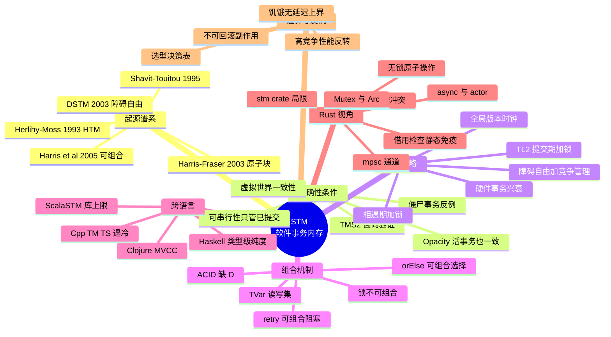

> **本节关键术语**: 软件事务内存（Software Transactional Memory, STM） · 事务变量（Transactional Variable, TVar） · 原子块（Atomic Block） · 可串行性（Serializability） · 不透明性（Opacity） · 重试（Retry） · 竞争管理（Contention Management） — [完整对照表](../../00_meta/01_terminology/01_terminology_glossary.md)

# 软件事务内存（STM）形式语义：从 Herlihy-Moss 到 Rust 的「无 STM」设计

> **EN**: Software Transactional Memory Semantics: From Herlihy-Moss to Rust's No-STM Design
> **Summary**: The formal semantics of Software Transactional Memory — the lineage from Herlihy-Moss 1993 hardware TM and Shavit-Touitou 1995 to Harris et al.'s composable transactions; the correctness spectrum from serializability through opacity to TMS2; retry/orElse composability; lock-based vs obstruction-free implementations — and a principled analysis of why Rust has no native STM, with its ownership-based alternatives and the limits of the `stm` crate.
> **Rust 版本**: 1.97.0+ (Edition 2024)
> **受众**: [专家]
> **内容分级**: [参考级]
> **Bloom 层级**: L4
> **权威来源**: 本文件为 `concept/` 权威页：STM 形式语义与 Rust「无 STM」设计分析的唯一深度解释。
> **A/S/P 标记**: **S+A** — Structure + Application
> **双维定位**: C×Ana — 分析原子块语义的理论结构与 Rust 的工程替代谱系
> **前置概念**: [Process Calculi](./01_process_calculi_for_rust.md) · [Linearizability](./02_linearizability_and_consistency.md) · [Algebraic Effects](./04_algebraic_effects.md) · [Ownership & Borrowing](../../01_foundation/01_ownership_borrow_lifetime/01_ownership.md)
> **后置概念**: [Actor Semantics](./03_actor_semantics.md) · [Concurrency Patterns](../../03_advanced/00_concurrency/03_concurrency_patterns.md) · [Language Semantic Model Matrix](../../05_comparative/00_paradigms/05_language_semantic_model_matrix.md)

---

> **来源**:
> [Herlihy & Moss, *Transactional Memory: Architectural Support for Lock-Free Data Structures*, ISCA 1993](https://doi.org/10.1145/165123.165164) ·
> [Shavit & Touitou, *Software Transactional Memory*, PODC 1995](https://doi.org/10.1145/224964.224987) ·
> [Herlihy, Luchangco, Moir & Scherer, *Software Transactional Memory for Dynamic-Sized Data Structures* (DSTM), PODC 2003](https://doi.org/10.1145/872035.872048) ·
> [Harris & Fraser, *Language Support for Lightweight Transactions*, OOPSLA 2003](https://doi.org/10.1145/949305.949340) ·
> [Harris, Marlow, Peyton Jones & Herlihy, *Composable Memory Transactions*, PPoPP 2005](https://doi.org/10.1145/1065944.1065952) ·
> [Dice, Shalev & Shavit, *Transactional Locking II* (TL2), DISC 2006](https://doi.org/10.1007/11864219_14) ·
> [Guerraoui & Kapalka, *On the Correctness of Transactional Memory* (Opacity), PPoPP 2008](https://doi.org/10.1145/1345206.1345233) ·
> [Doherty, Groves, Luchangco & Moir, *Towards Formally Specifying and Verifying Transactional Memory* (TMS2), FAC 25(5), 2013](https://doi.org/10.1007/s00165-012-0223-8) ·
> [Harris, Larus & Rajwar, *Transactional Memory*, 2nd ed., Morgan & Claypool 2010](https://doi.org/10.2200/S00272ED1V01Y201006CAC011) ·
> [Hackage `stm` — Control.Concurrent.STM](https://hackage.haskell.org/package/stm) ·
> [Clojure Reference — Refs](https://clojure.org/reference/refs) ·
> [ScalaSTM 文档](https://nbronson.github.io/scala-stm/) ·
> [Rust `stm` crate 文档](https://docs.rs/stm/latest/stm/) ·
> [Rust 标准库 `std::sync` 文档](https://doc.rust-lang.org/std/sync/) ·
> [The Rustonomicon — Races](https://doc.rust-lang.org/nomicon/races.html)
>
> ⚠️ **声明**: 本页呈现的是**形式语义骨架与教学级代码**，用于建立直觉而非机器验证的等价证明。Rust 语言与标准库**没有** STM；文中 `stm` crate 代码标注 `rust,ignore`（该 crate 非 workspace 依赖，仅示意 API 形态，以 [docs.rs/stm](https://docs.rs/stm/latest/stm/) 为准）；Haskell / Clojure / Scala / C++ 代码以各自语言 fence 给出，不参与 Rust 编译验证。

---

## 📑 目录

- [软件事务内存（STM）形式语义：从 Herlihy-Moss 到 Rust 的「无 STM」设计](#软件事务内存stm形式语义从-herlihy-moss-到-rust-的无-stm设计)
  - [📑 目录](#-目录)
  - [一、核心概念](#一核心概念)
    - [1.1 原子块：事务内存的语义直觉](#11-原子块事务内存的语义直觉)
    - [1.2 起源谱系：从硬件事务内存到可组合事务](#12-起源谱系从硬件事务内存到可组合事务)
    - [1.3 正确性条件谱系：可串行性、不透明性与 TMS2](#13-正确性条件谱系可串行性不透明性与-tms2)
    - [1.4 实现策略：lock-based 与 obstruction-free](#14-实现策略lock-based-与-obstruction-free)
  - [二、技术细节](#二技术细节)
    - [2.1 事务变量（TVar）与读写集](#21-事务变量tvar与读写集)
    - [2.2 提交协议：验证与版本时钟](#22-提交协议验证与版本时钟)
    - [2.3 retry 与 orElse：可组合的阻塞与选择](#23-retry-与-orelse可组合的阻塞与选择)
    - [2.4 可组合性：锁的根本缺陷](#24-可组合性锁的根本缺陷)
    - [2.5 与数据库事务的关系：ACID 缺了 D](#25-与数据库事务的关系acid-缺了-d)
    - [2.6 形式化骨架：原子块的小步语义](#26-形式化骨架原子块的小步语义)
  - [三、Rust 与 STM](#三rust-与-stm)
    - [3.1 为什么 Rust 没有原生 STM](#31-为什么-rust-没有原生-stm)
    - [3.2 Rust 的替代谱系：所有权、通道、异步与无锁](#32-rust-的替代谱系所有权通道异步与无锁)
    - [3.3 Rust `stm` crate 及其局限](#33-rust-stm-crate-及其局限)
    - [3.4 假如 Rust 引入原生 STM](#34-假如-rust-引入原生-stm)
  - [四、跨语言对比](#四跨语言对比)
    - [4.1 Haskell：原生 STM 的黄金标准](#41-haskell原生-stm-的黄金标准)
    - [4.2 Clojure：MVCC 与 Ref 的事务运行时](#42-clojuremvcc-与-ref-的事务运行时)
    - [4.3 Scala STM：库级事务内存](#43-scala-stm库级事务内存)
    - [4.4 C++ TM TS 与硬件事务内存的兴衰](#44-c-tm-ts-与硬件事务内存的兴衰)
    - [4.5 能力矩阵](#45-能力矩阵)
  - [五、反命题与边界分析](#五反命题与边界分析)
    - [反例 1：在事务中执行不可回滚的副作用](#反例-1在事务中执行不可回滚的副作用)
    - [反例 2：假设 STM 在高竞争下优于锁](#反例-2假设-stm-在高竞争下优于锁)
    - [反例 3：把 Rust `stm` crate 当 Haskell STM 等价物](#反例-3把-rust-stm-crate-当-haskell-stm-等价物)
    - [反例 4：以为没有 STM 就防不住数据竞争（compile\_fail 反证）](#反例-4以为没有-stm-就防不住数据竞争compile_fail-反证)
    - [边界：STM、锁、无锁与消息传递的选型](#边界stm锁无锁与消息传递的选型)
    - [边界：饥饿、竞争管理与实时性](#边界饥饿竞争管理与实时性)
  - [六、来源与延伸阅读](#六来源与延伸阅读)
  - [权威来源索引](#权威来源索引)
  - [🧠 知识结构图](#-知识结构图)
  - [对应测验](#对应测验)

---

## 一、核心概念

### 1.1 原子块：事务内存的语义直觉

**事务内存**（Transactional Memory, TM）把一段代码标记为**原子块**（atomic block），并向程序员承诺一个单一全局锁式的语义：

> 原子块对外界的可见效果，等价于它在某个瞬间**整体发生**，或者**从未发生**。

```text
原子块语义（单全局锁模型）:
  atomic {
      x = x - 30;   // 步骤 1
      y = y + 30;   // 步骤 2
  }
  ⟹ 任何其他线程要么观察到 ⟨x, y⟩ 都在修改前，要么都在修改后；
     永远观察不到「x 已扣款而 y 未到账」的中间态。
```

实现上，原子块**并不**真的持有一把全局锁。主流实现采用**乐观并发控制**（optimistic concurrency control）：

1. 事务体内对内存的读写在**读写集**（read/write set）或日志中累积，暂不对外可见；
2. 到达块尾时，实现**验证**（validate）读写集与并发事务是否冲突；
3. 无冲突 ⟹ **提交**（commit），写入一次性生效；有冲突 ⟹ **中止**（abort），丢弃全部暂存写入并**重跑**（retry 重执行整个块）。

「事务内存」的名字来自与数据库事务的类比（§2.5），但它操作的对象是**内存中的普通数据结构**，目标是替代互斥锁成为共享内存并发的基础机制。

> **关键洞察**: STM 试图同时拿下两个传统上互相矛盾的目标——**正确性**（无死锁、无低级数据竞争）与**模块化**（两个各自正确的原子块可以安全组合）。锁只能给出前者，而且要牺牲后者（§2.4）。

---

### 1.2 起源谱系：从硬件事务内存到可组合事务

STM 不是一次发明，而是一条跨越硬件、算法与语言设计三个领域的谱系：

| 年份 | 工作 | 贡献 | 领域 |
|:---|:---|:---|:---|
| 1993 | Herlihy & Moss, ISCA | 首次提出**事务内存**概念：扩展缓存一致性协议，用硬件事务实现无锁数据结构 | 硬件（HTM） |
| 1995 | Shavit & Touitou, PODC | 首个**软件**事务内存，提出 "Software Transactional Memory" 一词；lock-free，但事务访问的内存位置须**静态已知** | 算法 |
| 2003 | Herlihy, Luchangco, Moir & Scherer (DSTM), PODC | **动态** STM：事务可在运行时决定访问哪些位置；提出 **obstruction-free** 进展条件与竞争管理器 | 算法 |
| 2003 | Harris & Fraser, OOPSLA | 把 `atomic` 提升为**语言构造**（词法作用域的原子块）；word-based STM（WTM） | 语言 |
| 2005 | Harris, Marlow, Peyton Jones & Herlihy, PPoPP | **可组合内存事务**：GHC Haskell 的 `STM` monad + `retry` / `orElse`，事务成为可组合的模块化单元 | 语言 |
| 2006 | Dice, Shalev & Shavit (TL2), DISC | 全局版本时钟 + 提交期加锁，lock-based STM 的性能标杆 | 算法 |
| 2008 | Guerraoui & Kapalka, PPoPP | **opacity**：把「仍在运行的事务也必须读到一致状态」形式化为正确性条件 | 理论 |
| 2009/2013 | Doherty, Groves, Luchangco & Moir | **TMS1/TMS2**：面向验证的事务内存 I/O 自动机规约 | 理论 |

读这张表的方式：

- **1993→1995**：概念从硬件下沉到软件——HTM 提供了「原子多块读写」的直觉，STM 证明不需要硬件也能做到，代价是每次访问的软件插装；
- **1995→2003**：从静态事务（位置预先固定）到动态事务（位置运行时决定），这是 STM 从理论玩具走向数据结构库的门槛；
- **2003→2005**：从库到语言——`atomic` 块、`retry`、`orElse` 让事务获得**组合代数**（§2.3）；
- **2008 之后**：研究重心转向「什么才算正确」与「验证具体实现」（§1.3），以及硬件事务的产业化兴衰（§4.4）。

> **过渡**: 谱系给出的是「谁在什么时候做了什么」，但还没有回答「做对了没有」。下一节给出正确性条件的层级。

---

### 1.3 正确性条件谱系：可串行性、不透明性与 TMS2

STM 的正确性条件经历了三次收紧。直觉可用一个「僵尸事务」场景驱动：

```text
不变量: x == y（两个 TVar 恒等）
事务 T1: 写 x := 1, 写 y := 1        （进行中，尚未提交）
事务 T2: a := 读 x; b := 读 y; 计算 1 / (a - b)

交错: T1 写 x:=1 ─► T2 读 x 得 1 ─► T2 读 y 得 0 ─► T2 计算 1/(1-0) 正常
      但若交错为 T1 写 x:=1 ─► T2 读 x 得 1 ─► T1 被抢占 ─► T2 读 y 得 0?
      若 T2 读到 ⟨1, 0⟩，则 1/(1-0)=1；若读到 ⟨1,0⟩ 且 a-b 恰为 0，则除零崩溃。
关键: 即便 T2 最终注定中止（与 T1 冲突），它在「活的、不一致的快照」上
      继续执行本身就可能出错——死循环、除零、解引用坏指针。
```

1. **可串行性（Serializability）**（数据库理论，Papadimitriou 1979）：只约束**已提交**事务——它们的效果须等价于某个串行执行顺序。缺陷：对**进行中/注定中止**的事务读到的状态不作任何承诺，僵尸事务可以崩溃、污染日志甚至泄露不一致数据。
2. **不透明性（Opacity）**（Guerraoui & Kapalka, PPoPP 2008）：存在一个串行序 S，使得：
   - S 包含全部已提交事务，且每个事务的操作在 S 中连续；
   - **每一个事务**（含中止与进行中的）的每次读，都读到 S 中「最近一次写入」的值；
   - S 尊重事务间的实时序（先完成者排前）。
   直觉：把线性化（见 [线性化与一致性谱系](./02_linearizability_and_consistency.md)）从单个并发对象提升到「整个事务」粒度，且覆盖活事务。
3. **TMS2**（Doherty, Groves, Luchangco & Moir, FAC 25(5) 2013）：用 I/O 自动机给出的可验证规约。TMS1 大致对齐可串行性；TMS2 额外约束中止事务的读一致性与写可见性，使之可作为实现验证的目标。DGLM 证明 TMS2 与 opacity 在常见规约假设下高度接近；Hans 等人（DISC 2016, *Opacity vs TMS2: Expectations and Reality*）进一步指出二者在边界情形（空读集、写后读的具体约束）上**并不等价**——工程文献中常混用，形式化时应注明取哪一个。

弱化方向也存在：**虚拟世界一致性**（Virtual World Consistency, Imbs, de Mendívil & Raynal, PODC 2009）只要求已提交事务整体可串行、中止事务与其「因果过去」一致，严格弱于 opacity，但对许多不变量已够用。

```text
强度:  TMS2 ≳ Opacity  >  Virtual World Consistency  >  Serializability
覆盖:  活事务也一致    活事务也一致        中止事务与因果过去一致       只管已提交
```

> **关键洞察**: 选择哪个条件不是学术洁癖。opacity/TMS2 级别的保证是「事务体里可以放任意代码」的前提；只要系统中存在无 GC 的语言或可能崩溃的线程，可串行性就不够。

---

### 1.4 实现策略：lock-based 与 obstruction-free

STM 实现沿两个轴分类：**何时加锁**（乐观/悲观）与**进展条件**（冲突时谁保证能完成）：

| 策略 | 代表 | 加锁时机 | 进展条件 | 读的代价 | 备注 |
|:---|:---|:---|:---|:---|:---|
| 相遇期加锁（encounter-time） | Ennals STM、TinySTM 变体 | 访问时即锁定写集 | 阻塞（可能死锁，需超时/竞争管理） | 低 | 提交快，冲突时回退代价大 |
| 提交期加锁（commit-time） | **TL2**（Dice-Shalev-Shavit 2006） | 仅提交时锁写集 | 阻塞；读无锁不可见 | 低（无读锁） | 全局版本时钟，长期性能标杆 |
| 无锁障碍自由（obstruction-free） | **DSTM**（Herlihy et al. 2003） | 不加锁 | 障碍自由：独跑者必完成；冲突由**竞争管理器**裁决中止一方 | 较高（间接层 locator） | 首个动态 STM；系统级无死锁 |
| 硬件事务（HTM） | Herlihy-Moss 1993、Intel TSX | 缓存行侦测冲突 | 依赖硬件回退路径 | 近零插装 | 容量/时长受限，需软件回退（§4.4） |

三个术语的精确定义（沿用 [线性化与一致性谱系](./02_linearizability_and_consistency.md) 的进展条件口径）：

- **阻塞（blocking）**：允许线程持锁等待；可能死锁，需外部机制（锁序、超时）避免；
- **障碍自由（obstruction-free）**：只要一个线程**单独**运行足够久，必能完成；并发冲突时可互相中止，需要竞争管理器（§五、边界 2）打破对称；
- **无锁（lock-free）**：系统整体无限步内必有**某个**线程完成——严格强于障碍自由，对 STM 而言代价通常不可接受，故主流 STM 不追求。

> **设计空间要点**: TL2 证明了「读无锁 + 提交期短临界区」在常见负载下优于一切更精巧的方案；DSTM 证明了「系统级不死锁」可以在没有全局锁的前提下实现。STM 之后十年的工程史基本是这两条路线的折中组合（NOrec、SwissTM、TinySTM 等）。

---

## 二、技术细节

### 2.1 事务变量（TVar）与读写集

STM 不追踪「整段内存」，只追踪**事务变量**（transactional variable，Haskell 称 `TVar`，Clojure 称 `Ref`，scala-stm 称 `Ref`，Rust `stm` crate 称 `TVar`）。事务变量是一个带版本元数据的可更新单元，事务对它的访问被运行时分流到两个集合：

```text
事务状态 ::= ⟨读集 RS, 写集 WS, 局部日志⟩
  读集 RS : TVar ↦ 读到的值与版本号      （用于一致性验证）
  写集 WS : TVar ↦ 暂存的新值            （提交前对外不可见）

读 TVar v:
  if v ∈ WS            then 返回 WS(v)            （读己之写）
  else 记录 (v, value, version) 入 RS; 返回 value

写 TVar v := x:
  WS(v) := x                                  （延迟更新；或直接更新+撤销日志）
```

两个实现变体：

- **延迟更新（deferred update / redo log）**：写入先落写集，提交时一次性写回。中止零成本（丢弃写集），GHC STM 与 TL2 走这条路线；
- **直接更新（direct update / undo log）**：写入就地生效但记录旧值，中止时回放撤销。提交快、中止贵，适合冲突稀少的负载。

事务变量带来一个结构性后果：**STM 的世界被分成两半**——TVar 之内的状态受事务保护，TVar 之外的状态不受。Haskell 用类型系统把这条边界变成静态纪律（`STM a` 与 `IO a` 是两个不可混用的 monad）；其他语言与库只能依赖运行时检查或程序员自律（§3.3、反例 1）。

---

### 2.2 提交协议：验证与版本时钟

以 TL2 为骨架，一个乐观事务的提交协议是：

```text
提交(T):
  1. 锁定 WS 中全部 TVar（按固定顺序，避免死锁）
  2. 读全局版本时钟 gv; rv := gv
  3. 验证读集: ∀ v ∈ RS, v.version ≤ rv（且 v 未被他人锁定）
       失败 ⟹ 解锁、中止、重跑
  4. wv := gv + 1; 将 WS 写回各 TVar（值与版本号 wv）
  5. 原子地令 gv := wv（CAS / fetch-add）
  6. 解锁，提交完成
```

三个值得记住的性质：

- **读是不可见的**：读不加锁、不留痕迹，只在自己的读集里记账。读多写少的负载（STM 的主战场）因此近似无锁读；
- **验证即一致性检查**：步骤 3 保证读集里的每个版本在 ⟨rv, wv⟩ 区间内没有被并发提交覆盖——这正是 opacity 所要求「每次读都读到串行序中的最新值」的实现侧对应；
- **线性化点在步骤 5**：从其他事务视角看，整个事务的效果在全局时钟前进的那个瞬间一次性出现。这把 STM 的证明问题还原为单点推理（方法本身见 [线性化与一致性谱系](./02_linearizability_and_consistency.md) §3.1）。

---

### 2.3 retry 与 orElse：可组合的阻塞与选择

Harris、Marlow、Peyton Jones 与 Herlihy（PPoPP 2005）给 STM 补上了传统事务系统没有的两个组合子，这是「可组合内存事务」得名的原因：

```text
retry   : 放弃当前事务；阻塞当前线程，
          直到本事务读集中任一 TVar 被其他事务提交修改；然后整体重跑
orElse  : (p `orElse` q)：先跑 p；若 p retry，丢弃 p 的全部暂存效果，改跑 q；
          若两者都 retry，则整体 retry——等待集为 p、q 读集之并
```

语义要点：

1. **retry 不是自旋**：它把线程挂到「读集变动」这个事件上，由运行时负责唤醒（GHC 中 TVar 自带等待队列）。CPU 开销近似条件变量；
2. **重跑是整体重来**：事务体被当作一个可重复执行的计算描述，而不是一段已经推进到一半的指令流。这等价于要求事务体是**可重入且无副作用**的——类型系统层面的表达见 §4.1 与 [代数效应与效应处理器](./04_algebraic_effects.md)；
3. **orElse 是选择，不是异常处理**：它给出「两条路任选其一能走通」的语义，读集合并保证等待条件不缺不漏。

`retry`/`orElse` 让 STM 从「无死锁的锁替代」升级为「可组合的同步原语」：消息队列的非空等待、多通道选择（select）都可以直接在事务内表达，而锁体系里对应物要么不存在、要么需要手工条件变量协议。

---

### 2.4 可组合性：锁的根本缺陷

考虑银行账户的经典例。两个各自正确的模块：

```text
withdraw(acc, n):  lock(acc); acc.balance -= n; unlock(acc)
deposit(acc, n):   lock(acc); acc.balance += n; unlock(acc)
```

要组合出 `transfer(a, b, n) = withdraw(a, n); deposit(b, n)`，暴露三个结构性问题：

1. **中间态泄漏**：withdraw 完成、deposit 未开始时，a 已扣款、b 未到账——单步各自正确，组合后违反原子性；
2. **修复泄漏抽象**：加一把「转账锁」要求两个模块暴露/共享锁纪律，锁顺序成为**全局知识**；任意两个团队各自正确的代码，组合后可因锁序相反而死锁；
3. **条件等待不可组合**：「队列非空才出队」在锁体系里需要手工条件变量协议，两个这样的协议几乎无法安全嵌套。

STM 的对应物：

```text
transfer(a, b, n) = atomically { withdraw'(a, n); deposit'(b, n) }
```

其中 `withdraw'`/`deposit'` 是不含任何同步代码的纯数据操作。原子性、一致性、（有限制的）隔离性由运行时对**整个块**保证；组合不再需要模块暴露内部同步细节。Harris 等人称之为「把锁扔进历史的垃圾桶」所需的最后一块拼图——正确性保证**附着于组合操作本身**，而非附着于全局纪律。

> **边界提醒**: 组合性解决的是**安全**（safety）维度。两个大事务组合后冲突面变大、重试率上升，性能仍须按冲突域分析（反例 2）。

---

### 2.5 与数据库事务的关系：ACID 缺了 D

| ACID | STM 对应 | 说明 |
|:---|:---|:---|
| **A** 原子性 | ✅ 提交/中止全有或全无 | 中止丢弃写集或回放撤销日志 |
| **C** 一致性 | ⚠️ 程序员责任 | STM 不检查应用不变量，与数据库约束检查不同 |
| **I** 隔离性 | ✅ opacity ≈ 严格可串行 | 强于多数数据库默认级别（读已提交/快照隔离） |
| **D** 持久性 | ❌ 无 | 内存事务不落盘；进程崩溃即丢失 |

机制层的对应物几乎一一映射：

- **日志**：数据库的 undo/redo log ⟷ STM 的撤销日志/写集缓冲；
- **并发控制**：悲观两阶段锁（2PL）⟷ 相遇期加锁 STM；乐观并发控制（OCC）⟷ TL2 式验证提交；
- **MVCC**：数据库多版本 ⟷ Clojure STM 的 Ref 历史链（§4.2）——读事务永不阻塞；
- **隔离级别**：数据库允许用弱隔离换吞吐；主流 STM 默认 opacity 级，相当于永远跑在 strict serializability。

本质区别在**规模假设**：数据库事务是毫秒到秒级、以磁盘为真相源的长时间计算，因此持久性不可省；STM 面向微秒级的内存对象，持久性被整体舍弃，换取与指针算术同数量级的访问开销。同理，因为 STM 事务体里是**真实线程在跑真实代码**，正确性条件必须覆盖活事务（opacity），而数据库可以靠沙箱化的存储过程边界把「读到脏数据的会话」隔离在崩溃半径之外。

---

### 2.6 形式化骨架：原子块的小步语义

把 §1.1 的直觉写成小步操作语义的一条规则（Harris-Fraser 风格，教学骨架）：

```text
⟨t, σ⟩ 是「项 × 内存」对；→ 为单线程小步关系

                     ⟨t, σ⟩ →* ⟨skip, σ′⟩
(Atomic-Step)  ─────────────────────────────────
                ⟨atomic t, σ⟩ ⟶ ⟨atomic skip, σ′⟩
```

读法：**只要**事务体 `t` 在内存 `σ` 上多步走到终止并产生 `σ′`，**那么**整个原子块在交错语义中可以作为**一步**完成状态迁移。其他线程的步只能在原子块边界之间插入——这就是单全局锁语义的精确表述。

该骨架省略的三件事，恰好是文献的三条深化线：

1. **中止与重跑**：规则只给出成功分支。加入显式 `abort` 与日志后，语义需要携带事务本地状态 ⟨RS, WS⟩（§2.1），中止规则把 ⟨RS, WS⟩ 丢弃并回到块头；
2. **与外部世界的交互**：若 `t` 含不可回滚动作（I/O），单步化规则不再成立——需要把动作分类为「可回滚/不可回滚」，这正是类型系统或运行时要强制执行的边界（反例 1）；
3. **嵌套事务**：`atomic` 套 `atomic` 有扁平化（flatten）、闭合嵌套（closed nesting）等语义选择，主流语言级 STM 取扁平化——内层块并入外层读/写集。

> **与进程代数的关系**: 原子块的「对外只有边界可见」与 CSP 的同步事件、与 [进程代数与 Rust](./01_process_calculi_for_rust.md) 中的「通道动作即观察点」共享同一直觉——**可观察性被约束到离散边界**；区别在于 STM 的边界由冲突检测动态决定，而 CSP 的边界由通道语法静态给出。

---

## 三、Rust 与 STM

### 3.1 为什么 Rust 没有原生 STM

截至 Rust 1.97（Edition 2024），语言核心与标准库从未包含 STM 设施，也没有被接受的 STM RFC。这不是功能缺口，而是与 Rust 设计公理一致的取舍。四条相互独立又相互加强的理由：

| # | 理由 | 与 STM 主张的冲突点 |
|:--|:---|:---|
| 1 | **借用检查器已静态消除数据竞争** | STM 的头号卖点——「共享可变状态不出数据竞争」——在 Rust 中由 `Send`/`Sync` 与 `&mut` 排他性在**编译期**给出（反例 4），无需运行时事务机制兜底 |
| 2 | **零成本公理** | STM 需要每次 TVar 访问的读写屏障、版本元数据、日志与验证（§2.1–2.2），违反「不为你不用的东西付费」与可预测的内存布局 |
| 3 | **与借用检查器的语义冲突** | STM 要的是「多线程别名 + 运行时调停」；`&mut` 要的是「别名即独占」。原生 TVar 要么全面内部可变化（稀释静态保证），要么引入新引用种类（膨胀语言） |
| 4 | **性能可预测性** | 乐观并发在高竞争下有重试风暴，无竞争管理器时无最坏延迟上界（边界 2）——与系统编程、实时与嵌入式目标直接冲突 |

补充历史视角：Rust 1.0 之前曾移除 libgreen（绿色线程运行时），确立了「语言提供零成本原语、调度策略交给库」的分层原则。STM 若原生落地，需要一个内置于语言的事务运行时与效应纪律——体量远超当年的 libgreen，与这条分层原则方向相反。

> **换一种说法**: Haskell 需要 STM，因为它的线程模型允许任意共享可变（`MVar`/`IORef`），必须有运行时机制兜底；Rust 把同一问题的**安全性部分**前移到了类型系统，留给运行时的只剩**同步策略选择**——而后者恰恰是应该按场景定制、不该被语言钦定的部分。

---

### 3.2 Rust 的替代谱系：所有权、通道、异步与无锁

STM 在 Rust 生态中的各使用场景，由一组更窄但零成本的原语分而治之：

**互斥锁 + 所有权（替代「保护不变量」场景）**。锁不组合的问题在 Rust 里被部分消解：锁守卫（`MutexGuard`）的生命周期与数据访问权静态绑定，忘记解锁、解锁后使用在编译期不可表达；死锁风险仍须靠锁序纪律，但「数据与锁的关联」由类型承载：

```rust
use std::sync::{Arc, Mutex};
use std::thread;

fn main() {
    let account_a = Arc::new(Mutex::new(100_i64));
    let account_b = Arc::new(Mutex::new(50_i64));

    let (a2, b2) = (Arc::clone(&account_a), Arc::clone(&account_b));
    let handle = thread::spawn(move || {
        // 固定加锁顺序（先 a 后 b）以避免死锁——锁序仍是全局约定
        let mut a = a2.lock().unwrap();
        let mut b = b2.lock().unwrap();
        *a -= 30;
        *b += 30;
    });
    handle.join().unwrap();
    let total = *account_a.lock().unwrap() + *account_b.lock().unwrap();
    assert_eq!(total, 150); // 守恒不变量成立
}
```

**通道（替代「可组合阻塞」场景）**。`retry`/`orElse` 表达的多路等待，在 Rust 中由 mpsc 通道 + `select!` 宏（tokio/futures）承担；所有权随消息转移，不存在共享可变状态：

```rust
use std::sync::mpsc;
use std::thread;

fn main() {
    let (tx, rx) = mpsc::channel::<u64>();
    let producer = thread::spawn(move || {
        for v in 0..3 {
            tx.send(v).unwrap(); // 发送即移交所有权：无共享可变
        }
    });
    for received in rx {
        println!("received {received}");
    }
    producer.join().unwrap();
}
```

通道与 CSP 的血缘及「Rust channel 与 CSP 有多像」的边界分析，见 [进程代数与 Rust](./01_process_calculi_for_rust.md)。

**异步任务（替代「轻量并发单元」场景）**。`async`/`await` 把大量逻辑并发折叠到单线程或少量线程内：`.await` 点之间无抢占，任务内部天然原子于其他任务的重入点。语义骨架见 [代数效应与效应处理器](./04_algebraic_effects.md) §3.2，工程用法见 [L3 Async](../../03_advanced/01_async/01_async.md)。

**Actor 框架（替代「监督与隔离」场景）**。actix/ractor/kameo 以命名进程 + 邮箱模型给出更强的故障隔离，形式语义见 [Actor 模型形式语义](./03_actor_semantics.md)。

**无锁原子操作（替代「热点小状态」场景）**。对计数器、标志位等热点，CAS 循环比事务插装便宜一个数量级：

```rust
use std::sync::Arc;
use std::sync::atomic::{AtomicU64, Ordering};
use std::thread;

fn main() {
    let counter = Arc::new(AtomicU64::new(0));
    let mut handles = Vec::new();
    for _ in 0..4 {
        let c = Arc::clone(&counter);
        handles.push(thread::spawn(move || {
            for _ in 0..1000 {
                c.fetch_add(1, Ordering::Relaxed);
            }
        }));
    }
    for h in handles {
        h.join().unwrap();
    }
    assert_eq!(counter.load(Ordering::Relaxed), 4000);
}
```

无锁结构的正确性条件（线性化点证明）与工程谱系分别见 [线性化与一致性谱系](./02_linearizability_and_consistency.md) 与 [L3 无锁编程](../../03_advanced/00_concurrency/07_lock_free.md)；`Send`/`Sync` 与数据竞争的官方定义见 [The Rustonomicon — Races](https://doc.rust-lang.org/nomicon/races.html) 与 [`std::sync` 文档](https://doc.rust-lang.org/std/sync/)。

选型速查：

| 你要的 STM 能力 | Rust 首选替代 | 说明 |
|:---|:---|:---|
| 多变量原子更新 | `Mutex` 包裹整个聚合 | 把不变量粒度=锁粒度，由类型绑定 |
| 可组合阻塞等待 | `mpsc` / `tokio::select!` | 通道即事件源 |
| 读多写少快照 | `RwLock` / `arc-swap` / `dashmap` | 各有取舍，均零插装 |
| 隔离与容错 | actor 框架 | 见 [Actor 语义](./03_actor_semantics.md) |
| 高频小状态 | `Atomic*` CAS | 见 [L3 无锁](../../03_advanced/00_concurrency/07_lock_free.md) |

---

### 3.3 Rust `stm` crate 及其局限

社区 crate [`stm`](https://docs.rs/stm/latest/stm/)（设计紧贴 Haskell STM，API 形态示意如下）证明 STM 可以作为**库**在 Rust 中实现：

```rust,ignore
use stm::{atomically, retry, TVar};

// 事务体是一个返回 StmResult<T> 的闭包；冲突时整体重跑
fn transfer(from: &TVar<i64>, to: &TVar<i64>, amount: i64) {
    atomically(|tx| {
        let balance = from.read(tx)?;
        if balance < amount {
            return retry(); // 余额不足：阻塞至读集内任一 TVar 变化
        }
        from.write(tx, balance - amount)?;
        to.modify(tx, |b| b + amount)
    });
}
```

对照 [docs.rs/stm](https://docs.rs/stm/latest/stm/) 自述的规则与工程现实，局限清单（每条都对应 Haskell 中由类型系统静态处理的事项）：

1. **副作用隔离无静态保障**：闭包会被整体重跑，内部的 I/O、可打印日志、`Mutex` 操作都会重复执行；crate 文档只能以戒律形式要求"Don't run code with side effects, especially no IO-code"。Haskell 的 `STM`/`IO` monad 分界在 Rust 库里只是约定；
2. **嵌套原子块靠运行时检查**：`atomically` 内再调 `atomically` 在运行期 panic，而非编译期拒绝；
3. **与锁混用自陷死锁**：文档明令"Don't mix locks and transactions"——事务内部锁与 STM 内部锁序互不感知；
4. **读路径经日志查表**：每次 `TVar::read` 都要查事务日志，变量越多冲突面越大、读越慢；文档建议原子块尽量小；
5. **饥饿可能**：乐观提交下长事务可能被短事务反复饿死，库层没有内建竞争管理器策略供定制；
6. **无形式化验证**：实现的 opacity/TMS2 合规性未经机器检查，信任基于代码评审。

> **定位**: `stm` crate 适合原型验证与教学演示（本页 §2.3 的组合子语义可以原样跑通），但在生产系统中，它把 Haskell 由类型系统承担的成本转嫁给了程序员自律——这正是 §3.1 第 3 条理由的微观实证。

---

### 3.4 假如 Rust 引入原生 STM

把「原生 STM」拆解为必要组件，可以更清楚地看到取舍曲线：

1. **事务纯度纪律**：需要一个区分「事务安全闭包」与「一般闭包」的类型层机制——本质上是一个效应系统（效应视角见 [代数效应与效应处理器](./04_algebraic_effects.md)），把 `TVar` 读写建模为效应操作、把 `atomically` 建模为处理器；
2. **新的共享可变句柄**：`TVar<T>` 必须绕开 `&mut` 排他性（多线程别名是 STM 的存在前提），意味着要么全量内部可变化、要么新增引用种类并扩展借用规则；
3. **内建运行时**：版本时钟、读写屏障、冲突检测、等待队列、竞争管理器——规模与 async 运行时相当，却要进语言本体；
4. **内存模型扩展**：需要为「事务块的对外单步可见性」在 Rust/C++ 内存模型之上新增条款，并与 `Atomic*` 的序约束交互。

评估结论：成本约等于「半个新语言子系统 + 一个内建运行时」；而收益面（多变量原子更新、可组合阻塞）已被 §3.2 的谱系覆盖大半，且覆盖部分是**零成本**的。在「不为你不用的东西付费」公理下，这笔账在当前 Rust 设计空间内不成立——这是「无 STM」作为**理性设计结果**而非历史偶然的完整论证。

---

## 四、跨语言对比

### 4.1 Haskell：原生 STM 的黄金标准

GHC Haskell 是唯一把 STM 作为**一级语言/运行时能力**提供的主流语言（[`Control.Concurrent.STM`](https://hackage.haskell.org/package/stm)）。三个支撑条件缺一不可：

1. **类型系统分界**：`STM a` 与 `IO a` 是不同 monad，`atomically :: STM a -> IO a` 是唯一的跨界门；事务体内写不出 I/O——副作用隔离是**编译期定理**而非戒律；
2. **默认不可变 + 惰性求值**：可共享的可变状态本来就只有 `TVar`/`MVar` 等显式构造，事务的「读写集」天然闭合；
3. **运行时支持**：TVar 自带等待队列，`retry` 的唤醒由 RTS 统一调度。

```haskell
import Control.Concurrent.STM

-- 从两个队列读取：谁先非空读谁；都为空则整体阻塞（retry）
readEither :: TVar [a] -> TVar [a] -> STM a
readEither q1 q2 = pop q1 `orElse` pop q2
  where
    pop q = do
      xs <- readTVar q
      case xs of
        []     -> retry          -- 本支路放弃：回退到 orElse 另一支路
        (y:ys) -> do
          writeTVar q ys
          pure y

-- 只有 atomically 边界处才进入 IO；事务体被类型锁定在 STM 内
useIt :: TVar [a] -> TVar [a] -> IO a
useIt q1 q2 = atomically (readEither q1 q2)
```

工程对比视角（green threads、MVar、与 Rust 的逐项对照）已在 [Rust vs Haskell](../../05_comparative/02_managed_languages/09_rust_vs_haskell.md) §5.2 给出，本页不重复，只强调形式属性：**Haskell STM 是「事务纯度 = 类型」这一命题的工业级存在证明**，也是 §3.4 中 Rust 假设方案 1 的现实参照。

---

### 4.2 Clojure：MVCC 与 Ref 的事务运行时

Clojure 的 STM（语言内建，见 [Clojure Reference — Refs](https://clojure.org/reference/refs)）走了与 Haskell 不同的路线：**多版本并发控制**（MVCC）。`Ref` 保存值的历史链，读事务沿快照读、永不阻塞；写事务提交时做 barging/校验。

```clojure
(def acc-a (ref 100))
(def acc-b (ref 50))

(dosync                     ; 事务边界：MVCC 快照
  (alter acc-a - 30)        ; alter：读-改-写，提交期校验
  (alter acc-b + 30))

(dosync (commute acc-a + 1)) ; commute：可交换操作，提交期重排以减少重试
```

与 Haskell 对照的要点：

- `dosync` 是宏而非类型边界——事务体内放入 I/O **可以编译**，纪律靠文档与 `io!` 断言（运行时检测）；纯度保障弱于 Haskell，强于裸库；
- `alter` vs `commute`：后者声明「本操作与并发同变量操作可交换」，允许提交期重排，把可串行性细化到操作级交换律——这是 STM 文献中**交换性**（commutativity）思想的工业落地；
- 重试上限：`dosync` 重试超阈值后抛错，而非无限重跑，显式把「饥饿」抛回给程序员。

---

### 4.3 Scala STM：库级事务内存

[ScalaSTM](https://nbronson.github.io/scala-stm/)（Nathan Bronson 等，TL2 谱系后裔）证明 STM 可以纯库实现且 API 可用——`Ref` + `atomic` 块，支持 `retry` 与 `orAtomic`：

```scala
import scala.concurrent.stm._

val a = Ref(100)
val b = Ref(50)

atomic { implicit txn =>
  if (a() < 30) retry          // 阻塞至读集变化
  a() = a() - 30
  b() = b() + 30
}

// orElse 对应物：orAtomic（两条原子路径择一）
atomic { implicit txn => a() = a() - 10 } orAtomic
atomic { implicit txn => b() = b() + 10 }
```

`implicit txn` 参数把事务上下文编织进每次 `Ref` 访问——这是「没有语言扩展的情况下能走到的最远点」：类型系统帮忙追踪了事务上下文，但**副作用纯度仍无静态保障**（闭包里可以放任意 JVM 调用）。ScalaSTM 的经验直接预示了 Rust `stm` crate 的能力上限（§3.3）。

---

### 4.4 C++ TM TS 与硬件事务内存的兴衰

STM 曾经离系统编程很近：ISO 发布了 C++ 事务内存技术规范 **ISO/IEC TS 19841:2015**，GCC 以 `-fgnu-tm` 实现 `transaction_atomic` 块：

```cpp
// ISO C++ TM TS（TS 19841:2015），GCC 需 -fgnu-tm 选项
float total = 0;

transaction_atomic {        // 原子块：编译器生成读写屏障
    total += amount;        // 读-改-写进入事务读写集
}                           // 提交；冲突时整块重跑
```

硬件侧的弧线更具戏剧性：Intel 于 2013 年（Haswell）随 TSX 提供商用 HTM（HLE 硬件锁省略 + RTM 受限事务内存），被视为 Herlihy-Moss 1993 设想的迟到兑现；随后接连受挫——2014 年早期 errata 导致微码禁用、2019 年 TAA（TSX Asynchronous Abort，INTEL-SA-00270）侧信道披露，10 代酷睿起 TSX 被陆续移除或默认禁用。Armv9-A 的 TME 为可选扩展，生态未成气候。

对系统语言的三点教训：

1. **HTM 不是免费的 STM**：容量（缓存行数）、时长（中断即中止）硬限制迫使所有硬件事务保留软件回退路径，语义复杂度并未消失；
2. **推测执行与侧信道的冲突**是结构性的：事务的「暂存后一次性生效」与微架构推测状态共享同一套硬件机制；
3. C++ TM TS 的实践遇冷，间接印证了 §3.1 的判断——在零成本与显式控制优先的语言里，事务内存的收益/复杂度比难以成立。

---

### 4.5 能力矩阵

| 维度 | Haskell (GHC) | Clojure | ScalaSTM（库） | C++ TM TS | Rust `stm`（库） | Rust 所有权路线 |
|:---|:---|:---|:---|:---|:---|:---|
| STM 形态 | 语言 + RTS 内建 | 语言内建（`dosync`） | 纯库 | 编译器扩展（TS） | 纯库 | 无（替代谱系 §3.2） |
| 副作用隔离 | ✅ 类型系统（`STM`/`IO`） | ⚠️ 运行时 `io!` 断言 | ❌ 约定 | ⚠️ `transaction_safe` 属性标注 | ❌ 文档戒律 | —（无事务体） |
| 正确性默认 | opacity 级 | MVCC 快照 + 校验 | opacity 级目标 | 规范即 opacity 级 | 目标同，未验证 | 编译期无数据竞争 |
| 可组合阻塞 | `retry`/`orElse` | 无（重试上限抛错） | `retry`/`orAtomic` | 无 | `retry`/`Transaction::or` | 通道 + `select!` |
| 读事务成本 | 日志查表 | 快照读（近零） | 版本校验 | 硬/软插装 | 日志查表 | 零插装 |
| 死锁自由 | ✅ | ✅ | ✅ | ✅ | ⚠️ 与锁混用即失效 | 锁序仍需纪律 |
| 饥饿风险 | 有（无内建 CM） | 有（重试上限兜底） | 有 | 有 | 有 | 无此风险形态 |
| 形式验证 | 论文级（多份） | 无 | 论文级 | 规范级 | 无 | RustBelt（类型层） |

> **解读**: 表的纵轴越往下，越能看出 STM 的真实成本不在「能不能原子提交」，而在**副作用纪律**与**冲突管理**两件永远逃不掉的事。Rust 的选择是把这两件事分别折叠进类型系统与场景化原语，而不是引入一个通用事务运行时。

---

## 五、反命题与边界分析

### 反例 1：在事务中执行不可回滚的副作用

**错误论点**: "事务反正会重跑，里面发个 HTTP 请求/写个日志也没关系，失败了大不了再来一次。"

**反驳**: 重跑语义恰恰放大副作用——

```text
atomically (do
  chargeCreditCard amount        -- IO：不可回滚！
  writeTVar account (balance - amount))
-- 冲突重跑 3 次 ⟹ 信用卡被扣 3 次，TVar 只正确写入 1 次
```

三个层面的防护及其落差：

| 防护层 | Haskell | Clojure | Rust `stm` crate |
|:---|:---|:---|:---|
| 类型系统 | `STM` monad 内**写不出** `IO`（除 `unsafeIOToSTM` 逃生舱） | 无；`io!` 宏运行时抛错 | 无 |
| 运行时 | RTS 保证 TVar 外无状态被回滚语义覆盖 | 重试上限 | 文档明令禁止 I/O，违则无保障 |
| 正确做法 | 事务内只算，事务外做 I/O | 同左 | 同左；文档建议「返回一个闭包，在 `atomically` 之外执行」 |

本质：STM 回滚的是**读写集**，不是**世界**。把「内存事务」误当成「数据库事务 + 应用回滚段」是范畴错误（§2.5：STM 连 D 都没有）。

---

### 反例 2：假设 STM 在高竞争下优于锁

**错误论点**: "STM 无锁，所以竞争越激烈越能体现优势。"

**反驳**: 乐观并发控制的成本模型在竞争加剧时**反转**——

```text
吞吐 ∝ 提交成功率 = 1 - 冲突率
冲突率随「并发事务数 × 事务时长 × 写集重叠度」上升
高竞争 ⟹ 大量事务跑到提交点才中止 ⟹ 全是浪费的工作（wasted work）
极端形态：重试风暴——N 个事务互相使对方中止，系统吞吐 < 单全局锁
```

- Harris、Larus 与 Rajwar（*Transactional Memory*, 2nd ed., 2010）的性能章节给出的经验结论与本页一致：**低冲突读多**负载 STM 占优；**写密集高冲突**负载，细粒度锁甚至全局锁反而可预测；
- 竞争管理器（contention manager，Scherer & Scott, PODC 2005）可以打破对称（退避、优先级、Karma/Polite 策略），但它是**启发式**，不提供吞吐下界；
- 对照：Rust 的 `Mutex` 在竞争下的成本形态是**排队等待**（可预测、可做优先级继承），而非**重做**——这是实时系统拒绝乐观方案的直接理由（§3.1 第 4 条）。

---

### 反例 3：把 Rust `stm` crate 当 Haskell STM 等价物

**错误论点**: "Rust 有 `stm` crate，所以 Rust 也'有 STM'，跨语言比较时可以打勾。"

**反驳**: API 相似性不等于语义等价性（§3.3 逐条展开，此处收拢为三点）：

1. **纯度**：Haskell 的「事务体内无副作用」是编译期定理；`stm` crate 是运行时纪律，违反不产生编译错误，只产生重复副作用；
2. **组合边界**：Haskell 的 `orElse` 组合子有精确语义（读集合并、整体重跑）；`stm` crate 的 `Transaction::or` 是 API 对应物，但嵌套 `atomically` 直接 panic——组合代数不完备；
3. **性能形态**：GHC 的 TVar 等待队列与 RTS 调度器一体；库实现的 `stm` 在通用调度器之上，读经日志查表、阻塞经条件变量，常数因子与扩展性曲线不同。

结论：`stm` crate 是**教学与原型工具**；在能力矩阵（§4.5）里把它与 GHC STM 并列打勾，会同时高估其安全性与性能。

---

### 反例 4：以为没有 STM 就防不住数据竞争（compile_fail 反证）

**错误论点**: "多线程共享可变状态必须有 STM 之类运行时机制兜底，否则数据竞争防不住。"

**反驳**: Rust 把同一保证前移到编译期。下面的「两个线程各自给共享计数器加一」是教科书级数据竞争模式，但它**无法通过编译**：

```rust,compile_fail
use std::sync::Arc;
use std::thread;

fn main() {
    let counter = Arc::new(0_u64);
    let mut handles = Vec::new();
    for _ in 0..2 {
        let c = Arc::clone(&counter);
        handles.push(thread::spawn(move || {
            *c += 1; // 编译期拒绝：不能通过共享句柄 `Arc<u64>` 修改数据
        }));
    }
    for h in handles {
        h.join().unwrap();
    }
}
```

修复路径不是运行时事务，而是**类型化的同步原语**：`Arc<Mutex<u64>>`（§3.2 代码一）或 `Arc<AtomicU64>`（§3.2 代码三）。这正是 §3.1 第 1 条的可执行证据：STM 在 Haskell 中兜底的那类故障，在 Rust 中于类型层面不可表达。该保证的机器检查基础（`Send`/`Sync` 与借用规则）见 [Ownership & Borrowing](../../01_foundation/01_ownership_borrow_lifetime/01_ownership.md) 与 [L3 并发编程](../../03_advanced/00_concurrency/01_concurrency.md)。

---

### 边界：STM、锁、无锁与消息传递的选型

| 场景 | 推荐 | 理由 |
|:---|:---|:---|
| 低冲突、读多写少、多变量快照 | STM（若语言支持）/ `RwLock` | 乐观读近零成本；快照语义自然 |
| 高冲突写密集热点 | 细粒度锁 / 分片 | 排队比重做可预测；分片降冲突域 |
| 单变量/计数器热点 | 无锁 CAS | 一条指令的事，不值得日志与验证 |
| 可组合阻塞（多路等待） | STM `retry`/`orElse` 或通道 + `select!` | 锁体系无对应物 |
| 实时/最坏延迟有界 | 优先级继承锁 / 无等待算法 | 乐观方案无延迟上界 |
| 需要持久性 | 数据库事务，不是 STM | STM 无 D（§2.5） |
| Rust 生产系统 | §3.2 替代谱系 | 零成本 + 编译期无数据竞争 |

---

### 边界：饥饿、竞争管理与实时性

- **进展条件的层级**（§1.4）：lock-based STM 单看是阻塞式，可能死锁（提交期按固定序加锁可把死锁转化为活锁/饥饿）；obstruction-free STM 系统级不死锁，但单个事务可以被无限推迟——**无死锁 ≠ 无饥饿**；
- **竞争管理器是政策不是机制**：退避、优先级继承、Karma 等策略改变饥饿的概率分布，不改变「无最坏延迟上界」这一性质；Guerraoui & Kapalka（POPL 2009）给出 lock-based TM 进展语义的形式化分类（如 minimal progressiveness），可作为选型时的精确词汇；
- **对 Rust 的推论**：凡是把「最坏延迟」写进需求文档的系统（实时、嵌入式、内核路径），都不该把正确性押在乐观重试上——这与语言无关，是并发控制理论层面的约束。

---

## 六、来源与延伸阅读

本页是 `concept/04_formal/07_concurrency_semantics/` 中 STM 主题的**唯一权威深度页**，与相邻页的分工如下：

- [线性化与一致性谱系](./02_linearizability_and_consistency.md)：单对象正确性条件与线性化点证明法——本页 §1.3 把同一套词汇提升到事务粒度，证明技术本身不再重复；
- [进程代数与 Rust](./01_process_calculi_for_rust.md)：通道与通信结构——本页 §3.2 的通道替代方案在那里有形式血缘分析；
- [Actor 模型形式语义](./03_actor_semantics.md)：命名进程 + 邮箱——隔离与容错语义的对偶模型；
- [代数效应与效应处理器](./04_algebraic_effects.md)：效应系统——§3.4「事务纯度纪律」所需的类型层机制在那里有完整谱系；
- [Rust vs Haskell](../../05_comparative/02_managed_languages/09_rust_vs_haskell.md)：Haskell STM 的工程逐项对比（§5.2），本页只保留形式属性；
- [Language Semantic Model Matrix](../../05_comparative/00_paradigms/05_language_semantic_model_matrix.md)：并发安全维度的跨语言评级矩阵；
- [L3 并发模式谱系](../../03_advanced/00_concurrency/03_concurrency_patterns.md) 与 [L3 无锁编程](../../03_advanced/00_concurrency/07_lock_free.md)：工程用法与选型；
- [L6 数据库系统](../../06_ecosystem/06_data_and_distributed/04_database_systems.md)：ACID 工程侧（隔离级别、MVCC 实现）——本页 §2.5 只给概念映射。

---

## 权威来源索引

- Herlihy, M. & Moss, J. E. B. *Transactional Memory: Architectural Support for Lock-Free Data Structures*. ISCA 1993, pp. 289–300. [DOI](https://doi.org/10.1145/165123.165164)
- Shavit, N. & Touitou, D. *Software Transactional Memory*. PODC 1995, pp. 204–213. [DOI](https://doi.org/10.1145/224964.224987)
- Herlihy, M., Luchangco, V., Moir, M. & Scherer, W. N. *Software Transactional Memory for Dynamic-Sized Data Structures* (DSTM). PODC 2003, pp. 92–101. [DOI](https://doi.org/10.1145/872035.872048)
- Harris, T. & Fraser, K. *Language Support for Lightweight Transactions*. OOPSLA 2003, pp. 388–402. [DOI](https://doi.org/10.1145/949305.949340)
- Harris, T., Marlow, S., Peyton Jones, S. & Herlihy, M. *Composable Memory Transactions*. PPoPP 2005, pp. 48–60. [DOI](https://doi.org/10.1145/1065944.1065952)
- Dice, D., Shalev, O. & Shavit, N. *Transactional Locking II* (TL2). DISC 2006, LNCS 4167, pp. 194–208. [DOI](https://doi.org/10.1007/11864219_14)
- Guerraoui, R. & Kapalka, M. *On the Correctness of Transactional Memory* (Opacity). PPoPP 2008, pp. 175–184. [DOI](https://doi.org/10.1145/1345206.1345233)
- Guerraoui, R. & Kapalka, M. *The Semantics of Progress in Lock-Based Transactional Memory*. POPL 2009. [DOI](https://doi.org/10.1145/1480881.1480931)
- Doherty, S., Groves, L., Luchangco, V. & Moir, M. *Towards Formally Specifying and Verifying Transactional Memory* (TMS1/TMS2). Formal Aspects of Computing 25(5), 2013, pp. 769–799. [DOI](https://doi.org/10.1007/s00165-012-0223-8)
- Hans, S., Hassan, A., Palmieri, R., Peluso, S. & Ravindran, B. *Opacity vs TMS2: Expectations and Reality*. DISC 2016. [DOI](https://doi.org/10.1007/978-3-662-53426-7_20)
- Imbs, D., de Mendívil, J. R. & Raynal, M. *Virtual World Consistency: A New Condition for STM Systems* (Brief Announcement). PODC 2009.
- Scherer, W. N. & Scott, M. L. *Advanced Contention Management for Dynamic Software Transactional Memory*. PODC 2005. [DOI](https://doi.org/10.1145/1073979.1074021)
- Harris, T., Larus, J. & Rajwar, R. *Transactional Memory*, 2nd edition. Morgan & Claypool Synthesis Lectures, 2010. [DOI](https://doi.org/10.2200/S00272ED1V01Y201006CAC011)
- Herlihy, M. & Shavit, N. *The Art of Multiprocessor Programming*, Revised Reprint. Morgan Kaufmann, 2012（TM 章节）.
- [Hackage `stm` — Control.Concurrent.STM 文档](https://hackage.haskell.org/package/stm)
- [Clojure Reference — Refs and Transactions](https://clojure.org/reference/refs)
- [ScalaSTM 文档（N. Bronson 等）](https://nbronson.github.io/scala-stm/)
- [Rust `stm` crate 文档](https://docs.rs/stm/latest/stm/)
- [Rust 标准库文档 — `std::sync`（`Mutex` / `RwLock` / `Arc` / `mpsc` / `atomic`）](https://doc.rust-lang.org/std/sync/)
- [The Rustonomicon — Races（数据竞争的官方定义与 `Send`/`Sync` 语义）](https://doc.rust-lang.org/nomicon/races.html)
- ISO/IEC TS 19841:2015 *Technical Specification for C++ Extensions for Transactional Memory*
- [Intel Security Advisory INTEL-SA-00270（TSX Asynchronous Abort）](https://www.intel.com/content/www/us/en/security-center/advisory/intel-sa-00270.html)

> **相关文件**: [同层：进程代数](./01_process_calculi_for_rust.md) · [同层：线性化](./02_linearizability_and_consistency.md) · [同层：Actor 语义](./03_actor_semantics.md) · [同层：代数效应](./04_algebraic_effects.md) · [L5：Rust vs Haskell](../../05_comparative/02_managed_languages/09_rust_vs_haskell.md) · [L3：并发模式](../../03_advanced/00_concurrency/03_concurrency_patterns.md)
>
> **文档版本**: 1.0 ｜ **最后更新**: 2026-07-16 ｜ **状态**: ✅ W6 新建（Rust 1.97 对齐）

## 🧠 知识结构图



> **认知功能**: 本图把 STM 拆为「谱系—正确性—实现—组合—对比—Rust—边界」七维：先建立「STM 解决什么问题、正确性如何定义」的理论坐标，再落到「Rust 为什么没有、用什么替代」的工程判断。建议与 [语言语义模型矩阵](../../05_comparative/00_paradigms/05_language_semantic_model_matrix.md) 的并发维度、以及 [代数效应与效应处理器](./04_algebraic_effects.md) 的「效应纪律」视角交叉阅读。

---

## 对应测验

完成 [L3 语义模型与跨语言对比测验](../../03_advanced/00_concurrency/10_quiz_semantic_models.md) 验证对 STM、代数效应、依赖/细化类型、分布式共识与语言语义模型矩阵的掌握程度（15 题：🟢3 / 🟡10 / 🔴2）。
