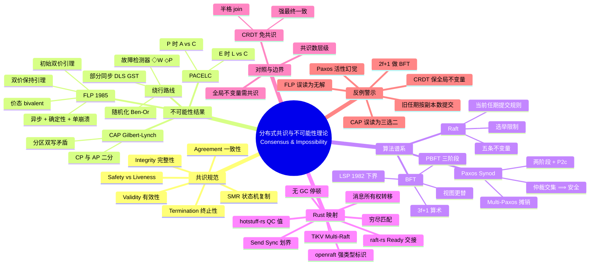

> **本节关键术语**: 共识（Consensus） · 安全性（Safety） · 活性（Liveness） · FLP 不可能性（FLP Impossibility） · 部分同步（Partial Synchrony） · 故障检测器（Failure Detector） · 法定人数（Quorum） · 拜占庭容错（Byzantine Fault Tolerance, BFT） · 状态机复制（State Machine Replication, SMR） — [完整对照表](../../00_meta/01_terminology/01_terminology_glossary.md)

# 分布式共识与不可能性理论：FLP · CAP · Paxos · Raft · BFT

> **EN**: Distributed Consensus and Impossibility Theory: FLP, CAP, Paxos, Raft, and Byzantine Fault Tolerance
> **Summary**: A formal treatment of distributed consensus — the consensus specification (agreement, validity, termination) and the safety/liveness dichotomy, the FLP impossibility proof skeleton and its circumventions (partial synchrony, failure detectors, randomization), the CAP theorem with the PACELC extension, the Paxos synod protocol and Multi-Paxos, Raft's five correctness invariants, Byzantine fault tolerance with the 3f+1 quorum arithmetic and PBFT, and how Rust's ownership type system mechanizes consensus-implementation safety in raft-rs, openraft, and hotstuff-rs.
> **Rust 版本**: 1.97.0+ (Edition 2024)
> **Bloom 层级**: L4
> **权威来源**: 本文件为 `concept/` 权威页。
> **受众**: [专家]
> **内容分级**: [综述级]
> **前置概念**: [Linearizability](./02_linearizability_and_consistency.md) · [Process Calculi](./01_process_calculi_for_rust.md) · [Actor Semantics](./03_actor_semantics.md)
> **后置概念**: [Distributed Consensus Ecosystem](../../06_ecosystem/06_data_and_distributed/06_distributed_consensus.md) · [CRDTs](../../06_ecosystem/06_data_and_distributed/08_crdt_type_zoo.md) · [Causal Ordering](../../06_ecosystem/06_data_and_distributed/09_causal_ordering_vector_clocks.md)

---

> **来源**:
> [Fischer, Lynch & Paterson 1985 — Impossibility of Distributed Consensus with One Faulty Process (FLP)](https://groups.csail.mit.edu/tds/papers/Lynch/jacm85.pdf) ·
> [Brewer 2000 — Towards Robust Distributed Systems (PODC Keynote)](https://people.eecs.berkeley.edu/~brewer/cs262b-2004/PODC-keynote.pdf) ·
> [Brewer 2012 — CAP Twelve Years Later: How the "Rules" Have Changed](https://www.infoq.com/articles/cap-twelve-years-later-how-the-rules-have-changed/) ·
> [Gilbert & Lynch 2002 — Brewer's Conjecture and the Feasibility of Consistent, Available, Partition-Tolerant Web Services](https://www.comp.nus.edu.sg/~gilbert/pubs/BrewersConjecture-SigAct.pdf) ·
> [Lamport 1998 — The Part-Time Parliament](https://lamport.azurewebsites.net/pubs/lamport-paxos.pdf) ·
> [Lamport 2001 — Paxos Made Simple](https://lamport.azurewebsites.net/pubs/paxos-simple.pdf) ·
> [Ongaro & Ousterhout 2014 — In Search of an Understandable Consensus Algorithm (Raft)](https://raft.github.io/raft.pdf) ·
> [Castro & Liskov 1999 — Practical Byzantine Fault Tolerance (PBFT)](https://pmg.csail.mit.edu/papers/osdi99.pdf) ·
> [Lamport, Shostak & Pease 1982 — The Byzantine Generals Problem](https://lamport.azurewebsites.net/pubs/byz.pdf) ·
> [Dwork, Lynch & Stockmeyer 1988 — Consensus in the Presence of Partial Synchrony](https://groups.csail.mit.edu/tds/papers/Lynch/jacm88.pdf) ·
> [Chandra & Toueg 1996 — Unreliable Failure Detectors for Reliable Distributed Systems](https://www.cs.cornell.edu/fbs/publications/DSbook.c.pdf) ·
> [Rust Standard Library — std::sync](https://doc.rust-lang.org/std/sync/) · [Rust Async Book](https://rust-lang.github.io/async-book/) ·
> [raft-rs 文档](https://docs.rs/raft) · [openraft 文档](https://docs.rs/openraft) · [hotstuff-rs 文档](https://docs.rs/hotstuff-rs/)
>
> ⚠️ **声明**: 本页呈现的是**形式理论骨架与证明直觉**，用于建立可推理的心智模型，而非机器验证的完整证明。涉及 Paxos/Raft 的不变量陈述以原始论文与 TLA+ 规范为准；Rust 代码为教学级骨架。算法生态对比、选型决策树与部署工程见 [L6 分布式共识生态页](../../06_ecosystem/06_data_and_distributed/06_distributed_consensus.md)，本页与其有显式分工（见 §5.5）。

---

## 📑 目录

- [分布式共识与不可能性理论：FLP · CAP · Paxos · Raft · BFT](#分布式共识与不可能性理论flp--cap--paxos--raft--bft)
  - [📑 目录](#-目录)
  - [一、核心概念](#一核心概念)
    - [1.1 共识问题的规范陈述](#11-共识问题的规范陈述)
    - [1.2 安全性与活性：性质的两分法](#12-安全性与活性性质的两分法)
    - [1.3 系统模型三轴：故障 × 同步 × 网络](#13-系统模型三轴故障--同步--网络)
    - [1.4 状态机复制：共识与日志的等价视角](#14-状态机复制共识与日志的等价视角)
  - [二、不可能性结果](#二不可能性结果)
    - [2.1 FLP 不可能性：模型与陈述](#21-flp-不可能性模型与陈述)
    - [2.2 FLP 证明骨架：价态与两个引理](#22-flp-证明骨架价态与两个引理)
    - [2.3 绕过 FLP 的三条路线](#23-绕过-flp-的三条路线)
    - [2.4 FLP 的适用范围与误读](#24-flp-的适用范围与误读)
  - [三、CAP 定理与 PACELC 扩展](#三cap-定理与-pacelc-扩展)
    - [3.1 从 Brewer 猜想到 Gilbert-Lynch 定理](#31-从-brewer-猜想到-gilbert-lynch-定理)
    - [3.2 证明直觉：分区双写](#32-证明直觉分区双写)
    - [3.3 Brewer 2012 的澄清：CAP 不是「三选二」](#33-brewer-2012-的澄清cap-不是三选二)
    - [3.4 PACELC：Else 分支上的延迟-一致性权衡](#34-pacelcelse-分支上的延迟-一致性权衡)
    - [3.5 与一致性谱系页的分工](#35-与一致性谱系页的分工)
  - [四、共识算法谱系](#四共识算法谱系)
    - [4.1 Paxos：Synod 单值协议](#41-paxossynod-单值协议)
    - [4.2 从 Synod 到 Multi-Paxos](#42-从-synod-到-multi-paxos)
    - [4.3 Raft：可理解性设计与五条不变量](#43-raft可理解性设计与五条不变量)
    - [4.4 拜占庭容错：3f+1 与 PBFT](#44-拜占庭容错3f1-与-pbft)
    - [4.5 谱系对比矩阵](#45-谱系对比矩阵)
  - [五、Rust 与共识](#五rust-与共识)
    - [5.1 所有权类型系统的四类助力](#51-所有权类型系统的四类助力)
    - [5.2 raft-rs：确定性内核与 Ready 交接](#52-raft-rs确定性内核与-ready-交接)
    - [5.3 openraft 与 hotstuff-rs](#53-openraft-与-hotstuff-rs)
    - [5.4 生产锚点：TiKV 与 etcd 血统](#54-生产锚点tikv-与-etcd-血统)
    - [5.5 与 L6 生态页的分工声明](#55-与-l6-生态页的分工声明)
  - [六、与 CRDT 的对照：无需共识的协调](#六与-crdt-的对照无需共识的协调)
  - [七、反命题与边界分析](#七反命题与边界分析)
    - [反例 1：用 2f+1 节点做拜占庭容错](#反例-1用-2f1-节点做拜占庭容错)
    - [反例 2：把 FLP 读成「共识在工程上无解」](#反例-2把-flp-读成共识在工程上无解)
    - [反例 3：把 CAP 读成「三选二」](#反例-3把-cap-读成三选二)
    - [反例 4：Raft 旧任期条目按副本数提交](#反例-4raft-旧任期条目按副本数提交)
    - [反例 5：假设 Paxos 保证活性](#反例-5假设-paxos-保证活性)
    - [反例 6：用 CRDT 维持全局不变量](#反例-6用-crdt-维持全局不变量)
    - [边界：共享内存对应物与共识数](#边界共享内存对应物与共识数)
  - [八、来源与延伸阅读](#八来源与延伸阅读)
  - [权威来源索引](#权威来源索引)
  - [🧠 知识结构图](#-知识结构图)
  - [对应测验](#对应测验)

---

## 一、核心概念

本节为全页建立形式语言：先精确定义共识问题的四个规范性质，再用安全性/活性二分法切分性质类型，随后明确故障、同步与网络三轴模型，最后通过状态机复制把单值共识归约为工程日志复制。

### 1.1 共识问题的规范陈述

**共识**（consensus）是分布式计算中最基本的协调问题：一组进程各自持有提议值，必须在存在故障与不确定延迟的情况下，对**同一个值**达成不可撤销的决定。其规范（specification）由四条性质组成：

```text
共识问题（单值共识，single-value consensus）：
  每个进程 p_i 持有提议值 v_i ∈ V；协议结束后输出决定值 d_i ∈ V ∪ {⊥}

  终止性（Termination）: 每个正确（correct）进程最终决定某个值        ── 活性
  一致性（Agreement）   : 任意两个正确进程的决定值相同                  ── 安全性
  完整性（Integrity）   : 每个进程至多决定一次（决定不可撤销）           ── 安全性
  有效性（Validity）    : 决定值必须是某个进程实际提议过的值             ── 安全性
                          （排除「永远输出常量」之类的平凡解）
```

三个读规范时最易忽略的要点：

1. **Agreement 只约束正确进程**。故障进程可以决定任意值——它们已经「出局」，规范不再为它们负责；
2. **Validity 是反平凡性条件**。没有它，「所有进程恒决定 0」就是一个满足其余三条的「算法」；
3. **决定是单射且不可撤销的**。这正是共识与「协商」「投票」等弱概念的界线：一旦某个正确进程宣布决定值，该值对整个系统永久固定。

工程系统几乎从不直接运行单值共识，而是运行它的**序列化推广**——对一条全序日志的每个槽位（slot）各做一次共识（见 §1.4）。此外还有一个更强的变体 **uniform agreement**（一致决定连故障进程也遵守），日志复制类协议通常直接满足它。

> **关键洞察**: 「共识」在形式上就是**对一个值的 Agreement + Validity + Termination**。本页的全部内容——不可能性结果、算法谱系、CAP——都是在问：当系统模型的某根轴（故障/同步/网络）被拨动时，这三条性质中哪一条先失守。

---

### 1.2 安全性与活性：性质的两分法

Alpern & Schneider（*Defining Liveness*, IPL 1985）给出了贯穿全页的二分法：

```text
安全性（Safety）  : 「坏事永不发生」——可被有限执行前缀证伪的性质
                    例：Agreement（一旦两个进程决定不同值，坏事已成事实）
活性（Liveness）  : 「好事终会发生」——任何有限前缀都可被延拓为满足的性质
                    例：Termination（任何有限执行都还没有「违约」，只是还没决定）

分解定理：任意执行性质都可写成 安全性 ∩ 活性。
```

把共识规范代入二分法，立刻得到一张「威胁地图」：

| 规范性质 | 类别 | 典型威胁 |
|:---|:---|:---|
| Agreement / Integrity / Validity | 安全性 | 脑裂、双主、仲裁（quorum）交集被破坏、拜占庭 equivocation |
| Termination | 活性 | FLP 式调度对抗、网络分区、超时误配、leader 抖动 |

这张表解释了分布式理论的两条主线为何如此分工：**不可能性结果几乎全部攻击活性**（FLP 证明存在永不终止的合法执行；CAP 证明分区期间可用性不可兼得），而**算法设计的大部分复杂度花在保卫安全性**（Paxos 的 P2c 规则、Raft 的选举限制、PBFT 的两阶段投票，本质上都是在调度任意恶劣时维持 Agreement）。

工程推论：评价一个共识实现时，「会不会出错的决定」（safety）与「会不会永远卡死」（liveness）是两个独立的审计问题，测试方法、形式化工具、故障注入策略都不同。

---

### 1.3 系统模型三轴：故障 × 同步 × 网络

每个分布式结果都只在**显式声明的系统模型**下成立。三轴如下：

**轴一：故障模型**（由弱到强）

```text
崩溃停止 crash-stop      : 进程停机后不再恢复（FLP 的模型）
崩溃恢复 crash-recovery  : 进程可重启，易失内存丢失，稳定存储保留（Paxos/Raft 的模型）
遗漏 omission            : 进程或链路丢失指定的发送/接收事件
拜占庭 Byzantine         : 进程行为任意：撒谎、equivocation（对不同的人说不同的话）、
                           合谋；仅假设密码学原语不被伪造（Lamport-Shostak-Pease 1982）
```

**轴二：同步模型**

```text
同步 synchronous          : 消息延迟与处理时间有已知上界 Δ、Φ
异步 asynchronous         : 无任何时间假设；调度由对抗者控制（FLP 的模型）
部分同步 partial synchrony: Dwork-Lynch-Stockmeyer 1988 —— 存在未知时刻
                            GST（Global Stabilization Time），此后延迟有未知上界；
                            或上界存在但未知。Paxos/Raft/PBFT 活性的标准假设
```

**轴三：网络与通道假设**

```text
可靠通道: 不丢、不重复、最终送达（点对点 FIFO 可选）
公平丢失: 有限次丢失，但无限重发终能送达
分区    : 节点集被切成互不通信的阵营，持续任意有限时间（CAP 的舞台）
认证    : 消息带不可伪造的来源（MAC/签名）；把「谁说的」变成可验证事实，
          改变拜占庭下界（签名模型下 LSP 1982 的 SM 算法只需 n ≥ f+2）
```

> **读论文的第一课**: 任何「X 系统实现了共识」的陈述都必须能补全成「在〈故障模型 × 同步模型 × 通道假设〉下，对至多 f 个故障实现了共识」。补全不了的陈述不是错，而是**尚未成为定理**。

---

### 1.4 状态机复制：共识与日志的等价视角

Schneider（*Implementing Fault-Tolerant Services Using the State Machine Approach*, ACM Computing Surveys 1990）建立了工程上最重要的等价视角：

```text
状态机复制（SMR）:
  确定性状态机 + 相同初始状态 + 相同输入序列 ⟹ 相同输出序列

  复制问题于是归约为「输入序列一致」问题：
    对日志槽位 i = 1, 2, 3, … 各运行一次共识实例，决定第 i 条命令

  单值共识（synod） ⟹ 日志复制（multi-consensus） ⟹ 任意确定性服务容错
```

这条归约链解释了术语格局：Paxos 的学术核心是单值 Synod 协议，而工业系统谈论的「Paxos/Raft 集群」几乎总是其 multi 形态（Multi-Paxos、Raft 日志）。本页 §4 沿此链展开；日志复制层的工程细节（快照、成员变更、读优化）见 [L6 生态页](../../06_ecosystem/06_data_and_distributed/06_distributed_consensus.md)。

---

## 二、不可能性结果

本节聚焦分布式共识最著名的否定结果：先陈述 FLP 定理及其前提，再展开价态证明骨架，随后说明如何通过部分同步、故障检测器或随机化绕过它，最后澄清其常见误读。

### 2.1 FLP 不可能性：模型与陈述

Fischer, Lynch & Paterson（*Impossibility of Distributed Consensus with One Faulty Process*, JACM 1985，简称 **FLP**）是分布式计算最著名的否定结果：

> **定理（FLP 1985）**: 在**完全异步**的消息传递系统中，进程确定、通道可靠、**至多一个进程崩溃停止**，不存在任何确定性算法能保证共识的终止性。精确地说：每个候选算法都存在一条**合法的、公平的无限执行**，其中没有任何进程做出决定。

三个必须逐字领会的限定词：

1. **完全异步**：没有任何关于消息延迟与相对处理速度的上界。对抗者（adversary）不是网络黑客，而是**调度器**——它可以任意延迟任何消息（但最终必须送达）；
2. **至多一个崩溃**：障碍不是「故障太多」，而是「**无法区分慢与死**」。一个进程不回消息，可能是崩溃，也可能只是被调度器无限推迟——异步模型内二者不可区分；
3. **确定性算法**：结论对随机化算法不成立（见 §2.3），这正是「确定性」出现在定理陈述里的原因。

直觉陈述：**终止性要求系统最终表态；异步性允许对抗者永远保持「再等等也许另一个决定也合法」的暧昧；一个潜在故障使系统无法对缺席者强制推进。** 三者合流 ⟹ 存在永远暧昧的执行。

---

### 2.2 FLP 证明骨架：价态与两个引理

FLP 的证明是分布式理论中最值得内化的论证结构。核心概念是**价态**（valency）：

```text
配置（configuration）C = ⟨全体进程状态, 在途消息缓冲⟩
事件 e = (p, m)        : 向进程 p 投递消息 m（p 随之原子地推进一步）

价态：
  0-价（0-valent）: 从 C 可达的所有决定值都是 0
  1-价（1-valent）: 从 C 可达的所有决定值都是 1
  双价（bivalent） : 从 C 既可到达决定 0 的执行，也可到达决定 1 的执行
  （「单价/双价」即 univalent/bivalent；双价 ⟺ 系统的未来尚未被锁定）
```

**引理 A（初始双价存在）**: 存在某个初始配置是双价的。

> 骨架：反设所有初始配置单价。把初始配置按提议向量排成一条链，相邻配置只相差一个进程的输入；链两端分别为全 0（由 Validity 必为 0-价）与全 1（必为 1-价），故链上必有一对相邻配置 C₀（0-价）、C₁（1-价），二者只在进程 p 的输入上不同。现在让 p 在起步前崩溃：从 C₀ 出发存在一条 p 不参与且达成决定（必为 0）的执行；该执行对 C₁ 同样合法（除 p 外状态全同，p 永不出场）⟹ 从 C₁ 也能决定 0，与 C₁ 是 1-价矛盾。

**引理 B（双价可保持）**: 任给双价配置 C 与对 C 可用的事件 e，存在一条从 C 出发、**最终交付 e** 且终点仍双价的有限执行。

> 骨架：设 𝒟 为「从 C 出发、暂不交付 e」可达的配置锥。反设「对 𝒟 中任何配置交付 e 都得到单价配置」。因 C 双价，𝒟 内同时存在 0-价后裔与 1-价后裔；取一对相邻配置 E₀ →(经 e'=(p',m'))→ E₁，使 e(E₀) 为 0-价、e(E₁) 为 1-价。
> **情形 p ≠ p'**：e 与 e' 作用于不同进程、可交换 ⟹ e(E₁) = e'(e(E₀))，即从 0-价的 e(E₀) 经一步可达 1-价配置——单价性被一步推翻，矛盾。
> **情形 p = p'**：取一条从 E₀ 出发、p 全程不参与且达成决定的有限执行 ρ（「p 可能崩溃」允许这样调度）；ρ 与 e 可交换 ⟹ 把 ρ 套到 e(E₀) 上同样达成决定，再比较价态得矛盾。
> 故锥内必有双价终点；把 e 追加在其后即可。

**结论**: 由引理 A 取双价起点，反复用引理 B，每次交付一条「最老」的待发消息（保证公平性），构造出**永远停留在双价状态**的无限公平执行 ⟹ 没有任何进程决定 ⟹ Termination 被合法地无限推迟。∎

证明的「发动机」只有一句话：**异步 + 一个潜在崩溃 ⟹ 任何关键事件都可以被推迟到系统先进入「它不起决定作用」的状态**。这与 [Actor 语义](./03_actor_semantics.md) 中「在途时间任意」的假设同源，与 [线性化](./02_linearizability_and_consistency.md) 中「并发历史可被任意交错」的对抗结构互为表里。

---

### 2.3 绕过 FLP 的三条路线

FLP 封死的是「异步 + 确定性 + 保证终止」三者的合取。松开任意一个，共识立刻复活：

| 路线 | 松开的合取支 | 模型强化 | 经典结果 | 工程对应 |
|:---|:---|:---|:---|:---|
| **部分同步** | 异步 | DLS 1988：GST 之后延迟有未知上界 | 崩溃故障 f < n/2、拜占庭 f < n/3 可解 | Paxos/Raft/PBFT 的超时与选举 |
| **故障检测器** | 异步（加强环境） | Chandra & Toueg 1996：检测器输出疑似故障名单 | ◇W（最终弱检测器）+ 多数正确即可解共识；且 ◇W 是解共识的**最弱**检测器（Chandra-Hadzilacos-Toueg 1996） | 心跳 + 超时 = 一个 ◇P 的噪声实现 |
| **随机化** | 确定性 | 进程可掷硬币 | Ben-Or 1983：异步共识以概率 1 在期望有限轮终止 | 异步 BFT（HoneyBadger 等）、Raft 的随机选举超时 |

读表时不变的方向感：**三条路线都没有「推翻」FLP，而是换了定理的前提**。Raft 的随机选举超时同时踩在第 1、3 条线上——它用随机化把对抗调度打散，用超时近似故障检测，从而在部分同步下以极大概率快速终止。

> **形式注解（部分同步的活性）**: PBFT 原文的安全性与活性是分开证的——安全性在**纯异步**下也成立（不依赖任何时间假设），活性只在 GST 之后成立。这正是「FLP 只攻击活性」的直接工程投影：优秀的共识协议把安全性做成无条件，把活性挂在最弱的时间假设上。

---

### 2.4 FLP 的适用范围与误读

FLP 的前提边界即其结论的边界：

- **它是消息传递模型的结果**。共享内存的对应物是 Loui & Abu-Amara 1987（异步读写寄存器 + 一个崩溃 ⟹ 共识不可解），以及 Herlihy 的**共识数**（consensus number）层级——不同同步原语能解决共识的进程数上界不同，见 [线性化与一致性谱系](./02_linearizability_and_consistency.md)；
- **它不排除「几乎总是终止」**。FLP 只保证存在一条病态执行；工程系统在典型调度下以压倒性概率快速终止。「不可能」与「不实用」之间隔着整个概率论；
- **它对单一崩溃即成立**，不需要拜占庭行为。把 FLP 讲成「恶意节点使共识不可能」是双重误读（故障模型错、结论强度也错）；
- **它不针对某个算法**。任何声称「在纯异步下保证终止的确定性共识算法」都等价于声称推翻 FLP——审阅此类系统时，第一件事是找出它偷偷引入的时间假设。

---

## 三、CAP 定理与 PACELC 扩展

本节从 CAP 定理的形式化出发，用分区双写直觉解释 C/A 不可兼得，再经由 Brewer 2012 的澄清把 CAP 放回正确的使用语境，最后用 PACELC 补上无分区时的延迟-一致性维度。

### 3.1 从 Brewer 猜想到 Gilbert-Lynch 定理

Brewer 在 PODC 2000 主题演讲（*Towards Robust Distributed Systems*）中提出猜想：一个共享数据系统无法同时满足——

```text
C 一致性（Consistency）   : 对客户端呈现单一最新副本（形式锚点：原子对象/线性化）
A 可用性（Availability）  : 每个到达非故障节点的请求最终都收到（非错误）响应
P 分区容忍（Partition Tolerance）: 网络任意丢失消息（被分区）时系统继续运转
```

Gilbert & Lynch（*Brewer's Conjecture and the Feasibility of Consistent, Available, Partition-Tolerant Web Services*, SIGACT News 2002）将其形式化为定理：

> **定理（Gilbert-Lynch 2002）**: 在异步网络模型中，不存在同时满足原子一致性（atomic/linearizable）与可用性的读写对象实现——只要执行中允许发生一次网络分区。

形式的锋利之处：**CAP 定理是 FLP 家族的一员**——它同样以异步模型为舞台，同样由「消息可以被任意延迟」驱动矛盾；区别在于 CAP 的对抗者是**分区**（一组消息的无限期延迟），而牺牲品的选项从「终止性」换成了「C 或 A 二选一」。

---

### 3.2 证明直觉：分区双写

Gilbert-Lynch 的核心论证只需五步：

```text
设定: 节点集被分区为 G₁、G₂，跨组消息全部延迟（合法执行）
  ① 客户端在 G₁ 执行 write(x, 1)；由可用性，写必须完成
  ② 客户端在 G₂ 执行 read(x)；由可用性，读必须完成
  ③ 分区期间 G₂ 不可能收到 ① 的任何信息 ⟹ 读只能返回旧值 v₀
  ④ 若 ① 已先于 ② 完成，原子一致性要求 ② 返回 1（最新值）
  ⑤ ③ 与 ④ 矛盾 ⟹ C ∧ A ∧ P 不可兼得 ∎
```

由此得到两个活选项，即著名的 CP/AP 二分：

- **牺牲 A（选 CP）**：分区期间少数派（或全部）拒绝服务——阻塞读写到分区愈合。共识协议（Paxos/Raft）恰是此路线的极端形态：多数派阵营继续服务，少数派阵营不可用；
- **牺牲 C（选 AP）**：两侧都继续服务，接受分歧，愈合后调和。CRDT 是此路线的最干净形态（见 §六）。

---

### 3.3 Brewer 2012 的澄清：CAP 不是「三选二」

Brewer 本人在 *CAP Twelve Years Later: How the "Rules" Have Changed*（IEEE Computer, 2012）中纠正了流行误读：

1. **P 不是可选项**。在跨越广域网的系统中分区必然发生，真正的设计空间是「分区期间在 C 与 A 之间如何取舍」，而非「要不要 P」；
2. **CAP 只在分区时刻有约束力**。无分区时 C 与 A 可同时满足——把 CAP 当作系统常态下的设计准绳是范畴错误；
3. **分区是谱系而非开关**。延迟升高与分区之间没有截然界线；工程响应也应是连续的（降级、只读模式、分歧检测与愈合流程），Brewer 称之为「分区管理模式」的显式设计。

> **判别准则**: 一个系统声称「CA」时，真实含义几乎总是「我把分区丢给了运维/数据库底层/云厂商的网络 SLA」——分区没有消失，只是被移出了该系统的责任边界。

---

### 3.4 PACELC：Else 分支上的延迟-一致性权衡

Abadi（2010 年提出，*Consistency Tradeoffs in Modern Distributed Database System Design: CAP is Only Part of the Story*, IEEE Computer 2012）指出 CAP 只覆盖了权衡空间的一半，提出 **PACELC**：

```text
if  Partition  → 在 Availability 与 Consistency 之间取舍   （CAP 覆盖的部分）
else（无分区） → 在 Latency    与 Consistency 之间取舍   （CAP 沉默的部分）
```

Else 分支的形式直觉：每次写操作若要在响应前同步跨越地理分布的副本（同步复制），延迟下界就是一个广域 RTT；若以本地响应为准（异步复制），延迟最优但副本暂时分歧。即**即使网络完美，光速本身也在征收一致性的延迟税**。

Abadi 的经典归类（按论文发表时点的默认行为；产品随版本演进，引用时应注明时点）：

| 系统 | PACELC 归类 | 含义 |
|:---|:---|:---|
| Dynamo / Cassandra / Riak / CouchDB | PA/EL | 分区时选可用，平时选低延迟（最终一致） |
| PNUTS | PC/EL | 分区时选一致，平时放宽一致性换延迟 |
| MongoDB（历史默认） | PA/EC | 分区时选可用，平时保一致（单主） |
| HBase / VoltDB / Megastore / Spanner | PC/EC | 分区时与平时都以一致为先 |

PACELC 的教学价值在于把「权衡」从一次性的 CAP 声明变为**两个正交维度上的连续旋钮**：副本放置、读写仲裁大小（N/R/W）、同步时机，每个旋钮都同时在 P 分支与 E 分支上定位系统。

---

### 3.5 与一致性谱系页的分工

CAP 中的「C」只是一致性光谱的端点（线性化/原子一致）。完整谱系——线性化、顺序一致、因果一致、最终一致的形式定义、强度排序与判定复杂度——权威页为 [线性化与一致性（Coherence）谱系](./02_linearizability_and_consistency.md)；因果一致的实现机制（向量时钟等）见 [L6 因果序页](../../06_ecosystem/06_data_and_distributed/09_causal_ordering_vector_clocks.md)。本页只消费「线性化」作为 CAP 的形式锚点，不重复谱系理论。

---

## 四、共识算法谱系

本节沿「单值共识 → 日志复制 → 拜占庭容错」的主线展开算法谱系：从 Paxos Synod 的不变量，到 Multi-Paxos 的优化，再到 Raft 的可理解性设计与 PBFT 的 3f+1 仲裁算术。

### 4.1 Paxos：Synod 单值协议

Paxos 的核心是 **Synod**（单 decree）协议——只决定**一个值**的共识。Lamport 以希腊议会为隐喻写就 *The Part-Time Parliament*（TOPLAS 1998，成稿于 1990 年前后），后以 *Paxos Made Simple*（2001）重述。模型：崩溃恢复故障、异步（安全性不依赖时间）、通道可靠可重序；2f+1 个 acceptor 容忍 f 个故障。

```text
角色: proposer / acceptor / learner（物理上可重叠）
提案 = (编号 n, 值 v)；编号全序（惯用 (轮次, proposer_id) 字典序）
acceptor 持久状态:
    promised_n   —— 已应答的最大 Prepare 编号（承诺不再响应更小编号）
    accepted     —— 已接受的最大编号提案 (n_a, v_a)

Phase 1a  Prepare(n)            proposer → acceptor 多数派
Phase 1b  Promise(n, accepted)  acceptor：若 n > promised_n，更新 promised_n ← n，
                                回告自己的 accepted（可能为空）
Phase 2a  Accept!(n, v)         proposer 收齐多数派 Promise 后按规则 P2c 选值 v：
                                  · 若应答中有人已接受过提案，取其中编号最大者的值
                                  · 否则 v 可任取（通常取自己的提议值）
Phase 2b  Accepted(n, v)        acceptor：若 n ≥ promised_n，记录 accepted ← (n, v)

选定（chosen）: 某提案被 acceptor 多数派接受 ⟹ 其值被永久选定
```

**安全性论证的不变量链**（Paxos Made Simple 的 P1/P2 系列）：

```text
P1  : acceptor 必须接受它收到的第一个提案
P2  : 若值 v 被选定，则此后被选定的任何（更大编号）提案的值也是 v
P2a : 若 v 被选定，则此后被 acceptor 接受的任何更大编号提案的值是 v      (P2a ⟹ P2)
P2b : 若 v 被选定，则此后 proposer 发出的任何更大编号提案的值是 v       (P2b ⟹ P2a)
P2c : 选值规则（上框 Phase 2a）⟹ P2b
```

**为什么多数派 ⟹ 安全**：任意两个多数派必有非空交集。设 (n,v) 已被多数派 Q 接受；更大编号 n' 的 Phase 1 必与 Q 交于某个 acceptor，该 acceptor 的 Promise 携带 (n,v)（或更晚的、由归纳同值的提案）⟹ P2c 强制 n' 选值 v ⟹ 归纳成立。**仲裁交集是 Paxos 安全性的全部支点**——这个支点在 §4.4 会被拜占庭故障腐蚀，届时需要把它加粗到 3f+1。

**活性**：Paxos 不保证终止（FLP 允许如此）。反模式见 §七反例 5 的决斗提案者（dueling proposers）执行；工程出路是选出稳定 leader 并复用 Phase 1——即 Multi-Paxos。

---

### 4.2 从 Synod 到 Multi-Paxos

Multi-Paxos 把 Synod 实例按日志槽位编号（§1.4 的归约）：

```text
slot 1 : Synod 实例 1  ⟹ 决定命令 c₁
slot 2 : Synod 实例 2  ⟹ 决定命令 c₂
  …
优化 1（leader 集中）: 由超时选举产生稳定 leader，独占提案权
优化 2（Phase 1 摊销）: leader 用同一编号对「一段连续槽位」只做一次 Phase 1，
                       之后各槽位直接跑 Phase 2 ⟹ 稳态下每条命令一次往返
缺口修补: leader 更替时，新 leader 对未定槽位重跑 Phase 1（可能补入 no-op）
```

两点常被教科书略过但审计必查：其一，**leader 只是活性优化，不是安全性前提**——两个 leader 并存时安全性仍由仲裁交集保护（只是可能谁也推进不了）；其二，「稳定 leader」假设把 Multi-Paxos 的活性明确挂到部分同步上，与 §2.3 的绕行路线精确对应。

---

### 4.3 Raft：可理解性设计与五条不变量

Raft（Ongaro & Ousterhout, *In Search of an Understandable Consensus Algorithm*, USENIX ATC 2014）目标是在**与 Multi-Paxos 等效**的前提下最大化可理解性：强 leader、问题分解（选举 / 复制 / 安全 / 成员变更）、状态空间裁剪。论文 Figure 3 给出五条**恒真**性质（对任意执行成立，即安全性骨架）：

```text
Election Safety        : 同一任期（term）至多一个 leader
                         （每节点每任期至多投一票 + 当选需多数派 ⟹ 两多数派交集 ⟹ 唯一）
Leader Append-Only     : leader 对自己的日志只追加，不覆盖、不删除
Log Matching           : 两份日志若含相同 (index, term) 的条目，则该 index 之前全部相同
                         （AppendEntries 的一致性检查归纳保证）
Leader Completeness    : 任期 T 中已提交（committed）的条目，
                         必出现在所有更高任期 leader 的日志中
State Machine Safety   : 某节点把 (index, v) 应用到状态机 ⟹
                         不存在另一节点在同 index 应用不同值
```

链条式的证明直觉：Election Restriction（RequestVote 比较 `(lastLogTerm, lastLogIndex)`，候选人日志至少与投票人一样新才获票）⊕ Election Safety ⟹ **Leader Completeness**——term T 提交 ⟹ 多数派持有；term T+1 的 leader 至少从该多数派得一票，而该投票人持有此条目且日志不比候选人新 ⟹ 候选人必已持有；对任期归纳 ⟹ 所有更高任期 leader 亦然。再由 Log Matching ⟹ State Machine Safety。

与 Paxos 的两个结构性差异（等效但不同构）：

1. **日志连续性**：Raft 的日志无空洞——新 leader 不修补旧槽位，而是强制 follower 与自己对齐；Paxos 允许槽位乱序决定、事后补洞；
2. **提交规则（§5.4.2）**：leader **只对当前任期的条目按副本数提交**；旧任期的条目随当前任期条目被间接提交（Log Matching 的推论）。为什么这条限制不可省略，见 §七反例 4。

Raft 作者随论文发布了 **TLA+ 规范**并做了关键性质的机器检查——这使 Raft 成为「论文级算法 ⟹ 机器验证规范」工作流的现代样板，其规范仓库（`raft.tla`）至今是学习共识形式化的标准入口。

---

### 4.4 拜占庭容错：3f+1 与 PBFT

**下界（LSP 1982）**：Lamport, Shostak & Pease 的拜占庭将军问题证明：口信（不可认证）模型下，容忍 f 个任意行为节点当且仅当 **n ≥ 3f+1**；n = 3, f = 1 已不可解（忠诚副官无法区分「司令叛变」与「另一副官叛变」两种对称场景）。认证（签名）模型下界降至 n ≥ f+2（LSP 的 SM 算法）。

**仲裁算术**：n = 3f+1 时取仲裁大小 q = 2f+1：

```text
|Q₁ ∩ Q₂| ≥ q + q − n = 2(2f+1) − (3f+1) = f + 1
  ⟹ 交集中至多有 f 个拜占庭节点 ⟹ 至少 1 个诚实节点
  ⟹ 诚实节点每个阶段只投一票 ⟹ 相互冲突的仲裁证书（QC）不可能同时存在
```

对照崩溃模型（n = 2f+1, q = f+1）：交集 ≥ 1 即够，因为崩溃节点不会「两边投票」。拜占庭情形必须额外买到「交集中必有诚实者」，这就是 +f 的来源。

**PBFT**（Castro & Liskov, OSDI 1999）把下界变为实用协议。模型：部分同步（DLS）、拜占庭故障、MAC 认证通道；n = 3f+1。单视图（view）内的三阶段：

```text
pre-prepare : primary 为请求分配序号 n（视图 v 内），广播 ⟨PRE-PREPARE, v, n, m⟩
prepare     : 副本广播 ⟨PREPARE, v, n, d⟩（d 为 m 的摘要）；
              集齐 pre-prepare + 2f 个匹配 PREPARE ⟹ 本地谓词 prepared(m, v, n)
              （仲裁交集 ⟹ 同一 (v, n) 不会有两个冲突值 prepared）
commit      : 广播 ⟨COMMIT, v, n, d⟩；集齐 2f+1 个匹配 COMMIT ⟹ committed-local
              （≥ f+1 个诚实副本已知 prepared ⟹ 该事实能穿越视图更替）
执行        : 按序号顺序执行已提交请求并回复客户端
```

**为什么需要两次投票**：prepared 只是**本地**知识；commit 阶段把「prepared」扩散为「至少 f+1 个诚实节点掌握」的**分布式**知识。视图更替（view change）时，2f+1 个 VIEW-CHANGE 消息各自携带 P 集（已 prepared 的证明），其交集保证新 primary 看得见一切可能已提交的值 ⟹ 安全性跨视图保持。活性在 GST 后由超时与指数退避的视图更替保证；**安全性在纯异步下也成立**（§2.3 注脚的教科书实例）。

后续工作沿两个方向演进：线性化视图更替与流水线（HotStuff，Yin et al. 2019——三链 QC、门限签名、responsiveness），以及链式/权益加权治理（Tendermint 等）。这些变体的协议细节与生态对比见 [L6 生态页](../../06_ecosystem/06_data_and_distributed/06_distributed_consensus.md)，本页不再展开。

---

### 4.5 谱系对比矩阵

| 协议 | 同步模型 | 故障模型 | 节点界 | 安全性成立条件 | 活性成立条件 | 结构特征 |
|:---|:---|:---|:---|:---|:---|:---|
| DLS 算法 | 部分同步 | 崩溃 / 拜占庭 | 2f+1 / 3f+1 | 恒成立 | GST 之后 | 理论基准（1988） |
| Paxos (Synod) | 异步（安全） | 崩溃恢复 | 2f+1 | 恒成立（仲裁交集） | 需稳定提案者 | 两阶段 + P2c 选值 |
| Multi-Paxos | 部分同步（活性） | 崩溃恢复 | 2f+1 | 恒成立 | leader 稳定（GST 后） | Phase 1 摊销、可补洞 |
| Raft | 部分同步（活性） | 崩溃恢复 | 2f+1 | 恒成立（五条不变量） | 选举成功（随机超时） | 强 leader、日志连续、§5.4.2 提交规则 |
| PBFT | 部分同步（活性） | 拜占庭（认证） | 3f+1 | 恒成立（两阶段投票） | GST 之后 + 视图更替收敛 | 三阶段 + view change |
| HotStuff | 部分同步（活性） | 拜占庭（门限签名） | 3f+1 | 恒成立（QC 链） | GST 之后；具 responsiveness | 三链 QC、线性视图更替 |

读表要诀：横向看「安全性恒成立」一列——**所有主流共识都把安全性做成无条件**；纵向看活性条件——全部挂着部分同步或随机化，即全部向 FLP「纳税」。

---

## 五、Rust 与共识

本节把共识理论映射到 Rust 实现：先分析所有权类型系统在消息传递、并发边界、GC 停顿与穷尽匹配上的四类助力，再以 raft-rs、openraft、hotstuff-rs 与 TiKV/etcd 为锚点展示工业实践。

### 5.1 所有权类型系统的四类助力

共识实现的经典事故谱（双写日志、消息发出后被原地改写、状态机并发污染、GC 停顿诱发假超时）恰好落在 Rust 类型系统的强项区。机制对应如下：

1. **消息所有权转移 ⟹ 发出即冻结**。`mpsc::send(msg)` 按值取走所有权，发送方事后无法再改写该消息；日志条目（`Entry`）在管线各阶段间移动时，同一时刻只有一个可变所有者。一类「消息发出后被本地 mutate 导致副本间摘要不一致」的缺陷在类型层**不可表达**。
2. **`Send`/`Sync` 静态划界 ⟹ 状态机单线程化由编译器执法**。共识核心（选举状态机、日志索引）若不实现 `Sync`，任何跨线程共享尝试都是编译错误；被迫共享时只能经 `Arc<Mutex<_>>` 等显式原语——数据竞争（data race）在安全 Rust 中不可表达（见 [L3 并发编程](../../03_advanced/00_concurrency/01_concurrency.md) 与 [L4 线性化页](./02_linearizability_and_consistency.md)）。
3. **无 GC 停顿 ⟹ 时间假设更可信**。Raft 论文建议选举超时取 150–300ms 量级；垃圾回收的 stop-the-world 停顿若超过心跳间隔，会把「慢」放大成「疑似死」，诱发级联选举。Rust 的确定性析构把尾延迟的来源收敛到 OS 与 IO ⟹ 「GST 之后延迟有界」这条活性假设在实现层更接近事实。
4. **穷尽性检查 ⟹ 协议演进的编译期护航**。消息类型建模为 `enum`，`match` 的穷尽性强制每个新增消息变体在所有处理站点被显式处置——协议升级（例如引入 pre-vote、leader transfer）时，编译器自动列出全部未适配点。

补充一条工程性质：**RAII 与确定性资源回收**——日志段文件、快照句柄的生命周期与所有权绑定，`Drop` 顺序显式，崩溃恢复路径上的资源状态更可推理。

```rust
/// 仲裁交集算术：为什么 CFT 用 2f+1、BFT 必须 3f+1
struct Cluster {
    nodes: usize,   // n
    quorum: usize,  // q
    max_faulty: usize, // f
}

/// 两个仲裁的交集大小下界：|Q1 ∩ Q2| ≥ q + q - n
fn intersection_lower_bound(c: &Cluster) -> usize {
    c.quorum + c.quorum - c.nodes
}

fn main() {
    // 崩溃容错（CFT）：n = 2f+1, q = f+1 ⟹ 交集 ≥ 1 ⟹ 安全（崩溃者不会两边投票）
    let cft = Cluster { nodes: 3, quorum: 2, max_faulty: 1 };
    assert!(intersection_lower_bound(&cft) >= 1);

    // 拜占庭容错（BFT）：n = 3f+1, q = 2f+1 ⟹ 交集 ≥ f+1 ⟹ 至少一个诚实节点
    let bft = Cluster { nodes: 4, quorum: 3, max_faulty: 1 };
    let honest_in_intersection = intersection_lower_bound(&bft) - bft.max_faulty;
    assert!(honest_in_intersection >= 1);

    // 反例（详见 §七反例 1）：n = 2f+1 用于拜占庭 ⟹ 交集可能全是拜占庭节点
    let bad = Cluster { nodes: 3, quorum: 2, max_faulty: 1 };
    assert!(intersection_lower_bound(&bad) <= bad.max_faulty);
}
```

---

### 5.2 raft-rs：确定性内核与 Ready 交接

[raft-rs](https://docs.rs/raft)（TiKV 出品，移植自 etcd-io/raft）把共识内核做成**纯状态机**：不自带线程、不直接做 IO。调用方通过 `Ready` 结构一次性领走本轮全部副作用——待发送消息、待持久化的条目与硬状态（hard state）、待应用的已提交条目——执行完 IO 后调用 `advance()` 回报进度：

```rust,ignore
// raft-rs 风格的驱动循环骨架（教学简化，非真实 API）
loop {
    if let Some(ready) = raft_group.ready() {
        transport.send(ready.messages());            // ① 先发消息
        storage.append(ready.entries());             // ② 再持久化日志与硬状态
        sm.apply(ready.committed_entries());         // ③ 最后应用已提交条目
        raft_group.advance(ready);                   // ④ 推进内核水位
    }
}
```

类型层由此**物化了两条协议纪律**：其一，「先持久化、后推进」的顺序由 `Ready`/`advance` 的所有权交接强制——跳过 ② 直接 ③，编译能过但语义上违反崩溃恢复前提，审计时 `Ready` 的字段即检查清单；其二，内核确定性 ⟹ **可用确定性模拟测试**（注入消息丢失/重排/延迟，重放同一调度种子复现）——这是把 FLP 的对抗调度「驯化为测试用例」的工程实践。

---

### 5.3 openraft 与 hotstuff-rs

- [openraft](https://docs.rs/openraft)（datafuselabs 维护）：异步 Raft；截至 2026-07，0.9 线为稳定维护线，0.10 线处于 alpha（最新 `0.10.0-alpha.29`）。其类型设计的标志是把协议标识建模为强类型——`Vote`、`LeaderId`/`CommittedLeaderId`、`LogId` 各自成类，杜绝「任期与日志索引混用」这类整数混淆缺陷；存储层以 `RaftStorage`/`RaftLogStorage` 等 trait 契约表达，存储实现的错误被 trait 边界局部化、可独立审计。复制状态机的业务接入面同样以 `RaftStateMachine` trait 显式化。openraft 已被 Databend、Danube 等生产系统用作元数据共识层。
- [hotstuff-rs](https://docs.rs/hotstuff-rs/)：HotStuff 谱系的 Rust 实现。其中心抽象是**仲裁证书（Quorum Certificate, QC）作为一等值**：QC 由门限签名聚合而成、按所有权在视图间传递，「证书不可伪造 + 证书单所有者」分别由密码学与类型系统各管一半。

两个实现共享的 Rust 模式：**把协议不变量尽量搬进类型**（typestate/强标识/证书值），剩下搬不进的（活性、时序）交给确定性测试与运行时断言。

```rust,ignore
// Typestate 模式：把 Raft 角色变迁搬进类型系统（教学骨架）
struct Follower { term: u64, voted_for: Option<NodeId> }
struct Candidate { term: u64, votes_granted: u32 }
struct Leader { term: u64, next_index: Vec<u64>, match_index: Vec<u64> }

impl Follower {
    /// 超时发起选举：消费 Follower，产出 Candidate —— 旧角色不再可用
    fn start_election(self) -> Candidate {
        Candidate { term: self.term + 1, votes_granted: 1 /* 自投 */ }
    }
}

impl Candidate {
    /// 集齐多数票：消费 Candidate，产出 Leader —— 当选前无法执行 leader 专属操作
    fn become_leader(self, peers: usize) -> Option<Leader> {
        if self.votes_granted as usize > peers / 2 {
            Some(Leader { term: self.term, next_index: vec![], match_index: vec![] })
        } else {
            None
        }
    }
}
```

---

### 5.4 生产锚点：TiKV 与 etcd 血统

- **TiKV**：生产级分布式 KV，以 raft-rs 支撑 **Multi-Raft** 架构——数据按 Region 分片，每片一个独立 Raft 组；单进程承载数万共识实例，其稳定性记录是「Rust 适合实现共识」最有力的工业证据。
- **etcd**：其 `etcd-io/raft`（Go）是 raft-rs 的移植源头；raft-rs 在保持协议等价的同时把驱动接口（`Ready` 交接）进一步显式化。etcd 本身作为 Kubernetes 的元数据底座，是 Multi-Paxos/Raft 谱系在「配置与选主」场景的标准参照。
- 横向生态（客户端、云原生集成、更多 BFT 实现如 tendermint-rs）的系统盘点属生态页职责，见 [L6 分布式共识生态](../../06_ecosystem/06_data_and_distributed/06_distributed_consensus.md)。

---

### 5.5 与 L6 生态页的分工声明

为避免双权威页（AGENTS.md §2），本页与 [L6 分布式共识生态页](../../06_ecosystem/06_data_and_distributed/06_distributed_consensus.md) 的分工如下：

| 维度 | 本页（L4 权威） | L6 生态页（权威） |
|:---|:---|:---|
| 不可能性结果 | FLP 证明骨架、DLS/故障检测器/随机化绕行、Gilbert-Lynch 证明 | 结论速览与工程含义 |
| 协议 | Paxos/Raft/PBFT 的不变量与安全性论证 | 协议机制教程、对比、选型决策树 |
| Rust 映射 | 所有权/类型系统 ⟹ 实现安全的机制分析 | crate 用法、边界测试、嵌入式测验 |
| 谱系 | CRDT 的「免共识」形式对照（§六） | CRDT 类型谱系与因果序实现（08/09 页） |

---

## 六、与 CRDT 的对照：无需共识的协调

CRDT（Conflict-free Replicated Data Type，Shapiro et al. 2011）给出了 CAP 天平上 AP 端的最干净形式解：**根本不做共识**。

```text
形式基座（state-based CRDT）:
  状态集 S 配备偏序 ⊑ 与合并运算 ⊔，(S, ⊑, ⊔) 构成 join-半格：
    ⊔ 满足交换律、结合律、幂等律；merge(a, b) = a ⊔ b（最小上界）
  单调性: 更新只使状态沿 ⊑ 上升

强最终一致性（SEC）:
  收到过同一批更新的任意两副本，状态必相等（半格性质直接推出）
  —— 无需任何仲裁、选举或轮次同步
```

与共识的形式对照：

| 维度 | 共识（Paxos/Raft/PBFT） | CRDT |
|:---|:---|:---|
| 安全性的支点 | 仲裁交集 ⟹ 全系统对单值/全序日志的 Agreement | 半格 join ⟹ 各副本状态的汇合（convergence） |
| 分区期间写 | 少数派阻塞（CP） | 永远可写（AP） |
| 节点/延迟代价 | ≥ 2f+1（或 3f+1），写 ≥ 一次仲裁往返 | 无协调，本地延迟 |
| 能力边界 | 可维持**全局不变量**（唯一性、余额非负……） | 只能表达与半格兼容的不变量（见 §七反例 6） |

结论不是「CRDT 取代共识」，而是**分层**：能用半格表达的不变量下放给 CRDT（购物车、计数器、在线状态），必须全局仲裁的不变量上浮给共识（账号余额、唯一用户名、租约）。CRDT 的类型谱系（G-Counter、PN-Counter、OR-Set、RGA……）见 [L6 CRDT 谱系页](../../06_ecosystem/06_data_and_distributed/08_crdt_type_zoo.md)；其下的因果一致层见 [因果序与向量时钟](../../06_ecosystem/06_data_and_distributed/09_causal_ordering_vector_clocks.md)。

---

## 七、反命题与边界分析

本节通过经典反例与边界讨论防止共识理论的误用：从拜占庭仲裁算术、FLP 与 CAP 的误读，到 Raft 提交规则与 CRDT 能力边界，最后衔接共享内存的共识数层级。

### 反例 1：用 2f+1 节点做拜占庭容错

**反命题**: 「多数派 ⟹ 安全」与故障模型无关，n = 2f+1 足以容忍 f 个拜占庭节点。

**反驳**（具体执行，n = 3, f = 1, q = 2）：拜占庭节点 B  equivocate——

```text
提案 X : A 投 X，B 投 X   ⟹ {A, B} 构成仲裁 ⟹ X 被选定
提案 Y : C 投 Y，B 投 Y   ⟹ {C, B} 构成仲裁 ⟹ Y 被选定
  两个仲裁的交集 = {B}，而 B 恰恰是说谎者 ⟹ 交集约束失效
  ⟹ Agreement 被破坏：诚实的 A 与 C 各自认为不同值已选定
```

n = 2f+1 时交集下界只有 1（§5.1 代码中 `bad` 分支），这 1 个节点可能恰好拜占庭。3f+1 的本质是把交集下界买到 f+1，**保证交集中坐着至少一个诚实节点**。凡以「多数派」为理由压缩 BFT 节点的设计，都是在复刻此反例。

---

### 反例 2：把 FLP 读成「共识在工程上无解」

**反命题**: FLP 证明了共识不可能，所以 Paxos/Raft 之类只是「碰巧能用」。

**反驳**: FLP 量词是**存在一条对抗调度**——证明构造的执行要求调度器无限期精确维持双价（§2.2），这类执行在现实时序分布下概率趋于零；且 FLP 的合取前提中任何一支被松开（部分同步/故障检测器/随机化，§2.3），共识即在严格数学意义下可解。Paxos/Raft 不是「绕过定理的运气」，而是**换了定理前提的合法解**。反向应用同样重要：审计一个声称「纯异步、确定性、保证终止」的共识方案时，结论应直接是「前提中必有隐藏的时间假设」，而不是「FLP 错了」。

---

### 反例 3：把 CAP 读成「三选二」

**反命题**: 系统设计时可以自由放弃 P，做一套「CA 系统」。

**反驳**: 在跨节点部署中分区不是设计选项而是环境事实（Gilbert-Lynch 的形式化里，「允许一次分区」是执行空间的合法成员）。宣称 CA 的系统在分区时刻必然沉默地滑落进 CP 或 AP——典型失败形态是**双主脑裂**：

```text
主备数据库 + 故障转移组件：
  ① 主库 P₁ 与备库 P₂ 间网络分区（双方均存活，仅互不可达）
  ② 故障转移判定 P₁「死亡」，把 P₂ 提升为新主 ⟹ 双主并存
  ③ 两侧继续接受写 ⟹ 数据分歧；分区愈合后无法无冲突合并
  —— 系统并未「选择了 CA」，而是在分区时刻被动放弃了 C
```

Brewer 2012 的正解（§3.3）：把分区作为一等设计场景，显式规定分区期间行为与愈合策略；PACELC（§3.4）进一步补上无分区时的延迟-一致性旋钮。

---

### 反例 4：Raft 旧任期条目按副本数提交

**反命题**: leader 只要看到某条目已复制到多数派，就可以提交它——无论该条目写于哪个任期。

**反驳**（Raft 论文 Figure 8 的经典场景，五台服务器 S1–S5）：

```text
(a) term 2: S1 为 leader，把条目 (index 2, term 2) 复制到 S2 后崩溃
(b) term 3: S5 获 S3、S4、S5 的票当选（其日志只到 index 1），
    在 index 2 写入自己的条目 (index 2, term 3)，随后崩溃
(c) term 4: S1 重启当选，把 (index 2, term 2) 复制到 S3
    ⟹ 该条目已在 {S1, S2, S3} 多数派上 —— 若允许「按副本数提交旧任期条目」，
       此刻它将被标记为已提交
(d) term 5: S1 崩溃；S5 发起选举 —— 其最后条目 (index 2, term 3) 的任期
    高于 S2/S3 的 term 2 ⟹ S2、S3、S4 投票 ⟹ S5 当选，
    用 (index 2, term 3) 覆盖各副本的 index 2
    ⟹ 一条「已提交」的条目被覆盖 ⟹ State Machine Safety 崩塌
```

修复即 §4.3 的提交规则：**leader 只对当前任期的条目按副本数提交**；上例 (c) 中 term-4 的 S1 不会提交 term-2 的条目，(d) 的覆盖因此合法。该规则是「选举限制 ⟹ Leader Completeness」证明链上不可拆除的一环——这也展示了为什么共识协议的安全性必须整体审计：单看每一条都「显然合理」的局部规则，组合起来才构成不变量。

---

### 反例 5：假设 Paxos 保证活性

**反命题**: Paxos 是对的共识算法 ⟹ 部署后集群总能推进。

**反驳**（决斗提案者执行）：

```text
P1: Prepare(n₁) 获多数派 Promise
P2: Prepare(n₂ > n₁) 获多数派 Promise   （抢在 P1 的 Accept 之前）
P1: Accept!(n₁, ·) 被多数派拒绝（已承诺 n₂）→ P1 改用 n₃ > n₂ 重新 Prepare …
P2: Accept!(n₂, ·) 被多数派拒绝（已承诺 n₃）→ …
⟹ 双方无限交替抬高编号，没有任何提案进入接受阶段 —— 合法的活性失败
```

Paxos 论文对此完全诚实：Synod 只证安全性。活性来自协议外的补强——稳定 leader（Multi-Paxos 的 Phase 1 摊销同时消除了提案权竞争）加部分同步假设（§2.3）。「正确性」包含活性承诺的宣传口径，本身就是需要被本反例纠正的语义漂移。

---

### 反例 6：用 CRDT 维持全局不变量

**反命题**: CRDT 保证收敛 ⟹ 把账户余额建模为 PN-Counter，分布式扣款天然安全。

**反驳**：收敛 ≠ 不变量保持。

```text
余额 100，副本 R₁、R₂ 分区：
  R₁: withdraw(80) 本地通过（100−80=20 ≥ 0）
  R₂: withdraw(80) 本地通过（100−80=20 ≥ 0）
愈合: merge 后余额 = −60 —— 状态完美收敛，「余额 ≥ 0」被永久违反
```

「余额非负」是**全局**不变量：判定一次扣款是否合法需要知道全系统的扣款总量，而分区期间这恰恰不可知（CAP 的又一次显形）。可行出路只有三类：上浮给共识（对账户串行化）、escrow/预留式分解（把额度预先切片下放，牺牲可用性换不变量）、或接受溢出并事后补偿（业务层对账）。选型矩阵与 CRDT 类型能力边界见 [L6 CRDT 谱系页](../../06_ecosystem/06_data_and_distributed/08_crdt_type_zoo.md)。

---

### 边界：共享内存对应物与共识数

本页全部结果站在**消息传递**模型上。共享内存世界的平行理论：Loui & Abu-Amara 1987 证明异步读写寄存器 + 单崩溃下共识不可解；Herlihy 1991 的**共识数**（consensus number）把同步原语按「能解决几进程共识」分层——读写寄存器为 1，test-and-set/队列等为 2，compare-and-swap 为 ∞。这条线与 [线性化页](./02_linearizability_and_consistency.md) 的无锁结构谱系直接衔接，构成「单机并发」与「分布式共识」在不可能性层面的镜像。

---

## 八、来源与延伸阅读

本页作为 `concept/04_formal/07_concurrency_semantics/` 中分布式共识**形式理论**的唯一权威深度页，与相邻页形成如下分工：

- [进程代数与 Rust](./01_process_calculi_for_rust.md)：通信结构（通道、互模拟）的形式根基——本页的消息传递模型是其分布式投影；
- [线性化与一致性谱系](./02_linearizability_and_consistency.md)：CAP 中「C」的完整光谱、共识数与无锁结构；
- [Actor 模型形式语义](./03_actor_semantics.md)：「在途时间任意」假设与崩溃-监督语义的另一支传统；
- [代数效应与效应处理器](./04_algebraic_effects.md)：同层相邻页，效应作为可解释请求的形式化；
- [L6 分布式共识生态](../../06_ecosystem/06_data_and_distributed/06_distributed_consensus.md)：算法机制教程、Rust 生态、选型决策树与边界测试（§5.5 分工声明）；
- [L6 CRDT 谱系](../../06_ecosystem/06_data_and_distributed/08_crdt_type_zoo.md) 与 [L6 因果序](../../06_ecosystem/06_data_and_distributed/09_causal_ordering_vector_clocks.md)：免共识路线的完整展开；
- [L3 并行与分布式模式谱系](../../03_advanced/00_concurrency/08_parallel_distributed_pattern_spectrum.md)：工程谱系导航视角。

进阶阅读顺序建议：FLP 原文（只需前 4 节）⟹ Gilbert & Lynch 2002 ⟹ Paxos Made Simple ⟹ Raft 论文（含 §5.4 与 Figure 8）⟹ Castro & Liskov 1999 ⟹ DLS 1988 与 Chandra-Toueg 1996（活性理论收口）⟹ HotStuff 2019（BFT 的现代形态）。

---

## 权威来源索引

- Fischer, M. J., Lynch, N. A. & Paterson, M. S. *Impossibility of Distributed Consensus with One Faulty Process*. JACM 32(2), 1985. [PDF](https://groups.csail.mit.edu/tds/papers/Lynch/jacm85.pdf)
- Brewer, E. A. *Towards Robust Distributed Systems*. PODC 2000 Keynote. [PDF](https://people.eecs.berkeley.edu/~brewer/cs262b-2004/PODC-keynote.pdf)
- Brewer, E. A. *CAP Twelve Years Later: How the "Rules" Have Changed*. IEEE Computer 45(2), 2012. [InfoQ 全文](https://www.infoq.com/articles/cap-twelve-years-later-how-the-rules-have-changed/)
- Gilbert, S. & Lynch, N. *Brewer's Conjecture and the Feasibility of Consistent, Available, Partition-Tolerant Web Services*. SIGACT News 33(2), 2002. [PDF](https://www.comp.nus.edu.sg/~gilbert/pubs/BrewersConjecture-SigAct.pdf)
- Abadi, D. *Consistency Tradeoffs in Modern Distributed Database System Design: CAP is Only Part of the Story*. IEEE Computer 45(2), 2012.
- Lamport, L. *The Part-Time Parliament*. ACM TOPLAS 16(2), 1998. [PDF](https://lamport.azurewebsites.net/pubs/lamport-paxos.pdf)
- Lamport, L. *Paxos Made Simple*. ACM SIGACT News 32(4), 2001. [PDF](https://lamport.azurewebsites.net/pubs/paxos-simple.pdf)
- Ongaro, D. & Ousterhout, J. *In Search of an Understandable Consensus Algorithm (Extended Version)*. USENIX ATC 2014. [PDF](https://raft.github.io/raft.pdf) · [Raft TLA+ 规范](https://github.com/ongardie/raft.tla)
- Castro, M. & Liskov, B. *Practical Byzantine Fault Tolerance*. OSDI 1999. [PDF](https://pmg.csail.mit.edu/papers/osdi99.pdf)
- Lamport, L., Shostak, R. & Pease, M. *The Byzantine Generals Problem*. ACM TOPLAS 4(3), 1982. [PDF](https://lamport.azurewebsites.net/pubs/byz.pdf)
- Dwork, C., Lynch, N. & Stockmeyer, L. *Consensus in the Presence of Partial Synchrony*. JACM 35(2), 1988. [PDF](https://groups.csail.mit.edu/tds/papers/Lynch/jacm88.pdf)
- Chandra, T. D. & Toueg, S. *Unreliable Failure Detectors for Reliable Distributed Systems*. JACM 43(2), 1996.
- Chandra, T. D., Hadzilacos, V. & Toueg, S. *The Weakest Failure Detector for Solving Consensus*. JACM 43(4), 1996.
- Ben-Or, M. *Another Advantage of Free Choice: Completely Asynchronous Agreement Protocols*. PODC 1983.
- Schneider, F. B. *Implementing Fault-Tolerant Services Using the State Machine Approach: A Tutorial*. ACM Computing Surveys 22(4), 1990.
- Alpern, B. & Schneider, F. B. *Defining Liveness*. Information Processing Letters 21(4), 1985.
- Herlihy, M. *Wait-Free Synchronization*. ACM TOPLAS 13(1), 1991.
- Yin, M., Malkhi, D., Reiter, M. K., Gueta, G. G. & Abraham, I. *HotStuff: BFT Consensus with Linearity and Responsiveness*. PODC 2019. [arXiv](https://arxiv.org/abs/1803.05069)
- Shapiro, M., Preguiça, N., Baquero, C. & Zawirski, M. *Conflict-free Replicated Data Types*. SSS 2011.
- [raft-rs 文档](https://docs.rs/raft) · [openraft 文档](https://docs.rs/openraft) · [hotstuff-rs 文档](https://docs.rs/hotstuff-rs/) · [etcd-io/raft](https://github.com/etcd-io/raft) · [TiKV](https://github.com/tikv/tikv)

> **相关文件**: [同层：进程代数](./01_process_calculi_for_rust.md) · [同层：线性化](./02_linearizability_and_consistency.md) · [同层：Actor 语义](./03_actor_semantics.md) · [L6 分布式共识生态](../../06_ecosystem/06_data_and_distributed/06_distributed_consensus.md) · [L6 CRDT 谱系](../../06_ecosystem/06_data_and_distributed/08_crdt_type_zoo.md)
>
> **文档版本**: 1.0 ｜ **最后更新**: 2026-07-16 ｜ **状态**: ✅ 新建（Rust 1.97 对齐）

## 🧠 知识结构图



> **认知功能**: 本知识结构图把分布式共识理论拆为「规范—不可能性—算法—Rust 映射—对照边界」五维：先立规范与性质二分，再用 FLP/CAP 划定理边界，随后沿仲裁交集一条主线串起 Paxos/Raft/PBFT，最后落到 Rust 类型系统的实现安全机制与 CRDT 对照。建议与 [L6 生态页](../../06_ecosystem/06_data_and_distributed/06_distributed_consensus.md) 的工程视角并读：本页回答「为什么必须如此」，生态页回答「怎么用」。

---

## 对应测验

完成 [L3 语义模型与跨语言对比测验](../../03_advanced/00_concurrency/10_quiz_semantic_models.md) 验证对分布式共识、STM、代数效应、依赖/细化类型与语言语义模型矩阵的掌握程度（15 题：🟢3 / 🟡10 / 🔴2）。
