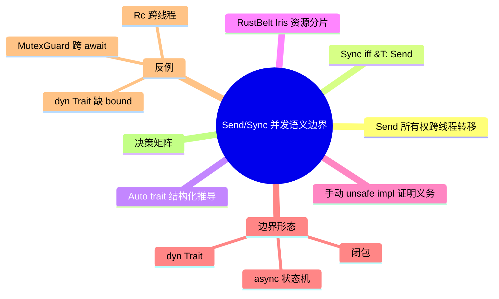

# Send/Sync 并发语义边界

**EN**: Concurrency Semantics of Send and Sync
**Summary**: 从 Rust Reference、Rustonomicon 与 RustBelt/Iris 三个层面，形式化 `Send` 与 `Sync` 的语义边界：所有权跨线程转移、共享引用跨线程共享，以及手动实现时的证明义务。

> **Rust 版本**: 1.97.0+ (Edition 2024)
> **Bloom 层级**: L4-L5
> **A/S/P 标记**: **S+P** — Structure + Procedure
> **权威来源**: 本文件为 `concept/` 权威页（Send/Sync 并发语义边界的 canonical 入口）。
> **最后更新**: 2026-07-31
>
> **前置概念**:
> [Send/Sync 边界判定](../../03_advanced/00_concurrency/04_send_sync_boundaries.md) ·
> [Send 与 Sync：Auto Trait 的并发安全契约](../../03_advanced/00_concurrency/02_send_sync_auto_traits.md) ·
> [原子操作与内存序](../../03_advanced/00_concurrency/06_atomics_and_memory_ordering.md) ·
> [RustBelt 与验证工具链](../02_separation_logic/01_rustbelt.md)
> **后置概念**:
> [形式化 unsafe 契约](../01_ownership_logic/07_unsafe_contracts_formal.md) ·
> [内存序与原子操作形式语义](../09_system_semantics/08_memory_ordering_and_atomics.md) ·
> [async/await 状态机的操作语义](../03_operational_semantics/11_async_state_machine_semantics.md)
>
> **国际权威来源**:
> [Rust Reference — Send and Sync](https://doc.rust-lang.org/reference/special-types-and-traits.html) ·
> [Rustonomicon — Send and Sync](https://doc.rust-lang.org/nomicon/send-and-sync.html) ·
> [std::marker::Send](https://doc.rust-lang.org/std/marker/trait.Send.html) ·
> [std::marker::Sync](https://doc.rust-lang.org/std/marker/trait.Sync.html) ·
> [RustBelt — POPL 2018](https://plv.mpi-sws.org/rustbelt/popl18/)

---

## 0. 核心语义

Rust 并发安全由两个 unsafe auto trait 刻画：

```text
T: Send  ⟺  T 的所有权可以安全地转移到另一个线程。
T: Sync  ⟺  &T: Send  ⟺  T 的共享引用可以安全地跨线程共享。
```

关键推论：

- `Send` 管**独占转移**；`Sync` 管**共享引用**。二者互不蕴含。
- `T: Sync` 并不要求 `T: Send`（例如 `MutexGuard<T>` 在某些情形下可能 `Sync` 但不是 `Send`）。
- 对复合类型，结构化规则成立：一个类型是 `Send`/`Sync` 当且仅当它的所有字段/变体都是。

---

## 1. Auto Trait 的结构化推导

`Send` 与 `Sync` 是 `unsafe auto trait`。编译器按字段递归推导：

```text
struct S<T> { a: A, b: B<T> }
S<T>: Send  ⟺  A: Send ∧ B<T>: Send
S<T>: Sync  ⟺  A: Sync ∧ B<T>: Sync
```

`auto` 意味着通常无需手写 `impl`；只要所有组成部分满足，编译器自动给出实现。一旦某组成部分不满足（如 `Rc`、裸指针、线程局部句柄），整个复合类型就自动失去对应实现。

---

## 2. RustBelt/Iris 视角：Send/Sync 即资源分片

在 RustBelt 中，并发安全定理 T1（无数据竞争）的证明依赖于 `Send`/`Sync` 的语义解释：

- `T: Send` ⇔ 独占资源 `own(T)` 可以跨线程**移动**而不破坏 Iris 不变量。
- `T: Sync` ⇔ 共享资源 `shr(κ, T)` 可以跨线程**共享**，所有通过 `&T` 的访问都满足 happens-before 或原子性。

RustBelt 的核心结论：

```text
在 λRust 操作语义下，
若所有 unsafe 库满足 Iris 协议，
则 safe Rust 程序无数据竞争。
```

---

## 3. 手动 `unsafe impl` 的证明义务

当编译器无法从字段结构推导出 `Send`/`Sync` 时（例如包含 `UnsafeCell`、裸指针、FFI 句柄），可以手动实现，但程序员必须证明：

### 3.1 Send 契约

1. 所有权转移后，原线程不再通过任何路径访问该值。
2. `drop` 在新线程执行不会破坏线程安全不变量。
3. 内部不含线程亲和性资源（如线程局部存储、mutex 所有权绑定到线程 ID）。

### 3.2 Sync 契约

1. 所有通过 `&T` 触发的修改都经过同步原语（如 `Mutex`、`Atomic`）或满足 happens-before 序。
2. 不存在通过 `&T` 得到 `&mut U` 的未同步路径。
3. 共享引用可安全地发送给多个线程并发持有。

错误的 `unsafe impl` 会破坏 fearless concurrency 保证，形成编译期无法检测的数据竞争。

---

## 4. 边界形态：Trait Objects、闭包、Async 状态机

### 4.1 `dyn Trait`

```text
dyn Trait         不自动实现 Send/Sync
dyn Trait + Send  实现 Send
dyn Trait + Sync  实现 Sync
dyn Trait + Send + Sync  同时实现 Send 与 Sync
```

`Arc<dyn Trait + Send + Sync>` 是跨线程 trait object 的标准模式；仅写 `dyn Trait + Send` 会使 `Arc<T>` 不满足 `Send`。

### 4.2 闭包

闭包是否 `Send`/`Sync` 完全由捕获变量决定：

```text
closure: Send  ⟺  所有捕获变量都是 Send
closure: Sync  ⟺  所有捕获变量都是 Sync
```

### 4.3 Async 状态机

`async fn` 生成的 Future 是否 `Send`，取决于状态机暂停时保存的所有字段是否 `Send`。典型反例：`MutexGuard` 跨 await 导致 Future `!Send`。

---

## 5. 反例

### 5.1 `Rc` 跨线程

```rust,compile_fail,E0277
use std::rc::Rc;
use std::thread;

fn main() {
    let rc = Rc::new(42);
    thread::spawn(move || {
        println!("{}", *rc);
    }).join().unwrap();
}
```

`Rc<T>` 使用非原子引用计数，跨线程转移/析构会导致计数竞争。修复：换用 `Arc<T>`。

### 5.2 `MutexGuard` 跨 await

```rust,compile_fail
use std::future::pending;
use std::sync::Mutex;

fn assert_send<T: Send>(_: T) {}

async fn work(m: Mutex<i32>) {
    let g = m.lock().unwrap();
    pending::<()>().await;
    drop(g);
}

fn main() {
    assert_send(work(Mutex::new(0)));
}
```

Future 状态机在挂起点保存了 `MutexGuard<i32>`，而该类型 `!Send`。

### 5.3 `dyn Trait` 缺少 `+ Send + Sync`

```rust,compile_fail,E0277
use std::sync::Arc;

trait Worker {}
struct Concrete;
impl Worker for Concrete {}

fn spawn_dyn(w: Arc<dyn Worker>) {
    std::thread::spawn(move || {
        drop(w);
    });
}
```

修复：参数类型改为 `Arc<dyn Worker + Send + Sync>`。

---

## 6. 决策矩阵

| 类型形式 | 判定 `Send` 的方法 | 判定 `Sync` 的方法 | 常见陷阱 |
|---|---|---|---|
| 普通 struct / enum | 所有字段 `Send` | 所有字段 `Sync` | 含 `Rc`、`Cell`、`RefCell`、`UnsafeCell`、裸指针 |
| `dyn Trait` | 必须写 `+ Send` | 必须写 `+ Sync` | 默认不实现 |
| 闭包 | 捕获变量全 `Send` | 捕获变量全 `Sync` | `move` 捕获 `Rc` |
| `async {}` / `async fn` | 状态机字段全 `Send` | 状态机字段全 `Sync` | `MutexGuard`、自引用、`Rc` 跨 await |
| 手动 `unsafe impl` | 证明转移与析构安全 | 证明共享引用访问同步 | 错误 impl 引入不可检测竞争 |

---

## 7. 国际权威来源

- [Rust Reference — Send and Sync](https://doc.rust-lang.org/reference/special-types-and-traits.html)
- [Rustonomicon — Send and Sync](https://doc.rust-lang.org/nomicon/send-and-sync.html)
- [std::marker::Send](https://doc.rust-lang.org/std/marker/trait.Send.html)
- [std::marker::Sync](https://doc.rust-lang.org/std/marker/trait.Sync.html)
- [RustBelt: Securing the Foundations of the Rust Programming Language, POPL 2018](https://plv.mpi-sws.org/rustbelt/popl18/)
- [Lamport — Time, Clocks, and the Ordering of Events in a Distributed System, CACM 1978](https://doi.org/10.1145/359545.359563)

---

## 8. 思维导图


