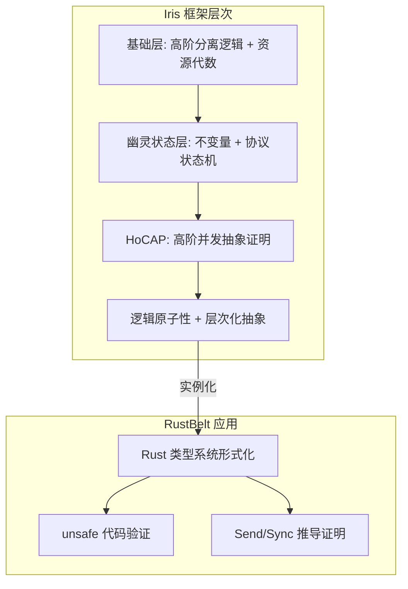
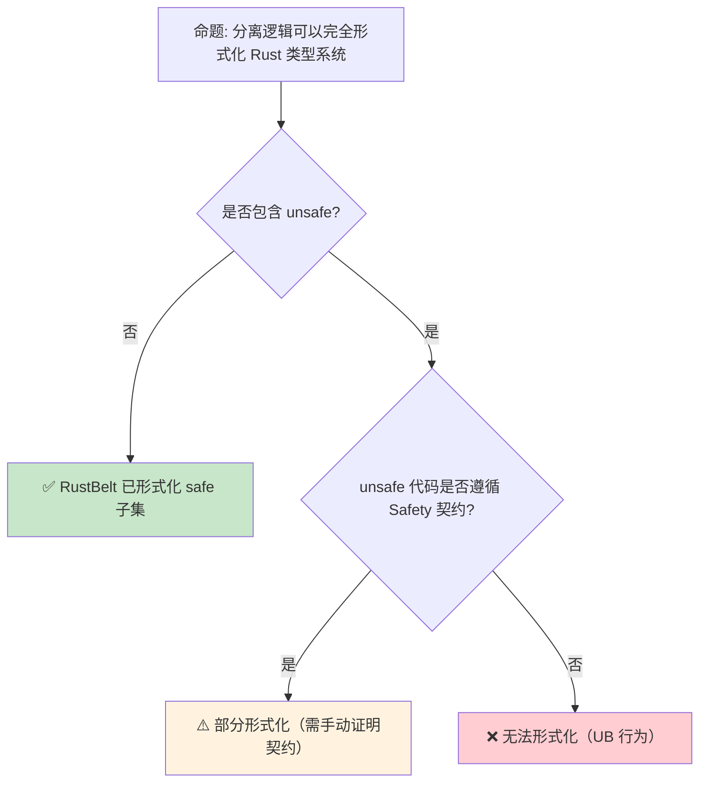

# 分离逻辑：并发安全的指针推理系统

> **Bloom 层级**: 分析 → 评价
> **定位**: 介绍 **分离逻辑（Separation Logic, SL）**——由 John Reynolds 和 Peter O'Hearn 发展的用于推理指针程序和并发程序的模态逻辑。分析 SL 如何为 Rust 的 ownership + borrowing 提供形式化语义根基，以及 Iris 框架如何将 SL 扩展到高阶并发程序。
> **前置概念**: [Ownership Formal](./03_ownership_formal.md) · [Concurrency](../03_advanced/01_concurrency.md)
> **后置概念**: [RustBelt](./04_rustbelt.md) · [Type Theory](./02_type_theory.md)

---

> **来源**: [Reynolds 2002 — Separation Logic](https://www.cs.cmu.edu/~jcr/seplogic.pdf) · [O'Hearn 2019 — Separation Logic](https://doi.org/10.1145/3211968) · [Iris Framework](https://iris-project.org/) · [RustBelt Paper](https://doi.org/10.1145/3158154) · [Wikipedia — Separation Logic](https://en.wikipedia.org/wiki/Separation_logic)

## 📑 目录
> [来源: [Rust Reference](https://doc.rust-lang.org/reference/)]
>
> [来源: [TRPL](https://doc.rust-lang.org/book/)]

- [分离逻辑：并发安全的指针推理系统](#分离逻辑并发安全的指针推理系统)
  - [📑 目录](#-目录)
  - [一、核心概念](#一核心概念)
    - [1.1 霍尔逻辑与指针的困境](#11-霍尔逻辑与指针的困境)
    - [1.2 分离合取：\* 算子](#12-分离合取-算子)
    - [1.3 帧规则与局部推理](#13-帧规则与局部推理)
  - [二、技术细节](#二技术细节)
    - [2.1 分离逻辑的断言语言](#21-分离逻辑的断言语言)
    - [2.2 从 SL 到并发分离逻辑（CSL）](#22-从-sl-到并发分离逻辑csl)
    - [2.3 Iris：高阶并发分离逻辑](#23-iris高阶并发分离逻辑)
  - [三、Rust 的应用映射](#三rust-的应用映射)
  - [四、反命题与边界分析](#四反命题与边界分析)
    - [4.1 反命题树](#41-反命题树)
    - [4.2 边界极限](#42-边界极限)
  - [五、常见陷阱](#五常见陷阱)
  - [六、来源与延伸阅读](#六来源与延伸阅读)
  - [相关概念文件](#相关概念文件)

---

## 一、核心概念
> [来源: [Rust Reference](https://doc.rust-lang.org/reference/)]
>
> [来源: [Rust Reference](https://doc.rust-lang.org/reference/)]

### 1.1 霍尔逻辑与指针的困境

经典霍尔逻辑（Hoare Logic）在推理指针程序时面临**框架问题**（Frame Problem）：

```text
霍尔三元组: {P} C {Q}
  含义: 如果前置条件 P 成立，执行 C 后后置条件 Q 成立

  指针程序的困境:
  {x ↦ 3} [x] := 4 {x ↦ 4}

  问题: 这个赋值是否影响 y 指向的内存？
  ├── 如果 x ≠ y，则 y 不变
  └── 如果 x = y（别名），则 y 也变成 4

  经典逻辑的解决方案:
  ├── 需要显式声明"x 和 y 指向不同地址"
  └── 导致前置条件爆炸式增长，不可扩展
```

> **核心问题**: 经典逻辑缺乏表达**内存分离**的原语——无法简洁断言"这两段内存不相交"。
> [来源: [O'Hearn 2019 — Separation Logic](https://doi.org/10.1145/3211968)]

---

### 1.2 分离合取：* 算子

```text
分离逻辑的核心创新: 分离合取（Separating Conjunction）

  语法: P * Q
  语义: 存在不相交的堆片段 h1 和 h2，使得 h1 ⊨ P 且 h2 ⊨ Q

  与经典合取的区别:
  ┌─────────────┬─────────────────────────────┬─────────────────────────────┐
  │             │ 经典合取 (∧)                │ 分离合取 (*)                │
  ├─────────────┼─────────────────────────────┼─────────────────────────────┤
  │ 语义        │ P 和 Q 在同一状态上成立      │ P 和 Q 在不相交的内存上成立 │
  │ 别名        │ 允许别名（重叠）             │ 禁止别名（互斥）            │
  │ Rust 对应   │ 多个 &T 借用同一数据         │ &mut T 独占访问             │
  └─────────────┴─────────────────────────────┴─────────────────────────────┘
> [来源: [TRPL](https://doc.rust-lang.org/book/)]

  基本断言:
  ├── emp: 空堆（不拥有任何内存）
  ├── x ↦ v: x 指向值 v（拥有恰好一个单元）
  └── x ↦ _ : x 指向某个值（不关心具体值）

  示例:
  (x ↦ 3) * (y ↦ 4)  →  x 和 y 指向不同地址，值分别为 3 和 4
  (x ↦ 3) ∧ (y ↦ 4)  →  x 和 y 可能指向同一地址（如果 x = y）
```

> **认知功能**: 分离合取 `*` 是分离逻辑的**核心算子**——它将内存状态分解为不相交的片段，使局部推理成为可能。
> [来源: [TRPL](https://doc.rust-lang.org/book/)]
> **关键洞察**: `*` 算子与 Rust 的 **ownership 转移** 同构——`P * Q` 意味着两段内存的 ownership 是分离的，这与 Rust 的核心规则"一个值只能有一个 owner"精确对应。
> [来源: [Reynolds 2002 — Separation Logic](https://www.cs.cmu.edu/~jcr/seplogic.pdf)]

---

### 1.3 帧规则与局部推理

```text
帧规则（Frame Rule）:

  如果 {P} C {Q} 成立，则对任意 R：
  {P * R} C {Q * R} 也成立（假设 C 不修改 R 中的变量）

  意义:
  ├── 只需证明 C 对其直接操作的内存的正确性
  ├── 其他内存（R）自动"携带通过"
  └── 实现局部推理（Local Reasoning）

  Rust 对应:
  fn foo(x: &mut i32) {
      *x = 42;  // 只需考虑 x 指向的内存
  }
  // 其他变量自动"携带通过"——编译器保证不会意外修改

  帧规则是分离逻辑与 Rust borrow checker 的深层连接:
  ├── borrow checker 的 "局部性" = 帧规则的编译期实现
  └── &mut T 的独占性 = 分离合取 * 的运行期保证
```

> **帧规则洞察**: 帧规则是分离逻辑的**推理引擎**——它允许我们专注于代码直接操作的内存，忽略不相关的部分。Rust 的 borrow checker 本质上是帧规则的**自动化定理证明器**。
> [来源: [O'Hearn, Reynolds, Yang 2001 — Local Reasoning about Programs that Alter Data Structures](https://doi.org/10.1007/3-540-44585-4_8)]

---

## 二、技术细节
> [来源: [Rust Reference](https://doc.rust-lang.org/reference/)]
>
> [来源: [TRPL](https://doc.rust-lang.org/book/)]

### 2.1 分离逻辑的断言语言

```text
分离逻辑断言语法（核心）:

  P, Q ::=  emp                    // 空堆
         |  E ↦ E'                // 点断言（单堆单元）
         |  P * Q                 // 分离合取
         |  P -* Q                // 分离蕴含（魔法棒）
         |  P ∧ Q | P ∨ Q | ¬P    // 经典逻辑连接词
         |  ∃x. P | ∀x. P         // 量词

  分离蕴含（Magic Wand）P -* Q:
  ├── 语义: "如果获得 P，则能推出 Q"
  ├── 对应 Rust 的借用归还: &mut T 归还后，ownership 恢复
  └── 示例: (x ↦ _) -* (x ↦ 3) 表示"如果 x 指向某个值，可以更新为 3"

  常见派生断言:
  ├── P ** Q := (P * Q) ∧ (P ∧ Q)  // 强分离（不常用）
  └── lseg(x, y) := 链表从 x 到 y 的分离归纳断言
```

> **断言语言**: 分离逻辑的断言语言是**资源敏感的**——每个断言不仅是真值，还描述了对内存资源的**所有权**。这与 Rust 的类型系统同构：类型不仅描述值的形状，还描述其对内存资源的所有权。
> [来源: [Iris Lecture Notes](https://iris-project.org/tutorial-pdfs/iris-from-the-ground-up.pdf)]

---

### 2.2 从 SL 到并发分离逻辑（CSL）

```text
并发分离逻辑（Concurrent Separation Logic, CSL）:

  O'Hearn 2007 扩展:
  ├── 原子命令规则: 原子操作可并行执行，只要它们的 precondition 分离
  ├── 并行规则:
  │     {P1} C1 {Q1}    {P2} C2 {Q2}
  │     ────────────────────────────────  (P1 * P2 成立)
  │     {P1 * P2} C1 || C2 {Q1 * Q2}
  └── 含义: 如果两个线程的初始内存分离，则它们可以安全并行

  Rust 的 Send/Sync 与 CSL:
  ├── T: Send  →  T 的 ownership 可转移到其他线程（资源移动）
  ├── T: Sync  →  &T 可安全共享（只读资源，满足 * 的只读重叠）
  └── Sync 对应 CSL 的 "读-读共享": (x ↦ v) 可被多个读者 *-合取

  局限性:
  ├── 基础 CSL 不支持细粒度锁（如读写锁）
  ├── 不支持高阶函数（函数指针、闭包）
  └── 这些需要 Iris 的扩展
```

> **CSL 洞察**: CSL 的**并行规则**直接解释了 Rust 的 `thread::spawn` 为什么安全——如果两个线程的初始资源（变量所有权）是分离的（通过 move 闭包），则它们可以安全并行。
> [来源: [O'Hearn 2007 — Resources, Concurrency and Local Reasoning](https://doi.org/10.1016/j.tcs.2006.12.035)]

---

### 2.3 Iris：高阶并发分离逻辑



> **认知功能**: 此图展示 Iris 框架的**层次结构**及其在 RustBelt 中的应用。Iris 不是单一逻辑，而是一个**逻辑框架**——基础层提供高阶分离逻辑，上层提供幽灵状态、协议和原子性抽象。
> [来源: [TRPL](https://doc.rust-lang.org/book/)]
> **使用建议**: 理解 Iris 有助于阅读 RustBelt 论文——RustBelt 使用 Iris 的**不变量**和**协议**来形式化 Rust 的类型系统。
> **关键洞察**: Iris 的**资源代数**（Resource Algebra）统一了所有权（独占有）、共享（读共享）和放弃（不可恢复）三种资源模式，这与 Rust 的 ownership 系统同构。
> [来源: [Jung et al. 2018 — Iris from the Ground Up](https://doi.org/10.1017/S0956796818000151)] · [来源: [RustBelt Paper](https://doi.org/10.1145/3158154)]

---

## 三、Rust 的应用映射
> [来源: [Rust Reference](https://doc.rust-lang.org/reference/)]
>
> [来源: [TRPL](https://doc.rust-lang.org/book/)]

```text
Rust 概念 ↔ 分离逻辑映射:

  Ownership:
  ├── Rust: let x = Box::new(42);  // x 拥有堆内存
  └── SL:  x ↦ 42                  // x 指向值 42（拥有该堆单元）

  Move:
  ├── Rust: let y = x;  // x 的 ownership 转移到 y
  └── SL:  (x ↦ v) 蕴含可以推导 (y ↦ v) 且 x 不再指向 v

  Borrow:
  ├── Rust: let r = &x;  // 共享借用
  └── SL:  (x ↦ v) 可被分割为 (r ↦ v) * (x ↦ v) 的只读共享

  Mutable Borrow:
  ├── Rust: let r = &mut x;  // 独占借用
  └── SL:  (x ↦ v) 临时转移为 (r ↦ v)，归还后恢复

  Drop:
  ├── Rust: x 离开作用域，内存释放
  └── SL:  (x ↦ v) 被消费，变为 emp

  Lifetime:
  ├── Rust: 'a 标注借用有效期
  └── SL:  幽灵状态协议跟踪资源的生命周期阶段
```

> **映射洞察**: Rust 的**整个类型系统**可以在分离逻辑中找到对应——这不是巧合，而是 Rust 设计者（尤其是 Niko Matsakis）深受分离逻辑影响的体现。
> [来源: [RustBelt — Rust 类型系统形式化](https://plv.mpi-sws.org/rustbelt/)]

---

## 四、反命题与边界分析
> [来源: [Rust Reference](https://doc.rust-lang.org/reference/)]
>
> [来源: [Rust Reference](https://doc.rust-lang.org/reference/)]

### 4.1 反命题树



> **认知功能**: 此决策树展示分离逻辑**形式化 Rust 的边界**——safe 子集已完全形式化（RustBelt），但 unsafe 代码需要额外的手动证明。
> [来源: [TRPL](https://doc.rust-lang.org/book/)]
> **使用建议**: 对于 safe Rust，可以信赖编译器的正确性；对于 unsafe，需要理解底层分离逻辑语义。
> **关键洞察**: RustBelt 证明的是 **safe Rust → 无 UB**，但**不证明 unsafe Rust 的正确性**——后者是程序员的责任。
> [来源: [RustBelt Paper](https://doi.org/10.1145/3158154)]

---

### 4.2 边界极限

```text
边界 1: 高阶类型
├── 分离逻辑原生支持一阶指针（x ↦ v）
├── 高阶函数（&dyn Fn()、泛型闭包）需要 Iris 的扩展
├── RustBelt 使用 Iris 的 "高阶幽灵状态" 处理这些场景
└── 证明复杂度显著增加

边界 2: 递归类型与所有权
├── 链表、树等递归数据结构的 ownership 涉及递归分离断言
├── lseg(x, y) := (x = y ∧ emp) ∨ (∃z. x ↦ z * lseg(z, y))
├── Rust 编译器通过递归类型检查自动处理
└── 形式化证明需要归纳不变量

边界 3: UnsafeCell 与内部可变性
├── Cell<T> 允许通过共享引用修改值
├── 这在基础分离逻辑中不可表达（违反 * 的互斥性）
├── 解决方案: Iris 的 "原子内存" 或 "协议状态机"
└── RustBelt 使用特殊资源代数处理 UnsafeCell

边界 4: 自引用类型
├── Pin<&mut T> 保证内存不动性
├── 分离逻辑原生不追踪内存地址稳定性
├── 需要扩展: "位置资源"（location resources）或 "令牌"（tokens）
└── 这是当前形式化研究的活跃领域
```

> **边界要点**: 分离逻辑形式化 Rust 的边界主要与**高阶类型**、**递归结构**、**内部可变性**和**不动性**相关。这些边界推动了 Iris 等框架的持续演进。
> [来源: [Iris 2.0 Paper](https://doi.org/10.1145/3371070)]

---

## 五、常见陷阱
> [来源: [Rust Reference](https://doc.rust-lang.org/reference/)]

```text
陷阱 1: 混淆 * 与 ∧
  ❌ (x ↦ 3) ∧ (y ↦ 4)  // 可能 x = y，导致同一地址两个值

  ✅ (x ↦ 3) * (y ↦ 4)  // x 和 y 必须指向不同地址

陷阱 2: 忽视分离蕴含的语义
  ❌ P -* Q 表示 "P 推出 Q"
     // 错误: 不是经典逻辑蕴含，而是资源敏感蕴含

  ✅ P -* Q 表示 "在已有资源基础上，如果额外获得 P，则能得到 Q"
     // 这是资源重组的操作，不是真值推导

陷阱 3: 认为 SL 只用于程序验证工具
  ❌ SL 只是 Coq/Isabelle 中的形式化玩具

  ✅ SL 的思想已渗透 Rust 编译器设计:
     - borrow checker = 帧规则的自动化
     - ownership = 分离资源管理
     - lifetimes = 资源协议的编译期检查

陷阱 4: 过度追求完全形式化
  ❌ 试图用 Iris 证明每个函数的 correctnes

  ✅ 形式化是验证关键不安全抽象的工具
     日常代码依赖编译器的自动化保证
```

> **陷阱总结**: 分离逻辑的主要陷阱源于其与**经典逻辑**的差异（资源敏感性 vs 真值敏感性）以及**理论与实践**的鸿沟（形式化工具 vs 编译器实现）。
> [来源: [Separation Logic Tutorial — O'Hearn](https://doi.org/10.1145/3211968)]

---

## 六、来源与延伸阅读
> [来源: [Rust Reference](https://doc.rust-lang.org/reference/)]

| 来源 | 可信度 | 说明 |
|:---|:---:|:---|
| [Reynolds 2002 — Separation Logic](https://www.cs.cmu.edu/~jcr/seplogic.pdf) | ✅ 一级 | 奠基论文 |
| [O'Hearn 2019 — Separation Logic](https://doi.org/10.1145/3211968) | ✅ 一级 | CACM 综述 |
| [Iris Framework](https://iris-project.org/) | ✅ 一级 | 高阶并发分离逻辑 |
| [RustBelt Paper](https://doi.org/10.1145/3158154) | ✅ 一级 | Rust 类型系统形式化 |
| [Jung et al. 2018 — Iris from the Ground Up](https://doi.org/10.1017/S0956796818000151) | ✅ 一级 | Iris 教程论文 |
| [Wikipedia — Separation Logic](https://en.wikipedia.org/wiki/Separation_logic) | ✅ 三级 | 入门概述 |

---

## 相关概念文件
> [来源: [Rust Reference](https://doc.rust-lang.org/reference/)]
>
> [来源: [Rust Reference](https://doc.rust-lang.org/reference/)]

- [Ownership Formal](./03_ownership_formal.md) — 所有权形式化
- [RustBelt](./04_rustbelt.md) — Rust 类型系统形式化证明
- [Concurrency](../03_advanced/01_concurrency.md) — 并发模型
- [Type Theory](./02_type_theory.md) — 类型论基础

---

> **权威来源**: [Rust Reference](https://doc.rust-lang.org/reference/), [Iris Project](https://iris-project.org/), [RustBelt](https://plv.mpi-sws.org/rustbelt/)
>
> **权威来源对齐变更日志**: 2026-05-22 创建 [来源: Authority Source Sprint Batch 9]

**文档版本**: 1.0
**对应 Rust 版本**: 1.96.0+ (Edition 2024)
**最后更新**: 2026-05-22
**状态**: ✅ 概念文件创建完成
