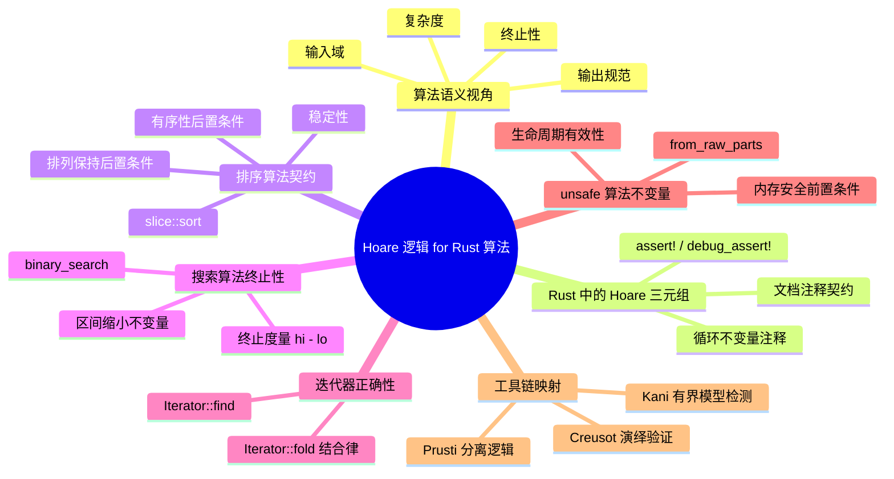

> **内容分级**: [专家级]

# Hoare 逻辑 for Rust 算法

> **EN**: Hoare Logic for Rust Algorithms
> **Summary**: Algorithm-semantics entry point for Hoare-style contracts in Rust — linking preconditions, postconditions, loop invariants, and termination arguments to concrete algorithm implementations.
> **Rust 版本**: 1.97.0+ (Edition 2024)
> **受众**: [研究者]
> **Bloom 层级**: L4
> **权威来源**: 本文件为 `concept/` 权威页：Hoare 逻辑在 Rust 算法层面的应用入口。
> **定位**: 将 Hoare 逻辑从通用程序验证工具聚焦到**算法语义**——排序、搜索、迭代、unsafe 算法库的不变量与终止性。完整 Hoare 逻辑理论及推理规则见 [`04_formal/03_operational_semantics/02_hoare_logic.md`](../03_operational_semantics/02_hoare_logic.md)。
> **前置概念**: [Hoare Logic](../03_operational_semantics/02_hoare_logic.md) · [Ownership Formalization](../01_ownership_logic/02_ownership_formal.md) · [Unsafe Rust](../../03_advanced/02_unsafe/01_unsafe.md)
> **后置概念**: [Refinement Calculus](02_refinement_calculus.md) · [Unsafe Algorithm Invariants](04_unsafe_algorithm_invariants.md)

---

> **来源**: [Hoare 1969 — An Axiomatic Basis](https://doi.org/10.1093/comjnl/12.4.576) · [Cambridge Hoare Logic Notes](https://www.cl.cam.ac.uk/archive/mjcg/HL/Lectures/) · [Floyd 1967 — Assigning Meanings to Programs](https://doi.org/10.1007/978-94-011-1793-7_4) · [Dijkstra 1976 — A Discipline of Programming](https://dl.acm.org/doi/book/10.5555/1243380) · [Reynolds 2002 — Separation Logic](https://doi.org/10.1109/LICS.2002.1029817) · [Astrauskas et al. 2019 — Prusti](https://doi.org/10.1145/3360573) · [Denis 2021 — The Creusot Environment](https://hal-lara.archives-ouvertes.fr/hal-03526634/) · [Müller et al. — Viper](https://doi.org/10.3233/978-1-61499-810-5-104) · [Rust Reference](https://doc.rust-lang.org/reference/introduction.html) · [Verus (github.com/verus-lang)](https://github.com/verus-lang/verus) · [Creusot Repository (github.com/creusot-rs)](https://github.com/creusot-rs/creusot) · [Aeneas Verif (github.com/AeneasVerif)](https://github.com/AeneasVerif/aeneas) · [Unsafe Code Guidelines (rust-lang.github.io)](https://rust-lang.github.io/unsafe-code-guidelines/) · [RustHorn — CHC-based Verification for Rust (arxiv.org)](https://arxiv.org/abs/2002.09002)

## 一、算法语义的 Hoare 视角

算法 = 输入域 + 输出规范 + 终止性 + 复杂度。Hoare (1969) 提出的 Hoare 三元组 `{P} C {Q}` 给算法提供了**可验证的语义契约**：

```text
{ P(n) }            // 前置：输入满足的问题约束
  algorithm(C)      // 算法体
{ Q(n, result) }    // 后置：输出与输入的关系
∧ termination(n)    // 终止性：对合法输入必停机
```

在 Rust 中，类型系统已经编码了部分前置/后置条件（如 `NonZeroU32`、`&[T]` 非空切片），但**算法级语义**仍需文档化契约或形式化注解。

## 二、Hoare 三元组在 Rust 中的写法

Rust 没有原生契约关键字，但可通过 `assert!` / `debug_assert!`、文档注释与类型约束表达 Hoare 三元组。

| 形式化角色 | Rust 表达 | 说明 |
|---|---|---|
| 前置条件 | 文档注释 `/// # Panics`、`assert!`、`debug_assert!` | 调用者义务，运行时/调试期可强制检查 |
| 后置条件 | `assert!`、返回值类型、`Result<T,E>` | 实现者保证，输出必须满足 |
| 循环不变量 | 注释 + `debug_assert!` | 每次迭代开始/结束时保持为真 |
| 终止度量 | 注释 + 变体函数 | 每次迭代严格递减的非负量 |

```rust
/// 前置条件: x < i32::MAX（调用者负责）
/// 后置条件: 返回值 == x + 1 且 > x
fn increment_checked(x: i32) -> i32 {
    // 调试期前置检查
    debug_assert!(x < i32::MAX, "precondition violated: x < i32::MAX");

    let y = x + 1;

    // 后置检查
    assert!(y == x + 1 && y > x);
    y
}

fn main() {
    assert_eq!(increment_checked(2), 3);
}
```

> **关键洞察**: `assert!` 与 `debug_assert!` 是**运行时契约**；要获得对所有输入的保证，需要 Prusti/Creusot/Kani 等验证工具将断言提升为逻辑规格。

## 三、排序算法的 Hoare 契约

以 `slice::sort` 为例，其 Hoare 契约可写为：

```text
前置 P  : s: &mut [T] ∧ T: Ord
命令 C  : s.sort()
后置 Q  : sorted(s) ∧ permutation(old(s), s)
稳定性  : 相等元素的相对顺序保持不变
复杂度  : O(n log n) 时间，O(log n) 额外空间
```

```rust
fn sort_demo<T: Ord + Clone + std::fmt::Debug>(slice: &mut [T]) {
    let original = slice.to_vec();
    slice.sort();

    // 后置 1: 非递减有序
    for window in slice.windows(2) {
        assert!(window[0] <= window[1], "postcondition: sorted");
    }

    // 后置 2: 排列保持（元素多重集不变）
    let mut sorted_copy = slice.to_vec();
    sorted_copy.sort();
    let mut original_sorted = original;
    original_sorted.sort();
    assert_eq!(sorted_copy, original_sorted, "postcondition: permutation");
}

fn main() {
    let mut v = vec![3, 1, 4, 1, 5, 9, 2, 6];
    sort_demo(&mut v);
    assert_eq!(v, vec![1, 1, 2, 3, 4, 5, 6, 9]);
}
```

> **稳定性说明**: `slice::sort` 是稳定排序。若 `T` 上 `a == b` 但原始顺序为 `a, b`，排序后仍保持 `a, b`。这一性质无法仅由 `Ord` 推导，是库实现承诺的后置条件。
> (Source: [Rust Standard Library — slice::sort](https://doc.rust-lang.org/std/primitive.slice.html#method.sort))

## 四、搜索算法的终止性论证

以 `binary_search` 为例。手写实现需要显式维护循环不变量与终止度量。

```text
前置 P      : s: &[T] ∧ s 已按非递减排序 ∧ T: Ord
命令 C      : 在 s 中查找 target
循环不变量 I: 若 target 在 s 中，则其下标 ∈ [lo, hi)
终止度量   V: hi - lo，每次迭代严格递减且 ≥ 0
后置 Q      : Some(idx) 表示 s[idx] == target；None 表示 target 不在 s 中
```

```rust
fn binary_search<T: Ord>(slice: &[T], target: &T) -> Option<usize> {
    let mut lo = 0usize;
    let mut hi = slice.len();

    // 循环不变量：若 target 在 slice 中，则其下标 ∈ [lo, hi)
    while lo < hi {
        // 终止度量 V = hi - lo 在此处 > 0
        let mid = lo + (hi - lo) / 2;

        match slice[mid].cmp(target) {
            std::cmp::Ordering::Equal => return Some(mid),
            std::cmp::Ordering::Less => {
                // 目标只可能在右半区间 [mid + 1, hi)
                lo = mid + 1;
            }
            std::cmp::Ordering::Greater => {
                // 目标只可能在左半区间 [lo, mid)
                hi = mid;
            }
        }
        // V 严格减小：lo 增大或 hi 减小，且新区间仍非空或循环退出
    }

    None
}

fn main() {
    let s = [1, 3, 5, 7, 9];
    assert_eq!(binary_search(&s, &5), Some(2));
    assert_eq!(binary_search(&s, &4), None);
}
```

> **终止性证明**: 每次迭代要么返回，要么将区间长度从 `hi - lo` 减小到严格更小的正数（`hi - mid` 或 `mid + 1 - lo`）。由于 `hi - lo` 是自然数且不能无限递减，循环必终止。

## 五、迭代器正确性

Rust 的 `Iterator` trait 可以携带隐式 Hoare 契约。

### 5.1 `Iterator::find`

```text
前置 P : self 是一个合法的迭代器；predicate 是纯函数且不修改迭代器状态
后置 Q : Some(x) 表示 x 是首个满足 predicate 的元素；None 表示没有元素满足
```

```rust
fn first_even(numbers: &[i32]) -> Option<&i32> {
    numbers.iter().find(|&&x| x % 2 == 0)
}

fn main() {
    assert_eq!(first_even(&[1, 3, 4, 5]), Some(&4));
    assert_eq!(first_even(&[1, 3, 5]), None);
}
```

### 5.2 `Iterator::fold` 的结合律要求

`fold` 的语义契约要求：闭包 `f` 在某种意义上"像"一个二元运算，且初始值 `init` 是该运算的单位元。对于数值求和，这意味着加法满足结合律、0 是单位元。

```text
前置 P : 闭包 f 满足 f(acc, x) 与"acc ⊗ x"同构；⊗ 可结合、init 是 ⊗ 的单位元
后置 Q : result == init ⊗ x1 ⊗ x2 ⊗ ... ⊗ xn
```

```rust
fn sum_via_fold(numbers: &[i32]) -> i32 {
    numbers.iter().fold(0, |acc, &x| acc + x)
}

fn main() {
    assert_eq!(sum_via_fold(&[1, 2, 3, 4]), 10);
}
```

> **警告**: 浮点数加法**不**严格满足结合律，`fold` 的结果可能因迭代顺序与并行版本（如 `rayon`）不同。这是后置条件与实现细节之间的边界，需在安全关键代码中显式声明精度契约。

## 六、unsafe 算法不变量

以 `std::slice::from_raw_parts` 为例，调用者必须维持的内存安全前置条件包括（这些条件可用 Reynolds (2002) 的分离逻辑进行形式化刻画）：

```text
前置 P :
  1. data 非空或 len == 0
  2. data 已对齐到 T
  3. data..data+len 是有效且未初始化的内存（若 T 有安全不变量，则值必须合法）
  4. 返回的引用 'a 存续期间，该内存区域不会被可变别名访问
  5. len * size_of::<T>() <= isize::MAX
后置 Q :
  result.len() == len ∧ result.as_ptr() == data
```

### 6.1 正确示例

```rust
static DATA: [u8; 4] = [1, 2, 3, 4];

fn valid_static_slice() -> &'static [u8] {
    // SAFETY: DATA 是 'static 数组，DATA.as_ptr() 非空且对齐，len 正确
    unsafe { std::slice::from_raw_parts(DATA.as_ptr(), DATA.len()) }
}

fn main() {
    assert_eq!(valid_static_slice(), &[1, 2, 3, 4]);
}
```

### 6.2 违反前置条件的编译错误示例

```rust,compile_fail
fn main() {
    let ptr = 0x1 as *const u8;

    // 错误：在 unsafe 块外调用 unsafe 函数。
    // from_raw_parts 要求调用者显式进入 unsafe 块并承担所有安全前置条件。
    let _slice = std::slice::from_raw_parts(ptr, 1);
}
```

> **修正**: `from_raw_parts` 是 `unsafe fn`，必须在 `unsafe { ... }` 块中调用。进入 unsafe 块只是第一步；调用者仍需保证指针有效、对齐、生命周期合法、`len * size_of::<T>() <= isize::MAX` 等全部前置条件。若生命周期不足，即使代码通过编译，也会在运行时触发未定义行为（UB）。

> **运行时反例（勿在生产中执行）**:
>
> ```rust,ignore
> fn dangling_slice() -> &'static [u8] {
>     let local = 42u8;
>     let ptr = &local as *const u8;
>     // 危险：ptr 指向栈上局部变量，返回 'static 引用会在 local 被释放后形成悬垂引用
>     unsafe { std::slice::from_raw_parts(ptr, 1) }
> }
> ```

### 6.3 违反 Hoare 前置条件：借用别名冲突（unsafe borrow misuse）

下面的 `compile_fail` 示例展示了一个常见的 Hoare 前置条件违反：在已持有独占可变借用（`&mut`）的内存区域上，又尝试建立不可变借用（`&`）。这种 `unsafe borrow misuse` 会破坏算法要求的别名隔离不变量；Rust 借用检查器会在编译期拒绝这种别名冲突，对应错误码 `E0502`。

```rust,compile_fail,E0502
fn main() {
    let mut v = vec![1, 2, 3];

    // 独占可变借用：承诺在 r 存活期间不存在其他别名
    let r = &mut v[0];

    // 错误：在 &mut 借用仍然有效时，又创建 & 借用
    let s = &v;

    println!("{} {}", r, s.len());
}
```

> **修正**: 若算法规范要求“同一内存区域在某一阶段只能有一个可变引用”，则实现必须在退出 `r` 的作用域后再创建其他借用。Hoare 逻辑中的不变量与 Rust 的借用规则共同保证了这一点；一旦违反，编译器将直接拒绝。

## 七、工具链映射

现代 Rust 验证工具可将上述非形式化契约转化为机器可检查的 Hoare 规格。

| 工具 | 形式化基础 | 算法契约写法 | 适用场景 |
|---|---|---|---|
| **Creusot** | Why3 / Coma / 最弱前置条件 | `#[requires(...)]` / `#[ensures(...)]` / `#[invariant(...)]` / `#[variant(...)]` | 无界功能正确性：排序、搜索、代数规约 |
| **Prusti** | Viper / 分离逻辑 | `#[requires]` / `#[ensures]` / `#[invariant]` | 堆数据结构、分离逻辑教学 |
| **Kani** | CBMC / 有界模型检测 | `#[kani::requires]` / `#[kani::ensures]` / `#[kani::loop_invariant]` | 有界反例查找、安全关键组件 |

> **形式化来源**: Prusti 将 Rust 类型系统与 Viper 的权限模型结合，用于模块化规约与验证（Astrauskas et al., 2019）；Creusot 基于 Why3 / Coma 中间语言，将 Pearlite 规格翻译为最弱前置条件（Denis, 2021）；Viper 则是支撑 Prusti 等工具的中间验证语言和权限推理基础设施（Müller et al.）。

- Creusot 详情见 [`04_formal/04_model_checking/11_creusot.md`](../04_model_checking/11_creusot.md)
- Kani 详情见 [`04_formal/04_model_checking/09_kani.md`](../04_model_checking/09_kani.md)
- Prusti 与工具链全景见 [`04_formal/04_model_checking/01_verification_toolchain.md`](../04_model_checking/01_verification_toolchain.md)

> **选型提示**: 若目标是**证明算法对所有输入正确**，优先 Creusot（无界演绎验证）；若目标是**快速发现反例**，优先 Kani（有界模型检测）；若涉及复杂堆不变量，可考虑 Prusti。

## 八、与通用 Hoare 逻辑页的关系

| 维度 | 本页（算法语义） | [`02_hoare_logic.md`](../03_operational_semantics/02_hoare_logic.md)（操作语义） |
|---|---|---|
| 视角 | 算法正确性、终止性、复杂度 | 程序命令式语义的公理化 |
| 示例 | `Iterator::find`、`Vec::sort`、`binary_search` | 赋值、顺序、条件、循环规则 |
| 工具 | Creusot/Prusti/Kani 算法契约 | 通用霍尔逻辑与最弱前置条件 |
| 定位 | 应用/算法层 | 理论/操作语义层 |

> **权威来源**: 通用 Hoare 逻辑的理论、规则、weakest precondition 演算统一维护在 [`04_formal/03_operational_semantics/02_hoare_logic.md`](../03_operational_semantics/02_hoare_logic.md)。本页只保留算法语义的入口说明与交叉链接。

---

## 权威来源索引

| 来源 | 可信度 | 说明 |
|:---|:---:|:---|
| [Hoare 1969 — An Axiomatic Basis for Computer Programming](https://doi.org/10.1093/comjnl/12.4.576) | ✅ 一级 | Hoare 逻辑奠基论文 |
| [Cambridge Hoare Logic Lecture Notes](https://www.cl.cam.ac.uk/archive/mjcg/HL/Lectures/) | ✅ 一级 | 经典教材式 Hoare 逻辑讲义 |
| [Floyd 1967 — Assigning Meanings to Programs](https://doi.org/10.1007/978-94-011-1793-7_4) | ✅ 一级 | 程序语义与循环不变量奠基 |
| [Dijkstra 1976 — A Discipline of Programming](https://dl.acm.org/doi/book/10.5555/1243380) | ✅ 一级 | 最弱前置条件演算经典著作 |
| [Rust Standard Library — slice::sort](https://doc.rust-lang.org/std/primitive.slice.html#method.sort) | ✅ 一级 | Rust 排序算法稳定性与复杂度承诺 |
| [Rust Standard Library — slice::from_raw_parts](https://doc.rust-lang.org/std/slice/fn.from_raw_parts.html) | ✅ 一级 | unsafe 算法前置条件权威定义 |
| [Rust Reference](https://doc.rust-lang.org/reference/introduction.html) | ✅ 一级 | Rust 语言参考 |
| [Creusot 官方文档](https://creusot.rs/) | ✅ 一级 | Rust 演绎验证工具 |
| [Kani 官方文档](https://model-checking.github.io/kani/) | ✅ 一级 | Rust 有界模型检测器 |
| [Prusti](https://www.pm.inf.ethz.ch/research/prusti.html) | ✅ 一级 | Rust 分离逻辑验证器 |
| [Reynolds 2002 — Separation Logic: A Logic for Shared Mutable Data Structures](https://doi.org/10.1109/LICS.2002.1029817) | ✅ 一级 | 堆/指针程序形式化推理基础 |
| [Astrauskas et al. 2019 — Leveraging Rust Types for Modular Specification and Verification](https://doi.org/10.1145/3360573) | ✅ 一级 | Prusti 在 Rust 上的模块化验证方法 |
| [Denis 2021 — The Creusot Environment for the Deductive Verification of Rust Programs](https://hal-lara.archives-ouvertes.fr/hal-03526634/) | ✅ 一级 | Creusot 演绎验证环境技术报告 |
| [Müller et al. — Viper: A Verification Infrastructure for Permission-Based Reasoning](https://doi.org/10.3233/978-1-61499-810-5-104) | ✅ 一级 | Prusti 等工具依赖的权限推理中间语言 |

---

## 嵌入式测验（Embedded Quiz）

### 测验 1：循环不变量（应用层）

以下二分查找循环的不变量是什么？

```rust,ignore
while lo < hi {
    let mid = lo + (hi - lo) / 2;
    match slice[mid].cmp(target) {
        Equal => return Some(mid),
        Less  => lo = mid + 1,
        Greater => hi = mid,
    }
}
```

- A. `slice[0..lo]` 中所有元素 `< target`，`slice[hi..]` 中所有元素 `> target`，若 target 存在则下标在 `[lo, hi)` 内
- B. `slice` 整体有序
- C. `lo + hi == slice.len()`

<details>
<summary>✅ 答案与解析</summary>

**A**。循环不变量必须刻画"搜索区间逐步缩小但答案仍在其中"。选项 B 是前置条件，不是循环不变量；选项 C 与算法无关。
</details>

---

### 测验 2：`Iterator::fold` 的后置条件（分析层）

`numbers.iter().fold(0, |acc, &x| acc + x)` 的后置条件是什么？

- A. 返回第一个偶数
- B. 返回所有元素之和
- C. 返回最大元素

<details>
<summary>✅ 答案与解析</summary>

**B**。`fold` 以 0 为初始值，用闭包 `acc + x` 累积所有元素。后置条件是 `result == Σ numbers[i]`。该结论依赖加法结合律与 0 作为单位元。
</details>

---

### 测验 3：unsafe 前置条件（评价层）

调用 `std::slice::from_raw_parts(ptr, len)` 时，下列哪项**不是**调用者必须保证的前置条件？

- A. `ptr` 在返回引用的整个生命周期内有效
- B. `len * size_of::<T>() <= isize::MAX`
- C. `T` 实现了 `Clone`

<details>
<summary>✅ 答案与解析</summary>

**C**。`from_raw_parts` 不要求 `T: Clone`。A 与 B 均来自标准库文档明确列出的安全前置条件。`Clone` 与切片构造无关。
</details>

---

## 🧭 思维导图（Mindmap）



> **认知功能**: 本 mindmap 从本页「Hoare 逻辑 for Rust 算法」的章节结构提炼，一级分支对应核心主题，叶子节点为关键子概念，可作为本页的快速导航与复习索引。

---

> **文档版本**: 1.1
> **最后更新**: 2026-07-29
> **状态**: ✅ 权威来源对齐完成 (Wave 2 剩余)
