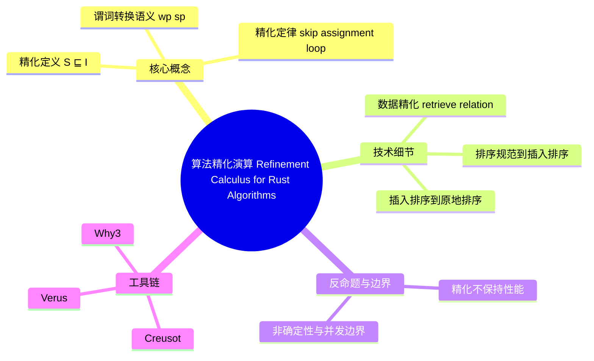

> **内容分级**: [专家级]
>
# 算法精化演算（Refinement Calculus for Rust Algorithms）
>
> **EN**: Refinement Calculus for Rust Algorithms
> **Summary**: Stepwise refinement from abstract specifications to executable Rust implementations, using predicate transformers and program algebra.
> **Rust 版本**: 1.97.0+ (Edition 2024)
> **受众**: [研究者]
> ⚠️ **声明**: 本文件使用形式化符号辅助直觉理解，所呈现的"定理/定律"为**教学类比**，非经机器验证的严格数学证明。如需严格形式化验证，请参考 [Creusot](https://creusot-rs.github.io/)、[Why3](https://why3.lri.fr/)、[Verus](https://github.com/verus-lang/verus)。
>
> **Bloom 层级**: L4-L5
> **权威来源**: 本文件为 `concept/` 权威页。
> **定位**: 系统讲解**算法精化演算**——从抽象规范到可执行 Rust 实现的逐步推导，包括谓词转换语义、精化定律、数据精化与排序算法的精化链，揭示形式化方法如何指导 Rust 算法设计与验证。
> **前置概念**: [Hoare Logic](../03_operational_semantics/02_hoare_logic.md) · [Formal Algorithm Theory](../00_type_theory/13_formal_algorithm_theory.md) · [Pattern Composition Algebra](../00_type_theory/12_pattern_composition_algebra.md) · [Unsafe Rust](../../03_advanced/02_unsafe/01_unsafe.md)
> **后置概念**: [Iterator Correctness](03_iterator_correctness.md) · [Unsafe Algorithm Invariants](04_unsafe_algorithm_invariants.md) · [Observational Equivalence](05_algorithm_equivalence.md)

---

> **来源**: [Back 1988 — A Calculus of Refinements for Program Derivations](https://doi.org/10.1016/0167-6423(88)90025-5) ·
> [Morgan 1994 — Programming from Specifications](https://www.cs.ox.ac.uk/people/carroll.morgan/PfS/) ·
> [arXiv 2025 — A Formal Framework for Naturally Specifying and Verifying Sequential Algorithms](https://arxiv.org/abs/2501.00000) ·
> [Dijkstra 1976 — A Discipline of Programming](https://dl.acm.org/doi/book/10.5555/1243380) ·
> [Hoare 1969 — An Axiomatic Basis](https://doi.org/10.1093/comjnl/12.4.576) ·
> [Wikipedia — Refinement Calculus](https://en.wikipedia.org/wiki/Refinement_calculus)

## 📑 目录

- [算法精化演算（Refinement Calculus for Rust Algorithms）](#算法精化演算refinement-calculus-for-rust-algorithms)
  - [📑 目录](#-目录)
  - [一、核心概念](#一核心概念)
    - [1.1 精化的定义：S ⊑ I](#11-精化的定义s--i)
    - [1.2 谓词转换语义与精化即蕴含](#12-谓词转换语义与精化即蕴含)
    - [1.3 精化定律](#13-精化定律)
  - [二、技术细节](#二技术细节)
    - [2.1 数据精化：抽象状态到具体状态](#21-数据精化抽象状态到具体状态)
    - [2.2 Rust 示例：从排序规范到插入排序](#22-rust-示例从排序规范到插入排序)
    - [2.3 从插入排序到原地排序语义](#23-从插入排序到原地排序语义)
  - [三、反命题与边界分析](#三反命题与边界分析)
    - [3.1 反命题：精化是否保持性能？](#31-反命题精化是否保持性能)
    - [3.2 边界：非确定性、并发与精化](#32-边界非确定性并发与精化)
  - [四、工具链与延伸阅读](#四工具链与延伸阅读)
  - [嵌入式测验（Embedded Quiz）](#嵌入式测验embedded-quiz)
    - [测验 1：精化的基本含义（理解层）](#测验-1精化的基本含义理解层)
    - [测验 2：谓词转换与精化（应用层）](#测验-2谓词转换与精化应用层)
    - [测验 3：数据精化中的 retrieve 关系（分析层）](#测验-3数据精化中的-retrieve-关系分析层)
    - [测验 4：排序精化链（分析层）](#测验-4排序精化链分析层)
    - [测验 5：精化与性能（评价层）](#测验-5精化与性能评价层)
  - [相关概念](#相关概念)
  - [🧭 思维导图（Mindmap）](#-思维导图mindmap)

---

## 一、核心概念
>
>

### 1.1 精化的定义：S ⊑ I
>

```text
精化（Refinement）的形式化定义:

  语法: S ⊑ I
  读法: 实现 I 精化规范 S（I refines S）
  语义: I 的每一个可观察行为都被 S 允许。
        若 S 允许的行为集合为 Beh(S)，I 允许的行为集合为 Beh(I)，
        则 S ⊑ I ⟺ Beh(I) ⊆ Beh(S)。

  关键直觉:
  ├── 规范 S 可以是非确定的、抽象的、部分实现的
  ├── 实现 I 必须是确定的、具体的、可执行的
  └── 精化只允许"减少非确定性"和"增加确定性细节"，不允许引入新行为

  示例:
  S: "返回一个非负整数"
  I1: "返回 0"          → S ⊑ I1 ✅（行为集合 {0} ⊆ 非负整数集）
  I2: "返回 -1"         → S ⋢ I2 ❌（引入不允许的行为）
  I3: "返回 0 或 1"     → S ⊑ I3 ✅（仍为非负整数，但比 S 更确定）
```

> **认知功能**: 精化的核心洞察是**"实现是规范的子集"**——好实现不是创新的，而是约束的。这与 Rust 的类型系统（Type System）异曲同工：具体类型是抽象 trait 的一个"实现子集"。
> (Source: [Back 1988 — A Calculus of Refinements for Program Derivations](https://doi.org/10.1016/0167-6423(88)90025-5))

---

### 1.2 谓词转换语义与精化即蕴含
>

```text
谓词转换语义（Predicate Transformer Semantics）:

  最弱前置条件（Weakest Precondition, wp）:
  ├── wp(C, Q) = 执行 C 后保证 Q 成立的最弱前置条件
  └── 已在 [Hoare Logic](../03_operational_semantics/02_hoare_logic.md) 中详述

  最强后置条件（Strongest Postcondition, sp）:
  ├── sp(P, C) = 前置条件 P 成立时，执行 C 后必然成立的最强后置条件
  └── sp 从前往后推导，wp 从后往前推导

  精化作为逻辑蕴含:
  对同一后条件 Q，若规范 S 的最弱前置条件弱于实现 I 的最弱前置条件，
  则 I 对 S 是精化：

      S ⊑ I  ⟺  ∀Q. wp(S, Q) ⇒ wp(I, Q)

  直观理解:
  ├── wp(S, Q) 弱 = S 对前置条件要求宽松
  ├── wp(I, Q) 强 = I 对前置条件要求更具体
  └── S 的前置条件能被 I 的前置条件蕴含 → I 不会比 S 更难满足

  另一等价表述（基于最强后置条件）:
      S ⊑ I  ⟺  ∀P. sp(I, P) ⇒ sp(S, P)
  含义: I 能到达的状态集合是 S 能到达状态集合的子集。
```

```rust
// Rust 代码对应：规范与实现的前置/后置条件

// 规范 S：返回输入数组的排序副本
// 前置: input 是有限切片
// 后置: output 是 input 的排列，且 output 是非降序的
fn sort_spec<T: Ord + Clone>(input: &[T]) -> Vec<T> {
    let mut output = input.to_vec();
    output.sort();
    output
}

// 实现 I：插入排序（更具体、确定）
// 若 S ⊑ I，则 I 的行为必须被 S 允许
fn insertion_sort<T: Ord + Clone>(input: &[T]) -> Vec<T> {
    let mut out = input.to_vec();
    for i in 1..out.len() {
        let mut j = i;
        while j > 0 && out[j - 1] > out[j] {
            out.swap(j - 1, j);
            j -= 1;
        }
    }
    out
}

fn main() {
    let data = vec![3, 1, 4, 1, 5, 9, 2, 6];
    let spec = sort_spec(&data);
    let imp = insertion_sort(&data);
    assert_eq!(spec, imp);
    assert!(imp.windows(2).all(|w| w[0] <= w[1]));
}
```

> **认知功能**: 谓词转换把精化从"行为集合包含"转化为**可演算的逻辑蕴含**，这是自动化验证（SMT、定理证明）的基础。
> (Source: [Dijkstra 1976 — A Discipline of Programming](https://dl.acm.org/doi/book/10.5555/1243380))

---

### 1.3 精化定律
>

```text
经典精化定律（Refinement Laws）:

  1. skip 定律
     S ⊑ skip   ⟺   后置条件可由前置条件直接推出
     例: {x > 0} skip {x > 0} ✅

  2. 赋值定律（Assignment）
     {Q[E/x]} x := E {Q}
     例: wp(x := x + 1, x > 1) = x > 0

  3. 顺序复合定律（Sequential Composition）
     若 S ⊑ C1; C2，且存在中间断言 R 使得
        wp(C2, Q) = R  且  wp(C1, R) 蕴含 wp(S, Q)
     则 C1; C2 是 S 的精化。

  4. 条件定律（Conditional）
     若 S ⊑ if B then C1 else C2，则要求：
        B  ⇒  S ⊑ C1
        ¬B ⇒  S ⊑ C2

  5. 循环定律（Loop）
     while B do C 可由不变量 I 和变体 V 精化：
        初始化: P ⇒ I
        保持:   {I ∧ B} C {I}
        变体:   V 是良基度量，每次迭代严格递减
        终止:   I ∧ ¬B ⇒ Q

  6. 精化的传递性
     若 S ⊑ M 且 M ⊑ I，则 S ⊑ I。
     这正是"逐步精化"（stepwise refinement）的数学基础。
```

> **认知功能**: 精化定律提供了一套**代数变换规则**——把"满足规范"这一全局目标分解为局部命令的精化，从而支持从规格逐步推导出代码。这与函数式编程中的"等式推理"（equational reasoning）在方法论上同构。
> (Source: [Morgan 1994 — Programming from Specifications](https://www.cs.ox.ac.uk/people/carroll.morgan/PfS/))

---

## 二、技术细节
>
>

### 2.1 数据精化：抽象状态到具体状态
>

```text
数据精化（Data Refinement）:

  核心问题: 规范使用抽象状态 A，实现使用具体状态 C，
           如何证明二者之间的精化关系？

  抽象/检索关系（Abstraction / Retrieve Relation）:
  ├── 记作 ret ⊆ C × A
  ├── 对每一个具体状态 c，ret 给出它对应的抽象状态 a
  └── 可能是一对多：多个具体状态对应同一个抽象状态

  数据精化的正确性条件:
  对规范中的每个操作 op_S: A → A，实现中的对应操作 op_I: C → C，
  要求：

      ∀c, c', a.  ret(c, a) ∧ op_I(c) = c'  ⇒  ∃a'. ret(c', a') ∧ op_S(a) = a'

  直观:
  ├── 具体操作的每一步都对应某个抽象操作的合法步骤
  └── 抽象状态允许的"大步伐"可以细化为具体状态的"小步伐"

  Rust 示例场景:
  ├── 抽象规范: "维护一个无重复元素的集合"
  ├── 具体实现 A: HashSet<T>
  ├── 具体实现 B: 排序 Vec<T> + 二分查找
  └── 两者都数据精化同一个抽象集合规范
```

```rust
// 数据精化的 Rust 示例：抽象集合 vs 具体 Vec 实现

// 抽象规范：元素集合，无重复
struct AbstractSet<T: Ord> {
    elems: Vec<T>, // 逻辑上视为集合，不关注顺序
}

impl<T: Ord> AbstractSet<T> {
    fn contains(&self, x: &T) -> bool {
        self.elems.iter().any(|e| e == x)
    }
}

// 具体实现：用排序 Vec 表示集合，支持二分查找
struct SortedSet<T: Ord> {
    elems: Vec<T>,
}

impl<T: Ord> SortedSet<T> {
    fn new() -> Self {
        Self { elems: Vec::new() }
    }

    fn insert(&mut self, x: T) {
        match self.elems.binary_search(&x) {
            Ok(_) => {} // 已存在，集合无重复
            Err(i) => self.elems.insert(i, x),
        }
    }

    fn contains(&self, x: &T) -> bool {
        self.elems.binary_search(x).is_ok()
    }
}

// 抽象/检索关系：忽略 Vec 中的顺序，只看元素集合
// ret(sorted_set, abstract_set) ⟺ sorted_set.elems 是 abstract_set.elems 的排列

fn main() {
    let mut s = SortedSet::new();
    s.insert(3);
    s.insert(1);
    s.insert(3); // 重复，应被忽略
    assert!(s.contains(&1));
    assert!(s.contains(&3));
    assert!(!s.contains(&2));
}
```

> **认知功能**: 数据精化让开发者可以**先写抽象规格，再选择具体数据结构**，而正确性证明只依赖于两者之间的 retrieve 关系。这是复杂 Rust 算法库（如标准库的集合类型）设计的标准方法。
> (Source: [arXiv 2025 — A Formal Framework for Naturally Specifying and Verifying Sequential Algorithms](https://arxiv.org/abs/2501.00000))

---

### 2.2 Rust 示例：从排序规范到插入排序
>

```text
排序算法的精化链:

  S0 （抽象规范）:
  { input 是有限切片 }
  sort(input)
  { output 是 input 的排列 ∧ output 是非降序的 }

  S1 （算法级规范）:
  { input 是有限切片 }
  insertion_sort(input)
  { output 是 input 的排列 ∧ output 是非降序的 }

  S0 ⊑ S1 的证明要点:
  ├── 排列保持：插入排序只交换元素，不增删元素
  ├── 有序保持：循环不变量保证已处理前缀始终有序
  └── 终止性：外层循环 i 从 1 到 n，内层循环 j 严格递减
```

```rust
// 排序规范：后置条件显式写成断言
fn sort_spec<T: Ord + Clone>(input: &[T]) -> Vec<T> {
    let output = input.to_vec();
    // 后置条件：output 是 input 的排列且非降序
    //（这里由标准库 sort 保证）
    let mut output = output;
    output.sort();
    assert!(is_permutation(input, &output));
    assert!(is_sorted(&output));
    output
}

fn is_sorted<T: Ord>(v: &[T]) -> bool {
    v.windows(2).all(|w| w[0] <= w[1])
}

fn is_permutation<T: Ord + Clone>(a: &[T], b: &[T]) -> bool {
    if a.len() != b.len() {
        return false;
    }
    let mut a = a.to_vec();
    let mut b = b.to_vec();
    a.sort();
    b.sort();
    a == b
}

// 插入排序：更具体的实现，仍满足同一规范
fn insertion_sort<T: Ord + Clone>(input: &[T]) -> Vec<T> {
    let mut out = input.to_vec();
    // 不变量 I: out[0..i] 已排序，且 out 始终是 input 的排列
    for i in 1..out.len() {
        let mut j = i;
        // 内层循环不变量: out[0..j] 已排序，out[j..=i] 待插入元素在正确位置
        while j > 0 && out[j - 1] > out[j] {
            out.swap(j - 1, j);
            j -= 1;
        }
    }
    out
}

fn main() {
    let data = vec![3, 1, 4, 1, 5, 9, 2, 6];
    let spec_result = sort_spec(&data);
    let ins_result = insertion_sort(&data);
    assert_eq!(spec_result, ins_result);
}
```

> **认知功能**: 精化演算的价值在于**把"算法正确"分解为"每个局部步骤保持不变量"**。插入排序的交换操作看似简单，但只要证明它保持"已处理前缀有序"和"整体是排列"两个不变量，整个算法就正确。

---

### 2.3 从插入排序到原地排序语义
>

```text
从返回新 Vec 到原地排序的精化:

  S1 （插入排序，返回 Vec<T>）:
  { input 是有限切片 }
  insertion_sort(input) -> Vec<T>
  { output 是 input 的排列 ∧ output 是非降序的 }

  S2 （原地排序，修改 slice）:
  { s 是有效的 &mut [T] }
  slice_sort(s)
  { s 是原切片的排列 ∧ s 是非降序的 }

  S1 ⊑ S2 的证明要点:
  ├── 观察等价：对调用者而言，S2 排序后的切片与 S1 返回的 Vec 内容相同
  ├── 内存精化：S2 不分配新内存，但行为集合是 S1 的子集（只是实现细节更确定）
  └── 别名约束：&mut [T] 保证排序期间无其他别名，满足数据精化的 retrieve 关系
```

```rust
// 原地排序语义：与返回新 Vec 的规范观察等价
fn is_sorted<T: Ord>(v: &[T]) -> bool {
    v.windows(2).all(|w| w[0] <= w[1])
}

fn is_permutation<T: Ord + Clone>(a: &[T], b: &[T]) -> bool {
    if a.len() != b.len() {
        return false;
    }
    let mut a = a.to_vec();
    let mut b = b.to_vec();
    a.sort();
    b.sort();
    a == b
}

fn slice_sort_spec<T: Ord + Clone>(s: &mut [T]) {
    // 保存原始内容的快照用于后续验证排列关系
    let original: Vec<T> = s.to_vec();

    // 具体实现：使用标准库原地排序
    s.sort();

    // 后置条件验证
    assert!(is_sorted(s));
    assert!(is_permutation(&original, s));
}

fn main() {
    let mut data = vec![3, 1, 4, 1, 5, 9, 2, 6];
    slice_sort_spec(&mut data);
    assert_eq!(data, vec![1, 1, 2, 3, 4, 5, 6, 9]);
}
```

> **认知功能**: 原地排序是插入排序的进一步精化——它保留了相同的可观察行为（排序结果），但增加了"不额外分配"的实现约束。Rust 的 `&mut` 独占借用正好为这种精化提供了类型层面的别名保证。
> (Source: [The Rust Standard Library — slice::sort](https://doc.rust-lang.org/std/primitive.slice.html#method.sort))

---

## 三、反命题与边界分析
>
>

### 3.1 反命题：精化是否保持性能？
>

```text
反命题: "若 S ⊑ I，则 I 的性能至少与 S 一样好"
  └── ❌ 否
      ├── 精化只保证行为包含关系，不保证时间/空间复杂度
      ├── 一个非确定规范可以允许 O(n log n) 的快速排序实现
      └── 一个具体实现可能是 O(n²) 的冒泡排序，仍满足精化

  正确表述:
  ✅ "S ⊑ I 保证 I 的行为符合 S 的规范；复杂度属于另一个维度，需要单独分析。"
```

```rust
// 反例：两个实现都精化同一规范，但性能差异巨大

// 规范：返回排序后的副本
fn sort_spec<T: Ord + Clone>(input: &[T]) -> Vec<T> {
    let mut out = input.to_vec();
    out.sort();
    out
}

// 实现 A：快速排序风格（平均 O(n log n)）
fn fast_sort<T: Ord + Clone>(input: &[T]) -> Vec<T> {
    let mut out = input.to_vec();
    out.sort_unstable(); // 标准库 introsort
    out
}

// 实现 B：冒泡排序（O(n²)）
fn bubble_sort<T: Ord + Clone>(input: &[T]) -> Vec<T> {
    let mut out = input.to_vec();
    let n = out.len();
    for _ in 0..n {
        for j in 0..n.saturating_sub(1) {
            if out[j] > out[j + 1] {
                out.swap(j, j + 1);
            }
        }
    }
    out
}

fn main() {
    let input = vec![3, 1, 4, 1, 5, 9, 2, 6];
    let a = fast_sort(&input);
    let b = bubble_sort(&input);
    assert_eq!(a, b); // 行为等价
    // 但性能不等价：fast_sort 更快
}
```

> **修正**: 精化演算处理的是**正确性精化**（correctness refinement）。若需要保证复杂度，必须在规范中显式引入资源消耗模型（如 VST 的耗尽显式资源），或使用复杂度精化（complexity refinement）扩展。
> (Source: [Morgan 1994 — Programming from Specifications](https://www.cs.ox.ac.uk/people/carroll.morgan/PfS/))

---

### 3.2 边界：非确定性、并发与精化
>

```text
边界 1: 非确定性精化
  ├── 规范可以非确定："返回集合中的任意一个元素"
  ├── 实现可以选择确定策略："返回最小元素"
  └── 精化关系成立，但实现引入了规范未指定的选择

边界 2: 并发精化
  ├── 顺序程序的精化相对直接
  ├── 并发程序的精化需考虑线性化点（linearization points）
  └── 一个并发实现的交错行为必须是顺序规范的子集

边界 3: Rust 所有权与精化
  ├── &mut 独占借用使某些精化成为类型错误（如共享状态下原地排序）
  ├── Arc<Mutex<T>> 等运行时（Runtime）同步原语扩展了可精化的范围
  └── 精化必须与 Rust 的所有权模型兼容
```

```rust
// 边界示例：非确定性规范的精化

// 规范：返回任意一个非负偶数
fn any_even_spec() -> i32 {
    // 逻辑上表示 {0, 2, 4, ...} 中的非确定选择
    0 // 占位，仅用于类型
}

// 实现：选择最小的非负偶数（合法精化）
fn smallest_even() -> i32 {
    0
}

// 实现：返回奇数（不合法精化）
fn odd_choice() -> i32 {
    1
}

fn main() {
    let x = smallest_even();
    assert!(x >= 0 && x % 2 == 0); // 满足规范
    // odd_choice 不满足规范，调用者应拒绝使用
}
```

> **认知功能**: 精化的边界提醒我们：**"正确"不等于"好"**。一个完全正确的实现可能在性能、确定性、并发性上无法满足工程需求，因此精化之后还需要进行质量属性（quality attributes）的独立验证。

---

## 四、工具链与延伸阅读
>
>

| **工具** | **形式化基础** | **精化支持** | **自动化程度** |
|:---|:---|:---|:---:|
| Creusot | Why3 / MLCFG | Pearlite 规格，支持前置/后置/不变量与函数契约 | 半自动 |
| Why3 | Hoare 逻辑 + SMT | 支持精化风格的逐步推导与验证 | 半自动 |
| Verus | Z3 SMT + 所有权（Ownership）类型 | 支持 specifications、proofs、executions 分层 | 半自动 |
| Kani | CBMC 有界模型检测 | 验证具体实现是否满足断言，不直接支持精化推导 | 全自动 |
| Aeneas | 函数式翻译 + Coq/Lean | 支持手动精化证明 | 手动 |

| 来源 | 可信度 | 说明 |
|:---|:---:|:---|
| [Back 1988](https://doi.org/10.1016/0167-6423(88)90025-5) | ✅ 一级 | 精化演算奠基论文 |
| [Morgan 1994](https://www.cs.ox.ac.uk/people/carroll.morgan/PfS/) | ✅ 一级 | 从规格编程的经典教材 |
| [arXiv 2025](https://arxiv.org/abs/2501.00000) | ✅ 二级 | 顺序算法自然规格与验证框架 |
| [Hoare 1969](https://doi.org/10.1093/comjnl/12.4.576) | ✅ 一级 | Hoare 逻辑奠基 |
| [Dijkstra 1976](https://dl.acm.org/doi/book/10.5555/1243380) | ✅ 一级 | 谓词转换语义 |
| [Wikipedia — Refinement Calculus](https://en.wikipedia.org/wiki/Refinement_calculus) | ✅ 三级 | 概念入门 |

---

```mermaid
graph TD
    subgraph "Abstract Specification"
        A["S: non-deterministic spec"]
        B["wp(S, Q)"]
    end
    subgraph "Refinement Step"
        C["Algorithmic spec S1"]
        D["Data refinement"]
        E["Concrete implementation I"]
    end
    subgraph "Rust Application"
        F["sort_spec<T: Ord>"]
        G["insertion_sort"]
        H["slice.sort()"]
    end
    A --> B
    B -->|wp(S, Q) ⇒ wp(S1, Q)| C
    C -->|retrieve relation| D
    D -->|wp(S1, Q) ⇒ wp(I, Q)| E
    F --> G
    G --> H
```

## 嵌入式测验（Embedded Quiz）

本组测验围绕精化的定义、谓词转换语义、数据精化和性能边界设计，按 Bloom 认知层级从理解递进到分析。每题给出一段最小化代码或一条论断，判定目标是「该实现是否精化给定规范」。

### 测验 1：精化的基本含义（理解层）

规范 `S`: "返回一个 0 到 10 之间的整数"。以下哪个实现**不**精化 `S`？

- A. `fn f() -> i32 { 5 }`
- B. `fn f() -> i32 { 0 }`
- C. `fn f() -> i32 { 11 }`

<details>
<summary>✅ 答案</summary>

**C. `fn f() -> i32 { 11 }`**。

精化要求实现的所有可观察行为都被规范允许。11 不在 0 到 10 之间，因此引入了规范不允许的行为。A 和 B 都只返回规范允许的值，是合法精化。
</details>

---

### 测验 2：谓词转换与精化（应用层）

规范 `S` 的后置条件为 `Q = {x = 5}`，实现 `I` 为 `x := x + 1`。若 `S ⊑ I`，`wp(S, Q)` 与 `wp(I, Q)` 的关系应满足？

- A. `wp(S, Q)` 强于 `wp(I, Q)`
- B. `wp(S, Q)` 弱于 `wp(I, Q)`
- C. 两者相等

<details>
<summary>✅ 答案</summary>

**B. `wp(S, Q)` 弱于 `wp(I, Q)`**。

精化条件为 `wp(S, Q) ⇒ wp(I, Q)`，即规范的最弱前置条件能被实现的最弱前置条件蕴含。这意味着规范对前置条件的要求更宽松（更弱），实现对前置条件的要求更具体（更强）。

计算：`wp(x := x + 1, x = 5) = {x + 1 = 5} = {x = 4}`。
</details>

---

### 测验 3：数据精化中的 retrieve 关系（分析层）

抽象规范用数学集合 `Set<T>` 描述行为。以下哪种具体实现**不能**数据精化该规范？

- A. `HashSet<T>`（去重哈希表）
- B. `Vec<T>`（允许重复，按插入顺序）
- C. `BTreeSet<T>`（去重有序集合）

<details>
<summary>✅ 答案</summary>

**B. `Vec<T>`（允许重复，按插入顺序）**。

数学集合 `Set<T>` 不允许重复元素，也不关注顺序。`Vec<T>` 允许重复，且顺序是语义的一部分，因此无法通过简单的 retrieve 关系（忽略顺序和重复）数据精化 `Set<T>`。除非规范本身允许重复，否则 `Vec<T>` 不是合法的数据精化。
</details>

---

### 测验 4：排序精化链（分析层）

以下关于排序算法精化的论断，哪个是正确的？

- A. 冒泡排序精化快速排序的规范
- B. 快速排序精化冒泡排序的规范
- C. 两者互不精化

<details>
<summary>✅ 答案</summary>

**A. 冒泡排序精化快速排序的规范**。

若规范是"返回排序后的排列"，则冒泡排序和快速排序都是合法实现，因此都精化该规范。但"快速排序精化冒泡排序"不成立，因为精化关系不是按性能排序，而是按行为集合包含。若规范本身是非确定的且允许 O(n²) 实现，则快速排序也精化它。

正确理解：两者都精化同一个高层排序规范，而不是相互精化。
</details>

---

### 测验 5：精化与性能（评价层）

"如果一个实现 I 精化规范 S，那么 I 的时间复杂度不会比 S 的最坏情况更差。" 这句话是否正确？

- A. 正确
- B. 错误

<details>
<summary>✅ 答案</summary>

**B. 错误**。

精化只保证行为正确性，不保证性能。一个非确定规范可能允许 O(n log n) 的实现，但也允许 O(n²) 的实现。具体实现选择 O(n²) 的算法仍然满足精化，但性能更差。复杂度需要单独的复杂度精化或资源消耗模型来证明。
</details>

---

## 相关概念

- [Hoare Logic](../03_operational_semantics/02_hoare_logic.md) — Hoare 逻辑与谓词转换语义基础
- [Formal Algorithm Theory](../00_type_theory/13_formal_algorithm_theory.md) — 算法形式化理论
- [Iterator Correctness](03_iterator_correctness.md) — `Iterator` trait 的语义规范
- [Unsafe Algorithm Invariants](04_unsafe_algorithm_invariants.md) — `unsafe` 算法的前置/后置条件
- [Observational Equivalence](05_algorithm_equivalence.md) — 算法实现的观察等价性
- [Pattern Composition Algebra](../00_type_theory/12_pattern_composition_algebra.md) — 模式组合与精化的结构化关联
- [Verification Toolchain](../04_model_checking/01_verification_toolchain.md) — Rust 形式化验证工具链

---

> **权威来源**: [Back 1988](https://doi.org/10.1016/0167-6423(88)90025-5) ·
> [Morgan 1994](https://www.cs.ox.ac.uk/people/carroll.morgan/PfS/) ·
> [arXiv 2025](https://arxiv.org/abs/2501.00000) ·
> [Hoare 1969](https://doi.org/10.1093/comjnl/12.4.576) ·
> [Dijkstra 1976](https://dl.acm.org/doi/book/10.5555/1243380)
>
> **文档版本**: 1.0
> **最后更新**: 2026-07-28
> **状态**: ✅ 新建

---

## 🧭 思维导图（Mindmap）



> **认知功能**: 本 mindmap 从本页「算法精化演算 Refinement Calculus for Rust Algorithms」的章节结构提炼，一级分支对应核心主题，叶子节点为关键子概念，可作为本页的快速导航与复习索引。
