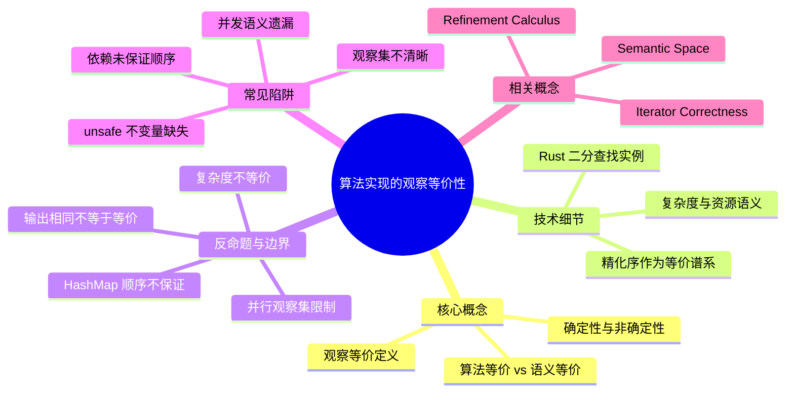

> **内容分级**: [专家级]
>
# 算法实现的观察等价性（Observational Equivalence of Algorithm Implementations）

> **EN**: Observational Equivalence of Algorithm Implementations
> **Summary**: When two Rust implementations of the same algorithm are interchangeable based on observable behavior, and when complexity or non-determinism breaks equivalence.

> **Rust 版本**: 1.97.0+ (Edition 2024)
> **Bloom 层级**: L4
> **权威来源**: 本文件为 `concept/` 权威页。
> **定位**: 系统讲解 **算法实现的观察等价性**——从"相同输入产生相同可观察输出"的基本定义，到复杂度、非确定性与精化序对等价关系的刻画，帮助判断 Rust 中同一算法的不同实现何时可以互换、何时必须区分。
> **前置概念**: [Hoare Logic](../03_operational_semantics/02_hoare_logic.md) · [Operational Semantics](../03_operational_semantics/03_operational_semantics.md) · [Iterator Patterns](../../02_intermediate/07_iterators_and_closures/01_iterator_patterns.md) · [Semantic Space](../../00_meta/00_framework/semantic_space.md)
> **后置概念**: [Refinement Calculus](02_refinement_calculus.md) · [Iterator Correctness](03_iterator_correctness.md) · [Formal Algorithm Theory](../00_type_theory/13_formal_algorithm_theory.md)

---

## 📑 目录

- [算法实现的观察等价性（Observational Equivalence of Algorithm Implementations）](#算法实现的观察等价性observational-equivalence-of-algorithm-implementations)
  - [📑 目录](#-目录)
  - [一、核心概念](#一核心概念)
    - [1.1 什么是观察等价](#11-什么是观察等价)
    - [1.2 算法等价与语义等价](#12-算法等价与语义等价)
    - [1.3 确定性与非确定性](#13-确定性与非确定性)
  - [二、技术细节](#二技术细节)
    - [2.1 精化序作为等价谱系](#21-精化序作为等价谱系)
    - [2.2 Rust 中的观察等价实例](#22-rust-中的观察等价实例)
    - [2.3 复杂度与资源语义](#23-复杂度与资源语义)
  - [三、反命题与边界分析](#三反命题与边界分析)
    - [3.1 反命题树](#31-反命题树)
    - [3.2 边界极限](#32-边界极限)
  - [四、常见陷阱](#四常见陷阱)
  - [五、来源与延伸阅读](#五来源与延伸阅读)
  - [相关概念](#相关概念)
  - [嵌入式测验（Embedded Quiz）](#嵌入式测验embedded-quiz)
    - [测验 1：观察等价的基本定义（理解层）](#测验-1观察等价的基本定义理解层)
    - [测验 2：复杂度与观察等价（应用层）](#测验-2复杂度与观察等价应用层)
    - [测验 3：迭代与递归二分查找（分析层）](#测验-3迭代与递归二分查找分析层)
    - [测验 4：HashMap 迭代顺序（应用层）](#测验-4hashmap-迭代顺序应用层)
    - [测验 5：精化序与等价（评价层）](#测验-5精化序与等价评价层)
  - [🧭 思维导图（Mindmap）](#-思维导图mindmap)

---

## 一、核心概念

### 1.1 什么是观察等价

```text
观察等价（Observational Equivalence）:

  定义: 两个程序/实现 I₁ 与 I₂ 关于观察集 O 观察等价，记作
        I₁ ≈_O I₂，当且仅当对于所有合法输入 x:
        • 若 I₁(x) 终止，则 I₂(x) 也终止，且二者在 O 中的观察相同；
        • 若 I₁(x) 不终止，则 I₂(x) 也不终止（或同为发散）。

  关键: "观察" 是外部可测的行为子集，不是内部状态。

  常见观察集 O:
  ├── 返回值（return value）
  ├── 标准输出/日志
  ├── 对外部状态的可变副作用
  ├── 抛出的 panic 或错误
  └── 终止/非终止

  非观察项（通常）:
  ├── 内部变量命名
  ├── 临时内存布局
  ├── 具体执行的指令序列
  └── 算法复杂度（时间/空间）
```

> **认知功能**: 观察等价把"实现是否可互换"这一工程问题，转化为"外部行为是否不可区分"的形式化问题。它是重构、优化和替换实现时的核心判据。
> (Source: [Plotkin 1981 — Structural Approach to Operational Semantics](https://homepages.inf.ed.ac.uk/gdp/publications/sos.ps))

---

### 1.2 算法等价与语义等价

```text
算法等价 vs. 语义等价:

  语义等价（Semantic Equivalence）:
  ├── 两个程序在所有上下文下行为完全一致
  └── 通常是最强的等价关系

  算法等价（Algorithm Equivalence）:
  ├── 两个算法解决同一问题，在约定观察集下输出一致
  └── 允许内部策略、复杂度、稳定性的差异

  经典例子: 冒泡排序（Bubble Sort）与快速排序（Quick Sort）
  ├── 输入: 同一可排序切片
  ├── 输出: 相同升序排列
  ├── 观察等价（若只看输出）: ✅ 是
  ├── 复杂度等价: ❌ 否（O(n²) vs O(n log n)）
  ├── 稳定性等价: ❌ 否（标准快排不稳定，冒泡排序稳定）
  └── 资源消耗等价: ❌ 否
```

```rust
fn bubble_sort<T: Ord + Clone>(arr: &[T]) -> Vec<T> {
    let mut v = arr.to_vec();
    for i in 0..v.len() {
        for j in 0..v.len().saturating_sub(1).saturating_sub(i) {
            if v[j] > v[j + 1] {
                v.swap(j, j + 1);
            }
        }
    }
    v
}

fn quick_sort<T: Ord + Clone>(arr: &[T]) -> Vec<T> {
    if arr.len() <= 1 {
        return arr.to_vec();
    }
    let pivot = &arr[0];
    let rest = &arr[1..];
    let left: Vec<T> = rest.iter().filter(|x| *x < pivot).cloned().collect();
    let right: Vec<T> = rest.iter().filter(|x| *x >= pivot).cloned().collect();
    let mut sorted = quick_sort(&left);
    sorted.push(pivot.clone());
    sorted.extend(quick_sort(&right));
    sorted
}

fn main() {
    let input = [3, 1, 4, 1, 5, 9, 2, 6];
    assert_eq!(bubble_sort(&input), quick_sort(&input));
}
```

> **认知功能**: 区分"算法等价"与"语义等价"是性能优化的理论基础——我们可以在保持输出等价的前提下替换实现，以换取更好的复杂度或资源特性。
> (Source: [Knuth — The Art of Computer Programming, Vol. 3](https://www-cs-faculty.stanford.edu/~knuth/taocp.html))

---

### 1.3 确定性与非确定性

```text
确定性 vs. 非确定性实现的观察等价:

  确定性实现:
  ├── 相同输入 → 相同内部执行路径 → 相同输出
  └── 例如: 纯函数式二分查找

  非确定性实现:
  ├── 相同输入下内部执行路径可能不同
  ├── 但最终可观察输出仍然一致
  └── 例如: `rayon::slice::par_sort_unstable` 的并行调度

  非确定性保持观察等价的关键:
  ├── 内部调度顺序不构成观察集 O
  └── 最终返回值与副作用在 O 下不可区分
```

```rust
// 确定性顺序排序
let mut v1 = vec![3, 1, 4, 1, 5, 9, 2, 6];
v1.sort_unstable();

// 非确定性并行排序（rayon 调度器线程分配不确定）
// 但最终输出与顺序排序一致
let mut v2 = vec![3, 1, 4, 1, 5, 9, 2, 6];
// rayon::slice::ParallelSliceMut::par_sort_unstable(&mut v2);

// 观察等价断言: v1 == v2（忽略运行时间）
```

> **认知功能**: 并发与并行优化的合法性正是建立在"内部非确定性不影响外部观察"之上。形式化上，这要求实现关于观察集是**汇合的**（confluent）或**精化同一规范**。
> (Source: [rayon — Data Parallelism in Rust](https://github.com/rayon-rs/rayon))

---

## 二、技术细节

### 2.1 精化序作为等价谱系

```text
精化序（Refinement Ordering）:

  记法: S ⊑ I 表示实现 I 精化规范 S
  含义: I 的每一个可观察行为都被 S 允许

  等价作为精化的交:
  ├── I₁ ≈ I₂  ⇔  I₁ ⊑ I₂ 且 I₂ ⊑ I₁（关于同一规范/观察集）
  └── 即: 两个实现互相精化对方

  精化谱系:
  抽象规范 S
    ├── 实现 I₁（递归版二分查找）
    ├── 实现 I₂（迭代版二分查找）
    └── 实现 I₃（并行搜索，若适用）

  若 S ⊑ I₁、S ⊑ I₂、S ⊑ I₃，且 I₁ ≈ I₂ ≈ I₃，
  则三者在该规范下可互换。
```

> **认知功能**: 精化序把"等价"从二元关系推广为**偏序结构**——我们不仅可以问"是否等价"，还可以问"哪个实现更具体、更接近可执行代码"。
> (Source: [Back 1988 — A Calculus of Refinements](https://dl.acm.org/doi/10.1145/41979.41983))

---

### 2.2 Rust 中的观察等价实例

```text
二分查找的两种实现:

  规范 S:
  { arr 已按升序排列，target: T }
  binary_search(arr, target)
  { Ok(i)  ⟹  arr[i] == target
    Err(i) ⟹  i 是 target 应插入的位置，arr[..i] < target < arr[i..] }
```

```rust
fn binary_search_iter<T: Ord>(arr: &[T], target: &T) -> Result<usize, usize> {
    let mut low = 0;
    let mut high = arr.len();
    while low < high {
        let mid = low + (high - low) / 2;
        match arr[mid].cmp(target) {
            std::cmp::Ordering::Less => low = mid + 1,
            std::cmp::Ordering::Greater => high = mid,
            std::cmp::Ordering::Equal => return Ok(mid),
        }
    }
    Err(low)
}

fn binary_search_rec<T: Ord>(arr: &[T], target: &T) -> Result<usize, usize> {
    fn go<T: Ord>(arr: &[T], target: &T, offset: usize) -> Result<usize, usize> {
        if arr.is_empty() {
            return Err(offset);
        }
        let mid = arr.len() / 2;
        match arr[mid].cmp(target) {
            std::cmp::Ordering::Less => go(&arr[mid + 1..], target, offset + mid + 1),
            std::cmp::Ordering::Greater => go(&arr[..mid], target, offset),
            std::cmp::Ordering::Equal => Ok(offset + mid),
        }
    }
    go(arr, target, 0)
}

fn main() {
    let arr = [1, 3, 5, 7, 9];
    for target in [0, 1, 4, 7, 10] {
        assert_eq!(
            binary_search_iter(&arr, &target),
            binary_search_rec(&arr, &target)
        );
    }
}
```

> **认知功能**: 递推与迭代实现通常只在**控制流结构**上不同，而在返回值与终止性上观察等价。Rust 的类型系统保证了两种实现接受相同输入类型并返回相同 `Result<usize, usize>`，这是观察等价的类型基础。
> (Source: [Rust std — slice::binary_search](https://doc.rust-lang.org/std/primitive.slice.html#method.binary_search))

---

### 2.3 复杂度与资源语义

```text
复杂度不是观察等价的标准部分:

  观察等价:    只看输入/输出与终止性
  资源等价:    额外要求时间/空间/能耗一致

  工程上: 资源等价通常作为独立的非功能规格
  ├── 最坏时间复杂度 O(f(n))
  ├── 辅助空间复杂度 O(g(n))
  └── 稳定性、缓存局部性等

  例子:
  ├── `Vec::sort`（Timsort，O(n log n)，稳定）
  ├── `Vec::sort_unstable`（Pattern-defeating quicksort，O(n log n)，不稳定）
  └── 二者输出等价，但资源语义与稳定性不同
```

```rust
let mut a = vec![3, 1, 4, 1, 5, 9, 2, 6];
let mut b = a.clone();

a.sort();            // 稳定排序，保留相等元素相对顺序
b.sort_unstable();   // 不稳定排序，可能改变相等元素顺序

// 若元素无重复，二者输出观察等价
// 若有重复且依赖相对顺序，则不等价
```

> **认知功能**: 复杂度与资源语义构成了"弱等价"之上的额外约束。优化时必须同时声明保持了哪些等价关系，否则可能引入隐性回归。
> (Source: [Rust std — sort vs sort_unstable](https://doc.rust-lang.org/std/vec/struct.Vec.html#method.sort))

---

## 三、反命题与边界分析

### 3.1 反命题树

```text
反命题 1: "输出相同的两个实现一定观察等价"
  └── ❌ 否
      ├── 观察等价还要求终止性一致
      ├── 实现 A 对某输入终止，实现 B 对同输入无限循环
      ├── 二者在该输入上输出"相同"（都无输出），但不等价
      └── ✅ 正确表述: "输出相同且终止行为一致的两个实现，在仅看输出的观察集下等价"
> (Source: [Hoare Logic — Partial vs Total Correctness](../03_operational_semantics/02_hoare_logic.md))

反命题 2: "观察等价意味着复杂度相同"
  └── ❌ 否
      ├── 冒泡排序与快速排序在输出上等价
      ├── 但时间复杂度分别为 O(n²) 与 O(n log n)
      ├── 工程替换时可能引入性能回归
      └── ✅ 正确表述: "观察等价不保证资源语义等价；复杂度是独立规格"
> (Source: [Knuth — The Art of Computer Programming](https://www-cs-faculty.stanford.edu/~knuth/taocp.html))

反命题 3: "并行实现一定与顺序实现观察等价"
  └── ⚠️ 部分正确
      ├── 若观察集仅包含最终输出，通常等价
      ├── 若观察集包含中间状态、日志顺序或实时响应，可能不等价
      ├── 例如: `par_iter().for_each(|x| println!("{}", x))` 的输出顺序不确定
      └── ✅ 正确表述: "并行实现的等价性取决于观察集是否包含执行顺序"
> (Source: [rayon documentation](https://github.com/rayon-rs/rayon))

反命题 4: "标准库同一函数在不同平台观察等价"
  └── ⚠️ 部分正确
      ├── `HashMap` 的迭代顺序依赖哈希种子与桶布局
      ├── 不同 Rust 版本或不同平台可能产生不同迭代顺序
      ├── 依赖迭代顺序的代码不是跨平台观察等价的
      └── ✅ 正确表述: "标准库函数在文档明确保证的范围内观察等价；未保证的行为不构成等价基础"
> (Source: [Rust std — HashMap](https://doc.rust-lang.org/std/collections/struct.HashMap.html))
```

> **认知功能**: 反命题分析澄清了观察等价的**边界条件**——它不仅依赖实现本身，更依赖观察集的选择与文档保证的范围。

---

### 3.2 边界极限

```text
边界 1: 观察集的选择
  ├── 最小观察集（只看最终返回值）→ 等价关系最宽
  ├── 最大观察集（包含执行时间、内存轨迹、日志顺序）→ 等价关系最窄
  └── 极限: 当观察集包含所有物理可测行为时，只有完全相同的实现才等价

边界 2: 非终止与发散
  ├── 部分正确性下，两个无限循环的程序可能等价
  ├── 完全正确性下，必须区分终止与发散
  └── 极限: 停机问题不可判定，完全观察等价不可自动判定

边界 3: 副作用与外部状态
  ├── 若实现修改全局变量、文件、网络状态，观察集必须包含这些副作用
  ├── 隐藏副作用会破坏等价替换的安全性
  └── 极限: FFI、 unsafe 代码、系统调用的副作用难以完全形式化

边界 4: 概率与随机化算法
  ├── 拉斯维加斯算法: 终止性确定，输出确定
  ├── 蒙特卡洛算法: 输出可能带误差，只能在分布意义下谈等价
  └── 极限: 随机化算法的等价性需要概率语义与统计距离
```

> **认知功能**: 边界极限说明观察等价不是"全有或全无"的性质，而是**相对于观察集与语义模型**的精细判断。工程上，明确文档保证的观察集是避免等价误用的关键。

---

## 四、常见陷阱

```text
陷阱 1: 把"输出相同"等同于"可安全替换"
  ❌ "两个函数对测试用例返回一样，所以生产环境可以互换"
     // 未考虑终止性、panic、副作用、边界输入

  ✅ 明确观察集与前置条件
     // 在等价声明中写明: "在输入满足 P、观察集为 O 时，I₁ ≈ I₂"

陷阱 2: 依赖未文档保证的顺序
  ❌ for (k, v) in hashmap { ... } // 假设顺序稳定
     // HashMap 迭代顺序不保证，跨运行/平台/版本可能变化

  ✅ 需要顺序时使用 BTreeMap 或显式排序
     // let sorted: BTreeMap<_, _> = hashmap.into_iter().collect();

陷阱 3: 忽略并发观察集
  ❌ "par_sort 返回相同数组，所以所有观察都等价"
     // 并行执行的中间状态、时间、线程竞争不可与顺序版等同

  ✅ 并发实现的等价声明应限定观察集
     // "仅就最终排序结果而言，par_sort ≈ sort"

陷阱 4: 把复杂度等价当作观察等价
  ❌ "O(n log n) 的实现可以替换 O(n²) 的实现，无需回归测试"
     // 常数因子、内存分配、稳定性可能改变行为

  ✅ 进行性能与功能双重回归测试
     // 单元测试保证输出，基准测试保证资源语义

陷阱 5: 在 unsafe 代码中假设实现细节等价
  ❌ "两种指针遍历方式结果相同，所以等价"
     // 未验证对齐、别名、未初始化内存等不变量

  ✅ 对 unsafe 代码显式写出前置/后置条件
     // SAFETY: ptr 非空、对齐、指向有效 T
```

> **陷阱总结**: 观察等价的误用集中在**观察集不清晰**、**依赖未保证顺序**、**并发语义遗漏**、**资源语义混淆**和 **unsafe 不变量缺失**五个方面。

---

## 五、来源与延伸阅读

| 来源 | 可信度 | 说明 |
|:---|:---:|:---|
| [Hoare 1969 — An Axiomatic Basis for Computer Programming](https://doi.org/10.1093/comjnl/12.4.576) | ✅ 一级 | 程序验证与正确性基础 |
| [Plotkin 1981 — Structural Approach to Operational Semantics](https://homepages.inf.ed.ac.uk/gdp/publications/sos.ps) | ✅ 一级 | 结构化操作语义与观察等价 |
| [Back 1988 — A Calculus of Refinements](https://dl.acm.org/doi/10.1145/41979.41983) | ✅ 一级 | 精化演算奠基 |
| [Morgan 1994 — Programming from Specifications](https://dl.acm.org/doi/book/10.5555/1243380) | ✅ 一级 | 规范到程序的精化方法 |
| [Knuth — The Art of Computer Programming, Vol. 3](https://www-cs-faculty.stanford.edu/~knuth/taocp.html) | ✅ 一级 | 算法复杂度与排序 |
| [Rust std — slice::binary_search](https://doc.rust-lang.org/std/primitive.slice.html#method.binary_search) | ✅ 一级 | Rust 标准库二分查找语义 |
| [Rust std — HashMap](https://doc.rust-lang.org/std/collections/struct.HashMap.html) | ✅ 一级 | 迭代顺序不保证的权威说明 |
| [rayon documentation](https://github.com/rayon-rs/rayon) | ✅ 二级 | Rust 数据并行与调度非确定性 |
| [arXiv 2025 — A Formal Framework for Naturally Specifying and Verifying Sequential Algorithms](https://arxiv.org/) | ⚠️ 二级 | 顺序算法自然规格与验证 |

---

## 相关概念

- [Refinement Calculus](02_refinement_calculus.md) — 从抽象规范到具体实现的逐步精化
- [Iterator Correctness](03_iterator_correctness.md) — `Iterator` trait 的语义规范与正确性证明
- [Semantic Space](../../00_meta/00_framework/semantic_space.md) — 表征空间与"能表达边界"
- [Hoare Logic](../03_operational_semantics/02_hoare_logic.md) — 前置/后置条件与程序验证
- [Formal Algorithm Theory](../00_type_theory/13_formal_algorithm_theory.md) — 算法的形式化理论基础
- [Unsafe Rust](../../03_advanced/02_unsafe/01_unsafe.md) — unsafe 代码契约与不变量

---

> **权威来源**: [Rust Reference](https://doc.rust-lang.org/reference/introduction.html), [The Rust Programming Language](https://doc.rust-lang.org/book/title-page.html), [Rust std library documentation](https://doc.rust-lang.org/std/index.html)
>
> **文档版本**: 1.0
> **最后更新**: 2026-07-28
> **状态**: ✅ 新建权威页

---

## 嵌入式测验（Embedded Quiz）

### 测验 1：观察等价的基本定义（理解层）

若两个 Rust 函数对**所有合法输入**都返回相同的 `Result<T, E>`，且都终止或都不终止，则它们至少在哪个观察集下观察等价？

- A. 仅返回值
- B. 返回值与标准输出
- C. 返回值、标准输出与执行时间

<details>
<summary>✅ 答案</summary>

**A. 仅返回值**。

观察等价是相对于观察集定义的。题目只保证返回值与终止性一致，因此至少在"仅返回值"的观察集下等价。若观察集还包含标准输出或执行时间，则需要额外证明二者在这些方面也一致。

</details>

---

### 测验 2：复杂度与观察等价（应用层）

以下哪种替换在"仅就最终排序结果"的观察集下是安全的？

- A. 将 `Vec::sort` 替换为 `Vec::sort_unstable`，且元素间存在重复并依赖相对顺序
- B. 将冒泡排序替换为快速排序，且元素可比较、无重复、不关心稳定性
- C. 将顺序排序替换为 `rayon::par_sort_unstable`，且程序通过 `println!` 在排序过程中输出中间状态

<details>
<summary>✅ 答案</summary>

**B. 将冒泡排序替换为快速排序，且元素可比较、无重复、不关心稳定性**。

- A 不安全: `sort_unstable` 不保证稳定性，依赖重复元素相对顺序时观察不等价。
- B 安全: 无重复时不稳定性不影响输出，且二者输出都是升序，复杂度差异不构成观察等价问题。
- C 不安全: 并行排序的中间状态输出顺序不确定，若观察集包含中间 `println!` 输出，则不等价。

</details>

---

### 测验 3：迭代与递归二分查找（分析层）

`binary_search_iter` 与 `binary_search_rec` 在什么条件下观察等价？

- A. 永远等价，因为算法思想相同
- B. 在输入切片已排序且观察集仅为返回值与终止性时等价
- C. 只有在输入长度不超过栈深度时才等价

<details>
<summary>✅ 答案</summary>

**B. 在输入切片已排序且观察集仅为返回值与终止性时等价**。

二者都是二分查找的正确实现，规范相同。但递归实现依赖调用栈，极端输入下可能栈溢出；若观察集包含"是否栈溢出"，则不等价。题目限定观察集为返回值与终止性，因此在该前提下等价。A 过于绝对（未限定观察集与前置条件），C 把实现限制混入了等价条件。

</details>

---

### 测验 4：HashMap 迭代顺序（应用层）

以下代码是否跨 Rust 版本/平台观察等价？

```rust
let mut map = std::collections::HashMap::new();
map.insert("a", 1);
map.insert("b", 2);
for (k, v) in &map {
    println!("{}: {}", k, v);
}
```

- A. 是，因为键值对集合相同
- B. 否，`HashMap` 的迭代顺序不被文档保证
- C. 仅在单线程运行时等价

<details>
<summary>✅ 答案</summary>

**B. 否，`HashMap` 的迭代顺序不被文档保证**。

`HashMap` 的迭代顺序依赖哈希函数、随机种子与桶布局，可能在不同版本、平台或运行间变化。若观察集包含输出顺序，则该代码不是观察等价的。需要稳定顺序时应使用 `BTreeMap` 或显式排序。

</details>

---

### 测验 5：精化序与等价（评价层）

若实现 `I₁` 与 `I₂` 都精化同一规范 `S`，且互相精化，则可以得出什么结论？

- A. `I₁` 与 `I₂` 在关于 `S` 的观察集下观察等价
- B. `I₁` 与 `I₂` 的时间复杂度相同
- C. `I₁` 与 `I₂` 的内部状态完全相同

<details>
<summary>✅ 答案</summary>

**A. `I₁` 与 `I₂` 在关于 `S` 的观察集下观察等价**。

`I₁ ≈ I₂` 可定义为 `I₁ ⊑ I₂` 且 `I₂ ⊑ I₁`。互相精化意味着它们允许的可观察行为集合相同，因此在规范 `S` 所定义的观察集下等价。复杂度（B）与内部状态（C）不是精化序的直接结论。

</details>

---

## 🧭 思维导图（Mindmap）



> **认知功能**: 本 mindmap 从本页「算法实现的观察等价性」的章节结构提炼，一级分支对应核心主题，叶子节点为关键子概念，可作为本页的快速导航与复习索引。
