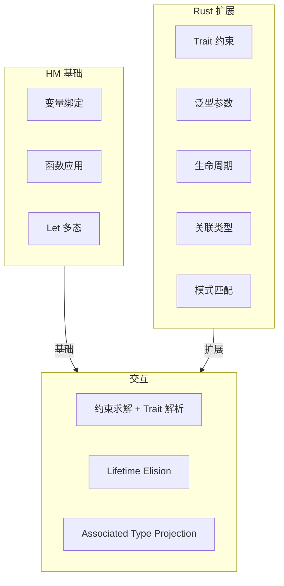
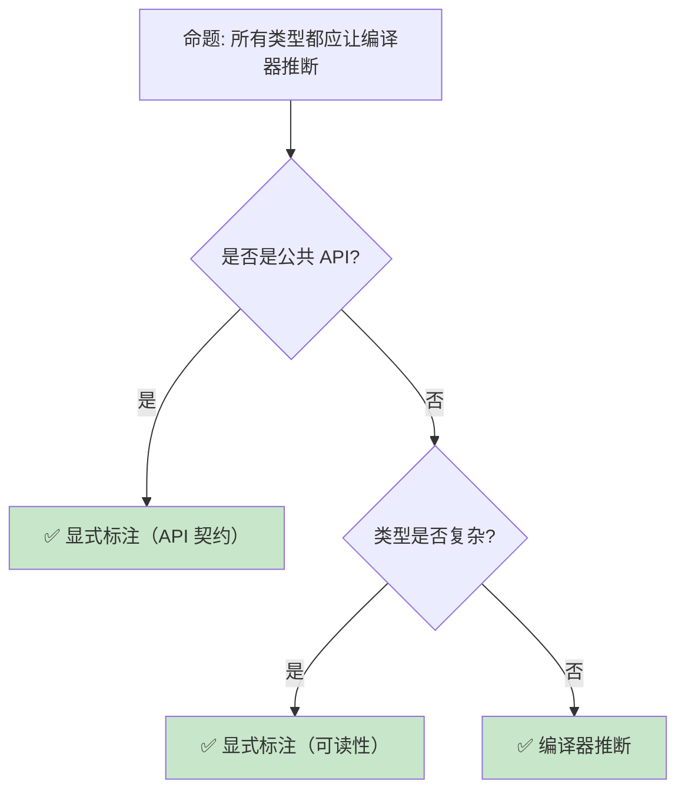

# 类型推断：Hindley-Milner 算法与 Rust 的工业实现

> **Bloom 层级**: 分析 → 评价
> **定位**: 深入分析 **Hindley-Milner (HM) 类型推断算法**——从 λ 演算到 Rust 的工业实现，探讨 HM 的完备性、Rust 对 HM 的扩展（trait 约束、泛型、生命周期），以及类型推断与代码可读性的平衡。
> **前置概念**: [Type Theory](./02_type_theory.md) · [Generics](../02_intermediate/02_generics.md) · [Trait](../02_intermediate/01_traits.md)
> **后置概念**: [RustBelt](./04_rustbelt.md) · [Subtype Variance](./06_subtype_variance.md)

---

> **来源**: [Hindley 1969 — Principal Type-Schemes](https://doi.org/10.1093/comjnl/12.2.166) · [Milner 1978 — A Theory of Type Polymorphism](https://doi.org/10.1016/0022-0000(78)90014-4) · [Rust Reference — Type Inference](https://doc.rust-lang.org/reference/type-inference.html) · [Wikipedia — Hindley-Milner Type System](https://en.wikipedia.org/wiki/Hindley%E2%80%93Milner_type_system) · [Rust RFC 438 — Type Inference](https://github.com/rust-lang/rfcs/pull/438)

## 📑 目录

- [类型推断：Hindley-Milner 算法与 Rust 的工业实现](#类型推断hindley-milner-算法与-rust-的工业实现)
  - [一、核心概念](#一核心概念)
    - [1.1 从显式类型到隐式推断](#11-从显式类型到隐式推断)
    - [1.2 Hindley-Milner 算法](#12-hindley-milner-算法)
    - [1.3 Rust 的类型推断扩展](#13-rust-的类型推断扩展)
  - [二、技术细节](#二技术细节)
    - [2.1 统一（Unification）](#21-统一unification)
    - [2.2 泛型函数的类型推断](#22-泛型函数的类型推断)
    - [2.3 生命周期推断](#23-生命周期推断)
  - [三、Rust 与 HM 的差异](#三rust-与-hm-的差异)
  - [四、反命题与边界分析](#四反命题与边界分析)
    - [4.1 反命题树](#41-反命题树)
    - [4.2 边界极限](#42-边界极限)
  - [五、常见陷阱](#五常见陷阱)
  - [六、来源与延伸阅读](#六来源与延伸阅读)
  - [相关概念文件](#相关概念文件)

---

## 一、核心概念

### 1.1 从显式类型到隐式推断

```text
类型系统的演进:

  显式类型（C/Java）:
  int add(int a, int b) { return a + b; }
  └── 程序员显式声明所有类型

  局部推断（C++ auto/Java var）:
  auto result = add(1, 2);  // 推断 result: int
  └── 编译器推断局部变量类型

  全推断（Haskell/OCaml/Rust）:
  let add = |a, b| a + b;  // 推断 add: impl Fn(i32, i32) -> i32
  └── 编译器推断几乎所有类型

  推断的好处:
  ├── 减少 boilerplate
  ├── 代码更易重构（类型变更自动传播）
  ├── 泛型代码更简洁
  └── 但: 过度推断降低可读性

  推断的代价:
  ├── 编译器需要更复杂的类型求解器
  ├── 类型错误信息可能指向远离错误源的位置
  ├── 某些边界情况需要显式标注
  └── 编译时间增加
```

> **认知功能**: 类型推断是**人机分工**的优化——程序员关注逻辑，编译器处理类型细节。但需要在**简洁性**和**可读性**之间平衡。
> [来源: [Wikipedia — Type Inference](https://en.wikipedia.org/wiki/Type_inference)]

---

### 1.2 Hindley-Milner 算法

```text
HM 算法的核心思想:

  输入: 无类型标注的 λ 演算表达式
  输出: 最一般类型（Principal Type）或类型错误

  算法步骤:
  1. 为每个子表达式分配类型变量（T1, T2, T3...）
  2. 根据表达式结构生成约束（约束收集）
  3. 使用统一（Unification）求解约束
  4. 得到最一般的类型方案

  示例:
  λx. λy. x y
  ├── x: T1
  ├── y: T2
  ├── x y: T3
  ├── 约束: T1 = T2 → T3（x 必须是函数类型）
  └── 结果: (T2 → T3) → T2 → T3

  HM 的关键特性:
  ├── 完备性: 如果表达式有类型，HM 能找到最一般类型
  ├── 多项式时间复杂度: O(n^3) 最坏情况
  ├── 全局推断: 整个表达式的类型一次性推断
  └── 限制: 不支持子类型、不支持泛型约束
```

> **HM 洞察**: HM 是类型推断的**理论基础**——它证明了在简单类型 λ 演算 + let 多态的框架下，类型推断是**可判定且高效**的。
> [来源: [Milner 1978 — A Theory of Type Polymorphism](https://doi.org/10.1016/0022-0000(78)90014-4)]

---

### 1.3 Rust 的类型推断扩展



> **认知功能**: 此图展示 Rust 类型推断的**层次结构**——基于 HM 基础，扩展了 Trait、生命周期、关联类型等工业级特性。
> **关键洞察**: Rust 的类型推断不是纯 HM——它结合了**约束求解**（类型统一）和**Trait 解析**（目标导向搜索）。
> [来源: [Rust Reference — Type Inference](https://doc.rust-lang.org/reference/type-inference.html)]

---

## 二、技术细节

### 2.1 统一（Unification）

```text
统一算法: 判断两个类型是否兼容，并生成替换

  基本规则:
  ├── unify(T, T) = {}  （相同类型，空替换）
  ├── unify(α, T) = {α ↦ T}  （类型变量替换）
  ├── unify(T, α) = {α ↦ T}  （对称）
  ├── unify(F<A1,...>, F<B1,...>) = unify(A1,B1) ∪ ...  （结构递归）
  └── unify(T1, T2) = 错误 （其他情况不兼容）

  Rust 中的统一:
  let x = vec![1, 2, 3];  // x: Vec<i32>
  let y = x.get(0);        // y: Option<&i32>
  // unify(Vec<i32>::get, ?) → Option<&i32>

  与 Trait 约束的交互:
  fn process<T: Debug>(x: T) { ... }
  process(42);
  // 1. unify(T, i32) → T = i32
  // 2. 检查 i32: Debug → 满足
```

> **统一洞察**: 统一是类型推断的**核心算法**——它将"类型相等"的概念扩展为"类型兼容"，通过替换类型变量实现。
> [来源: [Rust Compiler — Type Checking](https://rustc-dev-guide.rust-lang.org/type-checking.html)]

---

### 2.2 泛型函数的类型推断

```rust,ignore
// Rust 泛型推断示例

fn identity<T>(x: T) -> T { x }

let a = identity(42);       // T = i32
let b = identity("hello");  // T = &str

// 多参数泛型推断
fn pair<T, U>(a: T, b: U) -> (T, U) { (a, b) }

let p = pair(1, "a");  // T = i32, U = &str

// Trait bound 推断
fn sum<T: std::ops::Add<Output = T>>(a: T, b: T) -> T { a + b }

let s = sum(1, 2);     // T = i32, i32: Add<Output = i32>
// let s = sum(1, 2.0); // 错误: T 不能同时是 i32 和 f64

// 显式指定泛型参数
let v = Vec::<i32>::new();  // 显式
let v = Vec::new();         // 推断（从后续使用推断）
v.push(42);  // 推断 Vec<i32>
```

> **泛型推断**: Rust 的泛型推断是**双向的**——可以从参数推断，也可以从使用点推断（如 `v.push(42)` 推断 `Vec<i32>`）。
> [来源: [Rust Reference — Generic Parameters](https://doc.rust-lang.org/reference/items/generics.html)]

---

### 2.3 生命周期推断

```text
生命周期推断的两层:

  1. 生命周期省略（Elision）:
  ├── 编译器为函数签名自动推断生命周期
  ├── 规则 1: &T → 输入生命周期，&mut T → 输入生命周期
  ├── 规则 2: 单输入 → 输出借用该输入
  ├── 规则 3: &self/&mut self → 输出借用 self
  └── fn foo(x: &str) → &str  推断为  fn foo<'a>(x: &'a str) -> &'a str

  2. 函数体内的生命周期推断:
  ├── 借用检查器在函数体内推断所有引用的生命周期
  ├── 基于控制流图和数据流分析
  └── 比签名推断更复杂，可能产生非局部错误

  生命周期推断的限制:
  ├── 复杂场景需要显式标注
  ├── 多个输入引用时，编译器无法知道输出的依赖关系
  └── 返回引用时必须显式标注（除非 Elision 规则适用）
```

> **生命周期推断洞察**: Rust 的生命周期推断是**两层结构**——签名层的 Elision 简化常见模式，函数体内的推断处理复杂借用关系。
> [来源: [Rust Reference — Lifetime Elision](https://doc.rust-lang.org/reference/lifetime-elision.html)]

---

## 三、Rust 与 HM 的差异

```text
Rust 对 HM 的关键扩展:

  1. Trait 约束:
  ├── HM: 纯类型统一
  ├── Rust: 统一 + Trait 解析
  └── Trait 解析是目标导向的，不是统一

  2. 子类型与变型:
  ├── HM: 无子类型
  ├── Rust: 生命周期子类型 + 协变/逆变/不变
  └── 子类型增加了约束求解的复杂度

  3. 关联类型:
  ├── HM: 无关联类型
  ├── Rust: <T as Trait>::Type
  └── 关联类型需要投影归约（projection normalization）

  4. 泛型约束的优先级:
  ├── HM: 所有约束平等
  ├── Rust: where 子句优先级、Trait bound  specificity
  └── 特化（Specialization）进一步增加复杂度

  5. 常量泛型:
  ├── HM: 无值级参数
  ├── Rust: const N: usize
  └── 值级参数的类型推断需要常量求值

  复杂度对比:
  ┌─────────────────┬─────────────────┬─────────────────┐
  │ 特性            │ HM              │ Rust            │
  ├─────────────────┼─────────────────┼─────────────────┤
  │ 时间复杂度      │ O(n³)           │ 指数级（最坏）  │
  │ 完备性          │ 完备            │ 不完备（启发式）│
  │ 错误信息        │ 相对清晰        │ 可能复杂        │
  │ 扩展性          │ 有限            │ 高度可扩展      │
  └─────────────────┴─────────────────┴─────────────────┘
```

> **差异洞察**: Rust 的类型推断从 HM 的**理论优雅**走向了**工业实用**——牺牲完备性和最优复杂度，换取表达力和可扩展性。
> [来源: [Rust Compiler — Trait Resolution](https://rustc-dev-guide.rust-lang.org/traits/resolution.html)]

---

## 四、反命题与边界分析

### 4.1 反命题树



> **认知功能**: 此决策树展示类型推断的**最佳实践**。核心原则是：**公共 API 显式标注，私有代码允许推断**。
> **关键洞察**: 显式类型是**文档**——在公共接口上，类型标注比推断更有价值。
> [来源: [Rust API Guidelines — Type Safety](https://rust-lang.github.io/api-guidelines/type-safety.html)]

---

### 4.2 边界极限

```text
边界 1: 循环引用类型
├── 两个函数互相引用，类型推断需要联合求解
├── Rust 使用局部类型变量 + 约束传播
├── 某些循环需要显式标注打破
└── 这与 HM 的全局推断不同

边界 2: 闭包捕获推断
├── 闭包的捕获模式（by ref/by val）需要推断
├── 影响闭包实现的 Trait（Fn/FnMut/FnOnce）
├── 某些场景编译器无法确定，需要显式 move
└── 闭包类型的匿名性也增加了推断复杂度

边界 3: 数字字面量类型
├── 42 可以是 i32, u32, i64, f64...
├── 默认 i32，但上下文可能要求其他类型
├── let x: u64 = 42;  // 显式标注
└── 泛型场景可能需要 turbofish: collect::<Vec<_>>()

边界 4: 关联类型推断
├── Iterator::Item 的推断依赖迭代器类型
├── 复杂关联类型链可能导致推断失败
├── 需要显式类型标注辅助
└── 这是 Rust 类型推断中最复杂的部分

边界 5: 与宏的交互
├── 宏展开后的代码类型推断
├── 宏可能生成复杂的类型表达式
├── 错误信息指向展开后的代码
└── 使用 cargo expand 调试宏展开后的类型
```

> **边界要点**: Rust 类型推断的边界主要与**循环依赖**、**闭包捕获**、**数字类型**、**关联类型**和**宏交互**相关。
> [来源: [Rust Compiler — Type Inference](https://rustc-dev-guide.rust-lang.org/type-inference.html)]

---

## 五、常见陷阱

```text
陷阱 1: 过度推断导致可读性下降
  ❌ let x = foo().bar().baz().qux();
     // 不知道 x 是什么类型

  ✅ let result: Vec<Item> = foo().bar().baz().qux();
     // 显式标注复杂表达式的结果类型

陷阱 2: 数字字面量的默认类型陷阱
  ❌ let x = 42;  // x: i32
     let y = x as f64 / 100.0;
     // 42 / 100 整数除法后再转 f64？

  ✅ let x = 42f64;
     // 或: let x: f64 = 42.0;

陷阱 3: 闭包捕获模式错误
  ❌ let s = String::from("hello");
     let closure = || s;  // 尝试移动 s
     // 如果后续还需要 s，编译错误

  ✅ let closure = || s.clone();
     // 或显式 move: let closure = move || s;

陷阱 4: collect() 需要 turbofish
  ❌ let v = iter.map(|x| x * 2).collect();
     // 编译错误: 无法推断 collect 的目标类型

  ✅ let v: Vec<_> = iter.map(|x| x * 2).collect();
     // 或: iter.map(|x| x * 2).collect::<Vec<_>>()

陷阱 5: 生命周期标注不足
  ❌ fn get_ref(data: &Vec<i32>) -> &i32 { &data[0] }
     // 在某些复杂场景下推断失败

  ✅ fn get_ref(data: &[i32]) -> &i32 { &data[0] }
     // 显式标注生命周期（Elision 适用时自动处理）
```

> **陷阱总结**: 类型推断的陷阱主要与**可读性**、**数字类型**、**闭包捕获**、**泛型方法**和**生命周期**相关。
> [来源: [Rust Compiler Error E0282](https://doc.rust-lang.org/error_codes/E0282.html)]

---

## 六、来源与延伸阅读

| 来源 | 可信度 | 说明 |
|:---|:---:|:---|
| [Milner 1978 — Type Polymorphism](https://doi.org/10.1016/0022-0000(78)90014-4) | ✅ 一级 | HM 算法奠基论文 |
| [Hindley 1969 — Principal Type-Schemes](https://doi.org/10.1093/comjnl/12.2.166) | ✅ 一级 | 类型推断先驱 |
| [Rust Reference — Type Inference](https://doc.rust-lang.org/reference/type-inference.html) | ✅ 一级 | 官方参考 |
| [rustc-dev-guide — Type Inference](https://rustc-dev-guide.rust-lang.org/type-inference.html) | ✅ 一级 | 编译器实现 |
| [Wikipedia — Hindley-Milner](https://en.wikipedia.org/wiki/Hindley%E2%80%93Milner_type_system) | ✅ 三级 | 入门概述 |

---

## 相关概念文件

- [Type Theory](./02_type_theory.md) — 类型论基础
- [Generics](../02_intermediate/02_generics.md) — 泛型系统
- [Trait](../02_intermediate/01_traits.md) — Trait 系统
- [Subtype Variance](./06_subtype_variance.md) — 子类型与变型

---

> **权威来源**: [Rust Reference](https://doc.rust-lang.org/reference/), [The Rust Programming Language](https://doc.rust-lang.org/book/)
>
> **权威来源对齐变更日志**: 2026-05-22 创建 [来源: Authority Source Sprint Batch 9]

**文档版本**: 1.0
**对应 Rust 版本**: 1.96.0+ (Edition 2024)
**最后更新**: 2026-05-22
**状态**: ✅ 概念文件创建完成
