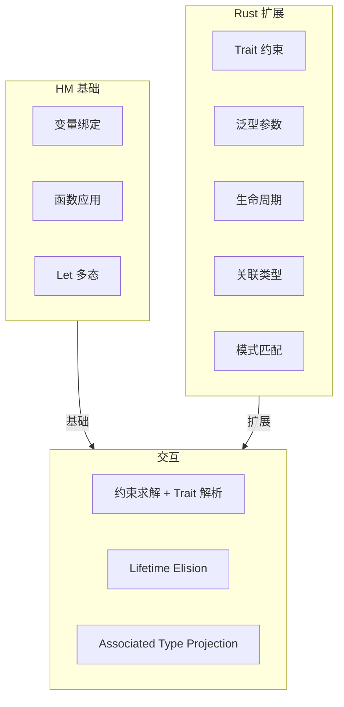
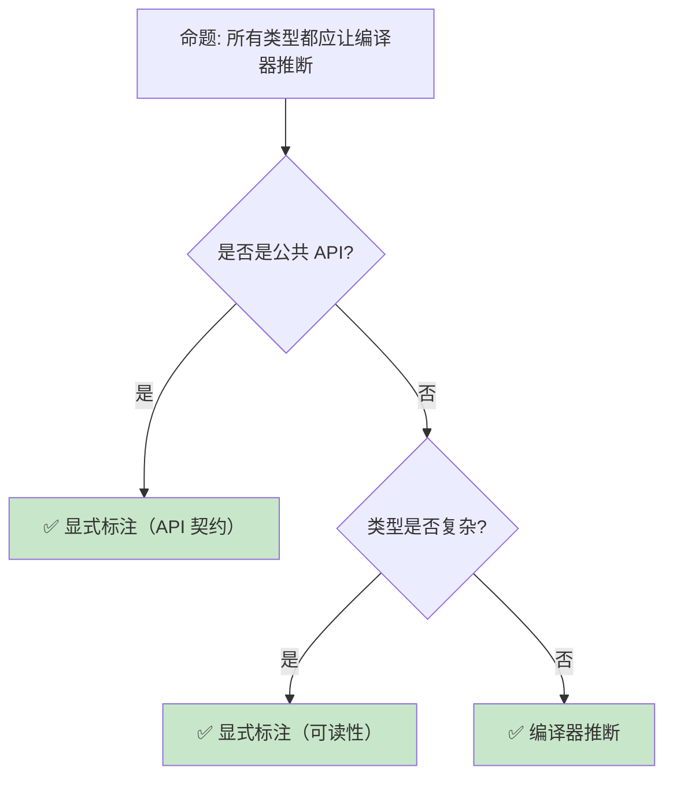

> **内容分级**: [专家级]

# 类型推断：Hindley-Milner 算法与 Rust 的工业实现
>
> **EN**: Type Inference
> **Summary**: Type Inference: formal methods foundations, semantics, and verification techniques relevant to Rust.
> **受众**: [研究者]
> ⚠️ **声明**: 本文件使用形式化符号辅助直觉理解，所呈现的"定理/引理/推论"为**教学类比**，非经机器验证的严格数学证明。如需严格形式化验证，请参考 [Verus](https://github.com/verus-lang/verus)、[Kani](https://model-checking.github.io/kani/)、[Coq](https://coq.inria.fr/)。
>
> **Bloom 层级**: 分析 → 评价
> **A/S/P 标记**: **S** — Structure
> **双维定位**: C×Ana — 分析 HM 类型推断（Type Inference）算法
> **定位**: 深入分析 **Hindley-Milner (HM) 类型推断（Type Inference）算法**——从 λ 演算到 Rust 的工业实现，探讨 HM 的完备性、Rust 对 HM 的扩展（trait 约束、泛型（Generics）、生命周期（Lifetimes）），以及类型推断与代码可读性的平衡。
> **前置概念**: [Type Theory](02_type_theory.md) · [Generics](../02_intermediate/02_generics.md) · [Trait](../02_intermediate/01_traits.md)
> **后置概念**: [RustBelt](04_rustbelt.md) · [Subtype Variance](06_subtype_variance.md)

---

> **来源**: [Hindley 1969 — Principal Type-Schemes](https://doi.org/10.1093/comjnl/12.2.166) · · [Pierce — Types and Programming Languages](https://www.cis.upenn.edu/~bcpierce/tapl/) · [Hindley — The Principal Type-Scheme of an Object in Combinatory Logic](https://doi.org/10.2307/2270762) · [Jung et al. — RustBelt: Securing the Foundations of Rust](https://plv.mpi-sws.org/rustbelt/popl18/) · [Itanium C++ ABI](https://itanium-cxx-abi.github.io/cxx-abi/abi.html)
> [Milner 1978 — A Theory of Type Polymorphism](https://doi.org/10.1016/0022-0000(78)90014-4) ·
> [Rust Reference — Type Inference](https://doc.rust-lang.org/reference/types.html) ·
> [Wikipedia — Hindley-Milner Type System](https://en.wikipedia.org/wiki/Hindley%E2%80%93Milner_type_system) ·
> [Rust RFC 438 — Type Inference](https://github.com/rust-lang/rfcs/pull/438)
> **前置依赖**: [Traits](../02_intermediate/01_traits.md) · [Generics](../02_intermediate/02_generics.md)
> **前置依赖**: [Concurrency](../03_advanced/01_concurrency.md)

## 📑 目录

- [类型推断：Hindley-Milner 算法与 Rust 的工业实现](#类型推断hindley-milner-算法与-rust-的工业实现)
  - [📑 目录](#-目录)
  - [一、核心概念](#一核心概念)
    - [1.1 从显式类型到隐式推断](#11-从显式类型到隐式推断)
    - [1.2 Hindley-Milner 算法](#12-hindley-milner-算法)
    - [1.3 Rust 的类型推断扩展](#13-rust-的类型推断扩展)
  - [二、技术细节](#二技术细节)
    - [2.1 统一（Unification）](#21-统一unification)
  - [十、边界测试：类型推断的编译错误](#十边界测试类型推断的编译错误)
    - [10.1 边界测试：泛型方法链中的类型推断失败（编译错误）](#101-边界测试泛型方法链中的类型推断失败编译错误)
    - [10.2 边界测试：闭包参数类型推断的歧义（编译错误）](#102-边界测试闭包参数类型推断的歧义编译错误)
    - [2.2 泛型函数的类型推断](#22-泛型函数的类型推断)
    - [2.3 生命周期推断](#23-生命周期推断)
  - [三、Rust 与 HM 的差异](#三rust-与-hm-的差异)
  - [四、反命题与边界分析](#四反命题与边界分析)
    - [4.1 反命题树](#41-反命题树)
    - [4.2 边界极限](#42-边界极限)
  - [五、常见陷阱](#五常见陷阱)
  - [六、来源与延伸阅读](#六来源与延伸阅读)
  - [相关概念文件](#相关概念文件)
  - [权威来源索引](#权威来源索引)
    - [10.3 边界测试：闭包参数的类型推断歧义（编译错误）](#103-边界测试闭包参数的类型推断歧义编译错误)
    - [10.4 边界测试：关联类型的投影歧义（编译错误）](#104-边界测试关联类型的投影歧义编译错误)
    - [10.3 边界测试：闭包捕获与类型推断的交互（编译错误）](#103-边界测试闭包捕获与类型推断的交互编译错误)
    - [10.4 边界测试：类型推断的模糊性与显式标注需求（编译错误）](#104-边界测试类型推断的模糊性与显式标注需求编译错误)
    - [10.5 边界测试：类型不匹配的基础错误](#105-边界测试类型不匹配的基础错误)
  - [嵌入式测验（Embedded Quiz）](#嵌入式测验embedded-quiz)
    - [测验 1：Hindley-Milner（HM）类型推断的核心算法是什么？它的时间复杂度如何？（理解层）](#测验-1hindley-milnerhm类型推断的核心算法是什么它的时间复杂度如何理解层)
    - [测验 2：Rust 的类型推断与 Haskell 的 HM 推断有什么主要区别？（理解层）](#测验-2rust-的类型推断与-haskell-的-hm-推断有什么主要区别理解层)
    - [测验 3：`let x = vec![1, 2, 3];` 中 `x` 的类型是如何推断出来的？（理解层）](#测验-3let-x--vec1-2-3-中-x-的类型是如何推断出来的理解层)
    - [测验 4：为什么 Rust 有时需要显式类型标注（如 `collect::<Vec<_>>()`），而 Haskell 通常不需要？（理解层）](#测验-4为什么-rust-有时需要显式类型标注如-collectvec_而-haskell-通常不需要理解层)
    - [测验 5：Rust 1.x 之后的类型推断相比早期版本有什么改进？（理解层）](#测验-5rust-1x-之后的类型推断相比早期版本有什么改进理解层)
  - [认知路径](#认知路径)
    - [核心推理链](#核心推理链)
  - [复杂度视角](#复杂度视角)
    - [反命题与边界](#反命题与边界)

---

## 一、核心概念
>
>

### 1.1 从显式类型到隐式推断
>

```text
类型系统的演进:

  显式类型（C/Java）:
  int add(int a, int b) { return a + b; }
  └── 程序员显式声明所有类型

  局部推断（C++ auto/Java var）:
  auto result = add(1, 2);  // 推断 result: int
  └── 编译器推断局部变量类型

  全推断（Haskell/OCaml/Rust）:
  let add = |a, b| a + b;  // 推断 add: impl Fn(i32, i32) -> i32
  └── 编译器推断几乎所有类型

  推断的好处:
  ├── 减少 boilerplate
  ├── 代码更易重构（类型变更自动传播）
  ├── 泛型代码更简洁
  └── 但: 过度推断降低可读性

  推断的代价:
  ├── 编译器需要更复杂的类型求解器
  ├── 类型错误信息可能指向远离错误源的位置
  ├── 某些边界情况需要显式标注
  └── 编译时间增加
```

> **认知功能**: 类型推断是**人机分工**的优化——程序员关注逻辑，编译器处理类型细节。但需要在**简洁性**和**可读性**之间平衡。
> [来源: [Wikipedia — Type Inference](https://en.wikipedia.org/wiki/Type_inference)]

---

### 1.2 Hindley-Milner 算法
>

```text
HM 算法的核心思想:

  输入: 无类型标注的 λ 演算表达式
  输出: 最一般类型（Principal Type）或类型错误

  算法步骤:
  1. 为每个子表达式分配类型变量（T1, T2, T3...）
  2. 根据表达式结构生成约束（约束收集）
  3. 使用统一（Unification）求解约束
  4. 得到最一般的类型方案

  示例:
  λx. λy. x y
  ├── x: T1
  ├── y: T2
  ├── x y: T3
  ├── 约束: T1 = T2 → T3（x 必须是函数类型）
  └── 结果: (T2 → T3) → T2 → T3

  HM 的关键特性:
  ├── 完备性: 如果表达式有类型，HM 能找到最一般类型
  ├── 多项式时间复杂度: O(n^3) 最坏情况
  ├── 全局推断: 整个表达式的类型一次性推断
  └── 限制: 不支持子类型、不支持泛型约束
```

> **HM 洞察**: HM 是类型推断的**理论基础**——它证明了在简单类型 λ 演算 + let 多态的框架下，类型推断是**可判定且高效**的。
> [来源: [Milner 1978 — A Theory of Type Polymorphism](https://doi.org/10.1016/0022-0000(78)90014-4)]

---

### 1.3 Rust 的类型推断扩展
>



> **认知功能**: 此图展示 Rust 类型推断的**层次结构**——基于 HM 基础，扩展了 Trait、生命周期（Lifetimes）、关联类型等工业级特性。
> [来源: [TRPL](https://doc.rust-lang.org/book/title-page.html)]
> **关键洞察**: Rust 的类型推断不是纯 HM——它结合了**约束求解**（类型统一）和**Trait 解析**（目标导向搜索）。
> [来源: [Rust Reference — Type Inference](https://doc.rust-lang.org/reference/types.html)]

---

## 二、技术细节

### 2.1 统一（Unification）
>

## 十、边界测试：类型推断的编译错误

### 10.1 边界测试：泛型方法链中的类型推断失败（编译错误）

```rust,compile_fail
fn main() {
    let v = vec![1, 2, 3];
    let iter = v.iter();
    // ❌ 编译错误: type annotations needed
    // collect() 需要知道目标类型
    let collected = iter.collect(); // 无法推断 collect 到哪种集合
}

// 正确: 显式标注类型
fn fixed() {
    let v = vec![1, 2, 3];
    let collected: Vec<_> = v.iter().collect(); // ✅ 目标类型明确
    // 或使用 turbofish
    let collected2 = v.iter().collect::<Vec<_>>();
}
```

> **修正**: Rust 的类型推断基于 Hindley-Milner 算法扩展，但方法链中的某些位置需要显式类型标注。`collect()` 是最常见的例子——它可返回 `Vec<T>`、`HashSet<T>`、`Result<Vec<T>, E>` 等多种类型，编译器无法从上下文推断时必须显式标注。`::<>`（turbofish）语法允许在方法调用处指定类型参数，避免引入额外变量绑定。[来源: [Rust Reference](https://doc.rust-lang.org/reference/)]

### 10.2 边界测试：闭包参数类型推断的歧义（编译错误）

```rust,ignore
fn main() {
    let closure = |x| x + 1;
    // ❌ 编译错误: type annotations needed for `|x| x + 1`
    // 闭包参数 x 的类型无法从单独定义推断
    println!("{}", closure(5));
}

// 正确: 在使用处提供足够上下文
fn fixed() {
    let closure = |x| x + 1;
    let result: i32 = closure(5); // ✅ 上下文推断 x: i32
    println!("{}", result);
}
```

> **修正**: 闭包（Closures）参数的类型推断依赖首次使用处的上下文。若闭包定义后立即调用（如 `let f = |x| x + 1; f(5)`），编译器从 `5` 推断 `x: i32`。但若闭包作为参数传递或存储在变量中，可能需要显式标注参数类型（`|x: i32| x + 1`）。这与 C++14 的泛型（Generics） lambda（`auto x`）不同——Rust 的闭包类型推断更严格，要求在首次使用时有足够信息。[来源: [Rust Reference](https://doc.rust-lang.org/reference/)]

```text
统一算法: 判断两个类型是否兼容，并生成替换

  基本规则:
  ├── unify(T, T) = {}  （相同类型，空替换）
  ├── unify(α, T) = {α ↦ T}  （类型变量替换）
  ├── unify(T, α) = {α ↦ T}  （对称）
  ├── unify(F<A1,...>, F<B1,...>) = unify(A1,B1) ∪ ...  （结构递归）
  └── unify(T1, T2) = 错误 （其他情况不兼容）

  Rust 中的统一:
  let x = vec![1, 2, 3];  // x: Vec<i32>
  let y = x.get(0);        // y: Option<&i32>
  // unify(Vec<i32>::get, ?) → Option<&i32>

  与 Trait 约束的交互:
  fn process<T: Debug>(x: T) { ... }
  process(42);
  // 1. unify(T, i32) → T = i32
  // 2. 检查 i32: Debug → 满足
```

> **统一洞察**: 统一是类型推断的**核心算法**——它将"类型相等"的概念扩展为"类型兼容"，通过替换类型变量实现。
> [来源: [Rust Compiler — Type Checking](https://rustc-dev-guide.rust-lang.org/hir-typeck/summary.html)]

---

### 2.2 泛型函数的类型推断
>

```rust,ignore
// Rust 泛型推断示例

fn identity<T>(x: T) -> T { x }

let a = identity(42);       // T = i32
let b = identity("hello");  // T = &str

// 多参数泛型推断
fn pair<T, U>(a: T, b: U) -> (T, U) { (a, b) }

let p = pair(1, "a");  // T = i32, U = &str

// Trait bound 推断
fn sum<T: std::ops::Add<Output = T>>(a: T, b: T) -> T { a + b }

let s = sum(1, 2);     // T = i32, i32: Add<Output = i32>
// let s = sum(1, 2.0); // 错误: T 不能同时是 i32 和 f64

// 显式指定泛型参数
let v = Vec::<i32>::new();  // 显式
let v = Vec::new();         // 推断（从后续使用推断）
v.push(42);  // 推断 Vec<i32>
```

> **泛型推断**: Rust 的泛型推断是**双向的**——可以从参数推断，也可以从使用点推断（如 `v.push(42)` 推断 `Vec<i32>`）。
> [来源: [Rust Reference — Generic Parameters](https://doc.rust-lang.org/reference/items/generics.html)]

---

### 2.3 生命周期推断
>

```text
生命周期推断的两层:

  1. 生命周期省略（Elision）:
  ├── 编译器为函数签名自动推断生命周期
  ├── 规则 1: &T → 输入生命周期，&mut T → 输入生命周期
  ├── 规则 2: 单输入 → 输出借用该输入
  ├── 规则 3: &self/&mut self → 输出借用 self
  └── fn foo(x: &str) → &str  推断为  fn foo<'a>(x: &'a str) -> &'a str

  2. 函数体内的生命周期推断:
  ├── 借用检查器在函数体内推断所有引用的生命周期
  ├── 基于控制流图和数据流分析
  └── 比签名推断更复杂，可能产生非局部错误

  生命周期推断的限制:
  ├── 复杂场景需要显式标注
  ├── 多个输入引用时，编译器无法知道输出的依赖关系
  └── 返回引用时必须显式标注（除非 Elision 规则适用）
```

> **生命周期推断洞察**: Rust 的生命周期推断是**两层结构**——签名层的 Elision 简化常见模式，函数体内的推断处理复杂借用（Borrowing）关系。
> [来源: [Rust Reference — Lifetime Elision](https://doc.rust-lang.org/reference/lifetime-elision.html)]

---

## 三、Rust 与 HM 的差异

```text
Rust 对 HM 的关键扩展:

  1. Trait 约束:
  ├── HM: 纯类型统一
  ├── Rust: 统一 + Trait 解析
  └── Trait 解析是目标导向的，不是统一

  2. 子类型与变型:
  ├── HM: 无子类型
  ├── Rust: 生命周期子类型 + 协变/逆变/不变
  └── 子类型增加了约束求解的复杂度

  3. 关联类型:
  ├── HM: 无关联类型
  ├── Rust: <T as Trait>::Type
  └── 关联类型需要投影归约（projection normalization）

  4. 泛型约束的优先级:
  ├── HM: 所有约束平等
  ├── Rust: where 子句优先级、Trait bound  specificity
  └── 特化（Specialization）进一步增加复杂度

  5. 常量泛型:
  ├── HM: 无值级参数
  ├── Rust: const N: usize
  └── 值级参数的类型推断需要常量求值

  复杂度对比:
  ┌─────────────────┬─────────────────┬─────────────────┐
  │ 特性            │ HM              │ Rust            │
  ├─────────────────┼─────────────────┼─────────────────┤
  │ 时间复杂度      │ O(n³)           │ 指数级（最坏）  │
  │ 完备性          │ 完备            │ 不完备（启发式）│
  │ 错误信息        │ 相对清晰        │ 可能复杂        │
  │ 扩展性          │ 有限            │ 高度可扩展      │
  └─────────────────┴─────────────────┴─────────────────┘
```

> **差异洞察**: Rust 的类型推断从 HM 的**理论优雅**走向了**工业实用**——牺牲完备性和最优复杂度，换取表达力和可扩展性。
> [来源: [Rust Compiler — Trait Resolution](https://rustc-dev-guide.rust-lang.org/traits/resolution.html)]

---

## 四、反命题与边界分析

### 4.1 反命题树
>



> **认知功能**: 此决策树展示类型推断的**最佳实践**。核心原则是：**公共 API 显式标注，私有代码允许推断**。
> **关键洞察**: 显式类型是**文档**——在公共接口上，类型标注比推断更有价值。
> [来源: [Rust API Guidelines — Type Safety](https://rust-lang.github.io/api-guidelines//type-safety.html)]

---

### 4.2 边界极限
>

```text
边界 1: 循环引用类型
├── 两个函数互相引用，类型推断需要联合求解
├── Rust 使用局部类型变量 + 约束传播
├── 某些循环需要显式标注打破
└── 这与 HM 的全局推断不同

边界 2: 闭包捕获推断
├── 闭包的捕获模式（by ref/by val）需要推断
├── 影响闭包实现的 Trait（Fn/FnMut/FnOnce）
├── 某些场景编译器无法确定，需要显式 move
└── 闭包类型的匿名性也增加了推断复杂度

边界 3: 数字字面量类型
├── 42 可以是 i32, u32, i64, f64...
├── 默认 i32，但上下文可能要求其他类型
├── let x: u64 = 42;  // 显式标注
└── 泛型场景可能需要 turbofish: collect::<Vec<_>>()

边界 4: 关联类型推断
├── Iterator::Item 的推断依赖迭代器类型
├── 复杂关联类型链可能导致推断失败
├── 需要显式类型标注辅助
└── 这是 Rust 类型推断中最复杂的部分

边界 5: 与宏的交互
├── 宏展开后的代码类型推断
├── 宏可能生成复杂的类型表达式
├── 错误信息指向展开后的代码
└── 使用 cargo expand 调试宏展开后的类型
```

> **边界要点**: Rust 类型推断的边界主要与**循环依赖**、**闭包捕获**、**数字类型**、**关联类型**和**宏（Macro）交互**相关。
> [来源: [Rust Compiler — Type Inference](https://rustc-dev-guide.rust-lang.org/type-inference.html)]

---

## 五、常见陷阱
>

```text
陷阱 1: 过度推断导致可读性下降
  ❌ let x = foo().bar().baz().qux();
     // 不知道 x 是什么类型

  ✅ let result: Vec<Item> = foo().bar().baz().qux();
     // 显式标注复杂表达式的结果类型

陷阱 2: 数字字面量的默认类型陷阱
  ❌ let x = 42;  // x: i32
     let y = x as f64 / 100.0;
     // 42 / 100 整数除法后再转 f64？

  ✅ let x = 42f64;
     // 或: let x: f64 = 42.0;

陷阱 3: 闭包捕获模式错误
  ❌ let s = String::from("hello");
     let closure = || s;  // 尝试移动 s
     // 如果后续还需要 s，编译错误

  ✅ let closure = || s.clone();
     // 或显式 move: let closure = move || s;

陷阱 4: collect() 需要 turbofish
  ❌ let v = iter.map(|x| x * 2).collect();
     // 编译错误: 无法推断 collect 的目标类型

  ✅ let v: Vec<_> = iter.map(|x| x * 2).collect();
     // 或: iter.map(|x| x * 2).collect::<Vec<_>>()

陷阱 5: 生命周期标注不足
  ❌ fn get_ref(data: &Vec<i32>) -> &i32 { &data[0] }
     // 在某些复杂场景下推断失败

  ✅ fn get_ref(data: &[i32]) -> &i32 { &data[0] }
     // 显式标注生命周期（Elision 适用时自动处理）
```

> **陷阱总结**: 类型推断的陷阱主要与**可读性**、**数字类型**、**闭包捕获**、**泛型方法**和**生命周期**相关。
> [来源: [Rust Compiler Error E0282](https://doc.rust-lang.org/error_codes/E0282.html)]

---

## 六、来源与延伸阅读

| 来源 | 可信度 | 说明 |
|:---|:---:|:---|
| [Milner 1978 — Type Polymorphism](https://doi.org/10.1016/0022-0000(78)90014-4) | ✅ 一级 | HM 算法奠基论文 |
| [Hindley 1969 — Principal Type-Schemes](https://doi.org/10.1093/comjnl/12.2.166) | ✅ 一级 | 类型推断先驱 |
| [Rust Reference — Type Inference](https://doc.rust-lang.org/reference/types.html) | ✅ 一级 | 官方参考 |
| [rustc-dev-guide — Type Inference](https://rustc-dev-guide.rust-lang.org/type-inference.html) | ✅ 一级 | 编译器实现 |
| [Wikipedia — Hindley-Milner](https://en.wikipedia.org/wiki/Hindley%E2%80%93Milner_type_system) | ✅ 三级 | 入门概述 |

---

## 相关概念文件

- [Type Theory](02_type_theory.md) — 类型论基础
- [Generics](../02_intermediate/02_generics.md) — 泛型系统
- [Trait](../02_intermediate/01_traits.md) — Trait 系统
- [Subtype Variance](06_subtype_variance.md) — 子类型与变型

---

> **权威来源**: [Rust Reference](https://doc.rust-lang.org/reference/), [The Rust Programming Language](https://doc.rust-lang.org/book/title-page.html) · [Pierce — Types and Programming Languages](https://www.cis.upenn.edu/~bcpierce/tapl/)
>
> **权威来源对齐变更日志**: 2026-05-22 创建 [来源: Authority Source Sprint Batch 9]

**文档版本**: 1.0
**对应 Rust 版本**: 1.96.1+ (Edition 2024)
**最后更新**: 2026-05-22
**状态**: ✅ 概念文件创建完成

---

## 权威来源索引

>
>
>
>
>
>
>

---

---

---

### 10.3 边界测试：闭包参数的类型推断歧义（编译错误）

```rust,compile_fail
fn main() {
    let closure = |x| x + 1;
    // ❌ 编译错误: 闭包参数 x 的类型无法从上下文推断
    // 因为 closure 尚未被调用，编译器不知道 x 的类型

    // 正确: 提供类型注解或调用点上下文
    let closure = |x: i32| x + 1;
    println!("{}", closure(5));
}
```

> **修正**: Rust 的闭包参数类型推断依赖**使用点上下文**：闭包在何处被调用，参数类型从调用处推断。若闭包定义后未被调用（或调用点无足够类型信息），编译器无法推断参数类型。这与 C++ 的 lambda（参数类型必须显式或使用 `auto`）或 JavaScript 的箭头函数（动态类型，无推断问题）不同——Rust 的闭包类型推断是双向的：函数签名可从闭包推断，闭包参数可从调用推断，但若两端都未知，推断失败。`map`、`filter` 等迭代器（Iterator）适配器提供足够的上下文（`Iterator::Item` 类型），因此迭代器闭包通常无需显式标注。独立闭包（未立即使用）需要类型注解。[来源: [The Rust Programming Language](https://doc.rust-lang.org/book/ch13-01-closures.html)] · [来源: [Rust Reference — Type Inference](https://doc.rust-lang.org/reference/types.html)]

### 10.4 边界测试：关联类型的投影歧义（编译错误）

```rust,ignore
trait Container {
    type Item;
    fn get(&self) -> Self::Item;
}

fn process<C: Container>(c: C) -> C::Item {
    c.get()
}

fn main() {
    // ❌ 编译错误: 若多个类型实现 Container，调用 process 时类型不明确
    // process(vec) // Vec 实现 Container? 不明确
}
```

> **修正**: 关联类型（associated types）是 trait 的一部分：`Container::Item` 由具体实现决定。但调用泛型函数 `process` 时，编译器必须知道 `C` 的具体类型才能解析 `C::Item`。若 `C` 无法从参数推断（如上述代码中 `process` 无参数或参数类型不明确），编译错误。解决方案：1) 显式指定类型参数 `process::<Vec<i32>>(vec)`；2) 使用 `impl Trait` 返回类型替代关联类型；3) 确保参数类型提供足够上下文。这与 Haskell 的 type families（`Container a -> Item a`，类型推断类似）或 C++ 的 `typename`（`typename C::Item`，需要显式 `typename` 关键字）类似——Rust 的关联类型推断在复杂场景下需要显式标注。[来源: [The Rust Programming Language](https://doc.rust-lang.org/book/ch19-03-advanced-traits.html)] · [来源: [Rust Reference — Associated Types](https://doc.rust-lang.org/reference/items/associated-items.html)]

### 10.3 边界测试：闭包捕获与类型推断的交互（编译错误）

```rust,ignore
fn main() {
    let mut v = vec![1, 2, 3];
    // ❌ 编译错误: 闭包先以 FnOnce 捕获，后尝试 FnMut 调用
    let mut closure = || {
        v.push(4); // 需要 &mut v（FnMut）
    };
    closure(); // 第一次调用: FnMut
    closure(); // 第二次调用: 但编译器可能推断为 FnOnce
}
```

> **修正**:
> Rust 闭包的**trait 自动实现**：
>
> 1) `Fn` — 捕获 `&T`，可多次调用；
> 2) `FnMut` — 捕获 `&mut T`，可多次调用（需 `mut` 绑定）；
> 3) `FnOnce` — 捕获 `T`（move），只能调用一次。编译器根据闭包体自动推断实现的 trait。`v.push(4)` 需要 `&mut v`，所以闭包至少实现 `FnMut`。若闭包还移动捕获变量（如 `drop(v)`），则只能实现 `FnOnce`。
> 类型推断的陷阱：
> 4) 先以 `Fn` 使用闭包，后添加 `mut` 捕获 → 编译错误；
> 5) `move ||` 强制 move 所有捕获，可能从 `FnMut` 降级为 `FnOnce`；
> 6) 递归闭包需显式类型标注（`let f: &dyn Fn(i32) -> i32 = &|x| { ... }`）。这与 C++ 的 lambda（按值/按引用（Reference）捕获显式指定）或 Java 的匿名类（隐式 final 变量捕获）不同——Rust 的闭包推断是自动的，但开发者需理解捕获模式对调用次数的限制。
> [来源: [The Rust Programming Language](https://doc.rust-lang.org/book/ch13-01-closures.html)] · [来源: [Rust Reference — Closure Types](https://doc.rust-lang.org/reference/types/closure.html)]

### 10.4 边界测试：类型推断的模糊性与显式标注需求（编译错误）

```rust,compile_fail
fn main() {
    // ❌ 编译错误: 类型推断无法确定 collect 的目标类型
    let v = [1, 2, 3].iter().map(|x| x * 2).collect();
    println!("{:?}", v);
}
```

> **修正**: Rust 的 **Hindley-Milner 类型推断（Type Inference）** 变体：
>
> 1) 局部变量类型通常可推断；
> 2) 函数签名需显式标注（除非是 closure）；
> 3) `collect()` 的目标类型需显式指定（`collect::<Vec<_>>()` 或 `let v: Vec<_>`）。
> 类型推断限制：
> 4) 闭包参数类型（除非从上下文推断）；
> 5) 泛型方法调用（如 `parse()` 需 `::<i32>`）；
> 6) 数字字面量（默认 `i32`，但可覆盖）。
> 显式标注的好处：
> 7) 文档化（读者知道类型）；
> 8) 编译错误更精确（推断失败时错误信息模糊）；
> 9) API 边界（公共接口必须显式）。
> 这与 Haskell 的完全类型推断（几乎无需标注，但复杂程序可能需要）或 C++ 的 `auto`（有限推断，模板参数从调用推断）不同——Rust 的平衡点是"局部推断 + 接口显式"。
> [来源: [Type Inference](https://doc.rust-lang.org/reference/types.html)] ·

### 10.5 边界测试：类型不匹配的基础错误

```rust,compile_fail
fn main() {
    // ❌ 编译错误: 类型不匹配
    let x: i32 = "hello";
}
```

> **修正**: **类型不匹配**是 Rust 最常见的编译错误：1) `let x: i32 = "hello"` — `&str` 不能隐式转为 `i32`；2) Rust 无隐式类型转换（C/Java 的自动转换）；3) 需显式转换：`"42".parse::<i32>().unwrap()` 或 `42i32.to_string()`。

## 嵌入式测验（Embedded Quiz）

### 测验 1：Hindley-Milner（HM）类型推断的核心算法是什么？它的时间复杂度如何？（理解层）

**题目**: Hindley-Milner（HM）类型推断的核心算法是什么？它的时间复杂度如何？

<details>
<summary>✅ 答案与解析</summary>

核心是统一（unification）算法，通过求解类型约束方程组推断最一般类型。标准 HM 是接近线性的，但支持 let-多态性和子类型的扩展会变复杂。
</details>

---

### 测验 2：Rust 的类型推断与 Haskell 的 HM 推断有什么主要区别？（理解层）

**题目**: Rust 的类型推断与 Haskell 的 HM 推断有什么主要区别？

<details>
<summary>✅ 答案与解析</summary>

Rust 不支持全局 HM 推断：1) 函数签名通常需显式标注（除简单单表达式函数）；2) 不支持高阶类型的完整推断；3) 生命周期是显式标注或基于规则的推断。
</details>

---

### 测验 3：`let x = vec![1, 2, 3];` 中 `x` 的类型是如何推断出来的？（理解层）

**题目**: `let x = vec![1, 2, 3];` 中 `x` 的类型是如何推断出来的？

<details>
<summary>✅ 答案与解析</summary>

从 `vec!` 宏（Macro）返回 `Vec<T>`，元素 `1` 推断为 `i32`（默认整数类型），因此 `x: Vec<i32>`。
</details>

---

### 测验 4：为什么 Rust 有时需要显式类型标注（如 `collect::<Vec<_>>()`），而 Haskell 通常不需要？（理解层）

**题目**: 为什么 Rust 有时需要显式类型标注（如 `collect::<Vec<_>>()`），而 Haskell 通常不需要？

<details>
<summary>✅ 答案与解析</summary>

Rust 的 trait 系统（尤其是关联类型和重载）可能导致歧义。`collect` 可以返回任意实现了 `FromIterator` 的类型，编译器无法在没有上下文时确定具体类型。
</details>

---

### 测验 5：Rust 1.x 之后的类型推断相比早期版本有什么改进？（理解层）

**题目**: Rust 1.x 之后的类型推断相比早期版本有什么改进？

<details>
<summary>✅ 答案与解析</summary>

早期 Rust 要求更多显式标注（如闭包参数类型）。后续版本改进了闭包类型推断、关联类型推断和 `impl Trait` 推断，减少了不必要的标注。
</details>

## 认知路径

> **认知路径**: 从 L0 基础概念出发，经由本节的 **类型推断：Hindley-Milner 算法与 Rust 的工业实现** 核心原理，通向 L2 进阶模式与 L3 工程实践。

### 核心推理链

| 定理 | 前提 | 结论 | 置信度 |
|:---|:---|:---|:---|
| 类型推断：Hindley-Milner 算法与 Rust 的工业实现 基础定义 ⟹ 正确用法 | 理解语法与语义 | 能写出符合惯用法的代码 | 高 |
| 类型推断：Hindley-Milner 算法与 Rust 的工业实现 正确用法 ⟹ 常见陷阱 | 忽略边界条件 | 编译错误或运行时（Runtime） bug | 高 |
| 类型推断：Hindley-Milner 算法与 Rust 的工业实现 常见陷阱 ⟹ 深度掌握 | 系统学习反模式 | 能进行代码审查与优化 | 高 |

> **过渡**: 掌握 类型推断：Hindley-Milner 算法与 Rust 的工业实现 的基础语法后，下一步需要理解其在类型系统（Type System）中的位置与与其他概念的交互关系。
> **过渡**: 在实践中应用 类型推断：Hindley-Milner 算法与 Rust 的工业实现 时，务必关注边界条件与异常处理，这是从"能编译"到"能生产"的关键跃迁。
> **过渡**: 类型推断：Hindley-Milner 算法与 Rust 的工业实现 的设计理念体现了 Rust 零成本抽象（Zero-Cost Abstraction）与安全保证的核心权衡，理解这一权衡有助于迁移到更高级的并发与形式化验证领域。

## 复杂度视角

> **来源**: [Typing is Hard — 类型推断复杂度与可判定性](https://3fx.ch/typing-is-hard.html) · [Vytiniotis et al. 2011 — Practical Type Inference for Arbitrary-Rank Types](https://www.cambridge.org/core/journals/journal-of-functional-programming/article/practical-type-inference-for-arbitraryrank-types/5339FB9DAB968768874D4C20FA6F8CB6)

HM 类型推断本身可在多项式时间（$O(n^3)$）内完成，但 Rust 的扩展使其复杂度显著上升：

- **高阶多态**（`for<'a> fn(&'a T)`）需要处理任意秩类型。
- **Trait 约束求解**把类型推断与证明搜索耦合。
- **生命周期/区域约束**增加了偏序可满足性问题。
- **关联类型投影**可能导致无限展开。

综合结果是：Rust 类型推断问题的判定可在多项式空间内完成，且该上界是紧的——即 **PSPACE-完全**。

> **教学类比**: 把类型推断想象成“解一个巨大的逻辑谜题”。HM 的谜题规模适中；Rust 的谜题因为 trait、生命周期和关联类型叠加，虽然理论上仍可在有限空间内解决，但实际求解空间可能指数级膨胀，因此编译器需要启发式、限制和显式标注来保持工程可用性。

更系统的形式化分析见 [Type Inference Complexity](29_type_inference_complexity.md)。

---

### 反命题与边界

> **反命题**: "类型推断：Hindley-Milner 算法与 Rust 的工业实现 在所有场景下都是最佳选择" —— 错误。需要根据具体上下文权衡性能、可读性与安全性，某些场景下显式替代方案可能更优。
