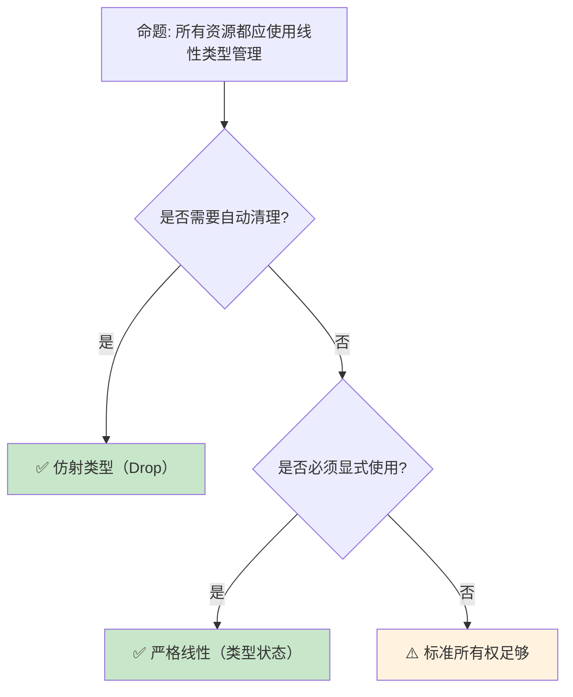

# 线性逻辑在 Rust 中的工程应用

> **Bloom 层级**: 分析 → 评价
> **定位**: 深入分析**线性逻辑**如何从理论概念转化为 Rust 的**工程实践**——从资源管理、协议状态机到 session types，揭示形式化类型论在现代系统编程中的实际价值。
> **前置概念**: [Linear Logic](./01_linear_logic.md) · [Type System](../01_foundation/04_type_system.md) · [Ownership](../01_foundation/01_ownership.md)
> **后置概念**: [RustBelt](./04_rustbelt.md) · [Session Types](https://en.wikipedia.org/wiki/Session_type)

---

> **来源**: [Linear Logic — Girard 1987](https://girard.perso.math.cnrs.fr/linear.pdf) ·
> [Session Types for Rust](https://www.jaist.ac.jp/~sgonda/paper/2020_scico.html) ·
> [RustBelt Paper](https://plv.mpi-sws.org/rustbelt/popl18/) ·
> [Wadler — Propositions as Sessions](https://homepages.inf.ed.ac.uk/wadler/papers/linearsubtypes/linearsubtypes.pdf) ·
> [Wikipedia — Linear Logic](https://en.wikipedia.org/wiki/Linear_logic)

## 📑 目录
>
> [来源: [Rust Reference](https://doc.rust-lang.org/reference/)]
>
> [来源: [TRPL](https://doc.rust-lang.org/book/)]

- [线性逻辑在 Rust 中的工程应用](#线性逻辑在-rust-中的工程应用)
  - [📑 目录](#-目录)
  - [一、核心概念](#一核心概念)
    - [1.1 从线性逻辑到所有权](#11-从线性逻辑到所有权)
    - [1.2 资源作为类型](#12-资源作为类型)
    - [1.3 Session Types 与通信协议](#13-session-types-与通信协议)
  - [二、技术细节](#二技术细节)
    - [2.1 所有权即线性类型](#21-所有权即线性类型)
    - [2.2 仿射类型与 Drop](#22-仿射类型与-drop)
    - [2.3 类型状态模式](#23-类型状态模式)
  - [三、工程应用矩阵](#三工程应用矩阵)
  - [四、反命题与边界分析](#四反命题与边界分析)
    - [4.1 反命题树](#41-反命题树)
    - [4.2 边界极限](#42-边界极限)
  - [五、常见陷阱](#五常见陷阱)
  - [六、来源与延伸阅读](#六来源与延伸阅读)
  - [相关概念文件](#相关概念文件)

---

## 一、核心概念
>
> [来源: [Rust Reference](https://doc.rust-lang.org/reference/)]
>
> [来源: [Rust Reference](https://doc.rust-lang.org/reference/)]

### 1.1 从线性逻辑到所有权

```text
线性逻辑到 Rust 的映射:

  线性逻辑概念          Rust 实现
  ─────────────────────────────────────────
  线性命题 (A ⊸ B)      所有权转移 (T → U)
  乘法合取 (A ⊗ B)      元组 (T, U)
  加法合取 (A & B)      enum（选择）
  加法析取 (A ⊕ B)      变体类型
  指数 (!A)             Clone/Copy（复制）
  回收站 (⊥)            Drop trait

  核心对应:
  ├── 线性性: 资源必须恰好使用一次
  │   └── Rust: 值必须被移动或使用
  ├── 仿射性: 资源最多使用一次
  │   └── Rust: 值可以被丢弃（Drop）
  └── 指数: 资源可任意复制
      └── Rust: Copy trait

  关键洞察:
  Rust 的所有权系统不是纯粹的线性类型系统
  ├── 线性: 资源必须恰好使用一次
  ├── 仿射: 资源可以使用零次或一次（Rust 的实际模型）
  └── 通过 Drop 允许"使用零次"
```

> **认知功能**: Rust 的所有权是**仿射类型系统**的工程实现——它放宽了线性逻辑的"必须恰好使用一次"为"最多使用一次"，通过 Drop 实现资源的自动释放。
> [来源: [Girard — Linear Logic](https://girard.perso.math.cnrs.fr/linear.pdf)]

---

### 1.2 资源作为类型

```rust,ignore
// 资源即类型: 文件描述符示例

struct FileDescriptor {
    fd: RawFd,
}

// 线性使用: FileDescriptor 只能被消费一次
impl FileDescriptor {
    // 读取: 消费 fd，返回数据和新的 fd（如果有）
    fn read(self, buf: &mut [u8]) -> Result<(usize, FileDescriptor), io::Error> {
        let n = unsafe { libc::read(self.fd, buf.as_mut_ptr() as *mut c_void, buf.len()) };
        if n < 0 {
            return Err(io::Error::last_os_error());
        }
        Ok((n as usize, self))  // 返回 self，保持线性性
    }

    // 关闭: 消费 fd，不返回
    fn close(self) {
        unsafe { libc::close(self.fd) };
        // self 被消费，之后不能使用
    }
}

// 使用:
let fd = FileDescriptor::open("file.txt")?;
let (n, fd) = fd.read(&mut buf)?;  // 必须重新获取 fd
fd.close();  // fd 被消费
// fd.read(...);  // ❌ 编译错误！fd 已被消费
```

> **资源洞察**: 将**资源建模为线性类型**确保资源生命周期在类型层面被追踪——不可能使用已关闭的文件描述符。
> [来源: [RustBelt — Ownership as Types](https://plv.mpi-sws.org/rustbelt/popl18/)]

---

### 1.3 Session Types 与通信协议

```text
Session Types: 将通信协议编码为类型

  基本操作:
  ├── Send<T, S>: 发送 T，继续协议 S
  ├── Recv<T, S>: 接收 T，继续协议 S
  ├── Offer<S1, S2>: 提供选择
  ├── Choose<S1, S2>: 做出选择
  └── End: 协议结束

  示例协议（买家-卖家）:

  Buyer: Send<String, Recv<Price, Choose<
              Send<CreditCard, Recv<Receipt, End>>,
              Send<Address, Recv<Invoice, End>>
         >>>

  Rust 实现 (session-types crate):

  type BuyerProtocol = Send<String, Recv<u64, Choose<
      Send<CreditCard, Recv<Receipt, End>>,
      Send<Address, Recv<Invoice, End>>
  >>>;

  价值:
  ├── 协议违规在编译期捕获
  ├── 不可能发送错误类型的消息
  ├── 不可能在错误的状态执行操作
  └── 通信双方类型互补（对偶性）
```

> **Session Types 洞察**: Session Types 将**通信协议的正确性**从运行时测试转化为**编译期类型检查**——协议违规成为类型错误。
> [来源: [Wadler — Propositions as Sessions](https://homepages.inf.ed.ac.uk/wadler/papers/linearsubtypes/linearsubtypes.pdf)]

---

## 二、技术细节
>
> [来源: [Rust Reference](https://doc.rust-lang.org/reference/)]
>
> [来源: [TRPL](https://doc.rust-lang.org/book/)]

### 2.1 所有权即线性类型

```rust,ignore
// Rust 的所有权 = 仿射类型

// 线性类型要求: 值必须恰好使用一次
// 仿射类型允许: 值可以使用零次或一次

let s = String::from("hello");
let t = s;  // s 移动到 t
// println!("{}", s);  // ❌ 编译错误！s 已被移动

// 使用零次（仿射性）:
let u = String::from("unused");
// u 在这里被 Drop，无需显式使用
// 这是线性逻辑不允许的，但仿射逻辑允许

// Copy: 从仿射回到指数（可任意复制）
let x = 42;
let y = x;
let z = x;  // ✅ i32 实现 Copy，可以多次使用

// 手动实现线性类型（通过禁用 Drop 的自动调用）
struct Linear<T>(T);

impl<T> Linear<T> {
    fn new(value: T) -> Self { Linear(value) }
    fn into_inner(self) -> T { self.0 }
    // 不实现 Drop，强制使用 into_inner
}

// 使用:
let l = Linear::new(vec![1, 2, 3]);
let v = l.into_inner();  // 必须显式消费
// l 之后不可用
```

> **所有权洞察**: Rust 的**所有权是仿射类型**的实践——它平衡了安全性和实用性，通过 `Drop` 允许隐式释放，通过 `Copy` 允许复制。
> [来源: [Rust Reference — Ownership](https://doc.rust-lang.org/reference/ownership.html)]

---

### 2.2 仿射类型与 Drop

```rust,ignore
// Drop 使 Rust 成为仿射而非严格线性

struct DatabaseConnection {
    conn: *mut c_void,
}

impl Drop for DatabaseConnection {
    fn drop(&mut self) {
        unsafe { db_close(self.conn) };
        println!("Connection closed automatically");
    }
}

// 使用:
{
    let conn = DatabaseConnection::open("db://localhost")?;
    conn.query("SELECT * FROM users")?;
} // conn 在这里自动 drop，即使没有被显式"消费"

// 对比严格线性:
// 在线性类型中，conn 必须显式关闭:
// conn.close();  // 必须调用，否则编译错误

// Rust 的选择:
// ├── 仿射类型更实用（大多数资源需要自动清理）
// ├── 但可以通过类型状态模式实现严格线性
// └── 权衡: 安全性 vs 开发体验
```

> **Drop 洞察**: `Drop` 是 Rust **从线性到仿射的关键设计决策**——它使资源管理更实用，但也意味着某些线性属性（如必须显式关闭）需要额外的类型技巧来强制。
> [来源: [std::ops::Drop](https://doc.rust-lang.org/std/ops/trait.Drop.html)]

---

### 2.3 类型状态模式

```rust,ignore
// 类型状态: 将状态编码到类型中

// 协议状态机示例: 数据库事务

struct Connection;
struct Transaction;
struct Committed;
struct RolledBack;

struct Db<State> {
    // 状态无关的字段
    _state: PhantomData<State>,
}

// 状态转换:
impl Db<Connection> {
    fn begin(self) -> Db<Transaction> {
        // 开始事务
        Db { _state: PhantomData }
    }
}

impl Db<Transaction> {
    fn commit(self) -> Db<Committed> {
        // 提交事务
        Db { _state: PhantomData }
    }

    fn rollback(self) -> Db<RolledBack> {
        // 回滚事务
        Db { _state: PhantomData }
    }

    fn query(&mut self, sql: &str) -> Result<Vec<Row>, Error> {
        // 在事务中查询
        todo!()
    }
}

// 使用:
let conn = Db::<Connection>::new();
let txn = conn.begin();
let txn = txn.query("INSERT ...")?;
let committed = txn.commit();
// committed.rollback();  // ❌ 编译错误！已提交事务不能回滚

// 价值:
// ├── 编译期状态验证
// ├── 不可能在错误状态执行操作
// └── 状态转换是类型转换
```

> **类型状态洞察**: **类型状态模式**是线性逻辑在 Rust 中的**最直接工程应用**——它将状态机从运行时检查转化为编译期类型约束。
> [来源: [Rust Patterns — Typestate](https://rust-unofficial.github.io/patterns/patterns/behavioural/typestate.html)]

---

## 三、工程应用矩阵
>
> [来源: [Rust Reference](https://doc.rust-lang.org/reference/)]
>
> [来源: [TRPL](https://doc.rust-lang.org/book/)]

```text
线性逻辑 → Rust 工程应用:

  资源管理:
  ├── 文件描述符
  ├── 网络连接
  ├── 数据库事务
  └── GPU 上下文

  协议实现:
  ├── HTTP/2 状态机
  ├── TLS 握手协议
  ├── WebSocket 连接状态
  └── 自定义通信协议

  并发控制:
  ├── MutexGuard（持有锁的线性证明）
  ├── RwLockReadGuard
  ├── 通道发送端/接收端
  └── 一次性屏障（Barrier）

  API 设计:
  ├── Builder 模式（渐进式构造）
  ├── 一次性 Token
  ├── 权限凭证
  └── 会话密钥
```

> **应用矩阵**: 线性逻辑的**核心工程价值**是"让非法状态不可表示"——通过类型系统消除运行时状态错误。
> [来源: [Session Types in Rust](https://www.jaist.ac.jp/~sgonda/paper/2020_scico.html)]

---

## 四、反命题与边界分析
>
> [来源: [Rust Reference](https://doc.rust-lang.org/reference/)]
>
> [来源: [Rust Reference](https://doc.rust-lang.org/reference/)]

### 4.1 反命题树



> **认知功能**: **线性类型是一个谱系**——从严格线性（必须显式使用）到仿射（可自动丢弃）到标准所有权，根据场景选择。
> [来源: [Linear Logic — Variations](https://en.wikipedia.org/wiki/Linear_logic)]

---

### 4.2 边界极限

```text
边界 1: 类型系统复杂性
├── 过度使用类型状态导致代码复杂
├── 每个状态是一个类型参数
├── 可能产生"类型体操"
└── 缓解: 只在关键状态转换使用

边界 2: 与现有生态的集成
├── 标准库不使用类型状态
├── 与第三方 crate 集成时可能丢失线性保证
├── FFI 边界完全丧失类型保证
└── 缓解: 在边界处重新建立不变性

边界 3: 编译错误信息
├── 类型状态错误可能难以理解
├── "expected Db<Transaction>, found Db<Connection>"
├── 需要良好的文档和错误设计
└── 缓解: 使用清晰的类型命名

边界 4: 运行时开销
├── 类型状态完全是零成本（PhantomData）
├── 但过度抽象可能阻碍优化
├── 状态转换可能产生额外代码
└── 缓解: 保持抽象轻量

边界 5: 设计成本
├── 类型状态需要预先设计完整状态机
├── 变更状态机成本较高
├── 不适合探索性编程
└── 缓解: 先原型，再形式化
```

> **边界要点**: 线性类型工程的边界主要与**复杂性**、**生态集成**、**错误信息**、**设计成本**相关。
> [来源: [Rust API Guidelines — Type Safety](https://rust-lang.github.io/api-guidelines/type-safety.html)]

---

## 五、常见陷阱
>
> [来源: [Rust Reference](https://doc.rust-lang.org/reference/)]

```text
陷阱 1: 过度工程
  ❌ 为简单状态使用类型状态
     // 增加不必要的复杂性

  ✅ 只在状态错误有严重后果时使用
     // 如数据库事务、安全协议

陷阱 2: 忘记 PhantomData
  ❌ struct Db<State> { conn: Connection }
     // 编译器可能忽略 State 参数优化

  ✅ struct Db<State> { conn: Connection, _state: PhantomData<State> }
     // 明确标记 State 参与类型

陷阱 3: 手动实现 Clone/Copy
  ❌ 为线性类型实现 Copy
     // 破坏线性保证！

  ✅ 不实现 Copy，谨慎实现 Clone
     // 或实现后验证线性性

陷阱 4: 与标准库互操作丢失保证
  ❌ 将线性资源放入 Vec，然后取出
     // Vec 的索引访问不保持线性

  ✅ 使用数组或自定义容器
     // 或限制为单元素

陷阱 5: 错误消息不友好
  ❌ 类型名为 S1, S2, S3
     // 用户无法理解状态含义

  ✅ 类型名为 Idle, Connected, Authenticated
     // 自文档化
```

> **陷阱总结**: 线性类型工程的陷阱主要与**过度设计**、**PhantomData**、**Clone/Copy**、**容器选择**和**命名**相关。
> [来源: [Rust Reference — PhantomData](https://doc.rust-lang.org/std/marker/struct.PhantomData.html)]

---

## 六、来源与延伸阅读
>
> [来源: [Rust Reference](https://doc.rust-lang.org/reference/)]

| 来源 | 可信度 | 说明 |
|:---|:---:|:---|
| [Girard — Linear Logic](https://girard.perso.math.cnrs.fr/linear.pdf) | ✅ 一级 | 原始论文 |
| [RustBelt](https://plv.mpi-sws.org/rustbelt/popl18/) | ✅ 一级 | Rust 形式化验证 |
| [Wadler — Propositions as Sessions](https://homepages.inf.ed.ac.uk/wadler/papers/linearsubtypes/linearsubtypes.pdf) | ✅ 一级 | Session Types |
| [Session Types in Rust](https://www.jaist.ac.jp/~sgonda/paper/2020_scico.html) | ✅ 一级 | 工程实现 |
| [Rust Patterns — Typestate](https://rust-unofficial.github.io/patterns/patterns/behavioural/typestate.html) | ✅ 二级 | 模式库 |

---

## 相关概念文件
>
> [来源: [Rust Reference](https://doc.rust-lang.org/reference/)]
>
> [来源: [Rust Reference](https://doc.rust-lang.org/reference/)]

- [Linear Logic](./01_linear_logic.md) — 线性逻辑
- [Ownership](../01_foundation/01_ownership.md) — 所有权系统
- [Type System](../01_foundation/04_type_system.md) — 类型系统
- [RustBelt](./04_rustbelt.md) — 形式化验证

---

> **权威来源**: [Rust Reference](https://doc.rust-lang.org/reference/), [The Rust Programming Language](https://doc.rust-lang.org/book/)
>
> **权威来源对齐变更日志**: 2026-05-22 创建 [来源: Authority Source Sprint Batch 10]

**文档版本**: 1.0
**对应 Rust 版本**: 1.96.0+ (Edition 2024)
**最后更新**: 2026-05-22
**状态**: ✅ 概念文件创建完成
