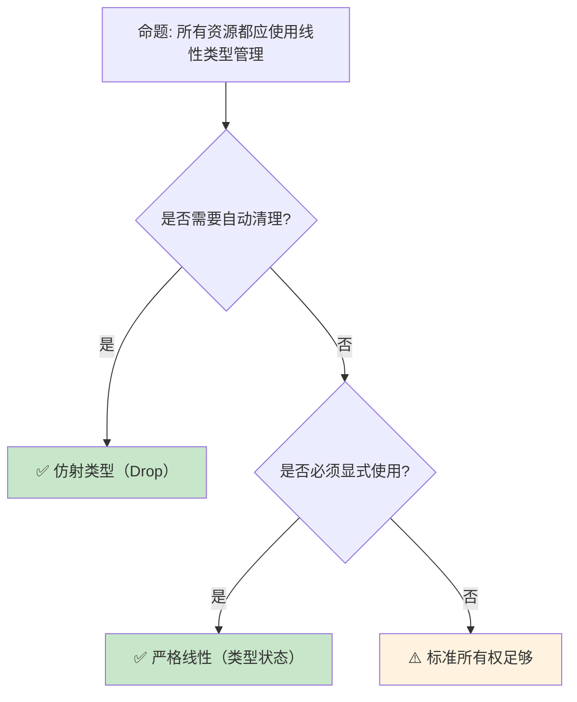

> **内容分级**: [专家级]

# 线性逻辑在 Rust 中的工程应用
>
> **EN**: Linear Logic
> **Summary**: Linear Logic. Core Rust concept covering formal methods foundations, formal logic foundations, practical applications.
> **受众**: [研究者]
> ⚠️ **声明**: 本文件使用形式化符号辅助直觉理解，所呈现的"定理/引理/推论"为**教学类比**，非经机器验证的严格数学证明。如需严格形式化验证，请参考 [Verus](https://github.com/verus-lang/verus)、[Kani](https://model-checking.github.io/kani/)、[Coq](https://coq.inria.fr/)。
>
> **Bloom 层级**: 分析 → 评价
> **定位**: 深入分析**线性逻辑**如何从理论概念转化为 Rust 的**工程实践**——从资源管理、协议状态机到 session types，揭示形式化类型论在现代系统编程中的实际价值。
> **前置概念**: [Linear Logic](01_linear_logic.md) · [Type System](../01_foundation/04_type_system.md) · [Ownership](../01_foundation/01_ownership.md)
> **后置概念**: [RustBelt](04_rustbelt.md) · [Session Types](https://en.wikipedia.org/wiki/Session_type)
>
> **来源**: [Rust Reference](https://doc.rust-lang.org/reference/) · [RustBelt](https://plv.mpi-sws.org/rustbelt/) · [Itanium C++ ABI](https://itanium-cxx-abi.github.io/cxx-abi/abi.html)
---

> **来源**: [Linear Logic — Girard 1987](https://girard.perso.math.cnrs.fr/linear.pdf) ·
> [Session Types for Rust](https://munksgaard.me/papers/laumann-munksgaard-larsen.pdf) ·
> [RustBelt Paper](https://plv.mpi-sws.org/rustbelt/popl18/) ·
> [Wadler — Propositions as Sessions](https://homepages.inf.ed.ac.uk/wadler/papers/linearsub/linearsub.ps) ·
> [Wikipedia — Linear Logic](https://en.wikipedia.org/wiki/Linear_logic)
> **前置依赖**: [Traits](../02_intermediate/01_traits.md) · [Generics](../02_intermediate/02_generics.md)
> **前置依赖**: [Concurrency](../03_advanced/01_concurrency.md)

## 📑 目录

- [线性逻辑在 Rust 中的工程应用](#线性逻辑在-rust-中的工程应用)
  - [📑 目录](#-目录)
  - [一、核心概念](#一核心概念)
    - [1.1 从线性逻辑到所有权](#11-从线性逻辑到所有权)
    - [1.2 资源作为类型](#12-资源作为类型)
    - [1.3 Session Types 与通信协议](#13-session-types-与通信协议)
  - [二、技术细节](#二技术细节)
    - [2.1 所有权即线性类型](#21-所有权即线性类型)
    - [2.2 仿射类型与 Drop](#22-仿射类型与-drop)
    - [2.3 类型状态模式](#23-类型状态模式)
  - [三、工程应用矩阵](#三工程应用矩阵)
  - [四、反命题与边界分析](#四反命题与边界分析)
    - [4.1 反命题树](#41-反命题树)
    - [4.2 边界极限](#42-边界极限)
  - [五、常见陷阱](#五常见陷阱)
  - [六、来源与延伸阅读](#六来源与延伸阅读)
  - [相关概念文件](#相关概念文件)
  - [权威来源索引](#权威来源索引)
  - [十、边界测试：线性逻辑应用的编译错误](#十边界测试线性逻辑应用的编译错误)
    - [10.1 边界测试：资源线性消耗与 `Drop` 的冲突（编译错误）](#101-边界测试资源线性消耗与-drop-的冲突编译错误)
    - [10.2 边界测试：`Vec` 的线性所有权与索引（运行时 panic）](#102-边界测试vec-的线性所有权与索引运行时-panic)
    - [10.3 边界测试：线性资源的隐式复制（编译错误）](#103-边界测试线性资源的隐式复制编译错误)
    - [10.4 边界测试：`Copy` 与 `Drop` 的互斥性（编译错误）](#104-边界测试copy-与-drop-的互斥性编译错误)
    - [10.5 边界测试：`Vec::drain` 与线性资源的消耗（编译错误）](#105-边界测试vecdrain-与线性资源的消耗编译错误)
    - [10.3 边界测试：线性类型与 `Drop` 的资源泄漏边界（编译错误/逻辑问题）](#103-边界测试线性类型与-drop-的资源泄漏边界编译错误逻辑问题)
  - [嵌入式测验（Embedded Quiz）](#嵌入式测验embedded-quiz)
    - [测验 1：线性逻辑中的"线性"（linearity）指什么？与 Rust 的所有权有什么对应关系？（理解层）](#测验-1线性逻辑中的线性linearity指什么与-rust-的所有权有什么对应关系理解层)
    - [测验 2：在线性逻辑中，`A ⊗ B`（张量积）和 `A & B`（with）分别对应 Rust 的什么概念？（理解层）](#测验-2在线性逻辑中a--b张量积和-a--bwith分别对应-rust-的什么概念理解层)
    - [测验 3：Rust 的 `clone()` 在线性逻辑视角下是什么操作？（理解层）](#测验-3rust-的-clone-在线性逻辑视角下是什么操作理解层)
    - [测验 4：为什么 Rust 的借用（`&T` 和 `&mut T`）可以在线性逻辑框架中被建模？（理解层）](#测验-4为什么-rust-的借用t-和-mut-t可以在线性逻辑框架中被建模理解层)
    - [测验 5：线性逻辑对 Rust 类型系统设计的影响主要体现在哪个编译器组件中？（理解层）](#测验-5线性逻辑对-rust-类型系统设计的影响主要体现在哪个编译器组件中理解层)
  - [认知路径](#认知路径)
    - [核心推理链](#核心推理链)
    - [反命题与边界](#反命题与边界)

---

## 一、核心概念
>
>

### 1.1 从线性逻辑到所有权
>

```text
线性逻辑到 Rust 的映射:

  线性逻辑概念          Rust 实现
  ─────────────────────────────────────────
  线性命题 (A ⊸ B)      所有权转移 (T → U)
  乘法合取 (A ⊗ B)      元组 (T, U)
  加法合取 (A & B)      enum（选择）
  加法析取 (A ⊕ B)      变体类型
  指数 (!A)             Clone/Copy（复制）
  回收站 (⊥)            Drop trait

  核心对应:
  ├── 线性性: 资源必须恰好使用一次
  │   └── Rust: 值必须被移动或使用
  ├── 仿射性: 资源最多使用一次
  │   └── Rust: 值可以被丢弃（Drop）
  └── 指数: 资源可任意复制
      └── Rust: Copy trait

  关键洞察:
  Rust 的所有权系统不是纯粹的线性类型系统
  ├── 线性: 资源必须恰好使用一次
  ├── 仿射: 资源可以使用零次或一次（Rust 的实际模型）
  └── 通过 Drop 允许"使用零次"
```

> **认知功能**: Rust 的所有权（Ownership）是**仿射类型系统（Type System）**的工程实现——它放宽了线性逻辑的"必须恰好使用一次"为"最多使用一次"，通过 Drop 实现资源的自动释放。
> [来源: [Girard — Linear Logic](https://girard.perso.math.cnrs.fr/linear.pdf)]

---

### 1.2 资源作为类型
>

```rust,ignore
// 资源即类型: 文件描述符示例

struct FileDescriptor {
    fd: RawFd,
}

// 线性使用: FileDescriptor 只能被消费一次
impl FileDescriptor {
    // 读取: 消费 fd，返回数据和新的 fd（如果有）
    fn read(self, buf: &mut [u8]) -> Result<(usize, FileDescriptor), io::Error> {
        let n = unsafe { libc::read(self.fd, buf.as_mut_ptr() as *mut c_void, buf.len()) };
        if n < 0 {
            return Err(io::Error::last_os_error());
        }
        Ok((n as usize, self))  // 返回 self，保持线性性
    }

    // 关闭: 消费 fd，不返回
    fn close(self) {
        unsafe { libc::close(self.fd) };
        // self 被消费，之后不能使用
    }
}

// 使用:
let fd = FileDescriptor::open("file.txt")?;
let (n, fd) = fd.read(&mut buf)?;  // 必须重新获取 fd
fd.close();  // fd 被消费
// fd.read(...);  // ❌ 编译错误！fd 已被消费
```

> **资源洞察**: 将**资源建模为线性类型**确保资源生命周期（Lifetimes）在类型层面被追踪——不可能使用已关闭的文件描述符。
> [来源: [RustBelt — Ownership as Types](https://plv.mpi-sws.org/rustbelt/popl18/)]

---

### 1.3 Session Types 与通信协议
>

```text
Session Types: 将通信协议编码为类型

  基本操作:
  ├── Send<T, S>: 发送 T，继续协议 S
  ├── Recv<T, S>: 接收 T，继续协议 S
  ├── Offer<S1, S2>: 提供选择
  ├── Choose<S1, S2>: 做出选择
  └── End: 协议结束

  示例协议（买家-卖家）:

  Buyer: Send<String, Recv<Price, Choose<
              Send<CreditCard, Recv<Receipt, End>>,
              Send<Address, Recv<Invoice, End>>
         >>>

  Rust 实现 (session-types crate):

  type BuyerProtocol = Send<String, Recv<u64, Choose<
      Send<CreditCard, Recv<Receipt, End>>,
      Send<Address, Recv<Invoice, End>>
  >>>;

  价值:
  ├── 协议违规在编译期捕获
  ├── 不可能发送错误类型的消息
  ├── 不可能在错误的状态执行操作
  └── 通信双方类型互补（对偶性）
```

> **Session Types 洞察**: Session Types 将**通信协议的正确性**从运行时（Runtime）测试转化为**编译期类型检查**——协议违规成为类型错误。
> [来源: [Wadler — Propositions as Sessions](https://homepages.inf.ed.ac.uk/wadler/papers/linearsub/linearsub.ps)]

---

## 二、技术细节

### 2.1 所有权即线性类型
>

```rust
// Rust 的所有权 = 仿射类型

// 线性类型要求: 值必须恰好使用一次
// 仿射类型允许: 值可以使用零次或一次

let s = String::from("hello");
let t = s;  // s 移动到 t
// println!("{}", s);  // ❌ 编译错误！s 已被移动

// 使用零次（仿射性）:
let u = String::from("unused");
// u 在这里被 Drop，无需显式使用
// 这是线性逻辑不允许的，但仿射逻辑允许

// Copy: 从仿射回到指数（可任意复制）
let x = 42;
let y = x;
let z = x;  // ✅ i32 实现 Copy，可以多次使用

// 手动实现线性类型（通过禁用 Drop 的自动调用）
struct Linear<T>(T);

impl<T> Linear<T> {
    fn new(value: T) -> Self { Linear(value) }
    fn into_inner(self) -> T { self.0 }
    // 不实现 Drop，强制使用 into_inner
}

// 使用:
let l = Linear::new(vec![1, 2, 3]);
let v = l.into_inner();  // 必须显式消费
// l 之后不可用
```

> **所有权洞察**: Rust 的**所有权是仿射类型**的实践——它平衡了安全性和实用性，通过 `Drop` 允许隐式释放，通过 `Copy` 允许复制。
> [来源: [Rust Reference — Ownership](https://doc.rust-lang.org/book/ch04-00-understanding-ownership.html)]

---

### 2.2 仿射类型与 Drop
>

```rust,ignore
// Drop 使 Rust 成为仿射而非严格线性

struct DatabaseConnection {
    conn: *mut c_void,
}

impl Drop for DatabaseConnection {
    fn drop(&mut self) {
        unsafe { db_close(self.conn) };
        println!("Connection closed automatically");
    }
}

// 使用:
{
    let conn = DatabaseConnection::open("db://localhost")?;
    conn.query("SELECT * FROM users")?;
} // conn 在这里自动 drop，即使没有被显式"消费"

// 对比严格线性:
// 在线性类型中，conn 必须显式关闭:
// conn.close();  // 必须调用，否则编译错误

// Rust 的选择:
// ├── 仿射类型更实用（大多数资源需要自动清理）
// ├── 但可以通过类型状态模式实现严格线性
// └── 权衡: 安全性 vs 开发体验
```

> **Drop 洞察**: `Drop` 是 Rust **从线性到仿射的关键设计决策**——它使资源管理更实用，但也意味着某些线性属性（如必须显式关闭）需要额外的类型技巧来强制。
> [来源: [std::ops::Drop](https://doc.rust-lang.org/std/ops/trait.Drop.html)]

---

### 2.3 类型状态模式
>

```rust,ignore
// 类型状态: 将状态编码到类型中

// 协议状态机示例: 数据库事务

struct Connection;
struct Transaction;
struct Committed;
struct RolledBack;

struct Db<State> {
    // 状态无关的字段
    _state: PhantomData<State>,
}

// 状态转换:
impl Db<Connection> {
    fn begin(self) -> Db<Transaction> {
        // 开始事务
        Db { _state: PhantomData }
    }
}

impl Db<Transaction> {
    fn commit(self) -> Db<Committed> {
        // 提交事务
        Db { _state: PhantomData }
    }

    fn rollback(self) -> Db<RolledBack> {
        // 回滚事务
        Db { _state: PhantomData }
    }

    fn query(&mut self, sql: &str) -> Result<Vec<Row>, Error> {
        // 在事务中查询
        todo!()
    }
}

// 使用:
let conn = Db::<Connection>::new();
let txn = conn.begin();
let txn = txn.query("INSERT ...")?;
let committed = txn.commit();
// committed.rollback();  // ❌ 编译错误！已提交事务不能回滚

// 价值:
// ├── 编译期状态验证
// ├── 不可能在错误状态执行操作
// └── 状态转换是类型转换
```

> **类型状态洞察**: **类型状态模式**是线性逻辑在 Rust 中的**最直接工程应用**——它将状态机从运行时（Runtime）检查转化为编译期类型约束。
> [来源: [Rust Patterns — Typestate](https://rust-unofficial.github.io/patterns/)]

---

## 三、工程应用矩阵

```text
线性逻辑 → Rust 工程应用:

  资源管理:
  ├── 文件描述符
  ├── 网络连接
  ├── 数据库事务
  └── GPU 上下文

  协议实现:
  ├── HTTP/2 状态机
  ├── TLS 握手协议
  ├── WebSocket 连接状态
  └── 自定义通信协议

  并发控制:
  ├── MutexGuard（持有锁的线性证明）
  ├── RwLockReadGuard
  ├── 通道发送端/接收端
  └── 一次性屏障（Barrier）

  API 设计:
  ├── Builder 模式（渐进式构造）
  ├── 一次性 Token
  ├── 权限凭证
  └── 会话密钥
```

> **应用矩阵**: 线性逻辑的**核心工程价值**是"让非法状态不可表示"——通过类型系统（Type System）消除运行时（Runtime）状态错误。
> [来源: [Session Types in Rust](https://munksgaard.me/papers/laumann-munksgaard-larsen.pdf)]

---

## 四、反命题与边界分析

### 4.1 反命题树
>



> **认知功能**: **线性类型是一个谱系**——从严格线性（必须显式使用）到仿射（可自动丢弃）到标准所有权，根据场景选择。
> [来源: [Linear Logic — Variations](https://en.wikipedia.org/wiki/Linear_logic)]

---

### 4.2 边界极限
>

```text
边界 1: 类型系统复杂性
├── 过度使用类型状态导致代码复杂
├── 每个状态是一个类型参数
├── 可能产生"类型体操"
└── 缓解: 只在关键状态转换使用

边界 2: 与现有生态的集成
├── 标准库不使用类型状态
├── 与第三方 crate 集成时可能丢失线性保证
├── FFI 边界完全丧失类型保证
└── 缓解: 在边界处重新建立不变性

边界 3: 编译错误信息
├── 类型状态错误可能难以理解
├── "expected Db<Transaction>, found Db<Connection>"
├── 需要良好的文档和错误设计
└── 缓解: 使用清晰的类型命名

边界 4: 运行时开销
├── 类型状态完全是零成本（PhantomData）
├── 但过度抽象可能阻碍优化
├── 状态转换可能产生额外代码
└── 缓解: 保持抽象轻量

边界 5: 设计成本
├── 类型状态需要预先设计完整状态机
├── 变更状态机成本较高
├── 不适合探索性编程
└── 缓解: 先原型，再形式化
```

> **边界要点**: 线性类型工程的边界主要与**复杂性**、**生态集成**、**错误信息**、**设计成本**相关。
> [来源: [Rust API Guidelines — Type Safety](https://rust-lang.github.io/api-guidelines//type-safety.html)]

---

## 五、常见陷阱
>

```text
陷阱 1: 过度工程
  ❌ 为简单状态使用类型状态
     // 增加不必要的复杂性

  ✅ 只在状态错误有严重后果时使用
     // 如数据库事务、安全协议

陷阱 2: 忘记 PhantomData
  ❌ struct Db<State> { conn: Connection }
     // 编译器可能忽略 State 参数优化

  ✅ struct Db<State> { conn: Connection, _state: PhantomData<State> }
     // 明确标记 State 参与类型

陷阱 3: 手动实现 Clone/Copy
  ❌ 为线性类型实现 Copy
     // 破坏线性保证！

  ✅ 不实现 Copy，谨慎实现 Clone
     // 或实现后验证线性性

陷阱 4: 与标准库互操作丢失保证
  ❌ 将线性资源放入 Vec，然后取出
     // Vec 的索引访问不保持线性

  ✅ 使用数组或自定义容器
     // 或限制为单元素

陷阱 5: 错误消息不友好
  ❌ 类型名为 S1, S2, S3
     // 用户无法理解状态含义

  ✅ 类型名为 Idle, Connected, Authenticated
     // 自文档化
```

> **陷阱总结**: 线性类型工程的陷阱主要与**过度设计**、**PhantomData**、**Clone/Copy**、**容器选择**和**命名**相关。
> [来源: [Rust Reference — PhantomData](https://doc.rust-lang.org/std/marker/struct.PhantomData.html)]

---

## 六、来源与延伸阅读

| 来源 | 可信度 | 说明 |
|:---|:---:|:---|
| [Girard — Linear Logic](https://girard.perso.math.cnrs.fr/linear.pdf) | ✅ 一级 | 原始论文 |
| [RustBelt](https://plv.mpi-sws.org/rustbelt/popl18/) | ✅ 一级 | Rust 形式化验证 |
| [Wadler — Propositions as Sessions](https://homepages.inf.ed.ac.uk/wadler/papers/linearsub/linearsub.ps) | ✅ 一级 | Session Types |
| [Session Types in Rust](https://munksgaard.me/papers/laumann-munksgaard-larsen.pdf) | ✅ 一级 | 工程实现 |
| [Rust Patterns — Typestate](https://rust-unofficial.github.io/patterns/) | ✅ 二级 | 模式库 |

---

## 相关概念文件

- [Linear Logic](01_linear_logic.md) — 线性逻辑
- [Ownership](../01_foundation/01_ownership.md) — 所有权系统
- [Type System](../01_foundation/04_type_system.md) — 类型系统（Type System）
- [RustBelt](04_rustbelt.md) — 形式化验证

---

> **权威来源**: [Rust Reference](https://doc.rust-lang.org/reference/), [The Rust Programming Language](https://doc.rust-lang.org/book/title-page.html)
>
> **权威来源对齐变更日志**: 2026-05-22 创建 [来源: Authority Source Sprint Batch 10]

**文档版本**: 1.0
**对应 Rust 版本**: 1.96.1+ (Edition 2024)
**最后更新**: 2026-05-22
**状态**: ✅ 概念文件创建完成

---

## 权威来源索引

>
>
>
>
>
>

---

---

---

## 十、边界测试：线性逻辑应用的编译错误

### 10.1 边界测试：资源线性消耗与 `Drop` 的冲突（编译错误）

```rust,compile_fail
struct Linear {
    value: i32,
}

fn consume(l: Linear) {
    println!("{}", l.value);
}

fn main() {
    let l = Linear { value: 42 };
    consume(l);
    // ❌ 编译错误: value used here after move
    // 线性资源只能使用一次
    println!("{}", l.value);
}

// 正确: 使用 Clone 复制资源（如果允许）
#[derive(Clone)]
struct LinearClone {
    value: i32,
}

fn fixed() {
    let l = LinearClone { value: 42 };
    consume_clone(l.clone());
    println!("{}", l.value); // ✅ l 仍可用
}

fn consume_clone(l: LinearClone) {
    println!("{}", l.value);
}
```

> **修正**: 线性逻辑要求资源**恰好使用一次**。Rust 的所有权系统是一种**仿射类型系统（Type System）**（affine）——资源最多使用一次，但允许通过 `Drop` 隐式丢弃。这与纯线性逻辑（不允许丢弃）不同，更符合系统编程需求。`#[derive(Clone)]` 显式 opt-in 复制语义，避免隐式复制导致的性能问题。这与 C++ 的拷贝构造函数（默认复制）形成鲜明对比——Rust 的默认是 move，复制需显式。[来源: [Rust Reference](https://doc.rust-lang.org/reference/)]

### 10.2 边界测试：`Vec` 的线性所有权与索引（运行时 panic）

```rust
fn main() {
    let v = vec![1, 2, 3];
    // ⚠️ 运行时 panic: index out of bounds
    // let x = v[100]; // panic!

    // 正确: 使用 get() 安全访问
    match v.get(100) {
        Some(x) => println!("{}", x),
        None => println!("out of bounds"), // ✅ 安全处理
    }
}
```

> **修正**: `Vec` 的索引操作 `v[i]` 在越界时 panic，体现了 Rust"快速失败"的哲学。从线性逻辑视角，`Vec` 是一个资源容器，其元素是子资源。越界访问试图获取不存在的子资源，是资源使用错误。`get()` 返回 `Option<&T>`，将可能的失败显式编码到类型中，调用者必须处理 `None` 情况。这是 Rust 将运行时错误转为编译期类型安全边界的典型模式。[来源: [Rust Standard Library](https://doc.rust-lang.org/std/)]

### 10.3 边界测试：线性资源的隐式复制（编译错误）

```rust,compile_fail
struct FileHandle {
    fd: i32,
}

fn use_file(f: FileHandle) {
    println!("using {}", f.fd);
}

fn main() {
    let file = FileHandle { fd: 1 };
    use_file(file);
    // ❌ 编译错误: `file` 已被移动，不能再次使用
    use_file(file);
}
```

> **修正**: 线性逻辑在 Rust 中的体现：未实现 `Copy` 的类型在传递时**移动**（move）所有权（Ownership）。`FileHandle` 没有 `Copy` derive，因此 `use_file(file)` 将 `file` 的所有权转移给函数参数，之后 `file` 不可用。这是 Rust 资源管理的核心：文件句柄、网络连接、锁守卫等必须唯一拥有，防止双重关闭或数据竞争。若需多次使用，应实现 `Clone`（显式复制）或使用引用（Reference）（`&FileHandle`）。这与 C 的文件描述符（可复制 `int`，易双重 `close`）或 Java 的 `Closeable`（引用共享，依赖 GC 和 try-with-resources）不同——Rust 在编译期强制资源的一次性使用。[来源: [The Rust Programming Language](https://doc.rust-lang.org/book/ch04-01-what-is-ownership.html)] · [来源: [Linear Logic in Computer Science](https://www.cs.cmu.edu/~fp/courses/15816-s12/lectures/01-inference.pdf)]

### 10.4 边界测试：`Copy` 与 `Drop` 的互斥性（编译错误）

```rust,compile_fail
struct Resource {
    id: i32,
}

impl Drop for Resource {
    fn drop(&mut self) { println!("dropping {}", self.id); }
}

// ❌ 编译错误: 实现了 Drop 的类型不能是 Copy
impl Copy for Resource {}
impl Clone for Resource {
    fn clone(&self) -> Self { *self }
}
```

> **修正**: Rust 禁止同时为类型实现 `Copy` 和 `Drop`。原因：`Copy` 语义允许按位复制（`let b = a;` 后 `a` 仍可用），若 `Resource` 有 `Drop`，复制后两个副本都需要析构——但按位复制意味着共享同一底层资源（如文件描述符），双重析构会导致重复释放。这是线性逻辑**资源唯一性**的编译期强制：有析构逻辑的类型必须是线性的（move-only），不能是复制的。这与 C++ 的拷贝构造函数（可复制，需手动实现深拷贝或引用计数）或 Swift 的 `struct`（总是可复制，但 `class` 是引用）不同——Rust 的类型系统将"可复制的值"和"需析构的资源"在 trait 层面分离。[来源: [The Rust Programming Language](https://doc.rust-lang.org/book/ch15-03-drop.html)] · [来源: [Rust Reference — Special Traits](https://doc.rust-lang.org/reference/special-types-and-traits.html)]

### 10.5 边界测试：`Vec::drain` 与线性资源的消耗（编译错误）

```rust,ignore
struct Resource {
    name: String,
}

impl Drop for Resource {
    fn drop(&mut self) {
        println!("dropping {}", self.name);
    }
}

fn main() {
    let mut v = vec![
        Resource { name: "a".to_string() },
        Resource { name: "b".to_string() },
    ];
    // ⚠️ 逻辑注意: drain 消耗 Vec 中的元素，返回迭代器
    // 但 drain 的范围必须在边界内
    let _drained: Vec<_> = v.drain(0..5).collect(); // 若越界 panic
}
```

> **修正**: `Vec::drain(range)` 移除指定范围内的元素并返回迭代器（Iterator）——这是**批量消耗**线性资源的操作。每个被 drain 的元素在迭代器被消费时逐个 drop（若未 `collect` 到新的 `Vec`），或在 `collect` 时转移所有权。`drain` 的边界检查：范围必须在 `0..=len` 内，否则 panic。这与线性逻辑中的**批量资源释放**对应：一次性转移多个资源的所有权，而非逐个 `pop`。Rust 的 `drain` 是高效的（O(end - start)，只移动尾部元素），但要求范围有效。这与 C++ 的 `vector::erase(first, last)`（同样批量移除，迭代器失效）或 Haskell 的列表操作（无突变，无 drain 概念）不同——Rust 的 `drain` 是所有权系统下的批量资源管理工具。[来源: [Rust Standard Library](https://doc.rust-lang.org/std/vec/struct.Vec.html)] · [来源: [Linear Logic](https://en.wikipedia.org/wiki/Linear_logic)]

### 10.3 边界测试：线性类型与 `Drop` 的资源泄漏边界（编译错误/逻辑问题）

```rust,ignore
struct FileHandle {
    fd: i32,
}

impl Drop for FileHandle {
    fn drop(&mut self) {
        println!("closing fd {}", self.fd);
    }
}

fn main() {
    let file = FileHandle { fd: 1 };
    std::mem::forget(file); // 阻止 drop
    // ❌ 逻辑问题: 文件描述符泄漏（但 Rust 允许，forget 是 safe）
}
```

> **修正**: Rust 的 `std::mem::forget` 是**safe 函数**：它阻止值的 `drop` 被调用，但不触发 UB。这是 Rust "**leak safety**" 哲学的一部分：标准库不保证防泄漏，但泄漏不应导致内存不安全。`forget` 的合法用途：1) 将值的所有权转移给外部系统（如 FFI 的 C 代码负责释放）；2) 手动管理内存生命周期（Lifetimes）；3) 创建循环引用（Reference）（`Rc` 的 leak）。资源泄漏的风险：文件描述符耗尽、内存泄漏、锁未释放（导致死锁）。缓解：`ManuallyDrop<T>` 是更安全的替代——显式控制 drop 时机，不调用则编译器警告。这与 C++ 的 `std::unique_ptr::release`（放弃所有权，责任转移）或 Java 的 finalize（已废弃，不可靠）不同——Rust 的 `forget` 是显式的、有文档的安全操作。来源: [Rust Standard Library] · 来源: [The Rustonomicon]

## 嵌入式测验（Embedded Quiz）

### 测验 1：线性逻辑中的"线性"（linearity）指什么？与 Rust 的所有权有什么对应关系？（理解层）

**题目**: 线性逻辑中的"线性"（linearity）指什么？与 Rust 的所有权有什么对应关系？

<details>
<summary>✅ 答案与解析</summary>

线性指资源必须恰好使用一次，不能复制也不能丢弃。对应 Rust：值有唯一所有者，move 后原变量失效，离开作用域自动 drop。
</details>

---

### 测验 2：在线性逻辑中，`A ⊗ B`（张量积）和 `A & B`（with）分别对应 Rust 的什么概念？（理解层）

**题目**: 在线性逻辑中，`A ⊗ B`（张量积）和 `A & B`（with）分别对应 Rust 的什么概念？

<details>
<summary>✅ 答案与解析</summary>

`A ⊗ B` 对应同时拥有两个资源（如 `(T, U)` 元组）。`A & B` 对应选择权（如 `enum` 的选择，或外部选择）。
</details>

---

### 测验 3：Rust 的 `clone()` 在线性逻辑视角下是什么操作？（理解层）

**题目**: Rust 的 `clone()` 在线性逻辑视角下是什么操作？

<details>
<summary>✅ 答案与解析</summary>

`clone()` 对应从线性资源到非线性资源的转换，通过显式复制创建一个独立副本，原资源仍然可用。
</details>

---

### 测验 4：为什么 Rust 的借用（`&T` 和 `&mut T`）可以在线性逻辑框架中被建模？（理解层）

**题目**: 为什么 Rust 的借用（Borrowing）（`&T` 和 `&mut T`）可以在线性逻辑框架中被建模？

<details>
<summary>✅ 答案与解析</summary>

`&T` 对应只读共享（affine/逻辑中的 `!A` 或共享上下文），`&mut T` 对应独占访问（线性资源的暂时出借，保证原所有者在使用结束后收回唯一所有权）。
</details>

---

### 测验 5：线性逻辑对 Rust 类型系统设计的影响主要体现在哪个编译器组件中？（理解层）

**题目**: 线性逻辑对 Rust 类型系统设计的影响主要体现在哪个编译器组件中？

<details>
<summary>✅ 答案与解析</summary>

主要体现在借用（Borrowing）检查器（borrow checker）中，它确保资源按线性/affine 规则使用：不重复释放、不悬垂引用（Reference）、不 use-after-move。
</details>

## 认知路径

> **认知路径**: 从 L0 基础概念出发，经由本节的 **线性逻辑在 Rust 中的工程应用** 核心原理，通向 L2 进阶模式与 L3 工程实践。

### 核心推理链

| 定理 | 前提 | 结论 | 置信度 |
|:---|:---|:---|:---|
| 线性逻辑在 Rust 中的工程应用 基础定义 ⟹ 正确用法 | 理解语法与语义 | 能写出符合惯用法的代码 | 高 |
| 线性逻辑在 Rust 中的工程应用 正确用法 ⟹ 常见陷阱 | 忽略边界条件 | 编译错误或运行时 bug | 高 |
| 线性逻辑在 Rust 中的工程应用 常见陷阱 ⟹ 深度掌握 | 系统学习反模式 | 能进行代码审查与优化 | 高 |

> **过渡**: 掌握 线性逻辑在 Rust 中的工程应用 的基础语法后，下一步需要理解其在类型系统中的位置与与其他概念的交互关系。
> **过渡**: 在实践中应用 线性逻辑在 Rust 中的工程应用 时，务必关注边界条件与异常处理，这是从"能编译"到"能生产"的关键跃迁。
> **过渡**: 线性逻辑在 Rust 中的工程应用 的设计理念体现了 Rust 零成本抽象（Zero-Cost Abstraction）与安全保证的核心权衡，理解这一权衡有助于迁移到更高级的并发与形式化验证领域。

### 反命题与边界

> **反命题**: "线性逻辑在 Rust 中的工程应用 在所有场景下都是最佳选择" —— 错误。需要根据具体上下文权衡性能、可读性与安全性，某些场景下显式替代方案可能更优。
