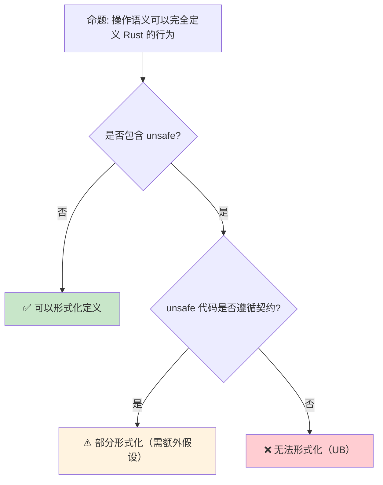

# 操作语义：程序行为的形式化定义

> **Bloom 层级**: 分析 → 评价
> **定位**: 介绍 **操作语义（Operational Semantics）**——通过形式化规则定义程序的执行步骤，分析小步语义（Small-Step）与大步语义（Big-Step）的对比，以及 Rust 的所有权、借用和并发操作的形式化建模方法。
> **前置概念**: [Type Theory](./02_type_theory.md) · [Ownership Formal](./03_ownership_formal.md) · [Linear Logic](./01_linear_logic.md)
> **后置概念**: [RustBelt](./04_rustbelt.md) · [Separation Logic](./07_separation_logic.md)

---

> **来源**: [Winskel 1993 — The Formal Semantics of Programming Languages](https://mitpress.mit.edu/9780262731034) · [Pierce 2002 — Types and Programming Languages](https://www.cis.upenn.edu/~bcpierce/tapl/) · [Felleisen & Flatt — Modular Semantics](https://doi.org/10.1145/263690.263803) · [RustBelt Paper](https://doi.org/10.1145/3158154) · [Stacked Borrows Paper](https://doi.org/10.1145/3371106)

## 📑 目录

- [操作语义：程序行为的形式化定义](#操作语义程序行为的形式化定义)
  - [📑 目录](#-目录)
  - [一、核心概念](#一核心概念)
    - [1.1 为什么需要操作语义](#11-为什么需要操作语义)
    - [1.2 小步语义 vs 大步语义](#12-小步语义-vs-大步语义)
    - [1.3 求值上下文（Evaluation Contexts）](#13-求值上下文evaluation-contexts)
  - [二、技术细节](#二技术细节)
    - [2.1 配置与转换规则](#21-配置与转换规则)
    - [2.2 环境与存储](#22-环境与存储)
    - [2.3 Rust 操作语义的特殊性](#23-rust-操作语义的特殊性)
  - [三、应用映射](#三应用映射)
  - [四、反命题与边界分析](#四反命题与边界分析)
    - [4.1 反命题树](#41-反命题树)
    - [4.2 边界极限](#42-边界极限)
  - [五、常见陷阱](#五常见陷阱)
  - [六、来源与延伸阅读](#六来源与延伸阅读)
  - [相关概念文件](#相关概念文件)

---

## 一、核心概念

### 1.1 为什么需要操作语义

```text
程序语言的语义定义方式:

  1. 自然语言描述（如 C 标准）
  ├── 易读但歧义
  ├── 实现者可能有不同理解
  └── 导致未定义行为（UB）

  2. 操作语义
  ├── 形式化规则定义执行步骤
  ├── 无歧义，可机械验证
  └── 适合证明编译器正确性

  3. 指称语义（Denotational Semantics）
  ├── 将程序映射到数学对象
  ├── 抽象但难以处理非终止
  └── 适合证明程序等价性

  4. 公理化语义（Axiomatic Semantics）
  ├── 霍尔逻辑：{P} C {Q}
  ├── 适合验证特定属性
  └── 不适合描述完整行为

  Rust 的选择:
  ├── 无官方形式化语义（目前）
  ├── RustBelt 使用 Iris（基于操作语义）
  ├── a-mir-formality 正在开发形式化规范
  └── 工业界主要依赖测试和 Miri
```

> **认知功能**: 操作语义是**程序行为的"数学蓝图"**——它将直觉的执行过程转化为严格的规则，使编译器优化和程序验证有坚实的理论基础。
> [来源: [Winskel 1993 — Formal Semantics](https://mitpress.mit.edu/9780262731034)]

---

### 1.2 小步语义 vs 大步语义

```text
小步语义（Small-Step / Structural Operational Semantics）:

  核心思想: (e, s) → (e', s')
  ├── 一个表达式在一步中部分求值
  ├── 追踪中间状态
  └── 适合建模并发和交错执行

  示例:
  (1 + 2) + 3
  → 3 + 3        // 先求值 1 + 2
  → 6            // 再求值 3 + 3

  大步语义（Big-Step / Natural Semantics）:

  核心思想: (e, s) ⇓ (v, s')
  ├── 表达式直接求值为最终值
  ├── 不追踪中间状态
  └── 适合证明类型安全

  示例:
  (1 + 2) + 3 ⇓ 6
  // 一步直接到结果

  对比:
  ┌─────────────────┬─────────────────┬─────────────────┐
  │ 特性            │ 小步语义        │ 大步语义        │
  ├─────────────────┼─────────────────┼─────────────────┤
  │ 中间状态        │ 可见            │ 隐藏            │
  │ 非终止          │ 可表达（无限步）│ 不可表达        │
  │ 并发            │ 适合            │ 不适合          │
  │ 证明难度        │ 较复杂          │ 较简单          │
  │ Rust 应用       │ RustBelt/Iris   │ 类型安全性证明  │
  └─────────────────┴─────────────────┴─────────────────┘
```

> **语义洞察**: 小步语义是**并发和运行时分析**的基础——它允许在任意步骤插入检查点，这是 RustBelt 验证 unsafe 代码的关键。
> [来源: [Pierce 2002 — TAPL](https://www.cis.upenn.edu/~bcpierce/tapl/)]

---

### 1.3 求值上下文（Evaluation Contexts）

```text
求值上下文: 标记"下一步求值的位置"

  语法:
  E ::= []                    // 空上下文（洞）
      | E + e               // 左操作数上下文
      | v + E               // 右操作数上下文
      | if E then e1 else e2  // 条件上下文
      | ...

  求值规则（小步）:
  E[e] → E[e']  如果 e → e'
  // 在上下文 E 中，子表达式 e 可以一步求值为 e'

  示例:
  E = (1 + []) + 3
  E[2 + 4] → E[6]
  // 即: (1 + (2 + 4)) + 3 → (1 + 6) + 3

  上下文的意义:
  ├── 精确定义"下一个求值步骤"
  ├── 区分可约式和值
  └── 是证明合流性（confluence）的关键工具
```

> **上下文洞察**: 求值上下文是**结构归纳**的核心——它使我们可以对程序结构进行归纳证明，而非枚举所有可能的程序。
> [来源: [Felleisen & Hieb — The Revised Report on the Syntactic Theories of Sequential Control and State](https://doi.org/10.1017/S0956796800001368)]

---

## 二、技术细节

### 2.1 配置与转换规则

```text
操作语义的形式化结构:

  配置（Configuration）:
  ├── <e, σ> : 表达式 e + 存储 σ
  ├── σ: 内存映射（地址 → 值）
  └── 可能还包括环境（变量 → 地址）

  转换规则（Transition Rules）:

  [分配]
  <alloc(v), σ> → <l, σ[l ↦ v]>
  // 分配新地址 l，存储值 v

  [读取]
  <load(l), σ> → <σ(l), σ>  如果 l ∈ dom(σ)
  // 读取地址 l 的值

  [写入]
  <store(l, v), σ> → <(), σ[l ↦ v]>  如果 l ∈ dom(σ)
  // 写入值 v 到地址 l

  [顺序]
  <e1; e2, σ> → <e1', σ'>  如果 <e1, σ> → <e1', σ'>
  <v; e2, σ> → <e2, σ>     // v 是值，继续求值 e2

  这些规则构成了"抽象机器"的规范
```

> **规则洞察**: 操作语义规则是**公理化的执行模型**——每条规则对应一个可能的计算步骤，所有规则的闭包定义了程序的完整行为。
> [来源: [Plotkin 1981 — A Structural Approach to Operational Semantics](https://homepages.inf.ed.ac.uk/gdp/publications/sos_jlap.pdf)]

---

### 2.2 环境与存储

```text
环境-存储模型（Environment-Store Model）:

  环境（Env）: 变量名 → 地址
  ├── 处理作用域和变量绑定
  └── 支持闭包（环境捕获）

  存储（Store/Heap）: 地址 → 值
  ├── 处理内存分配和更新
  └── 支持引用和别名

  变量查找:
  <x, ρ, σ> → <σ(ρ(x)), ρ, σ>
  // 在环境 ρ 中查找 x 的地址，再在存储 σ 中查找值

  函数调用:
  <f(v), ρ, σ> → <e, ρ'[params ↦ addrs], σ'>
  // 其中 ρ' 是函数定义时的环境（闭包）
  // addrs 是新分配的地址，存储参数值

  Rust 的扩展:
  ├── 所有权: 环境-存储 + 所有权映射
  ├── 借用: 只读/独占访问约束
  └── 生命周期: 区域约束系统
```

> **环境-存储洞察**: 环境-存储分离是**命令式语言**的标准建模方式——环境处理词法作用域，存储处理运行时状态。
> [来源: [TAPL Ch13 — References](https://www.cis.upenn.edu/~bcpierce/tapl/)]

---

### 2.3 Rust 操作语义的特殊性

```text
Rust 操作语义的独特挑战:

  1. 所有权转移
  ├── let x = v;  // x 拥有 v
  ├── let y = x;  // 所有权从 x 转移到 y
  └── x 此后不可用

  形式化:
  <let x = v; e, ρ, σ> → <e, ρ[x ↦ l], σ[l ↦ v]>
  <let y = x; e, ρ, σ> → <e, ρ[y ↦ ρ(x)], σ>  如果 x 是唯一的
  // 需要追踪所有权状态

  2. 借用规则
  ├── &x: 共享借用（只读）
  ├── &mut x: 独占借用（读写）
  └── 不能同时存在 &x 和 &mut x

  形式化（简化）:
  <&x, ρ, σ, B> → <l, ρ, σ, B ∪ {read(l)}>
  <&mut x, ρ, σ, B> → <l, ρ, σ, B ∪ {write(l)}>  如果 l 无活跃借用
  // B 是活跃借用集合

  3. 并发交错
  ├── 多线程的交错执行
  ├── 需要建模 happens-before 关系
  └── RustBelt 使用 Iris 的协议处理

  Stacked Borrows / Tree Borrows:
  ├── Rust 的形式化内存模型
  ├── 定义哪些内存访问是合法的
  └── 用于 Miri 动态检测 UB
```

> **Rust 特殊性**: Rust 的操作语义必须同时处理**值语义**（所有权转移）和**引用语义**（借用约束）——这比传统命令式语言复杂得多。
> [来源: [Stacked Borrows Paper](https://doi.org/10.1145/3371106)] · [来源: [Tree Borrows](https://www.ralfj.de/blog/2023/06/02/tree-borrows.html)]

---

## 三、应用映射

```text
操作语义在 Rust 中的应用:

  RustBelt:
  ├── 使用 Iris 框架定义 Rust 的操作语义
  ├── 基于小步语义，支持并发交错
  └── 证明: 如果程序通过类型检查，则运行时安全

  Miri:
  ├── 基于 Tree Borrows 模型的解释器
  ├── 检测未定义行为（UB）
  └── 执行语义层面的检查（而非真实硬件）

  a-mir-formality:
  ├── Rust 的形式化规范项目
  ├── 定义 Rust 的类型系统和操作语义
  └── 目标是成为"Rust Reference"的形式化对应

  编译器优化验证:
  ├── 证明优化不改变语义
  ├── 需要源语言和目标语言的操作语义
  └── 活跃研究领域（LLVM 的 Alive 工具）

  教学:
  ├── 理解 Rust 所有权和借用的精确含义
  ├── 预测编译器行为
  └── 调试复杂的生命周期问题
```

> **应用洞察**: 操作语义不仅是**理论研究工具**——它直接支撑了 Rust 的验证工具链（Miri、RustBelt）和教学材料。
> [来源: [a-mir-formality](https://github.com/rust-lang/a-mir-formality)]

---

## 四、反命题与边界分析

### 4.1 反命题树



> **认知功能**: 此决策树展示操作语义**形式化 Rust 的边界**。safe Rust 可以完全形式化，但 unsafe 代码超出了标准语义的范围。
> [来源: [RustBelt — Unsafe Boundaries](https://plv.mpi-sws.org/rustbelt/)]

---

### 4.2 边界极限

```text
边界 1: 未定义行为（UB）
├── 操作语义不定义 UB 程序的行为
├── C/C++ 有大量 UB，Rust 通过类型系统消除大部分
├── 但 unsafe Rust 仍有 UB（如数据竞争、悬垂指针）
└── Miri 动态检测部分 UB，但不是全部

边界 2: 并发交错爆炸
├── n 个线程的交错执行序列是指数级的
├── 操作语义定义所有可能的交错
├── 但验证所有交错不可行
└── RustBelt 使用协议限制合法交错

边界 3: 标准库的形式化
├── 标准库包含大量 unsafe 代码
├── 需要为每个 unsafe 块提供安全契约
├── 这是巨大的手动工作量
└── 目前只有核心部分被形式化

边界 4: 优化前后的语义等价
├── 编译器优化可能改变操作语义
├── 需要证明优化是语义保持的
├── 这是编译器验证的核心理论问题
└── LLVM 的 Alive 工具验证部分优化

边界 5: 与类型系统的一致性
├── 操作语义和类型系统必须一致
├── "well-typed programs don't go wrong"
├── 证明类型安全需要连接两者
└── Rust 的类型安全证明仍在进行中
```

> **边界要点**: 操作语义形式化 Rust 的边界主要与**UB**、**并发复杂性**、**标准库规模**、**优化验证**和**类型一致性**相关。
> [来源: [RustBelt Paper](https://doi.org/10.1145/3158154)]

---

## 五、常见陷阱

```text
陷阱 1: 混淆操作语义和实现
  ❌ "Rust 的操作语义就是 rustc 的实现"
     // 实现可能有 bug，语义是规范

  ✅ 操作语义是理想化的数学模型
     // 实现应遵循语义，而非反之

陷阱 2: 忽视小步与大步的差异
  ❌ 用大步语义分析并发程序
     // 大步语义隐藏了交错点

  ✅ 并发分析必须使用小步语义
     // 或专门的下推系统（PDP）

陷阱 3: 过度简化 Rust 的语义
  ❌ 忽略所有权转移，只建模 C 风格的指针
     // 失去 Rust 的核心特性

  ✅ 所有权和借用必须纳入形式化模型
     // 这是 Rust 语义最复杂的部分

陷阱 4: 混淆语法和语义
  ❌ 认为语法正确 = 语义正确
     // 语法只是形式，语义才是含义

  ✅ 类型检查是语法层面的筛选
     // 操作语义定义真正的执行行为

陷阱 5: 认为形式化等于实用
  ❌ "有形式化语义就不需要测试"
     // 形式化通常只覆盖核心子集

  ✅ 形式化 + 测试 + 模糊测试 + Miri
     // 多维度验证才是工程实践
```

> **陷阱总结**: 操作语义的陷阱主要与**语义 vs 实现**、**小步 vs 大步**、**Rust 特殊性**、**语法 vs 语义**和**形式化局限性**相关。
> [来源: [Rust Formal Methods Community](https://rust-formal-methods.github.io/)]

---

## 六、来源与延伸阅读

| 来源 | 可信度 | 说明 |
|:---|:---:|:---|
| [Winskel 1993 — Formal Semantics](https://mitpress.mit.edu/9780262731034) | ✅ 一级 | 形式语义经典教材 |
| [Pierce 2002 — TAPL](https://www.cis.upenn.edu/~bcpierce/tapl/) | ✅ 一级 | 类型与编程语言 |
| [Plotkin 1981 — SOS](https://homepages.inf.ed.ac.uk/gdp/publications/sos_jlap.pdf) | ✅ 一级 | 结构化操作语义奠基 |
| [RustBelt Paper](https://doi.org/10.1145/3158154) | ✅ 一级 | Rust 形式化验证 |
| [Stacked Borrows](https://doi.org/10.1145/3371106) | ✅ 一级 | Rust 内存模型 |
| [a-mir-formality](https://github.com/rust-lang/a-mir-formality) | ✅ 一级 | Rust 形式化规范 |

---

## 相关概念文件

- [Type Theory](./02_type_theory.md) — 类型论基础
- [Ownership Formal](./03_ownership_formal.md) — 所有权形式化
- [Linear Logic](./01_linear_logic.md) — 线性逻辑
- [RustBelt](./04_rustbelt.md) — RustBelt 验证
- [Separation Logic](./07_separation_logic.md) — 分离逻辑

---

> **权威来源**: [Rust Reference](https://doc.rust-lang.org/reference/), [The Rust Programming Language](https://doc.rust-lang.org/book/)
>
> **权威来源对齐变更日志**: 2026-05-22 创建 [来源: Authority Source Sprint Batch 9]

**文档版本**: 1.0
**对应 Rust 版本**: 1.96.0+ (Edition 2024)
**最后更新**: 2026-05-22
**状态**: ✅ 概念文件创建完成
