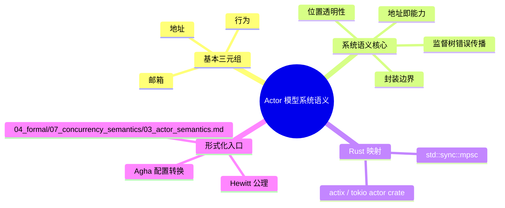

> **内容分级**: [专家级]

# Actor 模型系统语义

> **EN**: Actor Model System Semantics
> **Summary**: System-semantics entry point for the Actor model — addressing actors as universal primitives of concurrent and distributed computation, with pointers to the formal operational semantics in Rust's concept hierarchy.
> **Rust 版本**: 1.97.0+ (Edition 2024)
> **受众**: [研究者]
> **Bloom 层级**: L4
> **权威来源**: 本文件为 `concept/` 权威页：Actor 模型系统语义入口。
> **定位**: 从**系统语义**（组件封装、地址即能力、位置透明性、监督树）角度为 Actor 模型提供导航入口。完整形式化语义、Hewitt 公理、Agha 配置转换、Rust 框架映射见 [`04_formal/07_concurrency_semantics/03_actor_semantics.md`](../07_concurrency_semantics/03_actor_semantics.md)。
> **前置概念**: [Process Calculi for Rust](../07_concurrency_semantics/01_process_calculi_for_rust.md) · [Concurrency Patterns](../../03_advanced/00_concurrency/03_concurrency_patterns.md)
> **后置概念**: [Distributed Systems Semantics](04_distributed_systems_semantics.md) · [Component-Based Semantics](03_component_based_semantics.md)

---

> **来源 / Provenance**: [Hewitt, *Actor Model of Computation*, arXiv:1008.1459](https://arxiv.org/abs/1008.1459) · [Agha, *Actors*, MIT Press 1986](https://mitpress.mit.edu/9780262010929/actors/) · [TRPL — Message Passing](https://doc.rust-lang.org/book/ch16-02-message-passing.html) · [Actor model papers on Semantic Scholar](https://www.semanticscholar.org/search?q=actor%20model%20concurrent%20computation&sort=relevance) · [actix — Actor framework for Rust, crates.io](https://crates.io/crates/actix)

## 系统语义要点

Actor 模型把**计算系统**的基本单位定义为 actor：

```text
actor = ⟨地址, 邮箱, 行为⟩
系统 = 多重集(actor) × 在途消息池
```

系统语义关心的不是单个 actor 的内部状态机，而是：

1. **封装边界**：状态修改只能由 actor 自己完成；
2. **地址即能力**：不知道地址就无法发送，决定系统拓扑演化；
3. **位置透明性**：本地/远程 actor 使用同一寻址抽象；
4. **监督作为错误传播语义**：子 actor 崩溃通过监督树向上传播。

## 权威来源链接

完整形式化、Rust 映射、反例与边界分析见：

> [`concept/04_formal/07_concurrency_semantics/03_actor_semantics.md`](../07_concurrency_semantics/03_actor_semantics.md)

---

## 反例：把 Actor 当作共享内存使用

下面这段代码不是 Actor 模型，而是用 `Arc<Mutex<T>>` 模拟的共享状态；它违反了 Actor 的**封装边界**与**地址即能力**两条核心语义：

```rust
use std::sync::{Arc, Mutex};
use std::thread;

// 错误示范：两个“actor”直接共享可变状态
fn main() {
    let state = Arc::new(Mutex::new(0));
    let s1 = Arc::clone(&state);
    let s2 = Arc::clone(&state);

    thread::spawn(move || { *s1.lock().unwrap() += 1; });
    thread::spawn(move || { *s2.lock().unwrap() += 1; });
}
```

**判定依据**：在 Actor 模型中，状态只能通过消息异步修改；任何直接共享可变状态的实现都退化为共享内存并发，丢失了 Actor 的故障隔离与位置透明性保证。

---

## 🧭 思维导图（Mindmap）


