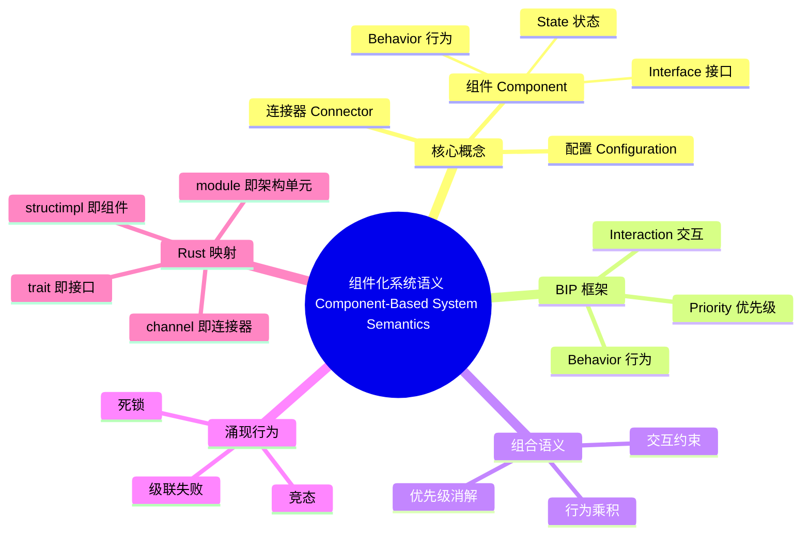

> **本节关键术语**: Component（组件） · Interface（接口） · Connector（连接器） · Configuration（配置） · BIP（Behavior, Interaction, Priority） · Port（端口） · Emergent Behavior（涌现行为） · Composition Semantics（组合语义） — [完整对照表](../../00_meta/01_terminology/01_terminology_glossary.md)
>
> **内容分级**: [专家级]

# 组件化系统语义（Component-Based System Semantics）

> **EN**: Component-Based System Semantics
> **Summary**: Formal semantics of component-based systems — interfaces, composition, connectors, and emergent behavior — with BIP as a reference framework and Rust traits/modules as the implementation substrate.
> **Rust 版本**: 1.97.0+ (Edition 2024)
> **受众**: [研究者]
> **Bloom 层级**: L4
> **权威来源**: 本文件为 `concept/` 权威页：组件化系统语义、BIP 组合框架及其 Rust 映射的唯一深度解释。
> **A/S/P 标记**: **S+A** — Structure + Application
> **双维定位**: C×Ana — 分析组件组合的形式语义与 Rust 工程投影
> **定位**: 从**组件、连接器、配置**三元组出发，形式化说明局部正确的组件如何通过组合产生全局层面不存在的安全/活性性质（涌现行为），并给出 BIP 框架与 Rust trait/module/channel 的对应关系。
> **前置概念**: [L3 并发编程](../../03_advanced/00_concurrency/01_concurrency.md) · [L4 进程代数与 Rust](../07_concurrency_semantics/01_process_calculi_for_rust.md) · [L4 Actor 形式语义](../07_concurrency_semantics/03_actor_semantics.md) · [L3 系统可组合性](../../06_ecosystem/03_design_patterns/04_system_composability.md)
> **后置概念**: [L6 响应式编程](../../06_ecosystem/04_web_and_networking/09_reactive_programming.md) · [L6 微服务模式](../../06_ecosystem/03_design_patterns/05_microservice_patterns.md)

---

> **来源**:
> [Sifakis, *A Framework for Component-based Construction*, CAV 2005 / BIP framework](https://www-verimag.imag.fr/~sifakis/1-A-Framework-for-Component-based-Construction.pdf) ·
> [BIP Framework Documentation](http://www-verimag.imag.fr/Rigorous-Design-of-Component-Based.html) ·
> Shaw, M. & Garlan, D. *Software Architecture: Perspectives on an Emerging Discipline*. Prentice Hall, 1996 ·
> [Rust Reference — Traits](https://doc.rust-lang.org/reference/items/traits.html) ·
> [Rust Reference — Modules](https://doc.rust-lang.org/reference/items/modules.html) ·
> [std::sync::mpsc](https://doc.rust-lang.org/std/sync/mpsc/) ·
> [Gössler & Sifakis, *Composition for component-based modeling*, Sci. Comput. Program. 2005 (doi.org)](https://doi.org/10.1016/j.scico.2004.05.014) ·
> [Gössler & Sifakis 2005 (ACM DL)](https://dl.acm.org/doi/abs/10.1016/j.scico.2004.05.014) ·
> [Sifakis, *A Framework for Component-based Construction* (Semantic Scholar)](https://www.semanticscholar.org/paper/A-Framework-for-Component-based-Construction-Sifakis) ·
> [tokio crate (crates.io)](https://crates.io/crates/tokio)
>
> ⚠️ **声明**: 本页呈现的是**组件化形式语义骨架与教学级 Rust 映射**，非经机器验证的 BIP→Rust 同构证明。BIP 的优先级/交互语义有完整的操作语义与模型检验工具集；Rust 的 trait/module 是**工程实现基质**，「对应」指结构化类比，而非双模拟等价。

---

## 📑 目录

- [组件化系统语义（Component-Based System Semantics）](#组件化系统语义component-based-system-semantics)
  - [📑 目录](#-目录)
  - [一、核心概念：组件 · 连接器 · 配置](#一核心概念组件--连接器--配置)
    - [1.1 组件三元组](#11-组件三元组)
    - [1.2 连接器与配置](#12-连接器与配置)
  - [二、BIP 框架：行为 · 交互 · 优先级](#二bip-框架行为--交互--优先级)
    - [2.1 原子组件与端口](#21-原子组件与端口)
    - [2.2 交互（Interaction）](#22-交互interaction)
    - [2.3 优先级（Priority）](#23-优先级priority)
  - [三、组合语义：行为的乘积与约束](#三组合语义行为的乘积与约束)
  - [四、涌现行为（Emergent Behavior）](#四涌现行为emergent-behavior)
  - [五、Rust 映射：trait · struct · channel · module](#五rust-映射trait--struct--channel--module)
    - [5.1 trait 即接口](#51-trait-即接口)
    - [5.2 struct/impl 即组件](#52-structimpl-即组件)
    - [5.3 channel / 方法调用 即连接器](#53-channel--方法调用-即连接器)
    - [5.4 module 即架构单元](#54-module-即架构单元)
  - [六、反例与边界](#六反例与边界)
    - [反例：两个无死锁组件的组合可以死锁](#反例两个无死锁组件的组合可以死锁)
    - [compile\_fail：跨层 trait 顺序错误](#compile_fail跨层-trait-顺序错误)
    - [边界：接口契约无法捕获所有涌现性质](#边界接口契约无法捕获所有涌现性质)
    - [边界：BIP 优先级消除非确定性的代价](#边界bip-优先级消除非确定性的代价)
  - [七、定理链与相关概念](#七定理链与相关概念)
  - [八、认知路径](#八认知路径)
  - [权威来源索引](#权威来源索引)
  - [嵌入式测验（Embedded Quiz）](#嵌入式测验embedded-quiz)
    - [测验 1：组件三元组包含哪三个要素？（记忆层）](#测验-1组件三元组包含哪三个要素记忆层)
    - [测验 2：BIP 框架中的三个字母分别代表什么？（理解层）](#测验-2bip-框架中的三个字母分别代表什么理解层)
    - [测验 3：为什么两个无死锁组件组合后可能死锁？（应用层）](#测验-3为什么两个无死锁组件组合后可能死锁应用层)
    - [测验 4：Rust 中 trait 对应组件化语义的哪个概念？（应用层）](#测验-4rust-中-trait-对应组件化语义的哪个概念应用层)
    - [测验 5：BIP 优先级规则会影响系统的哪些性质？（分析层）](#测验-5bip-优先级规则会影响系统的哪些性质分析层)
  - [🧭 思维导图（Mindmap）](#-思维导图mindmap)

---

## 一、核心概念：组件 · 连接器 · 配置

组件化系统的基本思想来自软件架构研究（Shaw & Garlan, 1996）：把系统看作**组件**的集合，组件之间通过**连接器**交互，整体由一个**配置**描述。形式化上，一个组件化系统可写成三元组：

```text
系统 ::= ⟨Components, Connectors, Configuration⟩
```

> **过渡**: 这个三元组是理解一切组件化语义（包括 BIP）的起点。先拆解每个元素，再进入 BIP 的具体形式化。

### 1.1 组件三元组

一个组件本身也是三元组：

```text
组件 C ::= ⟨Interface, Behavior, State⟩

  Interface : 组件向环境暴露的端口/操作集合（即它能参与哪些交互）
  Behavior  : 组件的状态迁移系统（LTS/自动机），决定在给定状态下允许哪些动作
  State     : 组件的局部状态空间
```

关键语义事实：

1. **封装性**：组件状态只能通过 Behavior 规定的接口动作改变，外部不能直接读写；
2. **接口即契约**：Interface 是组件与外部交互的唯一合法边界；
3. **行为局部性**：Behavior 只描述单个组件在什么状态下能做什么，不涉及其他组件。

### 1.2 连接器与配置

```text
连接器 K : 组件接口之间的交互机制
  ├─ 方法调用（synchronous, caller-callee）
  ├─ 消息通道（asynchronous, FIFO or unordered）
  ├─ 事件总线（publish-subscribe）
  └─ 共享内存 / 总线（需额外同步协议）

配置 cfg : ⟨C₁..Cₙ, K₁..Kₘ, s₀⟩
  └─ 初始全局状态 s₀ = (C₁.state₀, ..., Cₙ.state₀)
```

配置回答两个问题：系统由哪些组件构成？它们通过哪些连接器以什么初始状态启动？组合语义的任务，就是**从局部组件行为推导出配置层面的全局行为**。

---

## 二、BIP 框架：行为 · 交互 · 优先级

BIP（Behavior, Interaction, Priority）由 Sifakis 等提出，是组件化系统形式化的代表性框架。它把组合语义拆成三个独立且可组合的元素：

```text
BIP 系统 = 原子组件（带端口标记的 LTS）
        + 交互（端口之间的同步约束）
        + 优先级（非确定性消解规则）
```

> **过渡**: BIP 的核心洞察是：把「组件能做什么」「组件如何一起做事」「多个可能动作选哪一个」这三件事分离开，就能模块化地定义和分析组合语义。

### 2.1 原子组件与端口

BIP 中的原子组件是一个有端口标记的转换系统：

```text
原子组件 B ::= ⟨Q, q₀, P, →⟩

  Q  : 局部状态集合
  q₀ : 初始状态
  P  : 端口集合（port），每个转移都标注一个端口 p ∈ P
  →  : Q × P × Q  状态迁移关系
```

每个端口代表组件能参与的一类交互。端口把「内部状态迁移」与「外部同步需求」绑定在一起：当组件执行某个转移时，如果该转移标注的端口属于某个交互，它必须等待交互中其他组件的对应端口同时就绪。

### 2.2 交互（Interaction）

交互是端口之间的同步约束，用一组「必须同时发生」的端口集合表示：

```text
交互 γ ⊆ 2^P  （P 是系统所有组件端口的并集）

例如，对两个组件 B₁, B₂：
  γ = { {p₁, q₁}, {p₂}, {q₂} }
  表示：p₁ 与 q₁ 必须同步发生；p₂、q₂ 可独立发生
```

交互语义（Interaction Semantics）的核心规则：

```text
[interaction]
  若 γ ∈ Interactions，且对 γ 中每个端口 p，对应组件在本地状态都有标注 p 的可用转移，
  则这些组件可以同步执行这些本地转移，系统进入新的全局状态。
```

这与 CSP 的会合（rendezvous）思想同源，但 BIP 把「哪些事件必须同步」显式声明为交互集合，而不是像 CSP 那样由并行组合自动生成同步约束。

### 2.3 优先级（Priority）

当多个交互在同一全局状态下同时可用时，系统行为非确定。优先级是一组偏序规则，用于消解这种非确定性：

```text
优先级 π : γᵢ < γⱼ  （若 γᵢ 与 γⱼ 都可用，则必须选 γⱼ）
```

优先级不改变**哪些状态可达**，只改变**选择路径**；因此它影响的是活性/公平性/调度策略，而非安全性。在工程上，优先级对应：

- 实时系统中的高优先级任务；
- 网络协议中的控制消息优先于数据消息；
- `tokio::select!` 的 `biased` 模式（虽然实现机制不同，但功能相似）。

---

## 三、组合语义：行为的乘积与约束

BIP 的组合语义可以概括为「三步合成」：

```text
给定组件 B₁..Bₙ、交互集合 Γ、优先级集合 Π：

1. 行为乘积：B₁ × ... × Bₙ
   生成全局状态空间 Q = Q₁ × ... × Qₙ
   全局迁移由每个组件的本地迁移按端口标注组合

2. 交互约束：只保留那些端口集合属于 Γ 的全局迁移
   ⟹ 删去所有不符合同步约束的组合动作

3. 优先级消解：在可用交互上应用 Π，得到确定化（或部分确定化）的迁移系统
```

形式化地，组合系统的语义是一个受限的乘积自动机：

```text
B = γ(B₁, ..., Bₙ) = ⟨Q₁×...×Qₙ, (q₁⁰,...,qₙ⁰), Γ, →γ⟩

其中 (q₁,...,qₙ) ─γ─► (q₁',...,qₙ')  当且仅当：
  γ = {p₁,...,pₖ} ∈ Γ，且
  对 γ 中每个端口 pᵢ，存在对应组件的本地迁移 qᵢ ─pᵢ─► qᵢ'，
  不在 γ 中的组件状态保持不变。
```

这条规则说明：**组合不是行为的简单相加，而是行为空间上的约束交集**。局部行为正确 ≠ 全局行为正确；组合语义的任务就是精确刻画这个交集会产生什么新性质。

---

## 四、涌现行为（Emergent Behavior）

**涌现行为**指系统层面才出现的性质，无法从单个组件的行为中直接推出。组件化语义最重要的一个结论就是：

> 局部正确 ≠ 全局正确。两个分别满足安全/活性性质的组件，组合后可能产生新的安全/活性问题。

典型的涌现现象包括：

| 涌现性质 | 局部层面 | 全局层面 | 形式化含义 |
|:---|:---|:---|:---|
| 死锁 | 每个组件单独运行都不会停止 | 组合后所有交互都等待对方 | 全局状态无出边 |
| 竞态 | 每个组件内部串行 | 跨组件交互顺序不确定 | 多个可达全局轨迹导致不同结果 |
| 优先级反转 | 每个优先级规则单独看合理 | 组合后低优先级任务间接阻塞高优先级 | 偏序与组件约束冲突 |
| 级联失败 | 单个组件失败可恢复 | 失败通过连接器传播放大 | 全局不变量被破坏 |

BIP 框架的价值在于：它把组合语义形式化后，可以用模型检验工具（如 BIP 引擎）自动检测这些涌现性质，而不是依赖人工审查。

---

## 五、Rust 映射：trait · struct · channel · module

Rust 的类型系统与模块系统天然支持组件化思想。下面给出与 BIP 形式语义的逐项映射。

### 5.1 trait 即接口

Rust 的 trait 对应组件的 **Interface**：它声明了组件对外提供的操作集合，但不规定实现。

```rust
// 接口 = 端口集合 + 操作签名
trait Sensor {
    type Reading;
    fn read(&self) -> Self::Reading;
}

trait Actuator {
    type Command;
    fn write(&mut self, cmd: Self::Command);
}
```

与 BIP 端口的对应：trait 中的每个方法可以看作一个「服务端口」，调用该方法相当于在该端口上触发一次交互。

### 5.2 struct/impl 即组件

Rust 的 struct 与其 `impl` 对应组件的 **Behavior + State**：struct 持有局部状态，`impl` 定义状态迁移。

```rust
struct Thermostat {
    target: f64,
    current: f64,
}

impl Thermostat {
    // 本地状态迁移：更新目标温度
    fn set_target(&mut self, t: f64) {
        self.target = t;
    }

    // 本地状态迁移：根据当前读数决定是否触发控制命令
    fn decide(&self) -> Option<Command> {
        if (self.current - self.target).abs() > 1.0 {
            Some(Command::Adjust(self.target))
        } else {
            None
        }
    }
}
```

关键约束：Rust 的所有权与借用规则在编译期强制了组件的封装性——除非显式暴露 `&mut self` 或内部可变性，否则外部无法破坏组件局部不变量。

### 5.3 channel / 方法调用 即连接器

| BIP 连接器 | Rust 载体 | 语义特征 |
|:---|:---|:---|
| 同步会合（rendezvous） | 方法调用 `obj.method()` | 调用方阻塞直到被调用方完成；类似 BIP 强同步交互 |
| 异步消息通道 | `std::sync::mpsc` / `tokio::sync::mpsc` | 解耦发送与接收；缓冲区分有界/无界 |
| 发布-订阅 | `tokio::sync::broadcast` / `event-listener` | 一对多事件分发 |
| 共享状态连接器 | `Arc<Mutex<T>>` 或 `Arc<RwLock<T>>` | 需显式同步协议；违反严格组件封装时易引入数据竞争 |

一个方法调用作为同步连接器的例子：

```rust
// 同步连接器：调用方与被调用方在调用点握手
enum Command { Heat, Cool, Off }

trait Sensor {
    type Reading;
    fn read(&self) -> Self::Reading;
}

trait Controller {
    fn on_reading(&mut self, r: f64) -> Command;
}

fn run_loop(sensor: &dyn Sensor<Reading = f64>, controller: &mut dyn Controller) {
    let r = sensor.read();   // 同步交互：read 端口
    let cmd = controller.on_reading(r); // 同步交互：control 端口
    // act.write(cmd);
}
```

### 5.4 module 即架构单元

Rust 的 `mod` 对应组件化系统中的 **配置边界**：一个模块可以隐藏内部组件，只暴露公共接口，从而把整个模块当作一个更高层的「复合组件」。

```rust
pub mod climate_system {
    mod sensor { /* 内部组件 */ }
    mod controller { /* 内部组件 */ }
    mod actuator { /* 内部组件 */ }

    // 对外只暴露复合接口
    pub struct ClimateSystem;
    impl ClimateSystem {
        pub fn new() -> Self { Self }
        pub fn run(&mut self) { /* 内部组合逻辑 */ }
    }
}
```

模块边界与 BIP 的「复合组件」概念对应：多个原子组件通过内部连接器组合后，对外只暴露一组端口，形成更高抽象层的新组件。

---

## 六、反例与边界

本节给出组件化语义中三个关键边界：局部无死锁不保证全局无死锁、接口契约不能捕获所有涌现性质、优先级消解非确定性有其工程代价。

### 反例：两个无死锁组件的组合可以死锁

考虑「 dining philosophers 」问题的组件化视角：每只哲学家和每只叉子都是独立的组件，单独看都不会死锁；但当它们通过「拿起左叉」和「拿起右叉」两个连接器组合时，可能出现循环等待。

```rust,ignore
// ❌ 反例：两个（局部）无死锁的哲学家组件组合后形成全局死锁
// 本示例使用 std::thread 演示运行时死锁；标记为 ignore 以避免在测试运行中挂起。
use std::sync::{Arc, Mutex};

struct Fork {
    id: usize,
    held: Mutex<bool>,
}

struct Philosopher {
    name: &'static str,
    left: Arc<Mutex<usize>>,  // 左手叉子的标识/计数
    right: Arc<Mutex<usize>>,
}

impl Philosopher {
    // 单独看：先拿左叉、再拿右叉，逻辑自洽
    fn eat(&self) {
        let _left = self.left.lock().unwrap();
        let _right = self.right.lock().unwrap();
        println!("{} is eating", self.name);
    }
}

fn main() {
    let f0 = Arc::new(Mutex::new(0usize));
    let f1 = Arc::new(Mutex::new(1usize));

    let p0 = Philosopher { name: "P0", left: f0.clone(), right: f1.clone() };
    let p1 = Philosopher { name: "P1", left: f1.clone(), right: f0.clone() };

    // 若 P0 拿到 f0 同时 P1 拿到 f1，两者互相等待对方释放 ⟹ 死锁
    std::thread::scope(|s| {
        s.spawn(|| p0.eat());
        s.spawn(|| p1.eat());
    });
}
```

**语义分析**：

- 单个 `Philosopher::eat` 没有死锁；
- 单个 `Mutex` 也没有死锁；
- 死锁是**涌现性质**：它只出现在哲学家与叉子的全局配置中，由连接器（左右手叉子共享）的循环依赖引起。

修正策略：破坏循环等待条件——例如所有哲学家按统一顺序拿叉，或引入仲裁组件（waiter）把多组件交互约束显式化。

### compile_fail：跨层 trait 顺序错误

组件分层架构要求依赖关系**自顶向下**：高层组件可以依赖低层组件的接口，但低层组件不应反向依赖高层组件。Rust 的 trait bound 能在编译期捕获这种**逆向依赖**。

```rust,compile_fail,E0277
// ❌ 跨层 trait 顺序错误：低层 Sensor 组件不应依赖高层 Controller 组件。
// 逆向依赖意味着 Sensor 无法被单独实现，破坏了组件的可组合性。

trait Controller {
    fn decide(&self) -> i32;
}

// 错误：Sensor 位于低层，却要求实现者同时实现高层的 Controller。
trait Sensor: Controller {
    fn read(&self) -> f64;
}

struct Thermistor;

impl Sensor for Thermistor {
    fn read(&self) -> f64 { 25.0 }
}
```

编译器输出 `E0277`，指出 `Thermistor` 未实现 `Controller`。这个错误对应组件语义中的**跨层依赖违规**：若允许低层依赖高层，则任何复用低层组件的场景都必须把上层控制逻辑一起拖入，导致配置无法独立组合。

**修正**：将依赖方向反转，让 `Controller` 依赖 `Sensor`，或引入中间接口消除循环。

### 边界：接口契约无法捕获所有涌现性质

```rust,ignore
// ❌ 边界：trait 只声明接口，不声明调用顺序约束
trait BankAccount {
    fn deposit(&mut self, amount: u64);
    fn withdraw(&mut self, amount: u64) -> bool;
}

// 两个组件各自实现 deposit/withdraw 都正确，
// 但组合后若多个线程并发调用，仍可能破坏全局不变量（余额 ≥ 0）。
```

trait 契约保证「调用方法时类型正确、参数正确」，但不保证「调用顺序正确」或「并发调用不破坏全局不变量」。后者需要额外的同步协议或形式化验证（如线性类型、TLA+、BIP 模型检验）。

### 边界：BIP 优先级消除非确定性的代价

优先级 `<` 消解非确定性时可能引入**隐式假设**：

1. 若优先级规则与组件本地约束冲突，可能导致某些本可达状态不可达；
2. 优先级可能隐藏低优先级交互的**饥饿（starvation）**风险；
3. 在 Rust 中，类似的「优先级」通常由调度器或 `biased` 分支实现，但 Rust 调度器不保证长期公平性。

因此，优先级不是「免费」的确定性——它是**设计决策的形式化编码**，需要与活性要求一起验证。

---

## 七、定理链与相关概念

| 编号 | 命题 | 前提 | 结论 |
|:---|:---|:---|:---|
| T-CBS-01 | 组件封装性 | Rust 所有权 + trait 接口 | 组件局部状态只能通过自身方法改变 ⟹ 编译期强制封装 |
| T-CBS-02 | 组合即约束 | BIP 交互集合 Γ | 全局行为 = 行为乘积 ⋂ 交互约束 |
| T-CBS-03 | 局部正确 ≠ 全局正确 | dining philosophers 配置 | 局部无死锁组件可组合成全局死锁系统 |
| T-CBS-04 | 优先级影响活性 | 优先级偏序 Π | 优先级消解非确定性 ⟹ 可能引入低优先级交互饥饿 |
| T-CBS-05 | trait 是接口而非协议 | Rust 类型系统 | 类型正确组合 ⟹ 不保证时序/并发语义正确 |

**相关概念**:

- [Actor 模型系统语义](01_actor_model_semantics.md) —— 命名进程 + 邮箱的对偶组件模型
- [进程代数与 Rust](../07_concurrency_semantics/01_process_calculi_for_rust.md) —— CSP/CCS/π 演算提供的形式骨架
- [Actor 形式语义](../07_concurrency_semantics/03_actor_semantics.md) —— Actor 作为「地址/邮箱/行为」组件的完整操作语义
- [架构模式语义](../10_architecture_semantics/02_architecture_pattern_semantics.md) —— 软件架构层面的模式形式化
- [系统可组合性](../../06_ecosystem/03_design_patterns/04_system_composability.md) —— Rust 生态中可组合性的工程实践与反模式
- [L6 响应式编程](../../06_ecosystem/04_web_and_networking/09_reactive_programming.md) —— 流式组件与背压的工程语义
- [L6 微服务模式](../../06_ecosystem/03_design_patterns/05_microservice_patterns.md) —— 服务化组件的架构模式

---

## 八、认知路径

> **认知路径**: 组件三元组（接口/行为/状态） ⟹ 连接器与配置 ⟹ BIP 行为·交互·优先级 ⟹ 组合语义 = 行为乘积 + 交互约束 + 优先级消解 ⟹ 涌现行为 ⟹ Rust trait/struct/channel/module 映射 ⟹ 反例与边界。

学习顺序建议：先读 [L4 进程代数页](../07_concurrency_semantics/01_process_calculi_for_rust.md) 建立「同步/异步交互」的形式直觉，再读本页理解组件组合；随后把 §五的 Rust 映射与 [系统可组合性页](../../06_ecosystem/03_design_patterns/04_system_composability.md) 的工程示例对照阅读；最后用 dining philosophers 反例验证「局部正确 ≠ 全局正确」的语义结论。

**核心推理链**: 组件封装 ⟹ 接口约束 ⟹ 组合产生新约束 ⟹ 涌现行为不可化约为局部行为 ⟹ 需要形式化组合语义与模型检验——这条链解释了为什么大型 Rust 系统即使每个模块都能编译通过，仍可能出现死锁、竞态和级联失败。

---

## 权威来源索引

- Sifakis, J. *A Framework for Component-based Construction*. CAV 2005. [PDF（VERIMAG）](https://www-verimag.imag.fr/~sifakis/1-A-Framework-for-Component-based-Construction.pdf)
- [BIP Framework — VERIMAG](http://www-verimag.imag.fr/Rigorous-Design-of-Component-Based.html)
- Shaw, M. & Garlan, D. *Software Architecture: Perspectives on an Emerging Discipline*. Prentice Hall, 1996.
- [Rust Reference — Traits](https://doc.rust-lang.org/reference/items/traits.html)
- [Rust Reference — Modules](https://doc.rust-lang.org/reference/items/modules.html)
- [std::sync::mpsc — Rust 标准库文档](https://doc.rust-lang.org/std/sync/mpsc/)
- [tokio::sync::mpsc](https://docs.rs/tokio/latest/tokio/sync/mpsc/)

> **相关文件**: [同层：Actor 模型系统语义](01_actor_model_semantics.md) · [同层：π 演算系统语义](02_pi_calculus_for_rust.md) · [L4 进程代数](../07_concurrency_semantics/01_process_calculi_for_rust.md) · [L6 系统可组合性](../../06_ecosystem/03_design_patterns/04_system_composability.md)
>
> **文档版本**: 1.0 ｜ **最后更新**: 2026-07-28 ｜ **状态**: ✅ 新建（Rust 1.97 对齐）

---

## 嵌入式测验（Embedded Quiz）

### 测验 1：组件三元组包含哪三个要素？（记忆层）

**题目**: 在组件化系统语义中，一个组件（Component）由哪三个基本要素构成？

<details>
<summary>✅ 答案与解析</summary>

接口（Interface）、行为（Behavior）、状态（State）。接口定义组件对外暴露的端口/操作；行为是组件的状态迁移系统；状态是组件的局部数据。三者共同封装了一个可独立分析、可组合的计算单元。
</details>

---

### 测验 2：BIP 框架中的三个字母分别代表什么？（理解层）

**题目**: BIP 框架把组合语义拆成哪三个独立元素？

<details>
<summary>✅ 答案与解析</summary>

B = Behavior（行为），I = Interaction（交互），P = Priority（优先级）。行为描述单个组件能做什么；交互描述多个组件必须同步发生的端口组合；优先级用于消解多个可用交互之间的非确定性。
</details>

---

### 测验 3：为什么两个无死锁组件组合后可能死锁？（应用层）

**题目**: 用 dining philosophers 例子说明：为什么每个组件单独无死锁，组合后却可能死锁？

<details>
<summary>✅ 答案与解析</summary>

死锁是**涌现性质**，只出现在全局配置层面。单只哲学家组件和单把叉子组件都不会死锁；但当多个哲学家通过共享叉子以循环顺序请求资源时，会形成循环等待——这是组件间连接器的全局交互模式导致的，无法从局部组件语义中直接推出。
</details>

---

### 测验 4：Rust 中 trait 对应组件化语义的哪个概念？（应用层）

**题目**: 在 Rust 的组件化映射中，trait、struct/impl、channel/module 分别对应 BIP 形式语义中的哪些元素？

<details>
<summary>✅ 答案与解析</summary>

- `trait` 对应组件的 **Interface**（接口/端口集合）；
- `struct` + `impl` 对应组件的 **Behavior + State**（行为与局部状态）；
- `channel` 或方法调用对应 **Connector**（交互机制）；
- `module` 对应更高层的 **Configuration/复合组件边界**，把内部组合封装为单一单元。

</details>

---

### 测验 5：BIP 优先级规则会影响系统的哪些性质？（分析层）

**题目**: BIP 的优先级规则会改变系统的安全性（safety）还是活性（liveness）？为什么？

<details>
<summary>✅ 答案与解析</summary>

优先级主要影响**活性/公平性**，而非安全性。它不改变哪些状态可达（安全性关心的「坏事不发生」通常由可达集决定），但决定走哪条路径——因此可能影响某个交互是否会被永久延后（饥饿）。在设计高可靠系统时，优先级规则需要与活性要求一起验证。
</details>

---

## 🧭 思维导图（Mindmap）



> **认知功能**: 本 mindmap 从本页章节结构提炼，一级分支对应核心主题，叶子节点为关键子概念，可作为本页的快速导航与复习索引。
