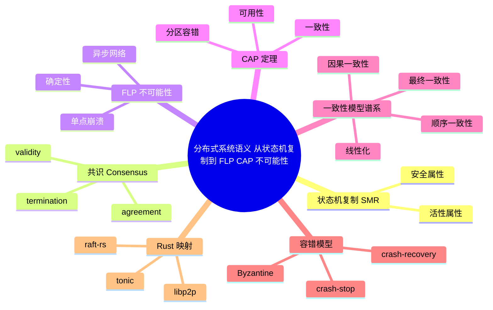

> **本节关键术语**: 分布式系统 · 状态机复制 · 共识 · FLP 不可能性 · CAP 定理 · 一致性模型 · 容错模型 · 拜占庭故障 — [完整对照表](../../00_meta/01_terminology/01_terminology_glossary.md)

# 分布式系统语义：从状态机复制到 FLP/CAP 不可能性

> **EN**: Distributed Systems Semantics
> **Summary**: Formal semantics of distributed systems in Rust — consensus, consistency models, fault tolerance, and the FLP/CAP impossibility landscape.
> **Rust 版本**: 1.97.0+ (Edition 2024)
> **受众**: [研究者]
> **内容分级**: [专家级]
> **Bloom 层级**: L4-L5
> **权威来源**: 本文件为 `concept/` 权威页：分布式系统形式语义及其 Rust 映射的唯一深度解释。
> **A/S/P 标记**: **S+A** — Structure + Application
> **双维定位**: C×Ana — 分析分布式计算的形式根基与工程投影
> **定位**: 从状态机复制、共识不可能性与一致性谱系三个维度，形式化理解 Rust 分布式系统（raft-rs / tonic / libp2p）的语义边界。
> **前置概念**: [L3 并发编程](../../03_advanced/00_concurrency/01_concurrency.md) · [L4 进程代数与 Rust](../07_concurrency_semantics/01_process_calculi_for_rust.md) · [L4 Actor 形式语义](../07_concurrency_semantics/03_actor_semantics.md) · [L4 线性化与一致性谱系](../07_concurrency_semantics/02_linearizability_and_consistency.md)
> **后置概念**: [L4 分布式共识理论](../07_concurrency_semantics/06_distributed_consensus_theory.md) · [L6 生态中的分布式共识](../../06_ecosystem/06_data_and_distributed/06_distributed_consensus.md) · [L4 组件化系统语义](03_component_based_semantics.md)

---

> **来源**:
> [Rust Standard Library — Synchronization](https://doc.rust-lang.org/std/sync/index.html) ·
> [Fischer, Lynch & Paterson, *Impossibility of Distributed Consensus with One Faulty Process*, JACM 32(2), 1985](https://dl.acm.org/doi/10.1145/3149.214121) ·
> [Brewer, *Towards Robust Distributed Systems*, PODC 2000 (CAP 猜想)](https://doi.org/10.1145/343477.343502) ·
> [Gilbert & Lynch, *Brewer's Conjecture and the Feasibility of Consistent, Available, Partition-Tolerant Web Services*, ACM SIGACT News 33(2), 2002](https://doi.org/10.1145/564585.564601) ·
> [Lamport, *Time, Clocks, and the Ordering of Events in a Distributed System*, Communications of the ACM 21(7), 1978](https://doi.org/10.1145/359545.359563) ·
> [Castro & Liskov, *Practical Byzantine Fault Tolerance*, OSDI 1999 (PBFT)](https://dl.acm.org/doi/10.5555/296806.296824) ·
> [Dwork, Lynch & Stockmeyer, *Consensus in the Presence of Partial Synchrony*, JACM 35(2), 1988](https://dl.acm.org/doi/10.1145/42282.42283) ·
> [raft-rs 文档](https://docs.rs/raft/latest/raft/) ·
> [tonic 文档](https://docs.rs/tonic/latest/tonic/) ·
> [libp2p 文档](https://docs.rs/libp2p/latest/libp2p/)

---

## 📑 目录

- [分布式系统语义：从状态机复制到 FLP/CAP 不可能性](#分布式系统语义从状态机复制到-flpcap-不可能性)
  - [📑 目录](#-目录)
  - [一、核心概念](#一核心概念)
    - [1.1 分布式系统作为状态机复制问题](#11-分布式系统作为状态机复制问题)
    - [1.2 共识：agreement、validity、termination](#12-共识agreementvaliditytermination)
    - [1.3 FLP 不可能性](#13-flp-不可能性)
    - [1.4 CAP 定理的形式含义](#14-cap-定理的形式含义)
    - [1.5 一致性模型谱系](#15-一致性模型谱系)
    - [1.6 容错模型](#16-容错模型)
    - [1.7 部分同步模型与 PBFT](#17-部分同步模型与-pbft)
  - [二、Rust 映射：raft-rs、tonic、libp2p](#二rust-映射raft-rstoniclibp2p)
  - [三、反例与边界](#三反例与边界)
    - [反例：异步网络中单个故障进程即可阻止确定性共识](#反例异步网络中单个故障进程即可阻止确定性共识)
    - [compile\_fail：消息类型未实现 Send/Sync](#compile_fail消息类型未实现-sendsync)
    - [边界：CAP 不是「三选二」的菜单](#边界cap-不是三选二的菜单)
    - [边界：一致性模型不能解决所有并发错误](#边界一致性模型不能解决所有并发错误)
  - [四、定理链与相关概念](#四定理链与相关概念)
  - [五、认知路径](#五认知路径)
  - [权威来源索引](#权威来源索引)
  - [🧭 思维导图（Mindmap）](#-思维导图mindmap)
  - [嵌入式测验（Embedded Quiz）](#嵌入式测验embedded-quiz)
    - [Q1：FLP 不可能性的三个前提是什么？](#q1flp-不可能性的三个前提是什么)
    - [Q2：CAP 定理的精确结论是什么？](#q2cap-定理的精确结论是什么)
    - [Q3：线性化与最终一致性的主要区别是什么？](#q3线性化与最终一致性的主要区别是什么)
    - [Q4：拜占庭故障模型与崩溃-停止模型的关系是什么？](#q4拜占庭故障模型与崩溃-停止模型的关系是什么)
    - [Q5：下面这段 Rust 风格的异步两阶段提交代码存在什么语义问题？](#q5下面这段-rust-风格的异步两阶段提交代码存在什么语义问题)

---

## 一、核心概念

### 1.1 分布式系统作为状态机复制问题

一个分布式系统可形式化为若干**进程**通过**消息**交互的集合，叠加一个描述进程与网络行为的**故障模型**：

```text
分布式系统 D ::= ⟨Π, M, Σ_init, F, N⟩

  Π        : 进程集合 {p₁, p₂, ..., pₙ}
  M        : 消息集合，每条消息 m = ⟨sender, receiver, payload⟩
  Σ_init   : 全局初始状态（各进程本地状态的笛卡尔积）
  F        : 故障模型（crash-stop / crash-recovery / Byzantine）
  N        : 网络模型（同步 / 异步 / 部分同步）
```

其核心问题通常是**状态机复制（State Machine Replication, SMR）**：让所有无故障进程以相同顺序执行相同的命令序列，从而保持一致的本地状态。SMR 的语义目标是：

```text
安全属性（Safety）:  所有无故障进程对已提交的命令达成一致
活性属性（Liveness）: 所有由无故障客户端发起的命令最终被所有无故障进程处理
```

> **过渡**: SMR 把「分布式系统正确运行」翻译为两条形式属性；而要实现它们，首先需要精确定义「达成一致」——这就是共识问题。

### 1.2 共识：agreement、validity、termination

**共识（Consensus）**要求一组进程就某个值达成单一决定。形式化定义（Fischer, Lynch & Paterson 1985）：

```text
共识协议须满足：
  Agreement（一致性） : 任意两个无故障进程的决定值相同
  Validity（有效性）  : 若所有进程提议同一值 v，则决定值必为 v
  Termination（终止性）: 每个无故障进程最终必定决定某个值
```

Rust 工程中最常见的共识实例是 Raft：leader 选举 + 日志复制把「决定值」具体化为「已提交的日志条目」。注意，Raft 的线性化读写实现正是共识协议的一个工程投影。

### 1.3 FLP 不可能性

FLP 不可能性（Fischer, Lynch & Paterson, 1985）是分布式系统理论的基石定理：

> **FLP 定理**: 在**异步网络**中，即使**只有一个进程可能发生崩溃故障**，也不存在确定性的共识算法能够同时满足 agreement、validity 与 termination。

关键语义拆解：

| 假设 | 含义 | 为什么它致命 |
|---|---|---|
| 异步网络 | 消息延迟无界但有限 | 无法区分「进程崩溃」与「消息极慢」 |
| 单故障 | 最多一个 crash-stop 进程 | 只需一个不可区分的延迟即可构造对立执行 |
| 确定性 | 算法在相同局部状态下必做相同转移 | 无法通过随机化打破对称性 |

FLP 的构造性证明展示：异步系统可以无限推迟某个进程的决定，从而破坏 termination——这不是工程实现不够聪明，而是模型本身的固有下界。

> **过渡**: FLP 说明异步模型里终止性需要额外假设；CAP 则从另一维度——网络分区——刻画了一致性与可用性的张力。

### 1.4 CAP 定理的形式含义

CAP 最初由 Brewer（2000）以猜想形式提出，后由 Gilbert & Lynch（2002）形式化证明。

> **CAP 定理**: 在一个可发生**网络分区**的分布式系统中，任何数据存储系统无法同时保证**一致性（Consistency）**、**可用性（Availability）**与**分区容错性（Partition Tolerance）**。

Gilbert & Lynch 的形式化定义：

```text
一致性 C: 任何已被确认写操作的结果，必须被后续读操作返回
          （等价于线性化/原子性的某种形式）
可用性 A: 每个无故障节点在有限时间内对请求给出非错误响应
分区容错 P: 当网络分区发生时系统仍继续运行
```

CAP 的精确结论是：**分区容错是必须接受的现实（网络不可能 100% 可靠），因此必须在 C 与 A 之间做权衡**。这不是说「三选二」，而是说在分区期间无法同时满足强一致与完全可用。

### 1.5 一致性模型谱系

一致性模型描述了「读操作能观察到怎样的写操作顺序」。从强到弱的主要层级：

| 模型 | 语义承诺 | 工程实例 |
|---|---|---|
| **线性化（Linearizability）** | 所有操作看起来在全局时间轴上原子发生 | `Mutex<T>`、etcd、ZooKeeper |
| **顺序一致性（Sequential Consistency）** | 所有进程看到相同的操作全局顺序，但不要求与真实时间一致 | 某些内存模型、宽松 GPU 内存 |
| **因果一致性（Causal Consistency）** | 有因果关系的操作顺序被保留，并发操作可发散 | CRDT、向量时钟系统 |
| **最终一致性（Eventual Consistency）** | 若无新写入，所有副本最终收敛 | DNS、Cassandra、S3 |

在 Rust 语境中，线性化通常对应类型系统已保证的 `Mutex`、`RwLock` 或原子操作；而因果/最终一致性则对应通过 `tokio::sync::mpsc`、`libp2p` 或 CRDT 库实现的分布式数据结构。

### 1.6 容错模型

故障模型决定了一个分布式协议能够容忍何种错误：

```text
Crash-stop（崩溃-停止）   : 进程一旦故障即永久退出；最常见、最易处理
Crash-recovery（崩溃-恢复）: 进程可崩溃后重启，可能丢失内存状态；需处理日志/快照
Byzantine（拜占庭）        : 进程可任意行为，包括恶意发送错误消息；需密码学/冗余投票
```

从语义强度看：

```text
Byzantine 容错 ⊃ Crash-recovery 容错 ⊃ Crash-stop 容错
```

即：能容忍拜占庭故障的协议也能处理崩溃停止，但反之不成立。

### 1.7 部分同步模型与 PBFT

FLP 不可能性依赖于**完全异步**网络假设。工程实践中常用的绕过方式是引入**部分同步（partial synchrony）**假设：系统大部分时间内 behaves 近似同步，但允许偶尔的异步阶段。Dwork, Lynch & Stockmeyer（1988）给出了部分同步模型下的共识可能条件：

```text
部分同步假设:
  ∃ 未知上界 Δ 与 未知全局稳定时间 GST，
  使得 GST 之后所有消息在 Δ 内送达。

结论: 在该模型下，存在可终止的确定性共识协议（如 Paxos、Raft）。
```

当故障模型从 crash-stop 提升到 **Byzantine** 时，经典结果是 Castro & Liskov（1999）提出的 **PBFT（Practical Byzantine Fault Tolerance）**：

```text
PBFT 语义要点:
  - 3f + 1 个副本可容忍 f 个拜占庭节点
  - 三阶段协议: pre-prepare → prepare → commit
  - 安全性: 所有诚实节点对提交顺序达成一致
  - 活性: 在部分同步假设下，视图变更（view change）保证最终推进
```

Rust 映射：PBFT 类算法通常需要数字签名、消息摘要与可序列化的状态机复制；工程实现中，`ed25519-dalek`、`sha2` 与 `prost` 常作为密码学与序列化层，而共识状态机本身则对应一个 `Send + Sync` 的共享状态（见 §三 compile_fail 反例）。

> **过渡**: 形式模型确立后，下面看 Rust 生态如何把这些模型封装为 crate API；同时必须注意，跨线程/网络边界的消息必须满足 `Send + Sync`，否则会在编译期被捕获。

---

## 二、Rust 映射：raft-rs、tonic、libp2p

Rust 的分布式生态通常把形式模型封装在 crate 的 API 契约中：

| 形式概念 | Rust 载体 | 说明 |
|---|---|---|
| 共识协议 | `raft-rs` | Raft 状态机的 Rust 实现，提供 leader 选举、日志复制 |
| RPC / 服务网格 | `tonic` | gRPC over `hyper`，封装请求-响应消息语义 |
| 点对点网络 | `libp2p` | 模块化 P2P 协议栈，处理发现、传输、路由、PubSub |
| 消息传递 | `tokio::sync::mpsc` / `crossbeam-channel` | 提供通道级 FIFO 与背压 |
| 序列化 | `prost` / `serde` | 消息 payload 的编码层 |

一个使用 `raft-rs` 风格 API 的教学骨架（概念示意，实际 API 以 docs.rs 为准）：

```rust,ignore
use raft::{Config, RawNode, StateRole};
use std::sync::Arc;

// 配置节点：id、 peers、选举超时、心跳间隔
let cfg = Config {
    id: 1,
    election_tick: 10,
    heartbeat_tick: 3,
    ..Default::default()
};

// RawNode 是 Raft 状态机的 Rust 投影：
// 它把「 propose → replicate → commit 」的共识语义暴露为类型化 API
let mut node = RawNode::new(&cfg, storage, &logger).unwrap();

// 驱动状态机：每收到消息或定时器触发，调用 tick/raft_msg
node.tick(); // 推进逻辑时钟，触发超时检测
```

`tonic` 把远程过程调用映射为 Rust trait 与方法：

```rust,ignore
// .proto 定义的服务被 tonic-build 生成 Rust trait
#[tonic::async_trait]
impl MyService for MyServer {
    async fn do_request(
        &self,
        request: Request<MyReq>,
    ) -> Result<Response<MyResp>, Status> {
        // 方法调用语义 ≈ 请求-响应消息交换
        Ok(Response::new(MyResp { /* ... */ }))
    }
}
```

`libp2p` 则更关注**动态拓扑**与**多路传输**：

```rust,ignore
use libp2p::{swarm::Swarm, identify, mdns, futures::StreamExt};

// Swarm 是 libp2p 的网络状态机；它把底层传输、发现、协议升级
// 封装为一个可轮询的异步状态机，与 π 演算的「动态拓扑」有语义共鸣
let mut swarm = Swarm::new(transport, behaviour, local_peer_id);
while let Some(event) = swarm.next().await {
    handle(event); // 事件驱动的网络语义
}
```

---

## 三、反例与边界

### 反例：异步网络中单个故障进程即可阻止确定性共识

这是 FLP 定理的直接工程推论。下面的 Rust 伪代码展示了一个「看起来能工作」的异步两阶段提交，但在特定调度下会永远阻塞：

```rust,ignore
// ❌ 反例：异步两阶段提交在单点崩溃下无法保证终止
async fn async_2pc(coordinator: NodeId, cohorts: Vec<NodeId>) -> Decision {
    send_all(cohorts, Prepare).await;          // 发送 Prepare
    let votes = recv_all_within(cohorts, ..).await; // 等待所有 Yes/No
    // 若某个 cohort 崩溃，且网络延迟无界：
    // coordinator 无法区分「已崩溃」与「消息极慢」
    // ⟹ 可能无限等待，termination 被破坏
    if votes.iter().all(|v| matches!(v, Yes)) {
        send_all(cohorts, Commit).await;
        Commit
    } else {
        send_all(cohorts, Abort).await;
        Abort
    }
}
```

**修正**：引入超时与 leader 切换（如 Raft 的 election timeout），或接受概率性终止（如 Ben-Or 随机化共识），或换用部分同步模型（如 Paxos 的实际部署）。

### compile_fail：消息类型未实现 Send/Sync

在分布式系统中，消息必须跨越线程与网络边界。Rust 要求这类类型同时满足 `Send`（可安全移到其他线程）与 `Sync`（可安全被多线程共享引用）。若消息包含 `Rc<T>`、`Cell<T>` 或裸指针等不可跨线程类型，编译器会在路由/分发点拒绝。

```rust,compile_fail,E0277
use std::rc::Rc;

// ❌ 反例：分布式消息使用了 Rc<String>，它既不是 Send 也不是 Sync。
// 当节点尝试把该消息交给线程池或网络发送任务时，类型系统拒绝。
#[derive(Clone)]
struct Packet {
    payload: Rc<String>,
}

fn route<P: Send + Sync>(p: P) {
    drop(p);
}

fn main() {
    let pkt = Packet { payload: Rc::new("hello".into()) };
    route(pkt); // E0277: Packet 未实现 Send
}
```

编译器输出 `E0277`，指出 `Packet` 因包含 `Rc<String>` 而不满足 `Send`。这在分布式语义中对应**消息不可串行化/不可跨边界传输**：`Rc` 的引用计数是线程局部的，若被发送到另一个线程，两个线程的计数器将失去同步，破坏内存安全。

**修正**：把 `Rc` 替换为 `Arc`（原子引用计数），或把数据序列化为无共享所有权的字节缓冲区再发送。

### 边界：CAP 不是「三选二」的菜单

常见误解是「CP 系统或 AP 系统」。精确的说法是：

> 当**分区发生**时，系统必须在一致性与可用性之间做选择；在无分区时，C 与 A 可以同时满足。

因此「CP」应理解为「分区时选择一致性，可能牺牲可用性」；「AP」应理解为「分区时选择可用性，可能返回旧值」。

### 边界：一致性模型不能解决所有并发错误

选择较弱的一致性模型（如最终一致性）可以提升可用性，但会把合并冲突的复杂度推给应用层。例如，CRDT 可以保证收敛，但**收敛到的值是否符合业务预期**仍需应用层验证。

---

## 四、定理链与相关概念

| 编号 | 命题 | 前提 | 结论 |
|:---|:---|:---|:---|
| T-DS-01 | SMR 安全 ⟺ 所有无故障进程执行相同命令序列 | 状态机复制定义 | 安全属性可归结为命令排序一致 |
| T-DS-02 | FLP 不可能性 | 异步网络 + 单 crash-stop + 确定性 | 不存在满足 agreement/validity/termination 的共识算法 |
| T-DS-03 | CAP 权衡 | 网络分区可发生 | 分区期间无法同时满足强一致与完全可用 |
| T-DS-04 | 一致性模型强度链 | 模型定义 | 线性化 ⊃ 顺序一致 ⊃ 因果一致 ⊃ 最终一致 |
| T-DS-05 | 容错能力蕴含关系 | 故障模型定义 | Byzantine ⊃ crash-recovery ⊃ crash-stop |

**相关概念**:

- [L4 分布式共识理论](../07_concurrency_semantics/06_distributed_consensus_theory.md) —— 共识协议的形式骨架与具体算法（Paxos/Raft/PBFT）
- [L6 生态中的分布式共识](../../06_ecosystem/06_data_and_distributed/06_distributed_consensus.md) —— Rust 生态中 Raft、Tendermint、HotStuff 的工程实现
- [L4 组件化系统语义](03_component_based_semantics.md) —— 从局部组件组合到系统涌现行为
- [L4 线性化与一致性谱系](../07_concurrency_semantics/02_linearizability_and_consistency.md) —— 共享内存与分布式对象的一致性对比
- [L4 Actor 形式语义](../07_concurrency_semantics/03_actor_semantics.md) —— 消息传递模型的形式语义基础
- [L4 进程代数与 Rust](../07_concurrency_semantics/01_process_calculi_for_rust.md) —— CSP/CCS/π 演算与 Rust 通道的对应

---

## 五、认知路径

> **认知路径**: 状态机复制 ⟹ 共识三性质 ⟹ FLP 不可能性 ⟹ CAP 权衡 ⟹ 一致性模型谱系 ⟹ 容错模型 ⟹ Rust 生态映射。

学习顺序建议：先通过 [L4 分布式共识理论](../07_concurrency_semantics/06_distributed_consensus_theory.md) 建立 Paxos/Raft 的算法直觉，再读本页理解其形式下界；随后把 CAP 与一致性模型的结论与 [L6 生态中的分布式共识](../../06_ecosystem/06_data_and_distributed/06_distributed_consensus.md) 中的 crate 实现对照；最后回到 [L4 组件化系统语义](03_component_based_semantics.md) 看分布式系统如何作为组件组合的上层结构。

**核心推理链**: 分布式正确性 = 安全 + 活性；异步模型剥夺了终止性保证；分区现实迫使一致性与可用性权衡；Rust 生态通过超时、leader 切换与一致性级别选择把这些理论折中产品化。

---

## 权威来源索引

- Fischer, M. J., Lynch, N. A., Paterson, M. S. *Impossibility of Distributed Consensus with One Faulty Process*. Journal of the ACM 32(2), 1985, 374–382. [DOI](https://doi.org/10.1145/3149.214121)
- Brewer, E. *Towards Robust Distributed Systems*. Proceedings of the 19th ACM Symposium on Principles of Distributed Computing (PODC), 2000, 7. [DOI](https://doi.org/10.1145/343477.343502)
- Gilbert, S., Lynch, N. *Brewer's Conjecture and the Feasibility of Consistent, Available, Partition-Tolerant Web Services*. ACM SIGACT News 33(2), 2002, 51–59. [DOI](https://doi.org/10.1145/564585.564601)
- Lamport, L. *Time, Clocks, and the Ordering of Events in a Distributed System*. Communications of the ACM 21(7), 1978, 558–565. [DOI](https://doi.org/10.1145/359545.359563)
- Castro, M., Liskov, B. *Practical Byzantine Fault Tolerance*. Proceedings of the 3rd OSDI, 1999, 173–186. [ACM DL](https://dl.acm.org/doi/10.5555/296806.296824)
- Dwork, C., Lynch, N., Stockmeyer, L. *Consensus in the Presence of Partial Synchrony*. Journal of the ACM 35(2), 1988, 288–323. [DOI](https://doi.org/10.1145/42282.42283)
- [raft-rs（docs.rs）](https://docs.rs/raft/latest/raft/) · [raft-rs 仓库](https://github.com/tikv/raft-rs)
- [tonic（docs.rs）](https://docs.rs/tonic/latest/tonic/) · [tonic 仓库](https://github.com/hyperium/tonic)
- [libp2p（docs.rs）](https://docs.rs/libp2p/latest/libp2p/) · [libp2p 仓库](https://github.com/libp2p/rust-libp2p)

> **相关文件**: [同层：组件化系统语义](03_component_based_semantics.md) · [同层：Actor 语义](../07_concurrency_semantics/03_actor_semantics.md) · [L4 分布式共识理论](../07_concurrency_semantics/06_distributed_consensus_theory.md) · [L6 生态中的分布式共识](../../06_ecosystem/06_data_and_distributed/06_distributed_consensus.md)
>
> **文档版本**: 1.0 ｜ **最后更新**: 2026-07-28 ｜ **状态**: ✅ 新建（Rust 1.97 对齐）

## 🧭 思维导图（Mindmap）



> **认知功能**: 本 mindmap 从本页章节结构提炼，一级分支对应核心主题，叶子节点为关键子概念，可作为本页的快速导航与复习索引。

## 嵌入式测验（Embedded Quiz）

### Q1：FLP 不可能性的三个前提是什么？

**问题**: FLP 定理断言在哪些条件下，确定性共识算法不可能同时满足 agreement、validity 与 termination？

**答案**: 三个前提是：（1）异步网络模型，消息延迟无界但有限；（2）最多允许一个进程发生 crash-stop 故障；（3）算法是确定性的，相同局部状态下必做相同状态转移。

---

### Q2：CAP 定理的精确结论是什么？

**问题**: CAP 是否意味着分布式系统必须永久放弃一致性、可用性、分区容错三者之一？

**答案**: 不是。CAP 的精确含义是：在发生网络分区时，系统无法同时保证强一致性与完全可用性；分区容错是必须接受的网络现实。无分区时，C 与 A 可以同时满足。

---

### Q3：线性化与最终一致性的主要区别是什么？

**问题**: 线性化（Linearizability）与最终一致性（Eventual Consistency）在语义承诺上的核心差异是什么？

**答案**: 线性化要求所有操作看起来在全局时间轴上原子发生，读一定返回最新已提交写；最终一致性只承诺若无新写入，所有副本最终收敛，中间状态可能读取到过时值。

---

### Q4：拜占庭故障模型与崩溃-停止模型的关系是什么？

**问题**: 一个能够容忍拜占庭故障的协议是否也能容忍崩溃-停止故障？反之是否成立？

**答案**: Byzantine 容错能力最强，能够处理任意错误行为，因此也能处理 crash-stop；但反之不成立，崩溃-停止协议无法保证恶意或任意行为节点的安全。

---

### Q5：下面这段 Rust 风格的异步两阶段提交代码存在什么语义问题？

```rust,ignore
async fn async_2pc(coordinator: NodeId, cohorts: Vec<NodeId>) -> Decision {
    send_all(cohorts, Prepare).await;
    let votes = recv_all_within(cohorts, ..).await;
    if votes.iter().all(|v| matches!(v, Yes)) { Commit } else { Abort }
}
```

**问题**: 该代码在异步网络与单点故障假设下违反了共识的哪个性质？

**答案**: 它违反了 termination。在异步网络中，coordinator 无法区分 cohort 崩溃与消息延迟无界，因此可能无限等待 votes，导致协议无法终止。修正需要引入超时、leader 切换或采用部分同步/随机化共识。
