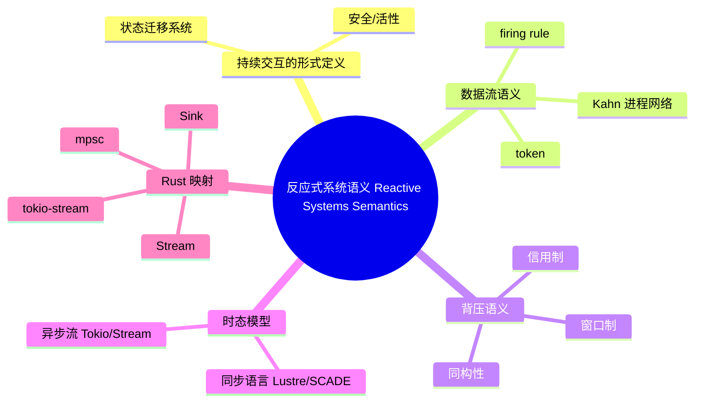

> **内容分级**: [专家级]
> **本节关键术语**: Reactive System · Dataflow · Kahn Process Network · Backpressure · Synchronous Language · Stream · Sink · Credit-Based Flow Control · Window-Based Flow Control — [完整对照表](../../00_meta/01_terminology/01_terminology_glossary.md)

# 反应式系统语义（Reactive Systems Semantics）

> **EN**: Reactive Systems Semantics
> **Summary**: Formal semantics of reactive systems — streams, backpressure, timed and untimed models — and their realization in Rust's async/Stream ecosystem.
> **Rust 版本**: 1.97.0+ (Edition 2024)
> **受众**: [研究者]
> **Bloom 层级**: L4
> **权威来源**: 本文件为 `concept/` 权威页：反应式系统形式语义及其 Rust 映射的唯一深度解释。
> **A/S/P 标记**: **S+A** — Structure + Application
> **双维定位**: C×Ana — 分析持续交互系统的形式语义与 Rust async 流的工程投影
> **定位**: 从数据流（dataflow）、Kahn 进程网络、同步/异步语言与背压协议四个角度，形式化刻画反应式系统的语义，并将其映射到 Rust 的 `Stream`/`Sink`、`tokio::sync::mpsc` 与 `tokio-stream` 生态。
> **前置概念**: [Async/Await](../../03_advanced/01_async/01_async.md) · [Stream 代数与背压](../../03_advanced/01_async/09_stream_algebra_and_backpressure.md) · [进程代数与 Rust](../07_concurrency_semantics/01_process_calculi_for_rust.md)
> **后置概念**: [Reactive Programming](../../06_ecosystem/04_web_and_networking/09_reactive_programming.md) · [Actor 模型形式语义](../07_concurrency_semantics/03_actor_semantics.md)

---

> **来源**:
> [The Reactive Manifesto](https://www.reactivemanifesto.org/) ·
> [Reactive Streams Specification](https://www.reactive-streams.org/) ·
> [Async Book — Streams](https://rust-lang.github.io/async-book/05_streams/01_chapter.html) ·
> [Kahn, *The Semantics of a Simple Language for Parallel Programming*, 1974](https://dl.acm.org/doi/10.1145/800233.807045) ·
> [Lee & Sangiovanni-Vincentelli, *A Framework for Comparing Models of Computation*, IEEE TCAD 1998](https://ieeexplore.ieee.org/document/660400) ·
> [Halbwachs, *Synchronous Programming of Reactive Systems*, Kluwer 1993](https://link.springer.com/book/10.1007/978-1-4757-3785-3) ·
> [futures-rs — `Stream`](https://docs.rs/futures/latest/futures/stream/trait.Stream.html) ·
> [tokio-stream docs](https://docs.rs/tokio-stream/latest/tokio_stream/) ·
> [tokio::sync::mpsc docs](https://docs.rs/tokio/latest/tokio/sync/mpsc/)
>
> ⚠️ **声明**: 本页呈现的是反应式系统的**形式语义骨架与教学级对应**，非经机器验证的同构证明。Rust 标准库未以任何反应式形式模型为基础；「对应」指结构化类比，而非双模拟等价。
>
> **权威来源 / Provenance**: The Reactive Manifesto. *The Reactive Manifesto*. 2013/2014. 该宣言定义了反应式系统的四个核心特征：Responsive（响应性）、Resilient（弹性）、Elastic（弹性）与 Message-Driven（消息驱动）。[Official Site](https://www.reactivemanifesto.org/)

---

## 📑 目录

- [反应式系统语义（Reactive Systems Semantics）](#反应式系统语义reactive-systems-semantics)
  - [📑 目录](#-目录)
  - [一、核心概念](#一核心概念)
    - [1.1 反应式系统：持续交互的形式定义](#11-反应式系统持续交互的形式定义)
    - [1.2 数据流语义：token、firing rule 与 Kahn 进程网络](#12-数据流语义tokenfiring-rule-与-kahn-进程网络)
    - [1.3 背压语义：信用制 vs 窗口制](#13-背压语义信用制-vs-窗口制)
    - [1.4 时态模型：同步语言 vs 异步流](#14-时态模型同步语言-vs-异步流)
    - [1.5 Rust 映射：从形式模型到 Stream / Sink / mpsc](#15-rust-映射从形式模型到-stream--sink--mpsc)
  - [二、定理链](#二定理链)
  - [三、反例与边界](#三反例与边界)
    - [反例：无界缓冲保障安全但违反活性/资源界](#反例无界缓冲保障安全但违反活性资源界)
  - [四、相关概念](#四相关概念)
  - [五、嵌入式测验（Embedded Quiz）](#五嵌入式测验embedded-quiz)
    - [测验 1：Kahn 进程网络确定性的前提是什么？（理解层）](#测验-1kahn-进程网络确定性的前提是什么理解层)
    - [测验 2：窗口制背压与信用制背压在离散 token 语义下的关系是什么？（分析层）](#测验-2窗口制背压与信用制背压在离散-token-语义下的关系是什么分析层)
    - [测验 3：Rust 的 `Stream` 更接近下列哪种反应式时态模型？（应用层）](#测验-3rust-的-stream-更接近下列哪种反应式时态模型应用层)
    - [测验 4：无界缓冲 `mpsc::unbounded_channel` 在持续 λ \> μ 的场景下会违反哪个性质？（分析层）](#测验-4无界缓冲-mpscunbounded_channel-在持续-λ--μ-的场景下会违反哪个性质分析层)
    - [测验 5：在反应式系统中，`Stream<Item = T>` 与 `Sink<T>` 的语义分工最接近数据流模型中的什么？（理解层）](#测验-5在反应式系统中streamitem--t-与-sinkt-的语义分工最接近数据流模型中的什么理解层)
  - [六、权威来源索引](#六权威来源索引)
  - [🧭 思维导图（Mindmap）](#-思维导图mindmap)

---

## 一、核心概念

### 1.1 反应式系统：持续交互的形式定义

反应式系统（reactive system）不是「输入→计算→输出」的转换器，而是**与环境维持持续交互**的系统：它不断地读取外部事件、产生响应，并在无显式终止的条件下运行（Pnueli 1985；Reactive Manifesto 2013）。

形式化地，一个反应式系统可建模为**状态迁移系统**：

```text
Reactive System ::= ⟨S, s₀, I, O, δ, λ⟩
  S  : 状态集合
  s₀ : 初始状态 ∈ S
  I  : 输入事件集合（环境 → 系统）
  O  : 输出事件集合（系统 → 环境）
  δ  : S × I → S        -- 状态转移函数
  λ  : S × I → O        -- 输出函数
```

与交互式系统（interactive system）的关键区别：反应式系统**没有用户显式触发的「会话结束」语义**，其正确性通常用**时态逻辑**（LTL/CTL）或**迹（trace）上的安全/活性**来刻画，而非输入-输出函数等价。

Rust 中的反应式系统通常表现为：

- 事件驱动：`tokio::select!` 循环读取多个事件源；
- 流驱动：`Stream` 管道持续拉取并变换数据元素。

> **过渡**: 反应式系统的第一个形式化支柱是**数据流语义**：把计算看作 token 在节点之间的流动。

---

### 1.2 数据流语义：token、firing rule 与 Kahn 进程网络

**数据流模型（dataflow model）**把程序看作有向图：节点是计算 actor，边是 FIFO 通道，边上流动的单元是 **token**（数据值）。

```text
Dataflow Graph ::= ⟨N, E, T⟩
  N : 节点集合，每个节点 n ∈ N 有一个 firing rule Rₙ
  E ⊆ N × N : 有向边，每条边 e 维护一个 FIFO token 序列 qₑ
  T : token 值的类型集合
```

**Firing rule（点火规则）**决定节点何时可以执行一次计算：

```text
Rₙ : 对 n 的每条输入边 e，指定需要从 qₑ 消耗的前缀 token 数 kₑ
     当 ∀e. |qₑ| ≥ kₑ 时，n 可 firing；
     firing 后从输入边移除对应 token，并在输出边产生新 token。
```

**Kahn Process Network（KPN, Kahn 1974）**是数据流的一个经典形式化：

- 每个节点是一个顺序进程；
- 边是**无界 FIFO**；
- 读写操作**阻塞**：读空队列阻塞，写满（在 Kahn 原始语义中队列无界，故写永不阻塞）。

Kahn 的核心定理：

```text
Kahn 确定性定理（Determinism）:
  若每个节点的计算函数都是确定性的，
  则整个网络的输出迹（output trace）与进程调度顺序无关。

  形式化: ∀调度 σ, τ. 若网络收敛，则最终输出的 token 序列相同。
```

这条定理解释了为什么数据流程序天然**无数据竞争**：竞争只出现在共享可变状态；KPN 的节点间唯一通信是 FIFO 边，token 消费是原子的顺序操作。

> **教学注记**: KPN 假设**无界 FIFO**，这是其确定性的代价；工程实现必须用有界通道，从而引入背压（§1.3）。

Rust 中的 KPN 投影：

```rust,ignore
// 概念示意：两个 Kahn 节点通过有界 FIFO 边连接
// 节点 A: 产生自然数序列
// 节点 B: 将每个数平方后输出

use tokio::sync::mpsc;

async fn producer(tx: mpsc::Sender<i32>) {
    for i in 0..100 {
        tx.send(i).await.unwrap(); // 边 e 上的 write：在 KPN 中无阻塞；在 Rust 中受背压约束
    }
}

async fn consumer(mut rx: mpsc::Receiver<i32>) {
    while let Some(x) = rx.recv().await {
        // 节点 B 的 firing rule：从输入边读取 1 个 token，产生 x²
        println!("{}", x * x);
    }
}
```

> **过渡**: KPN 的无界假设在工程中不可接受；下一节把背压作为**有界 FIFO 下的语义修正**来形式化。

---

### 1.3 背压语义：信用制 vs 窗口制

背压（backpressure）是反应式系统把下游处理能力**反向传播**给上游的机制。形式化地，设数据路径上有一个缓冲队列 `Q`，背压成立当且仅当：

```text
背压的语义条件：
  (1) 有界性: ∃B. ∀t. |Q(t)| ≤ B
  (2) 传播性: 当 |Q| = B 时，上游发送操作被阻塞/挂起
```

两条性质缺一不可：有界而无传播是「丢弃」；传播而无界是逻辑矛盾。背压不是消除过载，而是**把无限内存增长转换为受控延迟**。

工程实现分两种同构机制：

| 机制 | 不变量 | 语义 | Rust 载体 |
|:---|:---|:---|:---|
| 窗口制（window） | 在途未确认元素 ≤ W | 发送方维护计数，耗尽即停 | `tokio::sync::mpsc::channel(W)` |
| 信用制（credit） | Σ已发 − Σ已确认 ≤ 已授予信用 | 接收方主动授予「还可发 N 个」 | 自定义 `Semaphore` permit |

**同构性**：窗口 `W` 等价于初始信用 `W`，每从队列取出一个元素即归还一单位信用。`tokio::sync::mpsc::channel(W)` 本质上是窗口制：`send().await` 在窗口耗尽时挂起，正是传播性的可观测形态。

```text
定理 T-RS-01（窗口-信用同构）:
  对于离散 token 流，窗口制容量 W 与信用制初始信用 W 在可观测事件序列上等价：
  两者产生相同的 (send, recv) 迹集合。

  前提: 无乱序、无丢失、ack 与 token 一一对应。
  结论: 选型时只需考虑实现复杂度，不必考虑表达力差异。
```

> **注意**: 背压的完整代数与队列论模型见 [L3-L4 Stream 代数与背压](../../03_advanced/01_async/09_stream_algebra_and_backpressure.md)；本页只给出反应式系统语义层面的骨架与定理。

---

### 1.4 时态模型：同步语言 vs 异步流

反应式系统可按**时间模型**分为两大类：

```text
时态光谱:
  同步反应式语言（Synchronous Reactive Languages）
    └── 假设：系统在每个逻辑瞬间（tick）同时读取全部输入并产生全部输出
    └── 代表：Lustre, SCADE, Esterel
    └── 语义基础：同步假设（synchrony hypothesis）+ 时钟演算（clock calculus）

  异步反应式流（Asynchronous Reactive Streams）
    └── 假设：事件按 wall-clock 时间到达，系统在各事件到达时刻响应
    └── 代表：Reactive Streams, Tokio streams, Rx
    └── 语义基础：偏序事件 + 背压协议
```

**同步假设（synchrony hypothesis）**：计算在 tick 内瞬时完成，因此在一个 tick 内不存在「部分输出」。这极大简化了形式验证，但要求 worst-case 执行时间远小于 tick 周期。违反同步假设会导致**时钟违例（clock violation）**。

**异步模型**放弃全局 tick，采用事件驱动的偏序；正确性不再依赖「瞬时完成」，而依赖：

- 每条事件最终被处理（活性，liveness）；
- 缓冲不会无限增长（安全性，safety，由背压保证）。

Rust 的 `Stream` 属于异步模型：`poll_next` 由执行器驱动，没有全局 tick。只有在需要硬实时保证的场景，才应考虑外部同步语言工具链（如 SCADE）生成的 Rust 绑定。

> **过渡**: 形式模型就绪后，下面把它们逐项映射到 Rust 的 async/Stream 生态。

---

### 1.5 Rust 映射：从形式模型到 Stream / Sink / mpsc

| 形式模型概念 | Rust 载体 | 对应强度 | 关键偏差 |
|:---|:---|:---:|:---|
| 反应式节点（node） | `async fn` / `Stream` 实现 | 高 | Rust 节点是协作式任务，非独立进程 |
| FIFO 边 | `tokio::sync::mpsc`, `crossbeam-channel` | 高 | KPN 假设无界；Rust 默认有界 |
| token | `Stream::Item` / `mpsc::T` | 高 | — |
| firing rule | `poll_next` / `recv().await` | 中 | firing 由执行器 poll 驱动，非数据自动触发 |
| 窗口制背压 | `mpsc::channel(W)` | 高 | `send().await` 自动挂起 |
| 信用制背压 | `tokio::sync::Semaphore`, 自定义 `request(n)` | 中 | 需手动维护 ack/permit |
| 同步假设 | 无原生对应；需外部 SCADE/LSL 生成代码 | 低 | Rust async 无时钟演算 |
| 输出端点 | `futures::Sink` | 高 | `Sink` 显式抽象 token 的消费/发送 |

`Stream` 与 `Sink` 的语义分工：

```text
Stream<Item = T>  : 拉取端；消费者通过 poll_next 拉取 token
Sink<T, Error = E>: 推送端；生产者通过 start_send / poll_ready 推送 token
```

`Stream` 对应数据流节点的**输出边**（token 从节点流出），`Sink` 对应**输入边**（token 流入节点）。一个完整的反应式 actor 通常是 `Stream + Sink` 的组合：从某处拉取、变换、再推送。

```rust,ignore
use futures::{Sink, SinkExt, Stream, StreamExt};
use std::pin::Pin;
use std::task::{Context, Poll};

// 一个极简的「反应式节点」：输入 i32，输出 i32，行为为 x → x + 1
struct IncrementNode<Si, So> {
    input: Si,   // Stream<Item = i32>
    output: So,  // Sink<i32>
}

impl<Si, So> IncrementNode<Si, So>
where
    Si: Stream<Item = i32> + Unpin,
    So: Sink<i32> + Unpin,
{
    async fn run(mut self) {
        while let Some(x) = self.input.next().await {
            // firing rule：从输入边读到 1 个 token 即可 firing
            // 输出函数 λ(x) = x + 1
            if self.output.send(x + 1).await.is_err() {
                break; // 下游关闭：反应式系统终止该节点
            }
        }
    }
}
```

`tokio-stream` 提供的适配器（`ReceiverStream`, `IntervalStream`, `StreamExt::timeout` 等）是同步语言**时钟/采样器**概念在异步世界中的投影：

```rust,ignore
use tokio::time::{interval, Duration};
use tokio_stream::wrappers::IntervalStream;
use tokio_stream::StreamExt;

// 异步「时钟 tick」：每 100ms 产生一个 () token
let ticks = IntervalStream::new(interval(Duration::from_millis(100)))
    .map(|_| 1u32); // 每个 tick 映射为计数 token
```

> **过渡**: 形式模型与 Rust 映射确立后，用一个反例揭示反应式系统最常见的语义误判。

---

## 二、定理链

| 编号 | 命题 | 前提 | 结论 |
|:---|:---|:---|:---|
| T-RS-01 | 窗口-信用同构 | 离散 token、无乱序、ack 与 token 一一对应 | 窗口制与信用制产生相同的 (send, recv) 迹 |
| T-RS-02 | Kahn 确定性 | 每个节点函数确定性 + 边为 FIFO | 输出迹与调度顺序无关 |
| T-RS-03 | 有界缓冲 ⟹ 资源安全 | 背压条件 (1)(2) 成立 | 数据路径内存使用有上界 |
| T-RS-04 | 无界缓冲 ⟹ 资源无界 | 上游速率持续高于下游 | 队列长度随时间线性发散 |
| T-RS-05 | Stream 拉取模型天然背压 | 消费者不 poll | 上游 async 生产代码挂起在 await 点 |

---

## 三、反例与边界

### 反例：无界缓冲保障安全但违反活性/资源界

一个常见直觉是：「只要队列无限大，就永远不会丢数据，因此系统更安全。」这只说对了一半。无界缓冲确实保证**安全性**（safety：不丢数据），但会破坏**活性/资源界**（liveness/resource bound）：当生产速率持续高于消费速率时，队列长度线性发散，最终耗尽内存，系统被 OOM killer 终止。

```rust,ignore
// ❌ 反例：用无界通道实现「反应式管道」，看似安全实则违反资源界
use tokio::sync::mpsc;

async fn broken_pipeline() {
    let (tx, mut rx) = mpsc::unbounded_channel::<Vec<u8>>();

    // 上游节点：以固定速率产生大 token
    tokio::spawn(async move {
        loop {
            let chunk = vec![0u8; 1024 * 1024]; // 1 MiB
            tx.send(chunk).unwrap(); // 永不阻塞，无背压传播
        }
    });

    // 下游节点：慢速消费
    while let Some(chunk) = rx.recv().await {
        tokio::time::sleep(tokio::time::Duration::from_secs(1)).await;
        drop(chunk);
    }
    // 结果：内存随时间线性增长 → 违反资源界（resource-bound liveness）
}
```

**形式化表述**：设到达率 λ > 服务率 μ，无界队列 `Q` 的期望长度 `E[Q(t)] ≈ (λ − μ)·t`，随时间发散。因此无界缓冲下的系统**不满足**「 eventual progress under bounded memory」这一活性变体。

**修正**：将 `mpsc::unbounded_channel` 替换为 `mpsc::channel(B)`，并显式处理 `send().await` 处的背压。

```rust,ignore
// ✅ 修正：有界窗口 B = 8
let (tx, mut rx) = mpsc::channel::<Vec<u8>>(8);
// 上游: tx.send(chunk).await.unwrap(); // 窗口耗尽时挂起
// 下游: 正常消费
```

> **边界**: 即使使用有界通道，若长期 λ > μ，系统仍会以延迟增加的方式饱和；背压只改变拥塞的呈现形式，不消除根本 overload。此时需要分片、降级或丢弃策略。

---

## 四、相关概念

- [L3-L4 Stream 代数与背压](../../03_advanced/01_async/09_stream_algebra_and_backpressure.md) —— Stream-Iterator 对偶、StreamExt 组合子代数、背压队列论模型的权威页
- [L2-L4 Reactive Programming](../../06_ecosystem/04_web_and_networking/09_reactive_programming.md) —— 响应式宣言、Reactive Streams 四元接口、FRP Signal/Event 的工程视角
- [L3 Async/Await](../../03_advanced/01_async/01_async.md) —— `Future`/`poll` 状态机、`Pin` 语义、Waker 契约
- [L4 进程代数与 Rust](../07_concurrency_semantics/01_process_calculi_for_rust.md) —— CSP/CCS/π 演算与 Rust 通道的对应
- [L4 Actor 模型形式语义](../07_concurrency_semantics/03_actor_semantics.md) —— 命名进程 + 邮箱的对偶反应式模型

---

## 五、嵌入式测验（Embedded Quiz）

#### 测验 1：Kahn 进程网络确定性的前提是什么？（理解层）

- A. 所有 FIFO 队列必须是有界的。
- B. 每个节点的计算函数必须是确定性的，且边是 FIFO。
- C. 系统必须运行在单线程上。
- D. 所有节点必须按固定 tick 同步执行。

<details><summary>答案与解析</summary>

**答案：B**

Kahn 确定性定理指出：只要每个节点的计算函数是确定性的，并且节点间通过 FIFO 边通信，整个网络的输出迹就与调度顺序无关。有界性（A）是工程实现的约束，不是 Kahn 原始定理的前提；单线程（C）和同步 tick（D）是同步语言的特点，不是 KPN 的要求。

</details>

#### 测验 2：窗口制背压与信用制背压在离散 token 语义下的关系是什么？（分析层）

- A. 窗口制表达能力更强，可以建模乱序。
- B. 信用制可以精确控制每个下游节点，窗口制只能控制整条边。
- C. 在 ack 与 token 一一对应的前提下，两者产生相同的可观测 (send, recv) 迹。
- D. 窗口制需要显式 `request(n)`，信用制不需要。

<details><summary>答案与解析</summary>

**答案：C**

在无乱序、无丢失、ack 与 token 一一对应的条件下，窗口容量 W 等价于初始信用 W，两者在可观测事件序列上是同构的。窗口制由发送方维护计数（`mpsc::channel(W)`），信用制由接收方授予 permit；它们是同一语义的不同实现策略。

</details>

#### 测验 3：Rust 的 `Stream` 更接近下列哪种反应式时态模型？（应用层）

- A. Lustre/SCADE 的同步反应式模型（全局 tick + 同步假设）。
- B. 异步事件驱动的 Reactive Streams 模型（无全局 tick，poll/拉取驱动）。
- C. 纯推模型（pure push）的回调事件系统。
- D. 实时操作系统中的时间触发调度。

<details><summary>答案与解析</summary>

**答案：B**

Rust 的 `Stream` 基于 `poll_next`，由消费者/执行器驱动，没有全局逻辑 tick，因此属于异步反应式流模型。它与 Reactive Streams 的拉取语义天然对齐：消费者不 poll，上游就挂起，从而自带背压。它不是同步语言（A），也不是纯推回调（C）。

</details>

#### 测验 4：无界缓冲 `mpsc::unbounded_channel` 在持续 λ > μ 的场景下会违反哪个性质？（分析层）

- A. 安全性（safety）：会丢失数据。
- B. 活性（liveness）：消费者永远无法收到数据。
- C. 资源界（resource bound）：队列长度随时间线性发散，最终耗尽内存。
- D. 顺序性：token 的 FIFO 顺序被打乱。

<details><summary>答案与解析</summary>

**答案：C**

无界缓冲保证不丢数据（安全性成立），也保证消费者最终能收到数据（基本活性成立），但由于 λ > μ 时队列长度 `E[Q(t)] ≈ (λ−μ)·t`，会违反资源界，导致内存无限增长直至 OOM。顺序性由 FIFO 维持，不会被打乱。

</details>

#### 测验 5：在反应式系统中，`Stream<Item = T>` 与 `Sink<T>` 的语义分工最接近数据流模型中的什么？（理解层）

- A. `Stream` = 计算节点；`Sink` = FIFO 边。
- B. `Stream` = 输出边（token 从节点流出）；`Sink` = 输入边（token 流入节点）。
- C. `Stream` = 输入事件；`Sink` = 状态转移函数。
- D. `Stream` = 同步 tick；`Sink` = 异步事件。

<details><summary>答案与解析</summary>

**答案：B**

`Stream` 是拉取端，对应数据流节点向外部提供的输出 token 流；`Sink` 是推送端，对应节点接收输入 token 的边。完整的反应式 actor 通常同时具有输入 `Sink` 和输出 `Stream`。

</details>

---

## 六、权威来源索引

- Reactive Manifesto. *The Reactive Manifesto*. 2013/2014. [官网](https://www.reactivemanifesto.org/)
- Reactive Streams Specification. [官网](https://www.reactive-streams.org/)
- Kahn, G. *The Semantics of a Simple Language for Parallel Programming*. Proc. IFIP Congress 1974. [ACM DL](https://dl.acm.org/doi/10.1145/800233.807045)
- Lee, E. A., & Sangiovanni-Vincentelli, A. *A Framework for Comparing Models of Computation*. IEEE TCAD 17(12), 1998. [IEEE Xplore](https://ieeexplore.ieee.org/document/660400)
- Halbwachs, N. *Synchronous Programming of Reactive Systems*. Kluwer, 1993. [Springer](https://link.springer.com/book/10.1007/978-1-4757-3785-3)
- Pnueli, A. *Applications of Temporal Logic to the Specification and Verification of Reactive Systems: A Survey of Current Trends*. LNCS 224, 1986.
- [futures-rs — `Stream` trait](https://docs.rs/futures/latest/futures/stream/trait.Stream.html) · [futures-rs — `Sink` trait](https://docs.rs/futures/latest/futures/sink/trait.Sink.html) · [futures-rs — `StreamExt`](https://docs.rs/futures/latest/futures/stream/trait.StreamExt.html)
- [tokio-stream docs](https://docs.rs/tokio-stream/latest/tokio_stream/) · [tokio::sync::mpsc docs](https://docs.rs/tokio/latest/tokio/sync/mpsc/)

> **相关文件**: [同层：Actor 模型系统语义入口](01_actor_model_semantics.md) · [同层：π 演算系统语义入口](02_pi_calculus_for_rust.md) · [L3-L4 Stream 代数与背压](../../03_advanced/01_async/09_stream_algebra_and_backpressure.md) · [L2-L4 Reactive Programming](../../06_ecosystem/04_web_and_networking/09_reactive_programming.md)
>
> **文档版本**: 1.0 ｜ **最后更新**: 2026-07-28 ｜ **状态**: ✅ W5-3 新建（Rust 1.97 对齐）

## 🧭 思维导图（Mindmap）



> **认知功能**: 本 mindmap 从本页章节结构提炼，一级分支对应反应式系统语义的核心维度，叶子节点为关键形式概念与 Rust 载体，可作为本页的快速导航与复习索引。
