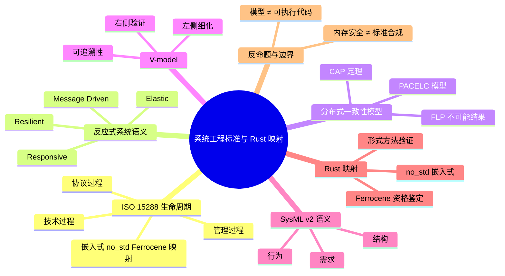

> **内容分级**: [专家级]
>
> **本节关键术语**: 系统生命周期 · V-model · 验证与确认 · SysML v2 · 需求追溯 · 安全关键 · Ferrocene — [完整对照表](../../00_meta/01_terminology/01_terminology_glossary.md)

# 系统工程标准与 Rust 映射

> **EN**: Systems Engineering Standards and Rust Mapping
> **Summary**: ISO/IEC/IEEE 15288 life-cycle processes, V-model, SysML v2 semantics, and their projection onto Rust safety-critical and embedded systems.
> **Rust 版本**: 1.97.0+ (Edition 2024)
> **受众**: [专家]
> **Bloom 层级**: L4-L5
> **权威来源**: 本文件为 concept/ 权威页。
> **A/S/P 标记**: **S+A** — Structure + Application
> **双维定位**: C×Ana — 分析系统工程标准的形式语义及其在 Rust 中的工程投影
> **定位**: 从系统生命周期、V&V 与模型语义三个维度，建立系统工程标准与 Rust 安全关键/嵌入式实现的映射框架。
> **前置概念**: [并发模型](../../03_advanced/00_concurrency/01_concurrency.md) · [Actor 模型系统语义](01_actor_model_semantics.md) · [分布式系统语义](04_distributed_systems_semantics.md) · [反应式系统语义](05_reactive_systems_semantics.md)
> **后置概念**: [安全关键系统工程](../../06_ecosystem/11_domain_applications/23_safety_critical_systems_engineering.md) · [组件化系统语义](03_component_based_semantics.md)

---

> **来源**:
> [ISO/IEC/IEEE 15288:2023 — Systems and Software Engineering — System Life Cycle Processes](https://www.iso.org/standard/63711.html) ·
> [INCOSE — Systems Engineering Handbook v5](https://www.incose.org/publications) ·
> [OMG SysML v2 Specification](https://www.omg.org/spec/SysML/) ·
> [Ferrocene Language Specification](https://spec.ferrocene.dev/) ·
> [RTCA DO-178C — Software Considerations in Airborne Systems and Equipment Certification](https://my.rtca.org/) ·
> [ISO 26262 — Road vehicles — Functional safety](https://www.iso.org/standard/68383.html) ·
> [IEC 61508 — Functional safety of E/E/PE safety-related systems](https://webstore.iec.ch/publication/66912) ·
> [Rust Reference](https://doc.rust-lang.org/reference/introduction.html)

> **权威来源 / Provenance**: 本节系统生命周期、V-model 与验证确认（V&V）语义直接对齐 ISO/IEC/IEEE 15288:2023 与 INCOSE Systems Engineering Handbook 第 5 版；安全关键映射对齐 RTCA DO-178C、ISO 26262、IEC 61508 与 Ferrocene 资格鉴定。
>
> - **ISO/IEC/IEEE 15288:2023** — *Systems and Software Engineering — System Life Cycle Processes*. ISO, 2023. [https://www.iso.org/standard/63711.html](https://www.iso.org/standard/63711.html)
> - **INCOSE** — *Systems Engineering Handbook: A Guide for System Life Cycle Processes and Activities* (5th ed.). Wiley, 2023. [https://www.incose.org/incose-members/featured-content/incose-handbooks](https://www.incose.org/incose-members/featured-content/incose-handbooks)
> - **RTCA DO-178C** — *Software Considerations in Airborne Systems and Equipment Certification*. RTCA, 2011. [https://my.rtca.org/](https://my.rtca.org/)
> - **ISO 26262** — *Road vehicles — Functional safety*. ISO, 2018. [https://www.iso.org/standard/68383.html](https://www.iso.org/standard/68383.html)
> - **IEC 61508** — *Functional safety of electrical/electronic/programmable electronic safety-related systems*. IEC, 2010. [https://webstore.iec.ch/publication/66912](https://webstore.iec.ch/publication/66912)
> - **Ferrocene** — *Ferrocene Language Specification* / TÜV SÜD qualification. [https://spec.ferrocene.dev/](https://spec.ferrocene.dev/)
> - **ISO/IEC/IEEE 15288:2023 (DOI)** — *Systems and Software Engineering — System Life Cycle Processes*. [https://doi.org/10.1109/IEEESTD.2023.10123367](https://doi.org/10.1109/IEEESTD.2023.10123367)
> - **Verus** — *Verifying Rust Programs using Linear Ghost Types* (OOPSLA 2023). [https://doi.org/10.1145/3586037](https://doi.org/10.1145/3586037)
> - **Creusot** — Deductive verification for Rust. [https://github.com/creusot-rs/creusot](https://github.com/creusot-rs/creusot)
> - **Aeneas** — Rust verification framework. [https://aeneasverif.github.io](https://aeneasverif.github.io)

---

ISO/IEC/IEEE 15288 技术过程到 Rust 制品决策表：

```text
| 15288 技术过程   | Rust 工程制品                  | 验证证据示例                       |
|------------------|--------------------------------|------------------------------------|
| 利益相关方需求   | requirements/ Markdown + ID    | 需求审查会议纪要                   |
| 系统需求分析     | struct/enum 不变量、常量       | 类型检查、static_assertions        |
| 架构设计         | crate 边界、模块图、trait 契约 | cargo check 通过、架构图           |
| 实现             | src/、Cargo.toml               | CI build、clippy 零警告            |
| 集成             | tests/integration、HIL         | 集成测试报告                       |
| 验证             | 单元/属性测试、Kani 证明       | 覆盖率、证明日志                   |
| 确认             | 用户场景测试、验收清单         | 验收签字、鉴定审查记录             |
```

> 说明：该决策表把 15288 技术过程链映射为 Rust 安全关键/嵌入式项目中的可审计制品，支持 V-model 左侧细化与右侧验证的追溯。

---

## 📑 目录

- [系统工程标准与 Rust 映射](#系统工程标准与-rust-映射)
  - [📑 目录](#-目录)
  - [一、权威定义](#一权威定义)
    - [二、ISO/IEC/IEEE 15288 生命周期过程](#二isoiecieee-15288-生命周期过程)
    - [2.1 技术过程（Technical Processes）](#21-技术过程technical-processes)
    - [2.2 管理过程（Management Processes）](#22-管理过程management-processes)
    - [2.3 协议过程（Agreement Processes）](#23-协议过程agreement-processes)
    - [2.4 生命周期过程与 Rust 嵌入式/no_std/Ferrocene 的映射](#24-生命周期过程与-rust-嵌入式no_stdferrocene-的映射)
  - [三、反应式系统语义](#三反应式系统语义)
  - [四、分布式一致性模型](#四分布式一致性模型)
    - [4.1 CAP 定理（Brewer 2000）](#41-cap-定理brewer-2000)
    - [4.2 FLP 不可能结果（Fischer, Lynch, Paterson 1985）](#42-flp-不可能结果fischer-lynch-paterson-1985)
    - [4.3 PACELC 模型](#43-pacelc-模型)
  - [五、V-model 与验证确认](#五v-model-与验证确认)
  - [六、SysML v2 形式语义](#六sysml-v2-形式语义)
    - [6.1 需求语义](#61-需求语义)
    - [6.2 结构语义](#62-结构语义)
    - [6.3 行为语义](#63-行为语义)
  - [七、Rust 映射](#七rust-映射)
    - [7.1 嵌入式与 no\_std](#71-嵌入式与-no_std)
    - [7.2 Ferrocene 资格鉴定](#72-ferrocene-资格鉴定)
    - [7.3 验证与形式方法](#73-验证与形式方法)
  - [八、反命题与边界](#八反命题与边界)
    - [反命题：Rust 的内存安全自动满足 DO-178C / ISO 26262](#反命题rust-的内存安全自动满足-do-178c--iso-26262)
    - [边界：SysML v2 模型不能直接编译为 Rust](#边界sysml-v2-模型不能直接编译为-rust)
    - [边界：V-model 不是线性瀑布](#边界v-model-不是线性瀑布)
  - [九、嵌入式测验（Embedded Quiz）](#九嵌入式测验embedded-quiz)
    - [测验 1：ISO/IEC/IEEE 15288 中哪一类过程直接包含“验证”与“确认”活动？](#测验-1isoiecieee-15288-中哪一类过程直接包含验证与确认活动)
    - [测验 2：V-model 的核心语义是什么？](#测验-2v-model-的核心语义是什么)
    - [测验 3：SysML v2 中，需求 `r` 与实现证据 `e` 之间的关系用什么谓词表达？](#测验-3sysml-v2-中需求-r-与实现证据-e-之间的关系用什么谓词表达)
    - [测验 4：在安全关键 Rust 项目中，选择 Ferrocene 工具链的主要价值是什么？](#测验-4在安全关键-rust-项目中选择-ferrocene-工具链的主要价值是什么)
    - [测验 5：下面哪段代码最能体现 SysML v2 状态机行为语义在 Rust 中的投影？](#测验-5下面哪段代码最能体现-sysml-v2-状态机行为语义在-rust-中的投影)
  - [十、权威来源索引](#十权威来源索引)
  - [🧭 思维导图（Mindmap）](#-思维导图mindmap)

---

## 一、权威定义

**系统工程（Systems Engineering, SE）** 是一门跨学科方法，用于管理复杂系统的全生命周期：从需求、设计、实现、集成、验证、确认到退役。

ISO/IEC/IEEE 15288:2023 给出核心形式框架：

```text
系统生命周期 L ::= ⟨P_tech, P_mgmt, P_agree, P_enab⟩
  P_tech  : 技术过程（需求、架构、设计、实现、集成、验证、转移）
  P_mgmt  : 管理过程（项目规划、风险评估、配置管理、质量保证）
  P_agree : 协议过程（采购、供应、协议建立与维护）
  P_enab  : 使能过程（文档、知识、人力资源管理）
```

在 Rust 语境下，本页关注的是：**如何把 15288 的过程视图、V-model 的双向追溯，以及 SysML v2 的模型语义，转化为可编译、可验证、可审计的工程制品**。

---

## 二、ISO/IEC/IEEE 15288 生命周期过程

15288 把生命周期过程分为四类。对 Rust 安全关键项目最有直接影响的是技术、管理与协议三类。

### 2.1 技术过程（Technical Processes）

```text
技术过程链:
  业务/任务分析  →  利益相关方需求定义
        ↓
  系统需求分析  →  架构设计  →  实现
        ↓
  集成  →  验证（Verification） →  确认（Validation） →  转移
```

| 过程 | 核心交付 | Rust 工程映射 |
|:---|:---|:---|
| 利益相关方需求 | 需求规格说明 | `requirements/` 目录、追溯矩阵 |
| 系统需求分析 | 系统需求规格（SyRS） | 用类型/不变量捕获关键需求 |
| 架构设计 | 架构视图、接口控制文件 | crate 边界、模块图、API 契约 |
| 实现 | 源代码、构建配置 | `src/`、`Cargo.toml`、CI 配置 |
| 集成 | 集成测试策略 | `tests/integration`、硬件在环（HIL） |
| 验证 | 是否“正确构建” | 单元测试、属性测试、模型检查 |
| 确认 | 是否“构建正确” | 用户场景测试、系统鉴定 |

### 2.2 管理过程（Management Processes）

```text
管理过程:
  项目规划  ·  项目评估与控制  ·  风险管理
  配置管理  ·  信息管理       ·  质量管理
  测量      ·  决策管理
```

Rust 生态把这些管理过程编码为工具链：

- **配置管理**：`git` + `Cargo.lock` + `rust-toolchain.toml`
- **质量保证**：`clippy`、MIET 覆盖率、`cargo vet`、`cargo audit`
- **风险管理**：依赖 SBOM、`cargo audit` 的 RUSTSEC 追踪

### 2.3 协议过程（Agreement Processes）

协议过程处理供需双方的契约。对 Rust 项目而言，这意味着：

- 在采购/供应合同中明确 **MSRV**（`rust-version = "1.97.0"`）
- 明确工具链资格范围：上游 stable rustc 还是 **Ferrocene** 认证工具链
- 明确第三方 crate 的评审等级与使用限制

### 2.4 生命周期过程与 Rust 嵌入式/no_std/Ferrocene 的映射

将 15288 的生命周期过程映射到 Rust 嵌入式/安全关键工程，可得到如下对应关系：

| 15288 过程 | Rust / no_std / Ferrocene 工程制品 | 关键决策点 |
|:---|:---|:---|
| 利益相关方需求定义 | `no_std` 约束清单、RAM/ROM 预算、安全目标（ASIL/SIL） | 是否允许 `alloc`，是否使用 `std` 主机模拟 |
| 系统需求分析 | 用类型与不变量捕获实时/资源约束，例如 `const MAX_BUF: usize` | 静态分配 vs 动态分配的可认证性 |
| 架构设计 | crate 拆分：`core`（无 `std`）、`hal`（硬件抽象）、`app`；`Cargo.toml` feature flags | 硬件抽象层（HAL）与 Ferrocene 子集的兼容性 |
| 实现 | `#![no_std]`、`#[panic_handler]`、可选自定义 `global_allocator` | `unsafe` 驱动代码的封装与审计 |
| 集成 | `cargo embed` / `probe-rs`、硬件在环（HIL）、链接启动文件 | 目标 triple 与链接脚本版本锁定 |
| 验证 | 主机单元测试 + 交叉编译目标测试、Miri/`cargo kani` 验证 `no_std` 不变量 | 工具链是否经过 Ferrocene 资格鉴定 |
| 确认 | 系统验收测试、TÜV SÜD 证书、工具鉴定报告 | Ferrocene 语言规范子集的合规声明 |
| 协议/供应 | MSRV、Ferrocene 版本、`Cargo.lock`、第三方 crate 审计等级 | 合同中明确“上游 rustc 不在认证范围内” |

**边界说明**：`no_std` 是架构决策，不是默认选项。选择 `no_std` 会禁用 `std` 的 panic 基础设施、文件与网络抽象，必须显式提供 `panic_handler` 与启动入口。Ferrocene 提供的是**工具链资格证据**，不替代需求追溯与测试。

---

## 三、反应式系统语义

[Reactive Manifesto](https://www.reactivemanifesto.org/) 将反应式系统定义为“对事件作出响应、负载可伸缩、具备弹性、以消息驱动”的系统。其四个核心语义属性可形式化地映射到 Rust 并发与异步基础设施：

| 属性 | 语义定义 | Rust 工程映射 |
|---|---|---|
| **Responsive（响应性）** | 系统在可预测时间内作出响应，关注尾延迟与用户体验 | `tokio` 任务调度、`tokio::time::timeout`、延迟直方图、`tracing` 指标 |
| **Resilient（弹性/韧性）** | 面对故障仍保持响应，通过隔离、复制与监督限制故障扩散 | `tokio` 任务 abort / `JoinSet`、`tower` 重试与熔断、`supervisor` 模式 |
| **Elastic（伸缩性）** | 随工作负载变化自动调整资源，保持响应 | `tokio` runtime 线程池、数据并行 `rayon`、连接池 / back-pressure |
| **Message Driven（消息驱动）** | 组件通过异步消息传递交互，形成显式边界与背压 | `tokio::sync::mpsc` / `broadcast`、`futures::Stream`、actor 框架 |

形式化关系可概括为：

```text
Message Driven → Elastic ∧ Resilient → Responsive
```

即消息驱动为弹性和伸缩提供基础，二者共同支撑响应性。

**边界与反例**：Reactive Manifesto 不保证硬实时（hard real-time）截止时间；它关注的是“在失败和负载下保持响应”的统计行为。一个消息驱动的 Rust 服务如果未建模超时和断路器，仍会在级联故障中丧失响应性。此外，消息传递引入了序列化、队列延迟和反序列化失败，这些开销在延迟敏感路径上可能成为新的瓶颈。

---

## 四、分布式一致性模型

分布式系统的一致性模型刻画了多节点在面对故障与网络分区时的行为边界。以下三个结果是该领域的国际权威结论：

### 4.1 CAP 定理（Brewer 2000）

Brewer 在 PODC 2000 提出、Gilbert & Lynch 2002 形式证明的 CAP 定理指出：

> 在异步网络中，若发生网络分区（Partition），分布式系统无法同时保证一致性（Consistency，通常指线性一致性）与可用性（Availability，每个非故障节点必须对请求作出响应）。

形式化表述：

```text
Partition ⇒ ¬(Consistency ∧ Availability)
```

Rust 工程映射：

- **CP 系统**：强一致性优先，例如基于 Raft 的键值存储（`openraft`、`raft` crate）。
- **AP 系统**：可用性优先，例如 gossip 协议、CRDT 数据类型。
- **测试**：使用 `tokio` 的 deterministic runtime 或网络故障注入库模拟分区，验证系统选择。

**边界**：CAP 的 C/A/P 只能在**分区发生时**构成三元权衡；正常网络下可以同时追求一致性与可用性。常见误读“三选二”忽略了分区的条件性。

### 4.2 FLP 不可能结果（Fischer, Lynch, Paterson 1985）

FLP 结果指出：

> 在完全异步的分布式系统中，即使只有一个节点可能发生崩溃故障（crash-stop），也不存在确定性的共识协议能够在有限步内保证终止。

形式化表述：

```text
Asynchronous messages ∧ f ≥ 1 crash-stop ⇒ No deterministic consensus algorithm always terminates
```

工程含义：Paxos、Raft 等实际算法通过引入**超时与部分同步假设**（partial synchrony）绕过 FLP 不可能性。Rust 实现中，`tokio::time::timeout` 与 leader election 的超时机制正是将异步模型弱化为部分同步的关键设计。

**边界**：FLP 针对的是**消息传递异步模型**与**确定性算法**；使用随机化协议（如 Ben-Or）或共享内存模型会改变结论。

### 4.3 PACELC 模型

PACELC（Abadi 2010）将 CAP 扩展为更细粒度的权衡框架：

> **If Partition, then choose Availability or Consistency; Else, choose Latency or Consistency.**

| 分支 | 选择 | 典型系统语义 |
|---|---|---|
| **P + A** | 分区时选可用性 | 异步复制、最终一致性、CRDT |
| **P + C** | 分区时选一致性 | 同步复制、暂停写入、Raft 多数派 |
| **E + L** | 无分区时选延迟 | 本地缓存、读从副本、异步提交 |
| **E + C** | 无分区时选一致性 | 同步读主节点、事务提交、强一致索引 |

Rust 工程映射：

- 同一进程内使用 `tokio::sync` channel 实现 `E + C`（强一致、低延迟）。
- 跨服务使用消息代理实现 `E + L` 或 `P + A`。
- 在 `no_std` 嵌入式集群中，分区 rare but catastrophic，因此往往倾向 `P + C`。

**反例**：认为“CAP/PACELC 只适用于数据库”是狭隘的。任何具有网络边界的 Rust 微服务、嵌入式总线或 `tokio` 运行时节点集合都受这些模型约束。

---

## 五、V-model 与验证确认

**V-model** 是系统工程的经典可视化框架，强调左侧“分解/细化”与右侧“集成/验证”的一一对应：

```text
          需求分析                    系统确认
            ↘                          ↗
              系统设计              系统验证
                ↘                  ↗
                  架构设计      集成测试
                    ↘          ↗
                      模块设计
                         ↓
                       编码
```

V-model 不是瀑布的同义词；它的核心语义是 **traceability（可追溯性）**：

```text
∀ 右侧测试项 t. ∃ 左侧需求/设计项 r.  s.t.  t 论证 r 被满足
```

在 Rust 工程中，可追溯性可通过以下机制实现：

- 需求 ID 嵌入 doc comment：`/// REQ-SYS-023: 所有错误路径返回 Result`
- 测试用例名映射到需求：`#[test] fn req_sys_023_error_path() { ... }`
- 静态检查保证接口不变量：类型系统本身即形式化需求的一部分

**Verification vs Validation**:

| 术语 | 问题 | 方法示例 |
|:---|:---|:---|
| Verification | 我们是否按规格正确构建？ | `cargo test`、`cargo clippy`、Kani 属性证明 |
| Validation | 我们是否构建了正确的东西？ | 系统级场景测试、用户确认、鉴定审查 |

---

## 六、SysML v2 形式语义

SysML v2 是 OMG 推出的下一代系统建模语言，从 v1 的图中心转向 **模型中心 + API 中心**。其形式语义可分解为三个核心域：

```text
SysML v2 模型 M ::= ⟨Req, Struct, Behav⟩
  Req    : 需求及其满足/追溯关系
  Struct : 部件、端口、连接与层级分解
  Behav  : 状态机、活动、交互
```

### 6.1 需求语义

需求被建模为可被引用、分解、满足和验证的实体：

```text
需求 r ::= ⟨id, text, status, {sub_req}, {satisfied_by}, {verified_by}⟩

满足关系:  satisfied_by(r, e)  ⇒  证据 e 论证需求 r 被实现
验证关系:  verified_by(r, t)   ⇒  测试/证明 t 论证需求 r 被验证
```

Rust 映射：

- 用 crate 级别的 doc comment 表达需求文本
- 用 `#[cfg(test)]` 模块中的测试函数作为 `verified_by`
- 用类型/不变量作为 `satisfied_by` 的编译期证据

### 6.2 结构语义

SysML v2 的结构语义基于 **部件（Part）**、**端口（Port）** 与 **连接（Connection）** 的层级组合：

```text
结构模型:
  Part      p ::= ⟨type, {sub_part}, {port}⟩
  Port      x ::= ⟨direction, item_type⟩
  Connection c ::= ⟨p_i.x_i, p_j.x_j, item_type⟩
```

这与 Rust 的模块/类型/ trait 边界高度对应：

- **Part** → `struct` / `enum` / `mod`
- **Port** → 公共 API（`pub fn`、`pub trait` 方法）的输入/输出参数
- **Connection** → trait 实现、channel、消息传递

### 6.3 行为语义

SysML v2 的行为可由状态机、活动图和序列图表达。其操作语义可归结为：

```text
状态机语义:
  M = ⟨S, s₀, Σ, δ, λ⟩
  S   : 状态集合
  s₀  : 初始状态
  Σ   : 事件集合
  δ   : S × Σ → S      -- 状态转移
  λ   : S × Σ → Action -- 输出/动作
```

Rust 中的直接映射是 `enum` + `match` + `async/await`。以下是一个**可编译**的简化投影，使用 `Result` 显式处理非法转移，避免“静默忽略”造成的语义丢失：

```rust,ignore
// 简化的 SysML 状态机行为投影
enum FlightMode {
    Standby,
    Armed,
    Flying,
    Landing,
}

impl FlightMode {
    fn on_event(self, event: Event) -> Self {
        match (self, event) {
            (FlightMode::Standby, Event::Arm) => FlightMode::Armed,
            (FlightMode::Armed,   Event::Launch) => FlightMode::Flying,
            (FlightMode::Flying,  Event::Land)  => FlightMode::Landing,
            (FlightMode::Landing, Event::Reset) => FlightMode::Standby,
            _ => self, // 非法事件被忽略：默认转移策略
        }
    }
}
```

```rust
// 带错误处理的 SysML 状态机行为投影（可编译）
// 状态集合 S、事件集合 Σ、转移函数 δ 均显式表达；非法转移返回错误而非静默跳过。

#[derive(Debug, PartialEq, Clone)]
enum PumpState {
    Idle,
    Running,
    Fault,
}

#[derive(Debug, PartialEq, Clone)]
enum PumpEvent {
    Start,
    Stop,
    Overheat,
    Reset,
}

#[derive(Debug, PartialEq)]
enum PumpError {
    InvalidTransition { from: PumpState, event: PumpEvent },
    AlreadyFault,
}

impl PumpState {
    fn on_event(self, event: PumpEvent) -> Result<Self, PumpError> {
        match (self, event) {
            (PumpState::Idle,    PumpEvent::Start)    => Ok(PumpState::Running),
            (PumpState::Running, PumpEvent::Stop)     => Ok(PumpState::Idle),
            (PumpState::Running, PumpEvent::Overheat) => Ok(PumpState::Fault),
            (PumpState::Fault,   PumpEvent::Reset)    => Ok(PumpState::Idle),
            (PumpState::Fault,   PumpEvent::Start)    => Err(PumpError::AlreadyFault),
            (from, event) => Err(PumpError::InvalidTransition { from, event }),
        }
    }
}

fn main() {
    let s = PumpState::Idle
        .on_event(PumpEvent::Start).unwrap()
        .on_event(PumpEvent::Overheat).unwrap();
    assert_eq!(s, PumpState::Fault);

    let err = PumpState::Idle.on_event(PumpEvent::Stop);
    assert!(matches!(
        err,
        Err(PumpError::InvalidTransition {
            from: PumpState::Idle,
            event: PumpEvent::Stop,
        })
    ));

    let recovered = s.on_event(PumpEvent::Reset).unwrap();
    assert_eq!(recovered, PumpState::Idle);
}
```

---

## 七、Rust 映射

### 7.1 嵌入式与 no_std

系统工程中的很多 Rust 目标运行在资源受限环境。`no_std` 是进入该域的门票：

```rust,ignore
#![no_std]
#![no_main]

use core::panic::PanicInfo;

#[panic_handler]
fn panic(_info: &PanicInfo) -> ! {
    loop {}
}

#[no_mangle]
pub extern "C" fn _start() -> ! {
    // 裸机系统入口：符合 15288 实现/集成过程的最小 Rust 投影
    loop {}
}
```

`no_std` 项目必须显式提供 `#[panic_handler]`；若错误地提供两个，编译器会报 `E0152`（发现重复的 lang item `panic_impl`）：

```rust,compile_fail,E0152
#![no_std]

use core::panic::PanicInfo;

#[panic_handler]
fn panic_handler_a(_info: &PanicInfo) -> ! {
    loop {}
}

// ❌ 错误：no_std 程序只能有一个 panic_handler
#[panic_handler]
fn panic_handler_b(_info: &PanicInfo) -> ! {
    loop {}
}

fn main() {}
```

在安全关键 Rust 项目中，这个错误常见于把多个 crate 或启动文件链接在一起时：每个子模块若各自定义 `#[panic_handler]`，链接阶段就会产生 `E0152`。DO-178C / ISO 26262 / IEC 61508 项目需要把 panic 策略作为工具链资格证据的一部分明确记录，确保全项目只有一个经鉴定的处理函数。

在 15288 视角下，`no_std` 的边界对应 **技术过程** 中的“架构约束”和“设计决策”：

- 选择 `no_std` 是一项架构决策，需要记录于设计记录
- 选择 `alloc` 还是完全静态分配影响 **RAM 预算** 与 **可认证性**

### 7.2 Ferrocene 资格鉴定

Ferrocene 是 Rust 的首个通过 TÜV SÜD 认证的工具链，覆盖：

- ISO 26262 ASIL D（汽车）
- IEC 61508 SIL 3（工业）
- DO-178C / DO-330 Class A/B/C 工具鉴定（航空）

在 15288 协议过程中，使用 Ferrocene 意味着：

```text
工具链资格声明:
  工具          : Ferrocene rustc + cargo + documentation
  认证范围      : ASIL D / SIL 3 / DO-178C Class A
  使用约束      : 必须遵守 Ferrocene Language Specification 中列出的已验证子集
  证据          : TÜV SÜD 证书 + 工具鉴定报告
```

### 7.3 验证与形式方法

Rust 的验证工具链可映射到 SysML v2 的 `verified_by` 关系：

| 形式工具 | 验证能力 | 适用层级 |
|:---|:---|:---|
| `cargo test` / 属性测试 | 单元/集成正确性 | 模块设计 |
| `miri` | UB 检测、unsafe 语义 | 实现层 |
| `clippy` / `rustc` | 静态约束、lint | 实现层 |
| Kani | 模型检查、循环不变量 | 模块/架构层 |
| Prusti | 契约式验证 | 模块层 |
| Verus | 定理证明、并发协议 | 架构/系统层 |

```rust,ignore
// Kani 示例：验证有界计数器的安全属性
#[cfg(kani)]
#[kani::proof]
fn counter_never_overflows() {
    let mut c: u8 = kani::any();
    kani::assume(c < 200);
    c = c.wrapping_add(1); // 若假设成立，wrapping_add 不会 UB
    assert!(c <= 200);
}
```

---

## 八、反命题与边界

### 反命题：Rust 的内存安全自动满足 DO-178C / ISO 26262

这是最常见的误解。Rust 的 borrow checker 消除了大量 C/C++ 中的未定义行为，但**不等于**满足安全标准。

安全标准要求的是 **过程证据** 而非语言特性本身：

```text
标准合规 ≠ 无缺陷代码
标准合规 = 可审计的过程 + 可追溯的需求 + 经鉴定的工具链 + 充分的测试/分析证据
```

例如，DO-178C 的 A 级软件要求：

- 需求双向追溯（高层 ↔ 低层 ↔ 代码 ↔ 测试）
- MC/DC 覆盖率
- 软件设计标准、编码标准
- 工具鉴定（DO-330）

Rust 只能帮助减少某些缺陷类别；其余证据仍需工程过程生成。

### 边界：SysML v2 模型不能直接编译为 Rust

SysML v2 是**建模语言**，不是程序设计语言。其语义包含大量工程意图（如“必须减重 10%”），无法自动翻译为可执行代码。Rust 代码只能实现 SysML 中可被形式化的部分（状态机、接口、数据流），而性能预算、物理约束、人机工程仍需人工解释。

### 边界：V-model 不是线性瀑布

V-model 常被误用为“需求 → 设计 → 编码 → 测试”的单向瀑布。实际上，它强调 **左侧细化与右侧验证的对应关系**，并不禁止迭代。在 Rust 敏捷开发中，每次迭代都应更新追溯矩阵，而非等到编码结束才补测试。

---

## 九、嵌入式测验（Embedded Quiz）

#### 测验 1：ISO/IEC/IEEE 15288 中哪一类过程直接包含“验证”与“确认”活动？

- A. 协议过程（Agreement Processes）
- B. 技术过程（Technical Processes）
- C. 使能过程（Enabling Processes）
- D. 管理过程（Management Processes）

<details><summary>答案与解析</summary>

**答案：B**

15288 的技术过程链包含实现、集成、验证、确认与转移。协议过程处理采购/供应，管理过程处理项目控制，使能过程提供支持环境。

</details>

#### 测验 2：V-model 的核心语义是什么？

- A. 软件开发必须严格按瀑布顺序执行
- B. 左侧细化与右侧验证/集成之间必须存在一一对应关系
- C. 编码完成后才能开始写测试
- D. 需求、设计、测试可以独立演化，无需追溯

<details><summary>答案与解析</summary>

**答案：B**

V-model 的核心是 **traceability**：每个右侧的验证/集成活动都必须对应左侧的一个需求或设计项。它不禁止迭代，也不要求测试延迟到编码结束后。

</details>

#### 测验 3：SysML v2 中，需求 `r` 与实现证据 `e` 之间的关系用什么谓词表达？

- A. `dependsOn(r, e)`
- B. `satisfiedBy(r, e)`
- C. `subClassOf(r, e)`
- D. `connectedTo(r, e)`

<details><summary>答案与解析</summary>

**答案：B**

SysML v2 需求语义使用 `satisfiedBy` 表示需求被某个元素满足，使用 `verifiedBy` 表示需求被某个测试或证明验证。

</details>

#### 测验 4：在安全关键 Rust 项目中，选择 Ferrocene 工具链的主要价值是什么？

- A. 自动修复所有 unsafe 代码缺陷
- B. 提供经过第三方认证的编译器/工具链证据，支撑 ASIL D/SIL 3/DO-178C 安全案例
- C. 让 Rust 代码无需测试即可通过认证
- D. 替代所有形式化验证工具

<details><summary>答案与解析</summary>

**答案：B**

Ferrocene 提供的是**工具链资格鉴定证据**，它是安全案例的必要组成部分，但不替代测试、需求追溯或形式化验证。

</details>

#### 测验 5：下面哪段代码最能体现 SysML v2 状态机行为语义在 Rust 中的投影？

- A. `let x: u32 = 42;`
- B. `enum State { A, B } impl State { fn next(self, e: Event) -> Self { ... } }`
- C. `println!("state changed");`
- D. `use std::collections::HashMap;`

<details><summary>答案与解析</summary>

**答案：B**

状态机语义由状态集合、事件集合与转移函数组成；Rust 的 `enum` 定义状态集合，`match`/方法实现转移函数，是最直接的投影。

</details>

---

## 十、权威来源索引

- **ISO/IEC/IEEE 15288:2023** — *Systems and Software Engineering — System Life Cycle Processes*. ISO, 2023. [https://www.iso.org/standard/63711.html](https://www.iso.org/standard/63711.html)
- **INCOSE** — *Systems Engineering Handbook: A Guide for System Life Cycle Processes and Activities* (5th ed.). Wiley, 2023.
- **OMG** — *Systems Modeling Language (SysML v2) Specification*. Object Management Group, 2024. [https://www.omg.org/spec/SysML/](https://www.omg.org/spec/SysML/)
- **Reactive Manifesto** — *The Reactive Manifesto*. [https://www.reactivemanifesto.org/](https://www.reactivemanifesto.org/)
- **Brewer 2000 / Gilbert & Lynch 2002** — CAP Theorem: *Towards Robust Distributed Systems* (PODC 2000) and *Brewer's Conjecture and the Feasibility of Consistent, Available, Partition-Tolerant Web Services* (SIGACT 2002). [https://dl.acm.org/doi/10.1145/343477.343502](https://dl.acm.org/doi/10.1145/343477.343502) · [https://dl.acm.org/doi/10.1145/564585.564601](https://dl.acm.org/doi/10.1145/564585.564601)
- **Fischer, Lynch & Paterson 1985** — *Impossibility of Distributed Consensus with One Faulty Process* (JACM 1985). [https://dl.acm.org/doi/10.1145/3149.214121](https://dl.acm.org/doi/10.1145/3149.214121)
- **Abadi 2010** — PACELC model: *Consistency Tradeoffs in Modern Distributed Database System Design* (IEEE Computer 2012, first presented 2010). [https://cs-www.cs.yale.edu/homes/dna/papers/abadi-pacelc.pdf](https://cs-www.cs.yale.edu/homes/dna/papers/abadi-pacelc.pdf)
- **RTCA DO-178C** — *Software Considerations in Airborne Systems and Equipment Certification*. RTCA, 2011. [https://my.rtca.org/](https://my.rtca.org/)
- **ISO 26262** — *Road vehicles — Functional safety*. ISO, 2018. [https://www.iso.org/standard/68383.html](https://www.iso.org/standard/68383.html)
- **IEC 61508** — *Functional safety of electrical/electronic/programmable electronic safety-related systems*. IEC, 2010. [https://webstore.iec.ch/publication/66912](https://webstore.iec.ch/publication/66912)
- **Ferrocene** — [Ferrocene Language Specification](https://spec.ferrocene.dev/) / TÜV SÜD qualification
- **Rust Project** — [The Rust Reference](https://doc.rust-lang.org/reference/introduction.html)

> **相关文件**: [同层：Actor 模型系统语义](01_actor_model_semantics.md) · [同层：分布式系统语义](04_distributed_systems_semantics.md) · [同层：反应式系统语义](05_reactive_systems_semantics.md) · [安全关键系统工程](../../06_ecosystem/11_domain_applications/23_safety_critical_systems_engineering.md)
>
> **文档版本**: 1.0 ｜ **最后更新**: 2026-07-28 ｜ **状态**: ✅ 新建（Rust 1.97 对齐）

## 🧭 思维导图（Mindmap）



> **认知功能**: 本 mindmap 从标准、V&V、模型语义和 Rust 投影四个维度组织内容，可作为本页学习与复习的导航索引。
