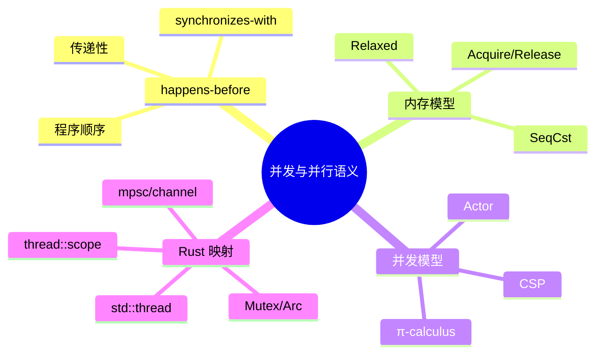

> **本节关键术语**: 并发 · 并行 · happens-before · 内存模型 · Actor · CSP · π-calculus · 数据竞争 — [完整对照表](../../00_meta/01_terminology/01_terminology_glossary.md)

# 并发与并行语义（Concurrent and Parallel Semantics）

**EN**: Concurrent and Parallel Semantics
**Summary**: Formal foundations of shared-memory and message-passing concurrency — happens-before, memory models, and the actor/CSP/π-calculus landscape — with Rust mappings.

> **Rust 版本**: 1.97.0+ (Edition 2024)
> **受众**: [研究者]
> **内容分级**: [专家级]
> **Bloom 层级**: L4-L5
> **权威来源**: 本文件为 `concept/` 权威页：并发与并行形式语义在 Rust 中的唯一深度解释。
> **A/S/P 标记**: **S+A** — Structure + Application
> **定位**: 从 happens-before、内存模型、进程代数三个维度理解 Rust 并发（`std::thread`、atomics、channels、async）的形式边界，并链接到 Actor、CSP、π-calculus 三种经典并发模型。
> **前置概念**: [L3 并发编程](../../03_advanced/00_concurrency/01_concurrency.md) · [L3 异步](../../03_advanced/01_async/01_async.md) · [L1 所有权](../../01_foundation/01_ownership_borrow_lifetime/01_ownership.md)
> **后置概念**: [L4 Actor 模型系统语义](01_actor_model_semantics.md) · [L4 π 演算与 Rust](02_pi_calculus_for_rust.md) · [L4 分布式系统语义](04_distributed_systems_semantics.md)

---

> **来源**:
> [Lamport 1978 — Time, Clocks, and the Ordering of Events in a Distributed System](https://doi.org/10.1145/359545.359563) ·
> [Lamport 1979 — How to Make a Multiprocessor Computer That Correctly Executes Multiprocess Programs](https://doi.org/10.1109/TC.1979.1675439) ·
> [Hoare 1978 — Communicating Sequential Processes](https://doi.org/10.1145/359576.359585) ·
> [Milner 1999 — Communicating and Mobile Systems: The Pi Calculus](https://www.cambridge.org/core/books/communicating-and-mobile-systems-the-pi-calculus/) ·
> [Hewitt, Bishop & Steiger 1973 — A Universal Modular Actor Formalism](https://www.ijcai.org/Proceedings/73/Papers/027B.pdf) ·
> [Jung et al. — RustBelt: Securing the Foundations of Rust](https://plv.mpi-sws.org/rustbelt/popl18/) ·
> [Rust Reference — Memory Model](https://doc.rust-lang.org/reference/memory-model.html)

---

## 一、核心概念

### 1.1 并发 vs 并行

| 概念 | 定义 | Rust 体现 |
|:---|:---|:---|
| **并发（Concurrency）** | 多个任务在重叠时间段内推进 | `async`/await、`mpsc`、mutex |
| **并行（Parallelism）** | 多个任务真正同时执行 | `std::thread::spawn`、`rayon` |

并发关注**结构**（任务如何组织）；并行关注**执行**（任务是否同时运行）。Rust 的所有权与类型系统同时服务于两者。

### 1.2 Happens-Before

Lamport 提出的 **happens-before（→）** 是偏序关系：

- 同一线程中，程序顺序的先前操作 happens-before 后续操作。
- 若 `a → b` 且 `b → c`，则 `a → c`（传递性）。
- 线程间同步（如 mutex unlock → lock、channel send → recv、atomic release → acquire）建立跨线程 happens-before。

Rust 中，数据竞争被定义为：两个非同步访问同一内存位置，且至少一个是写。类型系统通过 `Send`/`Sync`、`MutexGuard`、`&mut` 排除了这些情况。

> **来源**: [Lamport 1978](https://doi.org/10.1145/359545.359563) · [Lamport 1979](https://doi.org/10.1109/TC.1979.1675439) · [Rust Reference — Memory Model](https://doc.rust-lang.org/reference/memory-model.html)

### 1.3 内存模型

Rust 的内存模型与 C++11 类似，围绕原子操作的 **happens-before**、**synchronizes-with** 和 **sequenced-before** 构建：

| 顺序语义 | 保证 | 开销 | Rust API |
|:---|:---|:---:|:---|
| `Relaxed` | 无全局顺序 | 最低 | `Ordering::Relaxed` |
| `Acquire`/`Release` | 建立 synchronizes-with | 中 | `Ordering::Acquire` / `Release` |
| `SeqCst` | 全局一致顺序 | 高 | `Ordering::SeqCst` |

> **来源**: [Rust Reference — Atomics](https://doc.rust-lang.org/reference/items/static-items.html)

---

## 二、经典并发模型对比

| 模型 | 核心原语 | 通信方式 | 代表语言/库 | Rust 映射 |
|:---|:---|:---|:---|:---|
| **Actor** | actor、mailbox、地址 | 异步消息 | Erlang/Elixir, Actix | `actix`, `tokio` actor crates |
| **CSP** | 顺序进程、channel | 同步/异步通道 | Go, Occam | `std::sync::mpsc`, `crossbeam-channel` |
| **π-calculus** | 名字、通道、scope extrusion | 通过通道传递通道 | 理论模型 | `tokio::sync::mpsc` 传递 sender |

### 2.1 Actor 模型

计算单元为 actor：封装状态、通过邮箱异步通信、地址即能力。Rust 的 Actix 框架是该模型的典型实现。

> **来源**: [Hewitt, Bishop & Steiger 1973](https://www.ijcai.org/Proceedings/73/Papers/027B.pdf)

### 2.2 CSP

Hoare 的 Communicating Sequential Processes 强调：

> 通过通信共享内存，而非通过共享内存通信。

Rust 的 `std::sync::mpsc` 和 `crossbeam-channel` 是 CSP 思想的直接体现；`Send` trait 保证消息可跨线程移动，从而在编译期消除 use-after-send。

> **来源**: [Hoare 1978](https://doi.org/10.1145/359576.359585)

### 2.3 π-calculus

Milner 的 π-calculus 扩展了 CSP，允许**通过通道传递通道名**，从而建模动态拓扑。Rust 中可通过在 channel 中发送 `Sender`/`Receiver` 来近似这一能力。

> **来源**: [Milner 1999](https://www.cambridge.org/core/books/communicating-and-mobile-systems-the-pi-calculus/)

---

## 三、Rust 映射

### 3.1 共享内存并发

```rust
use std::sync::{Arc, Mutex};
use std::thread;

fn main() {
    let counter = Arc::new(Mutex::new(0));
    let mut handles = vec![];

    for _ in 0..10 {
        let c = Arc::clone(&counter);
        let handle = thread::spawn(move || {
            let mut num = c.lock().unwrap();
            *num += 1;
        });
        handles.push(handle);
    }

    for h in handles { h.join().unwrap(); }
    assert_eq!(*counter.lock().unwrap(), 10);
}
```

`MutexGuard` 的 drop 触发 unlock，与 acquire 建立 happens-before，保证最终计数正确。

### 3.2 消息传递并发

```rust
use std::sync::mpsc;
use std::thread;

fn main() {
    let (tx, rx) = mpsc::channel();
    thread::spawn(move || {
        tx.send(42).unwrap();
    });
    assert_eq!(rx.recv().unwrap(), 42);
}
```

`send` happens-before `recv`，因此接收到的值对读取线程可见。

### 3.3 Scoped Threads

```rust
fn parallel_sum(data: &[i32]) -> i32 {
    let mut total = 0;
    std::thread::scope(|s| {
        let handle = s.spawn(|| data.iter().sum::<i32>());
        total = handle.join().unwrap();
    });
    total
}
```

`thread::scope` 保证所有子线程在作用域结束时 join，形成明确的 happens-before 边界。

---

## 四、反例与边界

### 反例：数据竞争

```rust,compile_fail,E0133
static mut COUNTER: i32 = 0;

fn main() {
    std::thread::spawn(|| unsafe { COUNTER += 1 });
    std::thread::spawn(|| unsafe { COUNTER += 1 });
}
```

**修正**: 使用 `Arc<Mutex<T>>` 或原子操作；避免 `static mut`。

### 边界：内存模型不保证无锁算法正确性

即使使用 `Relaxed` 排序能编译通过，也可能因缺少 happens-before 而逻辑错误。无锁代码应显式使用 `Acquire`/`Release` 或 `SeqCst`。

---

## 五、定理链

| 编号 | 命题 | 前提 | 结论 |
|:---|:---|:---|:---|
| T-CP-01 | Send 保证线程间移动安全 | `T: Send` | `T` 可安全转移到其他线程 |
| T-CP-02 | Sync 保证共享引用安全 | `T: Sync` | `&T` 可安全跨线程共享 |
| T-CP-03 | Mutex unlock → lock 同步 | 正确实现 | unlock 前的写对 lock 后可见 |
| T-CP-04 | Channel send → recv 同步 | safe Rust | send 前的写对接收线程可见 |
| T-CP-05 | Scope 结束 happens-before 后续 | `thread::scope` | 子线程所有副作用在 scope 返回后可见 |

---

## 六、认知路径

> **认知路径**: happens-before → 内存模型 → Actor/CSP/π-calculus → Rust 线程/通道/异步映射 → 无锁与原子。

建议先掌握 [L3 并发编程](../../03_advanced/00_concurrency/01_concurrency.md) 中的 `Mutex`、`Arc`、`channel`，再读本页理解其形式基础；随后学习 [L4 π 演算](02_pi_calculus_for_rust.md) 与 [L4 Actor 语义](01_actor_model_semantics.md) 的进程代数表达。

---

## 权威来源索引

- Lamport, L. "Time, Clocks, and the Ordering of Events in a Distributed System." *CACM 21(7)*, 1978. [https://doi.org/10.1145/359545.359563](https://doi.org/10.1145/359545.359563)
- Lamport, L. "How to Make a Multiprocessor Computer That Correctly Executes Multiprocess Programs." *IEEE TC 28(9)*, 1979. [https://doi.org/10.1109/TC.1979.1675439](https://doi.org/10.1109/TC.1979.1675439)
- Hoare, C. A. R. "Communicating Sequential Processes." *CACM 21(8)*, 1978. [https://doi.org/10.1145/359576.359585](https://doi.org/10.1145/359576.359585)
- Milner, R. *Communicating and Mobile Systems: The Pi Calculus*. Cambridge University Press, 1999.
- Hewitt, C., Bishop, P. & Steiger, R. "A Universal Modular Actor Formalism for Artificial Intelligence." *IJCAI 1973*. [https://www.ijcai.org/Proceedings/73/Papers/027B.pdf](https://www.ijcai.org/Proceedings/73/Papers/027B.pdf)
- Jung, R. et al. "RustBelt: Securing the Foundations of the Rust Programming Language." *POPL 2018*. [https://plv.mpi-sws.org/rustbelt/popl18/](https://plv.mpi-sws.org/rustbelt/popl18/)
- [Rust Reference — Memory Model](https://doc.rust-lang.org/reference/memory-model.html)

## 🧭 思维导图（Mindmap）



> **文档版本**: 1.0 ｜ **最后更新**: 2026-07-31 ｜ **状态**: ✅ 新建权威页
