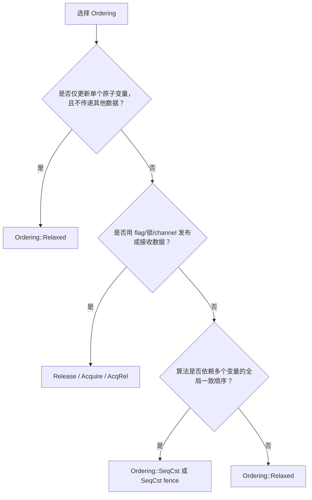
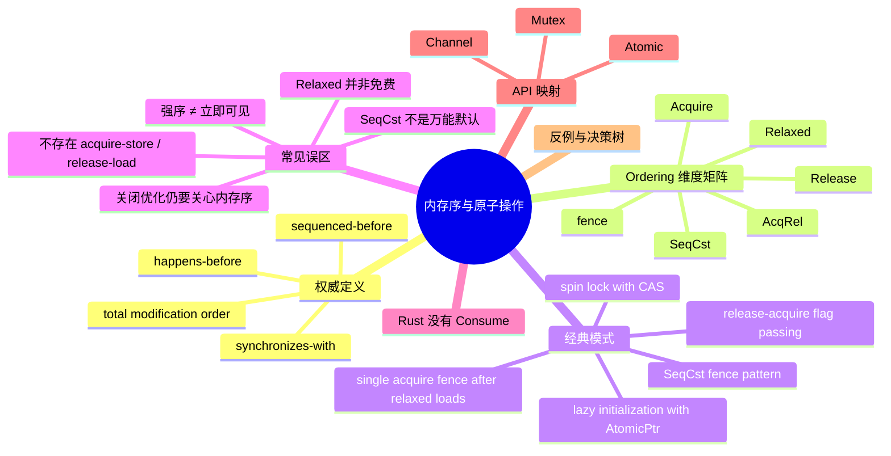

> **本节关键术语**: 内存序 · 原子操作 · happens-before · synchronizes-with · sequenced-before · total modification order · Release-Acquire · SeqCst · fence · consume ordering — [完整对照表](../../00_meta/01_terminology/01_terminology_glossary.md)

# 内存序与原子操作（Memory Ordering and Atomics）

**EN**: Memory Ordering and Atomics
**Summary**: Formal foundations of Rust atomics: happens-before, release-acquire, fences, and the ordering spectrum, with canonical patterns, misconceptions, and mappings to Mutex/Channel/atomic APIs.

> **Rust 版本**: 1.97.0+ (Edition 2024)
> **受众**: [研究者]
> **内容分级**: [专家级]
> **Bloom 层级**: L4–L5
> **权威来源**: 本文件为 `concept/` 权威页：Rust 内存序与原子操作在形式语义层的唯一深度解释；L3 实践速查页 [`03_advanced/00_concurrency/06_atomics_and_memory_ordering.md`](../../03_advanced/00_concurrency/06_atomics_and_memory_ordering.md) 仅保留导航式概览。
> **A/S/P 标记**: **S+A** — Structure + Application
> **双维定位**: S×Ana — 规范分析（内存模型）+ 工程选型
> **前置概念**: [L3 并发编程](../../03_advanced/00_concurrency/01_concurrency.md) · [L3 原子操作与内存序](../../03_advanced/00_concurrency/06_atomics_and_memory_ordering.md) · [L4 并发与并行语义](07_concurrent_and_parallel_semantics.md)
> **后置概念**: [L4 线性化与一致性谱系](../07_concurrency_semantics/02_linearizability_and_consistency.md) · [L4 RustBelt](../02_separation_logic/01_rustbelt.md)

---

> **来源**:
> [Mara Bos, *Rust Atomics and Locks*, "Memory Ordering"](https://mara.nl/atomics/memory-ordering.html) ·
> [Rust Reference — Memory Model](https://doc.rust-lang.org/reference/memory-model.html) ·
> [Rust Reference — Atomics](https://doc.rust-lang.org/reference/items/static-items.html) ·
> [Lamport 1978 — Time, Clocks, and the Ordering of Events in a Distributed System](https://doi.org/10.1145/359545.359563) ·
> [Lamport 1979 — How to Make a Multiprocessor Computer That Correctly Executes Multiprocess Programs](https://doi.org/10.1109/TC.1979.1675439) ·
> [Rust Standard Library — std::sync::atomic](https://doc.rust-lang.org/std/sync/atomic/index.html)

---

## 📑 目录

- [内存序与原子操作（Memory Ordering and Atomics）](#内存序与原子操作memory-ordering-and-atomics)
  - [📑 目录](#-目录)
  - [一、权威定义](#一权威定义)
    - [1.1 happens-before](#11-happens-before)
    - [1.2 synchronizes-with](#12-synchronizes-with)
    - [1.3 sequenced-before](#13-sequenced-before)
    - [1.4 total modification order](#14-total-modification-order)
  - [二、Ordering 维度矩阵](#二ordering-维度矩阵)
  - [三、经典模式代码示例](#三经典模式代码示例)
    - [3.1 release-acquire flag passing](#31-release-acquire-flag-passing)
    - [3.2 lazy initialization with AtomicPtr](#32-lazy-initialization-with-atomicptr)
    - [3.3 spin lock with compare\_exchange](#33-spin-lock-with-compare_exchange)
    - [3.4 SeqCst fence pattern](#34-seqcst-fence-pattern)
    - [3.5 single acquire fence after multiple relaxed loads](#35-single-acquire-fence-after-multiple-relaxed-loads)
  - [四、常见误区（Mara Bos 的 Myths）](#四常见误区mara-bos-的-myths)
    - [Myth 1：强内存序能让变更“立即”可见](#myth-1强内存序能让变更立即可见)
    - [Myth 2：关闭优化就不需要关心内存序](#myth-2关闭优化就不需要关心内存序)
    - [Myth 3：`Relaxed` 操作是“免费”的](#myth-3relaxed-操作是免费的)
    - [Myth 4：`SeqCst` 是永远正确的默认选项](#myth-4seqcst-是永远正确的默认选项)
    - [Myth 5：`SeqCst` 能构造“acquire-store”或“release-load”](#myth-5seqcst-能构造acquire-store或release-load)
  - [五、为什么 Rust 没有 Ordering::Consume](#五为什么-rust-没有-orderingconsume)
    - [5.1 编译器难以保持依赖链](#51-编译器难以保持依赖链)
    - [5.2 当前实现全部升级为 acquire](#52-当前实现全部升级为-acquire)
  - [六、与 Rust Mutex / Channel / atomic 的映射](#六与-rust-mutex--channel--atomic-的映射)
  - [七、反例与决策树](#七反例与决策树)
    - [7.1 反例：用 Relaxed 传递数据](#71-反例用-relaxed-传递数据)
    - [7.2 反例：用原子操作保护复合状态](#72-反例用原子操作保护复合状态)
    - [7.3 决策树](#73-决策树)
    - [7.4 选型表](#74-选型表)
  - [八、定理链](#八定理链)
  - [权威来源索引](#权威来源索引)
  - [🧭 思维导图（Mindmap）](#-思维导图mindmap)

---

## 一、权威定义

Rust 的内存模型与 C++20 内存模型同源，核心关系用四个概念刻画：

### 1.1 happens-before

**happens-before（→）** 是操作之间的偏序关系（Lamport 1978）。

- 同一线程内，按程序顺序靠前的操作 happens-before 靠后的操作（由 `sequenced-before` 导出）。
- 若 `A → B` 且 `B → C`，则 `A → C`（传递性）。
- 线程间同步（release-acquire、mutex unlock-lock、channel send-recv、spawn/join）建立跨线程 happens-before。

> 直观：若 `A → B`，则 `A` 的副作用对 `B` **可见**。

```text
线程 A:  data.store(42, Relaxed);        // A
         ready.store(true, Release);     // B
线程 B:  while !ready.load(Acquire) {}   // C
         assert_eq!(data.load(Relaxed), 42); // D

B → C 通过 release-acquire 建立；
A → B 同线程程序序；
传递性 ⟹ A → D，因此 D 必定看到 42。
```

### 1.2 synchronizes-with

**synchronizes-with** 是 happens-before 中专门描述**同步原语**的跨线程边：

- `Release` store（或 release fence 后的 store）被 `Acquire` load（或 acquire fence 前的 load）观察到。
- mutex 的 unlock 被另一个线程的 lock 观察到。
- channel 的 send 被对应的 recv 观察到。
- thread spawn 之前的操作 happens-before 新线程的所有操作；被 join 线程的所有操作 happens-before join 之后的操作。

> **synchronizes-with** 是 happens-before 的子集；它是程序员在原子/锁/通道上能直接操作的“桥”。

### 1.3 sequenced-before

**sequenced-before** 是单线程内的求值顺序关系：若表达式 `E1` 的求值在表达式 `E2` 之前按程序顺序发生，则 `E1` sequenced-before `E2`。

- 它是 happens-before 在同一线程中的基础。
- 编译器和 CPU 在单线程内不能破坏 sequenced-before 的可见行为；但在多线程共享可变状态时，可能重排跨线程可见的副作用——这正是内存序要约束的。

### 1.4 total modification order

**total modification order（全修改序）** 是针对**单个原子变量**的全序：

- 无论使用哪种 `Ordering`，对同一原子变量的所有修改在所有线程看来顺序一致。
- `Relaxed` 不保证跨变量顺序，但保证单个变量的全修改序。

```text
线程 A: X.fetch_add(5, Relaxed);
线程 B: X.fetch_add(10, Relaxed);

所有线程观察到的 X 的修改序只可能是 0→5→15 或 0→10→15；
不会同时出现 "看到 10 后又看到 5" 的现象。
```

> **来源**: [Mara Bos — Rust Atomics and Locks, "Relaxed Ordering"](https://mara.nl/atomics/memory-ordering.html) · [Rust Reference — Memory Model](https://doc.rust-lang.org/reference/memory-model.html)

---

## 二、Ordering 维度矩阵

| Ordering | 保证 | 典型开销 | 典型用例 |
|:---|:---|:---:|:---|
| `Relaxed` | 仅原子性 + 单变量全修改序 | 最低（通常与普通读写同指令） | 独立计数器、性能统计、自增 ID |
| `Acquire` | 加载侧：之后读写不能重排到该 load 之前 | 中（通常一条 load-acquire 或 barrier） | 读 flag / 锁状态 / 接收数据 |
| `Release` | 存储侧：之前读写不能重排到该 store 之后 | 中 | 写 flag / 解锁 / 发布数据 |
| `AcqRel` | 读-修改-写同时含 Acquire + Release | 中 | CAS、fetch_add 等 RMW 操作 |
| `SeqCst` | Acquire+Release + 所有 SeqCst 操作的全局一致顺序 | 高（可能全指令屏障） | 多变量全局顺序敏感、Dekker 类互斥 |
| `fence` | 将内存序与原子操作解耦：release fence 后任意 store、acquire fence 前任意 load 可构成同步 | 视场景可能多一条指令 | 多个变量批量同步、条件式同步 |

> **选型总原则**：先证明 `Release`/`Acquire` 足够；仅在算法**明确依赖全局总序**时才用 `SeqCst`；不确定时先用 `SeqCst`，再通过性能分析降级并给出形式化论证。

> **来源**: [Mara Bos — Rust Atomics and Locks, "Memory Ordering"](https://mara.nl/atomics/memory-ordering.html)

---

## 三、经典模式代码示例

以下示例仅使用标准库原子类型，可在 host target 直接编译。

### 3.1 release-acquire flag passing

```rust
use std::sync::atomic::{AtomicBool, AtomicU64, Ordering};
use std::thread;

static DATA: AtomicU64 = AtomicU64::new(0);
static READY: AtomicBool = AtomicBool::new(false);

fn main() {
    thread::spawn(|| {
        DATA.store(42, Ordering::Relaxed);
        READY.store(true, Ordering::Release); // 此前的写对 Acquire 侧可见
    });

    while !READY.load(Ordering::Acquire) {
        std::hint::spin_loop();
    }

    assert_eq!(DATA.load(Ordering::Relaxed), 42);
}
```

`READY.store(true, Release)` 与 `READY.load(Acquire)` 构成 synchronizes-with，从而 `DATA.store(42)` happens-before 最后的 `DATA.load`。

### 3.2 lazy initialization with AtomicPtr

```rust
use std::sync::atomic::{AtomicPtr, Ordering};
use std::ptr;

static PTR: AtomicPtr<String> = AtomicPtr::new(ptr::null_mut());

fn get_string() -> &'static String {
    let mut p = PTR.load(Ordering::Acquire);
    if !p.is_null() {
        return unsafe { &*p };
    }

    let new = Box::into_raw(Box::new(String::from("hello")));
    match PTR.compare_exchange(
        ptr::null_mut(),
        new,
        Ordering::Release, // 发布指针时保证初始化已完成
        Ordering::Acquire, // 失败时读取已发布指针仍需 Acquire
    ) {
        Ok(_) => unsafe { &*new },
        Err(existing) => {
            // 输掉初始化竞赛：释放自己的分配，使用胜者指针
            unsafe { drop(Box::from_raw(new)) };
            unsafe { &*existing }
        }
    }
}

fn main() {
    assert_eq!(get_string(), "hello");
}
```

`Release` 成功路径保证 `Box::new(...)` 的初始化 happens-before 指针被任何线程读取；`Acquire` 保证读取侧看到完整初始化后的 `String`。

### 3.3 spin lock with compare_exchange

```rust
use std::cell::UnsafeCell;
use std::hint::spin_loop;
use std::ops::{Deref, DerefMut};
use std::sync::atomic::{AtomicBool, Ordering};

pub struct SpinLock<T> {
    locked: AtomicBool,
    data: UnsafeCell<T>,
}

unsafe impl<T: Send> Sync for SpinLock<T> {}

pub struct Guard<'a, T> {
    lock: &'a SpinLock<T>,
}

impl<T> Deref for Guard<'_, T> {
    type Target = T;
    fn deref(&self) -> &T {
        unsafe { &*self.lock.data.get() }
    }
}

impl<T> DerefMut for Guard<'_, T> {
    fn deref_mut(&mut self) -> &mut T {
        unsafe { &mut *self.lock.data.get() }
    }
}

impl<T> Drop for Guard<'_, T> {
    fn drop(&mut self) {
        self.lock.locked.store(false, Ordering::Release);
    }
}

impl<T> SpinLock<T> {
    pub const fn new(value: T) -> Self {
        Self {
            locked: AtomicBool::new(false),
            data: UnsafeCell::new(value),
        }
    }

    pub fn lock(&self) -> Guard<'_, T> {
        while self
            .locked
            .compare_exchange_weak(false, true, Ordering::Acquire, Ordering::Relaxed)
            .is_err()
        {
            spin_loop();
        }
        Guard { lock: self }
    }
}

fn main() {
    let lock = SpinLock::new(0);
    {
        let mut g = lock.lock();
        *g += 1;
    }
    assert_eq!(*lock.lock(), 1);
}
```

`compare_exchange_weak(..., Acquire, Relaxed)` 加锁路径使用 `Acquire`，`unlock` 使用 `Release`，因此解锁前临界区内的写 happens-before 后续加锁后的读。

### 3.4 SeqCst fence pattern

`SeqCst` 的典型用途是：确保一个 store 全局可见后，再进行条件 load。用 `SeqCst` fence 替代 `SeqCst` load/store 通常更高效。

```rust
use std::sync::atomic::{AtomicBool, AtomicU64, Ordering, fence};
use std::thread;

static A: AtomicBool = AtomicBool::new(false);
static B: AtomicBool = AtomicBool::new(false);
static COUNTER: AtomicU64 = AtomicU64::new(0);

fn main() {
    let t1 = thread::spawn(|| {
        A.store(true, Ordering::Relaxed);
        fence(Ordering::SeqCst);          // 保证 A 的 store 全局可见
        if !B.load(Ordering::Relaxed) {
            COUNTER.fetch_add(1, Ordering::Relaxed);
        }
    });

    let t2 = thread::spawn(|| {
        B.store(true, Ordering::Relaxed);
        fence(Ordering::SeqCst);          // 保证 B 的 store 全局可见
        if !A.load(Ordering::Relaxed) {
            COUNTER.fetch_add(1, Ordering::Relaxed);
        }
    });

    t1.join().unwrap();
    t2.join().unwrap();

    // 两个线程不可能都进入 fetch_add：全局总序下至少有一方会看到对方的 flag
    assert!(COUNTER.load(Ordering::Relaxed) <= 1);
}
```

### 3.5 single acquire fence after multiple relaxed loads

```rust
use std::sync::atomic::{AtomicBool, AtomicU64, Ordering, fence};
use std::thread;
use std::time::Duration;

const N: usize = 10;
static DATA: [AtomicU64; N] = [const { AtomicU64::new(0) }; N];
static READY: [AtomicBool; N] = [const { AtomicBool::new(false) }; N];

fn main() {
    for i in 0..N {
        thread::spawn(move || {
            DATA[i].store(i as u64 * 10, Ordering::Relaxed);
            READY[i].store(true, Ordering::Release);
        });
    }

    thread::sleep(Duration::from_millis(100));

    // 用 Relaxed 批量读取所有 flag
    let ready: [bool; N] = std::array::from_fn(|i| READY[i].load(Ordering::Relaxed));

    if ready.contains(&true) {
        fence(Ordering::Acquire); // 一次 fence 同步所有已观察到的 Release store
        for i in 0..N {
            if ready[i] {
                println!("data{i} = {}", DATA[i].load(Ordering::Relaxed));
            }
        }
    }
}
```

> 要点：`Acquire` fence 可以替代 10 次 `Acquire` load，因为只要任意一个 `Relaxed` load 观察到了对应的 `Release` store，整条 release-acquire 同步边就成立。

---

## 四、常见误区（Mara Bos 的 Myths）

以下误区均来自 [*Rust Atomics and Locks* 的 "Common Misconceptions"](https://mara.nl/atomics/memory-ordering.html)，每个都给出正解与 Rust 反例。

### Myth 1：强内存序能让变更“立即”可见

**正解**：内存模型只定义**顺序**，不定义**时延**。`Relaxed` store 通常也会很快传播；`SeqCst` 并不让数据“跑得更快”，反而可能因屏障降低吞吐。

```rust
use std::sync::atomic::{AtomicU64, Ordering};
use std::thread;

static X: AtomicU64 = AtomicU64::new(0);

fn main() {
    thread::spawn(|| {
        X.store(1, Ordering::Relaxed);
    });
    // 即使 Relaxed，最终也会看到 1；但不能确定何时看到。
    while X.load(Ordering::Relaxed) == 0 {}
}
```

### Myth 2：关闭优化就不需要关心内存序

**正解**：重排序来自**编译器**和**处理器**两方。即使 `opt-level = 0`，编译器仍可能做必要变换，且多核 CPU 的乱序执行、store buffer、缓存一致性协议不受优化级别控制。

### Myth 3：`Relaxed` 操作是“免费”的

**正解**：`Relaxed` 的**单条指令**开销与普通读写相同，但多线程共享同一 cache line 会导致缓存同步开销。下列“免费”论断忽略了 false sharing 和缓存一致性流量。

```rust
use std::sync::atomic::AtomicU64;

// 两个原子位于同一缓存行会导致伪共享
static A: AtomicU64 = AtomicU64::new(0);
static B: AtomicU64 = AtomicU64::new(0);
// 生产代码应使用 #[repr(align(64))] 或 CachePadded 隔离缓存行
```

### Myth 4：`SeqCst` 是永远正确的默认选项

**正解**：若算法本身错误，`SeqCst` 也救不了。过度使用 `SeqCst` 还会向读者暗示“本操作依赖程序中所有 SeqCst 操作的全局总序”，增加审查负担。

```rust,ignore
// 错误：用 SeqCst 也修不好的 check-then-act
use std::sync::atomic::{AtomicU64, Ordering};

static X: AtomicU64 = AtomicU64::new(0);

// 两个线程都读取、判断、再写入——SeqCst 不能阻止 race
fn broken_increment() {
    let v = X.load(Ordering::SeqCst);
    // 此处可能其他线程已修改 X
    X.store(v + 1, Ordering::SeqCst); // 仍可能丢失更新
}
```

正确做法是 `fetch_add(1, Ordering::Relaxed)` 或使用锁。

### Myth 5：`SeqCst` 能构造“acquire-store”或“release-load”

**正解**：`Release` 只对 store 有意义，`Acquire` 只对 load 有意义。`SeqCst` 可以替代 Acquire 或 Release，但不能发明新的组合。

```rust,compile_fail
use std::sync::atomic::{AtomicBool, Ordering};

fn illegal_store() {
    let b = AtomicBool::new(false);
    // 编译错误：store 不接受 Acquire
    b.store(true, Ordering::Acquire);
}
```

```rust,compile_fail
use std::sync::atomic::{AtomicBool, Ordering};

fn illegal_load() {
    let b = AtomicBool::new(false);
    // 编译错误：load 不接受 Release
    let _ = b.load(Ordering::Release);
}
```

---

## 五、为什么 Rust 没有 Ordering::Consume

C++ 提供 `memory_order_consume`：一种只把同步效果传播到**依赖该加载值**的表达式的弱化 acquire。在硬件上，consume 通常与 relaxed 同指令，理论上“免费”。但 Rust（以及 C++20）没有暴露它，原因有两个。

### 5.1 编译器难以保持依赖链

编译器优化会不经意间消灭依赖：

```rust,ignore
// 假设 x 是 consume-load 得到的索引
let y = array[x];
let z = array[x];
// 优化器可能把两次 load 合并为一次，依赖关系被重写
```

更微妙的例子：`x + 2 - x` 可被优化为 `2`，从而完全消除对 `x` 的依赖；控制流、函数调用、常量传播都会让“哪些表达式依赖该值”变得不可判定。

### 5.2 当前实现全部升级为 acquire

由于无法可靠保持依赖，LLVM 等编译器将 consume ordering **直接提升为 acquire**。C++20 标准也明确建议不要使用 consume。Rust 的标准化策略是：**在上游有可行实现之前不暴露 `Ordering::Consume`**，避免给程序员一个实际上只是 acquire 的“假优化”选项。

> **结论**：需要用 consume 的场景，在 Rust 中统一使用 `Ordering::Acquire`。

> **来源**: [Mara Bos — Rust Atomics and Locks, "Consume Ordering"](https://mara.nl/atomics/memory-ordering.html)

---

## 六、与 Rust Mutex / Channel / atomic 的映射

| Rust API | 内部 Ordering / 同步语义 | 说明 |
|:---|:---|:---|
| `Mutex::lock` / `MutexGuard::drop` | lock 使用 `Acquire`，unlock 使用 `Release` | unlock → lock 建立 happens-before，保证临界区内写对后续加锁可见 |
| `RwLock` | 读/写加锁至少 `Acquire`，释放至少 `Release` | 具体实现依赖 OS/平台，但语义等价 |
| `mpsc::Sender::send` / `Receiver::recv` | send Release → recv Acquire | 消息传递本身即 synchronizes-with |
| `Barrier::wait` | 通常含 `SeqCst` fence 或等效 acquire-release | 保证所有线程在屏障前的写对屏障后可见 |
| `Atomic*` 操作 | 由调用者显式指定 | 无默认 Ordering；Rust 强制显式选择 |

> **工程映射**：
>
> - 能用 `Mutex` 表达的状态，优先用 `Mutex`；它内部已经帮你选对了 ordering。
> - 只有当状态是单个原语值且性能路径被证实时，才降级到 `Atomic*` 并显式论证 ordering。
> - `Channel` 的 send-recv happens-before 是最安全的默认同步模型；`Mutex` 的 unlock-lock 次之。

---

## 七、反例与决策树

### 7.1 反例：用 Relaxed 传递数据

```rust,ignore
use std::sync::atomic::{AtomicBool, AtomicU64, Ordering};
use std::thread;

static DATA: AtomicU64 = AtomicU64::new(0);
static READY: AtomicBool = AtomicBool::new(false);

fn main() {
    thread::spawn(|| {
        DATA.store(42, Ordering::Relaxed);
        READY.store(true, Ordering::Relaxed); // ❌ 没有 Release
    });

    while !READY.load(Ordering::Relaxed) {} // ❌ 没有 Acquire
    // 可能读到 DATA = 0！
    println!("{}", DATA.load(Ordering::Relaxed));
}
```

**修正**：`READY.store(true, Release)` + `READY.load(Acquire)`。

### 7.2 反例：用原子操作保护复合状态

```rust,ignore
use std::sync::atomic::{AtomicBool, Ordering};
use std::thread;

static LOCKED: AtomicBool = AtomicBool::new(false);
static mut LIST: Vec<i32> = Vec::new(); // ❌ 静态 mut

fn push(v: i32) {
    if LOCKED.compare_exchange(false, true, Ordering::Acquire, Ordering::Relaxed).is_ok() {
        unsafe { LIST.push(v); } // 仅 LOCKED 同步不够：push 内部可能重排
        LOCKED.store(false, Ordering::Release);
    }
}
```

**修正**：使用 `Mutex<Vec<i32>>` 或正确实现 spin lock（如 §3.3）。

### 7.3 决策树



### 7.4 选型表

| 场景 | 推荐 Ordering | 反例/失效条件 |
|:---|:---|:---|
| 独立计数器 | `Relaxed` | 用计数器值推断其他变量状态 ⟹ 需 Acquire/Release |
| flag + 数据传递 | `Release` 写 flag，`Acquire` 读 flag | 双方都用 `Relaxed` ⟹ 数据可见性无保证 |
| CAS 循环（RMW） | `AcqRel` | 纯读或纯写可降级为 Acquire/Release |
| 多线程同时设置并检查多个 flag | `SeqCst` 或 `SeqCst` fence | 仅用 Acquire/Release 可能出现双方同时进入 |
| 批量读取多个 release-store 的 flag | `Relaxed` load + `Acquire` fence | fence 放在数据读取之前，且必须观察到 release store |

---

## 八、定理链

| 编号 | 命题 | 前提 | 结论 |
|:---|:---|:---|:---|
| T-MO-01 | happens-before 传递性 | `A → B` 且 `B → C` | `A → C` |
| T-MO-02 | release-acquire 同步 | `Release` store 被 `Acquire` load 观察到 | store 前的写 happens-before load 后的读 |
| T-MO-03 | 单变量全修改序 | 对同一原子变量的任意修改 | 所有线程观察到的修改顺序一致 |
| T-MO-04 | mutex unlock-lock 同步 | 正确使用 | 解锁前的写 happens-before 加锁后的读 |
| T-MO-05 | channel send-recv 同步 | 正确使用 | send 前的写 happens-before recv 后的读 |
| T-MO-06 | SeqCst 全局总序 | 程序中所有 `SeqCst` 操作 | 存在一个所有线程一致的全序，且与单变量修改序一致 |
| T-MO-07 | fence 替代性 | release fence 后任意 store 被 acquire fence 前任意 load 观察到 | release fence → acquire fence 构成 synchronizes-with |

---

## 权威来源索引

- Bos, M. *Rust Atomics and Locks*. §3 “Memory Ordering.” [https://mara.nl/atomics/memory-ordering.html](https://mara.nl/atomics/memory-ordering.html)
- Lamport, L. “Time, Clocks, and the Ordering of Events in a Distributed System.” *CACM 21(7)*, 1978. [https://doi.org/10.1145/359545.359563](https://doi.org/10.1145/359545.359563)
- Lamport, L. “How to Make a Multiprocessor Computer That Correctly Executes Multiprocess Programs.” *IEEE TC 28(9)*, 1979. [https://doi.org/10.1109/TC.1979.1675439](https://doi.org/10.1109/TC.1979.1675439)
- Batty, M., Owens, S., Sarkar, S., Sewell, P. & Weber, T. “Mathematizing C++ Concurrency.” *POPL 2011*. [https://dl.acm.org/doi/10.1145/1926385.1926394](https://dl.acm.org/doi/10.1145/1926385.1926394)
- Owens, S., Sarkar, S. & Sewell, P. “A Better x86 Memory Model: x86-TSO.” *TPHOLs 2009*. [https://link.springer.com/chapter/10.1007/978-3-642-03359-9_27](https://link.springer.com/chapter/10.1007/978-3-642-03359-9_27)
- [Rust Reference — Memory Model](https://doc.rust-lang.org/reference/memory-model.html)
- [Rust Reference — Atomics](https://doc.rust-lang.org/reference/items/static-items.html)
- [std::sync::atomic — Rust Standard Library](https://doc.rust-lang.org/std/sync/atomic/index.html)

> **相关文件**: [L3 原子操作与内存序](../../03_advanced/00_concurrency/06_atomics_and_memory_ordering.md) · [L4 并发与并行语义](07_concurrent_and_parallel_semantics.md) · [L4 线性化与一致性谱系](../07_concurrency_semantics/02_linearizability_and_consistency.md)
>
> **文档版本**: 1.0 ｜ **最后更新**: 2026-07-31 ｜ **状态**: ✅ 新建权威页

## 🧭 思维导图（Mindmap）



> **认知功能**: 本 mindmap 从“定义 → 选型 → 模式 → 误区 → 实现映射 → 决策”六个维度组织，可作为判断 `Ordering` 是否正确的快速检查清单。

## 国际化权威来源补充（International Authority Sources）

- https://dl.acm.org/doi/10.1145/3158154
- https://dl.acm.org/doi/10.1145/3371106
- https://doc.rust-lang.org/reference/introduction.html

## 国际化权威来源补充（International Authority Sources）

- https://arxiv.org/abs/1804.07608
- https://rust-unofficial.github.io/patterns/
- https://blog.rust-lang.org/
