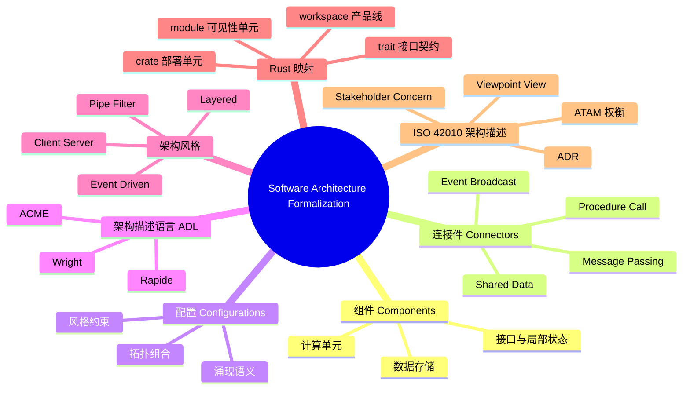

> **内容分级**: [专家级]
>
# 软件架构形式化（Software Architecture Formalization）

> **EN**: Software Architecture Formalization
> **Summary**: Formal models of software architecture — components, connectors, configurations, architectural styles, and ADLs — with a bridge to Rust's module and crate system.

> **Rust 版本**: 1.97.0+ (Edition 2024)
> **Bloom 层级**: L4-L5
> **权威来源**: 本文件为 `concept/` 权威页。
> **定位**: 从形式化视角建立软件架构的组件-连接件-配置三元模型，介绍架构描述语言（ADL）、架构风格与连接件语义，并映射到 Rust 的 crate/module/trait/workspace 机制。
> **前置概念**: [Async/Await](../../03_advanced/01_async/01_async.md) · [Architecture Patterns](../../06_ecosystem/03_design_patterns/08_architecture_patterns.md) · [Pattern Composition Algebra](../00_type_theory/12_pattern_composition_algebra.md) · [System Composability](../../06_ecosystem/03_design_patterns/04_system_composability.md)
> **后置概念**: [Architecture Pattern Semantics](02_architecture_pattern_semantics.md) · [Architecture Refinement](03_architecture_refinement.md) · [Rust Architecture Constraints](04_rust_architecture_constraints.md) · [Component-Based Semantics](../09_system_semantics/03_component_based_semantics.md)

---

> **来源**: [Rust Reference — Traits](https://doc.rust-lang.org/reference/items/traits.html) · [Rust Reference — Modules](https://doc.rust-lang.org/reference/items/modules.html) · [Rust Reference — Items and Visibility](https://doc.rust-lang.org/reference/visibility-and-privacy.html) · [Rust Reference — Orphan Rules](https://doc.rust-lang.org/reference/items/traits.html#orphan-rules) · [Shaw & Garlan — Software Architecture (1996)](https://www.cs.cmu.edu/~search/articles/books/SA.book.pdf)

> **权威来源 / Provenance**: 本节软件架构形式化模型与 ISO/IEC/IEEE 42010:2022 架构描述框架对齐；组件-连接件-配置三元组与架构描述语言（ADL）讨论参考 Shaw & Garlan (1996)、Medvidovic & Taylor (2000) 与 Wermelinger (1994)；ACME、Wright、Rapide 等经典 ADL 参考其原始论文；Rust 映射部分参考 Rust Reference 的 Modules、Traits、Items and Visibility 与 Orphan Rules。
>
> - **ISO/IEC/IEEE 42010:2022** — *Software and Systems Engineering — Architecture Description*. ISO, 2022. [https://www.iso.org/standard/74296.html](https://www.iso.org/standard/74296.html)
> - **Shaw & Garlan (1996)** — *Software Architecture: Perspectives on an Emerging Discipline*. Prentice Hall. [PDF](https://www.cs.cmu.edu/~search/articles/books/SA.book.pdf)
> - **Garlan & Shaw (1993)** — *An Introduction to Software Architecture*. In *Advances in Software Engineering and Knowledge Engineering* (Vol. 1). World Scientific. [https://doi.org/10.1142/9789812813032_0001](https://doi.org/10.1142/9789812813032_0001)
> - **Medvidovic & Taylor (2000)** — *A Classification and Comparison Framework for Software Architecture Description Languages*. IEEE Transactions on Software Engineering, 26(1), 70–93. [https://doi.org/10.1109/32.825767](https://doi.org/10.1109/32.825767)
> - **Wermelinger (1994)** — *Formal Specification of Software Architecture*. Science of Computer Programming, 23(2–3), 149–178. [https://doi.org/10.1016/0167-6423(94)00022-5](https://doi.org/10.1016/0167-6423(94)00022-5)
> - **Garlan, Monroe & Wile (1997)** — *ACME: An Architecture Description Interchange Language*. In *Proceedings of CASCON'97*, 169–183.
> - **Allen (1997)** — *A Formal Approach to Software Architecture*. Ph.D. thesis, Carnegie Mellon University. (Wright ADL based on CSP.)
> - **Luckham et al. (1995)** — *Specification and Analysis of System Architecture Using Rapide*. IEEE Transactions on Software Engineering, 21(4), 336–355. [https://doi.org/10.1109/32.385970](https://doi.org/10.1109/32.385970)

---

ISO/IEC/IEEE 42010 视点与 Rust crate 结构映射：

```text
| 视点 (Viewpoint) | 关注点 (Concern)          | Rust 工程视图 / 制品                     |
|------------------|---------------------------|------------------------------------------|
| Module View      | 编译期耦合、信息隐藏      | cargo modules 模块依赖图                 |
| API Contract     | 稳定性、版本化            | 核心 crate 中定义的 pub trait            |
| Dependency Audit | 供应链风险、可审计性      | cargo tree 输出 + Cargo.lock             |
| Runtime View     | 性能、弹性、资源使用      | tokio runtime 拓扑、CPU/内存指标         |
```

> 说明：上述映射说明 42010 的“视点-视图”概念可直接用于组织 Rust 项目的架构描述；不同利益相关方（安全、性能、运维）通过各自视点审查代码制品。

---

## 📑 目录

- [软件架构形式化（Software Architecture Formalization）](#软件架构形式化software-architecture-formalization)
  - [📑 目录](#-目录)
  - [一、核心概念](#一核心概念)
    - [1.1 软件架构三元组](#11-软件架构三元组)
    - [1.2 架构描述语言 ADL](#12-架构描述语言-adl)
    - [1.3 架构风格](#13-架构风格)
    - [1.4 连接件语义](#14-连接件语义)
    - [1.5 ISO/IEC/IEEE 42010 架构描述概念模型](#15-isoiecieee-42010-架构描述概念模型)
      - [核心概念](#核心概念)
      - [1.5.1 视图-视点-利益相关者-关注四元关系](#151-视图-视点-利益相关者-关注四元关系)
      - [1.5.2 架构决策记录（ADR）模板](#152-架构决策记录adr模板)
      - [1.5.3 架构权衡分析方法（ATAM）四阶段](#153-架构权衡分析方法atam四阶段)
      - [Rust 工程映射](#rust-工程映射)
    - [1.6 质量属性与架构战术](#16-质量属性与架构战术)
      - [架构战术分类](#架构战术分类)
      - [ATAM 与 Rust 工程](#atam-与-rust-工程)
    - [1.7 风格的语法与状态机形式化](#17-风格的语法与状态机形式化)
      - [语法视角](#语法视角)
      - [状态机视角](#状态机视角)
    - [1.6 到 Rust 的映射](#16-到-rust-的映射)
  - [二、反命题与边界](#二反命题与边界)
    - [反命题：相同组件在不同配置中具有相同语义](#反命题相同组件在不同配置中具有相同语义)
    - [边界：ADL 与实现语言的鸿沟](#边界adl-与实现语言的鸿沟)
    - [编译期反例：层间绕过触发 `E0433`](#编译期反例层间绕过触发-e0433)
  - [三、相关概念](#三相关概念)
  - [四、嵌入式测验（Embedded Quiz）](#四嵌入式测验embedded-quiz)
    - [测验 1：软件架构三元组包含哪三个要素？（记忆层）](#测验-1软件架构三元组包含哪三个要素记忆层)
    - [测验 2：ADL 与普通建模语言（如 UML）的关键区别是什么？（理解层）](#测验-2adl-与普通建模语言如-uml的关键区别是什么理解层)
    - [测验 3：为什么说“相同组件在不同配置中具有相同语义”是错误的？（分析层）](#测验-3为什么说相同组件在不同配置中具有相同语义是错误的分析层)
    - [测验 4：Rust 的哪些机制对应架构形式化中的“连接件”？（应用层）](#测验-4rust-的哪些机制对应架构形式化中的连接件应用层)
    - [测验 5：架构风格为什么能导出可推断性质？（分析层）](#测验-5架构风格为什么能导出可推断性质分析层)
  - [五、权威来源索引](#五权威来源索引)
  - [六、🧭 思维导图（Mindmap）](#六-思维导图mindmap)

---

## 一、核心概念

### 1.1 软件架构三元组

Shaw & Garlan 将软件架构定义为**组件（Components）、连接件（Connectors）、配置（Configurations）**的三元组：

- **组件**：计算或数据存储单元，拥有接口与局部状态。
- **连接件**：组件之间的交互机制，封装通信协议与控制规则。
- **配置**：组件与连接件的拓扑组合，即“谁与谁以何种方式连接”。

形式化地，一个架构可记为：

```text
A = (C, K, Γ)
  C = {c₁, c₂, ..., cₙ}      组件集合
  K = {k₁, k₂, ..., kₘ}      连接件集合
  Γ: C × K × C → {0, 1}      连接关系（邻接/参与）
```

> **来源**: [Shaw & Garlan — Software Architecture: Perspectives on an Emerging Discipline (1996)](https://www.cs.cmu.edu/~search/articles/books/SA.book.pdf) · [Garlan & Shaw — An Introduction to Software Architecture (1993)](https://www.cs.cmu.edu/~able/introduction_to_software_architecture.htm)

---

### 1.2 架构描述语言 ADL

ADL 是专门用于描述软件架构的形式化语言。Medvidovic & Taylor 在 2000 年的综述中指出，一种语言要成为 ADL，必须至少显式支持：

| 要素 | 含义 | 示例符号 |
|---|---|---|
| 组件 | 计算/数据单元及其端口 | `component Compute { ports { in P; out Q } }` |
| 连接件 | 交互规则与协议 | `connector Pipe { roles { source; sink } }` |
| 配置/拓扑 | 组件与连接件的绑定 | `attachment Compute.Q to Pipe.source` |
| 约束 | 对结构或行为的限制 | `constraint: no_cycle(K)` |

经典 ADL：

- **ACME**：支持架构风格、产品族与约束的通用交换格式。
- **Wright**：基于 CSP，可对联接协议进行死锁与一致性分析。
- **Rapide**：支持partial-order事件仿真与架构约束验证。

> **来源**: [Medvidovic & Taylor — A Classification and Comparison Framework for Software Architecture Description Languages (2000)](https://ieeexplore.ieee.org/document/845372)

---

### 1.3 架构风格

**架构风格 = 对组件类型、连接件类型、拓扑与交互约束的族化规定**。同一风格下的系统在结构上共享不变量，但在具体功能上可完全不同。

常见风格及其核心约束：

| 风格 | 拓扑约束 | 交互约束 |
|---|---|---|
| **Pipe-Filter** | 线性/有向无环图 | 数据单向流动，过滤器无共享状态 |
| **Client-Server** | 星型/多层 | 请求-响应，服务器被动监听 |
| **Layered** | 严格层次 | 只依赖相邻下层，禁止跨层 |
| **Event-Driven** | 发布-订阅拓扑 | 生产者与消费者解耦，事件广播 |

风格的价值在于**约束产生可推断性质**：Pipe-Filter 天然支持并行；Layered 的修改局部性可由依赖方向保证。

> **来源**: [Shaw & Garlan — Software Architecture (1996)](https://www.cs.cmu.edu/~search/articles/books/SA.book.pdf)

---

### 1.4 连接件语义

连接件不是简单的“调用线”，它本身具有语义。常见的四类连接件：

| 连接件类型 | 语义特征 | Rust 对应 |
|---|---|---|
| **Procedure Call** | 同步、请求-响应、调用栈传递 | 普通函数调用、`trait` 方法 |
| **Event Broadcast** | 异步、多播、发布-订阅 | `tokio::sync::broadcast`、`event-listener` |
| **Shared Data** | 并发读写、需一致性协议 | `Arc<Mutex<T>>`、`RwLock`、`dashmap` |
| **Message Passing** | 异步、队列、无共享状态 | `tokio::sync::mpsc`、`std::sync::mpsc` |

形式化上，连接件可建模为**进程代数**中的通道（如 CSP）或**状态机**中的转移标签。例如，Procedure Call 可写为：

```text
call(cᵢ, cⱼ, m) / return(cⱼ, cᵢ, v)
```

其中 `m` 为消息/参数，`v` 为返回值。

---

### 1.5 ISO/IEC/IEEE 42010 架构描述概念模型

[ISO/IEC/IEEE 42010:2022](https://www.iso.org/standard/74296.html) 为软件与系统架构描述提供了国际通用的概念框架。它将架构描述（Architecture Description, AD）视为围绕利益相关方关注点组织的一组视图（view）与视角（viewpoint）。这些概念可与 Shaw & Garlan 的组件-连接件-配置三元组相互补充：42010 回答“如何规范化地描述和交流架构”，三元组回答“架构由哪些结构元素构成”。

#### 核心概念

| 概念 | 42010 定义 | 与三元组的对应 |
|---|---|---|
| **System** 系统 | 被描述的对象，由元素、关系和环境界定 | 架构的整体范围 |
| **Architecture** 架构 | 系统的基本组织方式 | (C, K, Γ) 三元组 |
| **Stakeholder** 利益相关方 | 对系统或架构有利益的个人、团队或组织 | 组件/连接件的使用者与决策者 |
| **Concern** 关注点 | 利益相关方感兴趣的主题 | 性能、安全、可修改性等 |
| **Viewpoint** 视角 | 创建视图的约定、规则与技术 | 视图模板，如“模块依赖视角” |
| **View** 视图 | 从特定视角对架构的表达 | 具体架构图或描述制品 |
| **Correspondence** 对应关系 | 视图或架构元素之间的映射 | 配置一致性、接口匹配 |
| **Architecture Description (AD)** 架构描述 | 记录架构的工件集合 | 架构文档、ADR、代码结构 |

概念关系可概括为：

```text
Stakeholder ──has──→ Concern
Concern ──framed by──→ Viewpoint
Viewpoint ──defines──→ View
View ──expresses──→ Architecture of System
Correspondence ──relates──→ Views
```

#### 1.5.1 视图-视点-利益相关者-关注四元关系

ISO/IEC/IEEE 42010:2022 用以下四元组精确定义架构描述的社会-技术语境：

| 概念 | 精确定义 | 形式化角色 |
|---|---|---|
| **Stakeholder（利益相关者）** | 对系统或其描述拥有利益的个人、团队或组织（§3.47） | 需求的来源与验收主体 |
| **Concern（关注）** | 利益相关者感兴趣的主题（§3.4），通常表达为问题、目标或约束 | 待被视图回答的“问题” |
| **Viewpoint（视点）** | 创建视图的约定、规则与技术的集合（§3.54），它**框定**一个或多个关注 | 视图模板与构造方法 |
| **View（视图）** | 从特定视点出发对架构的表达（§3.53） | 满足关注点的具体制品 |

四元关系可形式化为：

```text
has_concern(s, c)        -- 利益相关者 s 拥有关注 c
frames(vp, c)            -- 视点 vp 框定关注 c
conforms_to(v, vp)       -- 视图 v 符合视点 vp 的约定
addresses(v, c)          -- 视图 v 回答关注 c
expresses(v, a)          -- 视图 v 表达架构 a
```

**关键边界**：一个关注可以被多个视点框定，一个视点也可以产生多个视图；但**视图如果不声明其视点，则无法判断它回答了哪些关注**。在 Rust 工程中，`cargo tree` 的输出只有附带“依赖审计视点”说明时，才构成对“依赖可审计”关注的有效回答。

#### 1.5.2 架构决策记录（ADR）模板

架构决策记录（Architecture Decision Record, ADR）是 AD 的轻量级制品。Michael Nygard 提出的经典模板被 [ADR GitHub 组织](https://adr.github.io/) 维护，格式如下：

```markdown
# ADR-NNNN. 标题

## 状态
proposed | accepted | deprecated | superseded by ADR-NNNN

## 背景（Context）
描述决策时的技术、业务与约束环境。

## 决策（Decision）
以完整语句陈述“我们决定……”。

## 后果（Consequences）
- 正面：……
- 负面：……
- 中性：……
```

在 Rust 项目中的实践：

- **存放位置**：`doc/adr/` 或 `architecture/adr/`，命名 `NNNN-short-title.md`。
- **与代码链接**：在 `Cargo.toml` 的注释或 crate 级 doc comment 中引用 ADR 编号，例如 `// ADR-0007: 使用 workspace 拆分认证 crate`。
- **状态维护**：当决策被新的 `rust-version` 提升或 crate 重构取代时，必须将旧 ADR 标记为 `superseded`，否则读者会依据过期决策行动。

**反例**：某项目把 ADR 当作“会议纪要”而不写状态和后果，导致半年后新成员误以为 `unsafe` 代码块仍被“临时”允许，实际上该决策已被 `deprecated`。ADR 不是决策的替代品，而是**决策状态的持久化**；缺少状态字段即失去可审计性。

#### 1.5.3 架构权衡分析方法（ATAM）四阶段

ATAM 由 SEI 提出，用于在架构早期识别质量属性之间的冲突。其标准流程可归纳为四个阶段：

| 阶段 | 目标 | 典型输出 |
|---|---|---|
| **阶段 0：准备与伙伴关系** | 确定评估范围、参与角色与业务驱动 | 评估计划、利益相关者清单 |
| **阶段 1：初步评估** | 介绍业务驱动、架构方法，构建质量属性效用树 | 效用树（Utility Tree）、风险/非风险列表 |
| **阶段 2：深度评估** | 头脑风暴场景并分析架构方法 | 场景优先级、权衡点、敏感度点 |
| **阶段 3：结果报告与跟踪** | 汇总发现，形成可执行的改进建议 | ATAM 报告、风险缓解计划 |

与 Rust 工程质量属性的映射：

| 质量属性 | ATAM 关注点 | Rust 工程证据 |
|---|---|---|
| **安全性（Safety/Security）** | 识别会削弱类型安全或引入攻击面的架构决策 | `unsafe` 使用审计、`cargo audit` 报告、WASI capability 边界 |
| **性能（Performance）** | 评估响应时间、吞吐、资源占用 | `criterion` 基准、`tokio` 延迟直方图、无锁数据结构选型 |
| **可维护性（Maintainability）** | 评估模块耦合、依赖方向、可测试性 | `cargo-modules` 依赖图、API 文档覆盖率、`semver` 兼容性策略 |

**边界说明**：ATAM 的“效用树”权重本质上是利益相关者的主观判断，不是可机器验证的指标。将 ATAM 结果直接等同于设计规范，可能掩盖未参与评估团队的关注点。此外，Rust 的借用检查器只能在编译期保证部分安全-性能权衡；涉及运行时调度或硬件缓存的权衡仍需基准测试。

#### Rust 工程映射

在 Rust 工程中，42010 概念可直接落地：

| 42010 概念 | Rust 工程对应 | 示例 |
|---|---|---|
| System | Cargo workspace | 整个应用系统 |
| Architecture | crate 职责、模块边界、trait 契约 | workspace 成员与接口 |
| Stakeholder | 产品经理、安全团队、运维、下游库用户 | 不同角色关注不同视图 |
| Concern | 编译期安全、运行时性能、依赖可审计 | 质量属性场景 |
| Viewpoint | “模块依赖视角”“API 契约视角”“依赖审计视角” | 视图规则约定 |
| View | `cargo tree` 输出、crate 依赖图、API 文档 | 具体可视化制品 |
| Correspondence | 代码结构与 ADR 的链接 | 追踪一致性 |
| AD | README + ADR + 架构图 + CI 配置 | 架构描述集合 |

> **来源**: [ISO/IEC/IEEE 42010:2022](https://www.iso.org/standard/74296.html) · [The Open Group — TOGAF Standard, 10th Edition](https://www.opengroup.org/togaf)

---

### 1.6 质量属性与架构战术

架构决策的核心驱动力之一是**质量属性（quality attributes）**。SEI 的 ATAM（Architecture Tradeoff Analysis Method）将质量属性场景化为：

```text
质量属性场景 = 刺激（Stimulus）+ 环境（Environment）+ 制品（Artifact）+ 响应（Response）+ 响应度量（Response Measure）
```

例如：

| 元素 | 示例 |
|---|---|
| 刺激 | 10 倍流量突增 |
| 环境 | 正常运行时间 |
| 制品 | 订单服务 |
| 响应 | 自动水平扩展 |
| 响应度量 | 99 分位延迟 < 200ms |

#### 架构战术分类

架构战术（architectural tactics）是为实现特定质量属性而采取的设计决策。常见分类：

| 质量属性 | 战术 | Rust 生态实践 |
|---|---|---|
| **可用性（Availability）** | 冗余、故障检测、故障恢复 | `tokio` 任务重启、supervisor 模式、负载均衡 |
| **性能（Performance）** | 资源调度、缓存、并发 | `rayon` 数据并行、`dashmap` 并发缓存、无锁结构 |
| **安全性（Security）** | 抵御攻击、最小权限、审计 | `unsafe` 边界审计、`cargo audit`、WASI capability |
| **可修改性（Modifiability）** | 封装、抽象、信息隐藏 | crate 边界、`trait` 端口、依赖倒置 |

#### ATAM 与 Rust 工程

ATAM 强调**权衡（tradeoff）**：提升某一质量属性往往会损害另一属性。Rust 的类型系统把这种权衡部分地提前到编译期：

- 选择 `unsafe` 提升性能 → 牺牲安全性保证，需额外审计。
- 选择 `dyn Trait` 提升可修改性 → 牺牲静态内联带来的性能。
- 选择强类型状态机提升可修改性/安全性 → 牺牲编译复杂度和开发速度。

> **来源**: [SEI — ATAM](https://www.sei.cmu.edu/research-capabilities/all-work/display.cfm?customel_datapageid_4050=21306) · [ISO/IEC 25010:2023](https://www.iso.org/standard/78175.html)

---

### 1.7 风格的语法与状态机形式化

架构风格可形式化为**生成语法**或**状态机**：

#### 语法视角

Layered 风格的合法配置可由上下文无关文法生成：

```text
Layered   → Layer+
Layer     → Presentation | Application | Domain | Infrastructure
Allowed   → Presentation Application | Application Domain | Domain Infrastructure
Forbidden → Presentation Domain | Domain Presentation | Infrastructure Application
```

#### 状态机视角

Event-Driven 风格中，每个组件的状态转移由接收/发布事件触发：

```text
State(S) --event e--> State(S')
其中 e ∈ In(c) ∪ Out(c)，In/Out 为组件的输入/输出事件集合
```

风格约束则表现为**全局不变量**：对于 Event-Driven，生产者不阻塞等待消费者；对于 Layered，状态转移不得跨越非相邻层。

---

### 1.6 到 Rust 的映射

Rust 的语言机制天然对应架构形式化的多个层级：

| 架构概念 | Rust 机制 | 语义解释 |
|---|---|---|
| 组件 | `struct` / `enum` / `mod` | 封装状态与行为的计算单元 |
| 接口/端口 | `trait` | 组件间契约，定义允许的操作集合 |
| 连接件 | 函数调用、channel、`async`/`.await` | 过程调用、消息传递、事件广播 |
| 配置 | `use`、`pub use`、workspace `members` | 组件与连接件的显式拓扑声明 |
| 部署单元 | `crate` | 编译、链接、版本、隐私的边界 |
| 命名空间/可见性单元 | `mod` | 控制接口暴露与信息隐藏 |
| 产品线 | workspace | 多个 crate 共享依赖与构建配置 |

以下示例展示一个最小 ADL 风格配置在 Rust 中的体现：

```rust
// Rust 中的 Pipe-Filter 风格骨架
// 每个 Filter 是一个组件，Iterator 适配器链是连接件

pub trait Filter<In, Out> {
    fn transform(&self, input: In) -> Out;
}

pub struct UpperCase;
impl Filter<String, String> for UpperCase {
    fn transform(&self, input: String) -> String {
        input.to_uppercase()
    }
}

pub struct Trim;
impl Filter<String, String> for Trim {
    fn transform(&self, input: String) -> String {
        input.trim().to_string()
    }
}

// 配置：通过函数组合显式声明 filter 的连接拓扑
pub fn pipeline(input: String) -> String {
    let upper = UpperCase.transform(input);
    Trim.transform(upper)
}

fn main() {
    let out = pipeline("  hello world  ".to_string());
    assert_eq!(out, "HELLO WORLD");
}
```

---

## 二、反命题与边界

### 反命题：相同组件在不同配置中具有相同语义

这是架构设计中最常见的直觉错误。**组件的语义不是其局部语义的简单叠加**，而是由配置中的连接件与拓扑共同决定的**涌现语义（emergent semantics）**。

考虑同一个组件 `Producer` 与同一个组件 `Consumer`：

- 配置 A：通过**消息队列**连接 → 异步、解耦、可能乱序。
- 配置 B：通过**共享内存**连接 → 同步、共享状态、需锁保护。
- 配置 C：通过**远程过程调用**连接 → 网络延迟、失败模式完全不同。

因此，架构验证不能只验证组件正确性，必须验证**配置级不变量**。

### 边界：ADL 与实现语言的鸿沟

ADL 描述的约束（如“禁止循环依赖”）不会自动在实现语言中强制执行。Rust 通过以下机制部分弥合这一鸿沟：

- `crate` 边界阻止循环 crate 依赖（Cargo 直接报错）。
- `pub` / `pub(crate)` / `pub(in path)` 控制可见性，防止隐式连接。
- `trait` 与 orphan rules 约束接口实现的位置。

但仍有语义无法由编译器保证，例如：

- ADL 中的“层间不绕过”需要团队规范 + 代码审查。
- 事件广播的“生产者不阻塞消费者”需要运行时语义保证。

### 编译期反例：层间绕过触发 `E0433`

把 Layered 架构的层映射为 crate 后，跨层直接引用基础设施类型会在编译期失败：

```rust,compile_fail
// 抽象语义：Presentation 层只能依赖 Application 层。
// 以下代码在同一 crate 内模拟层，演示 presentation 直接调用 infrastructure 时报错。

mod application {
    // infrastructure 仅对 application 层可见，模拟“下层封装”
    pub(in crate::application) mod infrastructure {
        pub struct DbConnection;
        impl DbConnection {
            pub fn save(_: u64) {}
        }
    }

    // application 层暴露用例入口
    pub fn create_order(id: u64) { infrastructure::DbConnection::save(id); }
}

mod presentation {
    // ❌ 架构违规：presentation 直接导入 infrastructure，跳过 application 层
    use crate::application::infrastructure::DbConnection;

    pub fn submit_order() {
        DbConnection::save(1);
    }
}

fn main() {
    presentation::submit_order();
}
```

> 说明：本例在同一 crate 内仅作示意；在真实 workspace 中，把层拆分为独立 crate 并让 `presentation/Cargo.toml` 不声明 `infrastructure` 依赖，即可使跨层导入在 `cargo check` 阶段直接失败。

---

## 三、相关概念

- [Architecture Patterns](../../06_ecosystem/03_design_patterns/08_architecture_patterns.md) — 分层、六边形、洋葱、整洁等模式的工程化描述
- [Component-Based Semantics](../09_system_semantics/03_component_based_semantics.md) — 组件组合与接口契约的形式化语义
- [Rust Architecture Constraints](04_rust_architecture_constraints.md) — Rust 模块、crate、ABI 对架构语义的约束
- [Pattern Composition Algebra](../00_type_theory/12_pattern_composition_algebra.md) — 模式组合的代数结构
- [Architecture Refinement](03_architecture_refinement.md) — 从抽象架构到 Rust 实现的精化保持

---

## 四、嵌入式测验（Embedded Quiz）

### 测验 1：软件架构三元组包含哪三个要素？（记忆层）

**题目**: Shaw & Garlan 提出的软件架构三元组由哪三个要素构成？

<details>
<summary>✅ 答案与解析</summary>

组件（Components）、连接件（Connectors）、配置（Configurations）。组件是计算/数据单元；连接件是交互机制；配置是它们之间的拓扑组合。
</details>

---

### 测验 2：ADL 与普通建模语言（如 UML）的关键区别是什么？（理解层）

**题目**: 架构描述语言（ADL）与通用建模语言相比，最核心的区别是什么？

<details>
<summary>✅ 答案与解析</summary>

ADL 必须显式支持组件、连接件、配置/拓扑和约束四种要素，并且能够对架构风格与连接件协议进行形式化分析与验证；而通用建模语言通常更关注静态结构与可视化。
</details>

---

### 测验 3：为什么说“相同组件在不同配置中具有相同语义”是错误的？（分析层）

**题目**: 将同一对 Producer 和 Consumer 分别通过消息队列、共享内存、RPC 连接，它们的语义是否相同？为什么？

<details>
<summary>✅ 答案与解析</summary>

不相同。连接件与拓扑会改变系统的涌现语义：消息队列提供异步解耦，共享内存引入同步与锁，RPC 引入网络延迟与失败模式。组件局部正确不能保证配置级正确。
</details>

---

### 测验 4：Rust 的哪些机制对应架构形式化中的“连接件”？（应用层）

**题目**: 在 Rust 中，过程调用、事件广播、消息传递分别可以用哪些语言机制实现？

<details>
<summary>✅ 答案与解析</summary>

- 过程调用：普通函数调用或 `trait` 方法调用。
- 事件广播：`tokio::sync::broadcast` 或 `event-listener` 等发布-订阅机制。
- 消息传递：`tokio::sync::mpsc` / `std::sync::mpsc` 等 channel。

</details>

---

### 测验 5：架构风格为什么能导出可推断性质？（分析层）

**题目**: Pipe-Filter 风格为什么天然支持并行？Layered 风格为什么具有修改局部性？

<details>
<summary>✅ 答案与解析</summary>

Pipe-Filter 通过“数据单向流动、过滤器无共享状态”的约束，消除了过滤器之间的数据竞争，因而可独立调度。Layered 通过“只依赖相邻下层”的约束，将变更影响限制在相邻层内，从而具备修改局部性。
</details>

---

## 五、权威来源索引

- **Shaw & Garlan** — *Software Architecture: Perspectives on an Emerging Discipline* (1996). [PDF](https://www.cs.cmu.edu/~search/articles/books/SA.book.pdf)
- **Garlan & Shaw** — *An Introduction to Software Architecture* (1993). [https://doi.org/10.1142/9789812813032_0001](https://doi.org/10.1142/9789812813032_0001)
- **Medvidovic & Taylor** — *A Classification and Comparison Framework for Software Architecture Description Languages* (2000). [https://doi.org/10.1109/32.825767](https://doi.org/10.1109/32.825767)
- **Wermelinger (1994)** — *Formal Specification of Software Architecture*. [https://doi.org/10.1016/0167-6423(94)00022-5](https://doi.org/10.1016/0167-6423(94)00022-5)
- **Garlan, Monroe & Wile (1997)** — *ACME: An Architecture Description Interchange Language*. In *Proceedings of CASCON'97*, 169–183.
- **Allen (1997)** — *A Formal Approach to Software Architecture*. Ph.D. thesis, Carnegie Mellon University. (Wright ADL based on CSP.)
- **Luckham et al. (1995)** — *Specification and Analysis of System Architecture Using Rapide*. [https://doi.org/10.1109/32.385970](https://doi.org/10.1109/32.385970)
- **ISO/IEC/IEEE 42010:2022** — *Software and Systems Engineering — Architecture Description*. ISO, 2022. [https://www.iso.org/standard/74296.html](https://www.iso.org/standard/74296.html)
- **ADR GitHub Organization** — *Architecture Decision Records*. Michael Nygard 模板与 Rust 项目实践索引. [https://adr.github.io/](https://adr.github.io/)
- **SEI — ATAM** — *Architecture Tradeoff Analysis Method*. Carnegie Mellon University. [https://www.sei.cmu.edu/research-capabilities/all-work/display.cfm?customel_datapageid_4050=21306](https://www.sei.cmu.edu/research-capabilities/all-work/display.cfm?customel_datapageid_4050=21306)
- **ISO/IEC 25010:2023** — *Systems and Software Engineering — Quality Models*. ISO, 2023. [https://www.iso.org/standard/78175.html](https://www.iso.org/standard/78175.html)
- **The Open Group** — *TOGAF Standard, 10th Edition*. [https://www.opengroup.org/togaf](https://www.opengroup.org/togaf)

---

## 六、🧭 思维导图（Mindmap）



---

> **来源**: [Shaw & Garlan — Software Architecture: Perspectives on an Emerging Discipline (1996)](https://www.cs.cmu.edu/~search/articles/books/SA.book.pdf) · [Garlan & Shaw — An Introduction to Software Architecture (1993)](https://www.cs.cmu.edu/~able/introduction_to_software_architecture.htm) · [Medvidovic & Taylor — A Classification and Comparison Framework for Software Architecture Description Languages (2000)](https://ieeexplore.ieee.org/document/845372)
