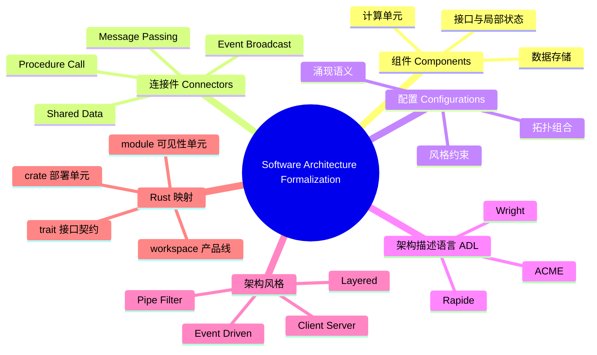

> **内容分级**: [专家级]
>
# 软件架构形式化（Software Architecture Formalization）

**EN**: Software Architecture Formalization
**Summary**: Formal models of software architecture — components, connectors, configurations, architectural styles, and ADLs — with a bridge to Rust's module and crate system.

> **Rust 版本**: 1.97.0+ (Edition 2024)
> **Bloom 层级**: L4-L5
> **权威来源**: 本文件为 `concept/` 权威页。
> **定位**: 从形式化视角建立软件架构的组件-连接件-配置三元模型，介绍架构描述语言（ADL）、架构风格与连接件语义，并映射到 Rust 的 crate/module/trait/workspace 机制。
> **前置概念**: [Async/Await](../../03_advanced/01_async/01_async.md) · [Architecture Patterns](../../06_ecosystem/03_design_patterns/08_architecture_patterns.md) · [Pattern Composition Algebra](../00_type_theory/12_pattern_composition_algebra.md) · [System Composability](../../06_ecosystem/03_design_patterns/04_system_composability.md)
> **后置概念**: [Architecture Pattern Semantics](02_architecture_pattern_semantics.md) · [Architecture Refinement](03_architecture_refinement.md) · [Rust Architecture Constraints](04_rust_architecture_constraints.md) · [Component-Based Semantics](../09_system_semantics/03_component_based_semantics.md)

---

> **来源**: [Rust Reference — Traits](https://doc.rust-lang.org/reference/items/traits.html) · [Rust Reference — Modules](https://doc.rust-lang.org/reference/items/modules.html) · [Shaw & Garlan — Software Architecture (1996)](https://www.cs.cmu.edu/~search/articles/books/SA.book.pdf)

---

## 📑 目录

- [软件架构形式化（Software Architecture Formalization）](#软件架构形式化software-architecture-formalization)
  - [📑 目录](#-目录)
  - [一、核心概念](#一核心概念)
    - [1.1 软件架构三元组](#11-软件架构三元组)
    - [1.2 架构描述语言 ADL](#12-架构描述语言-adl)
    - [1.3 架构风格](#13-架构风格)
    - [1.4 连接件语义](#14-连接件语义)
    - [1.5 风格的语法与状态机形式化](#15-风格的语法与状态机形式化)
      - [语法视角](#语法视角)
      - [状态机视角](#状态机视角)
    - [1.6 到 Rust 的映射](#16-到-rust-的映射)
  - [二、反命题与边界](#二反命题与边界)
    - [反命题：相同组件在不同配置中具有相同语义](#反命题相同组件在不同配置中具有相同语义)
    - [边界：ADL 与实现语言的鸿沟](#边界adl-与实现语言的鸿沟)
  - [三、相关概念](#三相关概念)
  - [四、嵌入式测验（Embedded Quiz）](#四嵌入式测验embedded-quiz)
    - [测验 1：软件架构三元组包含哪三个要素？（记忆层）](#测验-1软件架构三元组包含哪三个要素记忆层)
    - [测验 2：ADL 与普通建模语言（如 UML）的关键区别是什么？（理解层）](#测验-2adl-与普通建模语言如-uml的关键区别是什么理解层)
    - [测验 3：为什么说“相同组件在不同配置中具有相同语义”是错误的？（分析层）](#测验-3为什么说相同组件在不同配置中具有相同语义是错误的分析层)
    - [测验 4：Rust 的哪些机制对应架构形式化中的“连接件”？（应用层）](#测验-4rust-的哪些机制对应架构形式化中的连接件应用层)
    - [测验 5：架构风格为什么能导出可推断性质？（分析层）](#测验-5架构风格为什么能导出可推断性质分析层)
  - [五、🧭 思维导图（Mindmap）](#五-思维导图mindmap)

---

## 一、核心概念

### 1.1 软件架构三元组

Shaw & Garlan 将软件架构定义为**组件（Components）、连接件（Connectors）、配置（Configurations）**的三元组：

- **组件**：计算或数据存储单元，拥有接口与局部状态。
- **连接件**：组件之间的交互机制，封装通信协议与控制规则。
- **配置**：组件与连接件的拓扑组合，即“谁与谁以何种方式连接”。

形式化地，一个架构可记为：

```text
A = (C, K, Γ)
  C = {c₁, c₂, ..., cₙ}      组件集合
  K = {k₁, k₂, ..., kₘ}      连接件集合
  Γ: C × K × C → {0, 1}      连接关系（邻接/参与）
```

> **来源**: [Shaw & Garlan — Software Architecture: Perspectives on an Emerging Discipline (1996)](https://www.cs.cmu.edu/~search/articles/books/SA.book.pdf) · [Garlan & Shaw — An Introduction to Software Architecture (1993)](https://www.cs.cmu.edu/~able/introduction_to_software_architecture.htm)

---

### 1.2 架构描述语言 ADL

ADL 是专门用于描述软件架构的形式化语言。Medvidovic & Taylor 在 2000 年的综述中指出，一种语言要成为 ADL，必须至少显式支持：

| 要素 | 含义 | 示例符号 |
|---|---|---|
| 组件 | 计算/数据单元及其端口 | `component Compute { ports { in P; out Q } }` |
| 连接件 | 交互规则与协议 | `connector Pipe { roles { source; sink } }` |
| 配置/拓扑 | 组件与连接件的绑定 | `attachment Compute.Q to Pipe.source` |
| 约束 | 对结构或行为的限制 | `constraint: no_cycle(K)` |

经典 ADL：

- **ACME**：支持架构风格、产品族与约束的通用交换格式。
- **Wright**：基于 CSP，可对联接协议进行死锁与一致性分析。
- **Rapide**：支持partial-order事件仿真与架构约束验证。

> **来源**: [Medvidovic & Taylor — A Classification and Comparison Framework for Software Architecture Description Languages (2000)](https://ieeexplore.ieee.org/document/845372)

---

### 1.3 架构风格

**架构风格 = 对组件类型、连接件类型、拓扑与交互约束的族化规定**。同一风格下的系统在结构上共享不变量，但在具体功能上可完全不同。

常见风格及其核心约束：

| 风格 | 拓扑约束 | 交互约束 |
|---|---|---|
| **Pipe-Filter** | 线性/有向无环图 | 数据单向流动，过滤器无共享状态 |
| **Client-Server** | 星型/多层 | 请求-响应，服务器被动监听 |
| **Layered** | 严格层次 | 只依赖相邻下层，禁止跨层 |
| **Event-Driven** | 发布-订阅拓扑 | 生产者与消费者解耦，事件广播 |

风格的价值在于**约束产生可推断性质**：Pipe-Filter 天然支持并行；Layered 的修改局部性可由依赖方向保证。

> **来源**: [Shaw & Garlan — Software Architecture (1996)](https://www.cs.cmu.edu/~search/articles/books/SA.book.pdf)

---

### 1.4 连接件语义

连接件不是简单的“调用线”，它本身具有语义。常见的四类连接件：

| 连接件类型 | 语义特征 | Rust 对应 |
|---|---|---|
| **Procedure Call** | 同步、请求-响应、调用栈传递 | 普通函数调用、`trait` 方法 |
| **Event Broadcast** | 异步、多播、发布-订阅 | `tokio::sync::broadcast`、`event-listener` |
| **Shared Data** | 并发读写、需一致性协议 | `Arc<Mutex<T>>`、`RwLock`、`dashmap` |
| **Message Passing** | 异步、队列、无共享状态 | `tokio::sync::mpsc`、`std::sync::mpsc` |

形式化上，连接件可建模为**进程代数**中的通道（如 CSP）或**状态机**中的转移标签。例如，Procedure Call 可写为：

```text
call(cᵢ, cⱼ, m) / return(cⱼ, cᵢ, v)
```

其中 `m` 为消息/参数，`v` 为返回值。

---

### 1.5 风格的语法与状态机形式化

架构风格可形式化为**生成语法**或**状态机**：

#### 语法视角

Layered 风格的合法配置可由上下文无关文法生成：

```text
Layered   → Layer+
Layer     → Presentation | Application | Domain | Infrastructure
Allowed   → Presentation Application | Application Domain | Domain Infrastructure
Forbidden → Presentation Domain | Domain Presentation | Infrastructure Application
```

#### 状态机视角

Event-Driven 风格中，每个组件的状态转移由接收/发布事件触发：

```text
State(S) --event e--> State(S')
其中 e ∈ In(c) ∪ Out(c)，In/Out 为组件的输入/输出事件集合
```

风格约束则表现为**全局不变量**：对于 Event-Driven，生产者不阻塞等待消费者；对于 Layered，状态转移不得跨越非相邻层。

---

### 1.6 到 Rust 的映射

Rust 的语言机制天然对应架构形式化的多个层级：

| 架构概念 | Rust 机制 | 语义解释 |
|---|---|---|
| 组件 | `struct` / `enum` / `mod` | 封装状态与行为的计算单元 |
| 接口/端口 | `trait` | 组件间契约，定义允许的操作集合 |
| 连接件 | 函数调用、channel、`async`/`.await` | 过程调用、消息传递、事件广播 |
| 配置 | `use`、`pub use`、workspace `members` | 组件与连接件的显式拓扑声明 |
| 部署单元 | `crate` | 编译、链接、版本、隐私的边界 |
| 命名空间/可见性单元 | `mod` | 控制接口暴露与信息隐藏 |
| 产品线 | workspace | 多个 crate 共享依赖与构建配置 |

以下示例展示一个最小 ADL 风格配置在 Rust 中的体现：

```rust
// Rust 中的 Pipe-Filter 风格骨架
// 每个 Filter 是一个组件，Iterator 适配器链是连接件

pub trait Filter<In, Out> {
    fn transform(&self, input: In) -> Out;
}

pub struct UpperCase;
impl Filter<String, String> for UpperCase {
    fn transform(&self, input: String) -> String {
        input.to_uppercase()
    }
}

pub struct Trim;
impl Filter<String, String> for Trim {
    fn transform(&self, input: String) -> String {
        input.trim().to_string()
    }
}

// 配置：通过函数组合显式声明 filter 的连接拓扑
pub fn pipeline(input: String) -> String {
    let upper = UpperCase.transform(input);
    Trim.transform(upper)
}

fn main() {
    let out = pipeline("  hello world  ".to_string());
    assert_eq!(out, "HELLO WORLD");
}
```

---

## 二、反命题与边界

### 反命题：相同组件在不同配置中具有相同语义

这是架构设计中最常见的直觉错误。**组件的语义不是其局部语义的简单叠加**，而是由配置中的连接件与拓扑共同决定的**涌现语义（emergent semantics）**。

考虑同一个组件 `Producer` 与同一个组件 `Consumer`：

- 配置 A：通过**消息队列**连接 → 异步、解耦、可能乱序。
- 配置 B：通过**共享内存**连接 → 同步、共享状态、需锁保护。
- 配置 C：通过**远程过程调用**连接 → 网络延迟、失败模式完全不同。

因此，架构验证不能只验证组件正确性，必须验证**配置级不变量**。

### 边界：ADL 与实现语言的鸿沟

ADL 描述的约束（如“禁止循环依赖”）不会自动在实现语言中强制执行。Rust 通过以下机制部分弥合这一鸿沟：

- `crate` 边界阻止循环 crate 依赖（Cargo 直接报错）。
- `pub` / `pub(crate)` / `pub(in path)` 控制可见性，防止隐式连接。
- `trait` 与 orphan rules 约束接口实现的位置。

但仍有语义无法由编译器保证，例如：

- ADL 中的“层间不绕过”需要团队规范 + 代码审查。
- 事件广播的“生产者不阻塞消费者”需要运行时语义保证。

---

## 三、相关概念

- [Architecture Patterns](../../06_ecosystem/03_design_patterns/08_architecture_patterns.md) — 分层、六边形、洋葱、整洁等模式的工程化描述
- [Component-Based Semantics](../09_system_semantics/03_component_based_semantics.md) — 组件组合与接口契约的形式化语义
- [Rust Architecture Constraints](04_rust_architecture_constraints.md) — Rust 模块、crate、ABI 对架构语义的约束
- [Pattern Composition Algebra](../00_type_theory/12_pattern_composition_algebra.md) — 模式组合的代数结构
- [Architecture Refinement](03_architecture_refinement.md) — 从抽象架构到 Rust 实现的精化保持

---

## 四、嵌入式测验（Embedded Quiz）

### 测验 1：软件架构三元组包含哪三个要素？（记忆层）

**题目**: Shaw & Garlan 提出的软件架构三元组由哪三个要素构成？

<details>
<summary>✅ 答案与解析</summary>

组件（Components）、连接件（Connectors）、配置（Configurations）。组件是计算/数据单元；连接件是交互机制；配置是它们之间的拓扑组合。
</details>

---

### 测验 2：ADL 与普通建模语言（如 UML）的关键区别是什么？（理解层）

**题目**: 架构描述语言（ADL）与通用建模语言相比，最核心的区别是什么？

<details>
<summary>✅ 答案与解析</summary>

ADL 必须显式支持组件、连接件、配置/拓扑和约束四种要素，并且能够对架构风格与连接件协议进行形式化分析与验证；而通用建模语言通常更关注静态结构与可视化。
</details>

---

### 测验 3：为什么说“相同组件在不同配置中具有相同语义”是错误的？（分析层）

**题目**: 将同一对 Producer 和 Consumer 分别通过消息队列、共享内存、RPC 连接，它们的语义是否相同？为什么？

<details>
<summary>✅ 答案与解析</summary>

不相同。连接件与拓扑会改变系统的涌现语义：消息队列提供异步解耦，共享内存引入同步与锁，RPC 引入网络延迟与失败模式。组件局部正确不能保证配置级正确。
</details>

---

### 测验 4：Rust 的哪些机制对应架构形式化中的“连接件”？（应用层）

**题目**: 在 Rust 中，过程调用、事件广播、消息传递分别可以用哪些语言机制实现？

<details>
<summary>✅ 答案与解析</summary>

- 过程调用：普通函数调用或 `trait` 方法调用。
- 事件广播：`tokio::sync::broadcast` 或 `event-listener` 等发布-订阅机制。
- 消息传递：`tokio::sync::mpsc` / `std::sync::mpsc` 等 channel。

</details>

---

### 测验 5：架构风格为什么能导出可推断性质？（分析层）

**题目**: Pipe-Filter 风格为什么天然支持并行？Layered 风格为什么具有修改局部性？

<details>
<summary>✅ 答案与解析</summary>

Pipe-Filter 通过“数据单向流动、过滤器无共享状态”的约束，消除了过滤器之间的数据竞争，因而可独立调度。Layered 通过“只依赖相邻下层”的约束，将变更影响限制在相邻层内，从而具备修改局部性。
</details>

---

## 五、🧭 思维导图（Mindmap）



---

> **来源**: [Shaw & Garlan — Software Architecture: Perspectives on an Emerging Discipline (1996)](https://www.cs.cmu.edu/~search/articles/books/SA.book.pdf) · [Garlan & Shaw — An Introduction to Software Architecture (1993)](https://www.cs.cmu.edu/~able/introduction_to_software_architecture.htm) · [Medvidovic & Taylor — A Classification and Comparison Framework for Software Architecture Description Languages (2000)](https://ieeexplore.ieee.org/document/845372)
