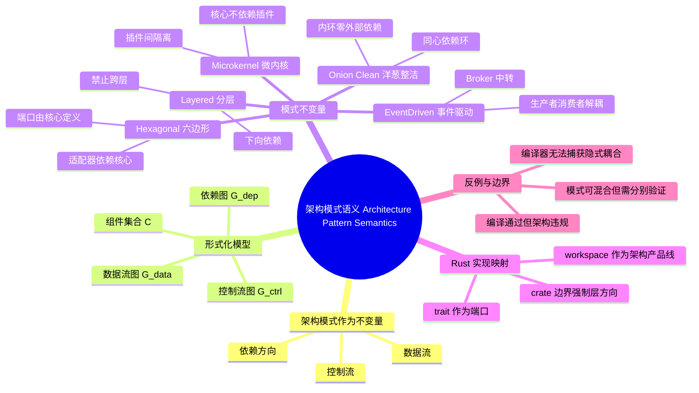

> **内容分级**: [专家级]
>
> **代码状态**: ✅ 含可编译示例与语义违规反例
> **定理链**: N/A — 描述性/形式化框架，尚未建立形式化定理链

# 架构模式语义（Architecture Pattern Semantics）

> **EN**: Architecture Pattern Semantics
> **Summary**: Formal semantics of common architecture patterns — Layered, Hexagonal, Onion, Clean, Microkernel, Event-Driven — as invariants on dependencies, control flow, and data flow.

> **Rust 版本**: 1.97.0+ (Edition 2024)
> **Bloom 层级**: L4-L5
> **权威来源**: 本文件为 `concept/` 权威页。
> **定位**: 从形式化视角定义常见架构模式的语义不变量，将其表述为依赖图、控制流与数据流的约束，并映射到 Rust 的模块、trait 与 workspace 机制。本文是 [Architecture Patterns](../../06_ecosystem/03_design_patterns/08_architecture_patterns.md) 的形式化深化，连接高层设计模式与实现级语义。
> **前置概念**: [Async/Await](../../03_advanced/01_async/01_async.md) · [Architecture Patterns](../../06_ecosystem/03_design_patterns/08_architecture_patterns.md) · [Pattern Composition Algebra](../00_type_theory/12_pattern_composition_algebra.md) · [System Composability](../../06_ecosystem/03_design_patterns/04_system_composability.md) · [Semantic Space](../../00_meta/00_framework/semantic_space.md)
> **后置概念**: [Software Architecture Formalization](01_software_architecture_formalization.md) · [Architecture Refinement](03_architecture_refinement.md) · [Rust Architecture Constraints](04_rust_architecture_constraints.md)

---

> **来源**: [Rust Reference — Modules](https://doc.rust-lang.org/reference/items/modules.html) · [Rust Reference — Items and Visibility](https://doc.rust-lang.org/reference/visibility-and-privacy.html) · [Rust Reference — Orphan Rules](https://doc.rust-lang.org/reference/items/traits.html#orphan-rules) · [Rust API Guidelines](https://rust-lang.github.io/api-guidelines/) · [Rust Design Patterns](https://rust-unofficial.github.io/patterns/)

> **权威来源 / Provenance**: 本节架构模式作为不变量集合与质量属性语义，主要对齐 Shaw & Garlan (1996)、Bass, Clements & Kazman (2021) 的 *Software Architecture in Practice* 中关于架构模式、质量属性场景与架构战术的论述，并参考 ISO/IEC/IEEE 42010:2022 的架构描述框架、Medvidovic & Taylor (2000) 的 ADL 分类工作、Wermelinger (1994) 的形式化规格，以及 ACME/Wright/Rapide 等经典 ADL 原始论文。
>
> - **Bass, Clements & Kazman (2021)** — *Software Architecture in Practice* (4th ed.). SEI. [https://www.sei.cmu.edu/research-capabilities/books/book.cfm?assetid=669293](https://www.sei.cmu.edu/research-capabilities/books/book.cfm?assetid=669293)
> - **Shaw & Garlan (1996)** — *Software Architecture: Perspectives on an Emerging Discipline*. Prentice Hall. [PDF](https://www.cs.cmu.edu/~search/articles/books/SA.book.pdf)
> - **Garlan & Shaw (1993)** — *An Introduction to Software Architecture*. [https://doi.org/10.1142/9789812813032_0001](https://doi.org/10.1142/9789812813032_0001)
> - **Medvidovic & Taylor (2000)** — *A Classification and Comparison Framework for Software Architecture Description Languages*. [https://doi.org/10.1109/32.825767](https://doi.org/10.1109/32.825767)
> - **Wermelinger (1994)** — *Formal Specification of Software Architecture*. Science of Computer Programming, 23(2–3), 149–178. [https://doi.org/10.1016/0167-6423(94)00022-5](https://doi.org/10.1016/0167-6423(94)00022-5)
> - **ISO/IEC/IEEE 42010:2022** — *Software and Systems Engineering — Architecture Description*. ISO, 2022. [https://www.iso.org/standard/74296.html](https://www.iso.org/standard/74296.html)
> - **Garlan, Monroe & Wile (1997)** — *ACME: An Architecture Description Interchange Language*. In *Proceedings of CASCON'97*, 169–183.
> - **Allen (1997)** — *A Formal Approach to Software Architecture*. Ph.D. thesis, Carnegie Mellon University. (Wright ADL based on CSP.)
> - **Luckham et al. (1995)** — *Specification and Analysis of System Architecture Using Rapide*. IEEE Transactions on Software Engineering, 21(4), 336–355. [https://doi.org/10.1109/32.385970](https://doi.org/10.1109/32.385970)
> - **Rust Reference — Items and Visibility** — [https://doc.rust-lang.org/reference/visibility-and-privacy.html](https://doc.rust-lang.org/reference/visibility-and-privacy.html)
> - **Rust Reference — Orphan Rules** — [https://doc.rust-lang.org/reference/items/traits.html#orphan-rules](https://doc.rust-lang.org/reference/items/traits.html#orphan-rules)
> - **Rust Design Patterns** — [https://rust-lang.github.io/patterns/](https://rust-lang.github.io/patterns/)
> - **docs.rs — cargo-depgraph** — [https://docs.rs/cargo-depgraph](https://docs.rs/cargo-depgraph)
> - **docs.rs — cargo-modules** — [https://docs.rs/cargo-modules](https://docs.rs/cargo-modules)

---

架构模式质量属性决策表：

```text
| 关注质量属性 | 推荐模式族        | Rust 战术示例                          | 代价                     |
|--------------|-------------------|----------------------------------------|--------------------------|
| 可修改性     | Layered / Clean   | 每层一个 workspace member crate        | 增加 crate 管理成本      |
| 可测试性     | Hexagonal         | trait 端口 + 内存适配器                | 接口设计工作量           |
| 性能/吞吐    | Event-Driven      | tokio::sync::mpsc / broadcast          | 延迟、序列化开销         |
| 可扩展性     | Microkernel       | trait Plugin + 动态注册表              | 插件加载与隔离复杂度     |
| 可用性       | Event-Driven + LB | tower 重试/熔断 + supervisor           | 运维与监控成本           |
```

> 说明：该表体现 Bass 等提出的“质量属性驱动架构战术选择”思想；具体选择需结合基准测试与 ATAM 式权衡。

---

## 📑 目录

- [架构模式语义（Architecture Pattern Semantics）](#架构模式语义architecture-pattern-semantics)
  - [📑 目录](#-目录)
  - [一、核心概念](#一核心概念)
    - [1.1 架构模式作为不变量集合](#11-架构模式作为不变量集合)
    - [1.2 形式化模型：依赖图、控制流与数据流](#12-形式化模型依赖图控制流与数据流)
    - [1.3 分层架构（Layered）](#13-分层架构layered)
      - [语义不变量](#语义不变量)
    - [1.4 六边形架构（Hexagonal / Ports \& Adapters）](#14-六边形架构hexagonal--ports--adapters)
      - [语义不变量](#语义不变量-1)
    - [1.5 洋葱架构与整洁架构（Onion \& Clean）](#15-洋葱架构与整洁架构onion--clean)
      - [语义不变量](#语义不变量-2)
    - [1.6 微内核架构（Microkernel）](#16-微内核架构microkernel)
      - [语义不变量](#语义不变量-3)
    - [1.7 事件驱动架构（Event-Driven）](#17-事件驱动架构event-driven)
      - [语义不变量](#语义不变量-4)
  - [二、架构不变量的图约束表示](#二架构不变量的图约束表示)
  - [三、Rust 实现映射](#三rust-实现映射)
    - [3.1 模块系统强制依赖方向](#31-模块系统强制依赖方向)
    - [3.2 Trait 作为端口](#32-trait-作为端口)
    - [3.3 Workspace 成员映射到层/六边形](#33-workspace-成员映射到层六边形)
    - [3.4 微内核的 Rust 表达](#34-微内核的-rust-表达)
  - [四、反例与边界](#四反例与边界)
    - [4.1 反例：编译通过的架构违规](#41-反例编译通过的架构违规)
    - [4.2 边界：模式不是互斥的](#42-边界模式不是互斥的)
    - [4.3 边界：编译器无法捕获所有语义违规](#43-边界编译器无法捕获所有语义违规)
    - [4.4 编译期可捕获的架构违规](#44-编译期可捕获的架构违规)
  - [相关概念](#相关概念)
  - [嵌入式测验（Embedded Quiz）](#嵌入式测验embedded-quiz)
    - [测验 1：分层架构中哪条边是被禁止的？](#测验-1分层架构中哪条边是被禁止的)
    - [测验 2：六边形架构的端口应该由谁定义？](#测验-2六边形架构的端口应该由谁定义)
    - [测验 3：洋葱/整洁架构的最内环必须满足什么？](#测验-3洋葱整洁架构的最内环必须满足什么)
    - [测验 4：事件驱动架构中生产者与消费者的关系是什么？](#测验-4事件驱动架构中生产者与消费者的关系是什么)
    - [测验 5：Rust 的哪种机制最适合把架构依赖规则变成编译错误？](#测验-5rust-的哪种机制最适合把架构依赖规则变成编译错误)
  - [🧭 思维导图（Mindmap）](#-思维导图mindmap)
  - [补充国际权威来源（P1/P2 覆盖）](#补充国际权威来源p1p2-覆盖)

---

## 一、核心概念

### 1.1 架构模式作为不变量集合

传统上，架构模式被描述为“组织代码的经验模板”。从语义角度看，一个架构模式是**一组在系统演化过程中必须保持为真的不变量（invariants）**，它们约束：

1. **依赖方向**（dependency direction）：哪些组件可以引用哪些组件；
2. **控制流路径**（control flow）：请求/调用沿什么拓扑传播；
3. **数据流边界**（data flow）：数据可以在哪些层之间自由穿越，哪些层必须经适配/转换。

> 形式化地说，一个架构模式 `P` 可以视为三元组 `P = (AllowedEdges, ForbiddenEdges, Invariants)`，其中：
>
> - `AllowedEdges ⊆ C × C` 是组件之间被允许的依赖/控制/数据边；
> - `ForbiddenEdges ⊆ C × C` 是被禁止的边；
> - `Invariants` 是超越图结构的谓词（如“领域层无 I/O 副作用”）。

这种模式观的价值在于**可判定性**：一旦我们把架构规则编码为 crate 依赖、模块可见性或类型约束，违规就可以像类型错误一样在编译期被发现。

---

### 1.2 形式化模型：依赖图、控制流与数据流

令系统由一组组件 `C = {c₁, c₂, ..., cₙ}` 组成。对每个模式，我们关注三种有向图：

| 图 | 边语义 | 符号 |
|---|---|---|
| 依赖图 `G_dep` | `cᵢ → cⱼ` 表示 `cᵢ` 的源代码依赖 `cⱼ` | `D` |
| 控制流图 `G_ctrl` | `cᵢ → cⱼ` 表示运行时调用/触发从 `cᵢ` 进入 `cⱼ` | `Ctrl` |
| 数据流图 `G_data` | `cᵢ → cⱼ` 表示数据从 `cᵢ` 流向 `cⱼ` | `Data` |

三种图通常同向但不等价。例如，在事件驱动架构中：

- 生产者 `P` **不依赖** 消费者 `C`（`G_dep` 无边）；
- 但运行时事件从 `P` 流向 `C`（`G_data` 有边 `P → C`）；
- 控制流由消息中间件/总线解耦，因此 `G_ctrl` 中 `P` 与 `C` 之间没有直接边。

架构模式的语义差异，本质上就是对这些图施加的不同约束。

---

### 1.3 分层架构（Layered）

> **权威来源**: [Fowler — Patterns of Enterprise Application Architecture](https://martinfowler.com/books/eaa.html) · [Buschmann et al. — Pattern-Oriented Software Architecture](https://en.wikipedia.org/wiki/Pattern-Oriented_Software_Architecture)

分层架构把系统组织为水平层级 `L₁, L₂, ..., Lₖ`，经典四层为：

```text
Presentation  (L₄)
Application   (L₃)
Domain        (L₂)
Infrastructure(L₁)
```

#### 语义不变量

1. **严格下向依赖**：若 `cᵢ ∈ L_m`，`cⱼ ∈ L_n` 且 `m > n`，则允许 `cᵢ → cⱼ`；反方向禁止。
2. **禁止跨层依赖**：若 `|m - n| > 1`，则 `cᵢ → cⱼ` 禁止（即不允许 presentation 直接依赖 infrastructure）。
3. **下层无知上层**：`L_n` 的代码不能引用任何 `L_m`（`m > n`）的符号。

形式化：

```text
∀(cᵢ, cⱼ) ∈ D : layer(cᵢ) > layer(cⱼ) ∧ |layer(cᵢ) - layer(cⱼ)| = 1
```

Rust 映射见 [§3 Rust 实现映射](#三rust-实现映射)。

---

### 1.4 六边形架构（Hexagonal / Ports & Adapters）

> **权威来源**: [Cockburn — Hexagonal Architecture](https://alistair.cockburn.us/hexagonal-architecture/)

六边形架构把系统视为一个**核心（Application / Domain）** 与外部世界，二者通过**端口（Ports）** 与 **适配器（Adapters）** 交互。

#### 语义不变量

1. **核心零外部依赖**：`G_dep` 中，核心内部节点不能指向任何外部框架/驱动节点。
2. **端口由核心定义**：所有端口 `trait` 必须位于核心 crate/模块；适配器实现位于外部 crate/模块。
3. **依赖方向向内**：外部适配器依赖核心端口，核心不依赖适配器。
4. **控制流对称**：驱动适配器（driving adapter）调用驱动端口（driving port）进入核心；核心调用从动端口（driven port），由从动适配器实现。

形式化：

```text
∀(cᵢ, cⱼ) ∈ D : core(cᵢ) ⇒ port(cⱼ) ∨ core(cⱼ)
∀ adapter a : ∃ port p, p ∈ Core ∧ a depends on p
```

---

### 1.5 洋葱架构与整洁架构（Onion & Clean）

> **权威来源**: [Palermo — Onion Architecture](https://jeffreypalermo.com/blog/the-onion-architecture-part-1/) · [Martin — Clean Architecture](https://blog.cleancoder.com/uncle-bob/2012/08/13/the-clean-architecture.html)

洋葱架构与整洁架构是分层架构的**依赖反转**变体。系统被组织为同心圆/环 `R₁, R₂, ..., Rₖ`，最内环最抽象、最稳定。

#### 语义不变量

1. **依赖只能向内**：`R_m → R_n` 仅当 `m > n`。
2. **内环零外部依赖**：最内环（Domain Model / Entities）不能依赖任何框架、UI 或数据库符号。
3. **接口定义在内环**：外层实现的接口/抽象必须由内环定义（依赖倒置原则，DIP）。
4. **数据向内纯化**：穿越环边界向内流动的数据应剥离外部框架细节（例如，不能把 `sqlx::Error` 带入领域错误类型）。

形式化：

```text
∀(cᵢ, cⱼ) ∈ D : ring(cᵢ) > ring(cⱼ)
∀ c ∈ R₁ : ¬∃ external-framework-symbol s, c references s
```

与六边形架构的关系：洋葱/整洁强调**同心依赖规则**；六边形强调**端口-适配器对称性**。二者在 Rust 中通常共同落地：trait 作端口，crate 边界作环边界。

---

### 1.6 微内核架构（Microkernel）

> **权威来源**: [Buschmann et al. — POSA, Microkernel Pattern](https://en.wikipedia.org/wiki/Pattern-Oriented_Software_Architecture)

微内核架构把系统分为：

- **核心（Core / Microkernel）**：最小功能集、资源管理、生命周期调度；
- **插件（Plugins）**：通过预定义接口扩展核心功能；
- **接口（Extension Interface）**：核心定义的插件契约。

#### 语义不变量

1. **核心不依赖插件**：`G_dep` 中 `Core → Plugin` 禁止；插件必须依赖核心接口。
2. **插件间隔离**：插件之间不应直接依赖，交互须通过核心或共享事件总线。
3. **运行时可替换**：插件可以在运行时被加载/卸载，核心状态保持一致。
4. **控制流核心调度**：`G_ctrl` 中外部请求先进入核心，核心再分发到插件。

形式化：

```text
∀ plugin p : p depends on CoreInterface
¬∃(Core, p) ∈ D
∀(pᵢ, pⱼ) ∈ D : pᵢ ≠ pⱼ ⇒ 需经 Core 或 Bus 中转
```

Rust 映射：核心 crate 定义 `trait Plugin { fn handle(&self, event: Event) -> Response; }`，各插件 crate 实现该 trait，由核心通过动态库（`cdylib`）或类型注册表加载。

---

### 1.7 事件驱动架构（Event-Driven）

> **权威来源**: [Fowler — Event-Driven Architecture](https://martinfowler.com/articles/201701-event-driven.html) · [Hohpe & Woolf — Enterprise Integration Patterns](https://www.enterpriseintegrationpatterns.com/)

事件驱动架构由**事件生产者（Producers）**、**事件消费者（Consumers）** 与 **事件总线/代理（Broker）** 组成。

#### 语义不变量

1. **生产者与消费者解耦**：`G_dep` 中 `Producer → Consumer` 与 `Consumer → Producer` 均禁止。
2. **事件契约居中**：生产者与消费者共享事件 schema/类型，但不直接共享实现。
3. **控制流经 Broker**：`G_ctrl` 中 `Producer → Broker → Consumer`。
4. **数据流单向**：`G_data` 中事件数据从生产者流向消费者。

形式化：

```text
∀(p, c) ∈ C × C : producer(p) ∧ consumer(c) ⇒ (p, c) ∉ D
∃ broker b : ∀ event e, source(e) → b → sink(e)
```

Rust 映射：`tokio::sync::broadcast` / `mpsc` 通道、`nats`/`kafka` 客户端、`event-bus` crate；事件类型定义在共享契约 crate。

---

## 二、架构不变量的图约束表示

把上述不变量统一表述为**图约束**后，可以用静态分析工具或编译器机制来检测违规。下表总结五种模式的允许边与禁止边：

| 模式 | 允许边 `AllowedEdges` | 禁止边 `ForbiddenEdges` | 非图不变量 |
|---|---|---|---|
| **Layered** | 相邻下层 `L_{k+1} → L_k` | 反向边、跨层边 | 下层无上层知识 |
| **Hexagonal** | 适配器 → 端口；核心 → 端口 | 核心 → 适配器/框架 | 端口由核心定义 |
| **Onion / Clean** | 外环 → 内环 | 内环 → 外环 | 内环零框架依赖 |
| **Microkernel** | 插件 → 核心接口 | 核心 → 插件；插件 → 插件 | 运行时加载/卸载 |
| **Event-Driven** | 生产者 → Broker；Broker → 消费者 | 生产者 ↔ 消费者直接依赖 | 共享事件契约 |

> **判定方法**：在 Rust 中，把组件映射为 crate 或模块后，可以运行以下检查：
>
> 1. `cargo tree --edges normal` 验证 crate 依赖方向；
> 2. `cargo modules` 或 `cargo-depgraph` 生成模块依赖图；
> 3. 自定义脚本扫描 `use crate::...` 是否跨越禁止边界。

---

## 三、Rust 实现映射

Rust 的模块系统、trait 系统与 workspace 机制为架构不变量提供了**编译期强制手段**。

### 3.1 模块系统强制依赖方向

Rust 的 `mod` 与 `pub` 规则天然适合表达分层：

- `pub`：完全公开；
- `pub(crate)`：仅 crate 内部可见；
- `pub(in path)`：精确控制到某一层；
- `pub use`：重新导出以维护公开 API 的稳定性。

通过把层映射为 crate，cargo 会**拒绝循环依赖**，从而把“无反向边”的语义不变量变成编译错误。

```rust,ignore
// workspace 布局示例：分层架构的 Rust 表达
my_app/
├── Cargo.toml
├── crates/
│   ├── domain/          // L2：纯类型与业务规则
│   ├── application/     // L3：用例编排，依赖 domain
│   ├── infrastructure/  // L1：DB/HTTP 实现，依赖 domain + application
│   └── presentation/    // L4：CLI/Web 入口，依赖 application + domain
```

```toml
# crates/presentation/Cargo.toml
[dependencies]
domain = { path = "../domain" }
application = { path = "../application" }
# ❌ 若添加 infrastructure 依赖，即构成跨层依赖
# infrastructure = { path = "../infrastructure" }
```

### 3.2 Trait 作为端口

在六边形/洋葱/整洁架构中，端口就是 trait：

```rust
// crates/domain/src/ports.rs — 端口由内环定义
use uuid::Uuid;

pub struct Order {
    pub id: Uuid,
    pub total: u64,
}

#[derive(Debug)]
pub enum RepositoryError {
    NotFound,
    Conflict,
}

pub trait OrderRepository: Send + Sync {
    fn find_by_id(&self, id: Uuid) -> Result<Option<Order>, RepositoryError>;
    fn save(&self, order: &Order) -> Result<(), RepositoryError>;
}
```

```rust
// crates/infrastructure/src/repositories.rs — 适配器实现端口
use domain::{Order, OrderRepository, RepositoryError};

pub struct InMemoryOrderRepository {
    // ...
}

impl OrderRepository for InMemoryOrderRepository {
    fn find_by_id(&self, _id: Uuid) -> Result<Option<Order>, RepositoryError> {
        Ok(None)
    }

    fn save(&self, _order: &Order) -> Result<(), RepositoryError> {
        Ok(())
    }
}
```

关键不变量：`infrastructure` crate 依赖 `domain` crate，而 `domain` 对 `infrastructure` 一无所知。

### 3.3 Workspace 成员映射到层/六边形

一个 workspace 可以整体映射为一个“架构产品线”：

| 架构概念 | Rust 构造 |
|---|---|
| 层 / 环 | workspace member crate |
| 组件 | crate 内的模块或结构体 |
| 端口 | `trait`（定义在核心 crate） |
| 适配器 | `impl Trait for Struct`（定义在外围 crate） |
| 连接器 | channel、HTTP、gRPC、函数调用 |
| 配置/装配 | `main.rs` / `lib.rs` 中的构造函数注入 |

### 3.4 微内核的 Rust 表达

```rust,ignore
// crates/core/src/plugin.rs
pub trait Plugin: Send + Sync {
    fn name(&self) -> &'static str;
    fn handle(&self, event: CoreEvent) -> PluginResponse;
}

// crates/plugin_audit/src/lib.rs
use core::{Plugin, CoreEvent, PluginResponse};

pub struct AuditPlugin;

impl Plugin for AuditPlugin {
    fn name(&self) -> &'static str { "audit" }
    fn handle(&self, event: CoreEvent) -> PluginResponse {
        // 审计逻辑
        PluginResponse::Handled
    }
}
```

核心运行时通过 `Vec<Box<dyn Plugin>>` 或插件注册表调度，插件 crate 仅依赖核心接口 crate。

---

## 四、反例与边界

### 4.1 反例：编译通过的架构违规

以下 Rust 代码**可以编译通过**，甚至单元测试也能通过，但它违反了分层架构的语义不变量：

```rust,ignore
// ❌ 分层语义违规：presentation 直接导入 infrastructure
mod domain {
    pub struct Order {
        pub id: u64,
    }
}

mod infrastructure {
    use crate::domain::Order;

    pub struct DbConnection;

    impl DbConnection {
        pub fn save_order(_: &Order) {}
    }
}

mod presentation {
    // 直接依赖 infrastructure 导致 presentation 跳过 application 层
    use crate::infrastructure::DbConnection;

    pub fn submit_order() {
        let order = crate::domain::Order { id: 1 };
        DbConnection::save_order(&order);
    }
}
```

> **为什么这是错误**：presentation 直接调用 infrastructure，破坏了“相邻层依赖”与“下层无知上层”两条不变量。短期内测试通过，但会导致：
>
> - application 层的用例编排、事务边界被绕过；
> - presentation 被锁定到具体数据库技术；
> - 循环依赖风险增加（一旦 infrastructure 需要调用 presentation 的 DTO，即形成环）。

在 workspace crate 边界下，这种违规表现为 `crates/presentation/Cargo.toml` 中出现 `infrastructure = { path = "../infrastructure" }`。

### 4.2 边界：模式不是互斥的

真实系统常混合多种模式。例如：

- 一个微服务内部使用 **Onion/Clean**；
- 服务之间通过 **Event-Driven** 通信；
- 某个服务使用 **Microkernel** 支持插件化规则引擎。

混合时必须分别验证每种模式的不变量。不能因为在微观层面满足 Clean，就忽略宏观层面的事件总线引入了生产者对消费者 schema 的隐式依赖。

### 4.3 边界：编译器无法捕获所有语义违规

Rust 模块/crate 边界只能捕获**源码依赖方向**违规。以下问题仍需要架构审查或额外工具：

- 运行时通过反射、动态加载绕过编译依赖；
- 通过共享数据库 schema 隐式耦合（数据流违规但无源码依赖）；
- 通过环境变量、配置字符串产生的隐式控制流。

### 4.4 编译期可捕获的架构违规

以下 `compile_fail` 块把“Layered 禁止跨层依赖”与“Domain 不得依赖 Infrastructure”编码为可见性规则，演示 Rust 编译器如何拒绝违规：

```rust,compile_fail
// ❌ 违规 1：Presentation 直接调用 Infrastructure（跨层依赖）
mod application {
    pub(in crate::application) mod infrastructure {
        pub struct DbConnection;
        impl DbConnection { pub fn save(_: u64) {} }
    }
    pub fn create_order(id: u64) { infrastructure::DbConnection::save(id); }
}

mod presentation {
    use crate::application::infrastructure::DbConnection; //~ ERROR module `infrastructure` is private
    pub fn submit_order() { DbConnection::save(1); }
}

fn main() {}
```

```rust,compile_fail
// ❌ 违规 2：Domain crate 依赖 Infrastructure 的具体类型
mod application {
    pub(in crate::application) mod infrastructure {
        pub struct PostgresPool;
    }
}

mod domain {
    // Domain 层应只依赖自己定义的 trait/类型，不能引用基础设施实现
    use crate::application::infrastructure::PostgresPool; //~ ERROR module `infrastructure` is private

    pub struct UserService {
        pool: PostgresPool,
    }
}

fn main() {}
```

> 工程实践：在真实 Cargo workspace 中，把层拆分为独立 crate 并让 `domain/Cargo.toml` 不声明 `infrastructure` 依赖，可使上述违规在 `cargo check` 阶段以 `unresolved import` 或 `no matching package` 形式失败。

---

## 相关概念

- [Architecture Patterns](../../06_ecosystem/03_design_patterns/08_architecture_patterns.md)：常见架构模式的工程化描述、对比矩阵与 Rust 实现骨架。
- [Pattern Composition Algebra](../00_type_theory/12_pattern_composition_algebra.md)：模式之间的组合、冲突与形式化代数。
- [Software Architecture Formalization](01_software_architecture_formalization.md)：ADL、组件/连接件/配置的通用形式化模型（计划文件）。
- [Architecture Refinement](03_architecture_refinement.md)：从抽象架构到 Rust 实现的逐步精化（计划文件）。
- [Rust Architecture Constraints](04_rust_architecture_constraints.md)：Rust 模块、crate、ABI 对架构的具体约束（计划文件）。
- [System Composability](../../06_ecosystem/03_design_patterns/04_system_composability.md)：系统组合性与模块化设计原则。

---

## 嵌入式测验（Embedded Quiz）

### 测验 1：分层架构中哪条边是被禁止的？

**题目**: 在经典四层分层架构（Presentation / Application / Domain / Infrastructure）中，下列哪条依赖边直接违反分层语义不变量？

A. Application → Domain
B. Presentation → Application
C. Presentation → Infrastructure
D. Infrastructure → Domain

<details>
<summary>✅ 答案与解析</summary>

答案：**C. Presentation → Infrastructure**

解析：分层架构要求依赖只能指向相邻下层。Presentation 直接依赖 Infrastructure 属于**跨层依赖**，跳过了 Application 层，破坏了用例编排与事务边界。Application → Domain 与 Infrastructure → Domain 是允许的相邻/同向依赖；Presentation → Application 也是允许的相邻下层依赖。

</details>

---

### 测验 2：六边形架构的端口应该由谁定义？

**题目**: 在六边形架构中，端口（Port）作为 trait 应该定义在哪个位置？

A. 数据库适配器 crate
B. Web 框架适配器 crate
C. 应用程序核心/领域 crate
D. 测试桩 crate

<details>
<summary>✅ 答案与解析</summary>

答案：**C. 应用程序核心/领域 crate**

解析：端口是核心与外部世界交互的抽象契约，必须由核心定义，才能保证核心不依赖外部技术。适配器（无论驱动还是从动）都实现核心定义的端口，方向向内。

</details>

---

### 测验 3：洋葱/整洁架构的最内环必须满足什么？

**题目**: 洋葱架构与整洁架构中，最内环（Domain Model / Entities）最重要的语义不变量是什么？

A. 只能被 Presentation 层引用
B. 不能依赖任何外部框架或技术细节
C. 必须包含所有数据库访问代码
D. 必须直接调用适配器

<details>
<summary>✅ 答案与解析</summary>

答案：**B. 不能依赖任何外部框架或技术细节**

解析：最内环是最抽象、最稳定的部分，必须零外部依赖。数据库访问代码和适配器调用都应放在外环，通过依赖倒置原则（DIP）向内指向核心。

</details>

---

### 测验 4：事件驱动架构中生产者与消费者的关系是什么？

**题目**: 在事件驱动架构中，事件生产者与消费者之间的正确关系是？

A. 生产者直接调用消费者的方法
B. 消费者依赖生产者的具体实现
C. 二者通过 Broker 解耦，彼此无直接源码依赖
D. 二者共享同一个状态机

<details>
<summary>✅ 答案与解析</summary>

答案：**C. 二者通过 Broker 解耦，彼此无直接源码依赖**

解析：事件驱动的核心语义是解耦。生产者与消费者不直接依赖，只共享事件类型/契约，控制流与数据流经 Broker（或事件总线、消息队列）中转。

</details>

---

### 测验 5：Rust 的哪种机制最适合把架构依赖规则变成编译错误？

**题目**: 要把“Layered 架构禁止反向依赖”转换为编译期强制，最自然的 Rust 机制是？

A. 使用 `unsafe` 块封装跨层调用
B. 每层一个 workspace member crate，并避免循环依赖
C. 通过 `#[cfg]` 条件编译隐藏层
D. 用 `panic!` 在运行时阻止跨层调用

<details>
<summary>✅ 答案与解析</summary>

答案：**B. 每层一个 workspace member crate，并避免循环依赖**

解析：Cargo 的 workspace 会拒绝 crate 之间的循环依赖，因此把层映射为 crate 后，反向依赖与某些跨层依赖会在 `cargo check` 阶段失败。`unsafe` 与 `panic!` 都不能表达架构语义；`#[cfg]` 仅控制编译单元，不强制依赖方向。

</details>

---

## 🧭 思维导图（Mindmap）



> **认知功能**: 本 mindmap 从「架构模式语义」出发，一级分支覆盖形式化模型、五种经典模式的不变量、Rust 实现映射以及反例边界，可作为快速导航与复习索引。

---

> **权威来源**: [Buschmann et al. — POSA](https://en.wikipedia.org/wiki/Pattern-Oriented_Software_Architecture) · [Fowler — Patterns of Enterprise Application Architecture](https://martinfowler.com/books/eaa.html) · [Cockburn — Hexagonal Architecture](https://alistair.cockburn.us/hexagonal-architecture/) · [Palermo — Onion Architecture](https://jeffreypalermo.com/blog/the-onion-architecture-part-1/) · [Martin — Clean Architecture](https://blog.cleancoder.com/uncle-bob/2012/08/13/the-clean-architecture.html) · [Hohpe & Woolf — Enterprise Integration Patterns](https://www.enterpriseintegrationpatterns.com/) · [Shaw & Garlan (1996)](https://www.cs.cmu.edu/~search/articles/books/SA.book.pdf) · [Garlan & Shaw (1993)](https://doi.org/10.1142/9789812813032_0001) · [Medvidovic & Taylor (2000)](https://doi.org/10.1109/32.825767) · [ISO/IEC/IEEE 42010:2022](https://www.iso.org/standard/74296.html)
> **文档版本**: 1.0
> **最后更新**: 2026-07-28
> **状态**: ✅ 新建

## 补充国际权威来源（P1/P2 覆盖）

- [RustBelt project](https://plv.mpi-sws.org/rustbelt/)
- [Oxide: The Essence of Rust](https://arxiv.org/abs/1903.00982)
