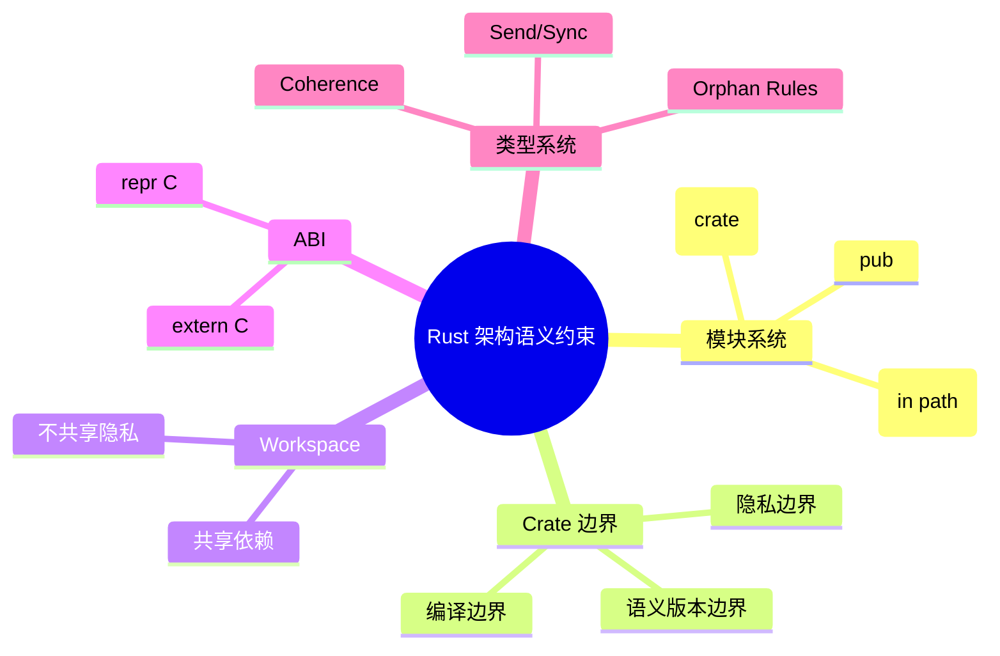

> **内容分级**: [专家级]
>
> **代码状态**: ✅ 含可编译示例与编译错误反例

# Rust 架构语义约束（Rust Architecture Semantics Constraints）

**EN**: Rust Architecture Semantics Constraints
**Summary**: How Rust's module system, crate boundaries, visibility rules, ABI, and workspace mechanism constrain and shape software architecture semantics.

> **Rust 版本**: 1.97.0+ (Edition 2024)
> **Bloom 层级**: L4-L5
> **权威来源**: 本文件为 `concept/` 权威页。
> **定位**: 系统分析 Rust 的模块系统、crate 边界、可见性规则、ABI 与 workspace 机制如何**约束**软件架构的语义——哪些架构不变量可以被编译器强制执行，哪些仍需工程自律。
> **前置概念**: [Module System](../../02_intermediate/05_modules_and_visibility/01_module_system.md) · [ABI](../05_rustc_internals/05_application_binary_interface.md) · [Software Architecture Formalization](01_software_architecture_formalization.md) · [Async/Await](../../03_advanced/01_async/01_async.md)
> **后置概念**: [Architecture Pattern Semantics](02_architecture_pattern_semantics.md) · [Architecture Refinement](03_architecture_refinement.md) · [Cargo Workspaces](../../06_ecosystem/01_cargo/14_cargo_workspaces.md)

---

> **来源**: [Rust Reference — Items and Visibility](https://doc.rust-lang.org/reference/visibility-and-privacy.html) ·
> [Rust API Guidelines](https://rust-lang.github.io/api-guidelines/) ·
> [Cargo Book — Workspaces](https://doc.rust-lang.org/cargo/reference/workspaces.html) ·
> [Itanium C++ ABI](https://itanium-cxx-abi.github.io/cxx-abi/abi.html)

## 📑 目录

- [Rust 架构语义约束（Rust Architecture Semantics Constraints）](#rust-架构语义约束rust-architecture-semantics-constraints)
  - [📑 目录](#-目录)
  - [一、核心概念](#一核心概念)
    - [1.1 模块系统作为封装与可见性机制](#11-模块系统作为封装与可见性机制)
    - [1.2 Crate 边界：编译、隐私与语义版本](#12-crate-边界编译隐私与语义版本)
    - [1.3 Workspace：产品线与架构耦合](#13-workspace产品线与架构耦合)
    - [1.4 ABI 与跨边界契约](#14-abi-与跨边界契约)
    - [1.5 类型系统对架构不变量的强制执行](#15-类型系统对架构不变量的强制执行)
  - [二、架构不变量 → Rust 机制映射表](#二架构不变量--rust-机制映射表)
  - [三、Rust 示例](#三rust-示例)
    - [3.1 分层架构的可见性实现](#31-分层架构的可见性实现)
    - [3.2 六边形架构的端口-适配器实现](#32-六边形架构的端口-适配器实现)
  - [四、反例与边界](#四反例与边界)
    - [4.1 反例：`pub` 但内部类型泄漏](#41-反例pub-但内部类型泄漏)
    - [4.2 反例：crate 边界未阻止语义版本破坏](#42-反例crate-边界未阻止语义版本破坏)
    - [4.3 边界：孤儿规则限制跨 crate 的 trait 实现](#43-边界孤儿规则限制跨-crate-的-trait-实现)
  - [五、相关概念](#五相关概念)
  - [六、嵌入式测验（Embedded Quiz）](#六嵌入式测验embedded-quiz)
  - [🧭 思维导图（Mindmap）](#-思维导图mindmap)

---

## 一、核心概念

### 1.1 模块系统作为封装与可见性机制

Rust 的模块系统不是文件系统，而是**独立的命名空间与可见性层级**。关键可见性修饰符：

```text
可见性谱系:
  pub              : 完全公开
  pub(crate)       : 当前 crate 内可见
  pub(super)       : 父模块可见
  pub(in path)     : 指定路径内可见
  （默认）         : 当前模块及其子模块可见
```

这意味着**依赖方向可以被编译器强制**：若 `presentation` 模块只通过 `pub(in crate::application)` 暴露接口，则 `presentation` 无法被 `infrastructure` 直接引用，从而支撑分层架构。

### 1.2 Crate 边界：编译、隐私与语义版本

Crate 是 Rust 的三重边界：

1. **编译边界**：每个 crate 单独编译成 rlib/dylib，生成稳定中间产物；
2. **隐私边界**：`pub(crate)` 不会跨 crate 泄露；
3. **语义版本边界**：crate 作为发布单元，其 public API 变更受 semver 约束。

形式化上，crate 边界把系统划分为若干**信息隐藏单元**，与 Parnas 的模块化原则一致。

### 1.3 Workspace：产品线与架构耦合

Cargo workspace 允许一组 crate 共享 `Cargo.lock` 和 target 目录，但**不共享 privacy 边界**。_workspace 是构建产物组织，不是运行时架构单元_。滥用 workspace 共享内部类型会导致隐式跨 crate 耦合。

### 1.4 ABI 与跨边界契约

`extern "C"` 与 `#[repr(C)]` 定义了 Rust 与其他语言/运行时交互的**二进制契约**。ABI 是架构语义的物理承载：结构体布局、调用约定、符号可见性都必须显式约定，否则跨边界行为未定义。

### 1.5 类型系统对架构不变量的强制执行

- **Orphan rules**：限制 trait 实现的定义位置，防止多个 crate 为同一类型实现同一 trait，保证全局一致性；
- **Coherence**：确保任意类型+trait 组合最多一个 impl，使架构中的抽象替换是确定性的；
- **`Send`/`Sync`**：把并发安全从文档约定提升为类型检查。

---

## 二、架构不变量 → Rust 机制映射表

| 架构不变量 | Rust 机制 | 强制程度 |
|---|---|---|
| 分层依赖方向 | `pub(in path)` / module visibility | 编译期 |
| 接口与实现分离 | trait / impl | 编译期 |
| 信息隐藏 | `pub` 层级、crate 边界 | 编译期 |
| 跨语言边界契约 | `extern "C"`、`#[repr(C)]` | 链接期/运行时 |
| 全局一致性 | orphan rules、coherence | 编译期 |
| 并发安全边界 | `Send`/`Sync` | 编译期 |
| 版本兼容 | semver + cargo-semver-checks | 工程/工具 |

---

## 三、Rust 示例

### 3.1 分层架构的可见性实现

```rust
// crate::layered 内部：presentation 只能依赖 application
mod application {
    pub(in crate::layered) fn use_case() {}
}

mod infrastructure {
    // 无法访问 presentation，因为 presentation 未对其公开
}

mod presentation {
    use crate::layered::application::use_case;
    pub fn handle() { use_case(); }
}
```

### 3.2 六边形架构的端口-适配器实现

```rust
// domain 定义端口（trait），不依赖外部 crate
trait UserRepository {
    fn find(&self, id: u64) -> Option<String>;
}

// infrastructure 提供适配器
struct SqlUserRepository;
impl UserRepository for SqlUserRepository {
    fn find(&self, id: u64) -> Option<String> { Some(format!("user-{id}")) }
}

// application 只依赖 domain 端口
fn greet_user(repo: &dyn UserRepository, id: u64) -> String {
    match repo.find(id) {
        Some(name) => format!("Hello, {name}"),
        None => "Unknown".into(),
    }
}
```

---

## 四、反例与边界

### 4.1 反例：`pub` 但内部类型泄漏

```rust,ignore
mod secret {
    pub struct Token(pub(crate) String);
}

// 虽然 Token 是 pub，但无法构造其内部字段，导致"公开类型但私有构造"
// 注意：在同一 crate 内 pub(crate) 字段可见；跨 crate 场景下该字段不可访问。
fn leak(t: secret::Token) {
    let _ = t.0; // 同 crate 内可访问；跨 crate 会报错 private field
}
```

### 4.2 反例：crate 边界未阻止语义版本破坏

公开函数签名变更（如参数类型改变）即使 crate 边界完整，也会破坏下游编译。Rust 编译器强制 API 兼容，但不强制**语义版本**；需配合 `cargo-semver-checks`。

### 4.3 边界：孤儿规则限制跨 crate 的 trait 实现

```rust,compile_fail
use std::fmt::Display;

// 错误：不能为外部类型实现外部 trait
impl Display for serde_json::Value {
    fn fmt(&self, _f: &mut std::fmt::Formatter<'_>) -> std::fmt::Result { Ok(()) }
}
```

---

## 五、相关概念

- [Module System](../../02_intermediate/05_modules_and_visibility/01_module_system.md)
- [ABI](../05_rustc_internals/05_application_binary_interface.md)
- [Software Architecture Formalization](01_software_architecture_formalization.md)
- [Architecture Pattern Semantics](02_architecture_pattern_semantics.md)
- [Cargo Workspaces](../../06_ecosystem/01_cargo/14_cargo_workspaces.md)

---

## 六、嵌入式测验（Embedded Quiz）

1. **`pub(in crate::app)` 与 `pub(crate)` 的区别是什么？**（理解层）
2. **为什么 workspace 成员之间不共享 privacy 边界？**（分析层）
3. **Orphan rules 对架构可组合性有什么影响？**（分析层）
4. **`extern "C"` 在架构语义中承担什么角色？**（应用层）
5. **Rust 的模块系统能否完全替代架构审查？**（评价层）

---

## 🧭 思维导图（Mindmap）


