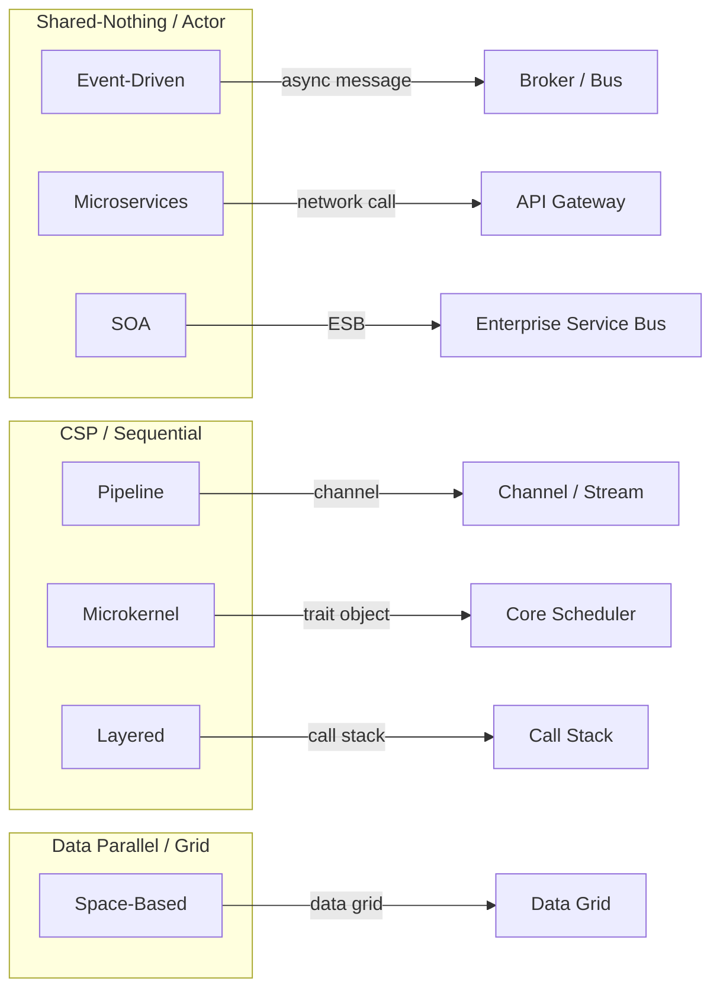
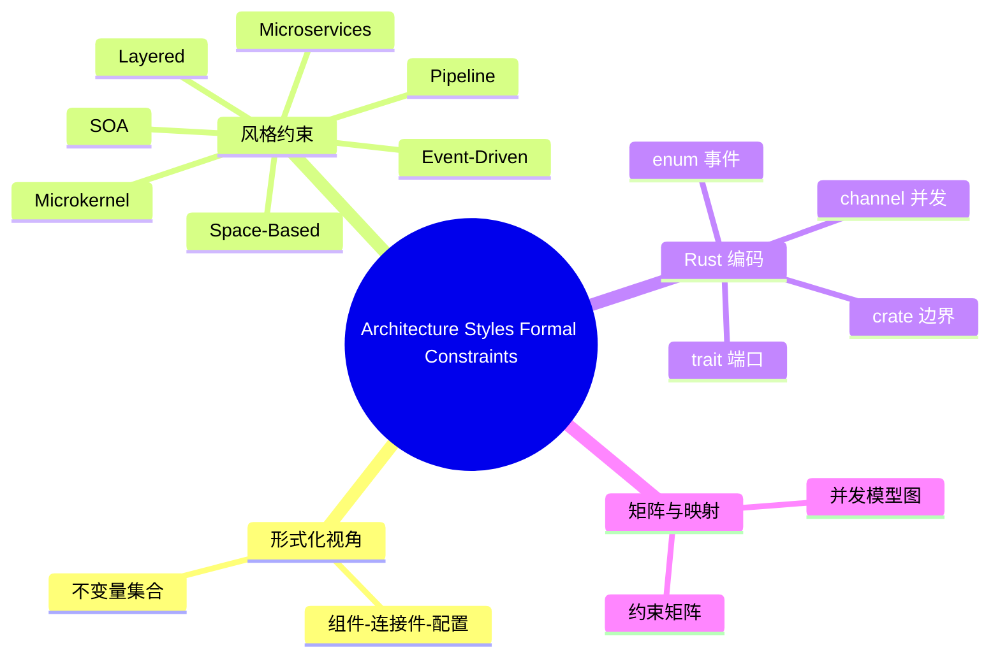

> **内容分级**: [专家级]
>
> **代码状态**: ✅ 含可编译骨架与形式化反例
> **定理链**: N/A — 描述性/形式化框架，尚未建立形式化定理链
>
# 架构风格的形式化约束

> **EN**: Architecture Styles Formal Constraints
> **Summary**: Formal invariants, communication topology, concurrency models, failure propagation boundaries, and Rust type-system encodings for major architecture styles.

> **Rust 版本**: 1.97.0+ (Edition 2024)
> **Bloom 层级**: L5-L6
> **权威来源**: 本文件为 `concept/` 权威页。
> **定位**: 从形式化视角定义主流架构风格（architecture styles）的语义约束，将高层架构决策转写为可在 Rust 中编码、检查的不变量；是 [Architecture Patterns](../../06_ecosystem/03_design_patterns/08_architecture_patterns.md) 与 [Architecture Pattern Semantics](02_architecture_pattern_semantics.md) 的形式化补充。
> **前置概念**: [Architecture Patterns](../../06_ecosystem/03_design_patterns/08_architecture_patterns.md) · [Architecture Pattern Semantics](02_architecture_pattern_semantics.md) · [Rust Architecture Constraints](04_rust_architecture_constraints.md) · [Concurrency](../../03_advanced/00_concurrency/01_concurrency.md) · [Async/Await](../../03_advanced/01_async/01_async.md)
> **后置概念**: [Architecture Refinement](03_architecture_refinement.md) · [Pattern Composition Algebra](../00_type_theory/12_pattern_composition_algebra.md)

---

> **来源**: [Rust Reference — Items and Visibility](https://doc.rust-lang.org/reference/visibility-and-privacy.html) · [Rust Reference — Orphan Rules](https://doc.rust-lang.org/reference/items/traits.html#orphan-rules) · [Rust Design Patterns](https://rust-unofficial.github.io/patterns/) · [tokio](https://docs.rs/tokio/) · [rayon](https://docs.rs/rayon/)

> **权威来源 / Provenance**: 本节架构风格的形式化约束主要对齐以下文献：
>
> - **ISO/IEC/IEEE 42010:2022** — *Software and Systems Engineering — Architecture Description*. ISO, 2022. [https://www.iso.org/standard/74296.html](https://www.iso.org/standard/74296.html)
> - **Mark Richards (2022)** — *Software Architecture Patterns*, 2nd ed. O’Reilly Media. ISBN 978-1-098-13427-3. [O’Reilly](https://www.oreilly.com/library/view/software-architecture-patterns/9781098134280/)
> - **Martin Fowler** — *Patterns of Enterprise Application Architecture* (EAA) 与相关架构文章. [https://martinfowler.com/books/eaa.html](https://martinfowler.com/books/eaa.html)
> - **M. Shaw & D. Garlan (1996)** — *Software Architecture: Perspectives on an Emerging Discipline*. Prentice Hall. [PDF](https://www.cs.cmu.edu/~search/articles/books/SA.book.pdf)
> - **Garlan & Shaw (1993)** — *An Introduction to Software Architecture*. [https://doi.org/10.1142/9789812813032_0001](https://doi.org/10.1142/9789812813032_0001)
> - **C. A. R. Hoare (1978)** — *Communicating Sequential Processes* (CSP).
> - **G. Agha (1986)** — *Actors: A Model of Concurrent Computation in Distributed Systems*.

---

## 📑 目录

- [架构风格的形式化约束](#架构风格的形式化约束)
  - [📑 目录](#-目录)
  - [一、形式化视角](#一形式化视角)
    - [1.1 架构风格 = 不变量集合](#11-架构风格--不变量集合)
    - [1.2 组件-连接件-配置](#12-组件-连接件-配置)
  - [二、各风格的形式化约束](#二各风格的形式化约束)
    - [2.1 分层架构（Layered）](#21-分层架构layered)
    - [2.2 事件驱动架构（Event-Driven）](#22-事件驱动架构event-driven)
    - [2.3 微内核架构（Microkernel）](#23-微内核架构microkernel)
    - [2.4 微服务架构（Microservices）](#24-微服务架构microservices)
    - [2.5 空间架构（Space-Based）](#25-空间架构space-based)
    - [2.6 面向服务架构（SOA）](#26-面向服务架构soa)
    - [2.7 管道-过滤器架构（Pipeline / Pipe-and-Filter）](#27-管道-过滤器架构pipeline--pipe-and-filter)
  - [三、形式化约束矩阵](#三形式化约束矩阵)
  - [四、Rust 类型系统编码提示](#四rust-类型系统编码提示)
  - [五、并发模型映射](#五并发模型映射)
  - [六、反例与边界](#六反例与边界)
    - [6.1 反例：在分层架构中向上依赖](#61-反例在分层架构中向上依赖)
    - [6.2 反例：事件驱动中生产者直接依赖消费者](#62-反例事件驱动中生产者直接依赖消费者)
    - [6.3 边界：编译器无法捕获的语义违规](#63-边界编译器无法捕获的语义违规)
  - [相关概念](#相关概念)
  - [🧭 思维导图（Mindmap）](#-思维导图mindmap)

---

## 一、形式化视角

### 1.1 架构风格 = 不变量集合

借鉴 Shaw & Garlan 的观点，一个架构风格可形式化为：

```text
Style = (Components, Connectors, Configurations, Constraints, Properties)
```

其中 **Constraints** 是本页的核心：它决定哪些依赖/控制/数据边被允许，哪些被禁止。Rust 的强项在于把其中一部分约束（尤其是依赖方向与类型安全）推进到编译期。

### 1.2 组件-连接件-配置

| 元素 | 含义 | Rust 典型映射 |
|---|---|---|
| **Component** | 计算或数据单元 | crate、module、struct、async task |
| **Connector** | 组件间交互机制 | function call、trait bound、channel、message broker、gRPC |
| **Configuration** | 组件与连接件的拓扑 | workspace 依赖图、进程拓扑、网络拓扑 |
| **Constraint** | 必须保持为真的不变量 | visibility rules、trait orphan rules、`Send`/`Sync`、crate DAG |

> 形式化约定：设 `C` 为组件集合，`E ⊆ C × C` 为有向边（依赖、控制或数据）。一个风格 `S` 对 `E` 的约束可写为谓词 `Φ_S(E)`；Rust 实现则是把 `Φ_S` 的一部分编码为类型系统或 crate 依赖规则。

---

## 二、各风格的形式化约束

### 2.1 分层架构（Layered）

> **权威来源**: [Fowler — EAA](https://martinfowler.com/books/eaa.html) · [Mark Richards — Software Architecture Patterns](https://www.oreilly.com/library/view/software-architecture-patterns/9781098134280/)

| 维度 | 约束 |
|---|---|
| **结构不变量** | 组件被分配到有序层 `L₁ … Lₙ`；若 `cᵢ ∈ L_m`、`cⱼ ∈ L_n` 且 `m > n`，则允许 `cᵢ → cⱼ`，反向禁止。通常还禁止跳层：`|m-n| > 1` 时 `cᵢ → cⱼ` 禁止。 |
| **通信拓扑** | 同步调用栈，点对点，自上而下。 |
| **并发模型** | 同进程顺序/多线程；层之间可共享堆，但依赖方向受控。 |
| **故障传播边界** | 下层故障可向上层冒泡；上层故障不应穿透到下层。 |
| **Rust 编码提示** | 每层一个 workspace member；用 `pub(in path)` / `pub(crate)` 限制可见性；`cargo` 拒绝循环依赖。 |

形式化：

```text
∀(cᵢ, cⱼ) ∈ D : layer(cᵢ) > layer(cⱼ) ∧ |layer(cᵢ) - layer(cⱼ)| = 1
```

---

### 2.2 事件驱动架构（Event-Driven）

> **权威来源**: [Mark Richards — Software Architecture Patterns](https://www.oreilly.com/library/view/software-architecture-patterns/9781098134280/) · [Fowler — Event-Driven Architecture](https://martinfowler.com/articles/201701-event-driven.html)

| 维度 | 约束 |
|---|---|
| **结构不变量** | 生产者（Producer）与消费者（Consumer）不直接依赖；二者通过事件契约（schema/type）与 broker/mediator 连接。 |
| **通信拓扑** | 异步发布-订阅或基于事件通道；控制流经 broker：`P → Broker → C`。 |
| **并发模型** | 共享 nothing / actor 模型；每个消费者独立处理事件；可用 CSP 通道实现本地版本。 |
| **故障传播边界** | 单个消费者失败不应阻塞生产者；broker 成为可用性关键路径；需幂等与重试。 |
| **Rust 编码提示** | `enum DomainEvent` + `match` 穷尽；`tokio::sync::broadcast/mpsc`；共享 schema 用 `serde`；消费者 `Send + 'static`。 |

形式化：

```text
¬∃(P, C) ∈ D  （生产者与消费者无直接依赖边）
G_ctrl(P) = {Broker},  G_ctrl(Broker) = {C₁, C₂, ...}
```

---

### 2.3 微内核架构（Microkernel）

> **权威来源**: [Mark Richards — Software Architecture Patterns](https://www.oreilly.com/library/view/software-architecture-patterns/9781098134280/) · [Fowler — Microkernel](https://martinfowler.com/articles/microkernel.html)

| 维度 | 约束 |
|---|---|
| **结构不变量** | 核心（Core）不依赖任何插件；插件仅依赖核心定义的 `Plugin` 接口；插件之间不直接依赖。 |
| **通信拓扑** | 核心作为调度器：请求 → 核心 → 插件；插件间通信须通过核心或受控总线。 |
| **并发模型** | 核心 + 插件可在同进程（`dyn Plugin`）或独立进程/沙箱；故障隔离可用进程或 `catch_unwind`。 |
| **故障传播边界** | 单个插件崩溃不得拖垮核心；核心崩溃则整个系统不可用。 |
| **Rust 编码提示** | `trait Plugin: Send + 'static`；`HashMap<CapabilityId, Box<dyn Plugin>>`；动态库用 `libloading`；沙箱用 `wasmtime`。 |

形式化：

```text
∀p ∈ Plugins : p depends_on CoreInterface
¬∃(Core, p) ∈ D
∀(pᵢ, pⱼ) ∈ D, i≠j : 路径须包含 Core 或 Bus
```

---

### 2.4 微服务架构（Microservices）

> **权威来源**: [Mark Richards — Software Architecture Patterns](https://www.oreilly.com/library/view/software-architecture-patterns/9781098134280/) · [Fowler — Microservices](https://martinfowler.com/articles/microservices.html)

| 维度 | 约束 |
|---|---|
| **结构不变量** | 每个服务是围绕业务能力（bounded context）的独立部署单元；服务间不共享数据库/内部类型；仅通过公开契约通信。 |
| **通信拓扑** | 网络同步（HTTP/gRPC）或异步（消息队列）；点到点或发布-订阅。 |
| **并发模型** | 共享 nothing：每个服务独立进程/容器；内部可用 actor、CSP 或线程池。 |
| **故障传播边界** | 网络分区与服务故障必须被熔断、重试、舱壁隔离；单个服务失败不能级联。 |
| **Rust 编码提示** | 服务边界 = crate/workspace 边界；对外契约用 `tonic`/`axum` + OpenAPI；内部用 `tower` 中间件实现熔断/重试；跨服务类型不复用领域类型。 |

形式化：

```text
∀sᵢ, sⱼ ∈ Services, i≠j :  sᵢ.data ∩ sⱼ.data = ∅
E_contract ⊆ {(sᵢ, sⱼ) | 存在公开 API 或消息契约}
```

---

### 2.5 空间架构（Space-Based）

> **权威来源**: [Mark Richards — Software Architecture Patterns](https://www.oreilly.com/library/view/software-architecture-patterns/9781098134280/)

| 维度 | 约束 |
|---|---|
| **结构不变量** | 处理单元（Processing Unit, PU）无共享数据库；状态来自内存数据网格（Data Grid）；数据网格通过异步复制保持一致性。 |
| **通信拓扑** | 请求路由到任意 PU；PU 与数据网格之间高频读写；PU 之间通过网格间接通信。 |
| **并发模型** | 数据并行：请求可按数据分区路由到不同 PU；网格内部使用分片与复制。 |
| **故障传播边界** | PU 故障由网格复制与请求重路由吸收；数据网格分区是可用性关键。 |
| **Rust 编码提示** | 状态抽象为 `Arc<DashMap<K,V>>` 或分布式 KV（TiKV）；避免 PU 内共享可变状态；用 `rkyv`/zero-copy 序列化降低网格延迟。 |

形式化：

```text
∀pu ∈ PU : state(pu) ⊆ DataGrid
write(pu, k, v) ⇒ async_replicate(DataGrid, k, v)
¬∃ puᵢ, puⱼ : shared_database(puᵢ, puⱼ)
```

---

### 2.6 面向服务架构（SOA）

> **权威来源**: [Mark Richards — Microservices vs. Service-Oriented Architecture](https://www.oreilly.com/library/view/microservices-vs-service-oriented/9781491956624/) · [Fowler — ServiceOrientedAmbiguity](https://martinfowler.com/bliki/ServiceOrientedAmbiguity.html)

| 维度 | 约束 |
|---|---|
| **结构不变量** | 粗粒度企业级服务；通过企业服务总线（ESB）或标准化协议集成；强调共享数据模型与可复用契约。 |
| **通信拓扑** | 以 ESB 为中心的星型或总线拓扑；同步/异步均可，协议标准化（SOAP/WSDL、REST、消息）。 |
| **并发模型** | 共享 nothing 的分布式服务；ESB 内部可基于线程池/actor 调度。 |
| **故障传播边界** | ESB 是单点瓶颈；服务失败通过编排/补偿处理；治理与版本管理是主要防线。 |
| **Rust 编码提示** | 契约优先：用 `utoipa`/`prost` 生成 OpenAPI/gRPC 契约；服务实现 crate 不暴露内部领域类型；集中注册表/版本管理。 |

形式化：

```text
Services ∪ ESB
∀s ∈ Services : communicates(s) ⊆ ESB ∪ {s' | contract(s, s') defined}
shared_schema = ⋂ contract_schema(s)
```

---

### 2.7 管道-过滤器架构（Pipeline / Pipe-and-Filter）

> **权威来源**: [POSA — Pattern-Oriented Software Architecture](https://www.dre.vanderbilt.edu/~schmidt/POSA/) · [Fowler — Enterprise Application Architecture](https://martinfowler.com/books/eaa.html)

| 维度 | 约束 |
|---|---|
| **结构不变量** | 过滤器之间只通过数据传递交互，不共享可变状态；每个过滤器的输出只依赖于输入。 |
| **通信拓扑** | 线性或 DAG 数据流：源 → 过滤器₁ → 过滤器₂ → … → 汇；管道负责缓冲与背压。 |
| **并发模型** | 数据并行：各过滤器可并发执行；管道可用 CSP 通道或 `Stream` 组合实现。 |
| **故障传播边界** | 单个过滤器失败可通过错误类型传播到汇；管道不应隐式丢失数据。 |
| **Rust 编码提示** | `Iterator`/`Stream` 适配器是零成本管道；`futures::StreamExt` 提供背压；阶段错误统一为 `Result<T, E>`。 |

形式化：

```text
∀f ∈ Filters : output(f) = f(input(f)),  side_effect(f) = ∅
DataFlow ⊆ Source × F₁ × F₂ × ... × Sink
```

---

## 三、形式化约束矩阵

| 架构风格 | 结构不变量 | 通信拓扑 | 并发模型 | 故障边界 | Rust 编码提示 |
|---|---|---|---|---|---|
| **Layered** | 严格下向依赖，禁止跳层 | 同步调用栈，点到点 | 同进程顺序/多线程 | 下层故障向上冒泡 | workspace crate + `pub(in path)` |
| **Event-Driven** | 生产者/消费者解耦，契约居中 | 异步发布-订阅/通道 | Actor / 共享 nothing | Broker 是关键路径；单消费者失败隔离 | `enum DomainEvent` + `tokio::sync::broadcast` |
| **Microkernel** | 核心不依赖插件；插件间隔离 | 核心调度，星型 | 同进程 `dyn Plugin` 或独立进程 | 插件崩溃不拖垮核心 | `trait Plugin` + `libloading`/`wasmtime` |
| **Microservices** | 服务独立部署，不共享数据库 | 网络同步/异步 | 共享 nothing 进程/容器 | 网络分区需熔断、重试、舱壁 | `tonic`/`axum` + `tower` 中间件 |
| **Space-Based** | PU 无共享 DB，状态来自内存网格 | 请求路由 + 网格读写 | 数据并行/分片 | 网格分区是关键风险 | `DashMap`/`TiKV` + `rkyv` |
| **SOA** | 粗粒度企业服务，ESB 居中 | 星型/总线，协议标准化 | 共享 nothing 分布式服务 | ESB 单点；编排/补偿 | `utoipa`/`prost`，契约优先 |
| **Pipeline** | 过滤器无共享可变状态 | 线性/DAG 数据流 | 数据并行/流式 | 阶段错误沿管道传播 | `Iterator`/`Stream` + `Result` |

---

## 四、Rust 类型系统编码提示

以下把各风格的关键不变量映射到 Rust 机制：

```rust,ignore
// 1. Layered: 用模块可见性强制依赖方向
mod domain {
    pub struct Order; // 领域内公开
}
mod infra {
    // 只能依赖 domain 的 pub 项
    use crate::domain::Order;
}

// 2. Event-Driven: 用 enum + match 保证事件穷尽
enum DomainEvent { OrderCreated(uuid::Uuid), PaymentReceived(uuid::Uuid) }
fn handle(e: DomainEvent) -> String {
    match e {
        DomainEvent::OrderCreated(id) => format!("created {id}"),
        DomainEvent::PaymentReceived(id) => format!("paid {id}"),
    }
}

// 3. Microkernel: Plugin trait 由核心定义
trait Plugin: Send + 'static {
    fn invoke(&mut self, input: &str) -> Result<String, PluginError>;
}

// 4. Microservices: 对外契约与内部领域类型分离
pub mod api { pub struct OrderDto { pub id: String } }
mod domain { pub struct Order { pub id: uuid::Uuid } }

// 5. Pipeline: 用 Iterator 实现零成本组合
fn pipeline(input: Vec<i32>) -> Vec<i32> {
    input.into_iter().filter(|x| x % 2 == 0).map(|x| x * 2).collect()
}
```

---

## 五、并发模型映射



> **认知功能**: 上图把架构风格按主导并发模型分组。同一组内的风格可共享类似的 Rust 抽象（如 Actor/共享 nothing 组偏好消息传递与 `Send` 约束；CSP 组偏好通道与 trait 调度）。

---

## 六、反例与边界

### 6.1 反例：在分层架构中向上依赖

```rust,compile_fail
mod domain {
    pub struct Order;
}
mod infra {
    // ❌ 错误：下层（infra）依赖上层（domain）在本例中其实是允许的，
    // 但反向——domain 依赖 infra——会破坏分层。
}

mod domain_bad {
    // ❌ 领域层依赖基础设施层
    use crate::infra::SqlPool; //~ ERROR cannot find `SqlPool`
    pub struct Order { pool: SqlPool }
}

struct SqlPool;
mod infra_good {
    use crate::domain::Order;
    use crate::SqlPool;
    pub fn save(_: &Order, _: &SqlPool) {}
}
```

### 6.2 反例：事件驱动中生产者直接依赖消费者

```rust
// ❌ 生产者直接引用消费者类型，破坏解耦（架构违规，但 Rust 编译器不会阻止）
struct Producer;
struct Consumer;
impl Producer {
    fn notify(&self, _c: &Consumer) {} // 直接依赖
}
```

> 修正：生产者只发布事件枚举，消费者自行订阅。

### 6.3 边界：编译器无法捕获的语义违规

| 风格 | 编译器可捕获 | 仍需工程自律 |
|---|---|---|
| Layered | crate 循环依赖、私有类型泄漏 | 同层模块过度耦合、接口粒度 |
| Event-Driven | 事件类型不匹配（`enum` 穷尽）| 消息顺序、幂等性、schema 治理 |
| Microkernel | `dyn Plugin` 接口一致性 | 插件权限、沙箱强度 |
| Microservices | 服务边界类型隔离 | 分布式事务、服务发现、可观测性 |
| Space-Based | 数据类型的 `Send`/`Sync` | 一致性级别、复制策略 |
| SOA | 契约类型生成 | ESB 治理、版本兼容性 |
| Pipeline | `Stream` 类型组合 | 背压策略、错误恢复 |

---

## 相关概念

- [Architecture Patterns](../../06_ecosystem/03_design_patterns/08_architecture_patterns.md)
- [Architecture Pattern Semantics](02_architecture_pattern_semantics.md)
- [Rust Architecture Constraints](04_rust_architecture_constraints.md)
- [事件驱动架构](../../06_ecosystem/03_design_patterns/06_event_driven_architecture.md)
- [微服务架构模式](../../06_ecosystem/03_design_patterns/05_microservice_patterns.md)
- [微内核架构模式](../../06_ecosystem/03_design_patterns/21_microkernel_architecture.md)
- [管道-过滤器、黑板与解释器架构](../../06_ecosystem/03_design_patterns/23_pipeline_filter_blackboard_interpreter.md)
- [并发](../../03_advanced/00_concurrency/01_concurrency.md)
- [Async/Await](../../03_advanced/01_async/01_async.md)

---

## 🧭 思维导图（Mindmap）



> **认知功能**: 本 mindmap 概括本页三大部分——形式化视角、各风格约束、Rust 编码与映射矩阵，作为复习索引。
