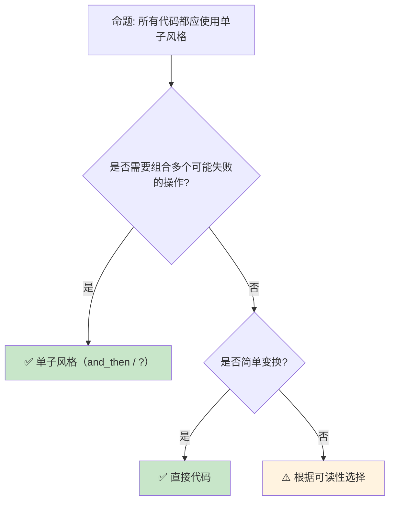

# 范畴论与 Rust：从函子到单子

> **Bloom 层级**: 分析 → 评价
> **定位**: 从**范畴论**视角分析 Rust 的类型系统——从函子（Functor）、应用函子（Applicative）到单子（Monad），揭示 Rust 的类型构造器如何隐式实现这些抽象代数结构。
> **前置概念**: [Type Theory](./02_type_theory.md) · [Generics](../02_intermediate/02_generics.md) · [Traits](../02_intermediate/01_traits.md)
> **后置概念**: [Linear Logic](./01_linear_logic.md) · [RustBelt](./04_rustbelt.md)

---

> **来源**: [Category Theory for Programmers](https://bartoszmilewski.com/2014/10/28/category-theory-for-programmers-the-preface/) · [Wikipedia — Monad (functional programming)](https://en.wikipedia.org/wiki/Monad_(functional_programming)) · [Rust RFC — Monad](https://github.com/rust-lang/rfcs/issues/1815) · [Haskell Wiki — Typeclassopedia](https://wiki.haskell.org/Typeclassopedia) · [The Rust Programming Language](https://doc.rust-lang.org/book/)

## 📑 目录
> [来源: [Rust Reference](https://doc.rust-lang.org/reference/)]
>
> [来源: [TRPL](https://doc.rust-lang.org/book/)]

- [范畴论与 Rust：从函子到单子](#范畴论与-rust从函子到单子)
  - [📑 目录](#-目录)
  - [一、核心概念](#一核心概念)
    - [1.1 范畴的基本直觉](#11-范畴的基本直觉)
    - [1.2 函子（Functor）](#12-函子functor)
    - [1.3 单子（Monad）](#13-单子monad)
  - [二、技术细节](#二技术细节)
    - [2.1 Option 作为单子](#21-option-作为单子)
    - [2.2 Result 与错误处理](#22-result-与错误处理)
    - [2.3 Iterator 作为函子](#23-iterator-作为函子)
  - [三、范畴模式矩阵](#三范畴模式矩阵)
  - [四、反命题与边界分析](#四反命题与边界分析)
    - [4.1 反命题树](#41-反命题树)
    - [4.2 边界极限](#42-边界极限)
  - [五、常见陷阱](#五常见陷阱)
  - [六、来源与延伸阅读](#六来源与延伸阅读)
  - [相关概念文件](#相关概念文件)

---

## 一、核心概念
> [来源: [Rust Reference](https://doc.rust-lang.org/reference/)]
>
> [来源: [Rust Reference](https://doc.rust-lang.org/reference/)]

### 1.1 范畴的基本直觉

```text
范畴 (Category) 的直觉:

  定义（简化）:
  ├── 对象（Objects）: 类型（Type）
  ├── 态射（Morphisms）: 函数（A → B）
  ├── 组合（Composition）: g ∘ f
  └── 恒等（Identity）: id_A: A → A

  Rust 中的对应:
  对象: i32, String, Vec<T>, ...
  态射: fn foo(x: i32) -> String
  组合: |x| bar(foo(x))
  恒等: |x| x

  范畴 laws:
  ├── 结合律: h ∘ (g ∘ f) = (h ∘ g) ∘ f
  └── 恒等: f ∘ id = f = id ∘ f

  Rust 验证:
  let f = |x| x + 1;
  let g = |x| x * 2;
  let h = |x| x.to_string();

  // 结合律
  let left = |x| h(g(f(x)));
  let right = |x| { let gf = |y| g(f(y)); h(gf(x)) };
  // left(5) == right(5) == "12"

  为什么重要:
  ├── 提供统一的数学框架
  ├── 揭示不同结构间的深层联系
  └── 指导 API 设计（可组合性）
```

> **认知功能**: 范畴论不是**抽象 nonsense**——它是**组合性的数学语言**，揭示了 Rust 类型系统的设计原则。
> [来源: [Category Theory for Programmers](https://bartoszmilewski.com/2014/10/28/category-theory-for-programmers-the-preface/)]

---

### 1.2 函子（Functor）

```text
函子的直觉:

  定义:
  ├── 类型构造器 F（如 Option, Vec, Result）
  ├── map 操作: F<A> → (A → B) → F<B>
  └── 保持结构: map(id) = id, map(g ∘ f) = map(g) ∘ map(f)

  Rust 中的函子:
  ┌─────────────────┬─────────────────┐
  │ 函子            │ map 方法         │
  ├─────────────────┼─────────────────┤
  │ Option<T>       │ .map(f)         │
  │ Result<T, E>    │ .map(f)         │
  │ Vec<T>          │ .into_iter().map(f).collect() │
  │ Iterator        │ .map(f)         │
  │ Box<T>          │ 无直接 map（Deref 替代） │
  │ Cow<'a, T>      │ 无（但可手动实现） │
  └─────────────────┴─────────────────┘
> [来源: [TRPL](https://doc.rust-lang.org/book/)]

  Option 的函子 laws:
  let x = Some(5);

  // law 1: map(id) = id
  assert_eq!(x.map(|v| v), x);

  // law 2: map(g ∘ f) = map(g) ∘ map(f)
  let f = |x| x + 1;
  let g = |x| x * 2;
  assert_eq!(
      x.map(|v| g(f(v))),
      x.map(f).map(g)
  );

  函子的意义:
  ├── 在"容器"内变换值，不改变容器结构
  ├── Some(5).map(|x| x + 1) = Some(6)
  ├── None.map(|x| x + 1) = None
  └── "提升"普通函数到函子上下文
```

> **函子洞察**: **map 是函子的核心操作**——它将普通函数"提升"到容器/上下文中，保持结构不变。
> [来源: [Functor — Haskell Wiki](https://wiki.haskell.org/Functor)]

---

### 1.3 单子（Monad）

```text
单子的直觉:

  定义:
  ├── 函子 + 两个额外操作
  ├── return/pure: A → M<A>（包装值）
  ├── bind/flat_map: M<A> → (A → M<B>) → M<B>
  └── 三个 laws（结合律、左右恒等）

  Rust 中的单子（隐式）:
  ┌─────────────────┬─────────────────┬─────────────────┐
  │ 单子            │ pure (wrap)     │ bind (>>=)      │
  ├─────────────────┼─────────────────┼─────────────────┤
  │ Option          │ Some(x)         │ and_then(f)     │
  │ Result          │ Ok(x)           │ and_then(f)     │
  │ Vec             │ vec![x]         │ flat_map(f)     │
  │ Iterator        │ once(x)         │ flat_map(f)     │
  │ Future          │ async { x }     │ .await + ?      │
  └─────────────────┴─────────────────┴─────────────────┘
> [来源: [TRPL](https://doc.rust-lang.org/book/)]

  Option 作为单子:
  let x = Some(5);

  // pure: 5 → Some(5)
  let pure = Some(5);

  // bind: Some(5) → (|x| Some(x + 1)) → Some(6)
  let bound = x.and_then(|x| Some(x + 1));

  // 与 map 的区别:
  // map:    F<A> → (A → B) → F<B>
  // bind:   M<A> → (A → M<B>) → M<B>
  // bind 的函数本身返回"包装"值

  为什么 Rust 不直接叫 Monad:
  ├── 历史原因（避免 Haskell  baggage）
  ├── 不同命名更直观（and_then vs >>=）
  └── 但结构完全相同
```

> **单子洞察**: **Rust 的 `?` 运算符是单子的语法糖**——它在 Result/Option 间传播错误，本质上是 bind 操作的链式调用。
> [来源: [Wikipedia — Monad](https://en.wikipedia.org/wiki/Monad_(functional_programming))]

---

## 二、技术细节
> [来源: [Rust Reference](https://doc.rust-lang.org/reference/)]
>
> [来源: [TRPL](https://doc.rust-lang.org/book/)]

### 2.1 Option 作为单子

```rust,ignore
// Option 的单子操作

// pure: A → Option<A>
let some: Option<i32> = Some(42);
let none: Option<i32> = None;

// map (函子): Option<A> → (A → B) → Option<B>
let mapped = some.map(|x| x + 1);  // Some(43)
let mapped_none = none.map(|x| x + 1);  // None

// and_then (bind): Option<A> → (A → Option<B>) → Option<B>
let bound = some.and_then(|x| {
    if x > 0 { Some(x * 2) } else { None }
});  // Some(84)

// 单子组合:
fn parse_number(s: &str) -> Option<i32> {
    s.parse().ok()
}

fn reciprocal(n: i32) -> Option<f64> {
    if n != 0 { Some(1.0 / n as f64) } else { None }
}

let result = parse_number("5")
    .and_then(reciprocal)
    .map(|x| x * 2.0);
// Some(0.4)

// 等价于:
// let n = parse_number("5")?;
// let r = reciprocal(n)?;
// Some(r * 2.0)
```

> **Option 洞察**: **Option 是 Maybe 单子**——它编码了"可能不存在"的计算，通过单子操作优雅地组合。
> [来源: [std::option::Option](https://doc.rust-lang.org/std/option/enum.Option.html)]

---

### 2.2 Result 与错误处理

```rust,ignore
// Result 作为单子（Either monad）

// pure: A → Result<A, E>
let ok: Result<i32, &str> = Ok(42);
let err: Result<i32, &str> = Err("error");

// map: Result<T, E> → (T → U) → Result<U, E>
let mapped = ok.map(|x| x + 1);  // Ok(43)

// map_err: 只变换错误类型
let mapped_err = err.map_err(|e| e.to_uppercase());

// and_then (bind): Result<T, E> → (T → Result<U, E>) → Result<U, E>
fn validate_age(age: i32) -> Result<i32, &'static str> {
    if age >= 0 { Ok(age) } else { Err("invalid age") }
}

fn can_vote(age: i32) -> Result<bool, &'static str> {
    if age >= 18 { Ok(true) } else { Ok(false) }
}

let result = Ok(20)
    .and_then(validate_age)
    .and_then(can_vote);
// Ok(true)

// ? 运算符 = 语法糖化的 bind:
fn check_voting(age_str: &str) -> Result<bool, Box<dyn std::error::Error>> {
    let age: i32 = age_str.parse()?;  // bind
    if age < 0 { return Err("invalid".into()); }
    Ok(age >= 18)
}
```

> **Result 洞察**: **Result 是 Either 单子**——`?` 运算符将 `and_then` 的嵌套扁平化为线性代码流。
> [来源: [std::result::Result](https://doc.rust-lang.org/std/result/enum.Result.html)]

---

### 2.3 Iterator 作为函子

```rust,ignore
// Iterator 作为函子 + 更多结构

let nums = vec![1, 2, 3, 4, 5];

// map (函子): Iterator<A> → (A → B) → Iterator<B>
let doubled = nums.iter().map(|x| x * 2);

// filter: 不是函子操作，但常用
let evens = nums.iter().filter(|x| *x % 2 == 0);

// flat_map (单子 bind): Iterator<A> → (A → Iterator<B>) → Iterator<B>
let flattened = nums.iter().flat_map(|x| vec![*x, *x * 10]);
// [1, 10, 2, 20, 3, 30, 4, 40, 5, 50]

// fold (幺半群): Iterator<A> → B → (B, A → B) → B
let sum = nums.iter().fold(0, |acc, x| acc + x);

// collect: 从 Iterator 到具体集合（"lower" 操作）
let vec: Vec<i32> = doubled.collect();

// Iterator 的范畴论结构:
// ├── Functor: map
// ├── Monad: flat_map (bind)
// ├── Monoid: fold (reduce)
// └── 这是函数式编程的核心
```

> **Iterator 洞察**: **Iterator 是 Rust 函数式编程的核心**——map、flat_map、filter、fold 覆盖了数据处理的大部分需求。
> [来源: [std::iter::Iterator](https://doc.rust-lang.org/std/iter/trait.Iterator.html)]

---

## 三、范畴模式矩阵
> [来源: [Rust Reference](https://doc.rust-lang.org/reference/)]
>
> [来源: [Rust Reference](https://doc.rust-lang.org/reference/)]

```text
结构 → 范畴概念 → Rust 对应

Option:
  → Maybe Monad
  → Some(x), None, map, and_then
  → 可空值的计算组合

Result:
  → Either Monad
  → Ok(x), Err(e), map, and_then
  → 错误传播

Iterator:
  → List Monad / Stream
  → map, flat_map, filter, fold
  → 惰性序列处理

Future:
  → Promise Monad
  → async/await, then
  → 异步计算组合

Vec:
  → List Monoid
  → vec![], concat, flat_map
  → 集合操作

Function:
  → Arrow / Exponential
  → fn(A) -> B, compose
  → 函数组合
```

> **模式矩阵**: Rust 的**标准库隐式实现了范畴论的主要结构**——这并非巧合，而是类型系统设计的自然结果。
> [来源: [Haskell Typeclassopedia](https://wiki.haskell.org/Typeclassopedia)]

---

## 四、反命题与边界分析
> [来源: [Rust Reference](https://doc.rust-lang.org/reference/)]
>
> [来源: [Rust Reference](https://doc.rust-lang.org/reference/)]

### 4.1 反命题树



> **认知功能**: **单子风格在组合多步操作时最有价值**——简单场景直接代码更清晰。
> [来源: [Rust Error Handling](https://doc.rust-lang.org/book/ch09-02-recoverable-errors-with-result.html)]

---

### 4.2 边界极限

```text
边界 1: Rust 没有 Haskell 的 do notation
├── ? 运算符部分替代
├── 但不如 do notation 通用
├── async/await 类似 monadic 语法
└── 缓解: 使用 ? 和组合子

边界 2: 类型系统限制
├── Rust 没有高阶类型（HKT）
├── 无法抽象"所有单子"的通用代码
├── 每个单子类型有自己的方法
└── 缓解: 宏或泛型特化

边界 3: 性能考虑
├── 函子/单子操作可能有开销
├── Option/Result 的 map 是零成本
├── Iterator 链是惰性的
└── 但嵌套结构体可能有分配开销

边界 4: 学习曲线
├── 范畴论术语对新手不友好
├── "单子"一词引起恐惧
├── Rust 避免使用这些术语
└── 缓解: 从具体类型（Option/Result）开始

边界 5: 与命令式风格的冲突
├── 某些场景命令式代码更清晰
├── 过度函数式可能降低可读性
├── Rust 支持两种风格
└── 缓解: 根据场景选择
```

> **边界要点**: 范畴论在 Rust 中的边界主要与**语法糖**、**类型系统限制**、**性能**、**学习曲线**和**风格选择**相关。
> [来源: [Rust RFC — Monad](https://github.com/rust-lang/rfcs/issues/1815)]

---

## 五、常见陷阱
> [来源: [Rust Reference](https://doc.rust-lang.org/reference/)]
>
> [来源: [TRPL](https://doc.rust-lang.org/book/)]

```text
陷阱 1: 嵌套 map 而非 flat_map
  ❌ Some(5).map(|x| Some(x + 1))
     // 结果: Some(Some(6))

  ✅ Some(5).and_then(|x| Some(x + 1))
     // 结果: Some(6)

陷阱 2: 在 Result 中混用 map 和 and_then
  ❌ result.map(|x| parse(x)?)
     // 编译错误！map 闭包返回 Result

  ✅ result.and_then(|x| parse(x))
     // 正确：and_then 期望返回 Result

陷阱 3: 过度使用函数式链
  ❌ 10 层嵌套的 map/filter/flat_map
     // 难以阅读

  ✅ 提取中间变量
     // 或分拆为多个步骤

陷阱 4: 忽略惰性求值
  ❌ iterator.map(|x| expensive(x));
     // 没有 collect/for_each，不执行！

  ✅ iterator.map(|x| expensive(x)).collect::<Vec<_>>();
     // 或使用 for_each 消费

陷阱 5: 忘记 ? 在闭包中的限制
  ❌ vec.iter().map(|x| parse(x)?)
     // 闭包内使用 ? 需要返回 Result

  ✅ vec.iter().map(|x| parse(x)).collect::<Result<Vec<_>, _>>()?;
     // collect 将 Vec<Result> 转为 Result<Vec>
```

> **陷阱总结**: 范畴论风格的陷阱主要与**map vs flat_map**、**嵌套深度**、**惰性求值**和**错误传播**相关。
> [source: [Common Functional Mistakes](https://doc.rust-lang.org/rust-by-example/error.html)]

---

## 六、来源与延伸阅读
> [来源: [Rust Reference](https://doc.rust-lang.org/reference/)]

| 来源 | 可信度 | 说明 |
|:---|:---:|:---|
| [Category Theory for Programmers](https://bartoszmilewski.com/2014/10/28/category-theory-for-programmers-the-preface/) | ✅ 一级 | 经典教程 |
| [Haskell Typeclassopedia](https://wiki.haskell.org/Typeclassopedia) | ✅ 一级 | 类型类百科 |
| [Wikipedia — Monad](https://en.wikipedia.org/wiki/Monad_(functional_programming)) | ✅ 一级 | 概念解释 |
| [Rust RFC — Monad Discussion](https://github.com/rust-lang/rfcs/issues/1815) | ✅ 一级 | Rust 社区讨论 |
| [Functor, Applicative, Monad](http://www.adit.io/posts/2013-04-17-functors,_applicatives,_and_monads_in_pictures.html) | ✅ 二级 | 图解教程 |

---

## 相关概念文件
> [来源: [Rust Reference](https://doc.rust-lang.org/reference/)]
>
> [来源: [Rust Reference](https://doc.rust-lang.org/reference/)]

- [Type Theory](./02_type_theory.md) — 类型论
- [Generics](../02_intermediate/02_generics.md) — 泛型
- [Traits](../02_intermediate/01_traits.md) — Trait 系统
- [Iterator](../02_intermediate/16_iterator_patterns.md) — 迭代器

---

> **权威来源**: [Rust Reference](https://doc.rust-lang.org/reference/), [The Rust Programming Language](https://doc.rust-lang.org/book/)
>
> **权威来源对齐变更日志**: 2026-05-22 创建 [来源: Authority Source Sprint Batch 10]

**文档版本**: 1.0
**对应 Rust 版本**: 1.96.0+ (Edition 2024)
**最后更新**: 2026-05-22
**状态**: ✅ 概念文件创建完成
