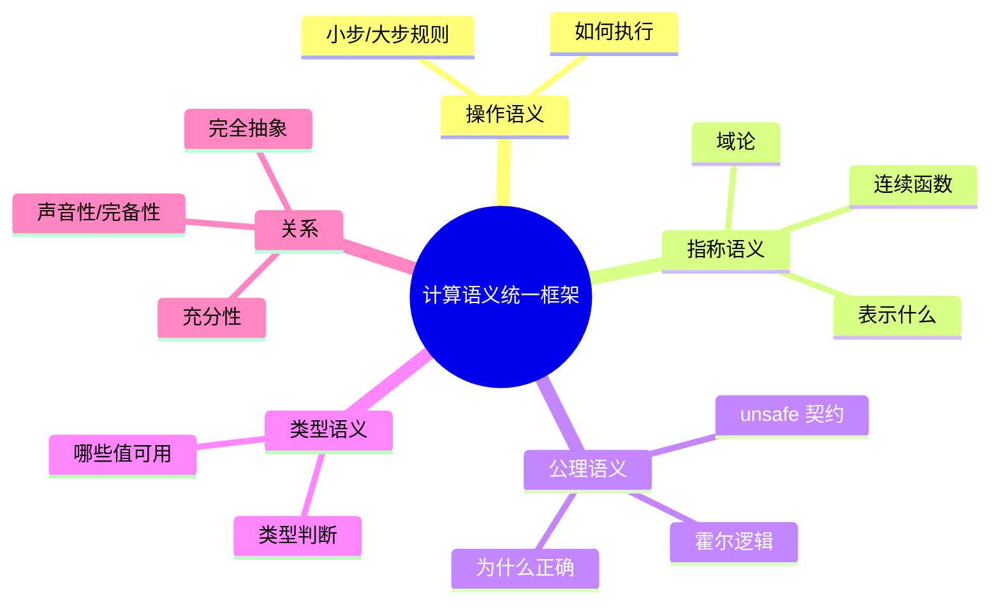

> **内容分级**: [专家级]

# 计算语义统一框架（A Unified Framework of Computational Semantics）

> **EN**: A Unified Framework of Computational Semantics
> **Summary**: Unifying operational, denotational, axiomatic, and type semantics as four complementary lenses on the same computational reality.

> **Rust 版本**: 1.97.0+ (Edition 2024)
> **Bloom 层级**: L4-L5
> **权威来源**: 本文件为 `concept/` 权威页。
> **定位**: 把操作、指称、公理、类型四种语义统一为观察同一程序行为的四种互补视角，为后续可计算性、形式语言与程序等价性讨论奠定共同语言。
> **前置概念**: [Async/Await](../../03_advanced/01_async/01_async.md) · [Lambda Calculus](../00_type_theory/05_lambda_calculus.md) · [Type Theory](../00_type_theory/01_type_theory.md)
> **后置概念**: [Computability Theory](02_computability_theory.md) · [Mathematical Functions of Computation](04_mathematical_functions_of_computation.md) · [Equivalence of Computational Models](05_equivalence_of_computational_models.md)

---

## 📑 目录

- [计算语义统一框架（A Unified Framework of Computational Semantics）](#计算语义统一框架a-unified-framework-of-computational-semantics)
  - [📑 目录](#-目录)
  - [一、核心概念](#一核心概念)
    - [1.1 四种语义风格](#11-四种语义风格)
    - [1.2 它们之间的关系](#12-它们之间的关系)
    - [1.3 Rust 示例：`let x = 1 + 1`](#13-rust-示例let-x--1--1)
    - [1.4 `unsafe` 作为公理契约](#14-unsafe-作为公理契约)
  - [二、反命题与边界分析](#二反命题与边界分析)
  - [三、相关概念](#三相关概念)
  - [四、嵌入式测验（Embedded Quiz）](#四嵌入式测验embedded-quiz)
    - [测验 1：四种语义的核心问题（理解层）](#测验-1四种语义的核心问题理解层)
    - [测验 2：`unsafe` 的最合适语义视角（分析层）](#测验-2unsafe-的最合适语义视角分析层)
    - [测验 3：指称语义的普遍性（评价层）](#测验-3指称语义的普遍性评价层)
  - [五、权威来源索引](#五权威来源索引)
  - [六、🧭 思维导图（Mindmap）](#六-思维导图mindmap)

---

## 一、核心概念

### 1.1 四种语义风格

程序语义回答「这段代码是什么意思」。不同语义风格关注不同问题：

```text
四种语义风格：
┌─────────────────┬─────────────────┬─────────────────┐
│ 语义风格        │ 核心问题        │ 典型工具/符号   │
├─────────────────┼─────────────────┼─────────────────┤
│ 操作语义        │ 如何执行        │ 转换规则 e → e' │
│ 指称语义        │ 表示什么数学对象│ 函数 ⟦e⟧ : D → D│
│ 公理语义        │ 为什么正确      │ 霍尔三元组 {P}C{Q}│
│ 类型语义        │ 哪些值可以使用  │ 类型判断 Γ ⊢ e:T│
└─────────────────┴─────────────────┴─────────────────┘
```

- **操作语义（Operational）**：用抽象机器或重写规则描述「程序一步一步如何运行」。
- **指称语义（Denotational）**：把程序映射为数学对象（通常是域上的连续函数），强调「程序表示什么」。
- **公理语义（Axiomatic）**：用霍尔逻辑 `{P} C {Q}` 描述命令前后断言关系，强调「程序满足什么规约」。
- **类型语义（Type）**：把类型视为对程序行为的静态分类，回答「哪些值可以出现在哪些位置」。

---

### 1.2 它们之间的关系

四种语义并非竞争关系，而是同一程序的不同投影：

```text
关键关系：
├── 充分性（Adequacy）：操作语义与指称语义在可观察行为上一致
│   └── ⟦e⟧ = ⟦e'⟧  ⇒  e 与 e' 在操作语义下不可区分
├── 完全抽象（Full Abstraction）：
│   └── e 与 e' 在操作语义下不可区分 ⇔ ⟦e⟧ = ⟦e'⟧
├── 公理语义的声音性（Soundness）：
│   └── 若 ⊢ {P} C {Q}，则任何满足 P 的初始状态执行 C 后都满足 Q
└── 公理语义的完备性（Completeness）：
    └── 若 C 确实把 P 状态变为 Q 状态，则 ⊢ {P} C {Q} 可证
```

> **认知要点**：没有哪一种语义能回答所有问题。证明编译器正确性常用操作语义；证明程序等价性常用指称语义；验证安全属性常用公理语义；静态保证则依赖类型语义。

---

### 1.3 Rust 示例：`let x = 1 + 1`

对同一条 Rust 语句，四种语义给出不同描述：

```text
let x = 1 + 1;

操作语义：
  ⟨1 + 1, σ⟩ → ⟨2, σ⟩
  ⟨let x = 2, σ⟩ → ⟨(), σ[x ↦ 2]⟩

指称语义：
  ⟦let x = 1 + 1⟧(σ) = σ[x ↦ 2]

公理语义：
  {true} let x = 1 + 1 {x = 2}

类型语义：
  Γ ⊢ 1 + 1 : i32
  Γ, x:i32 ⊢ let x = 1 + 1 : ()
```

```rust
fn main() {
    let x = 1 + 1;
    assert_eq!(x, 2);
}
```

---

### 1.4 `unsafe` 作为公理契约

Rust 的 `unsafe` 块可以被理解为一种**公理契约**：调用者承诺满足某些前置条件，编译器则信任这些承诺并允许执行超出 safe 子集的操作。

```text
unsafe { *ptr = 0; }

公理视角：
  { ptr 有效 ∧ ptr 对齐 ∧ 无数据竞争 }
    unsafe { *ptr = 0; }
  { *ptr = 0 }

如果前置条件不满足，操作语义进入未定义行为（UB）状态，
指称语义可能无定义，类型语义也无法保证内存安全。
```

```rust
fn main() {
    let mut x = 0;
    let ptr = &mut x as *mut i32;
    unsafe {
        *ptr = 42;
    }
    assert_eq!(x, 42);
}
```

> **来源**: [Rust Reference — Unsafe blocks](https://doc.rust-lang.org/reference/unsafe-keyword.html#unsafe-blocks) · [Rustonomicon](https://doc.rust-lang.org/nomicon/index.html)

---

## 二、反命题与边界分析

一个常见误判是：**「每种语言都有现成的指称语义」**。事实上，指称语义需要为语言构造找到合适的数学空间（domain）。对于无类型 λ 演算加无限制递归，直接构造集合论函数会导致悖论，必须引入**Scott 域（Scott domain）**和**连续函数（continuous functions）**才能给出一致的指称语义。

```text
反命题：指称语义总是存在。
├── 错误：无类型 λ 演算 + 无限制递归不能直接用普通集合论函数解释
├── 修正：需要域论（domain theory）和 Scott 连续函数
└── 边界：某些语言构造（如反射、任意宏展开）至今仍无满意指称语义
```

> **来源**: [Scott & Strachey — Toward a Mathematical Semantics for Computer Languages](https://www.cs.ox.ac.uk/files/3232/PRG06.pdf) · [Winskel 1993 — The Formal Semantics of Programming Languages](https://mitpress.mit.edu/9780262731034)

---

## 三、相关概念

- [Lambda Calculus](../00_type_theory/05_lambda_calculus.md) — λ 演算与函数抽象
- [Operational Semantics](../03_operational_semantics/03_operational_semantics.md) — 程序行为的小步/大步规则
- [Denotational Semantics](../03_operational_semantics/01_denotational_semantics.md) — 程序到数学对象的映射
- [Axiomatic Semantics](../03_operational_semantics/05_axiomatic_semantics.md) — 霍尔逻辑与程序规约
- [Type Semantics](../00_type_theory/06_type_semantics.md) — 类型作为语义分类
- [Equivalence of Computational Models](05_equivalence_of_computational_models.md) — 模型等价与表达力

---

## 四、嵌入式测验（Embedded Quiz）

### 测验 1：四种语义的核心问题（理解层）

哪一种语义主要回答「程序一步一步如何执行」？

- A. 指称语义
- B. 操作语义
- C. 公理语义
- D. 类型语义

<details>
<summary>✅ 答案</summary>

**B. 操作语义**。操作语义用转换规则或抽象机器刻画执行步骤。
</details>

---

### 测验 2：`unsafe` 的最合适语义视角（分析层）

`unsafe` 块最适合用哪种语义框架理解？

- A. 指称语义中的连续函数
- B. 公理语义中的前置/后置条件契约
- C. 类型语义中的泛型约束
- D. 操作语义中的求值上下文

<details>
<summary>✅ 答案</summary>

**B. 公理语义中的前置/后置条件契约**。`unsafe` 块要求程序员保证前置条件，否则行为无定义。
</details>

---

### 测验 3：指称语义的普遍性（评价层）

「所有编程语言都可以直接构造集合论语义」这一说法是否正确？

- A. 正确
- B. 错误，递归构造通常需要域论
- C. 仅对函数式语言错误
- D. 仅对命令式语言错误

<details>
<summary>✅ 答案</summary>

**B. 错误，递归构造通常需要域论**。无类型 λ 演算等语言需要 Scott 域和连续函数才能避免自引用悖论。
</details>

---

## 五、权威来源索引

| 来源 | 可信度 | 说明 |
|:---|:---:|:---|
| [Plotkin 1981 — SOS](https://homepages.inf.ed.ac.uk/gdp/publications/sos_jlap.pdf) | ✅ 一级 | 结构化操作语义奠基 |
| [Winskel 1993 — Formal Semantics](https://mitpress.mit.edu/9780262731034) | ✅ 一级 | 形式语义教材 |
| [Pierce 2002 — TAPL](https://www.cis.upenn.edu/~bcpierce/tapl/) | ✅ 一级 | 类型与编程语言 |
| [Scott & Strachey — Denotational Semantics](https://www.cs.ox.ac.uk/files/3232/PRG06.pdf) | ✅ 一级 | 指称语义奠基 |
| [Rust Reference — Unsafe blocks](https://doc.rust-lang.org/reference/unsafe-keyword.html#unsafe-blocks) | ✅ 一级 | Rust unsafe 块语义 |

---

## 六、🧭 思维导图（Mindmap）


